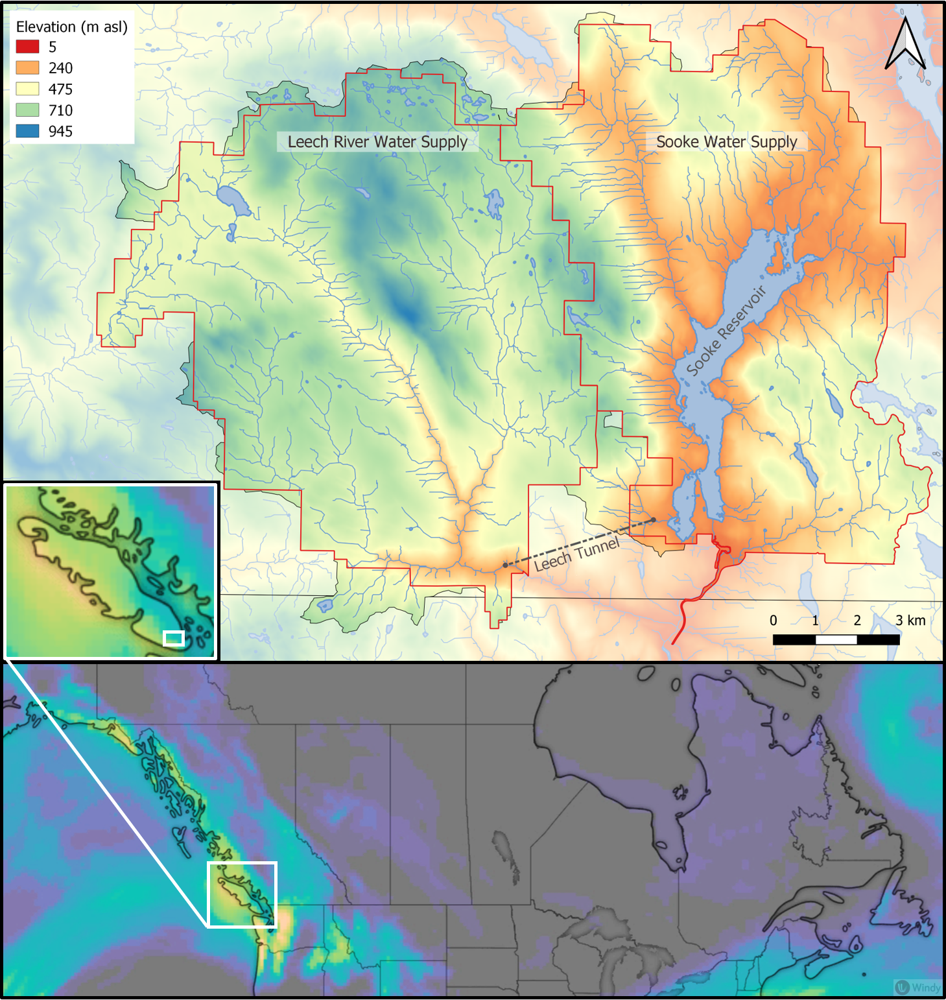

```{r methods-setup, include=FALSE}
knitr::opts_chunk$set(echo=FALSE, warning = FALSE)
```

```{r methods-packages, package.startup.message=FALSE, warning=FALSE, message=FALSE}
# load packages
library(tidyverse)  # dplyr + readr
library(knitr)      # tidy tables
```

##    Methods

###   Study Site: Leech River Watershed

The Leech River watershed is a sub-catchment of the Sooke River watershed, located west of Sooke Reservoir (primary water supply for the Greater Victoria Area). In anticipation of future water demands and uncertainty related to rainfall and climate change, the Capital Regional District (CRD) purchased about 92% of the Leech River watershed in 2007 (84%) and 2010 (additional 8%) and designated the Leech Water Supply Area (LWSA) for future supplemental source water. Figure \@ref(fig:GVWSAoverview) shows the Leech and Sooke Water Supply areas in context to their location on Vancouver Island, BC, Canada. 

\  

_Note on geospatial data, tools and mapping_

Geospatial data were collected from GeoGratis, the Government of Canada Geospatial Data Extraction tool (geogratis.gc.ca) with supplemental data provided by the CRD [^1]. 

Maps were created using QGIS (version 3.12.1, Bucuresti; www.qgis.org), and catchment boundaries were delineated using the QGIS GRASS plugin (GRASS GIS 7, version 2).

[^1]:   Any and all geospatial data provided by the CRD was used with permission from the Capital Regional District.

```{r GVWSAoverview, out.width = "50%", fig.pos="h", fig.cap = fig_cap}
fig_cap = "*Overview of the Leech and Sooke Water Supply Areas (Greater Victoria, CRD), located on southeastern Vancouver Island, British Columbia, Canada. Bottom image of Canada and inset of Vancouver Island were screenshots from the app 'Windy' (Prague, Czechia, EU); top map of the water supply areas was generated in QGIS (version 3.12.1 - Bucuresti)*"


```

\  

While monitoring programs began in 2017, the hydrology and water quality in the LWSA are poorly understood. The Leech River watershed includes three mainstem rivers (Cragg Creek, Leech River, and West Leech River) as well as several small headwater lakes (Weeks, Jarvis, and Worley) and wetlands (Jordan Meadows surrounding Weeks Lake and Lazar meadows north of Jarvis Lake). Runoff peaks in the winter under saturated conditions when rivers respond rapidly to precipitation events, rising and falling dramatically. Across the watershed, elevation ranges from approximately 200 m above sea level (asl), near the Leech Tunnel, to 941 m asl in the centre of the watershed, at the top of Survey Mountain. 

####    Climate, Weather, Forests

The Leech River watershed is in the Coastal Western Hemlock biogeoclimatic zone (CWH), with forests dominated by Douglas-fir (Pseudotsuga menziesii), western hemlock (Tsuga heterophylla) and western red cedar (Thuja plicata); subspecies include white pine (Pinus monticola), amabalis fir (Abies amabilis), alder (Alnus rubra), broad-leaf maple (Acer macrophyllum) and arbutus (Arbutus menziesii). The watershed also includes the moist and dry maritime sub-zones of the CWH (Montane moist 43%, submontane moist 38%, xeric 19%) [@Ussery2015]. While some precipitation occurs as snow at higher elevations, the majority of the ~2500 mm per year is rain (i.e., pluvial hydroclimatic regime). The water year can be broadly divided into wet and dry seasons where approximately 90% of precipitation falls from October to April, and May through September are relatively dry. 

\  

There are two weather stations which operated during the study period: Chris Creek station is located in the headwaters of the LWSA and Martin's Gulch station is located near the future diversion point (Tunnel). The CRD provided weather station data from Chris Creek and Martin's Gulch weather stations from January 2018 to March 2020. Rainfall and air temperature from each of the two LWSA weather stations is shown in Figure \@ref(fig:WxLWSA). Slightly more precipitation was recorded at Martin's Gulch than Chris Creek station. Annual weather data from each of the LWSA weather stations are summarized in Table \@ref(tab:WxLWSAdata). 

\  
 
```{r WxLWSA, out.width = "100%", fig.pos="h", fig.cap = fig_cap}
fig_cap = "\\label{fig:WxLWSA} *Weather from two stations in the Leech water supply area. Coloured sections of plots highlight the field study period of this project.*"

knitr::include_graphics("R-outputs_UBC-forWater-MSc_HMc/figures/Wx_LWSA.png")
```

\  


```{r WxLWSAdata}
read_csv("R-outputs_UBC-forWater-MSc_HMc/tables/Wx_LWSA-summary.csv", col_names = TRUE) %>% 
  knitr::kable(caption = "*Two years of weather from CRD stations in Leech water supply area*", 
               digits = c(2, 2, 2, 2, 1, 1))
``` 

\  

###   River sampling

Sixteen months of bi-weekly field work was completed with the goals of contributing to the characterization of the Leech Water Supply Area (LWSA) while furthering our understanding of the variability of dissolved organic matter (DOM) dynamics in hydrologic response across a second growth forested watershed. From November 2018 to February 2020, 446 total samples (Table \@ref(tab:samplecount)) were collected and analyzed at UBC for DOC concentration and DOM character via high temperature combustion and UV-Vis spectroscopy (respectively). In addition, two sets of replicate samples from four sites were sent to forWater partners at the University of Waterloo for source water analyses of drinking water treatability metrics; and an additional 42 samples were collected on behalf of the CRD for analysis of a suite of total metals at an external laboratory. 

\  

```{r samplecount}
read_csv("R-outputs_UBC-forWater-MSc_HMc/tables/summary_AllSamples_Count.csv", col_names = TRUE) %>% 
  knitr::kable(caption = "*Summary of samples collected*")
```

\  

####    Synoptic sampling 

```{r sampleSitesMap, out.width = "75%", fig.pos="h", fig.cap = fig_cap}
fig_cap = "\\label{fig:sampleSitesMap} *Synoptic sampling sites across the Greater Victoria Water Supply Areas (made with QGIS, version 3.12.1 - Bucuresti).*"

knitr::include_graphics("R-inputs_UBC-forWater-MSc_HMc/images/thesis_map_synoptic-sampling.png")
```

\  

Thirteen sites were selected for synoptic water sampling and water quality analysis. Results from synoptic sampling helped to inform spatiotemporal patterns in water quality. Synoptic samples were collected bi-weekly to monthly from October 2018 to February 2020; a total of 206 unique synoptic samples were collected (229 including replicates). Figure \@ref(fig:sampleSitesMap) shows the locations of the synoptically sampled sites. Grab sampling at these sites involved collecting river samples in triple-rinsed acid-washed 250mL amber HDPE bottles. Samples were capped with minimal headspace and transported on in a cooler (on ice) to the lab for analysis.  

#####   ? Collaborative sampling -- MARK SUGGESTS MOVING ALL THIS TO APPENDIX

__forWater-coordinated treatability analyses sites__

Four of the synoptic sampling sites were selected as treatability sampling sites, where source water was collected and shipped to collaborative researchers in the forWater Network for analyses of drinking water treatability metrics. The four treatability sites were: 


  1. Leech River at the future point of diversion (near Leech Tunnel inlet)
  2. Deception Reservoir, downstream from Deception Gulch (outlet of Leech Tunnel)
  3. Rithet Creek (main tributary to Sooke Reservoir)
  4. Judge Creek (2nd largest tributary to Sooke Reservoir)

\  

These sites were selected to represent future supplemental source water , the future balancing reservoir between the Leech and Sooke water supply areas, and the current tributary source waters to the Sooke Reservoir.

\  

Sets of samples were collected during winter of the 2020 water year (November 12, 2019 and February 18, 2020) and were shipped to the Universities of Alberta and Waterloo for treatability analyses. At the University of Waterloo, samples were analyzed for treatability parameters including: maximum potential disinfection byproduct formation potential (for trihalomethanes (THMs) and haloacetic acids (HAAs) in μg/L), pH, UV~254~(cm^-1^), DOC (mg/L), Turbidity (NTU), and Zeta Potential (mV). Relationships between disinfection by-product formation potentials (DBP-FPs), UV-absorbance at 254nm, and DOC concentrations were examined. 

At the University of Alberta, field-filtered samples were analyzed using a spectrofluorometer (for excitation emission matrices spectra), as well as an Fourier transform ion cyclotron resonance mass spectrometer to determine molecular characteristics of the DOM.


__Sampling for Metals__

Aquatic NOM can play an important role in the transport of metals because it has the physiochemical ability to act as a ligand to create coordinated complexes with metals. From November 2018 to July 2019, I collected eight sets of samples for metals analysis from the six sub-basin monitoring sites. Metals samples were collected on behalf of the CRD and were analyzed at Bureau Veritas Laboratories (BL Labs, formerly Maxxam Analytics Inc., Sidney, BC). For each metals sample collected, a parallel Grab sample was analyzed for DOC (at UBC). Reports from BL Labs were provided by the CRD (for the samples collected in association with this research) and data were used to evaluate relationships between DOC and metals in solution. 

\  

####    Sampling across nested catchments of the Leech watershed {#MethodsNestedCatch}

Across the Leech Water Supply Area (LWSA), six of the synoptic sampling sites were selected for more intensive monitoring. These sites represented the LWSA drainage basin defined from the the point of (future) diversion, the Leech Tunnel, and five sub-basins nested within the Leech Tunnel catchment. Figure \@ref(fig:subbasinMap) shows a map of the six monitoring sites which represent important portions of the Leech River system: two headwater streams (Weeks and Chris Creek), the head of Leech River (below the confluence of the two headwater streams), two mainstem rivers that feed the Leech (Cragg Creek and West Leech) and the Leech River at the Tunnel.	

\  

```{r subbasinMap, out.width = "50%", fig.pos="h", fig.cap = fig_cap}
fig_cap = "\\label{fig:subbasinMap} *Research sites in the Leech Water Supply Area. Sites are named and numbered, where the number indicates the sequence of vertical rack installations as well as the relative progression from headwaters to the mouth (Tunnel site). Each research basin (outlined by a thin black line) was delineated using the sampling site as the outlet (made with QGIS, version 3.12.1 - Bucuresti).*"

knitr::include_graphics("R-inputs_UBC-forWater-MSc_HMc/images/thesis_map_subbasin-sampling_with-numbers.png")
```

\  

Table \@ref(tab:WTScharacterSubbasinTable) includes watershed characteristic data for each sub-basin. Weeks creek (site-1), had the greatest proportion of wetland and open water compared to the other sub-basins. ChrisCrk (site-2) and CraggCrk (site-4) had no metasedimentary parent material (Argillite-Metagraywacke or Metagraywacke), and CraggCrk was the only sub-basin with predominantly metamorphic parent material (Wark-Gneiss, 78%). The sub-basin of WestLeech (site-5) was the site that did not have Wark-Gneiss nor Chert-Argillite-Volcanic groups as parent materials, and was the only sub-basin of the Metchosin igneous complex (16% Methchosin-volcanics). Like Weeks basin (site-1), which also drains from the West, WestLeech is predominantly underlain by Argillite-Metagreywacke (metasedimentary).       

\  

```{r WTScharacterSubbasinTable}
read_csv("R-inputs_UBC-forWater-MSc_HMc/study-sites_basin-characteristics.csv", col_names = TRUE) %>% 
  knitr::kable(caption = "*Watershed characteristics summary for study sites*")
```

\  

#####   Installations 

At each of the six monitoring sites, a vertical sampling rack was installed. These racks collect discrete water samples during the rising limb of stormflow, without employing costly pump-samplers. Each vertical rack also included a water level logger that recorded continuous stage (at ten-minute intervals).  Vertical sampling racks supplemented the synoptic sampling program by providing synchronized spatial resolution that would otherwise be difficult to achieve (i.e., multiple sites across the watershed), while collecting samples during flows that would otherwise be difficult or unsafe to access. Simultaneous stormflow sample collection can provide insights about relative hydrologic pulse responses across nested catchments [@Abbott2018].     

\  

The passive sampling bottles employ principles of a siphon design to collect river water as it reaches pre-determined levels on a vertical sampling rack. Siphon sampler bottles were based on a USGS single stage sediment sampler design (US U-59, 1961) which passively collect discrete water samples at a fixed stage on the rising limb of the hydrograph [@Graczyk2000]. The siphon samplers built for this research were 250 mL amber HDPE widemouth bottles with augmented screw caps. The caps were fit with two 1/4" (OD) stainless steel tubes, one longer than the other, both with a 180$^\circ$ bend at the top end.

\  

Each rack included a central stilling well (3.81cm (1.5") PCV pipe with 1.27 cm (1/2") holes along the length) with a measuring tape affixed to the front. Inside the stilling well was an Odyssey Capacitance Water Level Logger (Dataflow Systems Ltd., New Zealand); and on either side of the central stilling well was a slotted offset angle bar onto which hose clamps held sample bottles fit with custom siphon lids (Figure \@ref(fig:verticalRack)). By combining the height at which each siphon bottle filled with observed stage from the stilling-well tape and level-logger data, the date and time for each rising-stage sample collection was determined. 

\  

```{r verticalRack, out.width = "30%", fig.pos="h", fig.cap = fig_cap}
fig_cap = "\\label{fig:verticalRack} *Vertical sampling rack and siphon sampler bottle, illustrative of installations at six sites across the LWSA (shown here is Chris Creek (site 2).*"

knitr::include_graphics("R-inputs_UBC-forWater-MSc_HMc/images/Rack_diagram_full.png")
```

\  

These vertical racks collected whole water samples on the rising limb of the hydrograph. The rising limb has been shown to have higher DOC concentration than low flows between storm pulses [@Yang2015; @Raymond2016; @Raymond2010; @Zarnetske2018]. Increasing DOC on the rising limb indicates that source material is not limited and flux is driven by hydrologic connectivity; whereas source limited conditions likely drive DOM dynamics if DOC concentration decreases on the rising limb [@Zarnetske2018]. Analysis of rack samples clarifies the magnitude and direction of water quality changes in response to precipitation relative, which provides information about solute supply and hydrologic connectivity [@Vidon2008; @Abbott2018; @Creed2015; @Zarnetske2018].

######    Siphon sampler assumptions: vertical rack sampling QA/QC 

Rising level siphon samplers collect water from approximately 5cm below the surface (top of intake tube to inlet orifice). Data related to rack samples relies on two key assumptions: the water column is well mixed (no stratification) therefore the sample is representative of water quality at each sampling stage; and the sample is discrete such that there is no infiltration or mixing after the sample is collected. Based on the velocity and turbulence associated with flows in the step-pool formation of the sub-basins, the assumption of unstratified waters seems very reasonable. The assumption of sample discretion was validated in lab using food colouring and a flow-through bucket system where a tap water sample was collected by siphon sample bottle, food colouring was added to flow system after sample collection and circulated for 15 minutes, then the sample bottle was removed from dye chamber and the colour of the sample was compared to surrounding dyed water. There was no dye present in sample bottle following this test, which was repeated five times with different siphon-lid bottles. 

######    Sample hold-times and temperatures: vertical rack sampling QA/QC

Every effort was made to retrieve rack samples as quickly as possible from the racks; none the less, some samples remained on a rack for more than a few days due to logistical, access and safety considerations. Hobo TidbiT temperature sensors were deployed at each vertical rack to monitor air and water temperature, which was used in estimates of sample stability between sample collection and retrieval from racks. 

Hold-time experiments were performed to assess sample stability. The hold-time experiments included replicate sample (n = 10) collection at a site, where half the samples were placed out of water on the vertical rack with siphon lids and the other half were returned to the lab for immediate analysis. Three hold-time experiments were completed such that the rack samples were left in the field for 11, 20 and 34 days before being retrieved and analyzed in comparison to their counterpart replicates (details in results section).       
	
###   Analytical techniques & data

Water samples were collected and transported via coolers (on ice) to UBC's EcoHydrology Lab for analysis of dissolved organic carbon (DOC) concentrations and indicators of NOM character. Samples were also measured for phosphate concentration using a colourmetric (ascorbic acid) orthophosphate test kit (HACH PO-19); each sample had phosphate concentrations below detectable limits (0.1 mg/L). 

	
####    Dissolved organic carbon (DOC) concentration and characterization

For quantification of DOC, samples were analyzed for non-purgeable organic carbon (NPOC) via High-Temperature Combustion (Method 5310-B) on a Shimadzu TOC-V [@StdMet2000]. For this method, samples were filtered with 0.45-micron PES filters, acidified to bring pH below 2, then sparged with hydrocarbon-free air to drive off inorganic carbon. Following sparging, samples were combusted to convert all organic carbon to carbon dioxide which was measured by non-dispersive infrared gas detector to quantify the DOC content of the sample [^2]. This method represents a direct measure of DOC; although small volatile organic compounds would be removed in the sparging process, most NOM compounds are of higher molecular weight and it is unlikely that NOM analytes would be lost [@StdMet2000; @Matilainen2011].

[^2]:   UBC-based laboratory analysis of river samples for DOC concentrations resulted in an overall accuracy of 3.7% assessed by analysis of 20 calibration verification standards.  

\  
 
Spectral properties of sample NOM were analyzed using a 'spectro::lyser' spectrophotometer (S::can, Vienna, Austria) which measures turbidity and the chromophoric portion of organic matter to estimate concentrations of total organic carbon (TOC), dissolved organic carbon (DOC), as well as nitrate-nitrogen (NO~3~^-^-N). For NOM to be detected by UV-Vis absorption, the molecules must absorb ultraviolet (UV) or visible (Vis) light, which relies on the electronic structure of the molecules. UV-Vis absorption requires the presence of conjugated pi-bond systems (i.e., chromophore) in the molecule, which are common in aromatic systems. Therefore, DOC quantified by the spectro::lyser is a proxy measure that represents the chromophoric component of DOM (CDOM), which is proportional to the samples' average aromaticity. The suite of molecules that comprise NOM generally have an aromatic character [@Weishaar2003]. Increasing aromaticity will lead to greater absorbance at longer wavelengths, therefore an absorbance spectrum can provide information about a samples molecular character. For example, absorption of near-UV wavelengths (i.e., 200-380 nm) is indicative of conjugated systems that are common to aromatic compounds; as such, specific UV absorbance at 254nm (SUVA~254~) has been adopted as a surrogate for DOM aromaticity and, to some extent, its reactivity [@Weishaar2003; @Chow2008]. The spectro::lyser measures absorbance from 200 nm to 750 nm wavelengths, across which several spectral indicies can be calculated. 


#####   SUVA~254~

Specific ultraviolet absorbance at 254nm (SUVA~254~) is the ratio of UV absorption (spectral absorbance coefficient, SAC, m^-1^) at 254nm wavelength, normalized to DOC concentration (mgL^-1^) (i.e., SAC~254~ divided by mgL^-1^-DOC) [@Weishaar2003]. SUVA~254~ correlates strongly with DOM aromaticity, and loosely with reactivity [@Weishaar2003; @Helms2008; @Chow2008]. A higher SUVA value indicates greater aromaticity, and a lower SUVA value indicates more alliphatic DOM. Because humic substances are more aromatic, SUVA~254~ is a good indicator of DOM from humic sources (i.e., allochthonous NOM) [@Weishaar2003; @Vidon2008; @Abbott2018]. 

\  

With respect to SUVA~254~ and drinking water treatability, it's important to consider the diversity of DOM and DBP species and the heterogeneous character contained in a water sample. While SUVA~254~ may indicate reactivity, it is not necessarily a strong indicator of DBP-FPs [@Weishaar2003; @Chow2008]. This is because some DBP precursor NOM components (e.g., alliphatics), which have negligible absorptivities in the UV-Vis range, may contribute to DBPs but not SUVA~254~; additionally, not all NOM with measurable SUVA~254~ will create DBPs [@Weishaar2003]. 

\  

SUVA~254~ is reported in units of liter per milligram carbon per meter (Lmg-C^-1^m^-1^) and was determined by dividing the UV absorbance measured at wavelength 254 nm by the DOC concentration (from NPOC on the Shimadzu TOC-V). 

#####   Spectral indices of NOM character
	
Based on full scan data from the Spectrolyser (250-700nm), several indices of NOM character were determined. In the absence of fluorescence excitation-emission matrices, or high resolution spectrometric methods, spectral slopes are a simple tool for getting at molecule character. Spectral slopes (i.e., the change in absorbance intensity over a range of wavelengths) are semi-quantitative indicators for assessing DOM molecular weights [@Helms2008]. Spectral slopes over the wavelength range of 275-295 nm (S~275-295~, likely range for absorption by poly-aromatic hydrocarbons with 2 or more rings) and 350-400 nm (S~350-400~) were calculated from linear regression of log~e~-transformed spectra (spectral absorbance coefficients, m^-1^) as indicated by Helms [-@Helms2008, p 958]. Slope ratio (S~R~) is a unitless value equal to the slope of spectral intensity over the wavelength range of 275-295 nm relative to the slope of spectral intensity over 350-400 nm. S~R~ is inversely proportional to CDOM molecular weight [@Helms2008].	
The ratio of absorbances at wavelengths 250 nm and 365 nm provides a quotient called E~2~:E~3~ which is inversely related to aromaticity and molecular size of aquatic humic solutes [@Peuravuori1997; @Helms2008]. E~2~:E~3~ values were calculated, along with S~R~ , to try to elucidate molecular character of DOM in samples. 		
