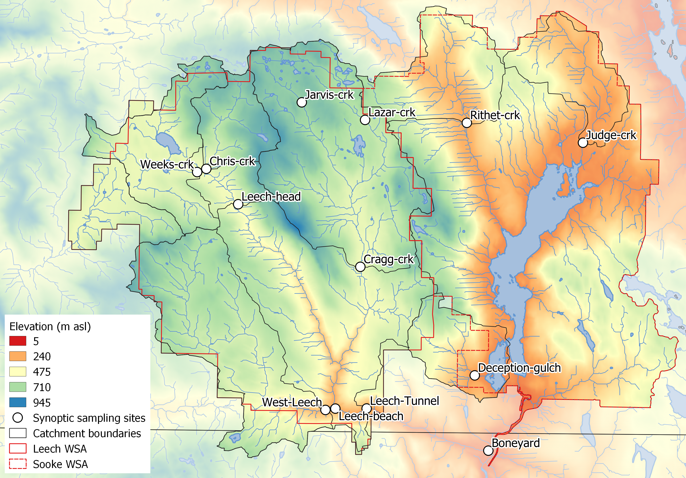
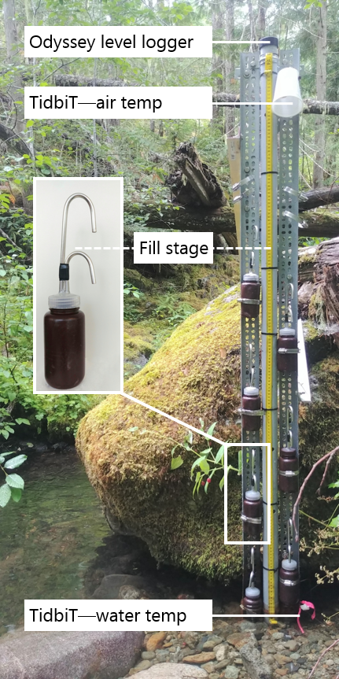

##	Spatial and temporal patterns in DOC & DOM

```{r, include = FALSE, package.startup.message = FALSE}

# load required packages
library(tidyverse)  # keep it tidy
library(readr)      # read in delimited files
library(knitr)      # for nice tables

knitr::opts_chunk$set(warning=FALSE, message=FALSE, echo=FALSE, fig.cap=TRUE)

```

### Introduction

*Research Question:* What are the ranges for DOC concentration and DOM character between adjacent drainage basins and among nested sub-catchments in the LWSA, and what influence does seasonality have on concentration and character of DOC?

*Research Objective:* Design a sampling strategy to measure the spatial and temporal variation of DOM & DOC, then describe spatiotemporal patterns that were observed.

### Methods

To measure the ranges of DOC concentration and DOM character over space and time, river sampling was conducted from October 2018 to February 2020. Water samples were collected and analyzed at UBC for DOC concentration and DOM character via high temperature combustion and UV-Vis spectroscopy, respectively (details follow in *'Analytical Techniques'*). The river sampling program designed for this project included synoptic sampling of 13 sites across the Greater Victoria Water Supply Area, as well as installation of monitoring and sampling stations at 6 sites in the Leech River watershed. 

####    Synoptic sampling 

```{r sampleSitesMap, out.width = "75%", fig.pos="h", fig.cap = fig_cap}
fig_cap = "\\label{fig:sampleSitesMap} *Synoptic sampling sites across the Greater Victoria Water Supply Areas.*"


```

\  

Thirteen river sites were selected for synoptic water sampling, and results of sample analyses were used to elucidate spatial and temporal patterns in DOM and DOC. 

The majority of synoptic sites were in the Leech WSA and a few rivers in the Sooke WSA were also included (Figure \@ref(fig:sampleSitesMap)). Rithet Creek is the largest tributary to Sooke Reservoir and Judge Creek is the second largest. Deception (gulch) is a small tributary to Deception Reservoir, which is separated from the south-west of Sooke Reservoir by a dam. The Leech River Tunnel (currently deactivated) terminates at Deception gulch, thus Deception Reservoir is a likely balancing reservoir for future inter-basin transfers. The Boneyard site is located on the Leech River, downstream of the Leech WSA (LWSA) boundary, upstream of the confluence of Leech River with Sooke River (downstream of the Sooke Reservoir and drinking water intake tower). 

In the LWSA, Lazar Creek and Jarvis Creek are headwater rivers of Cragg Creek, which is a major tributary to the Leech River. Chris Creek and Weeks Creek are headwater streams of Leech River. West Leech River is a major tributary to the Leech and Leech Beach site was located just downstream of the confluence of West Leech with Leech River. The Leech Tunnel site was located near the effective mouth of the LWSA, the Leech River Tunnel. 

Synoptic sampling involved collecting grab samples of river water at as many sites as possible over a relatively short time period (e.g. 1 day). River water was collected in triple-rinsed acid-wached 250mL high-density polyethylene (HDPE) wide-mouth amber bottles. Samples were capped with minimal head-space and transported in coolers with ice to the lab for analysis of dissolved organic carbon (DOC) concentrations and spectroscopic absorbance (an indicator of NOM character). All samples were refrigerated if they were held between collection and analysis. Grab samples collected for DOC quantification were filtered and acidified within 48 hours of collection, except for a set of *12* samples that were collected by CRD staff in January 2020 which were refrigerated for almost two weeks prior to filtration & acidification. Samples for NOM spectroscopy were not acidified and were measured unfiltered with confirmed turbidity of zero. 

####    Monitoring & sampling stations {#MethodsNestedCatch}

Six of the LWSA synoptic sampling sites were selected for more intensive monitoring. These sites represent the drainage area upstream of the Leech River Tunnel and five sub-basins nested within the Leech Tunnel catchment (Figure \@ref(fig:sampleSitesMap)). The sub-basins represent important portions of the Leech River system: two headwater streams (Weeks and Chris Creek, sites 1 & 2), the head of Leech River below the confluence of the two headwater streams (site 3), the two mainstem river tributaries that feed the Leech: Cragg Creek and West Leech (sites 4 & 5). Site 6 was located at the Leech River Tunnel, where the drainage area included the entire LWSA.	

\  

It was important to sample across the hydrograph in order to capture sample-sets that represented the variation in DOC and DOM that occurred during changing flow conditions (i.e., within storm variability). Additionally, event-based river samples collected near-simultaneously at sites across a watershed can provide insights about relative hydrologic pulse responses across nested catchments [@Abbott2018]. While synoptic grab sampling can cover a wide area over a relatively short period of time, it can be difficult to schedule a synoptic sampling campaign for specific weather and flow conditions, especially for short durations of rapid runoff (@Harmel2003). The Leech watershed system responds quickly to rainfall, and the logistics of grab sampling through events at multiple sites would have been very challenging for one person to accomplish and would have required site access beyond safe working hours (i.e., not logistically feasible). Furthermore, it can be dangerous to access river sites and/or manually collect river samples during high flows (@Graczyk2000; @Mackay2012). 

\  

Pump samplers or passive samplers can be used to collect water samples under difficult or unsafe conditions. A pump sampler (e.g., ISCO samplers, Teledyne ISCO, Inc., Lincoln, NE, USA; Global Water Instrumentation, Gold River, California) can be set up in the field and programmed to collect a set of water samples based on time interval or changes in conditions condition (e.g., stage or turbidity thresholds). Pump samplers are effective for automatic event-based sampling (@Harmel2003) but can be prohibitively expensive ($2K-3K CAD), and also require a reliable power source which can pose logistical challenged for setting up multiple sites in remote or difficult to access locations (@Mackay2012). A passive sampling alternative to a pump sampler is a siphon sampler, which automatically and effectively collects discrete water samples on the rising limb of the hydrograph (e.g.: @Mackay2012; @Graczyk2000; @Diehl2007). Siphon samplers are limited to sampling a single event and as of yet are not suitable for sampling the falling hydrograph limb; they are however very low cost, customizable and require no power. Based on cost, logistical considerations and curiosity, siphon sampling strategies were employed at the monitoring sites in the LWSA.   

\  

Siphon sampling bottles were used on vertical racks installed at each of the six sites to collect discrete water samples during the rising limb of the hydrograph. Vertical sampling racks were a cost-effective, logistically practical and reliable method of event-based sampling that enhanced the synoptic sampling program. In addition to passively collecting samples across the Leech watershed during increasing flow conditions, the vertical racks also recorded river stage and air/water temperatures (HOBO TidbiT v2 Temperature Data Logger, Onset, USA). 

Each vertical sampling rack included a central stilling well (3.81cm (1.5") PCV pipe with 1.27 cm (1/2") holes along the length) with a measuring tape affixed to the front. Inside the stilling well was an Odyssey Capacitance Water Level Logger (Dataflow Systems Ltd., New Zealand); and on either side of the central stilling well was a slotted offset angle bar onto which hose clamps held siphon sampler bottles (Figure \@ref(fig:verticalRack)). Custom-built siphon sampler bottles used in this research were based on a USGS single stage sediment sampler design (US U-59, 1961, [see @Graczyk2000]). Screw caps for 250mL amber HDPE wide-mouth bottles were augmented to include two 1/4" (O.D.) stainless steel tubes, one longer than the other, both with a 180$^\circ$ bend at the top end. Marine epoxy was used on the outside of siphon caps to ensure a water-tight seal around the inlet and exhaust (lower and upper tubes, respectively), and silicone sealant was added to the inside of lids. The siphon samplers collected water from approximately 5cm below the surface (distance between bend at top of intake tube to inlet orifice).  

```{r verticalRack, fig.cap = fig_cap}
fig_cap = "\\label{fig:verticalRack} *Vertical sampling rack and siphon sampler bottle, illustrative of installations at six sites across the LWSA (shown here is Chris Creek (site 2).*"


```

\  

Each time a monitoring site was visited, empty acid-washed sample bottles with siphon lids were set out on vertical racks and the stage at which each siphon bottle filled (the stilling-well measuring tape height corresponding to top of intake tube bend) was recorded. Samples were passively collected in my absence, and were retrieved on subsequent field trips. 

During data analysis, the observed stage at which each siphon bottle filled was references to level-logger data to determine the date and time of collection for each rising-stage sample. To the best of my knowledge, vertically staggered passive siphon samplers have not been combined with observed and continuously recorded stage to obtain time-stamps of sample collection. The time-stamps were used to asses temporal variability in DOC & DOM and to inform quality management of samples (below). Additionally, the time-stamp of event-based samples was used to inform stage-concentration relationships (Chapter 3).   

#####    Siphon sampler assumptions

The representativeness of vertical rack samples relied on on two key assumptions: (1) the water column was well mixed (no stratification) therefore the sample collected was representative of river water quality at each sampling stage; and (2) the sample was discrete, such that there was no infiltration or mixing between surrounding river water and the sample in the bottle once the sample was collected.

Based on turbulence associated with flows upstream of the vertical racks (step-pool formations), the assumption of fully mixed and unstratified water seems justified. Sample discretion was validated in lab using food colouring and a flow-through bucket system: a tap water sample was collected by siphon sample bottle, after sample collection food colouring was added to flow system and circulated for 15 minutes, then the sample bottle was removed from dye chamber and the colour of the sample was compared to surrounding dyed water. There was no dye present in sample bottle following this test, which was repeated five times with different siphon-lid bottles. 

#####    Rack sample hold-times and temperatures

Every effort was made to retrieve rack samples as quickly as possible from the racks following rain events. None the less, some samples remained on a rack for more than a few days due to logistical, access and safety considerations. 

Hold-time experiments were performed to assess river sample stability over periods between rack sample collection and retrieval. The hold-time experiments included replicate sample (n = 10) collection at a site, where half the samples were capped with siphon lids and placed out of water on the vertical rack and the other half of samples were immediately returned to the lab for analysis. Three sets of hold-time experiments were completed, such that the rack samples were left in the field for 11, 20 and 34 days before being retrieved, analyzed and compared to their counterpart replicates (details in results section). The temperature sensors installed at each vertical rack were used as part of the hold-time assessment for sample stability.

***discussion point***
...
The rising limb has been shown to have higher DOC concentration than low flows between storm pulses [@Yang2015; @Raymond2016; @Raymond2010; @Zarnetske2018]. Increasing DOC on the rising limb indicates that source material is not limited and flux is driven by hydrologic connectivity; whereas source limited conditions likely drive DOM dynamics if DOC concentration decreases on the rising limb [@Zarnetske2018]. Analysis of rack samples clarifies the magnitude and direction of water quality changes in response to precipitation relative, which provides information about solute supply and hydrologic connectivity [@Vidon2008; @Abbott2018; @Creed2015; @Zarnetske2018].
...


####   Laboraory analyses of water samples

Each water sample was transported from the field to the lab in a cooler with ice for quantification of dissolved organic carbon (DOC) and qualitative assessment of natural organic matter (NOM) molecular character. Aqueous forms of NOM in freshwater play important ecological roles, but can be problematic for drinking water treatment because they contribute to the formation of disinfection by-products, increase oxidant demand (e.g. chlorination), and cause other disruptions (e.g. short filter run times, microbial bio-fouling, coagulant demand). Because the backbone of NOM is carbon, DOC is a measure of the dissolved forms of NOM in a sample. While quantifying a sample's DOC is important in describing the amount of NOM, it tells us nothing about the structure (and therefore the function) of that NOM. Characterizing the molecular attributes of NOM in addition to its quantity provides greater insight. Therefore, both quantification and characterization of NOM were tackled for this project. Samples were also measured for phosphate concentration using a colourimetric (ascorbic acid) orthophosphate test kit (HACH PO-19); each water sample had phosphate concentration below detectable limits (0.1 mg/L).

##### Quantifying DOC (dissolved organic carbon)

To quantify dissolved organic carbon (DOC), the major constituent of natural organic matter, samples were analyzed for non-purgeable organic carbon (NPOC) via High-Temperature Combustion (Method 5310-B) on a Shimadzu TOC-V [@StdMet5310]. 

###### Sample preparation

Water samples were removed from refrigeration, brought to room temperature, inverted to mix (just in case), then filtered and acidified by hand. A clean 60 mL luer-lock syringe was pre-rinsed with sample water three times, then used to triple-rinse a vial (acid-washed 40 mL borosilicate amber glass vial) with filtered sample water. Samples were filtered using pre-rinsed (filter to waste) 0.45 μm polyethersulfone syringe filters [@Karanfil2003, @StdMet5310]. Each sample was syringe-filtered into its pre-rinsed vial and acidified to bring pH below 2 (200 μL of 4 M hydrochloric acid, reagent grade, into 35 mL filtered sample). Acidifying the samples converted any inorganic carbon species to aqueous carbon dioxide [@StdMet5310]. Filtered and acidified samples were sealed with Parafilm and place on the autosampler tray (Shimadzu ASI) for instrumental analysis.  

###### Instrumental analysis

In series, the Shimadzu autosampler sparged each sample vial with high purity hydrocarbon-free air (1 minute) to drive off dissolved inorganic carbon (leaving only dissolved organic carbon in the sample). Aliquots (80 μL) of sparged sample were then drawn into the TOC-V and catalytically combusted (Shimadzu standard catalyst with quartz wool) to convert all organic carbon into carbon dioxide which was measured by non-dispersive infrared gas detection to quantify sample NPOC (i.e. DOC). the instrument measured three to five aliquots from each vial to ensure the replicate measurements coefficient of variation (CV) was below 2% and standard deviation (SD) was below 0.1 mg/L. 

This method represents a direct quantitative measure of DOC; although small volatile organic compounds could be removed in the sparging process, most NOM compounds are of higher molecular weight (e.g. humic substances) and it is unlikely that DOC analytes would be lost [@StdMet5310; @Matilainen2011; @Aiken1995].

The first five vials of each analytic run contained lab grade water only, to (1) flush the system and (2) assess instrumental stability (i.e. precision). Files output by the TOC-V software included sample identification information, details of analytical processes and results including detected intensities and calculated NPOC concentrations. Concentration results were calculated from a selected calibration file. Calibration was completed each time the zero-air gas cylinder was replaced, and in one instance when the gas flow rate was adjusted. A five or six point calibration curve (0-30 mg/L organic carbon) was created with series made from a stock solution of anhydrous primary-standard grade potassium hydrogen phthalate. Calibration was verified regularly by including a 'cal-ver' in most sample trays (standard solution (labchecm.com, catalog No.LC129107) diluted to approximately 5 mg/L); these cal-vers resulted in an average accuracy of 3.7% (n=20).

##### Characterization of NOM (natural organic matter)

To assess the molecular character of NOM, samples were analyzed by UV-Vis spectroscopy (ultraviolet-visible light) using a spectro::lyser (S::can, Vienna, Austria). The spectro::lyser is a self-contained spectrophotometer and data-logger (with external power source) that measures turbidity and UV-Vis absorbance (i.e., light attenuation) across the wavelength range of 200 nm to 750 nm (recorded at 2.5 nm intervals). While the spectro::lyser is a field-deployable instrument, it was used in-lab for this project. 

For NOM to be detected by UV-Vis spectroscopy the molecules must absorb ultraviolet (UV) or visible (Vis) light, a physiochemical ability determined by the electronic structure of the molecules. UV-Vis absorption requires the presence of a conjugated pi-bond system (i.e., a chromophore) in the molecule, which is common in aromatic molecules. The suite of molecules that comprise NOM generally have more aromatic than aliphatic character [@Weishaar2003]. Increasing aromaticity will lead to greater absorbance at longer wavelengths, and a more concentrated sample will lead to greater absorption intensity; therefore, the UV-Vis spectrum of a sample can provide valuable information about relative weights and aromaticity of aqueous NOM [@Helms2008; @Agren2008; @Karanfil2002; @Karanfil2003]. DOC concentration estimated from UV-Vis absorbance is a proxy measure that represents the chromophoric component of NOM, which is proportional to the samples' average aromatic carbon component [@Helms2008]. 

###### Sample analysis

Water samples were removed from refrigeration, brought to room temperature, and inverted to mix prior to spectral analysis. The spectro::lyser comes with a sleeve to contain approximately 100 mL of sample around the spectral path. The analytical sample space (path and sleeve) was triple-rinsed with room-temperature sample water prior to analysis, then the sample sleeve was filled and the sample was analyzed. 

The spectro::lyser has been shown to effectively determine DOC content and character on unfiltered samples [@Avagyan2014]. However, suspended matter interferes with UV-Vis absorbance due primarily to light scattering [@Rodger2017b]. While unfiltered water samples were analyzed in the spectrolyser for NOM, samples that had detectable turbidity (greater than 0.0000 FTU) were removed from data analysis.

###### Instrument and data handling

Files output by the spectro::lyser software (ana::pro, Version 5.9h (1.0.z)) include results of estimated concentrations (details follow) and specific absorbance coefficients (m^-1^) at 254 nm and 436 nm (A~254~ and A~436~, respectively), as well as another "fingerprint" file of specific absorbance coefficients for the entire wavelength range. The spectro::lyser is pre-calibrated with an internal Global calibration file (Global Calib.: "RIVER000V120") to calculate estimates of total organic carbon (TOC), dissolved organic carbon (DOC), and nitrate-nitrogen (NO~3~^-^-N) concentrations. Details of the Global calibration algorithm were not provided by the manufacturer or local representative (Aquatic Life, Ltd.), but were reported as "multi-wavelength algorithms of a turbidity-compensated absorbance fingerprint" by Avagyan et.al [-@Avagyan2014], a paper suggested by Aquatic Life. DOC estimates were evaluated in comparison to NPOC as an indicator of molecular changes, otherwise specific absorbance coefficients were used to calculate spectral indices. 

Within the instrument software, full scan absorbance data (unitless absorbance values) were converted to specific absorbance coefficient (SAC). SAC represents absorbance at a given wavelength (abs~λ~) normalized to the spectrophotometer pathlength (d): SAC~λ~$={abs_{\lambda}}/{d}$. The spectro::lyser used in these analyses had a fixed pathlength of 35.0 mm. SAC values were used to calculate indices to describe NOM character, including SUVA~254~, E~2~:E~3~ (SAC~254~:SAC~365~), and spectral slopes. 

###### SUVA~254~

Specific ultraviolet absorbance at 254 nm (SUVA~254~) is a widely adopted indicator of NOM character that measures the aromatic content of a sample per unit concentration of organic carbon [e.g., @Weishaar2003; @Chow2008;]. A sample with high SUVA (relatively great UV absorption at 254 nm for the amount of DOC in the sample) indicates more aromatic, larger (higher molecular weight) NOM components, and a low SUVA value (e.g. below 3 L/mg-m) corresponds to a sample with lower molecular weight, more hydrophilic, less humic NOM [@Karanfil2002].   

SUVA~254~ is the ratio of SAC~254~ normalized to the samples DOC concentration, it was calculated by dividing SAC~254~ by DOC concentration (mgL^-1^ as NPOC) and is reported in units of liter per milligram carbon per meter (Lmg-C^-1^m^-1^, i.e., L/mg-m) [@Weishaar2003; @Karanfil2003]. SUVA~254~ has been shown to correlate strongly with DOM aromaticity, also with chemical reactivity [@Weishaar2003; @Helms2008; @Chow2008]. A higher SUVA value indicates greater aromaticity, and a lower SUVA value indicates more aliphatic DOM; because allochthonous NOM (i.e., humic substances) are more aromatic than aliphatic, SUVA~254~ is a good indicator of terrestiral sources of NOM [@Weishaar2003; @Vidon2008; @Abbott2018]. 

With respect to SUVA~254~ and drinking water treatability, it's important to consider the diversity of DOM and DBP species and the heterogeneous character contained in a water sample. While SUVA~254~ may indicate reactivity, it is not necessarily a strong indicator of DBP-FPs [@Weishaar2003; @Chow2008]. This is because some DBP precursor NOM components which have negligible absorptivities in the UV-Vis range (e.g., aliphatic components) may contribute to DBPs but not SUVA~254~ [@Owen1995]; additionally, not all NOM with measurable SUVA~254~ will create DBPs [@Weishaar2003]. 

###### Spectral Indices

In the absence of fluorescence excitation-emission matrices, or high resolution spectrometric methods, UV-Vis absorbance data provides a simple tool for elucidating molecular characteristics such as aromaticity and weight. Two indices used for molecular characterization are spectral slopes and absorbance quotients. 

A spectral slope (S) is the change in absorbance intensity over a range of wavelengths. The ratio of S over the range 275-295 nm (S~275-295~) to S over 350-400 nm (S~350-400~) is a semi-quantitative indicator called slope ratio (S~R~) which is inversely proportional to molecular weight and aromaticity of chromophoric organic matter [@Helms2008]. S~275-295~ and S~350-400~ are calculated from linear regression of log-transformed spectral absorbance coefficients (m^-1^), or from fitting absorption spectra to an exponential decay function by non linear regression (see @Helms2008 p 958, or @Fichot2012 eqn.1, p 1455). 
Alternatively, the quotient E~2~:E~3~ provides information analogous to that of S~R~ and is a much simpler calculation [@Helms2008]. E~2~:E~3~ is the ratio of absorbance coefficients at wavelengths 250 nm and 365 nm (calculated by dividing A~250~ by A~365~) and, like S~R~, is inversely related to the aromaticity and molecular weight of aquatic humic solutes [@Peuravuori1997; @Helms2008]. E~2~:E~3~ values were calculated to elucidate molecular character of NOM in samples. 
