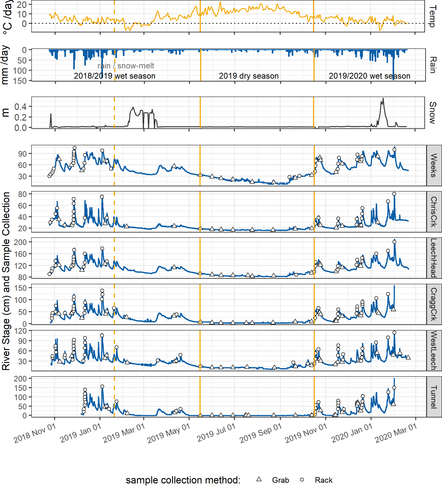
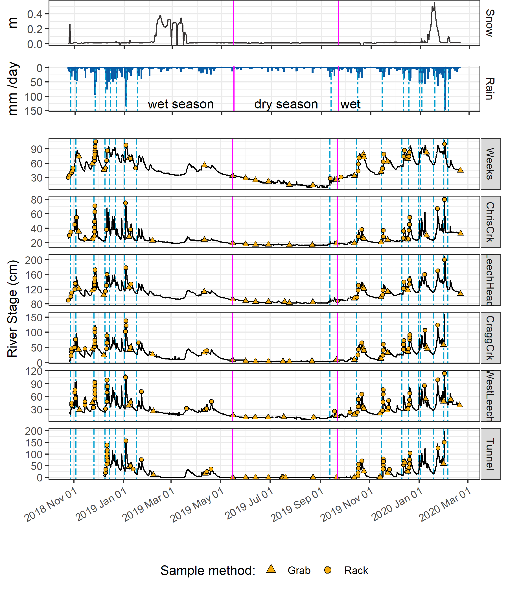

##	Common Methods 

```{r, include = FALSE, package.startup.message = FALSE}

# load required packages
library(tidyverse)  # keep it tidy
library(readr)      # read in delimited files
library(knitr)      # for nice tables

knitr::opts_chunk$set(warning=FALSE, message=FALSE, echo=FALSE, fig.cap=TRUE)

```

### Introduction

Surface water samples were collected between October 2018 and February 2020 to measure dissolved organic carbon (DOC) concentration and natural organic matter (NOM) character through space and time in the Greater Victoria Water Supply Area (GVWSA).Samples were analyzed at UBC for DOC concentration and NOM character via high temperature combustion and UV-Vis spectroscopy, respectively (details follow in *'Analytical Techniques'*). The sampling program designed for this project included synoptic sampling of 12 sites across the Sooke and Leech water supply areas (WSA), as well as installation of monitoring and sampling stations at 6 sites in the Leech WSA. 

\  

This chapter details methods used and presents foundational results that informed all data analysis, interpretation and evaluation of results discussed in subsequent chapters.

\  

###    Sampling sites 

Most of sampling sites were in the Leech WSA and a few key streams in the Sooke WSA were included to facilitate preliminary comparison between the two WSAs for reference to future diversion scenarios (Figure \@ref(fig:sampleSitesMap), Table \@ref(tab:siteCharacteristics)). Rithet Creek is the largest tributary (11.12 km^2 basin) to Sooke Reservoir and Judge Creek is the second largest (8.33 km^2 basin). Deception (gulch) is a small tributary (4.02 km^2 basin) to Deception Reservoir and the Leech River Tunnel (currently deactivated) terminates at Deception gulch. Thus, Deception Reservoir could be used as a balancing reservoir for future inter-basin transfers, and it is separated entirely from the current water supply (Sooke Reservoir) by a dam. 

\  

The Leech WSA includes two major tributary sub-basins: West Leech River (20.85 km^2) and Cragg Creek (28.06 km^2). Cragg-crk sub-basin included two headwater sub-basins: Lazar (4.74 km^2) which included wetlands, and Jarvis (1.51 km^2) which included Jarvis Lake.
...
Leech-Beach site was located just downstream from the confluence of West Leech with the Leech River mainstem (94.09 km^2 sub-basin). And near the effective mouth of the Leech WSA, the Leech Tunnel basin included the entire Leech WSA (95.3 km^2). 
...
Headwater streams of the Leech River included Weeks and Chris Creek sub-basins. Weeks sub-basin (11.52 km^2) included Weeks Lake and surrounding wetlands (Jordan Meadows fen), and Chris Creek sub-basin (5.8 km^2) included smaller Worley Lake. 
...
Across the GVWSA, elevation ranges from approximately 200 m above sea level (asl) to 941 m asl at the top of Survey Mountain near the center of the Leech WSA. 

\  

```{r siteCharacteristics}
fig_cap = "\\label{fig:sampleSitesMap} *River sampling sites across the Leech and Sooke Water Supply Areas (WSA), Greater Victoria, BC.*"

read_csv("R-inputs_UBC-forWater-MSc_HMc/tables/Ch2_all-site_basin_characteristics.csv", col_names = TRUE) %>%
  knitr::kable(digits = 1,
               caption = "*River sampling sites across the Leech and Sooke Water Supply Areas (WSA), Greater Victoria, BC.*")
```  

\  

```{r sampleSitesMap, fig.cap = fig_cap}
fig_cap = "\\label{fig:sampleSitesMap} *River sampling sites across the Leech and Sooke Water Supply Areas (WSA), Greater Victoria, BC.*"

knitr::include_graphics("R-inputs_UBC-forWater-MSc_HMc/images/thesis_map_all_sites-catchments.png")
```  

\  

####    Synoptic sampling 

Synoptic sampling was generally compelted over a one- to two-day period. Surface water was collected manually in triple-rinsed acid-washed 250 mL high-density polyethylene (HDPE) wide-mouth amber bottles. Samples were capped with minimal head-space and transported in coolers with ice to the lab for analysis of dissolved organic carbon (DOC) concentrations and spectroscopic absorbance. Synoptic samples were collected every two to four weeks from October 2018 to February 2020. 

\  

Samples were collected (via wading) from within 2 meters of the same location at each sampling site, at the safest proximity to channel center, from approximately 10 cm below water surface. All samples were refrigerated while they were held between collection and analysis. Grab samples collected for DOC quantification were filtered and acidified within 48 hours of collection, except for a set of a dozen samples that were collected by CRD staff in January 2020 which were refrigerated for almost two weeks prior to filtration and acidification. Samples for NOM spectroscopy were not acidified, they were confirmed to have zero turbidity (measured as FTU with spectrophotometer) and measured unfiltered. 

\  

####    Monitoring & sampling stations 

Six of the sampling sites in the LWSA were selected for more intensive monitoring (numbered sites in Figure \@ref(fig:sampleSitesMap)). These sites represent the drainage area upstream of the Leech River Tunnel and five sub-basins nested within the Leech Tunnel catchment. Site 6 included the drainage area for the entire LWSA and was located at the Leech River Tunnel. The five sub-basin sites represented important portions of the Leech River system: two headwater streams, Weeks and Chris Creek (sites 1 & 2) and the head of Leech River below their confluence (site 3); and two major tributaries that feed the Leech River, Cragg Creek and West Leech (sites 4 & 5). Monitoring at these sites included Vertical Racks to measure river stage, air and water temperatures, and collect surface water samples with passive siphon samplers. Monitoring sites were selected based on year-round access, suitability for installing Vertical Rack structures and safety considerations for sample and data collection.  

\  

Streamflow events were primarily generated by rain in the Leech WSA, with the watershed responding rapidly to inputs. Synoptic sampling was conducted every two to four weeks, but relying only scheduled synoptic sampling could miss interesting NOM changes during the rising limb of the hydrograph. Furthermore, the logistics of Grab sampling through events at multiple sites would have been challenging for one person to accomplish, could have been dangerous due to high flows, and would have required site access beyond safe working hours (i.e. not logistically feasible). However, it was important to sample across the hydrograph to capture sample-sets that represented variation in DOC and NOM that occurred during changing flow conditions (i.e. within storm variability). Based on cost, logistical considerations and curiosity, siphon sampling strategies were employed at the monitoring sites across the LWSA. 

\  

Siphon sampling bottles were used on vertical sampling racks as a cost-effective, logistically practical, reliable and consistent method of passive event-based sampling that enhanced the synoptic sampling program. In addition to passively collecting samples across the Leech watershed during increasing flow conditions, the vertical racks also recorded river stage and air/water temperatures (using HOBO TidbiT v2 Temperature Data Loggers, Onset, USA). 

\  

Each vertical sampling rack included a central stilling well (3.81 cm (1.5") PCV pipe with 1.27 cm (1/2") holes along the length) with a measuring tape affixed to the front. Inside the stilling well was an Odyssey Capacitance Water Level Logger (Dataflow Systems Ltd., New Zealand); and on either side of the central stilling well was a slotted offset angle bar onto which hose clamps held siphon sampler bottles (Figure \@ref(fig:verticalRack)). 

```{r verticalRack, fig.cap = fig_cap}
fig_cap = "\\label{fig:verticalRack} *Vertical sampling rack and siphon sampler bottle, illustrative of installations at six sites across the LWSA (shown here is Chris Creek (site 2).*"

knitr::include_graphics("R-inputs_UBC-forWater-MSc_HMc/images/Rack_diagram_full.png")
```  

Custom-built siphon sampler bottles used in this research were based on a USGS single stage sediment sampler design (US U-59, 1961, [see @Graczyk2000]). Screw caps for 250 mL amber HDPE wide-mouth bottles were augmented to include a siphon system made of two 1/4" (O.D.) stainless steel tubes, each with a 180$^\circ$ bend at the top end; the longer tube formed an air vent, the shorter acted as a water inlet. The sample bottle filled when river water reached the top of the inlet tube bend (Figure \@ref(fig:verticalRack)). Marine epoxy was applied to the outside of siphon caps to ensure a water-tight seal around the inlet and exhaust tubes, and inert silicone sealant was added to the inside of lids to ensure watertightness and clean sample containment. The siphon samplers collected river water from approximately 5 cm below the surface (the distance between bend at top of intake tube to inlet orifice). Sampled water filled each siphon bottle with approximately 1 cm of head space between the water level and sealed lid, such that a sample was not in direct contact with the siphon lid.   

\  

Acid-washed sample bottles with siphon lids were set out on vertical racks each time scheduled synoptic sampling was completed. Bottle filling-stage was recorded as the height on the stilling-well measuring tape that corresponded to the top of each siphon intake tube bend; these positions were used to relate Rack sample collection to continuously recorded stage. Sampling bottles could be placed at any height and were generally staggered at 10-20 cm intervals. Samples were passively collected as rivers responded to precipitation, and were retrieved on subsequent field trips (at which point the filling-stage was double checked). 

\  

During data analysis, each siphon bottle's filling-stage was references to level-logger data to determine the date and time of collection for each rising-stage sample. The timestamps were used to asses temporal variability in DOC & NOM (later Chapters) and to inform quality management of samples (below).   

\  

#####    Siphon sampler assumptions

The representativeness of vertical rack samples relied on two key assumptions: (1) the water column was well mixed (no stratification) therefore the sample collected was representative of river water quality at each sampling stage; and (2) the sample was discrete, such that there was no infiltration or mixing between surrounding river water and the sample in the bottle once the sample was collected.

\  

Based on turbulence associated with flows upstream of the vertical racks (step-pool formations), the assumption of fully mixed and unstratified water seemed justified. Discrete sample collection was validated in lab using food colouring and a flow-through bucket system. In this test, a siphon sampler bottle was submerged in a container filled with circulating tap water; following siphon sample collection, food colouring was added to the system and circulated for 15 minutes, then the sample bottle was removed from this dye chamber and the colour of the sample inside the siphon bottle was visually compared to the dyed water that had circulated around it. This test was repeated five times with different siphon-lid bottles. There was no dye present in any of the siphon sample bottles following the tests. This confirmed the assumption of discrete siphon sample collection.  

\  

#####    Sampling rack hold-time experiments

Every effort was made to retrieve samples as quickly as possible from the Vertical Racks following rain events. None the less, some samples remained in the field for 3-30 days due to logistical, access and safety considerations. So, hold-time experiments were performed to assess river sample stability over periods between rack sample collection and retrieval. The hold-time experiments included replicate sample collection (n = 10) where half the samples were capped with siphon lids and placed out of water on a vertical rack in the field and the other half of samples were immediately returned to the lab for analysis. Three sets of hold-time experiments were completed such that the simulated-rack samples were left in the field for 11, 20 and 34 days before being retrieved for analysis and comparison to their counterpart replicates (details in results section). The temperature sensors installed at each vertical rack were used as part of the hold-time assessment for sample stability and results were used to flag data as suspect or acceptable for inclusion in results.

\  

###   Laboratory analyses of water samples

Surface water samples were transported from the field to the lab in a cooler with ice for quantification of dissolved organic carbon (DOC) and qualitative assessment of natural organic matter (NOM) molecular character. 

\  

#### Quantifying DOC (dissolved organic carbon)

Dissolved organic carbon (DOC), the major constituent of natural organic matter, was quantified as non-purgeable organic carbon (NPOC) via High-Temperature Combustion (Method 5310-B) on a Shimadzu TOC-V [@StdMet5310]. 

\  

##### Sample preparation

Water samples were brought to room temperature, inverted to mix, then filtered and acidified by hand. A clean 60 mL luer-lock syringe was pre-rinsed with sample water three times, then used to triple-rinse a vial (acid-washed 40 mL borosilicate amber glass vial) with filtered sample water. Samples were filtered using pre-rinsed (filter to waste) 0.45 μm polyethersulfone syringe filters [@Karanfil2003; @StdMet5310]. Each sample was syringe-filtered into its pre-rinsed vial and acidified to bring pH below 2 (by adding 200 μL of 4 M hydrochloric acid, reagent grade, into 35 mL filtered sample). Filtered and acidified samples were sealed with Parafilm and place on the autosampler tray (Shimadzu ASI) for instrumental analysis. On a few occasions with extended time in the field (greater than 48hrs), samples were filtered and acidified (as above) at the field house, then capped with Teflon-lined caps and refrigerated until return to the lab for analysis. 

\  

##### Instrumental analysis methods

The first five vials of each analytic run contained only lab grade water; these blanks were analyzed to (1) flush the system and (2) assess instrumental stability (i.e. precision). In series, the Shimadzu autosampler sparged each sample vial with high purity hydrocarbon-free air (1 minute) to drive off dissolved inorganic carbon (upon acidification, inorganic species were converted to aqueous CO~2~), leaving only dissolved organic carbon in the sample. Aliquots of sparged sample (80 μL) were then drawn into the TOC-V and catalytically combusted (Shimadzu standard catalyst with quartz wool) to convert all organic carbon into carbon dioxide which was measured by non-dispersive infrared gas detection to quantify sample NPOC (i.e. DOC). The instrument measured three to five aliquots from each vial to ensure the replicate measurements coefficient of variation (CV) was below 2% and standard deviation (SD) was below 0.1 mg/L. This method represents a direct quantitative measure of DOC; although small volatile organic compounds could be removed in the sparging process, most NOM compounds are of higher molecular weight (e.g. humic substances) and it is unlikely that DOC analytes would be lost [@StdMet5310; @Matilainen2011; @Aiken1995].

\  

Files output by the TOC-V software included sample identification information, details of analytical processes and results including detected intensities and calculated NPOC concentrations. Concentration results were calculated from a selected calibration file. Calibration was completed each time the zero-air gas cylinder was replaced, and in one instance when the gas flow rate was adjusted. A five- or six-point calibration curve (0-30 mg/L organic carbon) was created with series made from stock solution of anhydrous primary-standard grade potassium hydrogen phthalate. Calibration was verified regularly by including a 'cal-ver' in most sample trays (standard solution (labchecm.com, catalog No.LC129107) diluted to approximately 5 mg/L); these cal-vers resulted in an average accuracy of 10.8% (n=20).

\  

#### Characterization of NOM (natural organic matter)

To assess the molecular character of NOM, samples were analyzed by UV-Vis spectroscopy (ultraviolet-visible light) using a spectro::lyser (s::can, Vienna, Austria). The spectro::lyser is a self-contained spectrophotometer and data-logger (with external power source) that measures turbidity and UV-Vis absorbance (i.e. light attenuation) across the wavelength range of 200 nm to 750 nm (recorded at 2.5 nm intervals). While the spectro::lyser is a field-deployable instrument, it was used in-lab for this project. 

\  

For NOM to be detected by UV-Vis spectroscopy the molecules must absorb ultraviolet (UV) or visible (Vis) light, which is a physiochemical ability determined by the electronic structure of a molecule. UV-Vis absorption requires the presence of a conjugated pi-bond system (i.e. a chromophore) in the molecule, which is common in aromatic molecules. In a forested watershed, the suite of molecules that comprise NOM generally have more aromatic than aliphatic character [@Weishaar2003]. Increasing aromaticity will lead to greater absorbance at shorter wavelengths (shorter wavelength, higher energy), and a more concentrated sample will lead to greater absorption intensity; therefore, the UV-Vis spectrum of a sample can provide valuable information about relative weights, aromaticity and relative concentrations of aqueous NOM [@Helms2008; @Cory2011; @Agren2008; @Karanfil2002; @Karanfil2003]. DOC concentration estimated from UV-Vis absorbance is a proxy measure that represents the chromophoric component of NOM, which is proportional to the samples' average aromatic carbon component [@Helms2008]. 

\  

##### Sample analysis

Water samples were removed from refrigeration, brought to room temperature, and inverted to mix prior to spectral analysis. The spectro::lyser comes with a sleeve to contain approximately 100 mL of sample around the spectral path. The analytical sample space (path and sleeve) was triple-rinsed with room-temperature sample water prior to analysis, then the sample sleeve was filled, and the sample was analyzed. 

\  

The spectro::lyser has been shown to effectively determine DOC content and character on unfiltered samples [@Avagyan2014]. However, suspended matter interferes with UV-Vis absorbance due primarily to light scattering [@StdMet5910]. While unfiltered water samples were analyzed in the spectrolyser for NOM, samples that had detectable turbidity (greater than 0.0000 FTU) were removed from data analysis. 

\  

##### Instrument and data handling

Files output by the spectro::lyser software (ana::pro, Version 5.9h (1.0.z)) include results of estimated concentrations (details follow) and specific absorbance coefficients (m^-1^) at 254 nm and 436 nm (A~254~ and A~436~, respectively), as well as another "fingerprint" file of specific absorbance coefficients for the entire wavelength range. Within the instrument software, full scan absorbance data (unitless absorbance values) were converted to specific absorbance coefficient (SAC). SAC represents absorbance at a given wavelength (abs~λ~) normalized to the spectrophotometer pathlength (SAC~λ~$={abs_{\lambda}}/{pathlength}$); the spectro::lyser used in these analyses had a fixed pathlength of 35.0 mm. 

\  

The spectro::lyser is pre-calibrated with an internal Global calibration file (Global Calib.: "RIVER000V120") to calculate estimates of total organic carbon (TOC), dissolved organic carbon (DOC), and nitrate-nitrogen (NO~3~^-^-N) concentrations. Details of the Global calibration algorithm were not provided by the manufacturer, but the local representative (Aquatic Life, Ltd.) suggested a paper that reported the Global Calibration as "multi-wavelength algorithms of a turbidity-compensated absorbance fingerprint" [@Avagyan2014]. Spectro::lyser DOC estimates were evaluated in comparison to NPOC as an indicator of molecular changes, otherwise specific absorbance coefficients were used to calculate SUVA~254~ and E~2~:E~3~ (SAC~254~:SAC~365~), which are spectral indices used to describe NOM character. 

\  

###### SUVA~254~ (specific ultraviolet absorbance)

Specific ultraviolet absorbance at 254 nm (SUVA~254~) is a widely adopted indicator of NOM character that measures the aromatic content of a sample per unit concentration of organic carbon (e.g. @Weishaar2003; @Chow2008), it is the ratio of SAC~254~ normalized to the samples DOC concentration. SUVA~254~ was calculated by dividing SAC~254~ by DOC concentration (mgL^-1^ as NPOC) and is reported in units of liter per milligram carbon per meter (Lmg-C^-1^m^-1^, i.e. L/mg-m) [@Weishaar2003; @Karanfil2003]. SUVA~254~ has been shown to correlate strongly with aromaticity and also with chemical reactivity [@Weishaar2003; @Helms2008; @Chow2008]. 

\  

With respect to SUVA~254~ and drinking water treatability, it's important to consider the diversity of DOM and DBP species and the heterogeneous character contained in a water sample. While SUVA~254~ may indicate reactivity, it is not necessarily a strong indicator of disinfection by-product formation potentials (DBP-FPs) [@Weishaar2003; @Chow2008]. This is because some DBP precursor NOM components which have negligible absorptivity in the UV-Vis range (e.g. aliphatic components) may contribute to DBPs but not SUVA~254~ [@Owen1995]; additionally, not all NOM with measurable SUVA~254~ will create DBPs [@Weishaar2003]. Therefore, SUVA~254~ should be interpreted primarily as an indicator of molecular aromaticity and size. Aside from DBPs, aromaticity and size are important when considering other treatability factors such as biofouling, filter clogging and interference with UV disinfection.

\  

A sample with high SUVA (relatively great UV absorption at 254 nm for the amount of DOC in the sample) indicates more aromatic, larger (higher molecular weight) NOM components, and a lower SUVA value (e.g. below 3 L/mg-m) corresponds to a sample with lower molecular weight, more aliphatic and hydrophilic, less humic NOM [@Karanfil2002]. Because allochthonous NOM (i.e. humic substances) are more aromatic than aliphatic, SUVA~254~ is a good indicator of terrestrial sources of NOM [@Weishaar2003; @Vidon2008; @Abbott2018].

\  

###### E~2~:E~3~ (spectral ratio)

In the absence of fluorescence excitation-emission matrices, or high-resolution spectrometric methods, UV-Vis absorbance data provides a simple tool for elucidating the molecular characteristics of aromaticity and weight. Two indices used for molecular characterization are spectral slopes and absorbance quotients.

\  

A spectral slope (S) is the change in absorbance intensity over a range of wavelengths. The ratio of S over the range 275-295 nm (S~275-295~) to S over 350-400 nm (S~350-400~) is a semi-quantitative indicator called slope ratio (S~R~) which is inversely proportional to molecular weight and aromaticity of chromophoric organic matter [@Helms2008]. S~275-295~ and S~350-400~ are calculated from linear regression of log-transformed spectral absorbance coefficients (m^-1^), or from fitting absorption spectra to an exponential decay function by non linear regression (see @Helms2008 p 958, or @Fichot2012 eqn.1, p 1455). 

\  

Alternatively, the quotient E~2~:E~3~ provides information analogous to that of S~R~ and is a much simpler calculation [@Helms2008]. E~2~:E~3~ is the ratio of absorbance coefficients at wavelengths 250 nm and 365 nm (calculated by dividing A~250~ by A~365~) and, like S~R~, is inversely related to the aromaticity and molecular weight of aquatic humic solutes [@Peuravuori1997; @Helms2008]. E~2~:E~3~ values were calculated to elucidate molecular character of NOM in samples. 

\  

### Defining seasons 

Coastal BC climate is characterized by a predominantly wet season and dry season and while the dry season often includes periods of drought there is generally some rainfall throughout the entire year (Figure \@ref(fig:meanWxLWSA)). For this research, seasons were operationally defined by sampling method restrictions such that the "wet" season was defined as the period when rainfall generated stream response significant enough for Vertical Racks to collect rising limb samples, and the "dry" season was defined by the absence of rainfall response substantial enough for Rack sampler collection. The R package _Rainmaker_ (github.com/USGS-R/Rainmaker) was used with LWSA rain data (average of Chris Creek and Martin's Gulch FWx stations) to define events that corresponded to Rack sampling, which helped to distinguish between seasons. Snow was qualitatively considered when defining seasons, as it did not contribute to event definitions but did contribute to stream levels at each monitoring site. 

\  

#### CRD Weather data

The Capital Regional District (CRD) provided data from two fire-weather ("FWx") stations located in the Leech water supply area (LWSA). Chris Creek weather station was near the headwaters of the Leech watershed and Martin's Gulch was located near the future point of diversion, the Leech River Tunnel (Table \@ref(tab:StnSummary)). Data from January 2018 to March 2020 were provided and were used in defining sampling seasons and for quality control assessments of vertical rack samples. 

\  
 
```{r StnSummary}
read_csv("R-inputs_UBC-forWater-MSc_HMc/tables/methods_FWx_Stn_summary.csv",
         col_names = TRUE) %>% 
  knitr::kable(caption = "*CRD fire weather station (FWx) summary of features*")

```

\  

Average LWSA weather data was calculated as arithmetic means from Chris Creek and Martin's Gulch FWx stations data (Figure \@ref(fig:meanWxLWSA), Table \@ref(tab:meanWxLWSAdata), see Appendix for summary of each FWx station). It was assumed that the arithmetic means of rainfall from Chris Creek and Martin's Gulch stations were representative of rain conditions across the Leech watershed (LWSA rain) and were used to define storm events that corresponded to vertical rack sample collection. Mean LWSA air temperature data were used in linear regression to estimate temperatures at each of the six monitoring sites for the period before temperature loggers were deployed. While snow melt contributed to runoff and river responses at the six LWSA monitoring sites, the CRD FWx stations are situated at elevation and therefore snow depth records were not assumed to be representative of snow cover across the LWSA and snow depth data were not included in event calculations, but were taken into consideration when defining seasons.

\  

```{r meanWxLWSAdata}
read_csv("R-outputs_UBC-forWater-MSc_HMc/tables/Wx_LWSA-mean-summary.csv", col_names = TRUE) %>% 
  knitr::kable(digits = c(1, 1, 1, 2, 1, 1, 1, 1),
               caption = "*Average weather data from CRD stations in Leech water supply area in 2018, 2019, and the period of 2020 included in this project*")
```

\  

```{r meanWxLWSA, out.width = "100%", fig.pos="h", fig.cap = fig_cap}
fig_cap = "\\label{fig:meanWxLWSA}*Average weather from two stations in the Leech water supply area, where the highlighted section indicates the study period.*"

knitr::include_graphics("R-outputs_UBC-forWater-MSc_HMc/figures/Wx_LWSA-means.png")
```

\  


### Foundational Results

Presented here are the results of Hold-time experiments for Vertical Rack sampling method development as well as seasonal delineation.

\  

#### Vertical Rack sampling quality control

Hold-time experiments were conducted at the Tunnel site to assess stability of river water samples held in siphon bottles on the vertical rack. Three sets of samples were used in hold-time experiments, each set included samples held on the rack for different periods and the timing and air temperatures for each set were assessed (Figure \@ref(fig:HoldTimeAirPlot)).

\  

```{r HoldTimeAirPlot, out.width = "100%", fig.pos="h", fig.cap = fig_cap}
fig_cap = "\\label{fig:HoldTimeAirPlot}*Plot of air temperature during vertical rack hold-time experiments. Red horizontal lines indicate the 0-7°C range of a typical laboratory refrigerator and dashed vertical lines separate the three sets of hold-time samples from collection of grab samples to retrieval of held samples.*"

knitr::include_graphics("R-outputs_UBC-forWater-MSc_HMc/figures/HoldTime_airTemp_megaplot.png")
```

\  

Each hold-time set included ten replicate samples, each collected at the same time in the same way from the same location. For each hold-time set, five samples were returned to the lab for immediate quantification of DOC and measurement of UV-Vis absorbance ("fresh" samples) and five were placed on the vertical rack, capped with siphon lids to simulate rack samples, and collected at a later date for analysis ("held" samples). All samples were analyzed to quantify DOC and characterized NOM properties (Figure \@ref(fig:HoldTimeBoxPlot)), and the fresh and held samples of hold-time set were compared using two-sided paired Wilcoxon signed rank tests (a.k.a 'Mann-Whitney' test, non-parametric paired difference test that does not assume normally distributed data). For a wider margin of error, a 90% confidence level (rather than 95% or 99%) was used to evaluate the comparisons between fresh and held samples. Results of hold-time comparisons considered the timing of sample collection, the number of days the rack samples were held, the mean air temperature over that period, and the percent change in analytical results (Table \@ref(tab:HoldTimeTtests)).

\  

```{r HoldTimeBoxPlot, fig.cap = fig_cap}
fig_cap = "\\label{fig:HoldTimeBoxPlot}*Sample DOC concentrations and UV absorbance at 254nm contrasting  hold-time samples from collection of grab samples to retrieval of held samples.*"

knitr::include_graphics("R-outputs_UBC-forWater-MSc_HMc/figures/HoldTime_boxplots.png")
```

\ 

```{r HoldTimeTtests}
read_csv("R-outputs_UBC-forWater-MSc_HMc/tables/HoldTime_results-summary.csv", col_names = TRUE) %>%
  knitr::kable(caption = "*Results comparing three vertical-rack hold-time sets*") 
```
_Note:_ one star (*) indicates significant difference at 90% confidence (p < 0.1), 
two stars (**) indicates significant difference at 95% confidence (p < 0.05)

\  

There was a significant change in DOC concentration (at 90% confidence, p-value = 0.063) for hold-time set-A, where mean DOC concentration was 45% lower in the held samples compared to the fresh grab samples. While there was no change in UV absorbance (i.e. SAC~254~ and E~2~:E~3~) for samples from hold-time set-A, the change in DOC generated a significant difference in SUVA~254~. Samples collected for hold-time set-A were DOC-rich "first flush" samples, and the Rack samples were held for 11 days at average temperature of 7° C (slightly above laboratory refrigerator temperatures). 

\  

Set-B had a hold-time of 20 days with average air temperature of 6° C. There were no significant changes to DOC concentrations or E~2~:E~3~ values between fresh and rack-held samples for this set. Wilcoxon tests for set-B showed that the 8% change in SAC~254~ was statistically significant (at 90% confidence). However, the SAC~254~ difference in set-B was determined to be caused by an outlier which could be rejected with 99% confidence by Dixon's Q-test (Q~exp~ = 0.941 > Q~crit~ = 0.821). Therefore, it was concluded that, despite the measured difference (Figure \@ref(fig:HoldTimeBoxPlot), Table \@ref(tab:HoldTimeTtests)) there was not truly a reliable change in SAC~254~ (or SUVA~254~, which relies on SAC~254~) for hold-time set-B. 

\  

Hold-time set-C included samples held for 34 days at an average of 4.4° C, including a period of sub-zero temperatures. While set-C did not yield statistically significant changes in DOC concentration (23% DOC reduction from fresh to held), there were significant changes to SAC~254~ (34% decrease in absorbance), and E~2~:E~3~ (14% decrease). In addition to the change in absorbance, rack-held set-C samples had greater variability for both all variables compared to the fresh sample counterparts. 

\  

Results of these hold-time experiments suggest that early-season ("first flush") samples may contain more labile and aliphatic DOC which is unstable and should be analyzed immediately after collection, whereas later season samples contain DOC which is relatively more stable for up to and including 20 days when held at temperatures that approximate a refrigerator. A hold-time of 34 days with periods of freezing resulted in significant changes to sample NOM molecular character; and while DOC concentrations were not statistically altered, there was a notable increase in held sample DOC standard deviation. Additional tests would be required to determine if the change in NOM character was caused by the length of time the sample was held, or perhaps due only to freezing and thawing, or a combination of both time and temperature. Based on these results, sample analyses data were updated to include quality-assurance/quality-control (QA/QC) flags which were used to filter sample data, reducing the effective number of samples included in results by less than 10% (Table \@ref(tab:samplecount)). 

\  

Hold-times were calculated for each sample as the time between sample collection and analysis. Any sample that remained held for fewer than 20 days at temperatures between 0-7° C were flagged as acceptable for further data analysis; Rack samples that were held for 20 days or longer were flagged for exceeding a reliable hold-time; and samples identified as early-wet-season ("first-flush") that had a hold-time of 7 days or longer were flagged as unacceptable and not included in further data analysis. Because of possible freeze-thaw changes to DOC and NOM, any sample that underwent suspected or confirmed freezing was also flagged for temperature effects. Hold-time temperatures (daily means) at each monitoring site were measured and recorded with Hobo TidbiT loggers from 2019-08-24 to 2020-02-18 (field study end), and temperatures prior to TidbiT deployment were estimated by linear regression (Appendix ###). 

\  

####   Seasonal delineation  

Wet seasons were defined by conditions that generated significant stream responses and Vertical Rack sample collection, and the dry season was defined by baseflow conditions with no detectable stream responses at the Vertical Racks.

\  

LWSA rain data were used to define rain events using the USGS _Rainmaker_ package in R ('RMevents' function), which determined there were 18 major events that corresponded to Vertical Rack sample collection. The conditions that defined major rain events were precipitation accumulating to 50 mm or more, with a period of at least 14 hours passing between 50 mm events. As major rain events were defined based on Rack sampling responses, they were the primary method of delineating seasons, where the wet season was defined by the presence of major rain events and the dry season was defined by their absence. However, there was a period of surprising snowfall in the winter of 2018/2019, during which time rainfall runoff subsided but the eventual melt generated streamflow response across the monitoring sites. Therefore, that period of snow accumulation and melt was included when defining wet seasons, despite the lack of major rain events (Figure \@ref(fig:seasonalMegaPlot)).

\  

```{r seasonalMegaPlot, fig.cap = fig_cap}
fig_cap = "\\label{fig:seasonalMegaPlot}*Plot of LWSA weather, stream response and sample collection at the six monitoring sites across the LWSA. Seasons were separated by stream responses and conditions that initiated or ceased rack sample collection.*" 


```

\  

While seasons were defined by river responses at the six monitoring sites, it was assumed that seasonality was equal across the GVWSA, and wet and dry seasons were consistent among the twelve synoptic sampling sites. 
\  


___...from hydro-chem...___

####   Rain events and sampling

LWSA mean FWx precipitation data were used to define rain events using the USGS *Rainmaker* package in R ('RMevents' function). During the study period there were 18 major rain events which corresponded to sample collection by the Vertical Racks (i.e. events large enough to trigger substantial river responses). The 18 Rack sampling rain events were defined by precipitation accumulating to 50 mm or more, where the events were separated from each other by a period of 14 hours or longer (Table \@ref(tab:EventsTable3)). 

\  

```{r EventsTable3}
read_csv("R-outputs_UBC-forWater-MSc_HMc/tables/CH3_events-n-samples.csv") %>%  
  knitr::kable(digits = c(0,0,1,1,1,0,2,2,2,2), 
               caption = "*Rain events defined by a threshold of 50mm with 14-hour inter-event period*",
               col.names = c("Major event no.", "Start Date", "Duration (days)", "Rainfall (mm)", "Intensity (mm/hr)", "Samples collected", "mean DOC (mg/L)", "mean SAC~254~", "mean SUVA~254~", "mean E~2~:E~3~"))
```

\  

The study period was separated into "wet" and "dry" seasons based on detectable river response at each monitoring site, which was primarily based on the presence or absence of major rain events and included a period of snowmelt late in the 2018/2019 wet season (Figure \@ref(fig:ch3megaplot)). The 2018/2019 wet season extended from the start of the project (October 2018) to mid-May 2019, where the period from late January (event 8, Table \@ref(tab:EventsTable3)) to mid-May had streamflow changes governed by snowmelt rather than rainfall. The 2019 dry sampling season spanned from mid-May to late-September, and the 2019/2020 wet season began mid-September (event 9, Table \@ref(tab:EventsTable3)) and extended to the end of the field study period (Feb 20, 2020). Stream levels at each monitoring site were matched to the stage that Vertical Rack samples were collected to obtain date-time of sample collection, and the date-time of each Grab sample collection was matched to recorded stage (Figure \@ref(fig:ch3megaplot)). 

\  
 
```{r ch3megaplot, fig.cap = fig_cap}
fig_cap = "\\label{fig:ch3megaplot} *Rain events, stream response, sample collection and seasons across the Leech Water Supply Area. Dashed vertical lines indicate the start of rain events, points indicate the timing and stage of river samples collected, and pink vertical lines delineate seasons.*"


```

\  

Eight of the 18 rain events were captured in the 2019 water year (2018-2019 wet season), the other ten in the 2020 water year. For each calender year in the study period, major rain events' minimum and maximum values of depth, duration and intensity were identified (Table \@ref(tab:MinMaxEvents)).   

\  

```{r MinMaxEvents}
read_csv("R-outputs_UBC-forWater-MSc_HMc/tables/Wx_Events-annual_min-max.csv") %>% 
  knitr::kable(digits = c(0,1,1,1,1,2,1),
               caption = "*Minimum and maximum rain event values *")
```

\  

An intense atmospheric river event hit the LWSA January 29-31 (event 17, Table \@ref(tab:EventsTable3)) and generated incredible flows across the Leech watershed (and across Vancouver Island and most of the south coast of BC). Streamflow at CraggCrk (site 4) and the Tunnel (site 6) over-topped the 2 m vertical racks and ripped the level-loggers out of their stilling wells. Luckily, the level-loggers were found downstream in February and (after drying the circuit boards) the data were successfully retrieved from both Odyssey loggers. Following event 17, changes to the stream-bed morphology were evident at LeechHead (site 3) in the form of gravel and cobble deposition, there was evidence of substantial coarse woody debris transport at ChrisCrk (site 2), and destruction to hydrologic monitoring equipment at the Leech Tunnel.

\  

