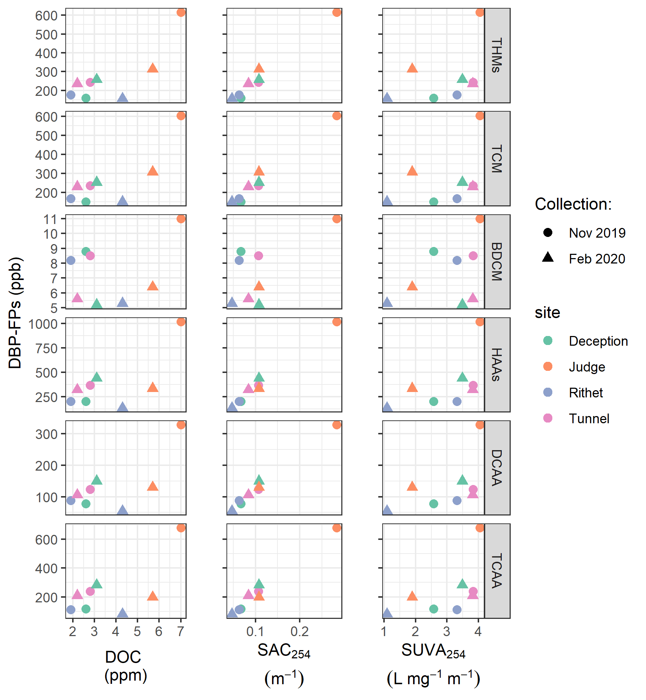

##	Common Methods 

```{r, include = FALSE, package.startup.message = FALSE}

# load required packages
library(tidyverse)  # keep it tidy
library(readr)      # read in delimited files
library(knitr)      # for nice tables

knitr::opts_chunk$set(warning=FALSE, message=FALSE, echo=FALSE, fig.cap=TRUE)

```

### Introduction

A combination of synoptic and event-based sampling was used to capture broad spatial and temporal dynamics of aqueous NOM across the GVWSA. The sampling design considered both limitations and resource constraints for manually collecting data through events and making continuous measurements. This chapter details methods and foundational results that are common to all subsequent chapters. 

\  


Surface water samples were collected between October 2018 and February 2020 to measure the quantity and quality of aqueous natural organic matter (NOM) through space and time in the Greater Victoria Water Supply Area (GVWSA). Samples were analyzed at UBC for dissolved organic carbon (DOC) concentration and NOM molecular character via high temperature combustion and UV-Vis spectroscopy, respectively (details follow in *'Analytical Techniques'*). The sampling program designed for this project included synoptic sampling of twelve sites across the Sooke and Leech water supply areas (WSA), as well as installation of monitoring and sampling stations at six sites in the Leech WSA. 

\  

###   Sampling sites 

Twelve sites were selected across the GVWSA, most of which were in the Leech WSA. A few key streams in the Sooke WSA were included to facilitate preliminary comparison between the two WSAs for reference to future diversion scenarios. The three Sooke WSA sites were: Rithet, Judge, and Deception creeks. The nine Leech WSA sites were: Weeks, Chris, Jarvis, and Lazar creeks (headwaters), Leech River at the head (below of the confluence of headwaters), Cragg Creek, West Leech River, Leech River at the beach below confluence of West Leech, and the Leech River at the Tunnel (Figure \@ref(fig:sampleSitesMap)).

\  

Rithet Creek is the largest tributary (11.12 km^2^ basin) to Sooke Reservoir and Judge Creek is the second largest (8.33 km^2^ basin). The Leech River Tunnel (currently deactivated) terminates at Deception Gulch ('Deception'), a small tributary (4.02 km^2^ basin) to Deception Reservoir; as such, Deception Reservoir could be used as a balancing reservoir for future inter-basin transfers, and it is separated entirely from the current water supply (Sooke Reservoir) by a dam. The Leech WSA includes two major tributary sub-basins: West Leech River (20.85 km^2^) and Cragg Creek (28.06 km^2^). The Cragg Creek sub-basin included two headwater sub-basins: Lazar (4.74 km^2^) and Jarvis (1.51 km^2^). The Leech-Beach site is located just downstream from the confluence of West Leech River with the Leech River mainstem (94.09 km^2^ sub-basin). And near the effective mouth of the Leech WSA, the Leech Tunnel basin included the entire Leech WSA (95.3 km^2^). Headwaters of the Leech River included Weeks Creek and Chris Creek sub-basins; Weeks sub-basin (11.52 km^2^) encompassed Weeks Lake and surrounding wetlands (Jordan Meadows fen), and Chris Creek sub-basin (5.8 km^2^) included smaller Worley Lake. Below the confluence of Weeks and Chris Creeks is the Leech-head site (20.59 km^2^ sub-basin).  

\  

```{r sampleSitesMap, fig.cap = fig_cap}
fig_cap = "\\label{fig:sampleSitesMap} Twelve synoptic sampling sites across the Leech and Sooke portions of the Greater Victoria Water Supply Area (BC, Canada). Sites with numbers were set up as monitoring sites and equipped with Vertical Rack samplers. Black lines delineate sub-basin boundaries (with the sampling point as the outlet)."

knitr::include_graphics("R-inputs_UBC-forWater-MSc_HMc/images/thesis_map_all_sites-catchments.png")
```

\  

Across the GVWSA, elevation ranges from approximately 200 m above sea level (asl) to 941 m asl at the top of Survey Mountain near the center of the Leech WSA (Table \@ref(tab:siteCharacteristics)). The predominant geological formation across the GVWSA was metamorphic parent material (wark gneiss). The wark formation was common to all twelve sampling sub-basins except for West Leech sub-basin, which was underlain primarily by a meta-sedimentary mudstone (argillite-metagreywacke) and the Metchosin Volcanics group (igneous). Median sub-basin slopes ranged from 5$^\circ$ to 13$^\circ$ with maximum WSA slope of 61$^\circ$.

\  

```{r siteCharacteristics}

read_csv("R-inputs_UBC-forWater-MSc_HMc/tables/Ch2_all-site_basin_characteristics_simple.csv", col_names = TRUE) %>%
  knitr::kable(col.names = c("Site name",	"Latitude",	"Longitude",	"Strahler order",	"Drainage km^2^",	"Elevation (m a.s.l.)",	"Slope median (degrees)",	"Wetland cover (%)",	"Open water (%)",	"Dominant parent material (%)",	"Secondary parent material (%)"),
               digits = c(0,5,5,0,2,0,1,3,3,0,0),
               caption = "Watershed characteristics of synoptic sampling sites in the Leech and Sooke portions of Greater Victoria water supply areas")
```  


\  

### Sampling methods

####    Synoptic sampling 

Synoptic samples from the 12 sampling sites were generally collected every two to four weeks, over a one- to two-day period, from October 2018 to February 2020. Surface water was collected manually in triple-rinsed acid-washed 250 mL high-density polyethylene (HDPE) wide-mouth amber bottles. Samples were capped with minimal head-space and transported in coolers with ice to the lab for analysis of dissolved organic carbon (DOC) concentrations and spectroscopic absorbance. 

\  

Samples were manually collected (via wading) from within 2 meters of the same location at each sampling site, at the safest proximity to channel center, from approximately 5-10 cm below water surface. All samples were refrigerated between collection and analysis. Grab samples collected for DOC quantification were filtered and acidified within 48 hours of collection, except for a set of a dozen samples that were collected by CRD staff in January 2020 which were refrigerated for almost two weeks prior to filtration and acidification. Samples for NOM spectroscopy were not acidified, they were confirmed to have zero turbidity (measured as FTU with spectrophotometer) and measured unfiltered with a spectro::lyser spectrophotometer (details follow). 

\  

####    Monitoring & sampling stations 

Six of the synoptic sampling sites in the Leech WSA were selected for more intensive monitoring (numbered sites in Figure \@ref(fig:sampleSitesMap)). These sites represent the drainage area upstream of the Leech River Tunnel and five sub-basins nested within the Leech Tunnel catchment. Site 6 included the drainage area for the entire Leech WSA and was located at the Leech River Tunnel. The five sub-basin sites represented important portions of the Leech River system: two headwater streams, Weeks and Chris Creek (sites 1 & 2) and the head of Leech River below their confluence (site 3); and two major tributaries that feed the Leech River, Cragg Creek and West Leech (sites 4 & 5). Monitoring sites were selected based on year-round access, suitability for installation and safety considerations.

\  

Monitoring included continuous river stage, air and water temperatures, and collection of whole surface water samples with passive siphon sampler bottles staggered vertically. Vertical Rack siphon sampling were a cost-effective, logistically practical, reliable and consistent method of passively sampling the rising limb of the hydrograph. In addition to passively collecting samples across the Leech watershed during increasing flow conditions, the vertical racks also recorded river stage at 10-minute intervals. 

\  

Each Vertical Rack included a central stilling well (3.81 cm (1.5 in) PCV pipe with 1.27 cm (0.5 in) holes along the length) with a staff gauge affixed to the front. Inside the stilling well was an Odyssey Capacitance Water Level Logger (Dataflow Systems Ltd., New Zealand) used to measure stage continuously and determine the date-time at which each siphon sample was collected. Slotted offset angle bars were installed on either side of the stilling well, which held siphon sampler bottles with hose clamps (Figure \@ref(fig:verticalRack)). Air and water temperatures were also measured at each site (30 minute intervals, using HOBO TidbiT V2 Temperature Data Loggers, Onset, USA).  Reconyx trail cameras were installed at monitoring site locations; images were taken every 15 minutes to confirm if streamflow was well mixed and to monitor installations.

\  

```{r verticalRack, fig.cap = fig_cap}
fig_cap = "\\label{fig:verticalRack} Vertical sampling Rack and siphon sampler bottle, illustrative of installations at six sites across the LWSA (shown here is Chris Creek, site 2)."

knitr::include_graphics("R-inputs_UBC-forWater-MSc_HMc/images/Rack_diagram_full.png")
```  

\  

Siphon sample bottle design was based on a USGS single stage sediment sampler design (US U-59, 1961, [see @Graczyk2000]). The siphon system was created by modifying lids of 250 mL HDPE wide-mouth bottles to include an inlet and exhaust tube. Two 1/4" (O.D.) stainless steel tubes (14 cm and 22 cm length), each with a 180° bend at the top end, were inserted into a pre-drilled cap. The taller tube formed the air vent, the shorter acted as the water inlet (Figure \@ref(fig:verticalRack)). The sample bottle filled when water reached the top of the inlet tube bend. When a siphon bottle was submerged below the filling height, a sample was collected in less than 60 seconds. To ensure a water-tight seal around the inlet and exhaust tubes, marine epoxy was applied to the outside of siphon caps and inert silicone sealant was added to the inside of lids. The siphon samplers collected stream water from approximately 5 cm below the surface (distance between the bend at top of intake tube to inlet orifice). A filled siphon bottle had approximately 1 cm of head space between the water level and sealed lid, such that a sample was not in direct contact with the siphon lid.   

\  

Each site was visited during synoptic sampling campaigns and acid-washed sample bottles with siphon lids were set on vertical racks. Sampling bottles were generally staggered at 10-20 cm intervals; the Rack design allowed for bottles to be attached at any height so that the rising limb was well sampled. Bottle filling-stage was recorded from the stilling-well measuring tape at the height that corresponded to the top of each siphon intake tube bend; these positions were used to relate Rack sample collection to continuously recorded stage. Samples were retrieved on subsequent field trips, at which point the filling-stage was double checked. Each siphon bottle's filling-stage was referenced to level-logger data to determine the date and time of collection for each rising-stage sample. The timestamps were used to assess temporal variability in DOC & NOM (later Chapters) and to inform quality management of samples.   

\  

The representativeness of Vertical Rack samples rely on two key assumptions: (1) well mixed water column (no stratification); and (2) each sample was discrete, such that there was no infiltration or mixing between surrounding water and the sample in the bottle once it was filled. Trail camera images and a circulating dye test were used to assess the assumptions of well-mixed water and discrete sample collection (respectively).

\  

#####    Vertical Rack sample hold-time experiments

Every effort was made to retrieve samples as quickly as possible from the Vertical Racks following hydrologic events. None the less, some Rack samples remained in the field from 3 to 40 days due to logistical, access and safety considerations (e.g. during the winter of 2018/2019, snow limited site access). Hold-time experiments were conducted at the Leech Tunnel site to assess the stability of surface water samples held in siphon bottles between Rack sample collection and retrieval. Air temperature data collected at each Vertical Rack were used as part of the hold-time assessment for sample stability. 

\  

The hold-time experiments included replicate surface water sample collection (_n_ = 10) where half the samples were capped with siphon lids and placed out of water on the Vertical Rack ("held" samples), and the other half of samples were immediately returned to the lab for analysis ("fresh" samples). Three sets of hold-time experiments were completed such that the simulated-rack samples were left in the field for 11, 20 and 34 days before being retrieved for analysis and comparison to their counterpart replicates (details in _'Foundation Results'_). The hold-time intervals were selected based on sampling campaign trips where the longest interval included a field visit without sample retrieval; these represented a common period between setting bottles on Racks and retrieving full samples (11 days), a longer period between setting and collecting (20 days) and an extended delay (34 days). 

\  

###   Laboratory analyses of water samples

Surface water samples were transported from the field to the lab in a cooler with ice for quantification of dissolved organic carbon (DOC) and qualitative assessment of natural organic matter (NOM) molecular character. 

\  

#### Quantifying DOC (dissolved organic carbon)

Dissolved organic carbon (DOC), the major constituent of natural organic matter, was quantified as non-purgeable organic carbon (NPOC) via High-Temperature Combustion (Method 5310-B) on a Shimadzu TOC-V [@StdMet5310]. 

\  

##### Sample preparation

Water samples were brought to room temperature, inverted to mix, then filtered and acidified by hand. A clean 60 mL luer-lock syringe was pre-rinsed with sample water three times, then used to triple-rinse a vial (acid-washed 40 mL borosilicate amber glass) with filtered sample water. Samples were filtered using pre-rinsed (filter to waste) 0.45 μm polyethersulfone syringe filters [@Karanfil2003; @StdMet5310]. Each sample was syringe-filtered into its pre-rinsed vial and acidified to bring pH below 2 (by adding 200 μL of 4 M hydrochloric acid, reagent grade, into 35 mL filtered sample). Filtered and acidified samples were sealed with Parafilm and place on the autosampler tray (Shimadzu ASI) for instrumental analysis. If samples were to be stored longer than 48 hours, they were filtered and acidified (as above) at end of the field day, capped with Teflon-lined caps and refrigerated until analysis. 

\  

##### Instrumental analysis methods

The first five vials of each analytic run contained only lab grade water; these blanks were analyzed to (1) flush the system and (2) assess instrumental stability (i.e. precision). In series, the Shimadzu autosampler sparged each sample vial with high purity hydrocarbon-free air (1 minute) to drive off dissolved inorganic carbon. Aliquots of sparged sample (80 μL) were drawn into the TOC-V and catalytically combusted (Shimadzu standard catalyst with quartz wool) to convert organic carbon to carbon dioxide which was measured by non-dispersive infrared gas detection to quantify sample NPOC (i.e. DOC). The instrument measured three to five aliquots from each vial to ensure the replicate measurements coefficient of variation (CV) was below 2% and standard deviation (SD) was below 0.1 mg/L. This method represents a direct quantitative measure of DOC; although small volatile organic compounds could be removed in the sparging process, most NOM compounds are of higher molecular weight (e.g. humic substances) and it is unlikely that DOC analytes would be lost [@StdMet5310; @Matilainen2011; @Aiken1995].

\  

Calibration was completed each time the zero-air gas cylinder was replaced, and in one instance when the gas flow rate was adjusted. A five- or six-point calibration curve (0-30 mg/L organic carbon) was created with series made from stock solution of anhydrous primary-standard grade potassium hydrogen phthalate. Calibration was verified regularly by including a 'cal-ver' in most sample trays (standard organic carbon solution (catalog No.LC129107, labchem.com) gravimetrically diluted to approximately 3-8 mg/L).

\  

#### Characterizing NOM (natural organic matter)

To assess the molecular character of NOM, samples were analyzed by UV-Vis spectroscopy (ultraviolet-visible light) using a spectro::lyser (s::can, Vienna, Austria) in a laboratory setting. The spectro::lyser is a self-contained spectrophotometer and data-logger (with external power source) that measures turbidity and UV-Vis absorbance (i.e. light attenuation) across the wavelength range of 200 nm to 750 nm (recorded at 2.5 nm intervals).

\  

##### Sample analysis

Water samples were brought to room temperature, inverted to mix and used to triple-rinse the spectro::lyser sample space prior to analysis. Water samples were analyzed unfiltered and any sample with detectable turbidity (greater than 0.0000 FTU) was excluded from analysis because suspended matter can interfere with UV-Vis absorbance due to light scattering [@StdMet5910]. The spectro::lyser used in these analyses had a fixed pathlength of 35.0 mm. 

\  

##### Instrument and data handling

The spectro::lyser is pre-calibrated with an internal Global calibration file (Global Calib.: "RIVER000V120") to calculate estimates of total organic carbon (TOC), dissolved organic carbon (DOC), and nitrate-nitrogen (NO~3~^-^-N) concentrations. The Global Calibration algorithm was reported as "multi-wavelength algorithms of a turbidity-compensated absorbance fingerprint" [@Avagyan2014]. Spectro::lyser specific absorbance coefficients (SAC, m^-1^) were used to assess NOM molecular character.

\  

NOM molecular character was judged through a combination of specific UV-absorbance at 254 nm (SAC~254~, an indicator of chromophoric NOM), SUVA~254~ (L mg^-1^ m^-1^) which indicates aromaticity relative to DOC concentrations, and the quotient E~2~:E~3~ (unitless) which is inversely proportional to aromaticity and/or molecular weight of aqueous NOM.

\  

###### Spectral indices of NOM character

More aromatic NOM molecules (i.e. humic substances) will absorb more energy at 254 nm wavelength than less-aromatic molecules, so the spectral absorbance coefficient (SAC~254~) is a common indicator of aromaticity. Specific ultraviolet absorbance at 254 nm (SUVA~254~) is an indicator of NOM aromaticity relative to concentration and is calculated by dividing SAC~254~ by DOC concentration (units of liter per milligram carbon per meter (Lmg-C^-1^m^-1^, i.e. L/mg-m)). Both SAC~254~ and SUVA~254~ are possible indicators of NOM reactivity and as such, each was calculated and evaluated with respect to disinfection by-product formation potential (DBP-FP, more details in Appendix C1) and the one most correlated to DBP-FP was selected for continued analysis.

\  

The spectral quotient E~2~:E~3~ is inversely related to aromaticity and molecular size of aquatic humic solutes [@Peuravuori1997; @Helms2008]. E~2~:E~3~ was calculated as the ratio of absorbance coefficients at wavelengths 250 nm and 365 nm (i.e. SAC~250~ / SAC~365~). 

\  

#### Collaborative analyses for treatability and metals

Synoptic grab samples were collected for treatability analyses with partners in the forWater Network and for metals analyses with the CRD (see Appendix C for details). To verify that DOC plays a role in metals transport, relationships between DOC and aqueous metals concentrations were assessed.  

\  

Aqueous NOM, particularly high molecular weight aromatic compounds, are precursors to chlorinated DBPs. Drinking water supply for the CRD is treated simply by chlorinating raw source water, and therefore NOM could have important implications for treatability. To assess sample reactivity with respect to forming potentially harmful DBPs, samples were collected from four locations and sent to partners at the University of Waterloo for analyses of DBP-FPs (Appendix C1). Results from forWater DBP-FP experiments were used to evaluate relationships between DOC, SAC~254~, SUVA~254~, E~2~:E~3~ with individual DBP-FPs. 

\  

### Defining seasons 

Coastal BC climate is characterized by a predominantly wet and predominantly dry season, and the timing and length of seasons can vary year to year. Here, seasons were differentiated by sampling method restrictions. As Vertical Rack sampling was initiated by stream stage changes and ended when streamflow dropped, the “dry” season was characterized by baseflow conditions where stream response was not detected at the six Vertical Racks, and the onset of the “wet” season was signified by stream responses that triggered sample collection by Vertical Racks at all of the six monitoring sites across the Leech WSA.

\ 

Leech WSA rain data (average of Chris Creek and Martin's Gulch FWx stations) were used to define events that corresponded to Rack sample collection. Rain events were defined using the 'RMevents' function in the R package _Rainmaker_ (github.com/USGS-R/Rainmaker), in which threshold rain and inter-event period parameters were tuned to define events which aligned with stream response across the Leech WSA. Rain event data were used to put sampled events in context of one another and can be applied to define comparable wet seasons in other studies.

\  

### Foundational results

This section presents results used to inform all subsequent data analysis, interpretation and evaluations discussed in following chapters. Results presented here include weather data and its application in seasonal delineation and quality control for Vertical Rack sampling method development. 

\  

#### CRD weather data

The Capital Regional District (CRD) provided data from two fire-weather ("FWx") stations located in the Leech WSA. Chris Creek weather station (560 m a.s.l) is near the headwaters of the Leech watershed and Martin's Gulch (512 m a.s.l) is located on a ridge near the future point of diversion, the Leech River Tunnel (Table \@ref(tab:StnSummary)). Rain data were used in contextualizing Rack sampling events and seasons, while air temperature data were used in quality control assessments of Vertical Rack sample hold-times. Daily mean air temperatures at each monitoring site were measured and recorded with Hobo TidbiT loggers from 2019-08-24 to 2020-02-18 (field study end), and temperatures prior to TidbiT deployment were estimated by linear regression with CRD weather station data (Appendix B2). 

\  
 
```{r StnSummary}
read_csv("R-inputs_UBC-forWater-MSc_HMc/tables/methods_FWx_Stn_summary.csv",
         col_names = TRUE) %>% 
  knitr::kable(caption = "CRD fire-weather station (FWx) summary of features")

```

\  

Average LWSA weather data were calculated as arithmetic means from Chris Creek and Martin's Gulch FWx stations data (Table \@ref(tab:meanWxLWSAdata), Figure \@ref(fig:meanWxLWSA); see Appendix B2 for summary of data from each FWx station). Total precipitation was not measured at these stations, but snow depth and rain data were collected. Rain data were not corrected for undercatch. Although these data likely over-represented rain amounts that generated runoff in this forested catchment, it  was assumed that the arithmetic means of rainfall from Chris Creek and Martin's Gulch stations were representative of rain conditions across the Leech WSA and were used to define rain events that corresponded to Vertical Rack sample collection at the six monitoring sites. 

\  

```{r meanWxLWSAdata}
read_csv("R-outputs_UBC-forWater-MSc_HMc/tables/Wx_LWSA-mean-summary.csv", col_names = TRUE) %>% 
  knitr::kable(digits = c(1, 1, 1, 2, 1, 1, 1, 1),
               caption = "Average weather data from Chris Creek and Martin's Gulch fire-weather stations in Leech Water Supply Area in 2018, 2019, and the period of 2020 included in this project")
```

\  

```{r meanWxLWSA, fig.cap = fig_cap}
fig_cap = "\\label{fig:meanWxLWSA} Mean daily air temperature, rain and snow depth from Chris Creek (560 m a.s.l) and Martin's Gulch (512 m a.s.l) fire-weather stations in the Leech Water Supply Area, where the coloured sections following the dashed 'Project Start' line indicate data from the study period."

knitr::include_graphics("R-outputs_UBC-forWater-MSc_HMc/figures/Wx_LWSA-means.png")
```

\  

On average, October 2018 through to February 2020 (the study period) was warmer (0.56° C) and drier (7.5 mm/month or 13.4%) than historical (1971-2000) climate normals (@PCIC2020; see Appendix B1 for full details). 

\  

#### Seasonal delineation and Rack sample collection  

A total of 18 rain events were captured using Rack samplers. Events were defined as 50 mm and larger, with a period of at least 14 hours between 50 mm rain accumulation (Table \@ref(tab:EventsTable)). Rain from the 18 events represented 70.1% percent of all the rain measured during the study period. 

\  

```{r EventsTable}
read_csv("R-outputs_UBC-forWater-MSc_HMc/tables/Wx_Events.csv",
         col_names = TRUE) %>% 
  select(-c("Storm number")) %>% 
  knitr::kable(digits = c(0, 0, 1, 1, 0), 
               caption = "Rain events where Vertical Rack samples were collected along the rising hydrograph limb of the event (corresponding to a threshold of 50 mm accumulation with 14-hour inter-event period)" )

```

\  

Stream response was primarily driven by major rain events (Table \@ref(tab:EventsTable)); however, there was a period of snowfall (Feb-Apr 2019) when rainfall runoff subsided and snow accumulated across the Leech WSA monitoring sites. That period of snow accumulation and melt was included in the 2018/2019 wet season, despite the lack of major rain events (Figure \@ref(fig:seasonalMegaPlot)). The 2018/2019 wet season, which was 26% drier (26 mm/mo) and 0.48° C warmer than normal on average, extended from the start of the project (October 2018) to mid-May 2019 with snowmelt primarily contributing to streamflow in the Leech WSA during the period from late January (event 8, Table \@ref(tab:EventsTable)) to mid-May 2019 when a small snow freshet occurred. The dry sampling season spanned from mid-May to late-September 2019 and was, on average, 1.4% wetter (6.4 mm/mo) and 0.94° C warmer than normal, though September 2019 was 132% wetter than normal [@PCIC2020]. The 2019/2020 wet season began mid-September (event 9, Table \@ref(tab:EventsTable)) and extended to the end of the field study period (Feb 20, 2020). Overall, the 2019/2020 wet season was 5% drier than normal on average, but January 2020 was 136% wetter than normal [@PCIC2020; Appendix B1]. 

\  

```{r seasonalMegaPlot, fig.cap = fig_cap}
fig_cap = "\\label{fig:seasonalMegaPlot} Leech Water Supply Area air temperature, rain and snow depth [@CRD2020] plotted with stream responses and sample collection at six monitoring sites. Vertical yellow lines indicate seasons, distinguished by rising limb Vertical Rack sampling (wet season). The dashed yellow line shows the 2018/2019 wet season separation of rain and rain/snowmelt dominated streamflow." 

knitr::include_graphics("R-outputs_UBC-forWater-MSc_HMc/figures/Wx-stage_subbasins_season-megaplot2.png")
```

\  

#### Collaborative analyses for treatability and metals

Relationships between DBP-FPs with DOC, SUVA~254~, E~2~:E~3~, and SAC~254~ (Figure \@ref(fig:treatability), see Appendix C1 for full details) revealed that SAC~254~ was the best indicator of NOM reactivity with respect to DBP-FPs. Results from two sets of samples at four selected sites (n = 8) revealed that SAC~254~ was better correlated to most DBP-FPs (r = 0.68, overall) than was SUVA~254~ (r = 0.36) or DOC (r = 0.50). E~2~:E~3~ was not well correlated to DBP-FPs (not shown in Figure \@ref(fig:treatability)).  

\  

In particular, SAC~254~ was well correlated with total trihalomethanes (THM, r = 0.9882) including trichloromethane (TCM, r = 0.9869); total haloacetic acids (HAAs, r = 0.9927), including dichloroacetic acid (DCAA, r = 0.9945) and trichloroacetic acid (TCAA,r = 0.9900). SAC~254~ was only weakly correlated to bromodichloromethane (BDCM, r = 0.6539). Based on these results, SAC~254~ was included as an indicator of aromatic NOM reactivity, and SUVA~254~ was omitted from analyses. E~2~:E~3~ was used as an (inverse) indicator of aqueous NOM aromaticity and molecular size (Peuravuori and Pihlaja 1997; Helms et al. 2008).

\  

```{r treatability, fig.cap = fig_cap}
fig_cap = "\\label{fig:treatability} Disinfection by-product formation potentials (DBP-FPs) with dissolved organic carbon (DOC, left column), spectral absorbance coefficient at 254 nm (SAC~254~) and specific UV absorbance at 254nm (SUVA~254~). Duplicate samples collected at four sites in the Leech WSA on two occasions. DBPs included total trihalomethanes (THM), trichloromethane (TCM), bromodichloromethane (BDCM), total haloacetic acids (HAAs), dichloroacetic acid (DCAA), trichloroacetic acid (TCAA). Below levels of detection (thus not shows here) were DBP-FP results for tribromomethane (TBM), dibromoacetic acid (DBAA), dibromochloromethane (DBCM), monochloroacetic acid (MCAA), monobromoacetic acid (MBAA)."


```

\  

Evaluation of DOC in relation to metals data provided by the CRD (see Appendix C2 for details and results plots) showed that DOC was positively correlated with aqueous total mercury (r = 0.9999), iron (r = 0.8326), manganese (r = 0.7706), and aluminum (r = 0.6297). While the relationships were not strong, DOC was also positively related to concentrations of barium (r = 0.4745), copper (r = 0.4198), and arsenic (r = 0.3335). Based on these results, it seems apt to consider DOC a master variable linked to metals transport (Appendix C2) and reinforces the importance of monitoring DOC concentration in source water supply. 

\  

#### Vertical Rack sampling quality assurance

##### Trail cameras and circulating dye-test

Trail cameras installed at four of the six monitoring sites provided observations of streamflow during Rack sample collection. Images (captured every 15 minutes) showed highly turbulent flows across rising limb stages (Figure \@ref(fig:turbflows)). Therefore, the assumption that Vertical Rack samples were collected from well-mixed, un-stratified water was accepted. 

```{r turbflows, fig.cap = fig_cap}
fig_cap = "\\label{fig:turbflows} Trail camera images from four of the six Leech WSA monitoring sites showing turbulent flows upstream of and around Vertical Rack installations, satisfying the assumption of well-mixed water columns."

knitr::include_graphics("R-inputs_UBC-forWater-MSc_HMc/images/Rack_turbulent-flows.png")
```

\    

Discrete sample collection was validated in the lab using food colouring and a flow-through bucket system. A siphon sampler bottle was submerged in a container filled with circulating tap water; following siphon sample collection, food colouring was added to the system and circulated for 15 minutes, then the sample bottle was removed from this dye chamber and the colour of the sample inside the siphon bottle was visually compared to the dyed water that had circulated around it. This test was repeated five times with different siphon-lid bottles. There was no dye present in any of the siphon sample bottles following the tests, validating the assumption of discrete siphon sample collection.  

\  

##### Hold-time experiments

Hold-time experiments included three sets of ten samples, each set compared five samples held on the Vertical Rack ("held") to five replicate samples analyzed immediately after collection ("fresh"). For each set (set 'A', 'B' and 'C'), the number of days that samples remained held on the Rack were used with air temperatures during the hold-period to assess Rack sample stability (Figure \@ref(fig:HoldTimeAirPlot)). Results were used to flag data as suspect or acceptable for inclusion in further data analysis.

\  

```{r HoldTimeAirPlot, out.width = "100%", fig.pos="h", fig.cap = fig_cap}
fig_cap = "\\label{fig:HoldTimeAirPlot} Air temperature and sample hold-times for three sets of stream water samples from Vertical Rack hold-time experiments. Red horizontal lines indicate the 0-7°C range of a typical laboratory refrigerator and dashed vertical lines separate the three sets (A, B, C) of hold-time experiment samples. The period of each set starts with the collection of five 'fresh' samples (analyzed after collection) and ends with the retrieval of five 'held' samples (kept in the field on a Vertical Rack). Held samples from Set A were on the Rack for 11 days; Set B, 20 days; and Set C, 34 days. These hold-time experiments were conducted at the Leech Tunnel monitoring site, Leech water supply area, Greater Victoria, BC."

knitr::include_graphics("R-outputs_UBC-forWater-MSc_HMc/figures/HoldTime_airTemp_megaplot.png")
```

\  

All samples were analyzed to quantify DOC and characterized NOM properties and hold-time set results of fresh and held samples were compared using two-sided paired Wilcoxon signed rank tests (Table \@ref(tab:HoldTimeTtests)).

\ 

```{r HoldTimeTtests}
read_csv("R-outputs_UBC-forWater-MSc_HMc/tables/HoldTime_results-summary.csv", col_names = TRUE) %>%
  knitr::kable(caption = "Results comparing three Vertical Rack hold-time experiment sets for sample stability in the field",
               col.names = c("Set", "Days held", "Air temp.", 
                             "DOC change (%)", "p-value (DOC)", 
                             "SAC~254~ change (%)", "p-value (SAC~254~)", 
                             "E~2~:E~3~ change (%)", "p-value (E~2~:E~3~)")) 
```
_Note:_ one star (*) indicates significant difference at 90% confidence (p < 0.1), 
two stars (**) indicates significant difference at 95% confidence (p < 0.05)


\  

There was a significant change in DOC concentration (at 90% confidence, p-value = 0.063) for hold-time set A, where mean DOC concentration was 45% lower in the held samples (4.2 ± 0.1 mg/L) compared to the fresh samples (7.54 ± 0.04 mg/L). Despite a change in concentrations, there was no change in NOM character as measured by SAC~254~ or E~2~:E~3~ (α = 0.10, p = 0.125). Samples collected for hold-time set A were DOC-rich "first flush" samples (i.e. the first sampling event of a wet season), and the held samples were on the Vertical Rack for 11 days at average temperature of 7° C (slightly above laboratory refrigerator temperatures). 

\  

Set B had a hold-time of 20 days with average air temperature of 6° C. There were no significant changes (α = 0.10, p = 0.4375) to DOC concentrations between fresh (5.4 ± 0.1 mg/L) and rack-held samples (5.5 ± 0.1 mg/L). Set B also showed no significant change in E~2~:E~3~ values (4.58 ± 0.06 compared to 4.6 ± 0.2; α = 0.10, p = 0.8125). Wilcoxon tests for set B showed that the 8% change in SAC~254~ was statistically significant (at 90% confidence, p = 0.0625). However, the SAC~254~ difference in set B was determined to be caused by an outlier which could be rejected with 99% confidence by Dixon's Q-test (Q~exp~ = 0.941 > Q~crit~ = 0.821). Therefore, it was concluded that, despite the measured difference (Figure \@ref(fig:HoldTimeBoxPlot), Table \@ref(tab:HoldTimeTtests)) there was no meaningful change in SAC~254~ for hold-time set B. 

\  

Hold-time set C included samples held for 34 days at an average of 4.4° C, including a period of sub-zero temperatures. While set C did not yield statistically significant changes in DOC concentration from fresh (3.3 ± 0.2 mg/L) to held (3 ± 1 mg/L) samples, the relative standard deviation (RSD) for DOC increased from 5% in the fresh samples to 43% in the held samples. Although the 23% reduction in set C samples was not deemed to be statistically significant (α = 0.10,  p= 0.1875), the nearly nine-fold increase in RSD from fresh to held samples DOC indicates an important change in concentrations for set C (Figure \@ref(fig:HoldTimeBoxPlot)). Additionally, there were significant changes to SAC~254~ (p = 0.0625; 34% decrease in absorbance, from 14 ± 2 m^-1^ to 9 ± 2 m^-1^), and E~2~:E~3~ (p = 0.0625; 14% decrease, from 4.5 ± 0.2 to 3.9 ± 0.2). In addition to the changes in spectral properties, set C held samples had greater variability compared to the fresh sample counterparts (Figure \@ref(fig:HoldTimeBoxPlot)).  

\  

```{r HoldTimeBoxPlot, fig.cap = fig_cap}
fig_cap = "\\label{fig:HoldTimeBoxPlot} Comparison of three hold-time experiment sets, contrasting 'fresh' and 'held' sample results for DOC concentrations, spectral absorbance coefficient at 254 nm (SAC~254~) and the spectral quotient E~2~:E~3~ (SAC~250~/SAC~365~)."

knitr::include_graphics("R-outputs_UBC-forWater-MSc_HMc/figures/HoldTime_boxplots.png")
```

\  

#### Foundational results summary 

A challenge of Vertical Rack sampling is rapid retrieval of collected samples; delays may arise due to logistics of field access and high water can prohibit safe access to the Rack. Sample hold-times were determined and applied as quality assurance in data analysis. Continuously recorded stage data were coupled with manually recorded siphon-bottle heights to determine date-times of sample collection and to calculate Rack sample hold-times, which were used to flag and filter data.

\  

Results of hold-time experiments showed that early-wet-season (“first flush”) samples contain more labile and aliphatic DOC which is unstable and should be analyzed immediately after collection. Later season samples contained DOC which was relatively more stable for up to and including 20 days when held at field temperatures that mimicked a refrigerator (0° C to 7° C). A hold-time of 34 days with periods of freezing resulted in significant changes to sample NOM molecular character (i.e. aromaticity, molecular size, reactivity) and greater variability in DOC concentrations among replicate samples. Additional tests would be required to determine if changes in NOM character were caused by the length of time the sample was held, or perhaps due only to freezing and thawing, or a combination of both time and temperature. Freezing has been shown to decrease sample DOC concentrations in laboratory experiments [@Fellman2008]. Based on these results, sample analyses data were updated to include quality-assurance/quality-control (QA/QC) flags which were used to filter sample data, reducing the effective number of samples included in results by less than 10%.

\  

Hold-times were calculated for each sample as the time between sample collection and analysis. Any sample that remained held for fewer than 20 days at temperatures between 0-7° C were flagged as acceptable for further data analysis; Rack samples that were held for 20 days or longer were flagged for exceeding a reliable hold-time; and samples identified as early-wet-season (“first-flush”) that had a hold-time of 7 days or longer (based on logistics of field access) were flagged as unreliable and not included in further data analysis. Because of possible freeze-thaw changes to NOM, any sample that underwent suspected or confirmed freezing was also flagged for temperature effects. Hold-time test experiments indicate that extended time in the field on a Vertical Rack could result in a decrease in DOC but not an increase, therefore no positive bias in DOC result should be suspected from event-based samples.

\  

In future studies, more in-depth ‘discrete sample collection’ validation tests could be performed with similar food colouring and flow-through bucket system. Possible avenues to explore could include pressure effects of mixing for siphon sample bottles submerged at increasing depths, and spectroscopic analysis of water for more precise verification of any sample mixing post-collection. Additional Hold-time tests could also be performed for more refined method development; the primary suggestion for this includes repeated trials with the same hold-time interval (e.g. 10 days) over different weather and stream conditions (e.g. replicate sets in early-, mid-, and late- wet-season).

\  

DOC has been called a master variable for its influence on water chemistry and role in contaminant transport [@Stanley2012; @Zarnetske2018; @Ruhala2017; @Kellerman2018; @LaZerte1991]. This statement was supported by correlations between DOC concentration and aqueous metals in the Leech WSA streams (particularly mercury, iron, manganese and aluminum). Additionally, NOM in drinking source water supply is partially responsible for the formation of disinfection by-products (DBPs) in treated drinking water [@Yang2015; @Chow2008; @Beauchamp2018]. As a predictor of DBP-FPs, SAC~254~ was better correlated than SUVA~254~ or DOC concentration. These results are in agreement with findings by Chow et al. [-@Chow2008], and clarified that SAC~254~ should be used as an indicator of NOM reactivity with respect to DBP-FP, rather than SUVA~254~. 

\  
