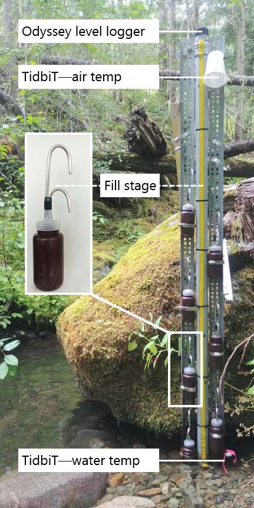

##	Common Methods 

```{r, include = FALSE, package.startup.message = FALSE}

# load required packages
library(tidyverse)  # keep it tidy
library(readr)      # read in delimited files
library(knitr)      # for nice tables

knitr::opts_chunk$set(warning=FALSE, message=FALSE, echo=FALSE, fig.cap=TRUE)

```

### Introduction

Streamflow events were primarily generated by rain in the Leech WSA, with the watershed responding rapidly to inputs. Synoptic sampling was conducted every two to four weeks, but relying only scheduled synoptic sampling could miss interesting NOM changes during the rising limb of the hydrograph. Furthermore, the logistics of Grab sampling through events at multiple sites would have been challenging for one person to accomplish, could have been dangerous due to high flows, and would have required site access beyond safe working hours (i.e. not logistically feasible). However, it was important to sample across the hydrograph to capture sample-sets that represented variation in DOC and NOM that occurred during changing flow conditions (i.e. within storm variability). Based on cost, logistical considerations and curiosity, siphon sampling strategies were employed at the monitoring sites across the LWSA. 

\  


Surface water samples were collected between October 2018 and February 2020 to measure dissolved organic carbon (DOC) concentration and natural organic matter (NOM) character through space and time in the Greater Victoria Water Supply Area (GVWSA).Samples were analyzed at UBC for DOC concentration and NOM character via high temperature combustion and UV-Vis spectroscopy, respectively (details follow in *'Analytical Techniques'*). The sampling program designed for this project included synoptic sampling of 12 sites across the Sooke and Leech water supply areas (WSA), as well as installation of monitoring and sampling stations at 6 sites in the Leech WSA. This chapter details methods that were common to all subsequent chapters.

\  

###   Sampling sites 

Twelve sites were selected across the GVWSA, most of which were in the Leech WSA. A few key streams in the Sooke WSA were included to facilitate preliminary comparison between the two WSAs for reference to future diversion scenarios. The three Sooke WSA sites were: Rithet, Judge, and Deception creeks. The nine Leech WSA sites were: Weeks, Chris, Jarvis, and Lazar creeks (headwaters), Leech River at the head (below of the confluence of headwaters), Cragg Creek, West Leech River, Leech River at the beach below confluence of West Leech, and the Leech River at the Tunnel (Figure \@ref(fig:sampleSitesMap)).

\  

Rithet Creek is the largest tributary (11.12 km^2^ basin) to Sooke Reservoir and Judge Creek is the second largest (8.33 km^2^ basin). The Leech River Tunnel (currently deactivated) terminates at Deception Gulch ('Deception'), a small tributary (4.02 km^2^ basin) to Deception Reservoir. As such, Deception Reservoir could be used as a balancing reservoir for future inter-basin transfers, and it is separated entirely from the current water supply (Sooke Reservoir) by a dam. The Leech WSA includes two major tributary sub-basins: West Leech River (20.85 km^2^) and Cragg Creek (28.06 km^2^). The Cragg crk sub-basin included two headwater sub-basins: Lazar (4.74 km^2^) and Jarvis (1.51 km^2^). The Leech-Beach site was located just downstream from the confluence of West Leech with the Leech River mainstem (94.09 km^2^ sub-basin). And near the effective mouth of the Leech WSA, the Leech Tunnel basin included the entire Leech WSA (95.3 km^2^). Headwaters of the Leech River included Weeks and Chris Creek sub-basins; Weeks sub-basin (11.52 km^2) encompassed Weeks Lake and surrounding wetlands (Jordan Meadows fen), and Chris crk sub-basin (5.8 km^2) included smaller Worley Lake. Below the confluence of Weeks and Chris crk is the Leech-head site (20.59 km^2^ sub-basin), the head of Leech River.  

\  

```{r sampleSitesMap, fig.cap = fig_cap}
fig_cap = "\\label{fig:sampleSitesMap} Twelve synoptic sampling sites across the Leech and Sooke portions of the Greater Victoria Water Supply Area (BC, Canada). Sites with number were set up as monitoring sites and equipped with Vertical Rack samplers. Black lines delineate sub-basin boundaries (with the sampling point as the outlet)."

knitr::include_graphics("R-inputs_UBC-forWater-MSc_HMc/images/thesis_map_all_sites-catchments.png")
```

\  

Across the GVWSA, elevation ranges from approximately 200 m above sea level (asl) to 941 m asl at the top of Survey Mountain near the center of the Leech WSA (Table \@ref(tab:siteCharacteristics)). The predominant geological formation across the GVWSA was metamorphic parent material (Wark Gneiss). The Wark formation was common to all twelve sampling sub-basins except for West-Leech sub-basin, which was underlain by a meta-sedimentary mudstone (Argillite-Metagreywacke) and the Metchosin Volcanics group (igneous). Median sub-basin slopes ranged from 5$^\circ$ to 13$^\circ$ with maximum slope of 61$^\circ$ in the Leech Tunnel basin.

\  

```{r siteCharacteristics}

read_csv("R-inputs_UBC-forWater-MSc_HMc/tables/Ch2_all-site_basin_characteristics_wide.csv", col_names = TRUE) %>%
  knitr::kable(#digits = 1,
               caption = "Watershed Characteristics of Twelve Synoptic Sampling Sites Across the Leech and Sooke Water Supply Areas (WSA), Greater Victoria, BC")
```  

\  

### Sampling methods

####    Synoptic sampling 

Synoptic sampling of the twelve sites was completed over a one- to two-day period. Surface water was collected manually in triple-rinsed acid-washed 250 mL high-density polyethylene (HDPE) wide-mouth amber bottles. Samples were capped with minimal head-space and transported in coolers with ice to the lab for analysis of dissolved organic carbon (DOC) concentrations and spectroscopic absorbance. Synoptic samples were collected every two to four weeks from October 2018 to February 2020. 

\  

Samples were collected (via wading) from within 2 meters of the same location at each sampling site, at the safest proximity to channel center, from approximately 10 cm below water surface. All samples were refrigerated while they were held between collection and analysis. Grab samples collected for DOC quantification were filtered and acidified within 48 hours of collection, except for a set of a dozen samples that were collected by CRD staff in January 2020 which were refrigerated for almost two weeks prior to filtration and acidification. Samples for NOM spectroscopy were not acidified, they were confirmed to have zero turbidity (measured as FTU with spectrophotometer) and measured unfiltered with a spectro::lyser (details follow). 

\  

####    Monitoring & sampling stations 

Six of the sampling sites in the Leech WSA were selected for more intensive monitoring (numbered sites in Figure \@ref(fig:sampleSitesMap)). These sites represent the drainage area upstream of the Leech River Tunnel and five sub-basins nested within the Leech Tunnel catchment. Site 6 included the drainage area for the entire Leech WSA and was located at the Leech River Tunnel. The five sub-basin sites represented important portions of the Leech River system: two headwater streams, Weeks and Chris Creek (sites 1 & 2) and the head of Leech River below their confluence (site 3); and two major tributaries that feed the Leech River, Cragg Creek and West Leech (sites 4 & 5). Monitoring at these sites included Vertical Racks to measure river stage, air and water temperatures, and collect surface water samples with passive siphon samplers. Monitoring sites were selected based on year-round access, suitability for installing Vertical Rack structures and safety considerations for sample and data collection.  

\  

Siphon sampling bottles were used on vertical sampling racks as a cost-effective, logistically practical, reliable and consistent method of passively sampling the rising limb of the hydrograph. In addition to passively collecting samples across the Leech watershed during increasing flow conditions, the vertical racks also recorded river stage and air/water temperatures (using HOBO TidbiT v2 Temperature Data Loggers, Onset, USA). 

\  

Each Vertical Rack included a central stilling well (3.81 cm (1.5") PCV pipe with 1.27 cm (1/2") holes along the length) with a measuring tape affixed to the front. Inside the stilling well was an Odyssey Capacitance Water Level Logger (Dataflow Systems Ltd., New Zealand) used to measure stage continuously and determine the date-time at which each siphon sample was collected. Slotted offset angle bars were installed on either side of the stilling well, which held siphon sampler bottles with hose clamps (Figure \@ref(fig:verticalRack)). 

```{r verticalRack, fig.cap = fig_cap}
fig_cap = "\\label{fig:verticalRack} Vertical sampling rack and siphon sampler bottle, illustrative of installations at six sites across the LWSA (shown here is Chris Creek (site 2)."


```  

Siphon sample bottle design was based on a USGS single stage sediment sampler design (US U-59, 1961, [see @Graczyk2000]). The siphon system was created by modifying lids of 250 mL amber HDPE wide-mouth bottles to include an inlet and exhaust tube. Two 1/4" (O.D.) stainless steel tubes (14 cm and 22 cm length), each with a 180$^\circ$ bend at the top end, were inserted into a pre-drilled cap. The taller tube formed the air vent, the shorter acted as the water inlet (Figure \@ref(fig:verticalRack)). The sample bottle filled when water reached the top of the inlet tube bend, and when a siphon bottle was submerged below this filling height a sample was collected in less than 60 seconds. To ensure a water-tight seal around the inlet and exhaust tubes, marine epoxy was applied to the outside of siphon caps and inert silicone sealant was added to the inside of lids. The siphon samplers collected river water from approximately 5 cm below the surface (the distance between bend at top of intake tube to inlet orifice). Sampled water filled each siphon bottle with approximately 1 cm of head space between the water level and sealed lid, such that a sample was not in direct contact with the siphon lid.   

\  

Each site was visited during synoptic sampling campaigns and acid-washed sample bottles with siphon lids were set out on vertical racks. Sampling bottles were generally staggered at 10-20 cm intervals, though the Rack design allowed for attachment at any height. Bottle filling-stage was recorded from the stilling-well measuring tape at the height that corresponded to the top of each siphon intake tube bend; these positions were used to relate Rack sample collection to continuously recorded stage. Samples were passively collected as rivers responded to precipitation, and were retrieved on subsequent field trips (at which point the filling-stage was double checked). 

\  

During data analysis, each siphon bottle's filling-stage was references to level-logger data to determine the date and time of collection for each rising-stage sample. The timestamps were used to asses temporal variability in DOC & NOM (later Chapters) and to inform quality management of samples (below).   

\  

#####    Siphon sampler assumptions

The representativeness of Vertical Rack samples rely on two key assumptions: (1) the water column was well mixed (no stratification), therefore the sample collected was representative of water quality at each sampling stage; and (2) the sample was discrete, such that there was no infiltration or mixing between surrounding water and the sample in the bottle once it was filled. Observations were used to assess turbulence associated with streamflow at the Vertical Racks and the assumption of fully mixed water seemed justified (see Foundational Results).

\  

#####    Sampling rack hold-time experiments

Every effort was made to retrieve samples as quickly as possible from the Vertical Racks following hydrologic events. None the less, some Rack samples remained in the field from 3 to 40 days due to logistical, access and safety considerations (e.g. during the 2018/2019 winter snow prevented access to sites). Hold-time experiments were conducted at the Tunnel site to assess stability of surface water samples held in siphon bottles between Rack sample collection and retrieval. 

\  

The hold-time experiments included replicate surface water sample collection (n = 10) where half the samples were capped with siphon lids and placed out of water on the Vertical Rack ("held" samples), and the other half of samples were immediately returned to the lab for analysis ("fresh" samples). Three sets of hold-time experiments were completed such that the simulated-rack samples were left in the field for 11, 20 and 34 days before being retrieved for analysis and comparison to their counterpart replicates (details in Foundation Results). The hold-time intervals were selected organically based on sampling campaign trips where the longest interval included a field visit without sample retrieval; these represented a common period between setting bottles on Racks and retrieving full samples (11 days), a longer period between setting and collecting (20 days) and an extended delay (34 days). 

\  

Air temperature data collected at each Vertical Rack were used as part of the hold-time assessment for sample stability. Daily mean air temperatures at each monitoring site were measured and recorded with Hobo TidbiT loggers from 2019-08-24 to 2020-02-18 (field study end), and temperatures prior to TidbiT deployment were estimated by linear regression with CRD weather station data ___(Appendix ###)___.

\  

###   Laboratory analyses of water samples

Surface water samples were transported from the field to the lab in a cooler with ice for quantification of dissolved organic carbon (DOC) and qualitative assessment of natural organic matter (NOM) molecular character. 

\  

#### Quantifying DOC (dissolved organic carbon)

Dissolved organic carbon (DOC), the major constituent of natural organic matter, was quantified as non-purgeable organic carbon (NPOC) via High-Temperature Combustion (Method 5310-B) on a Shimadzu TOC-V [@StdMet5310]. 

\  

##### Sample preparation

Water samples were brought to room temperature, inverted to mix, then filtered and acidified by hand. A clean 60 mL luer-lock syringe was pre-rinsed with sample water three times, then used to triple-rinse a vial (acid-washed 40 mL borosilicate amber glass vial) with filtered sample water. Samples were filtered using pre-rinsed (filter to waste) 0.45 μm polyethersulfone syringe filters [@Karanfil2003; @StdMet5310]. Each sample was syringe-filtered into its pre-rinsed vial and acidified to bring pH below 2 (by adding 200 μL of 4 M hydrochloric acid, reagent grade, into 35 mL filtered sample). Filtered and acidified samples were sealed with Parafilm and place on the autosampler tray (Shimadzu ASI) for instrumental analysis. If samples were to be stored longer than 48 hours, they were filtered and acidified (as above) at end of the field day, capped with Teflon-lined caps and refrigerated until analysis. 

\  

##### Instrumental analysis methods

The first five vials of each analytic run contained only lab grade water; these blanks were analyzed to (1) flush the system and (2) assess instrumental stability (i.e. precision). In series, the Shimadzu autosampler sparged each sample vial with high purity hydrocarbon-free air (1 minute) to drive off dissolved inorganic carbon. Aliquots of sparged sample (80 μL) were drawn into the TOC-V and catalytically combusted (Shimadzu standard catalyst with quartz wool) to convert organic carbon to carbon dioxide which was measured by non-dispersive infrared gas detection to quantify sample NPOC (i.e. DOC). The instrument measured three to five aliquots from each vial to ensure the replicate measurements coefficient of variation (CV) was below 2% and standard deviation (SD) was below 0.1 mg/L. This method represents a direct quantitative measure of DOC; although small volatile organic compounds could be removed in the sparging process, most NOM compounds are of higher molecular weight (e.g. humic substances) and it is unlikely that DOC analytes would be lost [@StdMet5310; @Matilainen2011; @Aiken1995].

\  

Calibration was completed each time the zero-air gas cylinder was replaced, and in one instance when the gas flow rate was adjusted. A five- or six-point calibration curve (0-30 mg/L organic carbon) was created with series made from stock solution of anhydrous primary-standard grade potassium hydrogen phthalate. Calibration was verified regularly by including a 'cal-ver' in most sample trays (standard organic carbon solution diluted to approximately 3-8 mg/L, catalog No.LC129107, labchem.com).

\  

#### Characterizing NOM (natural organic matter)

To assess the molecular character of NOM, samples were analyzed by UV-Vis spectroscopy (ultraviolet-visible light) using a spectro::lyser (s::can, Vienna, Austria). The spectro::lyser is a self-contained spectrophotometer and data-logger (with external power source) that measures turbidity and UV-Vis absorbance (i.e. light attenuation) across the wavelength range of 200 nm to 750 nm (recorded at 2.5 nm intervals). While the spectro::lyser is a field-deployable instrument, it was used in a laboratory setting for these analyses. 

\  

##### Sample analysis

Water samples were brought to room temperature, inverted to mix and used to triple-rinse the spectro::lyser sample space prior to analysis. Water samples were analyzed unfiltered and any sample with detectable turbidity (greater than 0.0000 FTU) was excluded from analysis because suspended matter can interfere with UV-Vis absorbance due to light scattering [@StdMet5910]. The spectro::lyser used in these analyses had a fixed pathlength of 35.0 mm. 

\  

##### Instrument and data handling

The spectro::lyser is pre-calibrated with an internal Global calibration file (Global Calib.: "RIVER000V120") to calculate estimates of total organic carbon (TOC), dissolved organic carbon (DOC), and nitrate-nitrogen (NO~3~^-^-N) concentrations. The Global Calibration algorithm was reported as "multi-wavelength algorithms of a turbidity-compensated absorbance fingerprint" [@Avagyan2014]. Spectro::lyser DOC estimates were evaluated in comparison to NPOC as an indicator of molecular changes, otherwise specific absorbance coefficients (SAC, m^-1^) were used to assess molecular character.

\  

NOM molecular character was judged through a combination of specific UV-absorbance at 254 nm (SAC~254~, an indicator of chromophoric NOM), SUVA~254~ (L mg^-1^ m^-1^) which indicates aromaticity relative to DOC concentrations, and the quotient E~2~:E~3~ (unitless) which is inversely proportional to aromaticity and/or molecular weight of aqueous NOM.

\  

###### Spectral indices of NOM character

More aromatic NOM molecules (i.e. humic substances) will absorb more energy at 254 nm wavelength than less-aromatic molecules, so the spectral absorbance coefficient (SAC~254~) is a common indicator of aromaticity. Specific ultraviolet absorbance at 254 nm (SUVA~254~) is an indicator of NOM aromaticity relative to concentration, and is calculated by dividing SAC~254~ by DOC concentration (units of liter per milligram carbon per meter (Lmg-C^-1^m^-1^, i.e. L/mg-m)). Both SAC~254~ and SUVA~254~ are possible indicators of NOM reactivity and as such, each was calculated and evaluated with respect to disinfection by-product formation potential (DBP-FP, more details in _Appendix ####_) and the one most correlated to BDP-FP was selected for continued analysis.

\  

The spectral quotient E~2~:E~3~, which is inversely related to aromaticity and molecular size of aquatic humic solutes (Peuravuori and Pihlaja 1997; Helms et al. 2008), was calculated as the ratio of absorbance coefficients at wavelengths 250 nm and 365 nm (i.e. SAC~250~ / SAC~365~). 

\  

### Defining seasons 

Coastal BC climate is characterized by a predominantly wet season and dry season, but seasonal delineation can be nebulous. Here, seasons were operationally defined by sampling method restrictions such that the "wet" season was defined as the period when conditions generated stream response significant enough for Vertical Racks to collect rising limb samples, and the "dry" season was defined by the absence of stream response substantial enough for Rack sampler collection. 

\ 

Leech WSA rain data (average of Chris Creek and Martin's Gulch FWx stations) were used to define events that corresponded to Rack sample collection. Rain events were defined using the 'RMevents' function in the R package _Rainmaker_ (github.com/USGS-R/Rainmaker), in which threshold rain and inter-event period parameters were tuned to find conditions that defined events which aligned with stream response across the Leech WSA. Refined events were used to help distinguish the start and end of wet and dry seasons, where wet season began when Vertical Rack sampling was initiated by stream stage changes, and ended when streamflow dropped off and Vertical Rack samples were no longer collected. Snow was qualitatively considered when defining seasons, as it did not contribute to event definitions but did contribute to stream levels at the monitoring sites. 

\  

### Foundational Results

This chapter presents results used to informed all subsequent data analysis, interpretation and evaluations discussed in following chapters. Elemental results presented here include weather data and it's application in seasonal delineation and quality control for Vertical Rack sampling method development. 

\

#### CRD weather data

The Capital Regional District (CRD) provided data from two fire-weather ("FWx") stations located in the Leech water supply area (LWSA). Chris Creek weather station was near the headwaters of the Leech watershed and Martin's Gulch was located near the future point of diversion, the Leech River Tunnel (Table \@ref(tab:StnSummary)). Rain data were used in defining sampling seasons and air temperature data were used in quality control assessments of Vertical Rack sample hold-times. 

\  
 
```{r StnSummary}
read_csv("R-inputs_UBC-forWater-MSc_HMc/tables/methods_FWx_Stn_summary.csv",
         col_names = TRUE) %>% 
  knitr::kable(caption = "CRD fire weather station (FWx) summary of features")

```

\  

Average LWSA weather data was calculated as arithmetic means from Chris Creek and Martin's Gulch FWx stations data (Table \@ref(tab:meanWxLWSAdata), Figure \@ref(fig:meanWxLWSA), see Appendix for summary of each FWx station). It was assumed that the arithmetic means of rainfall from Chris Creek and Martin's Gulch stations were representative of rain conditions across the Leech WSA and were used to define rain events that corresponded to Vertical Rack sample collection at the six monitoring sites. 

\  

```{r meanWxLWSAdata}
read_csv("R-outputs_UBC-forWater-MSc_HMc/tables/Wx_LWSA-mean-summary.csv", col_names = TRUE) %>% 
  knitr::kable(digits = c(1, 1, 1, 2, 1, 1, 1, 1),
               caption = "Average Weather Data from Chris Creek and Martin's Gulch Fire-weather Stations in Leech Water Supply Area in 2018, 2019, and the period of 2020 included in this project")
```

\  

```{r meanWxLWSA, fig.cap = fig_cap}
fig_cap = "\\label{fig:meanWxLWSA} Average weather from Chris Creek (560 m a.s.l) and Martin's Gulch (512 m a.s.l) fire-weather stations in the Leech Water Supply Area, where the highlighted section indicates the study period."

knitr::include_graphics("R-outputs_UBC-forWater-MSc_HMc/figures/Wx_LWSA-means.png")
```

\  

#### Seasonal delineation  

Wet seasons were defined by conditions that generated stream responses significant enough to collect Vertical Rack samples, and the dry season was defined by baseflow conditions where stream response was not detected at the Vertical Racks. There were 18 rain events of sufficient magnitude for Vertical Rack sample collection; the conditions that corresponded to these major rain events were precipitation accumulating to 50 mm or more with a period of at least 14 hours between 50 mm rain accumulation (Table \@ref(tab:EventsTable)). 

\  

```{r EventsTable}
read_csv("R-outputs_UBC-forWater-MSc_HMc/tables/Wx_Events.csv",
         col_names = TRUE) %>% 
  select(-c("Storm number")) %>% 
  knitr::kable(digits = c(0, 0, 1, 1, 0), 
               caption = "Rain Events Defined by Vertical Rack Sample Collection (corresponding to a threshold of 50 mm accumulation with 14-hour inter-event period)" )

```

\  

The sixteen-month study period was separated into "wet" and "dry" seasons based on detectable stream response at each monitoring site and across the GVWSA, stream response was primarily driven by the presence of major rain events. However, there was a period of snowfall (winter of 2018/2019) when rainfall runoff subsided and melt generated streamflow response across the monitoring sites. That period of snow accumulation and melt was included when delineating the 2018/2019 wet season, despite the lack of defined rain events (Figure \@ref(fig:seasonalMegaPlot)). The 2018/2019 wet season extended from the start of the project (October 2018) to mid-May 2019, and the period from late January (event 8, Table \@ref(tab:EventsTable)) to mid-May had streamflow changes governed by snowmelt rather than rainfall. The 2019 dry sampling season spanned from mid-May to late-September, and the 2019/2020 wet season began mid-September (event 9, Table \@ref(tab:EventsTable)) and extended to the end of the field study period (Feb 20, 2020).

\  

```{r seasonalMegaPlot, fig.cap = fig_cap}
fig_cap = "\\label{fig:seasonalMegaPlot} Leech Water Supply Area (LWSA) air temperature and precipitation plotted with stream responses and sample collection at six monitoring sites across the LWSA. Vertical yellow lines indicate seasons, which were defined by the start of Vertical Rack sampling (wet season) and baseflow Grab sampling during the dry season. The dashed yellow line separates the 2018/2019 wet season into rain-dominated and snow-melt dominated streamflow. The 'first flush' period indicates the first event and beginning of the 2019/2020 wet season. " 

knitr::include_graphics("R-outputs_UBC-forWater-MSc_HMc/figures/Wx-stage_subbasins_season-megaplot2.png")
```

\  

#### NOM character: SAC~254~ rather than SUVA~254~

Comparison between disinfection byproduct formation potential (BDP-FP) with DOC, SUVA~254~ and SAC~254~ (Appendix ####################) showed that SAC~254~ was a better predictor of DBP-FPs and therefor SAC~254~ was focused on as an indicator of NOM aromaticity and reactivity and SUVA~254~ was largely ommitted from resuls. 

\  

#### Vertical Rack sampling quality control

##### Assumptions of mixing

Trail cameras were installed at four sites (data not included) and observation of streamflow during Rack sample collection showed highly turbulent flows, thus the assumption of well-mixed water was accepted. 

\  

Discrete sample collection was validated in lab using food colouring and a flow-through bucket system. A siphon sampler bottle was submerged in a container filled with circulating tap water; following siphon sample collection, food colouring was added to the system and circulated for 15 minutes, then the sample bottle was removed from this dye chamber and the colour of the sample inside the siphon bottle was visually compared to the dyed water that had circulated around it. This test was repeated five times with different siphon-lid bottles. There was no dye present in any of the siphon sample bottles following the tests. This test satisfied the assumption of discrete siphon sample collection.  

\  

##### Hold-time experiments

Hold-time experiments included three sets of 10 samples, each set compared 5 samples held on the Vertical Rack to 5 replicate samples analyzed immediately after collection ("fresh"). For each set, the number of days that samples remained held on the Rack were used with air temperatures during the hold-period to assess Rack sample stability (Figure \@ref(fig:HoldTimeAirPlot)). Results were used to flag data as suspect or acceptable for inclusion in further data analysis.

\  

```{r HoldTimeAirPlot, out.width = "100%", fig.pos="h", fig.cap = fig_cap}
fig_cap = "\\label{fig:HoldTimeAirPlot} Air temperature during vertical rack hold-time experiments. Red horizontal lines indicate the 0-7°C range of a typical laboratory refrigerator and dashed vertical lines separate the three sets of hold-time experiment samples including the period between collection of 'fresh' samples to the retrieval of 'held' (Rack) samples."

knitr::include_graphics("R-outputs_UBC-forWater-MSc_HMc/figures/HoldTime_airTemp_megaplot.png")
```

\  

All samples were analyzed to quantify DOC and characterized NOM properties and the fresh and held samples of hold-time set were compared using two-sided paired Wilcoxon signed rank tests (a.k.a 'Mann-Whitney' test, non-parametric paired difference test that does not assume normally distributed data). For a wider margin of error, a 90% confidence level (rather than 95% or 99%) was used to evaluate comparisons between fresh and held sample results (Table \@ref(tab:HoldTimeTtests)).

\ 

```{r HoldTimeTtests}
read_csv("R-outputs_UBC-forWater-MSc_HMc/tables/HoldTime_results-summary.csv", col_names = TRUE) %>%
  knitr::kable(caption = "Results comparing three Vertical Rack hold-time experiment sets for sample stability in the field",
               col.names = c("Set", "Days held", "Air temp.", 
                             "DOC change (%)", "p-value (DOC)", 
                             "SAC~254~ change (%)", "p-value (SAC~254~)", 
                             "E~2~:E~3~ change (%)", "p-value (E~2~:E~3~)")) 
```
_Note:_ one star (*) indicates significant difference at 90% confidence (p < 0.1), 
two stars (**) indicates significant difference at 95% confidence (p < 0.05)


\  

There was a significant change in DOC concentration (at 90% confidence, p-value = 0.063) for hold-time set-A, where mean DOC concentration was 45% lower in the held samples compared to the fresh grab samples. Despite a change in concentrations, there was no change in NOM character as measured by SAC~254~ or E~2~:E~3~. Samples collected for hold-time set-A were DOC-rich "first flush" samples (i.e. the first sampling event of a wet season), and the Rack samples were held for 11 days at average temperature of 7° C (slightly above laboratory refrigerator temperatures). 

\  

Set-B had a hold-time of 20 days with average air temperature of 6° C. There were no significant changes to DOC concentrations or E~2~:E~3~ values between fresh and rack-held samples for this set. Wilcoxon tests for set-B showed that the 8% change in SAC~254~ was statistically significant (at 90% confidence). However, the SAC~254~ difference in set-B was determined to be caused by an outlier which could be rejected with 99% confidence by Dixon's Q-test (Q~exp~ = 0.941 > Q~crit~ = 0.821). Therefore, it was concluded that, despite the measured difference (Figure \@ref(fig:HoldTimeBoxPlot), Table \@ref(tab:HoldTimeTtests)) there was not truly a reliable change in SAC~254~ for hold-time set-B. 

\  

Hold-time set-C included samples held for 34 days at an average of 4.4° C, including a period of sub-zero temperatures. While set-C did not yield statistically significant changes in DOC concentration (23% DOC reduction from fresh to held), there were significant changes to SAC~254~ (34% decrease in absorbance), and E~2~:E~3~ (14% decrease). In addition to the change in absorbance, rack-held set-C samples had greater variability for both all variables compared to the fresh sample counterparts (Figure \@ref(fig:HoldTimeBoxPlot)). 

\  

```{r HoldTimeBoxPlot, fig.cap = fig_cap}
fig_cap = "\\label{fig:HoldTimeBoxPlot} Comparison of three hold-time experiment sets, contrasting 'fresh' and 'held' sample results for DOC concentrations, spectral absorbance coefficient at 254 nm (SAC~254~) and the spectral quotient E~2~:E~3~ (SAC~250~/SAC~365~)."

knitr::include_graphics("R-outputs_UBC-forWater-MSc_HMc/figures/HoldTime_boxplots.png")
```

\  

#### Foundational Results summary 

Results of hold-time experiments suggest that early-wet-season ("first flush") samples may contain more labile and aliphatic DOC which is unstable and should be analyzed immediately after collection, whereas later season samples contain DOC which is relatively more stable for up to and including 20 days when held at temperatures that approximate a refrigerator. A hold-time of 34 days with periods of freezing resulted in significant changes to sample NOM molecular character; and while DOC concentrations were not statistically altered, there was a notable increase in held sample DOC standard deviation. Additional tests would be required to determine if the change in NOM character was caused by the length of time the sample was held, or perhaps due only to freezing and thawing, or a combination of both time and temperature. Based on these results, sample analyses data were updated to include quality-assurance/quality-control (QA/QC) flags which were used to filter sample data, reducing the effective number of samples included in results by less than 10%. 

\  

Hold-times were calculated for each sample as the time between sample collection and analysis. Any sample that remained held for fewer than 20 days at temperatures between 0-7° C were flagged as acceptable for further data analysis; Rack samples that were held for 20 days or longer were flagged for exceeding a reliable hold-time; and samples identified as early-wet-season ("first-flush") that had a hold-time of 7 days or longer were flagged as unacceptable and not included in further data analysis. Because of possible freeze-thaw changes to DOC and NOM, any sample that underwent suspected or confirmed freezing was also flagged for temperature effects. Hold-time test experiments indicate that extended time in the field on a Vertical Rack could result in a decrease in DOC but not an increase, therefore no positive bias in DOC result should be suspected from event-based samples.    

\  
