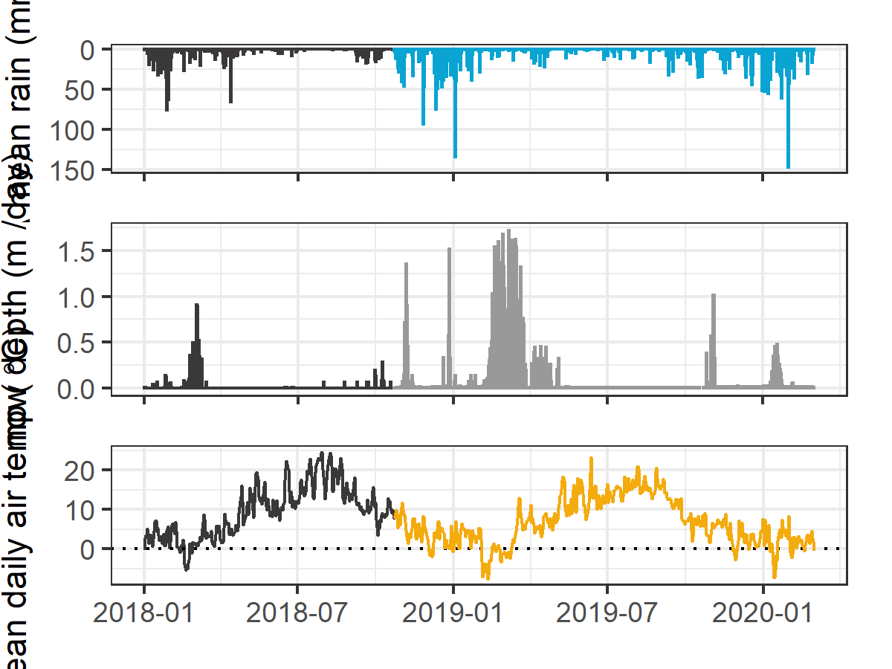
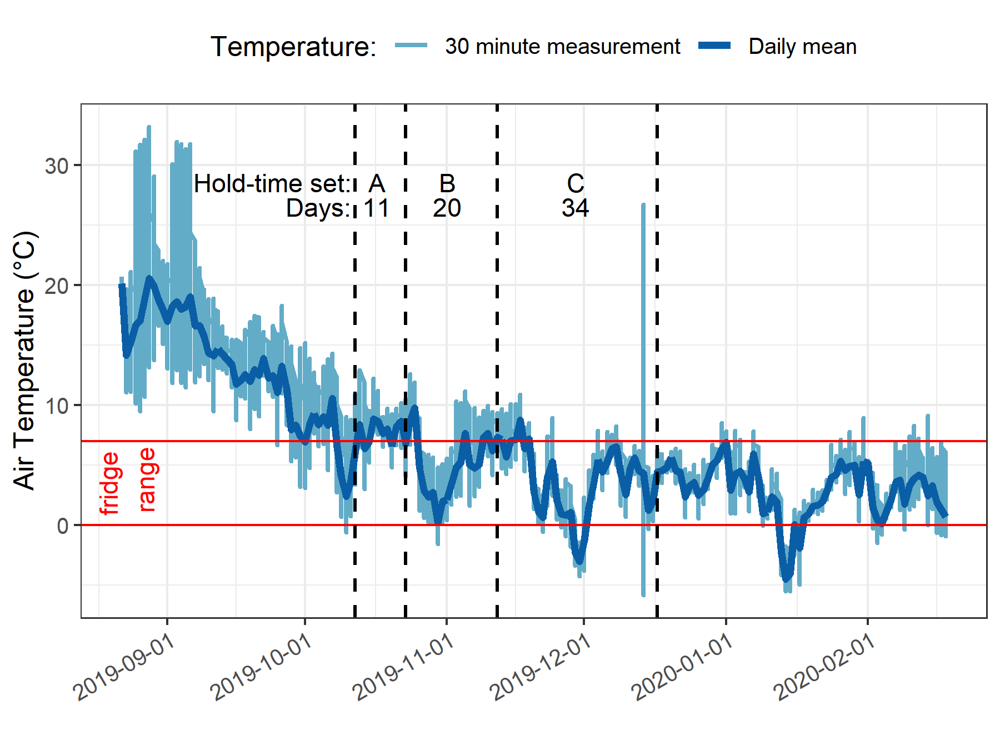
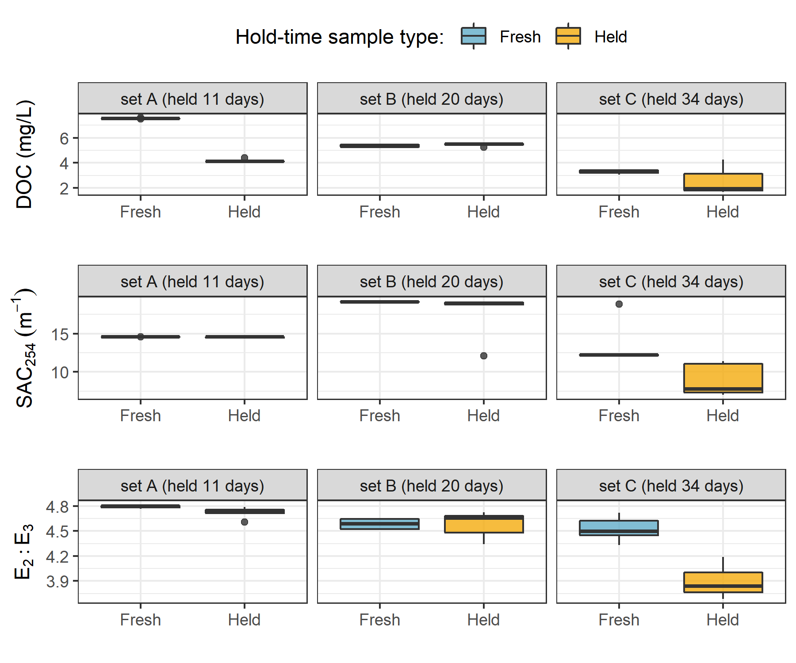
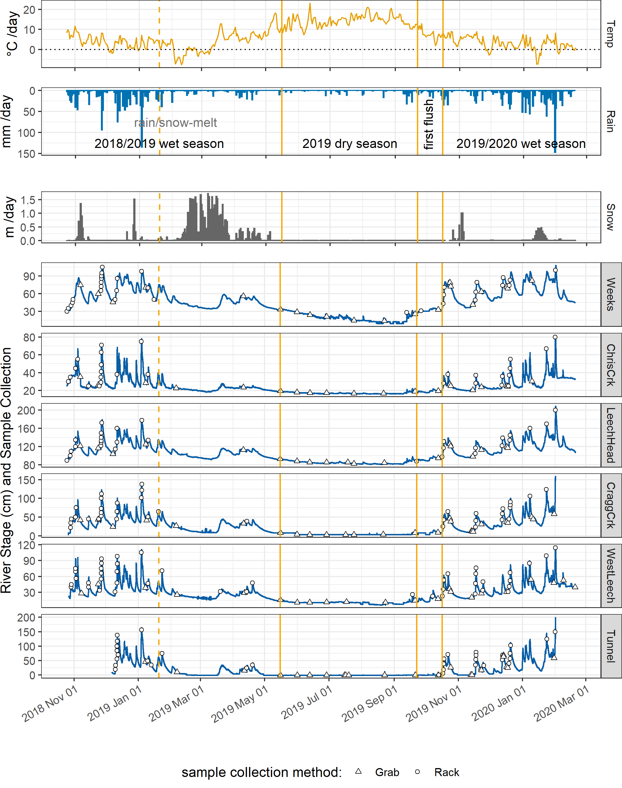
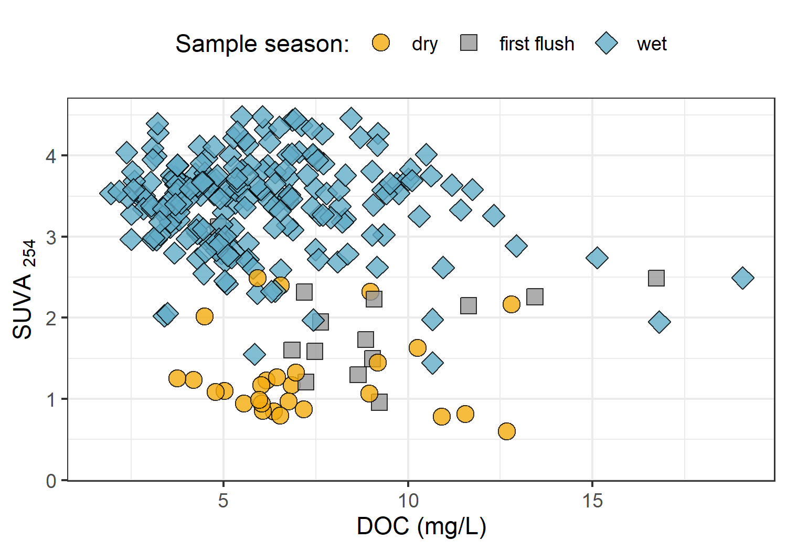

##	Spatial and temporal patterns in DOC & NOM

```{r, include = FALSE, package.startup.message = FALSE}

# load required packages
library(tidyverse)  # keep it tidy
library(readr)      # read in delimited files
library(knitr)      # for nice tables

knitr::opts_chunk$set(warning=FALSE, message=FALSE, echo=FALSE, fig.cap=TRUE)

```

### Introduction

Drinking water in Canada is primarily sourced from surface water supplies.
Over 85% of Canadians, and approximately 80% of British Columbians depend on drinking water that originates from forested headwaters [@Pike2010]. Climate, weather, and physical characteristics of a watershed lead to variations in surface water quality, and runoff links surface water sources to the landscape by introducing terrestrial sediments, nutrients, and organic matter into solution [@Pike2010; @Johnson1997; @Delpla2016; @HealthCanada2019; @Yang2015; @Matilainen2010]. 

\  

####   Aqueous natural organic matter in source water supply

Natural organic matter (NOM) comprises a dynamic collection of molecules that originate from a variety of sources, and aqueous NOM exists in complex and diverse combinations of particulate, colloidal and dissolved fractions [@Peuravuori1997 ;@Aiken2011; @Matilainen2011; @Ruhala2017]. NOM can be introduced to a water body from terrestrial sources (i.e. allochthonous NOM) or generated through in-stream processes (i.e. autochthonous NOM) which are often associated with autotrophic organisms like algae and cyanobacteria [@HealthCanada2019; @Epps1994]. Terrestrial organic matter (allochthonous NOM) includes humic and fluvic acids, tannins, and a wide variety of other compounds (e.g. phenols and lignin, hydrocarbons, proteins, carbohydrates, etc.), which enter fresh water through runoff [@Zarnetske2018; @HealthCanada2019]. 

\  

NOM concentration and character vary widely in source water depending on source material, hydrology, and biogeochemical factors [@Aiken2011; @Abbott2018; @Zarnetske2018; @Matilainen2010]. Molecular composition and physical structure of NOM influence its functionality and reactivity, therefore different types of aqueous NOM in drinking source water have different disinfection by-product formation potentials (DBP-FPs) [@Delpla2016; @Yang2015; @HealthCanada2019; @Chow2008], and different aquatic ecosystem roles [@Cory2011]. Furthermore, different species of NOM vary in molecular size, structure and charge distribution, which determine requirements for effective treatment and removal [@Jacangelo1995; @Matilainen2010].  

\  

Molecular structures of NOM can contain nitrogen, silica, oxygen and hydrogen and are composed primarily of carbon; thus, organic carbon (OC) is often quantified as a proxy for NOM concentration [@Cory2011; @HealthCanada2019; @Matilainen2010; @MWH2014]. Total organic carbon (TOC) is operationally divided into particulate and dissolved fractions (POC and DOC, respectively) which are typically distinguished based on separation by a 0.45-micron filter [@StdMet5310; @Aiken2011]. Generally, DOC is the predominant fraction of TOC in surface water, and the amount of DBPs in treated water is proportional to raw water DOC concentration [@Weishaar2003; @Ruhala2017; @Chow2008]. 

\  

In addition to acting as a precursor for DBPs, DOC (thus NOM) has been called a master variable due to it's terrestrial-aquatic linkages, influence on water chemistry and role in contaminant transport [@Zarnetske2018; @Ruhala2017]. NOM is an energy source for aquatic heterotrophs, it has the ability to bind and transport contaminants in solution (e.g. metals, hydrophobic organic pollutants, nutrients), can influence stream pH and aquatic light and temperature regimes; which, in turn, effect aquatic microbial communities [@Matilainen2010; @Oni2013; @Aiken2011; @Weishaar2003; @LaZerte1991; @Palleiro2013; @Stanley2012; @Cory2011]. 

\  

DOC is an important source water quality parameter to monitor and guidelines in British Columbia specify that drinking source water TOC should remain below 4 mg/L, primarily to reduce the production of trihalomethanes (e.g. chloroform, a common DBP) in treated drinking water [@BC2019]. Aside from DBPs, monitoring source water DOC is important for addressing other operational issues associated with NOM and drinking water treatment challenges. Within a watershed, the characteristics and concentrations of NOM (and therefore DOC) naturally fluctuate over space and through time, creating dynamic conditions and potential treatability concerns [@Li2014; @Yang2015].

\  

#### Surface water sampling strategies

\  

A discrete water sample cannot tell a complete story of a hydrologic system's water quality dynamics but it can provide information about specific attributes of the water in a given place at a certain time, if it accurately represent the body from which it was collected. Non-representative sampling techniques will lead to non-representative analytical results and ultimately to erroneous conclusions [@CCME2011]. Collection of water samples must be done consistently and carefully to avoid sample contamination or sampling errors which would generate unreliable analytical results [@CCME2011]. In a carbon-based world, sample contamination must be a crucial and constant consideration when sampling for NOM [@CCME2011; @Cory2011]. 

\  

The basis of a water quality monitoring network is the collection of representative quantitative data for physical, chemical or biological parameters that help to characterize a hydrologic system over time [@Strobl2008a]. A monitoring network, therefore, will involve some form of a sampling program and it's design should reflect research objectives, account for physical realities (e.g. spatiotemporal heterogeneity, access), while being cost-effective and practical [@Strobl2008a; @Kirchner2006]. Grab-sampling is a standard method of collecting whole-water samples for laboratory or stream-side analysis [@CCME2011; @Ruhala2017]. Synoptic grab sampling can be completed at a number of sites over a relatively short period of time (e.g. hours to days) to assess spatial variations, however there is often a lack of temporal resolution due to scheduled, convenient or opportunistic sampling at relatively low frequencies [@Ruhala2017]. 

\  

It can be difficult to schedule a synoptic sampling campaign for specific weather and flow conditions, especially for short duration of rapid runoff (@Harmel2003). Flow changes in response to precipitation or melt events are of interest for NOM studies as the rising limb of the hydrograph has been shown to have higher DOC concentration that non-storm flow [@Yang2015; @Raymond2016; @Raymond2010]. While high flows present an opportunity to capture the dynamic water quality changes that occur during events, it is logistically challenging and potentially dangerous to manually collect grab samples during events across multiple sites (@Graczyk2000; @Mackay2012). So, pump samplers or passive siphon samplers can be used to collect water samples under difficult or unsafe conditions. 

\  

A pump sampler (e.g. ISCO samplers, Teledyne ISCO, Inc., Lincoln, NE, USA; or Global Water Instrumentation, Gold River, California) can be set up in the field and programmed to collect a set of water samples based on time intervals or changes in conditions (e.g. stage or turbidity thresholds). Pump samplers are effective for automatic event-based sampling (@Harmel2003) but can be prohibitively expensive ($2K-3K CAD), and also require a reliable power source which can pose logistical challenged for setting up at multiple sites in remote or difficult to access locations (@Mackay2012). A passive siphon sampler is an alternative to a pump sampler that automatically and effectively collects discrete water samples on the rising limb of the hydrograph (e.g.: @Mackay2012; @Graczyk2000; @Diehl2007). Siphon samplers are limited to sampling a single event and (so far) are not suitable for sampling the falling hydrograph limb; they are however very low cost, customizable and require no power [@Newham2001].

\  

In this project, a sampling strategy was developed to quantify the ranges of DOC concentration and NOM character between adjacent drainage basins and among nested sub-catchments in the Greater Victoria water supply area. 

\  

### Methods

To measure the ranges of dissolved organic carbon (DOC) concentration and natural organic matter (NOM) character over space and time, river sampling was conducted from October 2018 to February 2020. Water samples were collected and analyzed at UBC for DOC concentration and NOM character via high temperature combustion and UV-Vis spectroscopy, respectively (details follow in *'Analytical Techniques'*). The river sampling program designed for this project included synoptic sampling of 12 sites across the Sooke and Leech water supply areas (WSA), as well as installation of monitoring and sampling stations at 6 sites in the Leech River watershed. Results of synoptic sampling analyses were used to elucidate spatial and temporal patterns in NOM and DOC.  

####    Sampling sites 

Most of sampling sites were in the Leech WSA and a few key rivers in the Sooke WSA were also included (Figure \@ref(fig:sampleSitesMap)). Rithet Creek is the largest tributary to Sooke Reservoir and Judge Creek is the second largest. Deception (gulch) is a small tributary to Deception Reservoir and the Leech River Tunnel (currently deactivated) terminates at Deception gulch. Thus, Deception Reservoir is a likely balancing reservoir for future inter-basin transfers, and it is separated entirely from the current water supply (Sooke Reservoir) by a dam. 

In the LWSA, Weeks and Chris Creek are headwater streams of the Leech River and Lazar and Jarvis Creeks are headwaters of Cragg Creek, a major tributary to the Leech. West Leech River is the other major tributary to the Leech River, and Leech-Beach site was located just downstream from the confluence of West Leech with the mainstem. The Leech Tunnel site was located near the effective mouth of the LWSA, at the Leech River Tunnel. 

```{r sampleSitesMap, fig.cap = fig_cap}
fig_cap = "\\label{fig:sampleSitesMap} *River sampling sites across the Leech and Sooke Water Supply Areas (WSA), Greater Victoria, BC.*"

knitr::include_graphics("R-inputs_UBC-forWater-MSc_HMc/images/thesis_map_all_sites-catchments.png")
```  

\  

#####    Synoptic sampling 

Synoptic sampling involved collecting grab samples of river water at as many sites as possible over a relatively short time period (e.g. 1 day). River water was collected in triple-rinsed acid-washed 250 mL high-density polyethylene (HDPE) wide-mouth amber bottles. Samples were capped with minimal head-space and transported in coolers with ice to the lab for analysis of dissolved organic carbon (DOC) concentrations and spectroscopic absorbance (an indicator of NOM character). 

\  

Samples were collected (via wading) from within 2 meters of the same location at each sampling site, at the safest proximity to channel center, from approximately 10 cm below water surface. All samples were refrigerated while they were held between collection and analysis. Grab samples collected for DOC quantification were filtered and acidified within 48 hours of collection, except for a set of a dozen samples that were collected by CRD staff in January 2020 which were refrigerated for almost two weeks prior to filtration and acidification. Samples for NOM spectroscopy were not acidified, they were confirmed to have zero turbidity and measured unfiltered. 

\  

#####    Monitoring & sampling stations 

Six of the sampling sites in the LWSA were selected for more intensive monitoring (numbered sites in Figure \@ref(fig:sampleSitesMap)). These sites represent the drainage area upstream of the Leech River Tunnel and five sub-basins nested within the Leech Tunnel catchment. Site 6 included the drainage area for the entire LWSA and was located at the Leech River Tunnel. The five sub-basin sites represented important portions of the Leech River system: two headwater streams, Weeks and Chris Creek (sites 1 & 2) and the head of Leech River below their confluence (site 3); and two major tributaries that feed the Leech River, Cragg Creek and West Leech (sites 4 & 5). Monitoring at these sites included river stage, temperatures, and passive siphon sampling schemes. 

\  

The Leech watershed system responds quickly to rainfall, and the logistics of grab sampling through events at multiple sites would have been very challenging for one person to accomplish, could have been dangerous to manually sample, and would have required site access beyond safe working hours (i.e. not logistically feasible). It was important to sample across the hydrograph to capture sample-sets that represented the variation in DOC and NOM that occurred during changing flow conditions (i.e. within storm variability). Based on cost, logistical considerations and curiosity, siphon sampling strategies were employed at the monitoring sites across the LWSA. Siphon sampling bottles were used on vertical sampling racks as a cost-effective, logistically practical, reliable and consistent method of passive event-based sampling that enhanced the synoptic sampling program. In addition to passively collecting samples across the Leech watershed during increasing flow conditions, the vertical racks also recorded river stage and air/water temperatures (using HOBO TidbiT v2 Temperature Data Loggers, Onset, USA). 

\  

Each vertical sampling rack included a central stilling well (3.81 cm (1.5") PCV pipe with 1.27 cm (1/2") holes along the length) with a measuring tape affixed to the front. Inside the stilling well was an Odyssey Capacitance Water Level Logger (Dataflow Systems Ltd., New Zealand); and on either side of the central stilling well was a slotted offset angle bar onto which hose clamps held siphon sampler bottles (Figure \@ref(fig:verticalRack)). 

```{r verticalRack, fig.cap = fig_cap}
fig_cap = "\\label{fig:verticalRack} *Vertical sampling rack and siphon sampler bottle, illustrative of installations at six sites across the LWSA (shown here is Chris Creek (site 2).*"

knitr::include_graphics("R-inputs_UBC-forWater-MSc_HMc/images/Rack_diagram_full.png")
```  

Custom-built siphon sampler bottles used in this research were based on a USGS single stage sediment sampler design (US U-59, 1961, [see @Graczyk2000]). Screw caps for 250 mL amber HDPE wide-mouth bottles were augmented to include a siphon system made of two 1/4" (O.D.) stainless steel tubes, each with a 180$^\circ$ bend at the top end; the longer tube formed an air vent, the shorter acted as a water inlet. The sample bottle filled when river water reached the top of the inlet tube bend (Figure \@ref(fig:verticalRack)). Marine epoxy was applied to the outside of siphon caps to ensure a water-tight seal around the inlet and exhaust tubes, and inert silicone sealant was added to the inside of lids to ensure watertightness and clean sample containment. The siphon samplers collected river water from approximately 5 cm below the surface (the distance between bend at top of intake tube to inlet orifice). Sampled water filled each siphon bottle with approximately 1 cm of head space between the water level and sealed lid, such that a sample was not in direct contact with the siphon lid.   

\  

Each time a monitoring site was visited, empty acid-washed sample bottles with siphon lids were set out on vertical racks. Sampling bottles could be placed at any height and were generally staggered at 10-20 cm intervals. The stage at which each siphon bottle filled was recorded -- this was the observed height on the stilling-well measuring tape that corresponded to the top of each siphon intake tube bend (filling-stage). Samples were passively collected in my absence as rivers responded to precipitation, and I retrieved them on subsequent field trips (at which point the filling-stage was double checked). 

\  

During data analysis, each siphon bottle's filling-stage was references to level-logger data to determine the date and time of collection for each rising-stage sample. To the best of my knowledge, this project was the first to combine vertically staggered passive siphon samplers with observed and continuously recorded stage to obtain timestamps of sample collection. The timestamps were used to asses temporal variability in DOC & NOM (details in Chapter 3) and to inform quality management of samples (below).   

\  

######    Siphon sampler assumptions

The representativeness of vertical rack samples relied on two key assumptions: (1) the water column was well mixed (no stratification) therefore the sample collected was representative of river water quality at each sampling stage; and (2) the sample was discrete, such that there was no infiltration or mixing between surrounding river water and the sample in the bottle once the sample was collected.

\  

Based on turbulence associated with flows upstream of the vertical racks (step-pool formations), the assumption of fully mixed and unstratified water seemed justified. Sample discretion was validated in lab using food colouring and a flow-through bucket system. In this test, a siphon sampler bottle was submerged in a container filled with circulating tap water; following siphon sample collection, food colouring was added to the system and circulated for 15 minutes, then the sample bottle was removed from this dye chamber and the colour of the sample inside the siphon bottle was compared to the dyed water that had circulated around it. This test was repeated five times with different siphon-lid bottles. There was no dye present in any of the siphon sample bottles following the tests. This affirmed the assumption of discrete siphon sample collection.  

\  

######    Sampling rack hold-time experiments

Every effort was made to retrieve rack samples as quickly as possible from the racks following rain events. None the less, some samples remained on a rack for more than a few days due to logistical, access and safety considerations. So, hold-time experiments were performed to assess river sample stability over periods between rack sample collection and retrieval. The hold-time experiments included replicate sample collection (n = 10) where half the samples were capped with siphon lids and placed out of water on a vertical rack in the field and the other half of samples were immediately returned to the lab for analysis. Three sets of hold-time experiments were completed such that the simulated-rack samples were left in the field for 11, 20 and 34 days before being retrieved for analysis and comparison to their counterpart replicates (details in results section). The temperature sensors installed at each vertical rack were used as part of the hold-time assessment for sample stability and results were used to flag data as suspect or acceptable for inclusion in results.

\  

####   Laboratory analyses of water samples

Each water sample was transported from the field to the lab in a cooler with ice for quantification of dissolved organic carbon (DOC) and qualitative assessment of natural organic matter (NOM) molecular character. Aqueous forms of NOM in freshwater play important ecological roles but can be problematic for drinking water treatment because they increase oxidant demand (e.g. chlorination), contribute to the formation of disinfection by-products, and cause other disruptions (e.g. short filter run times, microbial bio-fouling, coagulant demand). Because the backbone of NOM is carbon, DOC is a measure of the dissolved forms of NOM in a sample. While quantifying a sample's DOC is important in describing the amount of NOM, it tells us nothing about the structure (and therefore the function) of that material. Characterizing molecular attributes in addition to quantifying NOM provides greater insight than quantification alone; therefore, both quantification of DOC and characterization of NOM were tackled for this project. Samples were also measured for phosphate concentration using a colourimetric (ascorbic acid) orthophosphate test kit (HACH PO-19); each water sample had phosphate concentration below detectable limits (0.1 mg/L).

\  

##### Quantifying DOC (dissolved organic carbon)

To quantify dissolved organic carbon (DOC), the major constituent of natural organic matter, samples were analyzed for non-purgeable organic carbon (NPOC) via High-Temperature Combustion (Method 5310-B) on a Shimadzu TOC-V [@StdMet5310]. 

\  

###### Sample preparation

Water samples were brought to room temperature, inverted to mix, then filtered and acidified by hand. A clean 60 mL luer-lock syringe was pre-rinsed with sample water three times, then used to triple-rinse a vial (acid-washed 40 mL borosilicate amber glass vial) with filtered sample water. Samples were filtered using pre-rinsed (filter to waste) 0.45 μm polyethersulfone syringe filters [@Karanfil2003; @StdMet5310]. Each sample was syringe-filtered into its pre-rinsed vial and acidified to bring pH below 2 (by adding 200 μL of 4 M hydrochloric acid, reagent grade, into 35 mL filtered sample). Filtered and acidified samples were sealed with Parafilm and place on the autosampler tray (Shimadzu ASI) for instrumental analysis. On a few occasions with extended time in the field (greater than 48hrs), samples were filtered and acidified (as above) at the field house, then capped with Teflon-lined caps and refrigerated until return to the lab for analysis. 

\  

###### Instrumental analysis

The first five vials of each analytic run contained only lab grade water; these blanks were analyzed to (1) flush the system and (2) assess instrumental stability (i.e. precision). In series, the Shimadzu autosampler sparged each sample vial with high purity hydrocarbon-free air (1 minute) to drive off dissolved inorganic carbon (upon acidification, inorganic species were converted to aqueous CO~2~), leaving only dissolved organic carbon in the sample. Aliquots of sparged sample (80 μL) were then drawn into the TOC-V and catalytically combusted (Shimadzu standard catalyst with quartz wool) to convert all organic carbon into carbon dioxide which was measured by non-dispersive infrared gas detection to quantify sample NPOC (i.e. DOC). The instrument measured three to five aliquots from each vial to ensure the replicate measurements coefficient of variation (CV) was below 2% and standard deviation (SD) was below 0.1 mg/L. This method represents a direct quantitative measure of DOC; although small volatile organic compounds could be removed in the sparging process, most NOM compounds are of higher molecular weight (e.g. humic substances) and it is unlikely that DOC analytes would be lost [@StdMet5310; @Matilainen2011; @Aiken1995].

\  

Files output by the TOC-V software included sample identification information, details of analytical processes and results including detected intensities and calculated NPOC concentrations. Concentration results were calculated from a selected calibration file. Calibration was completed each time the zero-air gas cylinder was replaced, and in one instance when the gas flow rate was adjusted. A five- or six-point calibration curve (0-30 mg/L organic carbon) was created with series made from stock solution of anhydrous primary-standard grade potassium hydrogen phthalate. Calibration was verified regularly by including a 'cal-ver' in most sample trays (standard solution (labchecm.com, catalog No.LC129107) diluted to approximately 5 mg/L); these cal-vers resulted in an average accuracy of 10.8% (n=20).

\  

##### Characterization of NOM (natural organic matter)

To assess the molecular character of NOM, samples were analyzed by UV-Vis spectroscopy (ultraviolet-visible light) using a spectro::lyser (s::can, Vienna, Austria). The spectro::lyser is a self-contained spectrophotometer and data-logger (with external power source) that measures turbidity and UV-Vis absorbance (i.e. light attenuation) across the wavelength range of 200 nm to 750 nm (recorded at 2.5 nm intervals). While the spectro::lyser is a field-deployable instrument, it was used in-lab for this project. 

\  

For NOM to be detected by UV-Vis spectroscopy the molecules must absorb ultraviolet (UV) or visible (Vis) light, which is a physiochemical ability determined by the electronic structure of a molecule. UV-Vis absorption requires the presence of a conjugated pi-bond system (i.e. a chromophore) in the molecule, which is common in aromatic molecules. In a forested watershed, the suite of molecules that comprise NOM generally have more aromatic than aliphatic character [@Weishaar2003]. Increasing aromaticity will lead to greater absorbance at shorter wavelengths (shorter wavelength, higher energy), and a more concentrated sample will lead to greater absorption intensity; therefore, the UV-Vis spectrum of a sample can provide valuable information about relative weights, aromaticity and relative concentrations of aqueous NOM [@Helms2008; @cory2011; @Agren2008; @Karanfil2002; @Karanfil2003]. DOC concentration estimated from UV-Vis absorbance is a proxy measure that represents the chromophoric component of NOM, which is proportional to the samples' average aromatic carbon component [@Helms2008]. 

\  

###### Sample analysis

Water samples were removed from refrigeration, brought to room temperature, and inverted to mix prior to spectral analysis. The spectro::lyser comes with a sleeve to contain approximately 100 mL of sample around the spectral path. The analytical sample space (path and sleeve) was triple-rinsed with room-temperature sample water prior to analysis, then the sample sleeve was filled, and the sample was analyzed. 

\  

The spectro::lyser has been shown to effectively determine DOC content and character on unfiltered samples [@Avagyan2014]. However, suspended matter interferes with UV-Vis absorbance due primarily to light scattering [@StdMet5910]. While unfiltered water samples were analyzed in the spectrolyser for NOM, samples that had detectable turbidity (greater than 0.0000 FTU) were removed from data analysis. 

\  

###### Instrument and data handling

Files output by the spectro::lyser software (ana::pro, Version 5.9h (1.0.z)) include results of estimated concentrations (details follow) and specific absorbance coefficients (m^-1^) at 254 nm and 436 nm (A~254~ and A~436~, respectively), as well as another "fingerprint" file of specific absorbance coefficients for the entire wavelength range. Within the instrument software, full scan absorbance data (unitless absorbance values) were converted to specific absorbance coefficient (SAC). SAC represents absorbance at a given wavelength (abs~λ~) normalized to the spectrophotometer pathlength (SAC~λ~$={abs_{\lambda}}/{pathlength}$); the spectro::lyser used in these analyses had a fixed pathlength of 35.0 mm. 

\  

The spectro::lyser is pre-calibrated with an internal Global calibration file (Global Calib.: "RIVER000V120") to calculate estimates of total organic carbon (TOC), dissolved organic carbon (DOC), and nitrate-nitrogen (NO~3~^-^-N) concentrations. Details of the Global calibration algorithm were not provided by the manufacturer, but the local representative (Aquatic Life, Ltd.) suggested a paper that reported the Global Calibration as "multi-wavelength algorithms of a turbidity-compensated absorbance fingerprint" [@Avagyan2014]. Spectro::lyser DOC estimates were evaluated in comparison to NPOC as an indicator of molecular changes, otherwise specific absorbance coefficients were used to calculate SUVA~254~ and E~2~:E~3~ (SAC~254~:SAC~365~), which are spectral indices used to describe NOM character. 

\  

###### SUVA~254~ (specific ultraviolet absorbance)

Specific ultraviolet absorbance at 254 nm (SUVA~254~) is a widely adopted indicator of NOM character that measures the aromatic content of a sample per unit concentration of organic carbon (e.g. @Weishaar2003; @Chow2008), it is the ratio of SAC~254~ normalized to the samples DOC concentration. SUVA~254~ was calculated by dividing SAC~254~ by DOC concentration (mgL^-1^ as NPOC) and is reported in units of liter per milligram carbon per meter (Lmg-C^-1^m^-1^, i.e. L/mg-m) [@Weishaar2003; @Karanfil2003]. SUVA~254~ has been shown to correlate strongly with aromaticity and also with chemical reactivity [@Weishaar2003; @Helms2008; @Chow2008]. 

\  

With respect to SUVA~254~ and drinking water treatability, it's important to consider the diversity of DOM and DBP species and the heterogeneous character contained in a water sample. While SUVA~254~ may indicate reactivity, it is not necessarily a strong indicator of disinfection by-product formation potentials (DBP-FPs) [@Weishaar2003; @Chow2008]. This is because some DBP precursor NOM components which have negligible absorptivity in the UV-Vis range (e.g. aliphatic components) may contribute to DBPs but not SUVA~254~ [@Owen1995]; additionally, not all NOM with measurable SUVA~254~ will create DBPs [@Weishaar2003]. Therefore, SUVA~254~ should be interpreted primarily as an indicator of molecular aromaticity and size. Aside from DBPs, aromaticity and size are important when considering other treatability factors such as biofouling, filter clogging and interference with UV disinfection.

\  

A sample with high SUVA (relatively great UV absorption at 254 nm for the amount of DOC in the sample) indicates more aromatic, larger (higher molecular weight) NOM components, and a lower SUVA value (e.g. below 3 L/mg-m) corresponds to a sample with lower molecular weight, more aliphatic and hydrophilic, less humic NOM [@Karanfil2002]. Because allochthonous NOM (i.e. humic substances) are more aromatic than aliphatic, SUVA~254~ is a good indicator of terrestrial sources of NOM [@Weishaar2003; @Vidon2008; @Abbott2018].

\  

###### E~2~:E~3~ (spectral ratio)

In the absence of fluorescence excitation-emission matrices, or high-resolution spectrometric methods, UV-Vis absorbance data provides a simple tool for elucidating the molecular characteristics of aromaticity and weight. Two indices used for molecular characterization are spectral slopes and absorbance quotients.

\  

A spectral slope (S) is the change in absorbance intensity over a range of wavelengths. The ratio of S over the range 275-295 nm (S~275-295~) to S over 350-400 nm (S~350-400~) is a semi-quantitative indicator called slope ratio (S~R~) which is inversely proportional to molecular weight and aromaticity of chromophoric organic matter [@Helms2008]. S~275-295~ and S~350-400~ are calculated from linear regression of log-transformed spectral absorbance coefficients (m^-1^), or from fitting absorption spectra to an exponential decay function by non linear regression (see @Helms2008 p 958, or @Fichot2012 eqn.1, p 1455). 

\  

Alternatively, the quotient E~2~:E~3~ provides information analogous to that of S~R~ and is a much simpler calculation [@Helms2008]. E~2~:E~3~ is the ratio of absorbance coefficients at wavelengths 250 nm and 365 nm (calculated by dividing A~250~ by A~365~) and, like S~R~, is inversely related to the aromaticity and molecular weight of aquatic humic solutes [@Peuravuori1997; @Helms2008]. E~2~:E~3~ values were calculated to elucidate molecular character of NOM in samples. 

\  

##### Weather in the Leech watershed 

The Capital Regional District (CRD) provided data from two fire-weather ("FWx") stations located in the Leech water supply area (LWSA). Chris Creek weather station was near the headwaters of the Leech watershed and Martin's Gulch was located near the future point of diversion, the Leech River Tunnel (Table \@ref(tab:StnSummary) & Figure 1, Chapter 1). Data from January 2018 to March 2020 were provided and were used in defining sampling seasons and in quality control assessments of vertical rack samples. 

\  
 
```{r StnSummary}
read_csv("R-inputs_UBC-forWater-MSc_HMc/tables/methods_FWx_Stn_summary.csv",
         col_names = TRUE) %>% 
  knitr::kable(caption = "*CRD fire weather station (FWx) summary of features*")

```

\  

Average LWSA weather data was calculated as arithmetic means from Chris Creek and Martin's Gulch FWx stations data (Figure \@ref(fig:meanWxLWSA), Table \@ref(tab:meanWxLWSAdata), see Appendix for summary of each FWx station). It was assumed that the arithmetic means of rainfall from Chris Creek and Martin's Gulch stations were representative of rain conditions across the Leech watershed (LWSA rain) and were used to define storm events that corresponded to vertical rack sample collection. Mean LWSA air temperature data were used in linear regression to estimate temperatures at each of the six monitoring sites for the period before temperature loggers were deployed. While snow melt contributed to runoff and river responses at the six LWSA monitoring sites, the CRD FWx stations are situated at elevation and therefore snow depth records were not assumed to be representative of snow cover across the LWSA and snow depth data were not included in event calculations, but were taken into consideration when defining seasons.

\  

```{r meanWxLWSAdata}
read_csv("R-outputs_UBC-forWater-MSc_HMc/tables/Wx_LWSA-mean-summary.csv", col_names = TRUE) %>% 
  knitr::kable(digits = c(1, 1, 1, 2, 1, 1, 1, 1),
               caption = "*Average weather data from CRD stations in Leech water supply area in 2018, 2019, and the period of 2020 included in this project*")
```

\  

```{r meanWxLWSA, out.width = "100%", fig.pos="h", fig.cap = fig_cap}
fig_cap = "\\label{fig:meanWxLWSA}*Average weather from two stations in the Leech water supply area, where the highlighted section indicates the study period.*"


```

\  

###### Defining seasons 

Coastal BC climate is characterized by a predominantly wet season and dry season and while the dry season often includes periods of drought there is generally some rainfall throughout the entire year (Figure \@ref(fig:meanWxLWSA)). For this research, seasons were operationally defined by sampling method restrictions such that the "wet" season was defined as the period when rainfall generated stream response significant enough for Vertical Racks to collect rising limb samples, and the "dry" season was defined by the absence of rainfall response substantial enough for Rack sampler collection. The R package _Rainmaker_ (github.com/USGS-R/Rainmaker) was used with LWSA rain data (average of Chris Creek and Martin's Gulch FWx stations) to define events that corresponded to Rack sampling, which helped to distinguish between seasons. Snow was qualitatively considered when defining seasons, as it did not contribute to event definitions but did contribute to stream levels at each monitoring site. 

\  

\    

### Results

Over the sixteen-month field study, 426 river samples were collected and analyzed for DOC, and 318 of those samples were analyzed for NOM by UV-Vis (Table \@ref(tab:samplecount)). Fewer samples were analyzed for UV-Vis properties than for DOC concentration due to method evolution at the start of the project and instrument-sharing limitations. Of the samples collected and analyzed, DOC data were filtered and reduced by 9.2% (to 387 samples) during quality control checks (described below) and UV-Vis data were reduced by 19.5% (to 256 samples). Quality control resulted in a 9% reduction in UV-Vis data and an additional 10.5% data loss was unfortunately caused during instrument maintenance.  

\  

```{r samplecount}
read_csv("R-outputs_UBC-forWater-MSc_HMc/tables/summary_samples-count.csv", col_names = TRUE) %>% 
  knitr::kable(caption = "*Summary of samples collected*") 
```


\  

#### Vertical Rack sampling quality control

Hold-time experiments were conducted at the Tunnel site to assess stability of river water samples held in siphon bottles on the vertical rack. Three sets of samples were used in hold-time experiments, each set included samples held on the rack for different periods and the timing and air temperatures for each set were assessed (Figure \@ref(fig:HoldTimeAirPlot)).

\  

```{r HoldTimeAirPlot, out.width = "100%", fig.pos="h", fig.cap = fig_cap}
fig_cap = "\\label{fig:HoldTimeAirPlot}*Plot of air temperature during vertical rack hold-time experiments. Red horizontal lines indicate the 0-7°C range of a typical laboratory refrigerator and dashed vertical lines separate the three sets of hold-time samples from collection of grab samples to retrieval of held samples.*"


```

\  

Each hold-time set included ten replicate samples, each collected at the same time in the same way from the same location. For each hold-time set, five samples were returned to the lab for immediate quantification of DOC and measurement of UV-Vis absorbance ("fresh" samples) and five were placed on the vertical rack, capped with siphon lids to simulate rack samples, and collected at a later date for analysis ("held" samples). All samples were analyzed to quantify DOC and characterized NOM properties (Figure \@ref(fig:HoldTimeBoxPlot)), and the fresh and held samples of hold-time set were compared using two-sided paired Wilcoxon signed rank tests (a.k.a 'Mann-Whitney' test, non-parametric paired difference test that does not assume normally distributed data). To err on the side of caution, a 90% confidence level was used to evaluate the comparisons between fresh and held samples. Results of hold-time comparisons considered the timing of sample collection, the number of days the rack samples were held, the mean air temperature over that period, and the percent change in analytical results (Table \@ref(tab:HoldTimeTtests)).

\  

```{r HoldTimeBoxPlot, out.width = "100%", fig.cap = fig_cap}
fig_cap = "\\label{fig:HoldTimeBoxPlot}*Sample DOC concentrations and UV absorbance at 254nm contrasting  hold-time samples from collection of grab samples to retrieval of held samples.*"


```

\ 

```{r HoldTimeTtests}
read_csv("R-outputs_UBC-forWater-MSc_HMc/tables/HoldTime_results-summary.csv", col_names = TRUE) %>%
  knitr::kable(caption = "*Results comparing three vertical-rack hold-time sets*") 
```
_Note:_ one star (*) indicates significant difference at 90% confidence (p < 0.1), 
two stars (**) indicates significant difference at 95% confidence (p < 0.05)

\  

There was a significant change in DOC concentration (at 90% confidence, p-value = 0.063) for hold-time set-A, where mean DOC concentration was 45% lower in the held samples compared to the fresh grab samples. While there was no change in UV absorbance (i.e. SAC~254~ and E~2~:E~3~) for samples from hold-time set-A, the change in DOC generated a significant difference in SUVA~254~. Samples collected for hold-time set-A were DOC-rich "first flush" samples, and the Rack samples were held for 11 days at average temperature of 7° C (slightly above laboratory refrigerator temperatures). 

\  

Set-B had a hold-time of 20 days with average air temperature of 6° C. There were no significant changes to DOC concentrations or E~2~:E~3~ values between fresh and rack-held samples for this set. Wilcoxon tests for set-B showed that the 8% change in SAC~254~ was statistically significant (at 90% confidence). However, the SAC~254~ difference in set-B was determined to be caused by an outlier which could be rejected with 99% confidence by Dixon's Q-test (Q~exp~ = 0.941 > Q~crit~ = 0.821). Therefore, it was concluded that, despite the measured difference (Figure \@ref(fig:HoldTimeBoxPlot), Table \@ref(tab:HoldTimeTtests)) there was not truly a reliable change in SAC~254~ (or SUVA~254~, which relies on SAC~254~) for hold-time set-B. 

\  

Hold-time set-C included samples held for 34 days at an average of 4.4° C, including a period of sub-zero temperatures. While set-C did not yield statistically significant changes in DOC concentration (23% DOC reduction from fresh to held), there were significant changes to SAC~254~ (34% decrease in absorbance), and E~2~:E~3~ (14% decrease). In addition to the change in absorbance, rack-held set-C samples had greater variability for both all variables compared to the fresh sample counterparts. 

\  

Results of these hold-time experiments suggest that early-season ("first flush") samples may contain more labile and aliphatic DOC which is unstable and should be analyzed immediately after collection, whereas later season samples contain DOC which is relatively more stable for up to and including 20 days when held at temperatures that approximate a refrigerator. A hold-time of 34 days with periods of freezing resulted in significant changes to sample NOM molecular character; and while DOC concentrations were not statistically altered, there was a notable increase in held sample DOC standard deviation. Additional tests would be required to determine if the change in NOM character was caused by the length of time the sample was held, or perhaps due only to freezing and thawing, or a combination of both time and temperature. Based on these results, sample analyses data were updated to include quality-assurance/quality-control (QA/QC) flags which were used to filter sample data, reducing the effective number of samples included in results by less than 10% (Table \@ref(tab:samplecount)). 

\  

Hold-times were calculated for each sample as the time between sample collection and analysis. Any sample that remained held for fewer than 20 days at temperatures between 0-7° C were flagged as acceptable for further data analysis; Rack samples that were held for 20 days or longer were flagged for exceeding a reliable hold-time; and samples identified as early-wet-season ("first-flush") that had a hold-time of 7 days or longer were flagged as unacceptable and not included in further data analysis. Because of possible freeze-thaw changes to DOC and NOM, any sample that underwent suspected or confirmed freezing was also flagged for temperature effects. Hold-time temperatures (daily means) at each monitoring site were measured and recorded with Hobo TidbiT loggers from 2019-08-24 to 2020-02-18 (field study end), and temperatures prior to TidbiT deployment were estimated by linear regression (Appendix ###). 

\  

####   Seasonal delineation  

Wet seasons were defined by conditions that generated significant stream responses and Vertical Rack sample collection, and the dry season was defined by baseflow conditions with no detectable stream responses at the Vertical Racks.

\  

LWSA rain data were used to define rain events using the USGS _Rainmaker_ package in R ('RMevents' function), which determined there were 18 major events that corresponded to Vertical Rack sample collection. The conditions that defined major rain events were precipitation accumulating to 50 mm or more, with a period of at least 14 hours passing between 50 mm events. As major rain events were defined based on Rack sampling responses, they were the primary method of delineating seasons, where the wet season was defined by the presence of major rain events and the dry season was defined by their absence. However, there was a period of surprising snowfall in the winter of 2018/2019, during which time rainfall runoff subsided but the eventual melt generated streamflow response across the monitoring sites. Therefore, that period of snow accumulation and melt was included when defining wet seasons, despite the lack of major rain events (Figure \@ref(fig:seasonalMegaPlot)).

\  

```{r seasonalMegaPlot, out.width = "100%", fig.pos="h", fig.cap = fig_cap}
fig_cap = "\\label{fig:seasonalMegaPlot}*Plot of LWSA weather, stream response and sample collection at the six monitoring sites across the LWSA. Seasons were separated by stream responses and conditions that initiated or ceased rack sample collection.*" 


```

\  

#### Spatial patterns in DOC & NOM 

Several comparisons can be made among the twelve synoptically sampled river sites (refer to Figure \@ref(fig:sampleSitesMap)); presented here are comparisons of cross-basin (from LWSA to SWSA) and upstream to downstream, and sampling methods evaluated with respect to nested catchments and DOC range. 

\  

##### Cross-basin & upstream/downstream DOC comparison

Mean DOC concentrations were similar when comparing across basins from the current source water tributaries, Rithet and Judge Creeks, to the future supplemental supply, Leech River at the Tunnel (Table \@ref(tab:synopticDOCdata)). From upstream to downstream sites there was an overall decreasing trend for DOC concentrations and NOM aromaticity and/or molecular size  (Figure \@ref(fig:synopticBox)). 

\  

```{r synopticDOCdata}
read_csv("R-outputs_UBC-forWater-MSc_HMc/tables/Ch2_DOC-Synoptic-summary.csv", col_names = TRUE) %>% 
  knitr::kable(digits = c(0, 0, 0, 1, 1, 0, 2, 1, 1), 
               caption = "*Dissolved organic carbon concentrations across twelve synoptically sampled river sites*")

``` 

\ 

```{r synopticBox, fig.cap = fig_cap}
fig_cap = "\\label{fig:synopticBox}*Synoptic sampling results of dissolved organic carbon concentrations from 12 sites over 16 months.*"

knitr::include_graphics("R-outputs_UBC-forWater-MSc_HMc/figures/Ch2_boxplot_allParams-allSites-allSamples.png")
```

\  

\  

```{r synopticNOMdata}
read_csv("R-outputs_UBC-forWater-MSc_HMc/tables/Ch2_NOM-Synoptic-summary.csv", col_names = TRUE) %>% 
  knitr::kable(digits = c(0, 0, 0, 1, 1, 2, 2, 1, 1, 2, 2), 
               caption = "*Dissolved organic carbon concentrations across twelve synoptically sampled river sites*")

``` 

\ 

##### Nested catchments, DOC and sample-type comparison

As the Leech River Tunnel will be the point of diversion for future inter-basin transfers from Leech water supply area (LWSA) to the Sooke Reservoir basin, the Tunnel (site 6) is the effective outlet of the LWSA where runoff from each nested catchment is integrated. 

\  

From a headwaters perspective, Weeks and ChrisCrk (sites 1 & 2) are integrated at LeechHead (site 3), which is just below the headwaters' confluence. And Jarvis and Lazar creeks are ultimately integrated at CraggCrk site; however, there was a greater distance between CraggCrk and its headwaters' sampling sites compared to LeechHead and its headwaters' locations (see Figure \@ref(fig:sampleSitesMap)). 

Within these nested catchments, sampling methods were evaluated through three comparison sets to assess whether a Rack sampler combined with Grab sampling downstream of a confluence captured the same range in DOC concentrations as synoptic Grab sampling alone at upstream sites (Figure \@ref(fig:abcDOCbox)). Synoptic Grab samples from the headwater sites of Weeks and ChrisCrk were compared to Rack and Grab samples from below their confluence at LeechHead site (Figure \@ref(fig:abcDOCbox), plot A). Similarly, Grab samples collected at the headwaters of Cragg Creek, Jarvis and Lazar creeks, were compared to all samples at the CraggCrk monitoring site (Figure \@ref(fig:abcDOCbox), plot B). Higher order rivers were also examined in a similar way, comparing Rack and Grab samples at the Tunnel to Grab samples collected upstream at LeechHead, CraggCrk and WestLeech sites (Figure \@ref(fig:abcDOCbox), plot C).

\  

```{r abcDOCbox, fig.cap = fig_cap}
fig_cap = "\\label{fig:abcDOCbox}*Grab sample DOC at upstream locations compared to Rack and Grab sample DOC below their confluence(s). A and B show grab samples from headwaters (HW) compared to downstream (DS) monitoring sites; C shows upstream river sites (US) compared to mainstem monitoring.*"

knitr::include_graphics("R-outputs_UBC-forWater-MSc_HMc/figures/Ch2_DOC-boxplot_up-down_metcompar.png")
```

\    

Below the confluences of headwaters sites, the combination of Rack and Grab sampling did not capture the ranges of DOC observed in upstream Grab samples alone. LeechHead, below the confluence of Weeks and ChrisCrk, collected DOC concentrations that were close to the average of the two headwaters. The variance obtained by combining Rack and Grab samples downstream was not the same as upstream Grab sampling variance (Levene's test for homoscedasticity p-value = 3.8 x 10^-5^). Similarly, Rack and Grab samples collected at CraggCrk did not cover the same DOC variance as Grab sampling at the headwaters (Levene's p-value 0.0011). Unlike LeechHead, which had moderate DOC concentrations relative to it's two headwaters, samples collected at CraggCrk had DOC that was lower than concentrations in either of it's headwater sites. The differences in DOC attenuation between these two sets can be attributed to different reach lengths between headwaters' confluence and the downstream monitoring sites; where LeechHead was very close to the headwaters' confluence and CraggCrk was considerably further from it's headwaters' sampling locations.

\  

When higher order rivers were examined in a similar upstream-Grab/downstream-Rack'n'Grab comparison, the combination of Rack and Grab samples at the Leech Tunnel site did capture the DOC ranges observed in Grab samples at three upstream river sites (Figure \@ref(fig:abcDOCbox), plot C). Levene's test for homogeneity of variance (homoscedasticity) confirmed that there was no difference in DOC variance in the downstream Rack/Grab combination results compared to Grab-only from upstream (p-value 0.165).  

\  

#### Temporal patterns in DOC & NOM

Over sixteen months, DOC concentrations followed similar trends across the synoptic sampling sites (Figure \@ref(fig:DOCloessAll)). DOC was highest early in the wet season and progressively decreased through the fall and winter, reaching minimum concentrations in the spring, and progressively increasing over the summer. 


```{r DOCloessAll, fig.cap = fig_cap}
fig_cap = "\\label{fig:DOCloessAll} *Trends in dissolved organic carbon concentrations over sixteen months at twelve sites across the Greater Victoria Water Supply Area. Trend line shows locally weighted smoothing (loess, local polynomial regression).*"

knitr::include_graphics("R-outputs_UBC-forWater-MSc_HMc/figures/Ch2_DOC-loess-trend.png")
```

\  


While there was an apparent sinusoidal trend in DOC over the seasons sampled (Figure \@ref(fig:DOCloessAll)), there was almost no difference between the mean DOC concentration between the wet and dry seasons (Table \@ref(tab:seasonDOCcount)). However, there were far fewer samples collected in the dry season than during the wet season.

\  

```{r seasonDOCcount}
read_csv("R-outputs_UBC-forWater-MSc_HMc/tables/Ch2_seasonal-samples-DOC-summary.csv", col_names = TRUE) %>%
  knitr::kable(digits = c(0,0,2,2,0,1,1,1),
               caption = "*Seasonal sample collection and DOC summary from twelve synoptic sampling sites*")
```

\  

The wet season was most heavily sampled at the six monitoring sites, where Rack samplers more than doubled the number of samples that would have been collected through Grab sampling alone. Isolating DOC results to the six monitoring sites during only the wet season allows for comparison of Vertical Rack sampling methods to standard synoptic Grab sampling (Figure \@ref(fig:wetSeasonDOC, Table \@ref(tab:wetDOCcountInstallsites)). 

\  

```{r wetDOCcountInstallsites}
read_csv("R-outputs_UBC-forWater-MSc_HMc/tables/Ch2_seasonal-InstallSamples-DOC-summary.csv", col_names = TRUE) %>%
  knitr::kable(digits = c(0,0,2,2,0,1,1,1),
               caption = "*DOC summary by sample collection method during the wet season at the six monitoring sites*")
```

\  

```{r wetSeasonDOC, fig.cap = fig_cap}
fig_cap = "\\label{fig:wetSeasonDOC} *DOC from each monitoring site split by collection method.*"

knitr::include_graphics("R-outputs_UBC-forWater-MSc_HMc/figures/Ch2_subbasin_GvsR_WETseason-ridgeplot.png")
```

\  

Vertical Racks captured higher DOC concentrations than synoptic Grab sampling alone and the two methods collected samples with comparable variance . These results are in agreement with other studies that found higher DOC concentration on the rising limb of the hydrograph compared to non-event samples (e.g. [@Yang2015; @Raymond2016; @Raymond2010]). 

\  

##### Seasonal changes in NOM character

Molecular aromaticity is associated with chromophores which are responsible for UV-Vis absorbance in aqueous NOM, therefore more aromatic NOM molecules (i.e. humic substances) will absorb more energy at 254 nm wavelength than less-aromatic molecules. To evaluate if (and when) molecular character of river samples shifted, DOC concentrations (NPOC) were compared to absorbance-based DOC estimates from the specto::lyser (Figure \@ref(fig:seasonalDOCest)). 

\  

```{r seasonalDOCest, out.width = "100%", fig.pos="h", fig.cap = fig_cap}
fig_cap = "\\label{fig:seasonalDOCest} *Dissolved organic carbon measured directly (as NPOC) plotted against concentration estimated via UV-Vis spectroscopy. The dashed lined indicates best fit (1:1), and the inset shows the relationship between NPOC and SAC at 254 nm, a key absorbance that informs the UV-estimated DOC concentration.*"

knitr::include_graphics("R-outputs_UBC-forWater-MSc_HMc/figures/Ch2_DOC-CDOM_seasonal_with-Inset.png")
```

\  

Characteristics of wet-season samples caused positive bias in absorbance-based DOC estimates, while dry-season sample characteristics lead to negative bias in UV-based DOC estimates. The separation of wet and dry season samples suggests that river NOM had more aromatic character (more humic-like, allochthonous NOM) during the wet-season than during the dry-season.

\  

The concentration of NOM in a sample is proportional to the intensity of absorbance (based on the Beer-Lambert law) which is why SUVA~254~ (specific UV absorbance at 254 nm) is widely used as indicator of sample aromaticity (concentration-relative character). Seasonally grouped DOC and SUVA~254~ (Figure \@ref(fig:seasonalSUVADOC)), also indicated a greater aromatic character in river water samples during the wet season compared to the dry season.

\  

```{r seasonalSUVADOC, out.width = "100%", fig.pos="h", fig.cap = fig_cap}
fig_cap = "\\label{fig:seasonalSUVADOC} *Dissolved organic carbon plotted against specific UV absorbance at 254 nm, showing greater aromaticity (more humic-like organic matter) in wet season samples.*"


```

\  

### Discussion

The objective of this work was to design a sampling strategy to measure the ranges of DOC concentration and NOM character between adjacent drainage basins and among nested sub-catchments and to evaluate the influence of seasonality on concentration of DOC and character of NOM. The sampling strategy designed was a combination of Vertical Rack sampling at select monitoring sites in the Leech water supply area (LWSA) and synoptic Grab sampling across those sites and an additional six sites in the Greater Victoria water supply area. 

Vertical Racks passively collected event-based samples and more than doubled the number of samples that would have been collected through Grab sampling alone. The Racks proved important for capturing higher DOC concentrations which were not observed through Grab sampling alone.  

Spatially, DOC concentrations typically decreased from upstream to downstream...


spatial and temporal variation of DOC concentration and NOM character.

then describe spatiotemporal patterns that were observed.

From 366 quality controlled river water samples collected over 16 months, DOC ranged from 1.6 to 19.1 mg/L (5.7 mg/L median) with mean DOC of 6.1 ± 2.9 mg/L. The relative standard deviation for DOC in each of the thirteen synoptically sampled sites was at least 24% and at most 71%, indicating a wide range of variance among the sites. Overall, DOC decreased in concentration from upstream to downstream, 

#### Sampling method evaluation


At the future point of diversion, it was found that the combination of Vertical Rack and Grab samples collected the same variance in DOC that was observed by collecting only Grab samples at three river sites upstream (LeechHead, CraggCrk, WestLeech).


__RQ.1.__   What are the ranges for DOC concentration and NOM character between adjacent drainage basins and among nested sub-catchments in this water supply area, and what influence does seasonality have on concentration of DOC and character of NOM?

__Objective 1:__   Design a sampling strategy to measure the spatial and temporal variation of DOC concentration and NOM character, then describe spatiotemporal patterns that were observed.

* method evaluation: more samples, valuable samples, some danger of not being able to collect them in time, 
* rack samples were important for capturing (1) more samples and (2) concentrations that were not captured by synoptic grab sampling alone
* relative changes comparable over time among sites, but the magnitude of concentrations was different (higher in the head lower at the mouth)
* DOC scaling from upstream to down stream -- comparable to JimButtle Turkey Lakes studies
* upstream to downstream attenuation is a good thing for drinking water supply

\  

### Conclusions and future directions 

describe observed spatiotemporal patterns in DOC concentration and NOM character.

* an expanded hold time experiment with replicates would be useful
* matched sample filling-stage with continuous logger stage could be combined with rating curve to determine mass transport or loading (future)

Combining methods of vertical sampling racks with standard synoptic grab sampling provided useful time-stamped discrete river samples data that could be adapted and correlated to local rating curves to calculate loads of river material (e.g. nutrients, metals, organics, etc.) exported from monitored catchments. Material transport loads are important for management decisions and comprehensive system understanding.    
