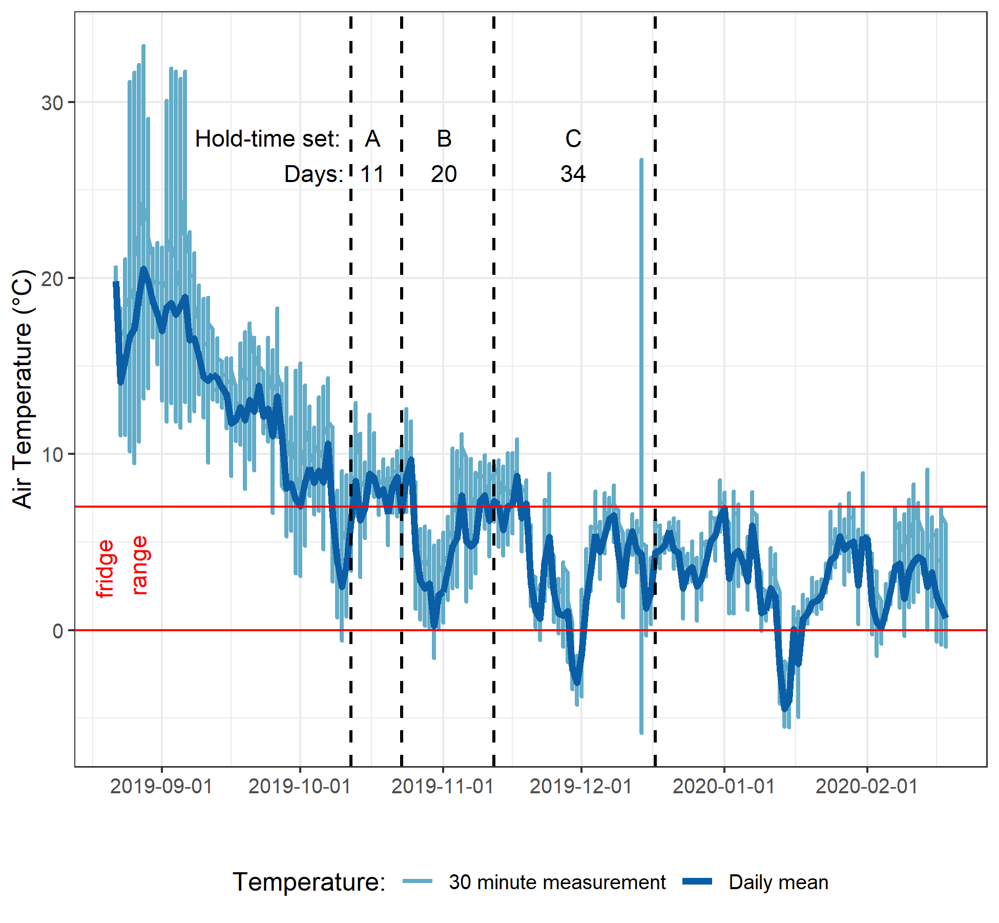
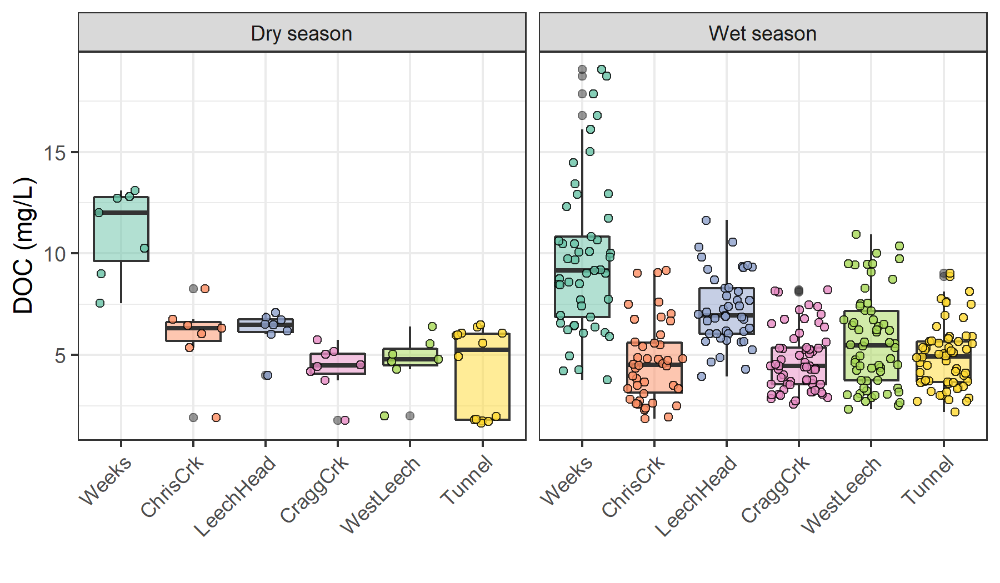
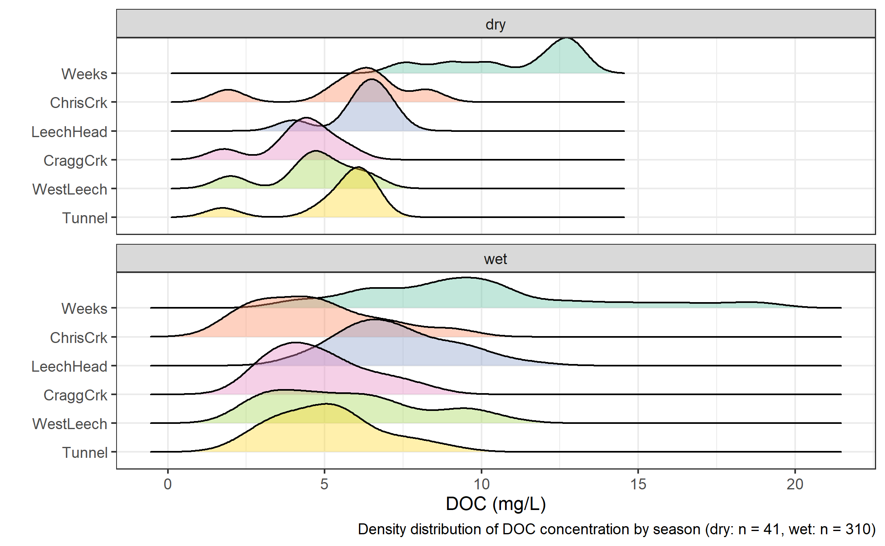
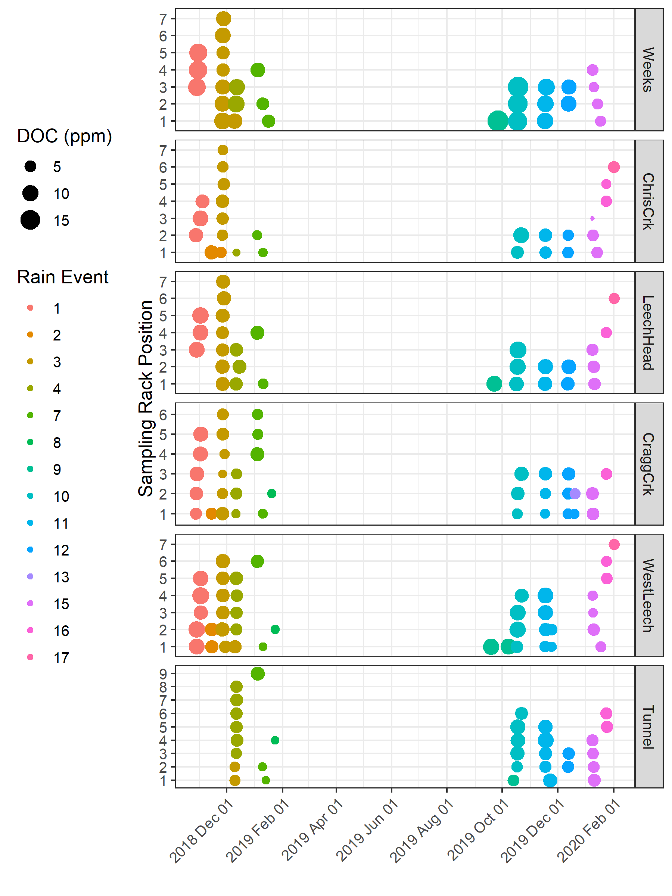
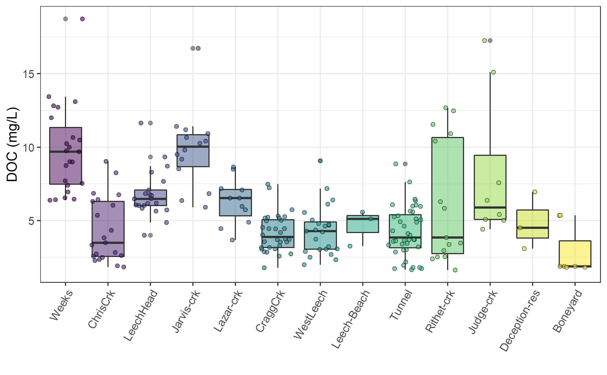
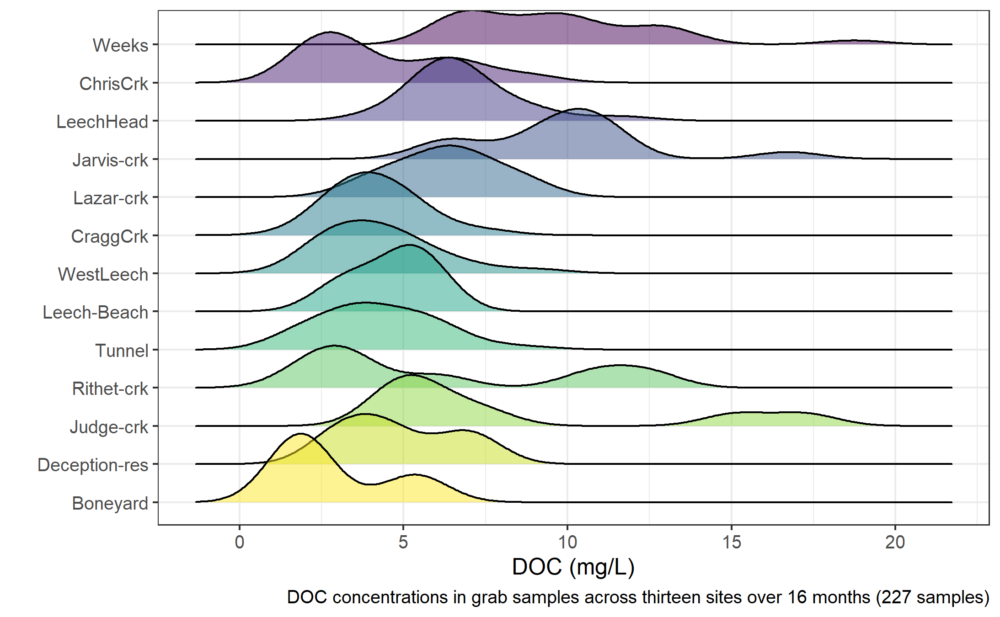
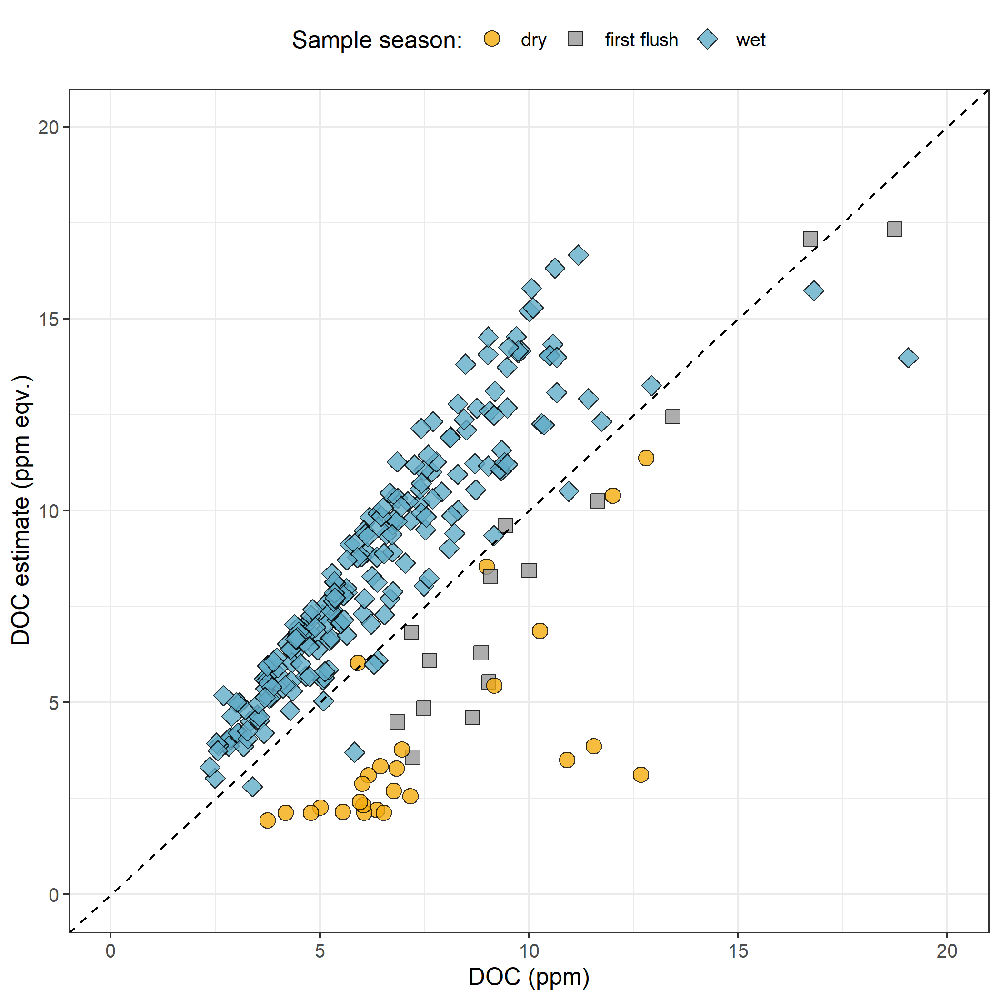

```{r, include = FALSE, package.startup.message = FALSE}

# load required packages
library(tidyverse)  # keep it tidy
library(readr)      # read in delimited files
library(knitr)      # for nice tables

knitr::opts_chunk$set(warning=FALSE, message=FALSE, echo=FALSE)

```

##    Results

###   Weather: precipitation and temperature from CRD weather stations

The Capital Regional District (CRD) provided data from two fire-weather ("FWx") stations in the Leech water supply area (LWSA). Chris Creek weather station (561m a.s.l) is located in the headwaters of the Leech watershed and Martin's Gulch (512m a.s.l) is located near the future point of diversion (Leech River Tunnel). With two weather stations, there were insufficient data points to estimate sub-basin precipitation via Theissen polygons or isohyetal lines; therefore, arithmetic means were calculated based on data from Chris Creek and Martin's Gulch stations. Average precipitation and air temperature are shown in Figure \@ref(fig:meanWxLWSA), with the study period highlighted.

\    

```{r meanWxLWSA, out.width = "100%", fig.pos="h", fig.cap = fig_cap}
fig_cap = "\\label{fig:meanWxLWSA} *Average weather from two stations in the Leech water supply area, where the highlighted section indicates the study period.*"

knitr::include_graphics("R-outputs_UBC-forWater-MSc_HMc/figures/Wx_LWSA-means.png")
```
\  

Table \@ref(tab:meanWxLWSAdata) summarizes weather data by calender year, as well as the very wet period of January and February, 2020. It was assumed that the arithmetic means of rainfall were representative of rain conditions across the Leech watershed and these values were used to define rain events (section \@ref(events)). Mean LWSA temperatures were compared to temperatures recorded at each installation site (section \@ref(Hobo)). As the CRD FWx stations are situated at elevation, snow depth records were not assumed to be representative of snow cover across the LWSA; however, snow melt contributed to runoff and recorded stage change at the six installation sites. 
 
\  

```{r meanWxLWSAdata}
read_csv("R-outputs_UBC-forWater-MSc_HMc/tables/Wx_LWSA-mean-summary.csv", col_names = TRUE) %>% 
  knitr::kable(digits = c(1, 1, 1, 2, 2, 2, 1, 1),
               caption = "*Average weather data from CRD stations in Leech water supply area in 2018 and 2019*")
```

\  

#####   Rain events {#events}

LWSA mean FWx precipitation data were used to define rain events using the USGS *Rainmaker* package in R ('RMevents' function). During the study period there were 151 rain events, and 18 that were classified as major events. Major rain events were defined by precipitation accumulating to 50mm or more, where the events were separated from each other by a period of 14 hours or longer. Table \@ref(tab:Events) summarizes the eighteen major rain events that occurred during the study period (2018-10-23 to 2020-02-20). Figure \@ref(fig:EventsPlot) shows stream level at each monitored sub-basin along with events and samples collected. Eight of these events were captured in the 2019 water year (2018-2019 wet season), the other ten in the 2020 water year.

\  

```{r Events}
read_csv("R-outputs_UBC-forWater-MSc_HMc/tables/Wx_Events.csv") %>% 
  knitr::kable(digits = c(0,0,0,1,1,1),
               caption = "*Rain events defined by a threshold of 50mm with 14-hour inter-event period*")
```

```{r EventsPlot, out.width = "100%", fig.pos="h", fig.cap = fig_cap}
fig_cap = "\\label{fig:EventsPlot} *Plot of Precipitation, rain events (as vertical lines), stream rise and sample collection at six sites across the LWSA.*" 

knitr::include_graphics("R-outputs_UBC-forWater-MSc_HMc/figures/Wx-stage-subbasins_megaplot-noTemp.png")
```
\ 


For each calender year in the study period, major rain events' minimum and maximum values of depth, duration and intensity were identified and are summarized in the subsequent table, Table \@ref(tab:MinMaxEvents). The maximum intensity event of 2020, on January 30, generated incredible flows across the Leech watershed (and across Vancouver Island and most of the south coast of BC). Streamflow at CraggCrk (site 4) and the Tunnel (site 6) over-topped the vertical racks (greater than 2m tall) and ripped the level-loggers out of their stilling wells [^2]. Luckily, the level-loggers were found downstream in February and (after drying the circuit boards) the data were successfully retrieved from both Odyssey loggers.  

[^2]:   Following the Jan.30, 2020 major event, changes to the stream-bed morphology were evident at LeechHead (site 3) in the form of gravel and cobble deposition, and there was evidence of substantial coarse woody debris transport at ChrisCrk (site 2).

\  

```{r MinMaxEvents}
read_csv("R-outputs_UBC-forWater-MSc_HMc/tables/Wx_Events-annual_min-max.csv") %>% 
  knitr::kable(digits = c(0,1,1,1,1,2,1),
               caption = "*Minimum and maximum rain event values *")
```

\  

#### Temperature at vertical racks

TidbiT temperature loggers (HOBO TidbiT v2 Temperature Data Logger, Onset, USA) were attached to the top and bottom of each vertical rack installation to record air and water temperature at 30 minute intervals. Loggers at the top of racks recorded air temperature and those at the bottom recorded water temperature (Figure \@ref(fig:TidbiTairwaterLine)). 


```{r TidbiTairwaterLine, out.width = "100%", fig.pos="h", fig.cap = fig_cap}
fig_cap = "\\label{fig:TidbiTairwaterLine} *Temperatures recorded in air and water on vertical racks at each research site.*"
knitr::include_graphics("R-outputs_UBC-forWater-MSc_HMc/figures/TidbiTs_line-by-time_daily.png")
```

\  

While loggers were installed in both positions (air and water) on each rack at the same time, it wasn't until mid-October that all sites' water temperature loggers were submerged. Figure \@ref(fig:TidbiTairwaterBox) shows the distributions of air and water temperatures at each site, where water temperature was limited to the period when all sites water temperature loggers were submerged. Median water temperatures increased from the headwaters of Leech River to the point of diversion (Leech-Head < Cragg-Crk < West-Leech < Tunnel).  

\  

```{r TidbiTairwaterBox, out.width = "100%", fig.pos="h", fig.cap = fig_cap}
fig_cap = "\\label{fig:TidbiTairwaterBox} *Temperatures recorded in air and water on vertical racks at each research site.*"
knitr::include_graphics("R-outputs_UBC-forWater-MSc_HMc/figures/TidbiTs_box-by-location_daily.png")
```

\  

#### Air temperature comparison & linear regression {#Hobo}

Air temperatures recorded at each of the six sites were compared to LWSA FWx for the overlapping period (August 24, 2019 to February 20, 2020). Overall, FWx temperatures were slightly higher than those recorded at each site installation. Figure \@ref(fig:TidbiTFWxridges) shows the density distribution of air temperature measured at each site compared to the LWSA FWx mean. 

\  

```{r TidbiTFWxridges, out.width = "100%", fig.pos="h", fig.cap = fig_cap}
fig_cap = "\\label{fig:TidbiTFWxridges} *Density distribution of air temperatures recorded at each sub-basin compared to mean LWSA air temperatures from CRD fire weather stations.*"

knitr::include_graphics("R-outputs_UBC-forWater-MSc_HMc/figures/TidbiTs-FWx_ridgeplot-subbasins.png")
```

\  

Results of two-sided Wilcoxon rank sum tests revealed that 15-minute air temperatures at West Leech (site-5) were similar to LWSA FWx (p-value 0.02), and the differences between the other five sites and FWx were found to be significantly different (p-values << 0.001). However, when daily mean temperatures were compared (rather than 15 minute data) the differences between sites and FWx temperatures were less dramatic (Table \@ref(tab:wilcoxonpvalues)) with no statistical difference (at 90% confidence) for Cragg Crk, West Leech and the Tunnel (sites 4, 5, 6). 

\  

```{r wilcoxonpvalues}
read_csv("R-outputs_UBC-forWater-MSc_HMc/tables/TidbiT-FWx-Tdaily_Wilcoxon-pvalues.csv",
         col_names = TRUE) %>% 
  knitr::kable(digits = c(0,4),
               caption = "*Relationships between air temperature recorded at each research site compared to mean air temperature recorded by LWSA weather stations.*")
               
```


\  

Despite some differences between FWx and Hobo site data, the overlapping FWx and TidbiT daily mean air temperature data were used to generate linear regression relationships to estimate air temperatures at each site for the time preceding Hobo TidbiT deployment (Figure \@ref(fig:HoboFWxLinearReg)). Table \@ref(tab:TidbiTestimateErrors) summarizes the average percent error of estimated air temperatures based on a test period of overlapping data. Estimated mean daily air temperatures at each site were used in flagging Rack sample data for quality control with respect to days samples remained on vertical racks (hold-times). 

\  

```{r TidbiTestimateErrors}
read_csv("R-outputs_UBC-forWater-MSc_HMc/tables/TidbiT-FWx_lm_prediction-errors.csv", col_names = TRUE) %>% 
  #mutate(p.value = format(p.value, digits = 2)) %>% 
  knitr::kable(digits = c(0,1,1,1,1,1,1,1),
               caption = "*Summary of predicted air temperature at each site compared to mean LWSA temperature from CRD FWx stations for the same time period*",
               col.names = c("Site", "Error (%)", 
                             "Median Temp. (°C)", 
                             "Estimated Median (°C)",
                             "Min. Temp (°C)",
                             "Estimated Min. (°C)",
                             "Max. Temp (°C)",
                             "Estimated Max. (°C)"))
```

\  

```{r HoboFWxLinearReg, out.width = "100%", fig.pos="h", fig.cap = fig_cap}
fig_cap = "\\label{fig:HoboFWxLinearReg} *Relationships between air temperature recorded at each research site compared to mean air temperature recorded by LWSA weather stations. Plots in section A (top) show the relationships for the full data set and plots in section B show daily mean temperatures, the data that was used in linear regression.*"

knitr::include_graphics("R-outputs_UBC-forWater-MSc_HMc/figures/Temp_TidbiTs-FWx_lm-scatter.png")
```

\  
 
### Quality control: vertical rack hold-time experiments

Hold-time experiments were conducted at the Tunnel site to assess stability of river water samples held in siphon bottles on the vertical rack. Figure \@ref(fig:HoldTimeAirPlot) summarizes air temperature and timing of the three hold-time sets.

\  

```{r HoldTimeAirPlot, out.width = "100%", fig.pos="h", fig.cap = fig_cap}
fig_cap = "\\label{fig:HoldTimeAirPlot} *Plot of air temperature during vertical rack hold-time experiments. Red horizontal lines indicate the 0-7°C range of a typical laboratory refrigerator and dashed vertical lines separate the three sets of hold-time samples from collection of grab samples to retrieval of held samples.*"


```

\  

Each hold-time set included ten replicate samples, each collected at the same time in the same way from the same location. For each hold-time set, five samples were returned to the lab for immediate quantification of DOC and measurement of UV absorbance ("fresh" samples) and five were placed on the vertical rack, capped with siphon lids to simulate rack samples, and collected at a later date for analysis ("held" samples). Figure \@ref(fig:HoldTimeBoxPlot) shows results of sample analyses for DOC and UV~254~ absorbance of the fresh and held samples of each set, Hold-time sets were compared using two-sided paired Wilcoxon signed rank tests (a.k.a 'Mann-Whitney' test) [^3] and Table \@ref(tab:HoldTimeTtests) summarizes the number of days the rack samples were held, the mean air temperature over that period, and the percent change in DOC concentration and UV absorbance at 254nm, as well as Wilcoxon test results comparing fresh and held samples. 

[^3]:   The Wilcoxon signed-rank test is a non-parametric paired difference test used in comparing two related samples to assess whether their means differ, or are the same (null hypothesis); it is an alternative to paired Student's t-tests, suitable for when the differences between two sample's means are not assumed to be normally distributed.

\  

```{r HoldTimeBoxPlot, out.width = "100%", fig.cap = fig_cap}

fig_cap = "\\label{fig:HoldTimeBoxPlot} *Sample DOC concentrations and UV absorbance at 254nm contrasting  hold-time samples from collection of grab samples to retrieval of held samples.*"

knitr::include_graphics("R-outputs_UBC-forWater-MSc_HMc/figures/HoldTime_boxplots.png")
```

\ 

```{r HoldTimeTtests}
read_csv("R-outputs_UBC-forWater-MSc_HMc/tables/HoldTime_results-summary.csv", col_names = TRUE) %>%
  knitr::kable(caption = "*Results comparing hold-time sample sets*")
```

\  

While there was no change in UV absorbance for samples from hold-time set-A, there was a significant (at 90% confidence level) change in DOC concentration (p-value = 0.063). Samples collected for hold-time set-A were DOC-rich "first flush" samples, and the Rack samples were held for 11 days at average temperature of 7°C (slightly above laboratory refrigerator temperatures). For set-A, mean DOC concentration was 45% lower in the held samples compared to the fresh grab samples. Set-B had a hold-time of 20 days with average air temperature at 6°C and there was no significant changes in either DOC concentration or UV~254~ (<10% change). Hold-time Set-C included samples held for 34 days at an average of 4.4°C, including a period of sub-zero temperatures. While set-C did not show significant changes in DOC concentration (23% reduction), there were significant changes to UV~254~ (34% decrease in absorbance). In addition to the change in absorbance, Set-C held samples had greater variability for both DOC and UV~254~ compared to the fresh sample counterparts. 

These results suggest that early-season ("first flush") samples may contain more labile DOC which is unstable and should be analyzed immediately after collection, whereas later season samples contain DOC which is relatively more stable for up to and including 20 days when held at temperatures that approximate a refrigerator. A hold-time of 34 days with periods of freezing (set-C) significantly changed sample DOM character via a reduction in aromaticity, and while it did not statistically alter DOC concentration there was a notable increase in held sample DOC standard deviation. Additional tests would be required to determine if the change in DOM character was caused by the length of time the sample was held, or perhaps due only to freezing and thawing, or a combination of both time and temperature.  

\  

##### QA/QC data handling 

Based on results of the hold-time experiments, results of sample analyses were updated to include QA/QC data flags. Hold-times were calculated for each sample and Rack samples that remained held for fewer than 20 days at temperatures between 0-7°C were flagged as acceptable ("OK"). Rack samples that were held for 20 days or longer and samples identified as early-wet-season ("first-flush") with a hold-time of 7+ days were flagged as unacceptable. Due to possible freeze-thaw changes, any samples that underwent freezing and thawing were also flagged. QA/QC flags were used to filter data, reducing the number of Rack samples included in analyses by 16.25%. Of 203 Rack samples, 33 were flagged resulting in 170 quality-assured Rack samples included in analyses. Some Grab samples were excluded from analysis due to contamination or   

###   Nested sub-catchments of the Leech watershed

Six locations across the Leech Water Supply Area (LWSA) were set up as monitoring sites where vertical racks were installed to measure continuous stage and collect water samples as the rivers rose in response to precipitation events. Figure \@ref(fig:megaplot) shows major precipitation events and stream response over the study period as well as the timing and stage of samples collected. 

Across the LWSA, fluctuations in river stage were temporally synchronized. River responses among the six sites were confirmed to be congruent with high confidence (p-value < 0.001, based on 1050 randomizations) via Kendall's coefficient of concordance (Kendall's W = 0.9721) and Spearman's ranked correlation (ρ = 0.9666).

\  
 
```{r megaplot, out.width = "100%", fig.pos="h", fig.cap = fig_cap}
fig_cap = "\\label{fig:megaplot} *Rain events, stream response and sample collection across the Leech Water Supply Area. Dashed vertical lines indicate the start of rain events and points indicate the timing and stage of river samples collected.*"

knitr::include_graphics("R-outputs_UBC-forWater-MSc_HMc/figures/Wx-stage-subbasins_megaplot_sampletype.png")
```

\ 

#### Spatial variance & DOC concentrations

Sampling of the six research sites was achieved through a combination of vertical rack sampling and synoptic grab sampling. The number of river samples passively collected on vertical racks more than doubled the number of river samples collected by standard grab sampling. Vertical racks collected river samples on the rising hydrograph limb, which has been shown to have higher DOC concentration that non-storm flow [@Yang2015; @Raymond2016; @Raymond2010] and can be difficult or dangerous to capture by standard grab sampling, particularly across multiple sites. Indeed, samples with maximum DOC concentrations were captured by vertical racks at five of the six sites, with the exception of Leech River head (*'LeechHead'*, site 3) where peak DOC happened to be collected as a Grab sample (Table \@ref(tab:SixDOCsummarySampleType)).

\  

```{r SixDOCsummarySampleType}
read_csv("R-outputs_UBC-forWater-MSc_HMc/tables/DOC-sixsite_summary_sample-type.csv", col_names = TRUE) %>% 
  knitr::kable(col.names = c("Site", "Sample type", "Sample count", "Mean DOC (mg/L)", "sd (± mg/L DOC)", "RSD (± %)", "Min.(mg/L)", "Median (mg/L)", "Max.(mg/L)"),
               digits = c(0, 0, 0, 1, 1, 0, 2, 2, 2),
               caption = "*Summary of DOC across the six LWSA installation sites including breakdown of sample type collected.*")
```

\  

Figure \@ref(fig:subbasinDOCbox) shows the distribution of DOC concentrations at each of the six sites. Highest concentrations and variance in DOC occurred at the Weeks Main creek headwater site (*'Weeks'*, site 1), a sub-basin in the northwest of the Leech watershed which includes Weeks Lake and surrounding wetlands. Lowest average concentration and variance in DOC was recorded at Cragg Creek (*'CraggCrk'*, site 4), a mainstem river that drains the east sub-basin of the Leech watershed, including Jarvis Lake and the western slopes of Survey Mountain. DOC concentration and variance at Leech River Tunnel (*'Tunnel'*, site 6) was similar to CraggCrk.

\  

```{r subbasinDOCbox, out.width = "100%", fig.pos="h", fig.cap = fig_cap}
fig_cap = "\\label{fig:subbasinDOCbox} *Dissolved organic carbon (DOC) concentrations across the Leech watershed over sixteen months, collected by standard grab sampling and on vertical racks (318 samples total).*"

knitr::include_graphics("R-outputs_UBC-forWater-MSc_HMc/figures/DOC_subbasin_boxplots.png")
```

\  

As the Leech River Tunnel will be the point of diversion for future inter-basin transfers from Leech water supply area (LWSA) to the Sooke Reservoir basin, the Tunnel (site 6) is the effective outlet of the LWSA where runoff from each nested catchment is integrated. Similarly, Weeks Main Creek and Chris Creek (*'Weeks'* & *'ChrisCrk'*, sites 1 & 2) are integrated at (*'LeechHead'*, site 3), which is just below the headwaters' confluence. Table \@ref(tab:subbasinDOCtunnelint) summarizes the range and variability[^4] in DOC within each site and among all sites, with categorical groupings of sub-basins.

[^4]:   Relative standard deviation (RSD) reflects how values range around the mean within a group; it is a ratio of the absolute standard deviation relative to the mean. And standard deviation is the square root of the variance. 

\  

```{r subbasinDOCtunnelint}
read_csv("R-outputs_UBC-forWater-MSc_HMc/tables/DOC-Subbasin_summary_CategoryIntegration.csv", col_names = TRUE) %>% 
  knitr::kable(col.names = c("Site", "Basin type", "Sample count", "Mean DOC (mg/L)", "Stdev (± mg/L DOC)", "RSD (± %)", "Min.(mg/L)", "Median (mg/L)", "Max.(mg/L)"),
               digits = c(0, 0, 0, 1, 1, 0, 2, 2, 2),
               caption = "*Summary of DOC across the six LWSA research sites with each nested catchment classified by basin type.*")
```

\  

The RSD in DOC observed at LeechHead was less than the DOC RSD in the two headwater sites upstream, and less than the RSD of both headwater sites combined. The relatively high DOC in the Weeks sub-basin was a driver for the wide range of DOC values for the headwaters. Despite the high RSD for headwaters sites, and the ~50% difference in area of these two sub-basins (Table \@ref(tab:WTScharacterSubbasinTable), Section \@ref(MethodsNestedCatch)), median DOC observed at LeechHead was very near to the median for the headwaters sites. Overall, there was greater variance among headwater sites than there was at each site, whereas the variance observed at each mainstem river site was comparable to the variance among mainstems. Results of Levene's test[^5] confirmed that variance in DOC concentrations was not homogeneous across the six sites of the LWSA (p-value = 8.2^-10^). 

To identify which pairs of sites had equal DOC variance (or were heteroscedastic), Levene's test was applied to sample DOC results. Table \@ref(tab:LevenesDOC) classifies each site comparison by basin-type and summarizes resulting Levene's test p-values for each pair. Of the nine comparisons made among the six sites, West Leech River (*'WestLeech'*, site-5) and Weeks Main Creek (*'Weeks'*, site-1) did not have homogeneous variance when compared with any other sites; all other combinations of sites showed homoscedasticity. Both of these sub-basins drain the west side of LWSA. 

[^5]:Levene's test is used to check for homogeneity of variance (homoscedasticity), it's an alternative to the Bartlett’s test that's less sensitive to departures from normality in the data.

\  

```{r LevenesDOC}
read_csv("R-outputs_UBC-forWater-MSc_HMc/tables/DOC-stats_variance-LeveneTests.csv", col_names = TRUE) %>%
  knitr::kable(digits = c(5),
               caption = "*Results of Levene's test comparing DOC variance between pairs of sites. Significance stars indicate confidence levels: *** 99% (alpha = 0.01); ** 95% (alpha = 0.05); * 90% (alpha = 0.1), 90% confidence was the threshold for supporting the null hypothesis of homoscedasticity.*")
```

\  

####   Spatiotemporal synchrony in local extrema: river stage and DOC

Streams responded harmoniously to precipitation across the LWSA, with synchronous changes in stage; was the same harmony present for fluctuations in DOC? Aqueous DOC was quantified from discrete river samples, and therefore the temporal synchrony of peaks could not be evaluated in the same manner as stage, which was continuously recorded. However, because each sample was matched to stage and had a corresponding time-stamp, temporal synchrony in DOC could be inferred based on relationships between peak DOC and stage. 

?
If peak DOC consistently corresponded to peak sample stage, and low DOC consistently corresponded to low stage, it could be inferred that DOC fluctuated with similar synchrony to stage. That is, if DOC extrema were in synch with stage extrema at each site -- and stage is know to vary synchronously across the LWSA -- then we can assume that DOC follows the same trends across the LWSA.      
?

To determine if local DOC extrema (maxima and minima concentrations) were captured in conjunction with the local extrema of sampled flows (minima and maxima of sampled stage), synchrony tests were run on sample results. For each site, results of samples were grouped by collection period and rain event to identify samples with extreme DOC concentrations as well as samples collected at extreme stage (max/min). Extrema samples for DOC and stage were compared to determine how often their samples corresponded. Table \@ref(tab:synchDOCstage) summarized the results, where a proportion of 1 indicates perfect agreement between samples of extreme DOC and sample-stage, and zero indicates complete asynchrony between DOC and stage. 

\  

```{r synchDOCstage}
read_csv("R-outputs_UBC-forWater-MSc_HMc/tables/synchrony_DOC-stage_extrema-simultaneous.csv", col_names = TRUE) %>% 
  knitr::kable(digits = c(0,3,3),
               caption = "*Proportion of samples for which peak DOC was found in the highest sample stage.*")
```

\  

The majority of samples showed congruence between peaks and lows of DOC and stage. West Leech was the only site which had a greater proportion of common maxima compared to minima, all other sites had more frequent occurrence of low DOC occurring at low stage that they did of high DOC occurring at high stage. Overall, each sites samples showed majority, but not absolute, agreement in extremes of DOC-stage relationships. Figure \@ref(fig:extremaplot) shows the extrama samples with stage at each site.

\  

```{r extremaplot, out.width = "100%", fig.pos="h", fig.cap = fig_cap}
fig_cap = "\\label{fig:extremaplot} *Stage and samples collected, highlighting samples with maximum and minimum DOC concentrations for each rain event and collection period. Black vertical lines indicate a subset of samples that were assessed more closely.*"

knitr::include_graphics("R-outputs_UBC-forWater-MSc_HMc/figures/extrema_peakDOC-stage_plot.png")
```

\  

To better understand how timing of peak DOC varied among sites during the wet season, a subset of samples was selected for closer analysis (highlighted in Figure \@ref(fig:extremaplot) and expanded in Figure \@ref(fig:subsetExtremaplot)). The subset included samples from rain events 10-12; a subset deemed to be representative of DOC concentrations and rain events across the wet seasons, as there were no significant differences between DOC concentrations or rain events (amount and intensity) for this subset of samples compared to the rest of the study period (Table \@ref(tab:subbsetWilcox)). There were significant differences in UV~254~ absorbance for events 10-12 compared to the rest of the study period, therefore this subset was not considered representative of spectral trends overall and was only examined for DOC trends.  

\  

```{r subbsetWilcox}
read_csv("R-outputs_UBC-forWater-MSc_HMc/tables/narrow-subbset_wilcoxon.csv", col_names = TRUE) %>% 
  knitr::kable(digits = c(0,0,4),
               caption = "*p-values from Wilcoxon tests comparing the subset of rain events 10-12 and those samples' DOC results to all other sampled rain events, showing no significant difference between the groups.*")
```

\  

```{r subsetExtremaplot, out.width = "100%", fig.pos="h", fig.cap = fig_cap}
fig_cap = "\\label{fig:subsetExtremaplot} *Stage and samples collected for the subset of samples collected over rain events 9-12, highlighting samples with maximum and minimum DOC concentrations for each rain event and collection period.*"

knitr::include_graphics("R-outputs_UBC-forWater-MSc_HMc/figures/narrow_events_9-12_peakDOC-stage.png")
```

\

... _THIS SECTION IS UNDER CONSTRUCTION_ ...

* time to peak
* range of DOC in each event


#### Temporal trends in DOC: seasonality

Over the study period, DOC concentrations followed similar trends across each of the six LWSA sites (Figure \@ref(fig:DOCloess)). DOC was highest early in the wet season and progressively decreased through the fall and winter, reaching minimum concentrations in the spring before progressively increasing again through the summer. 

\  

```{r DOCloess, out.width = "100%", fig.pos="h", fig.cap = fig_cap}
fig_cap = "\\label{fig:DOCloess} *Trends in dissolved organic carbon concentrations over sixteen months (Oct 2018 to Feb 2020) at six sites across the Leech water supply area (n = 367: 166 grab samples, 201 vertical rack samples.*"

knitr::include_graphics("R-outputs_UBC-forWater-MSc_HMc/figures/DOC_trend_bassin-type-facet_loess.png")
```

\  

Overall, there was very little difference between mean DOC concentration through the wet season (6.2 ± 3 mg/L) compared to the dry season (5.5 ± 3 mg/L). However, there were far fewer samples collected in the dry season than during the wet season (Figure \@ref(fig:DOCseasonal).

\  

```{r DOCseasonal, out.width = "100%", fig.pos="h", fig.cap = fig_cap}
fig_cap = "\\label{fig:DOCseasonal} *Boxplots of DOC concentrations at six LWSA sites during dry and wet seasons.*"


```

\  

```{r seasonalSubbasinRidge, out.width = "100%", fig.pos="h", fig.cap = fig_cap}
fig_cap = "\\label{fig:seasonalSubbasinRidge} *Density distribution of dissolved organic carbon concentrations at six sites over sixteen months across the Leech water supply area, where sample results are grouped by dry season (n = 53) and wet season (n = 314).*"


```

\  

#### Stormflow representation

During the wet season, rain events are the dominant hydrologic forcing. Table \@ref(tab:wetSeasonSubbainsSamples) summarizes the number of samples collected across the LWSA sub-basin sites by sample type. 

\  

```{r wetSeasonSubbainsSamples}
read_csv("R-outputs_UBC-forWater-MSc_HMc/tables/summary_wet-season_subbasins-SampleCount.csv", 
         col_names = TRUE) %>%
  knitr::kable(col.names = c("Site", "Sample type", "Count"),
               caption = "*Summary of wet-season samples collected across LWSA subbasin sites from Oct 2018 to Feb 2020*")
```

\  

Stormflow samples collected during stream rise via vertical Racks showed higher DOC than Grab samples manually collected across wet seasons (Figure \@ref(fig:subbasinSampletypeBox) & \@ref(fig:subbasinSampletypeRidge)). Results of wet-season sample analysis are summarized in Table \@ref(tab:wetSeasonSubbainDOC).

\  

```{r subbasinSampletypeBox, out.width = "100%", fig.pos="h", fig.cap = fig_cap}
fig_cap = "\\label{fig:subbasinSampletypeBox} *Wet-season dissolved organic carbon concentrations grouped by site and sample collection method, where Grab samples were manually obtained (n = 114) and Rack samples were collected passively on vertical racks fit with siphon sampler bottles (n = 200).*"

knitr::include_graphics("R-outputs_UBC-forWater-MSc_HMc/figures/DOC_subbasin_GvsR_boxplot.png")
```

\  

```{r subbasinSampletypeRidge, out.width = "100%", fig.pos="h", fig.cap = fig_cap}
fig_cap = "\\label{fig:subbasinSampletypeRidge} *Density distribution of dissolved organic carbon concentrations grouped by site and sample collection method, where Grab samples were manually obtained (n = 114) and Rack samples were collected passively on vertical racks fit with siphon sampler bottles (n = 200).*"

knitr::include_graphics("R-outputs_UBC-forWater-MSc_HMc/figures/DOC_subbasin-ridgeplot_GvsR.png")
```

\  

```{r wetSeasonSubbainDOC}
read_csv("R-outputs_UBC-forWater-MSc_HMc/tables/DOC_wet-season_subbasin_MeanMinMax-SampleType.csv", 
         col_names = TRUE) %>%
  knitr::kable(col.names = c("Site", "Sample type", "DOC mean (mg/L)", 
                             "std.dev. (± mg/L)", "RSD (±%)", "min DOC", "max DOC"),
               digits = c(0, 0, 1, 1, 0, 2, 2),
               caption = "*Results of wet-season samples collected across LWSA subbasin sites from Oct 2018 to Feb 2020*")
```

\  

### Rising limb -- hydrologic versus supply controls on export

Figure \@ref(fig:RisingLimbPlot) shows rising limb sample DOC concentrations across rain events at the LWSA sub-basins. While there was a typically some increase in DOC with increasing river stage, seasonality appeared to have a greater influence on DOC concentrations than river rise (highest DOC early in the wet season). 

```{r RisingLimbPlot, out.width = "100%", fig.pos="h", fig.cap = fig_cap}
fig_cap = "\\label{fig:RisingLimbPlot} *DOC concentration trends in rising limb samples categorized by rain events*"


```

\  

### Synoptic Sampling

Over the sixteen month study period, 227 samples were collected at thirteen river sites across the Leech and Sooke water supply areas. Figure \@ref(fig:synopticDOCbox) shows DOC concentrations across each synoptically samples site, and Table \@ref(tab:synopticDOCdata) summarized the range of DOC concentrations. 

\ 

```{r synopticDOCbox, out.width = "100%", fig.pos="h", fig.cap = fig_cap}
fig_cap = "\\label{fig:synopticDOCbox} *Synoptic sampling results of dissolved organic carbon concentrations from 13 sites over 16 months (227 grab samples).*"


```

\  

```
#{r synopticDOCdata}
read_csv("R-outputs_UBC-forWater-MSc_HMc/tables/DOC-Synoptic_grab-summary.csv", col_names = TRUE) %>% 
  knitr::kable(digits = c(1, 0, 1, 1, 2, 2, 2), 
               caption = "*Summary of dissolved organic carbon across thirteen synoptically sampled river sites*")
``` 

\  

Figure (\@ref(fig:synopticDOCridge)) shows the density distribution of DOC concentrations at each of the synoptically sampled sites. DOC concentrations were typically higher in headwater streams, particularly those associated with wetlands.

\  

```{r synopticDOCridge, out.width = "100%", fig.pos="h", fig.cap = fig_cap}
fig_cap = "\\label{fig:synopticDOCridge} *Density distribution of dissolved organic carbon concentrations resulting from synoptic sampling at 13 sites over 16 months (227 grab samples).*"


```

\  
 
#### Seasonal patterns: UV-absorption as indicator of molecular character

With samples collected over sixteen months, a seasonal assessment of source water character was possible. NOM molecules with greater aromaticity will absorb more UV energy at wavelength 254-nm than non-aromatic molecules; therefore, spectroscopic methods of estimating DOM are proxy measures of sample aromaticity (e.g., humic substances). Figure \@ref(fig:seasonalDOCest) shows DOC concentrations plotted against DOC estimates based on UV-Vis absorbance. The seasonal separation of wet an dry season samples suggests that river water during the wet-season (fall and winter) has more aromatic character than during the dry-season (summer). 

___Quality control note___

The spectro::lyser has been shown to effectively determine DOC content and character on unfiltered samples [@Avagyan2014]. However, suspended matter may bias absorbance values due to non-DOC light absorption or scattering. Therefore, spectral indices were not calculated for several unfiltered water samples that had detectable turbidity (greater than 0.000 FTU); this reduced the spectral dataset by 9.5%. ****** DOUBLE CHECK THAT NUMBER (FROM METHODS)

\  

```{r seasonalDOCest, out.width = "100%", fig.pos="h", fig.cap = fig_cap}
fig_cap = "\\label{fig:seasonalDOCest} *Dissolved organic carbon measured directly (as NPOC) plotted against concentrations estimated via UV-Vis spectroscopy, with a dashed lined indicating best fit (1:1). The 282 samples are grouped by season (n{wet} = 237, n{first-flush} = 18, n{dry} = 27).*"


```

\  

Figure \@ref(fig:seasonalDOCest) showed that characteristics of wet-season samples caused positive bias in absorbance-based DOC estimates, while dry-season samples showed negative bias in DOC estimated by UV-Vis absorption.

\  

While an aromatic NOM sample will have stronger absorbance at 254-nm relative to a non-aromatic sample, the concentration of NOM also effects the intensity of absorbance (based on the Beer-Lambert law). Because UV-Vis absorbance is proportional to both the aromaticity and the concentration of NOM in a sample, SUVA~254~ is a widely adopted indicator of a sample's aromaticity. Specific UV absorbance at 254-nm (SUVA~254~) is calculated by dividing a sample's absorbance at 254-nm by its DOC concentration; a greater SUVA~254~ value indicates a sample with more aromatic character than a sample with low SUVA~254~. Figure \@ref(fig:seasonalSUVADOC) shows seasonally grouped samples' DOC plotted against SUVA~254~, which indicates a greater aromatic character of river water during the wet season compared to dry season.

\  

```{r seasonalSUVADOC, out.width = "100%", fig.pos="h", fig.cap = fig_cap}
fig_cap = "\\label{fig:seasonalSUVADOC} *Dissolved organic carbon plotted against specific UV absorbance at 254 nm (SUVA{254}) with samples (n = 282) grouped by season (n{wet} = 237, n{first-flush} = 18, n{dry} = 27) showing greater aromaticity (more humic-like organic matter) in wet season samples.*"

knitr::include_graphics("R-outputs_UBC-forWater-MSc_HMc/figures/DOC_seasonal_SUVA-NPOC.png")
```

\  


## Random Forests

* in progress

