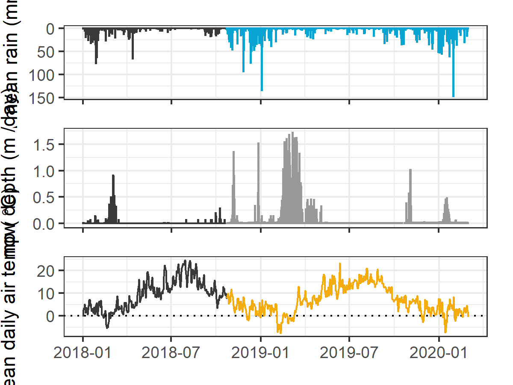

```{r, results-setup, include = FALSE, package.startup.message = FALSE}
knitr::opts_chunk$set(warning=FALSE, message=FALSE, echo=FALSE)

library(tidyverse) # keep it tidy
library(readr)     # read in delimited files
library(knitr)     # for nice tables
```

# Data and Results

The primary objectives of this project was to characterize the range of hydrochemical dynamics and synchrony during rainfall response among sub-basins ranging in size from 9.6 to 37 km^2^.  To understand spatial and temporal patterns in hydrochemical dynamics, this research was tackled in two key ways: (1) six sub-basin sites were equipped with vertical racks which logged river stage, air and water temperature at 10-minute intervals and passively collected whole water samples during stormflow on rising limbs of the hydrograph;  and  (2) fifteen sites, including the six sub-basin sites, were sampled synoptically every two to four weeks. Results of both the synoptic sampling and sub-basin monitoring were used to characterize the temporal and spatial range of DOC concentrations and DOM character. In addition to spatiotemporal dynamics, the sub-basin monitoring sites were used to evaluate hydrologic responses based on  river rise (stream stage) and local precipitation. The vertical racks installed at the sub-basin sites enhanced the synoptic sampling program by collecting samples during rainfall-induced hydrologic surges -- samples which would have been challenging and dangerous to collect manually at locations across the watershed. DOC concentration trends in stormflow were indicative of whether aqueous DOM was supply-limited or governed by hydrologic forcing. The data collected were used to elucidate spatiotemporal synchrony among sub-catchments.  

Sixteen months of bi-weekly field work was completed with the goals of contributing to the characterization of the Leech Water Supply Area (LWSA) while furthering our understanding of the variability of dissolved organic matter (DOM) dynamics in hydrologic response across a second growth forested watershed. From November 2018 to February 2020, four hundred and fifty-five water samples (Table YYY ) were collected and analyzed for DOC concentration and DOM character by high temperature combustion and UV-Vis spectroscopy (respectively), while an additional 42 samples were analyzed at an external laboratory for a suite of total metals.  

```{r read-sample-count-table}
read_csv("R-outputs_UBC-forWater-MSc_HMc/tables/summary_AllSamples_Count.csv", 
         col_names = TRUE) %>% 
  knitr::kable(caption = "Table YYY")
```

## Hydroclimatic Regime, Stage & Sampling

The Capital Regional District provided data from their fire-weather stations within the LWSA. Figure *CCC* shows snow, air temperature and rain during the study period, as well as river stage and sampling points at each of the six subbasins. 

<br>

<br>

The weather data plotted in Figure *CCC* are arithmetic means from two fire-weather stations in the LWSA: Chris Creek (in the headwaters) and Martin's Gulch (near the mouth/ future point of diversion).  Figure NNN shows precipitation and temperature measured at each of these two stations over 2018 and 2019, with this study's period highlighted.  Table *JJJ* summarizes data from each of these two stations by calender year.  

<br>

<br>

```{r, read-LWSA-wx-table}
read_csv("R-outputs_UBC-forWater-MSc_HMc/tables/Wx_LWSA-summary.csv", col_names = TRUE) %>% 
  knitr::kable(digits = c(0, 0, 0, 2, 1, 1, 1, 1, 1, 1, 1),
               caption = "Table JJJ")
```
The arithmetic means for precipitation and air temperature from each of the two weather stations in the LWSA is summarized in Table UUU (where standard deviations represent the difference between the two stations, not the full annual dataset). The station means are plotted in Figure MMM with the study period highlighted.  Mean weather values were used for all analyses including delineating storm events.

```{r read-mean-LWSA-wx-table}
read_csv("R-outputs_UBC-forWater-MSc_HMc/tables/Wx_LWSA-summary.csv", col_names = TRUE) %>% 
  knitr::kable(digits = c(0, 0, 0, 2, 1, 1, 1, 1, 1, 1, 1),
               caption = "Table UUU")
```
<br>

<br>


