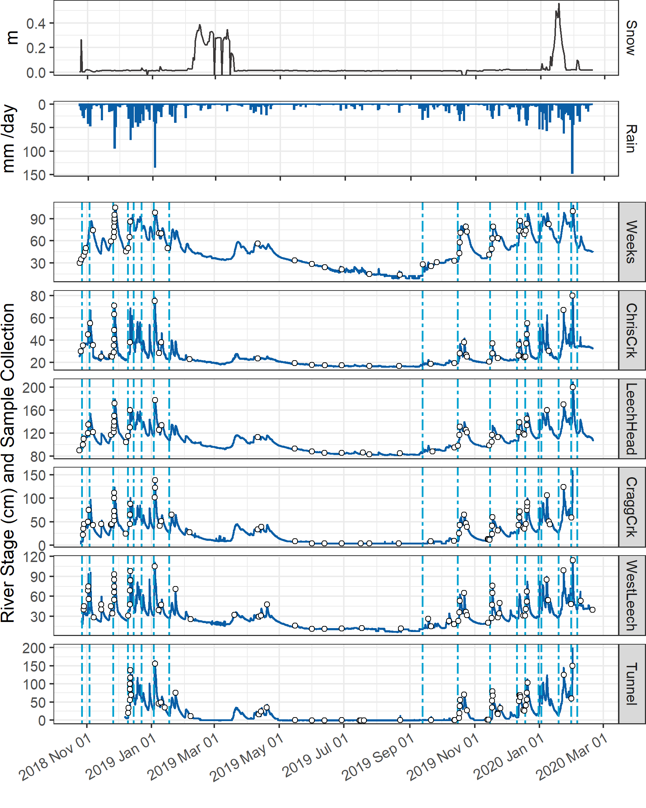
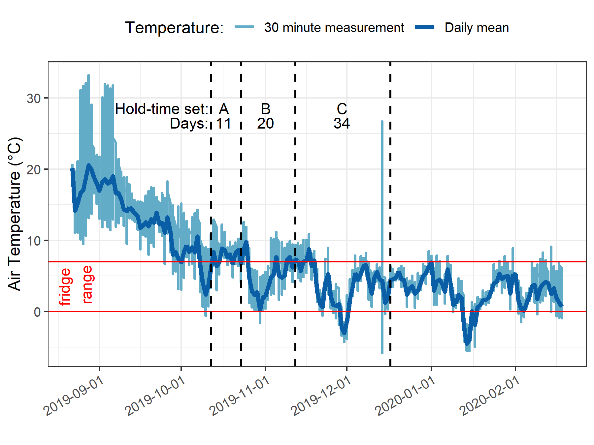
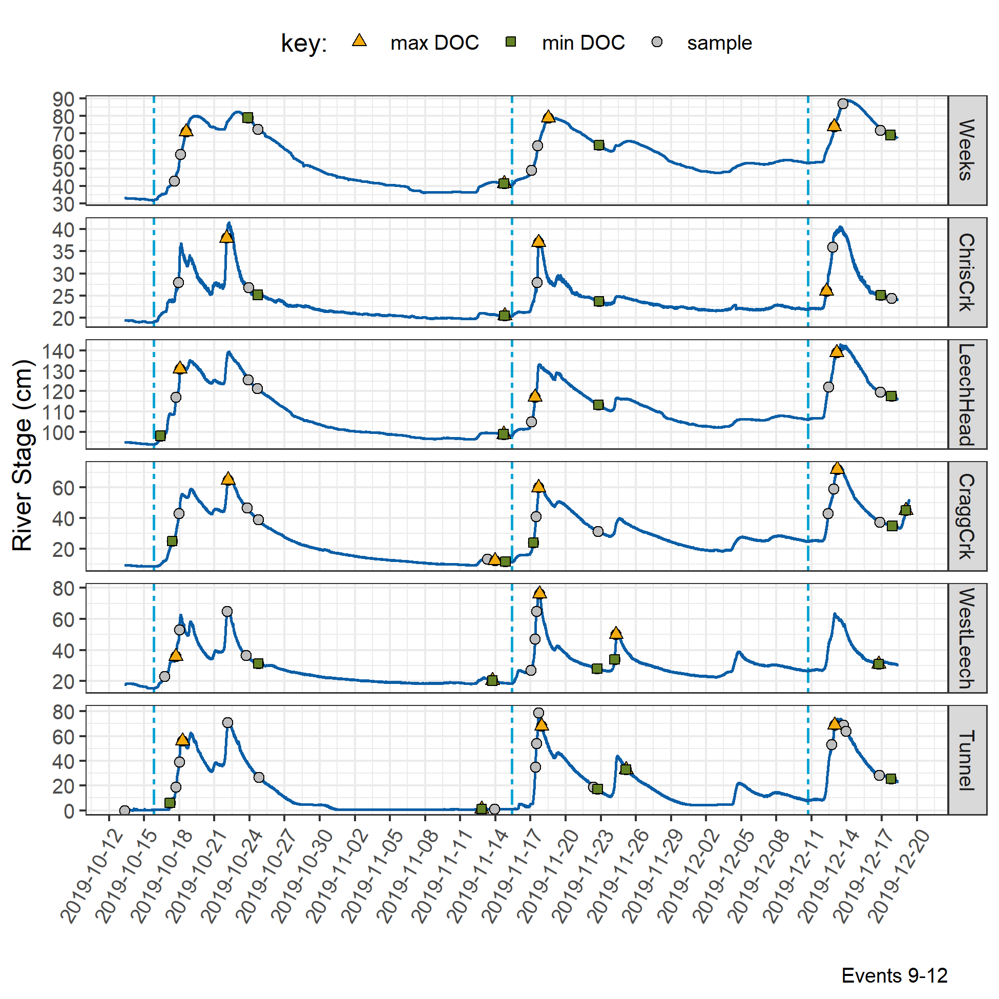
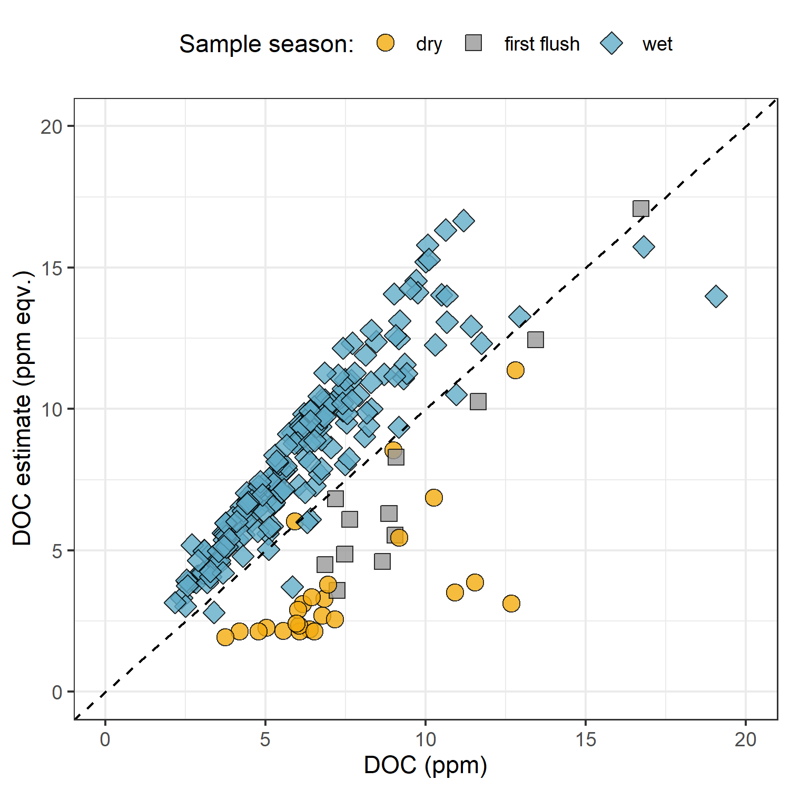

```{r, include = FALSE, package.startup.message = FALSE}

# load required packages
library(tidyverse)  # keep it tidy
library(readr)      # read in delimited files
library(knitr)      # for nice tables

knitr::opts_chunk$set(warning=FALSE, message=FALSE, echo=FALSE, fig.cap=TRUE)

```

##    Results

###   Weather: precipitation and temperature from CRD weather stations

The Capital Regional District (CRD) provided data from two fire-weather ("FWx") stations in the Leech water supply area (LWSA). Chris Creek weather station (561m a.s.l) is located in the headwaters of the Leech watershed and Martin's Gulch (512m a.s.l) is located near the future point of diversion (Leech River Tunnel). With two weather stations, there were insufficient data points to estimate sub-basin precipitation via Theissen polygons or isohyetal lines; therefore, arithmetic means were calculated based on data from Chris Creek and Martin's Gulch stations. Average precipitation and air temperature are shown in Figure \@ref(fig:meanWxLWSA), with the study period highlighted.

\    

```
{r meanWxLWSA, out.width = "100%", fig.pos="h", fig.cap = fig_cap}
fig_cap = "\\label{fig:meanWxLWSA}*Average weather from two stations in the Leech water supply area, where the highlighted section indicates the study period.*"

knitr::include_graphics("R-outputs_UBC-forWater-MSc_HMc/figures/Wx_LWSA-means.png")
```
\  

Table \@ref(tab:meanWxLWSAdata) summarizes weather data by calender year, as well as the very wet period of January and February, 2020. It was assumed that the arithmetic means of rainfall were representative of rain conditions across the Leech watershed and these values were used to define rain events (section \@ref(events)). Mean LWSA temperatures were compared to temperatures recorded at each installation site (section \@ref(Hobo)). As the CRD FWx stations are situated at elevation, snow depth records were not assumed to be representative of snow cover across the LWSA; however, snow melt contributed to runoff and recorded stage change at the six installation sites. 
 
\  

```
{r meanWxLWSAdata}
read_csv("R-outputs_UBC-forWater-MSc_HMc/tables/Wx_LWSA-mean-summary.csv", col_names = TRUE) %>% 
  knitr::kable(digits = c(1, 1, 1, 2, 2, 2, 1, 1),
               caption = "*Average weather data from CRD stations in Leech water supply area in 2018 and 2019*")
```

\  

#####   Rain events {#events}

LWSA mean FWx precipitation data were used to define rain events using the USGS *Rainmaker* package in R ('RMevents' function). During the study period there were 151 rain events, and 18 that were classified as major events. Major rain events were defined by precipitation accumulating to 50mm or more, where the events were separated from each other by a period of 14 hours or longer. Table \@ref(tab:Events) summarizes the eighteen major rain events that occurred during the study period (2018-10-23 to 2020-02-20). 

\  

```
{r Events}
read_csv("R-outputs_UBC-forWater-MSc_HMc/tables/Wx_Events.csv") %>% 
  knitr::kable(digits = c(0,0,0,1,1,1),
               caption = "*Rain events defined by a threshold of 50mm with 14-hour inter-event period*")
```

\  

An intense (category 3-4) atmospheric river event hit the LWSA January 29-31 (Event 17) and generated incredible flows across the Leech watershed (and across Vancouver Island and most of the south coast of BC). Streamflow at CraggCrk (site 4) and the Tunnel (site 6) over-topped the vertical racks (greater than 2m tall) and ripped the level-loggers out of their stilling wells [^2]. Luckily, the level-loggers were found downstream in February and (after drying the circuit boards) the data were successfully retrieved from both Odyssey loggers. Figure \@ref(fig:EventsPlot) shows stream level at each monitored sub-basin along with events and samples collected. Eight of these events were captured in the 2019 water year (2018-2019 wet season), the other ten in the 2020 water year. For each calender year in the study period, major rain events' minimum and maximum values of depth, duration and intensity were identified and are summarized in Table \@ref(tab:MinMaxEvents).   

[^2]:   Following major event 17 (Jan 29-31), changes to the stream-bed morphology were evident at LeechHead (site 3) in the form of gravel and cobble deposition, there was evidence of substantial coarse woody debris transport at ChrisCrk (site 2), and destruction to hydrologic monitoring equipment at the Leech Tunnel.

\  

```{r EventsPlot, out.width = "100%", fig.pos="h", fig.cap = fig_cap}
fig_cap = "\\label{fig:EventsPlot}*Plot of Precipitation, rain events (as vertical lines), stream rise and sample collection at six sites across the LWSA.*" 


```

\  

```{r MinMaxEvents}
read_csv("R-outputs_UBC-forWater-MSc_HMc/tables/Wx_Events-annual_min-max.csv") %>% 
  knitr::kable(digits = c(0,1,1,1,1,2,1),
               caption = "*Minimum and maximum rain event values *")
```

\  

#### Temperature at vertical racks

TidbiT temperature loggers (HOBO TidbiT v2 Temperature Data Logger, Onset, USA) were attached to the top and bottom of each vertical rack installation to record air and water temperature at 30 minute intervals. Loggers at the top of racks recorded air temperature and those at the bottom recorded water temperature (Figure \@ref(fig:TidbiTairwaterLine)). 


```
{r TidbiTairwaterLine, out.width = "100%", fig.pos="h", fig.cap = fig_cap}
fig_cap = "\\label{fig:TidbiTairwaterLine}*Temperatures recorded in air and water on vertical racks at each research site.*"
knitr::include_graphics("R-outputs_UBC-forWater-MSc_HMc/figures/TidbiTs_line-by-time_daily.png")
```

\  

While loggers were installed in both positions (air and water) on each rack at the same time, it wasn't until mid-October that all sites' water temperature loggers were submerged. Figure \@ref(fig:TidbiTairwaterBox) shows the distributions of air and water temperatures at each site, where water temperature was limited to the period when all sites water temperature loggers were submerged. Median water temperatures increased from the headwaters of Leech River to the point of diversion (Leech-Head < Cragg-Crk < West-Leech < Tunnel).  

\  

```
{r TidbiTairwaterBox, out.width = "100%", fig.pos="h", fig.cap = fig_cap}
fig_cap = "\\label{fig:TidbiTairwaterBox}*Temperatures recorded in air and water on vertical racks at each research site.*"

knitr::include_graphics("R-outputs_UBC-forWater-MSc_HMc/figures/TidbiTs_box-by-location_daily.png")
```

\  

#### Air temperature comparison & linear regression {#Hobo}

Air temperatures recorded at each of the six sites were compared to LWSA FWx for the overlapping period (August 24, 2019 to February 20, 2020). Overall, FWx temperatures were slightly higher than those recorded at each site installation. Figure \@ref(fig:TidbiTFWxridges) shows the density distribution of air temperature measured at each site compared to the LWSA FWx mean. 

\  

```
{r TidbiTFWxridges, out.width = "100%", fig.pos="h", fig.cap = fig_cap}
fig_cap = "\\label{fig:TidbiTFWxridges}*Density distribution of air temperatures recorded at each sub-basin compared to mean LWSA air temperatures from CRD fire weather stations.*"

knitr::include_graphics("R-outputs_UBC-forWater-MSc_HMc/figures/TidbiTs-FWx_ridgeplot-subbasins.png")
```

\  

Results of two-sided Wilcoxon rank sum tests revealed that 15-minute air temperatures at West Leech (site-5) were similar to LWSA FWx (p-value 0.02), and the differences between the other five sites and FWx were found to be significantly different (p-values << 0.001). However, when daily mean temperatures were compared (rather than 15 minute data) the differences between sites and FWx temperatures were less dramatic (Table \@ref(tab:wilcoxonpvalues)) with no statistical difference (at 90% confidence) for Cragg Crk, West Leech and the Tunnel (sites 4, 5, 6). 

\  

```
{r wilcoxonpvalues}
read_csv("R-outputs_UBC-forWater-MSc_HMc/tables/TidbiT-FWx-Tdaily_Wilcoxon-pvalues.csv",
         col_names = TRUE) %>% 
  knitr::kable(digits = c(0,4),
               caption = "*Relationships between air temperature recorded at each research site compared to mean air temperature recorded by LWSA weather stations.*")
               
```


\  

Despite some differences between FWx and Hobo site data, the overlapping FWx and TidbiT daily mean air temperature data were used to generate linear regression relationships to estimate air temperatures at each site for the time preceding Hobo TidbiT deployment (Figure \@ref(fig:HoboFWxLinearReg)). Table \@ref(tab:TidbiTestimateErrors) summarizes the average percent error of estimated air temperatures based on a test period of overlapping data. Estimated mean daily air temperatures at each site were used in flagging Rack sample data for quality control with respect to days samples remained on vertical racks (hold-times). 

\  

```
{r TidbiTestimateErrors}
read_csv("R-outputs_UBC-forWater-MSc_HMc/tables/TidbiT-FWx_lm_prediction-errors.csv", col_names = TRUE) %>% 
  #mutate(p.value = format(p.value, digits = 2)) %>% 
  knitr::kable(digits = c(0,1,1,1,1,1,1,1),
               caption = "*Summary of predicted air temperature at each site compared to mean LWSA temperature from CRD FWx stations for the same time period*",
               col.names = c("Site", "Error (%)", 
                             "Median Temp. (°C)", 
                             "Estimated Median (°C)",
                             "Min. Temp (°C)",
                             "Estimated Min. (°C)",
                             "Max. Temp (°C)",
                             "Estimated Max. (°C)"))
```

\  

```
{r HoboFWxLinearReg, out.width = "100%", fig.pos="h", fig.cap = fig_cap}
fig_cap = "\\label{fig:HoboFWxLinearReg}*Relationships between air temperature recorded at each research site compared to mean air temperature recorded by LWSA weather stations. Plots in section A (top) show the relationships for the full data set and plots in section B show daily mean temperatures, the data that was used in linear regression.*"

knitr::include_graphics("R-outputs_UBC-forWater-MSc_HMc/figures/Temp_TidbiTs-FWx_lm-scatter.png")
```

\  
 
### Quality control: vertical rack hold-time experiments

Hold-time experiments were conducted at the Tunnel site to assess stability of river water samples held in siphon bottles on the vertical rack. Figure \@ref(fig:HoldTimeAirPlot) summarizes air temperature and timing of the three hold-time sets.

\  

```
{r HoldTimeAirPlot, out.width = "100%", fig.pos="h", fig.cap = fig_cap}
fig_cap = "\\label{fig:HoldTimeAirPlot}*Plot of air temperature during vertical rack hold-time experiments. Red horizontal lines indicate the 0-7°C range of a typical laboratory refrigerator and dashed vertical lines separate the three sets of hold-time samples from collection of grab samples to retrieval of held samples.*"


```

\  

Each hold-time set included ten replicate samples, each collected at the same time in the same way from the same location. For each hold-time set, five samples were returned to the lab for immediate quantification of DOC and measurement of UV absorbance ("fresh" samples) and five were placed on the vertical rack, capped with siphon lids to simulate rack samples, and collected at a later date for analysis ("held" samples). Figure \@ref(fig:HoldTimeBoxPlot) shows results of sample analyses for DOC and UV~254~ absorbance of the fresh and held samples of each set, Hold-time sets were compared using two-sided paired Wilcoxon signed rank tests (a.k.a 'Mann-Whitney' test) [^3] and Table \@ref(tab:HoldTimeTtests) summarizes the number of days the rack samples were held, the mean air temperature over that period, and the percent change in DOC concentration and UV absorbance at 254nm, as well as Wilcoxon test results comparing fresh and held samples. 

[^3]:   The Wilcoxon signed-rank test is a non-parametric paired difference test used in comparing two related samples to assess whether their means differ, or are the same (null hypothesis); it is an alternative to paired Student's t-tests, suitable for when the differences between two sample's means are not assumed to be normally distributed.

\  

```
{r HoldTimeBoxPlot, out.width = "100%", fig.cap = fig_cap}
fig_cap = "\\label{fig:HoldTimeBoxPlot}*Sample DOC concentrations and UV absorbance at 254nm contrasting  hold-time samples from collection of grab samples to retrieval of held samples.*"

knitr::include_graphics("R-outputs_UBC-forWater-MSc_HMc/figures/HoldTime_boxplots.png")
```

\ 

```
{r HoldTimeTtests}
read_csv("R-outputs_UBC-forWater-MSc_HMc/tables/HoldTime_results-summary.csv", col_names = TRUE) %>%
  knitr::kable(caption = "*Results comparing hold-time sample sets*")
```

\  

While there was no change in UV absorbance for samples from hold-time set-A, there was a significant (at 90% confidence level) change in DOC concentration (p-value = 0.063). Samples collected for hold-time set-A were DOC-rich "first flush" samples, and the Rack samples were held for 11 days at average temperature of 7°C (slightly above laboratory refrigerator temperatures). For set-A, mean DOC concentration was 45% lower in the held samples compared to the fresh grab samples. Set-B had a hold-time of 20 days with average air temperature at 6°C and there was no significant changes in either DOC concentration or UV~254~ (<10% change). Hold-time Set-C included samples held for 34 days at an average of 4.4°C, including a period of sub-zero temperatures. While set-C did not show significant changes in DOC concentration (23% reduction), there were significant changes to UV~254~ (34% decrease in absorbance). In addition to the change in absorbance, Set-C held samples had greater variability for both DOC and UV~254~ compared to the fresh sample counterparts. 

These results suggest that early-season ("first flush") samples may contain more labile DOC which is unstable and should be analyzed immediately after collection, whereas later season samples contain DOC which is relatively more stable for up to and including 20 days when held at temperatures that approximate a refrigerator. A hold-time of 34 days with periods of freezing (set-C) significantly changed sample DOM character via a reduction in aromaticity, and while it did not statistically alter DOC concentration there was a notable increase in held sample DOC standard deviation. Additional tests would be required to determine if the change in DOM character was caused by the length of time the sample was held, or perhaps due only to freezing and thawing, or a combination of both time and temperature.  

\  

##### QA/QC data handling 

Based on results of the hold-time experiments, results of sample analyses were updated to include QA/QC data flags. Hold-times were calculated for each sample and Rack samples that remained held for fewer than 20 days at temperatures between 0-7°C were flagged as acceptable ("OK"). Rack samples that were held for 20 days or longer and samples identified as early-wet-season ("first-flush") with a hold-time of 7+ days were flagged as unacceptable. Due to possible freeze-thaw changes, any samples that underwent freezing and thawing were also flagged. QA/QC flags were used to filter data, reducing the number of Rack samples included in analyses by 16.25%. Of 203 Rack samples, 33 were flagged resulting in 170 quality-assured Rack samples included in analyses. Some Grab samples were excluded from analysis due to contamination or   

### sampling in general

\  

```
{r samplecount}
read_csv("R-outputs_UBC-forWater-MSc_HMc/tables/summary_samples-count.csv", col_names = TRUE) %>% 
  knitr::kable(caption = "*Summary of samples collected*")
```

\  

###   Nested sub-catchments of the Leech watershed

Six locations across the Leech Water Supply Area (LWSA) were set up as monitoring sites where vertical racks were installed to measure continuous stage and collect water samples as the rivers rose in response to precipitation events. Figure \@ref(fig:megaplot) shows major precipitation events and stream response over the study period as well as the timing and stage of samples collected. 

\  
 
```{r megaplot, out.width = "100%", fig.pos="h", fig.cap = fig_cap}
fig_cap = "\\label{fig:megaplot} *Rain events, stream response and sample collection across the Leech Water Supply Area. Dashed vertical lines indicate the start of rain events and points indicate the timing and stage of river samples collected.*"

knitr::include_graphics("R-outputs_UBC-forWater-MSc_HMc/figures/Wx-stage-subbasins_megaplot_sampletype.png")
```

\ 

####    River response: spatial and temporal variance and synchrony in stage 

Across the LWSA, fluctuations in river stage were temporally synchronized. River responses among the six sites were confirmed to be congruent with high confidence (p-value < 0.001, based on 1050 randomizations) via Kendall's coefficient of concordance (Kendall's W = 0.9721) and Spearman's ranked correlation (ρ = 0.9666).

\  

* _needs work:_ 
* Rates of stream response (times to peak): \@ref(tab:stageResponse)

\  

```{r stageResponse}
read_csv("R-outputs_UBC-forWater-MSc_HMc/tables/response_stage-summary.csv", col_names = TRUE) %>% 
  knitr::kable(digits = 1, 
               col.names = c("site", "shortest time to peak stage (hr)", "fastest time to peak stage (hr)", "smallest change in stage (cm)", "largest change in stage (cm)", "fastest time to peak (cm/hr)", "slowest time to peak (cm/hr)"),
               caption = "*Summary of stream response to precipitation events across the LWSA.*")
```

\  


.
.
.


#### Spatial variance in DOC concentrations


Sampling of the six research sites was achieved through a combination of vertical rack sampling and synoptic grab sampling. The number of river samples passively collected on vertical racks more than doubled the number of river samples collected by standard grab sampling. Vertical racks collected river samples on the rising hydrograph limb, which has been shown to have higher DOC concentration that non-storm flow [@Yang2015; @Raymond2016; @Raymond2010] and can be difficult or dangerous to capture by standard grab sampling, particularly across multiple sites. Indeed, samples with maximum DOC concentrations were captured by vertical racks at five of the six sites, with the exception of Leech River head (*'LeechHead'*, site 3) where peak DOC happened to be collected as a Grab sample (Table \@ref(tab:SixDOCsummarySampleType)).

\  

```{r SixDOCsummarySampleType}
read_csv("R-outputs_UBC-forWater-MSc_HMc/tables/DOC-sixsite_summary_sample-type.csv", col_names = TRUE) %>% 
  knitr::kable(col.names = c("Site", "Sample type", "Sample count", "Mean DOC (mg/L)", "sd (± mg/L DOC)", "RSD (± %)", "Min. (mg/L)", "Median (mg/L)", "Max. (mg/L)"),
               digits = c(0, 0, 0, 1, 1, 0, 2, 2, 2),
               caption = "*Summary of DOC across the six LWSA installation sites including breakdown of sample type collected.*")
```

\  

Figure \@ref(fig:subbasinDOCbox) shows the distribution of DOC concentrations at each of the six sites. Highest concentrations and variance in DOC occurred at the Weeks Main creek headwater site (*'Weeks'*, site 1), a sub-basin in the northwest of the Leech watershed which includes Weeks Lake and surrounding wetlands. Lowest average concentration and variance in DOC was recorded at Cragg Creek (*'CraggCrk'*, site 4), a mainstem river that drains the east sub-basin of the Leech watershed, including Jarvis Lake and the western slopes of Survey Mountain. DOC concentration and variance at Leech River Tunnel (*'Tunnel'*, site 6) was similar to CraggCrk.

\  

```{r subbasinDOCbox, out.width = "100%", fig.pos="h", fig.cap = fig_cap}
fig_cap = "\\label{fig:subbasinDOCbox} *Dissolved organic carbon (DOC) concentrations across the Leech watershed over sixteen months, collected by standard grab sampling and on vertical racks (318 samples total).*"

knitr::include_graphics("R-outputs_UBC-forWater-MSc_HMc/figures/DOC_subbasin_boxplots.png")
```

\  

As the Leech River Tunnel will be the point of diversion for future inter-basin transfers from Leech water supply area (LWSA) to the Sooke Reservoir basin, the Tunnel (site 6) is the effective outlet of the LWSA where runoff from each nested catchment is integrated. Similarly, Weeks and ChrisCrk (sites 1 & 2) are integrated at LeechHead (site 3), which is just below the headwaters' confluence. Table \@ref(tab:subbasinDOCtunnelint) summarizes the range and variability in DOC within each site and among all sites, with categorical groupings of sub-basins.

\  

```{r subbasinDOCtunnelint}
read_csv("R-outputs_UBC-forWater-MSc_HMc/tables/DOC-Subbasin_summary_CategoryIntegration.csv", col_names = TRUE) %>% 
  knitr::kable(col.names = c("Site", "Basin type", "Sample count", "Mean DOC (mg/L)", "Stdev (± mg/L DOC)", "RSD (± %)", "Min. (mg/L)", "Median (mg/L)", "Max. (mg/L)"),
               digits = c(0, 0, 0, 1, 1, 0, 2, 2, 2),
               caption = "*Summary of DOC across the six LWSA research sites with each nested catchment classified by basin type.*")
```

\  

The relative standard deviation (RSD) in DOC observed at LeechHead was lower than that of the two headwater sites upstream, and median DOC observed at LeechHead was very near to the median for the headwaters sites. Overall, there was greater variance among headwater sites than there was within each headwater site. For the higher order rivers, the variance observed at each mainstem was comparable to the variance among the three mainstems. Results of Levene's test confirmed that variance in DOC concentrations was not homogeneous across the six sites of the LWSA (p-value = 8.2^-10^).[^4] 

To identify which pairs of sites had equal DOC variance Levene's test was applied to sample DOC results. Table \@ref(tab:LevenesDOC) classifies each site comparison by basin-type and summarizes resulting Levene's test p-values for each pair. Of the nine comparisons made among the six sites, all pairs with WestLeech (site 5) and/or Weeks (site 1) did not have homogeneous variance with any other sites, while all other combinations of sites showed homoscedasticity in DOC. Both of these heteroscedastic sub-basins drain the west side of LWSA. 

[^4]:Levene's test is used to check for homogeneity of variance (homoscedasticity), it's an alternative to the Bartlett’s test that's less sensitive to departures from normality in the data.

\  

```{r LevenesDOC}
read_csv("R-outputs_UBC-forWater-MSc_HMc/tables/DOC-stats_variance-LeveneTests.csv", col_names = TRUE) %>%
  knitr::kable(digits = c(5),
               caption = "*Results of Levene's test comparing DOC variance between pairs of sites. Significance stars indicate confidence levels: *** 99% (alpha = 0.01); ** 95% (alpha = 0.05); * 90% (alpha = 0.1), 90% confidence was the threshold for supporting the null hypothesis of homoscedasticity.*")
```

\  

#### Temporal trends in DOC: seasonality

Over the study period, DOC concentrations followed similar trends across each of the six LWSA sites (Figure \@ref(fig:DOCloess)). DOC was highest early in the wet season and progressively decreased through the fall and winter, reaching minimum concentrations in the spring before progressively increasing again through the summer. 

\  

```{r DOCloess, out.width = "100%", fig.pos="h", fig.cap = fig_cap}
fig_cap = "\\label{fig:DOCloess} *Trends in dissolved organic carbon concentrations over sixteen months (Oct 2018 to Feb 2020) at six sites across the Leech water supply area (n = 323: 153 grab samples, 170 vertical rack samples.*"

knitr::include_graphics("R-outputs_UBC-forWater-MSc_HMc/figures/DOC_trend_bassin-type-facet_loess.png")
```

\  

Overall, there was very little difference between mean DOC concentration through the wet season (6.2 ± 3 mg/L) compared to the dry season (5.5 ± 3 mg/L). However, there were far fewer samples collected in the dry season than during the wet season (Figure \@ref(fig:DOCseasonal).

\  

```{r DOCseasonal, out.width = "100%", fig.pos="h", fig.cap = fig_cap}
fig_cap = "\\label{fig:DOCseasonal} *Boxplots of DOC concentrations at six LWSA sites during dry (n = 34) and wet (n = 90) seasons.*"

knitr::include_graphics("R-outputs_UBC-forWater-MSc_HMc/figures/DOC_seasonal-subbasin_boxplots_2.png")
```


#####   Rising stage & DOM dynamics

The wet season was better represented than the dry by sample number and was therefore more interesting in terms of DOC concentration patterns. Additionally, the wet season is more relevant with respect to water supply because that is when flows are great enough to allow diversion for inter-basin transfer. High flows during the wet season also showed increased DOC concentrations relative to low flows; stormflow samples collected on vertical Racks showed higher DOC than Grab samples manually collected across wet seasons (Figure \@ref(fig:subbasinSampletypeBox). 

\  

```{r subbasinSampletypeBox, out.width = "100%", fig.pos="h", fig.cap = fig_cap}
fig_cap = "\\label{fig:subbasinSampletypeBox} *Wet-season dissolved organic carbon concentrations grouped by site and sample collection method, where Grab samples were manually obtained (n = 109) and Rack samples were collected passively on vertical racks fit with siphon sampler bottles (n = 170).*"

knitr::include_graphics("R-outputs_UBC-forWater-MSc_HMc/figures/DOC_subbasin_GvsR_boxplot.png")
```

\  

A trend in DOC concentration during rising stage can provide information about NOM source and flux dynamics. Increasing DOC with rising stage suggests NOM transport dynamics were driven by hydrologic connectivity to an unlimited supply of source NOM. Alternatively, if DOC concentrations decrease with rising stage it's likely that the NOM source pool was limited (i.e., depletion of terrestrial allochthonous NOM supply)  [@Zarnetske2018]. While not every river response pulse was full sampled across, the vertical racks collected samples at progressively higher stage in each site. Figure \@ref(fig:RisingLimbPlot) shows DOC concentrations in rising limb sample across rain events. Generally, DOC increased with increasing river stage; however, the trend was not linear in each event response.

****************
To get a better idea of stream surge DOM dynamics, well sampled rising limb stream surges were examined... 
* mid wet 2018
Trip 4 // rain event 3 [for sites 1-5] 
Trip 5 // rain event 4 for Tunnel

* earlier 2019
rain events 10 & 11 (maybe)
****************
\  

```{r RisingLimbPlot, out.width = "100%", fig.pos="h", fig.cap = fig_cap}
fig_cap = "\\label{fig:RisingLimbPlot} *DOC concentration trends in rising limb samples categorized by rain events*"

knitr::include_graphics("R-outputs_UBC-forWater-MSc_HMc/figures/DOC_rack-trends.png")
```

\  

####   Spatiotemporal synchrony in local extrema: river stage and DOC

Streams responded harmoniously to precipitation across the LWSA, with synchronous changes in stage, but was a similar harmony present for fluctuations in DOC or spectral properties? Aqueous DOC was quantified from discrete river samples, and therefore the temporal synchrony of peaks could not be evaluated in the same manner as stage, which was continuously recorded. However, each river sample was matched to stage and had a corresponding time-stamp, therefore temporal synchrony in DOC could be inferred based on relationships between peak DOC and stage. To determine if local DOC extrema (maxima and minima concentrations) were captured in conjunction with the local extrema of sampled flows (minima and maxima of sampled stage), synchrony tests were run on sample results. For each site, results of samples were grouped by collection period and rain event to identify samples with extreme DOC concentrations as well as samples collected at extreme stage (max/min). Samples corresponding to maxima and minima DOC and stage were compared to determine how often they overlapped (i.e. was the sample with max DOC also the sample collected at the highest stage?). Table \@ref(tab:synchDOCstage) summarizes proportions of common DOC and stage extrema samples, where 1 indicates perfect agreement between samples of extreme DOC and sample-stage, and zero indicates complete asynchrony between DOC and stage highs and lows. 

\  

```{r synchDOCstage}
read_csv("R-outputs_UBC-forWater-MSc_HMc/tables/synchrony_DOC-stage_extrema-simultaneous.csv", col_names = TRUE) %>% 
  knitr::kable(digits = c(0,3,3),
               caption = "*Proportion of samples for which peak DOC was found in the highest sample stage.*")
```

\  

The majority of samples showed congruence between highs and lows of DOC with stage. West Leech was the only site which had a greater proportion of common maxima compared to minima, all other sites had more frequent occurrence of low DOC occurring at low stage that they did of high DOC occurring at high stage. Overall, each sites samples showed majority, but not absolute, agreement in extremes of DOC-stage relationships. Figure \@ref(fig:extremaplot) shows the extrema samples with stage at each site.

\  

```{r extremaplot, out.width = "100%", fig.pos="h", fig.cap = fig_cap}
fig_cap = "\\label{fig:extremaplot} *Stage and samples collected, highlighting samples with maximum and minimum DOC concentrations for each rain event and collection period. Black vertical lines indicate a subset of samples that were assessed more closely.*"

knitr::include_graphics("R-outputs_UBC-forWater-MSc_HMc/figures/extrema_peakDOC-stage_plot.png")
```

\  


* _needs work:_ 
* DOC changes in stormflow
* range of DOC in each event: \@ref(tab:DOCResponse) 

\  

```{r DOCResponse}
read_csv("R-outputs_UBC-forWater-MSc_HMc/tables/response_DOC-summary.csv", col_names = TRUE) %>% 
  knitr::kable(digits = 1, 
               col.names = c("site", "lowest DOC in stormflow (mg/L)", "highest DOC in stormflow (mg/L)", 
                             "smallest change in DOC (mg/L)", "largest change in DOC (mg/L)", "smallest difference in DOC during stormflow (%)", "largest difference in DOC during stormflow (%)"),
               caption = "*Summary of DOC changes within stormflow response to precipitation events across the LWSA (samples from wet season only).*")
```

\

To better understand how timing of peak DOC varied among sites during the wet season, a subset of samples was selected for closer analysis (highlighted in Figure \@ref(fig:extremaplot) and expanded in Figure \@ref(fig:subsetExtremaplot)). The subset included samples from rain events 10-12; a subset deemed to be representative of DOC concentrations and rain events across the wet seasons, as there were no significant differences between DOC concentrations or rain events (amount and intensity) for this subset of samples compared to the rest of the study period (Table \@ref(tab:subbsetWilcox)). There were significant differences in UV~254~ absorbance for events 10-12 compared to the rest of the study period, therefore this subset was not considered representative of spectral trends overall and was only examined for DOC trends.

\  

```{r subbsetWilcox}
read_csv("R-outputs_UBC-forWater-MSc_HMc/tables/narrow-subbset_wilcoxon.csv", col_names = TRUE) %>% 
  knitr::kable(digits = c(0,0,4),
               caption = "*p-values from Wilcoxon tests comparing the subset of rain events 10-12 and those samples' DOC results to all other sampled rain events, showing no significant difference between the groups.*")
```

\  

* Rates of stream response (times to peak): \@ref(tab:stageResponsesubset)

\  

```{r stageResponsesubset}
read_csv("R-outputs_UBC-forWater-MSc_HMc/tables/response_stage-summary_subset.csv", col_names = TRUE) %>% 
  knitr::kable(digits = 1, 
               col.names = c("site", "max. rain intensity (mm/hr)", "min. rain intensity (mm/hr)", "shortest time to peak stage (hr)", "fastest time to peak stage (hr)", "smallest change in stage (cm)", "largest change in stage (cm)", "fastest time to peak (cm/hr)", "slowest time to peak (cm/hr)"),
               caption = "*Summary of stream response to precipitation events 10-12 across the LWSA.*")
```

\  

* DOC changes in stormflow
* range of DOC in each event: \@ref(tab:DOCResponsesubset) 

\  

```{r DOCResponsesubset}
read_csv("R-outputs_UBC-forWater-MSc_HMc/tables/response_DOC-summary_subset.csv", col_names = TRUE) %>% 
  knitr::kable(digits = 1, 
               col.names = c("site", "lowest DOC in stormflow (mg/L)", "highest DOC in stormflow (mg/L)", 
                             "smallest change in DOC (mg/L)", "largest change in DOC (mg/L)", "smallest difference in DOC during stormflow (%)", "largest difference in DOC during stormflow (%)"),
               caption = "*Summary of DOC changes within stormflow response to precipitation events 10-12 across the LWSA.*")
```

\  

```{r subsetExtremaplot, out.width = "100%", fig.pos="h", fig.cap = fig_cap}
fig_cap = "\\label{fig:subsetExtremaplot} *Stage and samples collected for the subset of samples collected over rain events 9-12, highlighting samples with maximum and minimum DOC concentrations for each rain event and collection period.*"


```

\  

* density plots of stage with DOC, UV~254~ and SUVA~254 for each site: \@ref(fig:stageDOCdensityscatter) 

```{r stageDOCdensityscatter, out.width = "100%", fig.pos="h", fig.cap = fig_cap}
fig_cap = "\\label{fig:stageDOCdensityscatter} *Two dimensional density distributions of normalized stage in relation to DOC concentration and DOM molecular character parameters.*"

knitr::include_graphics("R-outputs_UBC-forWater-MSc_HMc/figures/StageNorm_DOC-abs-SUVA.png")
```


### Synoptic Sampling

Thirteen river sites across the Leech and Sooke water supply areas were sampled synoptically over the sixteen month study period (\@ref(fig:sampleSitesMap)). DOC concentrations from the 201 quality assured synoptic grab samples are shown in Figure \@ref(fig:synopticDOCbox) and summarized in Table \@ref(tab:synopticDOCdata). 

\ 

```
{r synopticDOCbox, out.width = "100%", fig.pos="h", fig.cap = fig_cap}
fig_cap = "\\label{fig:synopticDOCbox} *Synoptic sampling results of dissolved organic carbon concentrations from 13 sites over 16 months (201 grab samples).*"

knitr::include_graphics("R-outputs_UBC-forWater-MSc_HMc/figures/DOC_syn_13sites_boxplots.png")
```

\  

```
{r synopticDOCdata}
read_csv("R-outputs_UBC-forWater-MSc_HMc/tables/DOC-Synoptic-grab_summary.csv", col_names = TRUE) %>% 
  knitr::kable(digits = c(0, 0, 1, 1, 0, 1, 1, 1), 
               caption = "*Summary of dissolved organic carbon across thirteen synoptically sampled river sites*")
``` 

\  

Rithet Creek, the largest tributary to Sooke Reservoir, showed a range of DOC concentrations comparable to those observed at the Tunnel site. And median DOC at Judge Creek, the second largest tributary to Sooke Reservoir, was greater than concentrations at any of the LWSA mainstem rivers and the Tunnel site.  

\  

 
#### Seasonal patterns in DOM character

The synoptic samples collected over sixteen months were used to assess seasonality in source water DOM character. DOC concentrations were measured directly as NPOC and were estimated by UV-vis absorbance using a Spectrolyser. More aromatic molecules of NOM will absorb more UV energy at 254nm wavelength than non-aromatic molecules; therefore, spectroscopic estimates of DOM are proxy measures of sample aromaticity (e.g., humic substances). As chromophores are required (i.e. responsible) for UV absorbance, absorbance-based DOC estimates will be referred to as chromophoric-DOM or CDOM. DOC concentrations (NPOC) were compared to CDOM to evaluate if and when molecular character of river samples may have shifted. Of the 371 synoptic samples, 276 had data for both NPOC and CDOM,  Figure \@ref(fig:seasonalDOCest) shows DOC (NPOC) plotted against CDOM for all quality assured data (i.e., both Rack and Grab samples). 

\  

```
{r seasonalDOCest, out.width = "100%", fig.pos="h", fig.cap = fig_cap}
fig_cap = "\\label{fig:seasonalDOCest} *Dissolved organic carbon measured directly (as NPOC) plotted against concentrations estimated via UV-Vis spectroscopy, with a dashed lined indicating best fit (1:1). The 276 samples are grouped by season (n~wet~ = 210, n~first-flush~ = 15, n~dry~ = 27).*"


```

\  

Characteristics of wet-season samples caused positive bias in absorbance-based DOC estimates, while dry-season sample characteristics lead to negative bias in UV-based DOC estimates. The separation of wet and dry season samples suggests that river DOM had more aromatic character (more humic-like or allochthonous NOM) during the wet-season than during the dry-season.

\  

While an aromatic NOM sample will have stronger absorbance at 254-nm relative to a non-aromatic sample, the concentration of NOM also effects the intensity of absorbance (based on the Beer-Lambert law). Because UV-Vis absorbance is proportional to both the aromaticity and the concentration of NOM in a sample, Specific UV absorbance at 254-nm (SUVA~254~) is a widely adopted indicator of a sample's aromaticity. SUVA~254~ was calculated by dividing each samples absorbance at 254nm by its DOC concentration; a larger SUVA~254~ value indicates a sample with more aromatic character than a sample with low SUVA~254~. Figure \@ref(fig:seasonalSUVADOC) shows seasonally grouped samples' DOC plotted against SUVA~254~, which indicates a greater aromatic character of river water during the wet season compared to dry season.

\  

```
{r seasonalSUVADOC, out.width = "100%", fig.pos="h", fig.cap = fig_cap}
fig_cap = "\\label{fig:seasonalSUVADOC} *Dissolved organic carbon plotted against specific UV absorbance at 254 nm (SUVA{254}) with samples (n = 282) grouped by season (n{wet} = 237, n{first-flush} = 18, n{dry} = 27) showing greater aromaticity (more humic-like organic matter) in wet season samples.*"

knitr::include_graphics("R-outputs_UBC-forWater-MSc_HMc/figures/DOC_seasonal_SUVA-NPOC.png")
```

\  


___Random Forests___

* in progress -- 

```{r, include=FALSE}
# empty placeholder
```

