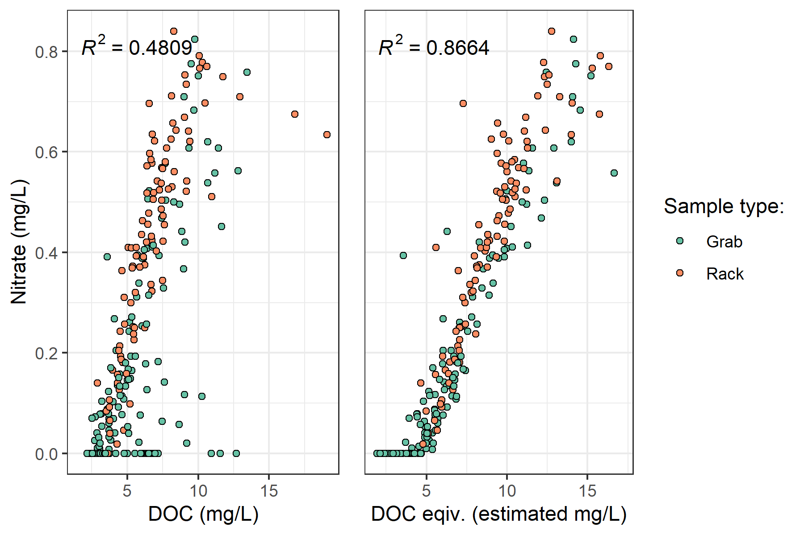
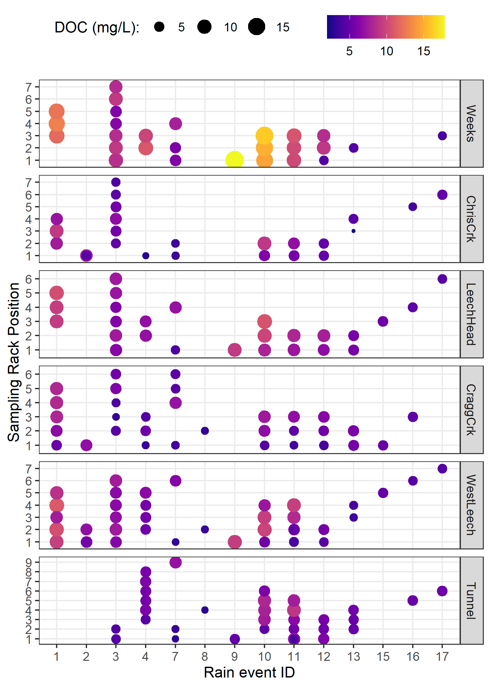

```{r, results-setup, include = FALSE, package.startup.message = FALSE}
knitr::opts_chunk$set(warning=FALSE, message=FALSE, echo=FALSE)

library(tidyverse) # keep it tidy
library(readr)     # read in delimited files
library(knitr)     # for nice tables
```

# Results

The primary objectives of this project was to characterize the range of hydrochemical dynamics and synchrony during rainfall response among sub-basins ranging in size from 9.6 to 37 km^2^.  To understand spatial and temporal patterns in hydrochemical dynamics, this research was tackled in two key ways: (1) six sub-basin sites were equipped with vertical racks which logged river stage, air and water temperature at 10-minute intervals and passively collected whole water samples during stormflow on rising limbs of the hydrograph;  and  (2) thirteen sites, including the six sub-basin sites, were sampled synoptically every two to four weeks. Results of both the synoptic sampling and sub-basin monitoring were used to characterize the temporal and spatial range of DOC concentrations and DOM character. In addition to spatiotemporal dynamics, the sub-basin monitoring sites were used to evaluate hydrologic responses based on  river rise (stream stage) and local precipitation. The vertical racks installed at the sub-basin sites enhanced the synoptic sampling program by collecting samples during rainfall-induced hydrologic surges -- samples which would have been challenging and dangerous to collect manually at locations across the watershed. DOC concentration trends in stormflow were indicative of whether aqueous DOM was supply-limited or governed by hydrologic forcing. The data collected were used to elucidate spatiotemporal synchrony among sub-catchments. 

## Weather

### CRD F-Wx stations

The Capital Regional District (CRD) provided data from two fire-weather stations they operate within the Leech water supply area (LWSA). Chris Creek weather station (561m a.s.l) is located in the headwaters of the Leech watershed and Martin's Gulch (512m a.s.l) is located near the future point of diversion (Leech River Tunnel). With two weather stations, there were insufficient data points to estimate sub-basin precipitation via Theissen polygons or isohyetal lines; therefore, arithmetic means were calculated based on data from Chris Creek and Martin's Gulch stations. It was assumed that the arithmetic means of precipitation and temperatures were representative of conditions across the Leech watershed. Figure \@ref(fig:meanWxLWSA) shows average precipitation and air temperature over 2018 and 2019 with the study period highlighted. Table \@ref(tab:meanWxLWSAdata) summarizes weather data by calender year, as well as the very wet period of January and February, 2020. 

\    

```{r meanWxLWSA, out.width = "100%", fig.pos="h", fig.cap = fig_cap}
fig_cap = "\\label{fig:meanWxLWSA} *Average weather from two stations in the Leech water supply area, where the highlighted section indicates the study period.*"

knitr::include_graphics("R-outputs_UBC-forWater-MSc_HMc/figures/Wx_LWSA-means.png")
```
 
\  

```{r meanWxLWSAdata}
read_csv("R-outputs_UBC-forWater-MSc_HMc/tables/Wx_LWSA-mean-summary.csv", col_names = TRUE) %>% 
  knitr::kable(digits = c(1, 1, 1, 2, 2, 2, 1, 1),
               caption = "*Average of weather data from CRD stations in Leech water supply area in 2018 and 2019*")
```

\  

#### Malahat 5 year weather

The LWSA weather stations were recently installed and therefore data during the study period could not be compared to a record from previous years. A nearby weather station operated by the BC Ministry of Transportation and Infrastructure (Malahat, station ID 62091) had data available from late 2013 which was used to check if weather during the study period departed from previous year trends. Figure \@ref(fig:WxMalahat) shows Malahat weather data, which are summarized in Table \@ref(tab:WxMalahat-data).

```{r WxMalahat, out.width = "100%", fig.pos="h", fig.cap = fig_cap}
fig_cap = "\\label{fig:WxMalahat} *Five year weather from nearby Malahat station (MoTI ID 62091).*"

knitr::include_graphics("R-outputs_UBC-forWater-MSc_HMc/figures/Wx_Malahat.png")
```

\  

```{r WxMalahat-data}
read_csv("R-outputs_UBC-forWater-MSc_HMc/tables/Wx_malahat-summary.csv", col_names = TRUE) %>% 
  knitr::kable(digits = c(1, 2, 1, 1),
               caption = "*Annual weather data from Malahat station (MoTI ID 62091)*")
```

\  

Malahat weather station data were grouped by years 2016-2017 and 2018-2019 to check if there was a statistical difference in precipitation and air temperature for the two years prior to this study compared to the two years associated with this study (Figure \@ref(fig:MalahatTestBox)). Table \ref(tab:MalahatTest) summarizes the results Wilcoxon rank sum test comparing these two sets.


```{r MalahatTestBox, out.width = "100%", fig.pos="h", fig.cap = fig_cap}
fig_cap = "\\label{fig:MalahatTestBox} *Weather from the Malahat station for two year periods prior to and during this study (MoTI ID 62091).*"

knitr::include_graphics("R-outputs_UBC-forWater-MSc_HMc/figures/Wx_Malahat_plot_pre-MSc-2years.png")
```

\  

```{r MalahatTest}
read_csv("R-outputs_UBC-forWater-MSc_HMc/tables/Wx_Malahat_Wilcoxtest_pre-MSc-2years.csv", col_names = TRUE) %>% 
  knitr::kable(digits = c(1, 12),
               caption = "*Results of Wilcoxon test for Malahat weather data before and during the study period*")
```


### Leech River Responses 

River stage was continuously recorded at six locations across the LWSA. Figure \@ref(fig:megaplot) shows weather and stream response over the study period. 

\  
 
```{r megaplot, out.width = "100%", fig.pos="h", fig.cap = fig_cap}
fig_cap = "\\label{fig:megaplot} *Weather and stream rise response at six locations across the Leech water supply area.*"

knitr::include_graphics("R-outputs_UBC-forWater-MSc_HMc/figures/Wx-stage_subbasins_megaplot.png")
```

\  
 
* TO DO: ADD summary of connectivity / synchronisity among subbasins

\  
 
### Rain events 

Rain events were defined using the USGS Rainmaker package in R with 15-minute rain measurements (average of the two CRD LWSA stations). Major events were defined by cumulative precipitation in excess of 50 mm, and separated by a period of 14 hours between events. Table \@ref(tab:Events) summarizes the eighteen rain events which occurred during the study period, and Figure \@ref(fig:EventsPlot) shows stream level at each monitored sub-basin along with events and samples collected. Eight of these events were captured in the 2019 water year (2018-2019 wet season), the other ten in the 2020 water year.

\  

```{r Events}
read_csv("R-outputs_UBC-forWater-MSc_HMc/tables/Wx_Events.csv") %>% 
  knitr::kable(col.names = c("Event ID", "Rain (mm)", "Start", "End"),
               caption = "*Rain events defined based on precipitation intensity*")
```

\  

```{r EventsPlot, out.width = "100%", fig.pos="h", fig.cap = fig_cap}
fig_cap = "\\label{fig:EventsPlot} *Plot of precipitation and stream rise at six sites, with sample points and storm events shown as points and vertical lines (respectively).*"

knitr::include_graphics("R-outputs_UBC-forWater-MSc_HMc/figures/hydro-samples_rain-events_plot.png",
                        caption = "*Rain events and sample collection at six sub-basin sites across the LWSA.*")
```
\  

## River samples for DOC analysis

Sixteen months of bi-weekly field work was completed with the goals of contributing to the characterization of the Leech Water Supply Area (LWSA) while furthering our understanding of the variability of dissolved organic matter (DOM) dynamics in hydrologic response across a second growth forested watershed. From November 2018 to February 2020, 445 samples (Table \@ref(tab:samplecount))  were collected and analyzed at UBC for DOC concentration and DOM character via high temperature combustion and UV-Vis spectroscopy (respectively). In addition, two sets of replicate samples from four sites were sent to _for_Water partners at the University of Waterloo for source water analyses of drinking water treatability metrics; and an additional 42 samples were collected on behalf of the CRD for analysis of a suite of total metals at an external laboratory. 

\  

```{r samplecount}
read_csv("R-outputs_UBC-forWater-MSc_HMc/tables/summary_AllSamples_Count.csv", col_names = TRUE) %>% 
  knitr::kable(caption = "*Summary of samples collected*")
```

\  

### DOC in association with other water quality parameters
 
#### Metals & DOC 

Aqueous natural organic matter (NOM) can play an important role in transportation of metals in solution because it has the physiochemical ability to act as a ligand and create coordinated complexes with metals. From November 2018 to July 2019, seven sets of samples were collected from six sites in the LWSA for metals analysis. Metals samples were collected on behalf of the CRD and were analyzed at Bureau Veritas Laboratories in Sidney, BC (formerly Maxxam Analytics Inc.). For each metals sample collected, a parallel Grab sample was collected and analyzed for DOC at UBC. A suite of total metals were included in the analyses, many of which were below detection limits. Samples which had detectable metals concentrations were plotted against parallel sample DOC concentrations (Figure \@ref(fig:metalsug) shows DOC with total metals in μg/L, and Figure \@ref(fig:metalsmg) shows metals in mg/L). 

\  

```{r metalsug, out.width = "100%", fig.pos="h", fig.cap = fig_cap}
fig_cap = "\\label{fig:metalsug} *Concentrations of total metals (in μg/L) and dissolved organic carbon.*"

knitr::include_graphics("R-outputs_UBC-forWater-MSc_HMc/figures/metals-doc_ugL_scatterplots.png")
```

\  

```{r metalsmg, out.width = "100%", fig.pos="h", fig.cap = fig_cap}
fig_cap = "\\label{fig:metalsmg} *Concentrations of total metals (in mg/L) and dissolved organic carbon.*"

knitr::include_graphics("R-outputs_UBC-forWater-MSc_HMc/figures/metals-doc_mgL_scatterplots.png")
```

\  

DOC concentrations had strong positive relationships with total mercury, iron, manganese, aluminum. While the relationships were not as strong, DOC was also positively related to concentrations of barium, copper, and arsenic. There was a weak inverse relationship between DOC with silicon and potassium (Table \@ref(tab:metalsdata)). All metals concentrations were below maximum allowable concentrations and aesthetic objectives for drinking source water quality guidelines [@BC2019].

\  

```{r metalsdata}
read_csv("R-outputs_UBC-forWater-MSc_HMc/tables/metals-doc_correlations.csv", 
         col_names = TRUE) %>% 
  knitr::kable(digits = c(1, 1, 0, 2, 2, 4), 
               col.names = c("Metal", "unit", "count", "slope", "Y intercept", "R squared"),
               caption = "*Relationships between total metals with dissolved organic carbon*")
```

\  

#### Nitrate & DOC 

Each sample that was analyzed on the Spectrolyser resulted in an estimate of DOC and nitrate concentrations based on sample UV-Vis light absorption. Estimated concentrations of nitrate were positively related to DOC concentration (Figure \@ref(fig:nitrate1)).

\  

```{r nitrate1, out.width = "100%", fig.pos="h", fig.cap = fig_cap}
fig_cap = "\\label{fig:nitrate1} *Concentration of nitrate (estimated via UV-Vis absorption) and dissolved organic carbon.*"


```

\  

UV absorbance based estimations of DOC concentration were more strongly correlated to nitrate estimates (Figure \@ref(fig:nitrate2)).

\  

```{r nitrate2, out.width = "100%", fig.pos="h", fig.cap = fig_cap}
fig_cap = "\\label{fig:nitrate2} *Concentration of nitrate and dissolved organic carbon, both estimated via UV-Vis absorption.*"

knitr::include_graphics("R-outputs_UBC-forWater-MSc_HMc/figures/nitrate-DOCeq_scatter.png")
```

\  

#### Treatability & DOC

Dissolved organic matter -- particularly high molecular weight aromatic compounds -- are precursors to disinfection by-products (DBPs), which are formed during chlorination of source drinking water. Drinking water supply for the CRD is treated simply by chlorinating raw source water, and therefore source water NOM could have important implications for treatability. To assess the potential of source water to form potentially harmful DBPs, samples were collected from four locations and sent to partners at the University of Waterloo for treatability analyses (specifically, DBP formation potentials (DBP-FPs)). Results from two sets of samples at four selected sites showed positive correlations between DOC concentrations and DBP-FPs, and even stronger relationships between DBP-FPs and UV absorbance at 254-nm -- an indicator of NOM aromaticity (Figure \@ref(fig:treatability)). The relatively stronger correlation between DBP-FPs and UV-254 indicates that while DOM concentration is an important indicator of source water treatability challenges, the aromaticity of source water NOM may be an even more important driver. 

\  

```{r treatability, out.width = "100%", fig.pos="h", fig.cap = fig_cap}
fig_cap = "\\label{fig:treatability} *Plots of disinfection by-product formation potentials (DBP-FPs) with dissolved organic carbon (left column) and UV absorbance at 254 nm (right column). Samples collected at four sites on two occasions.*"

knitr::include_graphics("R-outputs_UBC-forWater-MSc_HMc/figures/treatability_DOC-UV254.png")
```

\  

While UV-254 is a good indicator of NOM aromaticity and also appears to be correlated to DBP-FPs, naturally occurring aqueous chemicals (such as nitrate and iron) can interfere with spectroscopic analyses and lead to positive bias in DOM estimates. While aqueous nitrate may lead to an over estimate absorbance-based DOM concentrations, aqueous nitrogen can also play an important roll as a precursor to nitrogenous-DBPs when in combination with NOM, which could make UV{254} an even better indicator of DBP-FP.     

\  

* TO DO: add comparison of treatability metrics at Tunnel versus Sooke Tribs

\  

### Synoptic Sampling

Over the sixteen month study period, 227 samples were collected at thirteen river sites across the Leech and Sooke water supply areas. Figure \@ref(fig:synopticDOCbox) shows DOC concentrations across each synoptically samples site, and Table \@ref(tab:synopticDOCdata) summarized the range of DOC concentrations. 

\ 

```{r synopticDOCbox, out.width = "100%", fig.pos="h", fig.cap = fig_cap}
fig_cap = "\\label{fig:synopticDOCbox} *Synoptic sampling results of dissolved organic carbon concentrations from 13 sites over 16 months (227 grab samples).*"

knitr::include_graphics("R-outputs_UBC-forWater-MSc_HMc/figures/DOC_syn_13sites_boxplots.png")
```

\  

```{r synopticDOCdata}
read_csv("R-outputs_UBC-forWater-MSc_HMc/tables/DOC-Synoptic_grab-summary.csv", col_names = TRUE) %>% 
  knitr::kable(digits = c(1, 0, 1, 1, 2, 2, 2), 
               caption = "*Summary of dissolved organic carbon across thirteen synoptically sampled river sites*")
``` 

\  

Figure (\@ref(fig:synopticDOCridge)) shows the density distribution of DOC concentrations at each of the synoptically sampled sites. DOC concentrations were typically higher in headwater streams, particularly those associated with wetlands.

\  

```{r synopticDOCridge, out.width = "100%", fig.pos="h", fig.cap = fig_cap}
fig_cap = "\\label{fig:synopticDOCridge} *Density distribution of dissolved organic carbon concentrations resulting from synoptic sampling at 13 sites over 16 months (227 grab samples).*"

knitr::include_graphics("R-outputs_UBC-forWater-MSc_HMc/figures/DOC_syn_13sites_ridgeplots.png")
```

\  
 
#### Seasonal patterns: UV-absorption as indicator of molecular character

With samples collected over sixteen months, a seasonal assessment of source water character was possible. NOM molecules with greater aromaticity will absorb more UV energy at wavelength 254-nm than non-aromatic molecules; therefore, spectroscopic methods of estimating DOM are proxy measures of sample aromaticity (e.g., humic substances). Figure \@ref(fig:seasonalDOCest) shows DOC concentrations plotted against DOC estimates based on UV-Vis absorbance. The seasonal separation of wet an dry season samples suggests that river water during the wet-season (fall and winter) has more aromatic character than during the dry-season (summer). 

\  

```{r seasonalDOCest, out.width = "100%", fig.pos="h", fig.cap = fig_cap}
fig_cap = "\\label{fig:seasonalDOCest} *Dissolved organic carbon measured directly (as NPOC) plotted against concentrations estimated via UV-Vis spectroscopy, with a dashed lined indicating best fit (1:1). The 282 samples are grouped by season (n{wet} = 237, n{first-flush} = 18, n{dry} = 27).*"

knitr::include_graphics("R-outputs_UBC-forWater-MSc_HMc/figures/DOC_seasonal_surrogate-NPOC.png")
```

\  

Figure \@ref(fig:seasonalDOCest) showed that characteristics of wet-season samples caused positive bias in absorbance-based DOC estimates, while dry-season samples showed negative bias in DOC estimated by UV-Vis absorption.

\  

While an aromatic NOM sample will have stronger absorbance at 254-nm relative to a non-aromatic sample, the concentration of NOM also effects the intensity of absorbance (based on the Beer-Lambert law). Because UV-Vis absorbance is proportional to both the aromaticity and the concentration of NOM in a sample, SUVA~254~ is a widely adopted indicator of a sample's aromaticity. Specific UV absorbance at 254-nm (SUVA~254~) is calculated by dividing a sample's absorbance at 254-nm by its DOC concentration; a greater SUVA~254~ value indicates a sample with more aromatic character than a sample with low SUVA~254~. Figure \@ref(fig:seasonalSUVADOC) shows seasonally grouped samples' DOC plotted against SUVA~254~, which indicates a greater aromatic character of river water during the wet season compared to dry season.

\  

```{r seasonalSUVADOC, out.width = "100%", fig.pos="h", fig.cap = fig_cap}
fig_cap = "\\label{fig:seasonalSUVADOC} *Dissolved organic carbon plotted against specific UV absorbance at 254 nm (SUVA{254}) with samples (n = 282) grouped by season (n{wet} = 237, n{first-flush} = 18, n{dry} = 27) showing greater aromaticity (more humic-like organic matter) in wet season samples.*"

knitr::include_graphics("R-outputs_UBC-forWater-MSc_HMc/figures/DOC_seasonal_SUVA-NPOC.png")
```

\  

## Leech watershed and nested sub-catchments

Six locations across the LWSA were set up as monitoring sites where vertical racks were installed to measure continuous stage and collect water samples as the rivers rose in response to precipitation events. These vertical racks collected samples on the rising hydrograph limb, which has been shown to have higher DOC concentration that non-storm flow [@Yang2015; @Raymond2016; @Raymond2010]. Table \@ref(tab:subbasinSampleCounts) summarizes the number of samples collected manually (Grab samples) and via siphon bottles on the vertical racks (Rack samples) at each of the six monitoring sites. Figure \@ref(fig:subbasinDOCbox) shows the range of DOC concentrations at each of the six sites.

\  

```{r subbasinSampleCounts}
read_csv("R-outputs_UBC-forWater-MSc_HMc/tables/summary_subbasins-SampleCount.csv", col_names = TRUE) %>% 
  knitr::kable(caption = "*Sample counts at the six LWSA monitoring sites*",
               col.names = c("Site", "Sample type", "Count"))
```

\  

```{r subbasinDOCbox, out.width = "100%", fig.pos="h", fig.cap = fig_cap}
fig_cap = "\\label{fig:subbasinDOCbox} *Dissolved organic carbon concentrations across the Leech watershed over sixteen months (367 samples).*"

knitr::include_graphics("R-outputs_UBC-forWater-MSc_HMc/figures/DOC_subbasin_boxplots.png")
```

\  

The Leech River Tunnel site (*'Tunnel'*) is the effective outlet of the water supply area, as the tunnel will act as the point of diversion in future inter-basin transfer. Each of the five monitored sub catchments are effectively integrated at the tunnel site. Table \@ref(tab:subbasinDOCtunnelint) summarizes the range and variability in DOC within each site and among all sites. 

\  

```{r subbasinDOCtunnelint}
read_csv("R-outputs_UBC-forWater-MSc_HMc/tables/DOC-subbasin_variance-tunnelIntegration.csv", col_names = TRUE) %>% 
  knitr::kable(col.names = c("Site", "sub-basin type", "sample count", "mean DOC (mg/L)", "std.dev. (± mg/L)", "RSD (±%)", "min DOC", "median DOC", "max DOC"),
               digits = c(1, 1, 0, 1, 1, 0, 2, 2, 2),
               caption = "*Summary of DOC samples collected across the LWSA sub-basins*")
```

\  

Sample results from each nested sub-basin were compared to those of the Tunnel site to determine if there were significant differences between variances. Levene's test was used to test for homogeneity of variance (homoscedasticity), and the results are summarized in Table \@ref(tab:Levenes). There was significant difference between the Tunnel (site 6) and Weeks (site 1), which is a headwater creek that drains Weeks Lake and it's surrounding wetlands in the northwest of the watershed (p < 0.001). Variance in DOC was also significantly different between the Tunnel and West Leech (site 5), which is a mainstem river that drains the west side of the watershed (p < 0.05). Variance at Cragg Creek (site 4) was different (p < 0.10), while variances at Chris Creek and the Head of Leech River (below the confluence of Weeks and Chris Crk) were not found to differ significantly from the Tunnel site. 

\  

```{r Levenes}
read_csv("R-outputs_UBC-forWater-MSc_HMc/tables/DOC-subbasin_variance-LeveneTest.csv", col_names = TRUE) %>% 
  knitr::kable(caption = "*Results of Levene's test compairing nested catchments to the outlet*")
```

\  

### Temporal patterns 

Over time, DOC concentrations followed similar trends across each of the six LWSA sites (Figure \@ref(fig:DOCloess)). DOC was highest early in the wet season and progressively decreased through the fall and winter, reaching minimum concentrations in the spring before progressively increasing again through the summer. Based on spectroscopic indications that dry season NOM was less aromatic in character, it's quite possibly that the increase in summer DOC was due to autochthonous sources such as algae and cyanobacteria, while fall DOC was likely sources from autochthonous terrestrial sources (e.g., humic and fluvic acids).

\  

```{r DOCloess, out.width = "100%", fig.pos="h", fig.cap = fig_cap}
fig_cap = "\\label{fig:DOCloess} *Trends in dissolved organic carbon concentrations over sixteen months (Oct 2018 to Feb 2020) at six sites across the Leech water supply area (n = 367: 166 grab samples, 201 vertical rack samples.*"

knitr::include_graphics("R-outputs_UBC-forWater-MSc_HMc/figures/DOC_subbasin-types-overtime_loess.png")
```

\  

### Seasonal trends

Overall, DOC concentrations were higher through the wet season compared to the dry season (Figure \@ref(fig:DOCseasonal) & Figure \@ref(fig:seasonalSubbasinRidge)). Sample results across the LWSA catchments are summarized by season in Table \@ref(tab:SeasonalSubbasinData).

\  

```{r DOCseasonal, out.width = "100%", fig.pos="h", fig.cap = fig_cap}
fig_cap = "\\label{fig:DOCseasonal} *Boxplots of DOC concentrations at six LWSA sites during dry season (n = 53) and wet season (n = 314).*"


```

\  

```{r seasonalSubbasinRidge, out.width = "100%", fig.pos="h", fig.cap = fig_cap}
fig_cap = "\\label{fig:seasonalSubbasinRidge} *Density distribution of dissolved organic carbon concentrations at six sites over sixteen months across the Leech water supply area, where sample results are grouped by dry season (n = 53) and wet season (n = 314).*"

knitr::include_graphics("R-outputs_UBC-forWater-MSc_HMc/figures/DOC_seasonal-subbasin-ridgeplot.png")
```

\  

```{r SeasonalSubbasinData}
a <- read_csv("R-outputs_UBC-forWater-MSc_HMc/tables/subbasin-seasonal-DOC.csv", col_names = TRUE) 
a$rain_season <- fct_recode(a$rain_season,
                       "Dry" = "Dry season", "Wet" = "Wet season") 
a %>% 
  knitr::kable(col.names = c("Site", "Season", "Sample count", "mean DOC (mg/L)", "std.dev. (± mg/L)", "RSD (±%)"),
               digits = c(1, 1, 0, 1, 1, 0),
               caption = "Seasonal summary of samples collected across LWSA subbasin sites")
```

\  

#### Stormflow representation

During the wet season, rain events are the dominant hydrologic forcing. Table \@ref(tab:wetSeasonSubbainsSamples) summarizes the number of samples collected across the LWSA sub-basin sites by sample type. 

\  

```{r wetSeasonSubbainsSamples}
read_csv("R-outputs_UBC-forWater-MSc_HMc/tables/summary_wet-season_subbasins-SampleCount.csv", 
         col_names = TRUE) %>%
  knitr::kable(col.names = c("Site", "Sample type", "Count"),
               caption = "*Summary of wet-season samples collected across LWSA subbasin sites from Oct 2018 to Feb 2020*")
```

\  

Stormflow samples collected during stream rise via vertical Racks showed higher DOC than Grab samples manually collected across wet seasons (Figure \@ref(fig:subbasinSampletypeBox) & \@ref(fig:subbasinSampletypeRidge)). Results of wet-season sample analysis are summarized in Table \@ref(tab:wetSeasonSubbainDOC).

\  

```{r subbasinSampletypeBox, out.width = "100%", fig.pos="h", fig.cap = fig_cap}
fig_cap = "\\label{fig:subbasinSampletypeBox} *Wet-season dissolved organic carbon concentrations grouped by site and sample collection method, where Grab samples were manually obtained (n = 114) and Rack samples were collected passively on vertical racks fit with siphon sampler bottles (n = 200).*"

knitr::include_graphics("R-outputs_UBC-forWater-MSc_HMc/figures/DOC_subbasin_GvsR_boxplot.png")
```

\  

```{r subbasinSampletypeRidge, out.width = "100%", fig.pos="h", fig.cap = fig_cap}
fig_cap = "\\label{fig:subbasinSampletypeRidge} *Density distribution of dissolved organic carbon concentrations grouped by site and sample collection method, where Grab samples were manually obtained (n = 114) and Rack samples were collected passively on vertical racks fit with siphon sampler bottles (n = 200).*"

knitr::include_graphics("R-outputs_UBC-forWater-MSc_HMc/figures/DOC_subbasin-ridgeplot_GvsR.png")
```

\  

```{r wetSeasonSubbainDOC}
read_csv("R-outputs_UBC-forWater-MSc_HMc/tables/DOC_wet-season_subbasin_MeanMinMax-SampleType.csv", 
         col_names = TRUE) %>%
  knitr::kable(col.names = c("Site", "Sample type", "DOC mean (mg/L)", 
                             "std.dev. (± mg/L)", "RSD (±%)", "min DOC", "max DOC"),
               digits = c(1, 1, 1, 1, 0, 2, 2),
               caption = "*Results of wet-season samples collected across LWSA subbasin sites from Oct 2018 to Feb 2020*")
```

\  

### Rising limb -- hydrologic versus supply controls on export

Figure \@ref(fig:RisingLimbPlot) shows rising limb sample DOC concentrations across rain events at the LWSA sub-basins. While there was a typically some increase in DOC with increasing river stage, seasonality appeared to have a greater influence on DOC concentrations than river rise (highest DOC early in the wet season). 

```{r RisingLimbPlot, out.width = "100%", fig.pos="h", fig.cap = fig_cap}
fig_cap = "\\label{fig:RisingLimbPlot} *DOC concentration trends in rising limb samples categorized by rain events*"


```


## Quality Control 

### Vertical Rack Hold-Time Experiments

Hold-time experiments were conducted to assess sample stability on the vertical racks, Figure \@ref(fig:HoldTimePlot) summarizes air temperature and timing of hold-time sets.

\  

```{r HoldTimePlot, out.width = "100%", fig.pos="h", fig.cap = fig_cap}
fig_cap = "\\label{fig:HoldTime_plot} *Plot of air temperature during vertical rack hold-time experiments. Red horizontal lines indicate the 0-7°C range of a typical laboratory refrigerator and dashed vertical lines separate the three sets of hold-time samples.*"

knitr::include_graphics("R-outputs_UBC-forWater-MSc_HMc/figures/HoldTime_air-Temp.png")
```

\  

Results of t-tests are summarized in Table \@ref(tab:HoldTimeTtests). There was a significant change in DOC concentration during hold-time set A, in which DOC-rich "first flush" samples were held for 11 days at average temperature of 7.3°C. Sets B and C did not show significant changes in DOC concentrations. Changes to UV absorbance at 254nm were observed for set C, which was held for 34 days at an average of 4.4°C with a period of sub-zero temperatures. These results suggest that freezing did not alter DOC concentrations but did effect DOM character (reduction in aromaticity). 

* TO DO: calculate average temperatures & hold-times for rack samples during each event collection. 

\  

```{r HoldTimeTtests}
read_csv("R-outputs_UBC-forWater-MSc_HMc/tables/HoldTime_tTests.csv", col_names = TRUE) %>% 
  knitr::kable(col.names = 
                 c("Hold-time Set", "Sample season", "Days held", "Mean temp.", 
              "DOC (mg/L): fresh // held", "p-value (DOC)", "DOC change", 
              "UV254 (mg/L): fresh // held", "p-value (UV254)", "UV254 change"), 
               caption = "*Results of t-tests comparing hold-time samples*")
```

\  

### Laboratory 

UBC-based laboratory analysis of samples resulted in an overall accuracy of 3.7% based on analysis of 20 calibration verification standards.


## Random Forests

* in progress


```{r, include = FALSE}
# empty
```

