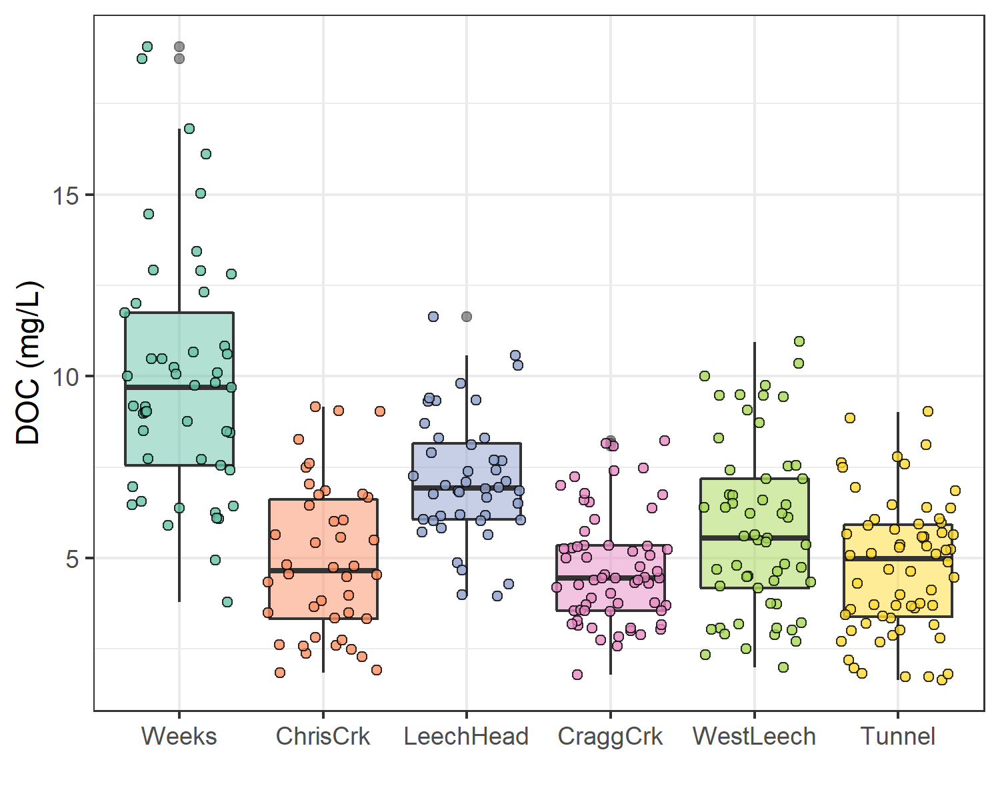
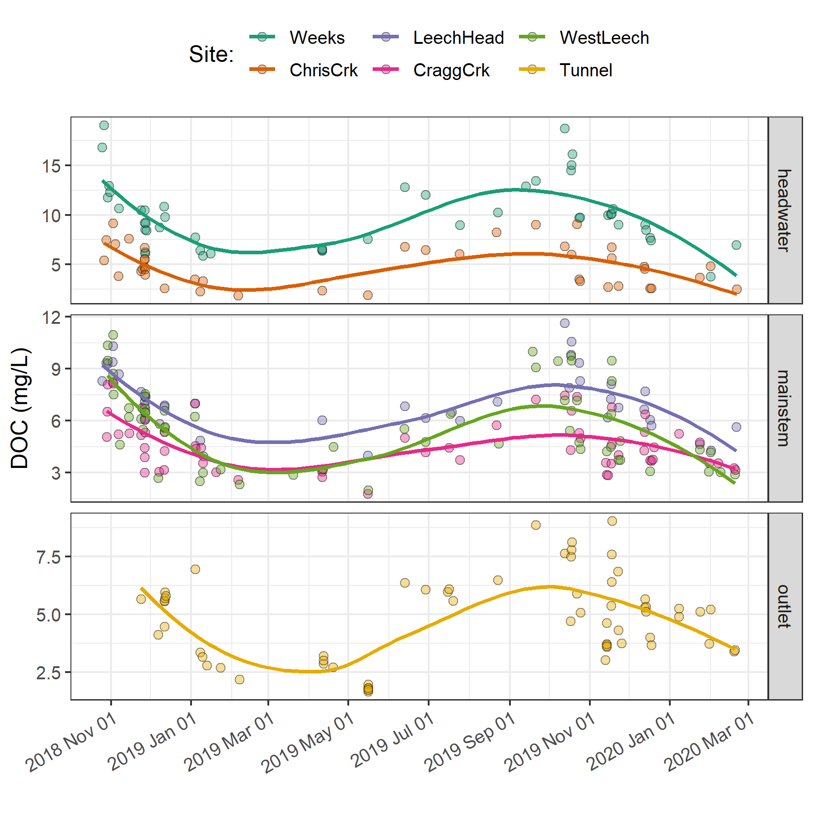
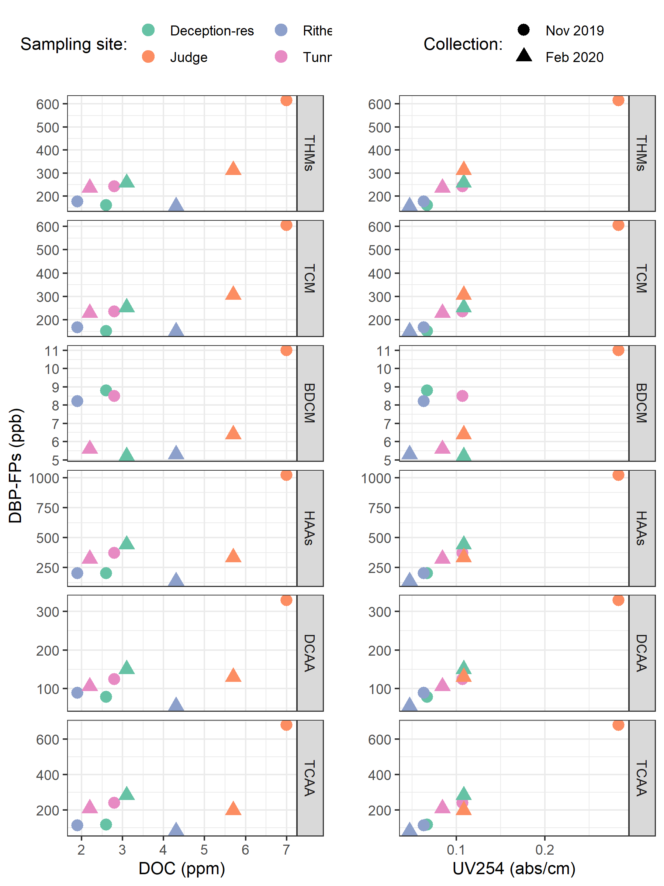
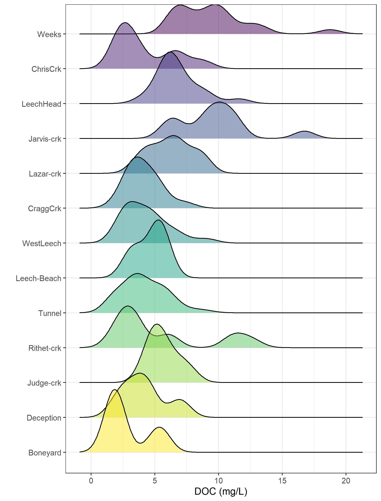
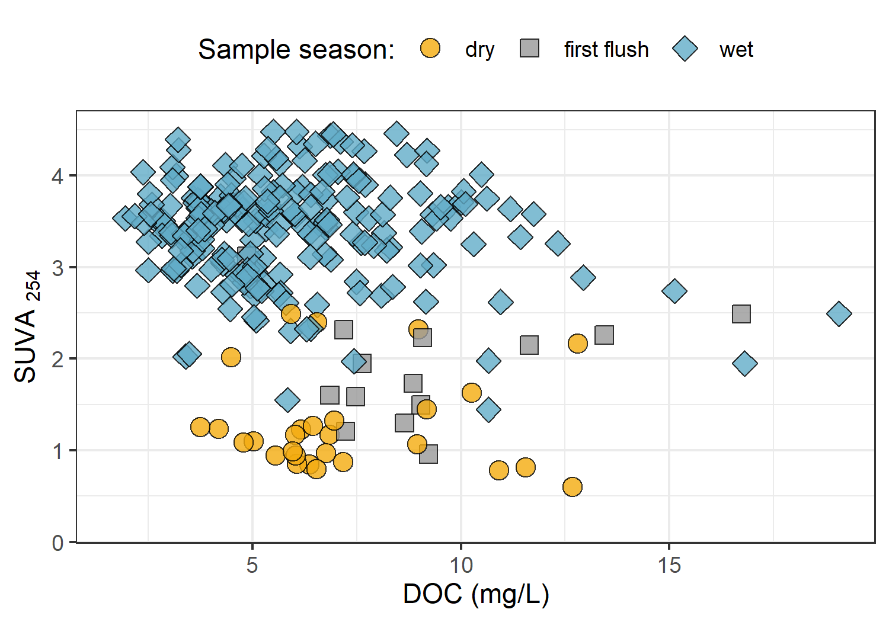

```{r, include = FALSE, package.startup.message = FALSE}
knitr::opts_chunk$set(warning=FALSE, message=FALSE, echo=FALSE)

library(tidyverse)  # keep it tidy
library(readr)      # read in delimited files
library(knitr)      # for nice tables

```

# 3.0     Results

The primary objectives of this project were to characterize the range of hydrochemical dynamics and synchrony during rainfall response among sub-basins ranging in size from 9.6 to 37 km^2^.  To understand spatial and temporal patterns in hydrochemical dynamics, this research was tackled in two key ways: (1) six sub-basin sites were equipped with vertical racks which logged river stage, air and water temperature at 10-minute intervals and passively collected whole water samples during stormflow on rising limbs of the hydrograph;  and  (2) thirteen sites, including the six sub-basin sites, were sampled synoptically every two to four weeks. Results of both the synoptic sampling and sub-basin monitoring were used to characterize the temporal and spatial range of DOC concentrations and DOM character. In addition to spatiotemporal dynamics, the sub-basin monitoring sites were used to evaluate hydrologic responses based on  river rise (stream stage) and local precipitation. The vertical racks installed at the sub-basin sites enhanced the synoptic sampling program by collecting samples during rainfall-induced hydrologic surges -- samples which would have been challenging and dangerous to collect manually at locations across the watershed. DOC concentration trends in stormflow were indicative of whether aqueous DOM was supply-limited or governed by hydrologic forcing. The data collected were used to elucidate spatiotemporal synchrony among sub-catchments. 

## 3.1    Weather: temperature and precipitation

### 3.1.1     CRD weather stations

The Capital Regional District (CRD) provided data from two fire-weather ("FWx") stations in the Leech water supply area (LWSA). Chris Creek weather station (561m a.s.l) is located in the headwaters of the Leech watershed and Martin's Gulch (512m a.s.l) is located near the future point of diversion (Leech River Tunnel). With two weather stations, there were insufficient data points to estimate sub-basin precipitation via Theissen polygons or isohyetal lines; therefore, arithmetic means were calculated based on data from Chris Creek and Martin's Gulch stations. It was assumed that the arithmetic means of precipitation, temperature and snow depth were representative of conditions across the Leech watershed. Average precipitation and air temperature are shown in Figure \@ref(fig:meanWxLWSA), with the study period highlighted. Table \@ref(tab:meanWxLWSAdata) summarizes weather data by calender year, as well as the very wet period of January and February, 2020. 

\    

```{r meanWxLWSA, out.width = "100%", fig.pos="h", fig.cap = fig_cap}
fig_cap = "\\label{fig:meanWxLWSA} *Average weather from two stations in the Leech water supply area, where the highlighted section indicates the study period.*"

knitr::include_graphics("R-outputs_UBC-forWater-MSc_HMc/figures/Wx_LWSA-means.png")
```
 
\  

```{r meanWxLWSAdata}
read_csv("R-outputs_UBC-forWater-MSc_HMc/tables/Wx_LWSA-mean-summary.csv", col_names = TRUE) %>% 
  knitr::kable(digits = c(1, 1, 1, 2, 2, 2, 1, 1),
               caption = "*Average of weather data from CRD stations in Leech water supply area in 2018 and 2019*")
```

\  

#### 3.1.1.1    Rain events 

LWSA mean FWx precipitation data were used to define rain events using the USGS *Rainmaker* package in R ('RMevents' function). During the study period there were 151 rain events, and 18 that were classified as major events. Major rain events were defined by precipitation accumulating to 50mm or more, where the events were separated from each other by a period of at least 14 hours. Table \@ref(tab:Events) summarizes the eighteen major rain events that occurred during the study period (2018-10-23 to 2020-02-20).

\  

```{r Events}
read_csv("R-outputs_UBC-forWater-MSc_HMc/tables/Wx_Events.csv") %>% 
  knitr::kable(digits = c(0,0,0,1,1,1),
               caption = "*Rain events defined by a threshold of 50mm with 14-hour inter-event period*")
```

\  

Major rain events' minimum and maximum values of depth, duration and intensity were identified for each calender year included in the study period (Table \@ref(tab:MinMaxEvents)). The maximum intensity event of 2020, on January 30, generated incredible flows across the Leech watershed (not unlike the rest of Vancouver Island and most of the south coast of BC). Streamflow at Cragg crk (site-4) and the Leech Tunnel (site-6) over-topped the (2m+) vertical racks and ripped the level-loggers out of their stilling wells [^1]. Luckily, the level-loggers were found downstream in February and (after drying the circuit boards) the data were successfully retrieved from both Odyssey loggers.  

[^1]:Following this major event, changes to the stream-bed morphology were evident at Leech-head (site-3) in the form of gravel and cobble deposition, and there was evidence of substantial coarse woody debris transport at Chris crk (site-2).    


```{r MinMaxEvents}
read_csv("R-outputs_UBC-forWater-MSc_HMc/tables/Wx_Events-annual_min-max.csv") %>% 
  knitr::kable(digits = c(0,1,1,1,1,2,1),
               caption = "*Minimum and maximum rain event values *")
```

\  

Figure \@ref(fig:EventsPlot) shows stream level at each monitored sub-basin along with events and samples collected. Eight of these events were captured in the 2019 water year (2018-2019 wet season), the other ten in the 2020 water year.

\  

```{r EventsPlot, out.width = "100%", fig.pos="h", fig.cap = fig_cap}
fig_cap = "\\label{fig:EventsPlot} *Plot of Precipitation and stream rise at six sites showing rain events and sample collection at six sites across the LWSA, including sample points and rain events as vertical lines.*" 

knitr::include_graphics("R-outputs_UBC-forWater-MSc_HMc/figures/hydro-samples_rain-events_plot.png")
```
\  

### 3.1.2   Temperature at vertical racks

At each research site, temperatures were recorded at 30 minute intervals using TidbiT temperature loggers (HOBO TidbiT v2 Temperature Data Logger, Onset, USA) attached to the top and bottom of each vertical rack installation. Loggers at the top of racks recorded air temperature and those at the bottom recorded water temperature (Figure \@ref(fig:TidbiTairwaterLine). 


```{r TidbiTairwaterLine, out.width = "100%", fig.pos="h", fig.cap = fig_cap}
fig_cap = "\\label{fig:TidbiTairwaterLine} *Temperatures recorded in air and water on vertical racks at each research site.*"
knitr::include_graphics("R-outputs_UBC-forWater-MSc_HMc/figures/TidbiTs_line-by-time_daily.png")
```

\  

While loggers were installed in both positions (air and water) on each rack at the same time, it wasn't until mid-October that all sites' water temperature loggers were submerged. Figure \@ref(fig:TidbiTairwaterBox) shows the distributions of air and water temperatures at each site, where water temperature was limited to the period when all sites water temperature loggers were submerged. Median water temperatures increased from the headwaters of Leech River to the point of diversion (Leech-Head Cragg-Crk < West-Leech < Tunnel).  

\  

```{r TidbiTairwaterBox, out.width = "100%", fig.pos="h", fig.cap = fig_cap}
fig_cap = "\\label{fig:TidbiTairwaterBox} *Temperatures recorded in air and water on vertical racks at each research site.*"
knitr::include_graphics("R-outputs_UBC-forWater-MSc_HMc/figures/TidbiTs_box-by-location_daily.png")
```

\  

### 3.1.3   Air temperature comparison

Air temperatures recorded at each of the six sites were compared to LWSA FWx for the overlapping period (August 24, 2019 to February 20, 2020). Figure \@ref(fig:TidbiTFWxline) OR Figure \@ref(fig:TidbiTFWxbox) shows temperatures at each site compared to mean LWSA weather station air temperature. 

```{r TidbiTFWxline, out.width = "100%", fig.pos="h", fig.cap = fig_cap}
fig_cap = "\\label{fig:TidbiTFWxline} *Air temperatures recorded at each sub-basin compared to mean LWSA air temperatures from CRD fire weather stations.*"
knitr::include_graphics("R-outputs_UBC-forWater-MSc_HMc/figures/TidbiTs-FWx_subbasin_daily-temps.png")
```

\  

***OR***

\  

```{r TidbiTFWxbox, out.width = "100%", fig.pos="h", fig.cap = fig_cap}
fig_cap = "\\label{fig:TidbiTFWxbox} *Air temperatures recorded at each sub-basin compared to mean LWSA air temperatures from CRD fire weather stations.*"
knitr::include_graphics("R-outputs_UBC-forWater-MSc_HMc/figures/TidbiTs-FWx_box-air-by-site.png")
```

\  

Two-sided Wilcoxon rank sum test were employed to compare air temperatures at each site to LWSA FWx temperature. Air temperatures at each of the six vertical racks were different than temperatures recorded by the CRD weather stations (Figure \@ref(fig:TidbiTFWxridges), Table \@ref(tab:TidbiTFWxPVALUES)). Headwater sites (Weeks, Chris Creek and Leech Head) and Cragg Creek generally recorded lower air temperatures compared to CRD weather stations, while temperatures recorded at West Leech and Tunnel sites were similar but slightly higher than LWSA mean temperatures.

\  

```{r TidbiTFWxridges, out.width = "100%", fig.pos="h", fig.cap = fig_cap}
fig_cap = "\\label{fig:TidbiTFWxridges} *Density distribution of air temperatures recorded at each sub-basin compared to mean LWSA air temperatures from CRD fire weather stations.*"

knitr::include_graphics("R-outputs_UBC-forWater-MSc_HMc/figures/TidbiTs-FWx_ridgeplot-subbasins.png")
```

\  

```{r TidbiTFWxPVALUES}
read_csv("R-outputs_UBC-forWater-MSc_HMc/tables/TidbiT-FWx_Wilcoxon-pvalues.csv", col_names = TRUE) %>% 
  mutate(p.value = format(p.value, digits = 2)) %>% 
  knitr::kable(caption = "*Summary of Wilcoxon test results comparing air temperature at each subbasin to mean LWSA temperature from CRD FWx stations*",
               col.names = c("Site", "p-Value"))
```

Rack temperatures deviated most from the FWx stations during the summer months and had better agreement during the fall and winter (wet season).

\  

##### 3.1.3.1     Linear Regression 

```{r HoboFWxLinearReg, out.width = "100%", fig.pos="h", fig.cap = fig_cap}
fig_cap = "\\label{fig:HoboFWxLinearReg} *Relationships between air temperature recorded at each research site compared to mean air temperature recorded by LWSA weather stations.*"

knitr::include_graphics("R-outputs_UBC-forWater-MSc_HMc/figures/Temp_TidbiTs-FWx_lm-scatter.png")
```

\  

Based on the period of overlapping FWx and TidbiT air temperature data, linear regression was performed to estimate research site temperatures prior to Hobo TidbiT deployment (Figure \@ref(fig:HoboFWxLinearReg). Table \@ref(tab:TidbiTestimateErrors) summarizes the average percent error of estimated air

\  

```{r TidbiTestimateErrors}
read_csv("R-outputs_UBC-forWater-MSc_HMc/tables/TidbiT-FWx_lm_prediction-errors.csv", col_names = TRUE) %>% 
  #mutate(p.value = format(p.value, digits = 2)) %>% 
  knitr::kable(digits = c(0,1,1,1,1,1,1,1),
               caption = "*Summary of predicted air temperature at each site compared to mean LWSA temperature from CRD FWx stations for the same time period*",
               col.names = c("Site", "Error (%)", 
                             "Median Temp. (°C)", 
                             "Estimated Median (°C)",
                             "Min. Temp (°C)",
                             "Estimated Min. (°C)",
                             "Max. Temp (°C)",
                             "Estimated Max. (°C)"))
```

\  

estimated air temperatures at each research site were used for quality control data processing of vertical rack samples (Figure \@ref(fig:HoboFWxLinearReg).

\  
 
## 3.2     Data Handling & Quality Control 

UBC-based laboratory analysis of samples resulted in an overall accuracy of 3.7% based on analysis of 20 calibration verification standards. 

### 3.2.1   Vertical Rack Hold-Time Experiments

Hold-time experiments were conducted at the Tunnel site to assess stability of river water samples held in siphon bottles on the vertical rack. Figure \@ref(fig:HoldTimeAirPlot) summarizes air temperature and timing of the three hold-time sets.

\  

```{r HoldTimeAirPlot, out.width = "100%", fig.pos="h", fig.cap = fig_cap}
fig_cap = "\\label{fig:HoldTimeAirPlot} *Plot of air temperature during vertical rack hold-time experiments. Red horizontal lines indicate the 0-7°C range of a typical laboratory refrigerator and dashed vertical lines separate the three sets of hold-time samples from collection of grab samples to retrieval of held samples.*"

knitr::include_graphics("R-outputs_UBC-forWater-MSc_HMc/figures/HoldTime_airTemp.png")
```

\  

Each hold-time set included ten replicate samples (collected at the same time in the same way from the same location); in each hold-time set, five samples were returned to the lab for analysis of DOC concentration and UV absorbance and five were placed on the vertical rack, capped with siphon lids (to simulate rack samples), and collected at a later date for analysis. Results of sample analyses for DOC and UV-254 absorbance of the fresh and held samples of each set (Figure \@ref(fig:HoldTimeBoxPlot)) were compared using two-sided paired Wilcoxon signed rank tests (a.k.a 'Mann-Whitney' test) [^1]. Table \@ref(tab:HoldTimeTtests) summarizes the number of days the rack samples were held relative to their grab sample counterparts, the mean air temperature over that period, and the percent change in DOC concentration and UV absorbance at 254nm, as well as Wilcoxon test results. 

[^1]:The Wilcoxon signed-rank test is a non-parametric paired difference test used in comparing two related samples to assess whether their means differ, or are the same (null hypothesis); it is an alternative to paired Student's t-tests, suitable for when the differences between two sample's means are not assumed to be normally distributed.

\  

```{r HoldTimeBoxPlot, out.width = "100%", fig.pos="h", fig.cap = fig_cap}

fig_cap = "\\label{fig:HoldTimeBoxPlot} *Sample DOC concentrations and UV absorbance at 254nm contrasting  hold-time samples from collection of grab samples to retrieval of held samples.*"

knitr::include_graphics("R-outputs_UBC-forWater-MSc_HMc/figures/HoldTime_boxplots.png")
```

\ 

```{r HoldTimeTtests}
read_csv("R-outputs_UBC-forWater-MSc_HMc/tables/HoldTime_results-summary.csv", col_names = TRUE) %>%
  knitr::kable(caption = "*Results comparing hold-time sample sets*")
```

\  

While there was no change in UV absorbance for samples from hold-time set-A, there was a significant (at 90% confidence level) change in DOC concentration (p-value = 0.063). Samples collected for hold-time set-A were DOC-rich "first flush" samples, the Rack samples were held for 11 days at average temperature of 7°C (slightly above laboratory refrigerator temperatures). For set-A, mean DOC concentration was 45% lower in the held samples compared to the fresh grab samples.  

Set-B had a hold-time of 20 days with average air temperature at 6°C and there was no significant changes in either DOC concentration or UV~254~ (<10% change). 

Set-C included samples held for 34 days at an average of 4.4°C, including a period of sub-zero temperatures. While set-C did not show significant changes in DOC concentration (23% reduction), there were significant changes to UV absorbance at 254-nm (34% decrease in absorbance). Set-C held samples had a greater variability in UV-254 compared to fresh sample counterparts. 

These results suggest that early-season ("first flush") samples may contain more labile DOC which is unstable and should be analyzed immediately after collection, whereas later season samples contain DOC which is relatively more stable for up to and including 20 days when kept at approximately refrigerator temperature. A hold-time of 34 days with periods of freezing (set-C) did not alter DOC concentrations but did effect DOM character via a reduction in aromaticity. 

### 3.2.2   QA-QC Flags for Data

Based on results of the hold-time experiments, results of sample analyses were updated to include QA-QC data flags. Vertical rack samples that remained on the racks for fewer than 20 days were flagged as acceptable ("OK") whereas samples that were either held for 20 days or longer or were identified as early-wet-season ("first-flush") that were held for 7 days or longer were flagged as exceeding an acceptable hold-time. These QA-QC flags were used to filter data for subsequent analyses.  

## 3.3     Nested sub-catchments of the LWSA

Six locations across the LWSA were set up as monitoring sites where vertical racks were installed to measure continuous stage and collect water samples as the rivers rose in response to precipitation events. Figure \@ref(fig:megaplot) shows precipitation, air temperature, and stream response over the study period, as well as the timing and stage of sample collection. 

\  
 
```{r megaplot, out.width = "100%", fig.pos="h", fig.cap = fig_cap}
fig_cap = "\\label{fig:megaplot} *Weather and stream rise response at six locations across the Leech water supply area.*"

knitr::include_graphics("R-outputs_UBC-forWater-MSc_HMc/figures/Wx-stage_subbasins_megaplot2.png")
```

\ 

Vertical racks collected river samples on the rising hydrograph limb, which has been shown to have higher DOC concentration that non-storm flow [@Yang2015; @Raymond2016; @Raymond2010] and can be difficult to capture by standard grab sampling, particularly across multiple sites. Sampling of the six research sites was achieved through a combination of vertical rack sampling and synoptic grab sampling. Indeed, samples with maximum DOC concentrations were captured by vertical racks at five of the six sites with the exception of Leech River head (*'LeechHead'*), where peak DOC happened to be collected as a Grab sample.

### 3.3.1     DOC concentrations & variance
  
Figure \@ref(fig:subbasinDOCbox) shows the distribution of DOC concentrations at each of the six sites. Highest DOC concentrations occurred at the Weeks Main creek headwater site (*'Weeks'*, site 1), a sub-basin in the northwest of the watershed which includes Weeks Lake and surrounding wetlands. Lowest DOC was recorded at Leech River Tunnel site (*'Tunnel'*, site 6). 

\  

```{r subbasinDOCbox, out.width = "100%", fig.pos="h", fig.cap = fig_cap}
fig_cap = "\\label{fig:subbasinDOCbox} *Dissolved organic carbon concentrations across the Leech watershed over sixteen months (366 samples).*"


```

\  

The Tunnel site is the outlet of the Leech water supply area (LWSA), as the Leech River Tunnel will be the point of diversion for future inter-basin transfer. Runoff from each of the five nested catchments are effectively integrated at the Tunnel site. Similarly, Weeks Main and Chris Creek sites (*'Weeks'* & *'ChrisCrk'*) are integrated at the Leech-Head site. Table \@ref(tab:subbasinDOCtunnelint) summarizes the range and variability in DOC within each site and among all sites, with categorical groupings of sub-basins. 

\  

```{r subbasinDOCtunnelint}
read_csv("R-outputs_UBC-forWater-MSc_HMc/tables/DOC-Subbasin_summary_CategoryIntegration.csv", col_names = TRUE) %>% 
  knitr::kable(col.names = c("Site", "Basin type", "Sample count", "Mean DOC (mg/L)", "sd (± mg/L DOC)", "RSD (± %)", "Min.(mg/L)", "Median (mg/L)", "Max.(mg/L)"),
               digits = c(0, 0, 0, 0, 0, 0, 2, 2, 2),
               caption = "*Summary of DOC across the six LWSA research sites with each nested catchment classified by basin type. Relative standard deviation (RSD) reflects the absolute standard deviation (sd) relative to mean DOC at each site.*")
```

\  

** needs a better frame: 
  Which was greater, the variability of DOC concentrations within each site or between sites?

Relative standard deviation (RSD) indicates how values range around the mean within a group. Across the LWSA DOC at each site ranged from 24% to 41% RSD. Among the headwater sites (sites 1 & 2) DOC had a 52% RSD, compared to 36% among mainstem rivers. This means that the variance observed between headwater sites was greater than the variance thant occured at each site, whereas RSD among mainstem rivers was close to the average observed at each of those sites.    

Results of Levene's test[^1] confirmed that the variance of DOC concentrations was not homogeneous across the LWSA (p-value = 8.2^-10^). To identify which pairs of sites had equal DOC variance (or were heteroscedastic), Levene's test was applied to sample DOC results for pairs of sites. Table \@ref(tab:Levenes) classifies each site comparison by basin-type and summarizes p-values for each pair. Of the nine comparisons made between the six sites, West Leech River (*'WestLeech'*, site-5) and Weeks Main Creek (*'Weeks'*, site-1) did not have homogeneous variance when compared with any other sites; all other combinations of sites showed homoscedasticity. Both of these sub-basins drain the west side of LWSA. 

[^1]:Levene's test is used to check for homogeneity of variance (homoscedasticity).

\  

```{r Levenes}
read_csv("R-outputs_UBC-forWater-MSc_HMc/tables/DOC-stats_variance-LeveneTests.csv", col_names = TRUE) %>% 
  knitr::kable(digits = c(5),
               caption = "*Results of Levene's test comparing DOC variance between sites. Significance stars indicate confidence levels: *** 99% (alpha = 0.01); ** 95% (alpha = 0.05); * 90% (alpha = 0.1), 90% confidence was the threshold for supporting the null hypothesis of homoscedasticity.*")
```

\  

### 3.3.2     Temporal patterns 

Fluctuations in stage were synchronized across the LWSA, and it was confirmed that river response was concordant among the six sites (Kendall's W = 0.9721, Spearman's ranked correlation = 0.9666, p-value <0.001 (based on 999 randomizations)). While rainfall generated synchrony in stream rise, how did aqueous DOC concentration vary over time? 


Over time, DOC concentrations followed similar trends across each of the six LWSA sites (Figure \@ref(fig:DOCloess)). DOC was highest early in the wet season and progressively decreased through the fall and winter, reaching minimum concentrations in the spring before progressively increasing again through the summer. Based on spectroscopic indications that dry season NOM was less aromatic in character, it's quite possibly that the increase in summer DOC was due to autochthonous sources such as algae and cyanobacteria, while fall DOC was likely sources from autochthonous terrestrial sources (e.g., humic and fluvic acids).

\  

```{r DOCloess, out.width = "100%", fig.pos="h", fig.cap = fig_cap}
fig_cap = "\\label{fig:DOCloess} *Trends in dissolved organic carbon concentrations over sixteen months (Oct 2018 to Feb 2020) at six sites across the Leech water supply area (n = 367: 166 grab samples, 201 vertical rack samples.*"


```

\ 

__I think I should drop this, because DOC was not recorded continuously or simultaneously__

To determine whether DOC minimum and maximum concentrations occurred at the same time across the LWSA, temporal synchrony tests were run on sample results. The R package Synchrony was used to find the proportion of common time-stamped DOC extrema (minima and maxima) between pairs of sites. Table \@ref(tab:synchDOCpeaks) summarizes the findings of these synchrony tests, where a proportion of 1 indicates perfect temporal synchrony of DOC peaks between sites (and zero indicates asynchrony).
 
** OR if DateTime was rounded to 30 minute intervals, there might be more of a level playing field? 
*** nope never mind, I don't think that will work because you'd have to average DOC values or something

### ? spatial Synchrony DOC & stage local extrema

--- manual doc and peak stage analysis 
-- this is the good stuff:

Did DOC concentrations peak in synchrony with river stage at each site? To determine if local extrema (maxima and minima) DOC concentrations were captured in synchrony with the local extrema of sampled flows (minima and maxima sampled stage), temporal synchrony tests were run on sample results. For each site, results of samples were grouped by collection period and rain event to identify maximum and minimum DOC and peak sample stage and then checked to determine whether extrema of DOC occurred in the sample collected at corresponding stage extrema. Table \@ref(tab:synchDOCstage) summarized the proportion of samples collected at each site for which the same sample corresponded to both DOC and sample stage extrema. 

\  

```{r synchDOCstage}
read_csv("R-outputs_UBC-forWater-MSc_HMc/tables/synchrony_DOC-stage_extrema-simultaneous.csv", col_names = TRUE) %>% 
  knitr::kable(digits = c(0,3),
               caption = "*Proportion of samples for which peak DOC was found in the highest sample stage.*")
```

\ 


To better understand how timing of peak DOC varied among sites during the wet season, a subset of samples was selected for closer analysis. The subset included samples from rain events 10-12; a subset deemed to be representative of DOC concentrations and rain events across the wet seasons, as there were no significant differences between DOC concentrations or rain events (amount and intensity) for this subset of samples compared to the rest of the study period (Table \@ref(tab:subbsetWilcox)). There were significant differences in UV~254~ absorbance for events 10-12 compared to the rest of the study period, therefore this subset was not considered representative of spectral trends overall and was only examined for DOC trends.  

\  

```{r subbsetWilcox}
read_csv("R-outputs_UBC-forWater-MSc_HMc/tables/narrow-subbset_wilcoxon.csv", col_names = TRUE) %>% 
  knitr::kable(digits = c(0,0,4),
               caption = "*p-values from Wilcoxon tests comparing the subset of rain events 10-12 and those samples' DOC results to all other sampled rain events, showing no significant difference between the groups.*")
```


### Seasonal trends

Overall, DOC concentrations were higher through the wet season compared to the dry season (Figure \@ref(fig:DOCseasonal) & Figure \@ref(fig:seasonalSubbasinRidge)). Sample results across the LWSA catchments are summarized by season in Table \@ref(tab:SeasonalSubbasinData).

\  

```{r DOCseasonal, out.width = "100%", fig.pos="h", fig.cap = fig_cap}
fig_cap = "\\label{fig:DOCseasonal} *Boxplots of DOC concentrations at six LWSA sites during dry season (n = 53) and wet season (n = 314).*"

knitr::include_graphics("R-outputs_UBC-forWater-MSc_HMc/figures/DOC_seasonal-subbasin_boxplots.png")
```

\  

```{r seasonalSubbasinRidge, out.width = "100%", fig.pos="h", fig.cap = fig_cap}
fig_cap = "\\label{fig:seasonalSubbasinRidge} *Density distribution of dissolved organic carbon concentrations at six sites over sixteen months across the Leech water supply area, where sample results are grouped by dry season (n = 53) and wet season (n = 314).*"

knitr::include_graphics("R-outputs_UBC-forWater-MSc_HMc/figures/DOC_seasonal-subbasin-ridgeplot.png")
```

\  

```{r SeasonalSubbasinData}
a <- read_csv("R-outputs_UBC-forWater-MSc_HMc/tables/subbasin-seasonal-DOC.csv", col_names = TRUE) 
a$rain_season <- fct_recode(a$rain_season,
                       "Dry" = "Dry season", "Wet" = "Wet season") 
a %>% 
  knitr::kable(col.names = c("Site", "Season", "Sample count", "mean DOC (mg/L)", "std.dev. (± mg/L)", "RSD (±%)"),
               digits = c(1, 1, 0, 1, 1, 0),
               caption = "Seasonal summary of samples collected across LWSA subbasin sites")
```

\  

#### Stormflow representation

During the wet season, rain events are the dominant hydrologic forcing. Table \@ref(tab:wetSeasonSubbainsSamples) summarizes the number of samples collected across the LWSA sub-basin sites by sample type. 

\  

```{r wetSeasonSubbainsSamples}
read_csv("R-outputs_UBC-forWater-MSc_HMc/tables/summary_wet-season_subbasins-SampleCount.csv", 
         col_names = TRUE) %>%
  knitr::kable(col.names = c("Site", "Sample type", "Count"),
               caption = "*Summary of wet-season samples collected across LWSA subbasin sites from Oct 2018 to Feb 2020*")
```

\  

Stormflow samples collected during stream rise via vertical Racks showed higher DOC than Grab samples manually collected across wet seasons (Figure \@ref(fig:subbasinSampletypeBox) & \@ref(fig:subbasinSampletypeRidge)). Results of wet-season sample analysis are summarized in Table \@ref(tab:wetSeasonSubbainDOC).

\  

```{r subbasinSampletypeBox, out.width = "100%", fig.pos="h", fig.cap = fig_cap}
fig_cap = "\\label{fig:subbasinSampletypeBox} *Wet-season dissolved organic carbon concentrations grouped by site and sample collection method, where Grab samples were manually obtained (n = 114) and Rack samples were collected passively on vertical racks fit with siphon sampler bottles (n = 200).*"

knitr::include_graphics("R-outputs_UBC-forWater-MSc_HMc/figures/DOC_subbasin_GvsR_boxplot.png")
```

\  

```{r subbasinSampletypeRidge, out.width = "100%", fig.pos="h", fig.cap = fig_cap}
fig_cap = "\\label{fig:subbasinSampletypeRidge} *Density distribution of dissolved organic carbon concentrations grouped by site and sample collection method, where Grab samples were manually obtained (n = 114) and Rack samples were collected passively on vertical racks fit with siphon sampler bottles (n = 200).*"

knitr::include_graphics("R-outputs_UBC-forWater-MSc_HMc/figures/DOC_subbasin-ridgeplot_GvsR.png")
```

\  

```{r wetSeasonSubbainDOC}
read_csv("R-outputs_UBC-forWater-MSc_HMc/tables/DOC_wet-season_subbasin_MeanMinMax-SampleType.csv", 
         col_names = TRUE) %>%
  knitr::kable(col.names = c("Site", "Sample type", "DOC mean (mg/L)", 
                             "std.dev. (± mg/L)", "RSD (±%)", "min DOC", "max DOC"),
               digits = c(0, 0, 1, 1, 0, 2, 2),
               caption = "*Results of wet-season samples collected across LWSA subbasin sites from Oct 2018 to Feb 2020*")
```

\  

### Rising limb -- hydrologic versus supply controls on export

Figure \@ref(fig:RisingLimbPlot) shows rising limb sample DOC concentrations across rain events at the LWSA sub-basins. While there was a typically some increase in DOC with increasing river stage, seasonality appeared to have a greater influence on DOC concentrations than river rise (highest DOC early in the wet season). 

```{r RisingLimbPlot, out.width = "100%", fig.pos="h", fig.cap = fig_cap}
fig_cap = "\\label{fig:RisingLimbPlot} *DOC concentration trends in rising limb samples categorized by rain events*"

knitr::include_graphics("R-outputs_UBC-forWater-MSc_HMc/figures/DOC_rack-trends.png")
```


### DOC association with other water quality parameters
 
#### Metals & DOC 

Aqueous natural organic matter (NOM) can play an important role in transportation of metals in solution because it has the physiochemical ability to act as a ligand and create coordinated complexes with metals. From November 2018 to July 2019, seven sets of samples were collected from six sites in the LWSA for metals analysis. Metals samples were collected on behalf of the CRD and were analyzed at Bureau Veritas Laboratories in Sidney, BC (formerly Maxxam Analytics Inc.). For each metals sample collected, a parallel Grab sample was collected and analyzed for DOC at UBC. A suite of total metals were included in the analyses, many of which were below detection limits. Samples which had detectable metals concentrations were plotted against parallel sample DOC concentrations (Figure \@ref(fig:metalsug) shows DOC with total metals in μg/L, and Figure \@ref(fig:metalsmg) shows metals in mg/L). 

\  

```{r metalsug, out.width = "100%", fig.pos="h", fig.cap = fig_cap}
fig_cap = "\\label{fig:metalsug} *Concentrations of total metals (in μg/L) and dissolved organic carbon.*"

knitr::include_graphics("R-outputs_UBC-forWater-MSc_HMc/figures/metals-doc_ugL_scatterplots.png")
```

\  

```{r metalsmg, out.width = "100%", fig.pos="h", fig.cap = fig_cap}
fig_cap = "\\label{fig:metalsmg} *Concentrations of total metals (in mg/L) and dissolved organic carbon.*"

knitr::include_graphics("R-outputs_UBC-forWater-MSc_HMc/figures/metals-doc_mgL_scatterplots.png")
```

\  

DOC concentrations had strong positive relationships with total mercury, iron, manganese, aluminum. While the relationships were not as strong, DOC was also positively related to concentrations of barium, copper, and arsenic. There was a weak inverse relationship between DOC with silicon and potassium (Table \@ref(tab:metalsdata)). All metals concentrations were below maximum allowable concentrations and aesthetic objectives for drinking source water quality guidelines [@BC2019].

\  

```{r metalsdata}
read_csv("R-outputs_UBC-forWater-MSc_HMc/tables/metals-doc_correlations.csv", 
         col_names = TRUE) %>% 
  knitr::kable(digits = c(1, 1, 0, 2, 2, 4), 
               col.names = c("Metal", "unit", "count", "slope", "Y intercept", "R squared"),
               caption = "*Relationships between total metals with dissolved organic carbon*")
```

\  

#### Nitrate & DOC 

Each sample that was analyzed on the Spectrolyser resulted in an estimate of DOC and nitrate concentrations based on sample UV-Vis light absorption. Estimated concentrations of nitrate were positively related to DOC concentration (Figure \@ref(fig:nitrate1)).

\  

```{r nitrate1, out.width = "100%", fig.pos="h", fig.cap = fig_cap}
fig_cap = "\\label{fig:nitrate1} *Concentration of nitrate (estimated via UV-Vis absorption) and dissolved organic carbon.*"

knitr::include_graphics("R-outputs_UBC-forWater-MSc_HMc/figures/nitrate-DOC_scatter.png")
```

\  

UV absorbance based estimations of DOC concentration were more strongly correlated to nitrate estimates (Figure \@ref(fig:nitrate2)).

\  

```{r nitrate2, out.width = "100%", fig.pos="h", fig.cap = fig_cap}
fig_cap = "\\label{fig:nitrate2} *Concentration of nitrate and dissolved organic carbon, both estimated via UV-Vis absorption.*"

knitr::include_graphics("R-outputs_UBC-forWater-MSc_HMc/figures/nitrate-DOCeq_scatter.png")
```

\  

#### Treatability & DOC

Dissolved organic matter -- particularly high molecular weight aromatic compounds -- are precursors to disinfection by-products (DBPs), which are formed during chlorination of source drinking water. Drinking water supply for the CRD is treated simply by chlorinating raw source water, and therefore source water NOM could have important implications for treatability. To assess the potential of source water to form potentially harmful DBPs, samples were collected from four locations and sent to partners at the University of Waterloo for treatability analyses (specifically, DBP formation potentials (DBP-FPs)). Results from two sets of samples at four selected sites showed positive correlations between DOC concentrations and DBP-FPs, and even stronger relationships between DBP-FPs and UV absorbance at 254-nm -- an indicator of NOM aromaticity (Figure \@ref(fig:treatability)). The relatively stronger correlation between DBP-FPs and UV-254 indicates that while DOM concentration is an important indicator of source water treatability challenges, the aromaticity of source water NOM may be an even more important driver. 

\  

```{r treatability, out.width = "100%", fig.pos="h", fig.cap = fig_cap}
fig_cap = "\\label{fig:treatability} *Plots of disinfection by-product formation potentials (DBP-FPs) with dissolved organic carbon (left column) and UV absorbance at 254 nm (right column). Samples collected at four sites on two occasions.*"


```

\  

While UV-254 is a good indicator of NOM aromaticity and also appears to be correlated to DBP-FPs, naturally occurring aqueous chemicals (such as nitrate and iron) can interfere with spectroscopic analyses and lead to positive bias in DOM estimates. While aqueous nitrate may lead to an over estimate absorbance-based DOM concentrations, aqueous nitrogen can also play an important roll as a precursor to nitrogenous-DBPs when in combination with NOM, which could make UV{254} an even better indicator of DBP-FP.     

\  

* TO DO: add comparison of treatability metrics at Tunnel versus Sooke Tribs

\  

### Synoptic Sampling

Over the sixteen month study period, 227 samples were collected at thirteen river sites across the Leech and Sooke water supply areas. Figure \@ref(fig:synopticDOCbox) shows DOC concentrations across each synoptically samples site, and Table \@ref(tab:synopticDOCdata) summarized the range of DOC concentrations. 

\ 

```{r synopticDOCbox, out.width = "100%", fig.pos="h", fig.cap = fig_cap}
fig_cap = "\\label{fig:synopticDOCbox} *Synoptic sampling results of dissolved organic carbon concentrations from 13 sites over 16 months (227 grab samples).*"

knitr::include_graphics("R-outputs_UBC-forWater-MSc_HMc/figures/DOC_syn_13sites_boxplots.png")
```

\  

```
#{r synopticDOCdata}
read_csv("R-outputs_UBC-forWater-MSc_HMc/tables/DOC-Synoptic_grab-summary.csv", col_names = TRUE) %>% 
  knitr::kable(digits = c(1, 0, 1, 1, 2, 2, 2), 
               caption = "*Summary of dissolved organic carbon across thirteen synoptically sampled river sites*")
``` 

\  

Figure (\@ref(fig:synopticDOCridge)) shows the density distribution of DOC concentrations at each of the synoptically sampled sites. DOC concentrations were typically higher in headwater streams, particularly those associated with wetlands.

\  

```{r synopticDOCridge, out.width = "100%", fig.pos="h", fig.cap = fig_cap}
fig_cap = "\\label{fig:synopticDOCridge} *Density distribution of dissolved organic carbon concentrations resulting from synoptic sampling at 13 sites over 16 months (227 grab samples).*"


```

\  
 
#### Seasonal patterns: UV-absorption as indicator of molecular character

With samples collected over sixteen months, a seasonal assessment of source water character was possible. NOM molecules with greater aromaticity will absorb more UV energy at wavelength 254-nm than non-aromatic molecules; therefore, spectroscopic methods of estimating DOM are proxy measures of sample aromaticity (e.g., humic substances). Figure \@ref(fig:seasonalDOCest) shows DOC concentrations plotted against DOC estimates based on UV-Vis absorbance. The seasonal separation of wet an dry season samples suggests that river water during the wet-season (fall and winter) has more aromatic character than during the dry-season (summer). 

___Quality control note___

The spectro::lyser has been shown to effectively determine DOC content and character on unfiltered samples [@Avagyan2014]. However, suspended matter may bias absorbance values due to non-DOC light absorption or scattering. Therefore, spectral indices were not calculated for several unfiltered water samples that had detectable turbidity (greater than 0.000 FTU); this reduced the spectral dataset by 9.5%. ****** DOUBLE CHECK THAT NUMBER (FROM METHODS)

\  

```{r seasonalDOCest, out.width = "100%", fig.pos="h", fig.cap = fig_cap}
fig_cap = "\\label{fig:seasonalDOCest} *Dissolved organic carbon measured directly (as NPOC) plotted against concentrations estimated via UV-Vis spectroscopy, with a dashed lined indicating best fit (1:1). The 282 samples are grouped by season (n{wet} = 237, n{first-flush} = 18, n{dry} = 27).*"

knitr::include_graphics("R-outputs_UBC-forWater-MSc_HMc/figures/DOC_seasonal_surrogate-NPOC.png")
```

\  

Figure \@ref(fig:seasonalDOCest) showed that characteristics of wet-season samples caused positive bias in absorbance-based DOC estimates, while dry-season samples showed negative bias in DOC estimated by UV-Vis absorption.

\  

While an aromatic NOM sample will have stronger absorbance at 254-nm relative to a non-aromatic sample, the concentration of NOM also effects the intensity of absorbance (based on the Beer-Lambert law). Because UV-Vis absorbance is proportional to both the aromaticity and the concentration of NOM in a sample, SUVA~254~ is a widely adopted indicator of a sample's aromaticity. Specific UV absorbance at 254-nm (SUVA~254~) is calculated by dividing a sample's absorbance at 254-nm by its DOC concentration; a greater SUVA~254~ value indicates a sample with more aromatic character than a sample with low SUVA~254~. Figure \@ref(fig:seasonalSUVADOC) shows seasonally grouped samples' DOC plotted against SUVA~254~, which indicates a greater aromatic character of river water during the wet season compared to dry season.

\  

```{r seasonalSUVADOC, out.width = "100%", fig.pos="h", fig.cap = fig_cap}
fig_cap = "\\label{fig:seasonalSUVADOC} *Dissolved organic carbon plotted against specific UV absorbance at 254 nm (SUVA{254}) with samples (n = 282) grouped by season (n{wet} = 237, n{first-flush} = 18, n{dry} = 27) showing greater aromaticity (more humic-like organic matter) in wet season samples.*"


```

\  


## Random Forests

* in progress

