##	Hydrochemical dynamics: river, DOC & NOM event responses

```{r, include = FALSE, package.startup.message = FALSE}

# load required packages
library(tidyverse)  # keep it tidy
library(readr)      # read in delimited files
library(knitr)      # for nice tables

knitr::opts_chunk$set(warning=FALSE, message=FALSE, echo=FALSE, fig.cap=TRUE)

```


### Introduction

__RQ.2.__ Are hydrological processes the main driver for DOC transport and variation in the LWSA or is another watershed characteristic more important for predicting DOC and NOM dynamics?

__Objective 2.0:__   Search for a mechanistic relationship between river stage and DOC or NOM by relating DOC concentrations and NOM character with stage, particularly paying attention to differences between baseflow and storm events.
__Objective 2.1:__   Assess the importance of watershed characteristics and conditions as explanatory variables for DOC and DOM patterns.


Natural organic matter (NOM) is a complex assembly of carbon-based molecules that exhibit dynamic variability across watersheds due to interconnected biotic and abiotic processes. NOM is a complicated medley of molecules so it can be challenging to quantify, but measuring organic carbon (the backbone of NOM) is standard and thus organic carbon is quantified as a surrogate for NOM. The molecular character of NOM can vary from large, highly aromatic compounds to smaller more alliphatic molecules, the differences in molecular makeup can be attributed to the source of NOM (e.g. terrestrial humic substances or in-stream algae). Concentrations and character vary over space and time. The river continuum concept (RCC) predicts a temporal shift in NOM character from autochthonous (e.g. algal) to allochthonous (e.g. humic material) sources, and a spatial reduction in NOM molecular diversity from headwaters to river mouth. The RCC explains temporal changes in NOM character through variable mobilization of source material and biogeochemical processing. Spatial-scaling of NOM diversity is attributed to hydrological processes and most watershed characteristics, including: geomorphic variables; physical impoundments; organic matter inputs and sources; sediment transport; solar inputs; and processing by aquatic invertebrates and microbes [@Vannote1980; @Stanley2012; @Aiken2011; @Zarnetske2018]. 

\  

The Pulse Shunt Concept (PSC) supplements temporal aspects of the RCC by describing how hydrologic events drive the magnitude, timing and spatial extent of NOM fluxes and therefore are ultimately responsible for NOM concentrations in streams over time [@Abbott2018; @Creed2015; @Zarnetske2018; @Raymond2016]. The RCC relies on in-stream biogeochemical processing to explain longitudinal attenuation of NOM character, and the PSC shows that intense hydrologic pulses (related to precipitation or melt events) override the rate of biogeochemical processing and force mass transport events. 

\  

##### Event based sampling 

Given that brief flood events are often responsible for most of the DOC transport in a river system [@Raymond2016], event-based water sampling is an important part of a water quality monitoring program. The rising limb of the hydrograph has been shown to have higher DOC concentration than low flows between storm pulses [@Yang2015; @Raymond2016; @Raymond2010; @Zarnetske2018]. The change in DOC concentration across the rising limb is indicative of source pools of NOM, where increasing rising limb DOC indicates that source material is unlimited and flux is driven by hydrologic connectivity; whereas NOM is likely source-limited if DOC concentration decreases on the rising limb [@Zarnetske2018]. Therefore, the collection of event-based river samples is important for clarifying the magnitude and direction of water quality changes in response to precipitation, and providing information about solute supply and hydrologic connectivity to the landscape [@Vidon2008; @Abbott2018; @Creed2015; @Zarnetske2018].

\  

Pump samplers are effective for automatic event-based sampling that can be set up in the field and programmed to collect a set of water samples based on time intervals or changes in conditions (@Harmel2003). However, pump samplers can be prohibitively expensive ($2K-3K CAD), and also require a reliable power source which can pose logistical challenged for setting up at multiple sites in remote or difficult to access locations (@Mackay2012). 

\  

A low-cost, customizable alternative to a pump sampler is a passive siphon sampler that automatically and effectively collects discrete water samples on the rising limb of the hydrograph (e.g.: @Mackay2012; @Graczyk2000; @Diehl2007). Siphon samplers are limited to sampling a single event and cannot yet collect water samples on the falling hydrograph limb [@Newham2001].

\  

#### Random Forests

The pulse shunt concept (PSC) explains DOC transport with major hydrologic events and the river continuum concept (RCC) explains NOM character changes through a combination of watershed processes and characteristics, but how can the relative importance of these attributes be determined? Random Forests are a statistical tool for non-parametric regression, prediction, classification and assessment of variable importance [@Strobl2009].   

\  

A collection of decision trees is a Random Forest, which play an important role for both predictive modeling and inference purposes. The Breiman's Random Forests (RF) is a machine learning algorithm for practical applications, which is popular for its accuracy in real-world systems [@Tyralis2019; @Biau2016]. In RF, a set of predictor variables (features) are used to predict the outcome of another variable (the predictant) through supervised learning algorithms, grouped as either regression or classification, depending on whether the variables are quantitative (i.e. numeric) or qualitative [@Breiman2001; @Tyralis2019]. 

\  

The RF algorithm learns from many independent Classification And Regression Trees (CARTs) which undergo bootstrap-aggregating ("bagging") with randomization; meaning that no single tree includes all the data, which reduces over-fitting and improves prediction performance [@Breiman2001; @Tyralis2019; @Biau2016]. In RF, many decision tree area created, each one generated by randomly sampling from the full data set (with replacement) and each tree is trained until only one possible solution remains (i.e. leaf nodes contain one deciding variable). For problems of regression (i.e. quantitative numeric variables, such as the data in this thesis), the forest prediction is the average of the individual trees predictions [@Tyralis2019; @Biau2016]. The relative importance of each feature is determined by assessing the accuracy of how well the predictant variable is anticipated in the absence or presence of that feature. 

\  

### Methods

In this project, six river locations in the Leech water supply area (in the Greater Victoria water supply area, BC) were set up as monitoring sites. Water samples were collected synoptically (standard grab sampling) and passively on the rising limb of the hydrograph (via siphon samplers). Concentrations of dissolved organic carbon (DOC) were quantified and molecular characteristics of natural organic matter (NOM) were evaluated with UV-Vis spectroscopy. Samples were related to river stage at each site, and relationships between stage and DOC/NOM were evaluated. Random Forests were used to determine the relative importance of watershed characteristics and conditions in determining DOC concentrations and NOM character across the six sites of the LWSA [@Breiman2001].   

\  

####    Leech River Watershed

The Leech River watershed and Sooke water supply area are in the Coastal Western Hemlock biogeoclimatic zone (CWH), with forests dominated by Douglas-fir (Pseudotsuga menziesii), western hemlock (Tsuga heterophylla) and western red cedar (Thuja plicata); subspecies include white pine (Pinus monticola), amabalis fir (Abies amabilis), alder (Alnus rubra), broad-leaf maple (Acer macrophyllum) and arbutus (Arbutus menziesii). The Leech watershed also includes the moist and dry maritime sub-zones of the CWH (Montane moist 43%, submontane moist 38%, xeric 19%) [@Ussery2015]. While some precipitation occurs as snow at higher elevations, the majority of the ~2000 mm per year falls as rain (i.e. pluvial hydroclimatic regime) [@CRD2020]. Like much of the south coast of BC, the water year can be broadly divided into wet and dry seasons, where approximately October through April are wet while May through September are relatively dry.

\  

#### Monitoring sites and sub-basin characteristics

Six locations across the Leech Water Supply Area (LWSA) were set up as monitoring sites where vertical racks were installed to measure continuous stage and collect water samples as the rivers rose in response to precipitation events (Figure \@ref(fig:subbasinMap)). Nested catchments of the Leech River system included two headwater streams (Weeks and Chris Creek, sites 1 & 2), the head of Leech River below the confluence of the two headwater streams (site 3), two mainstem rivers that feed the Leech (Cragg Creek and West Leech, sites 4 & 5) and the entire LWSA drainage area above the point of diversion, Leech Tunnel (Site 6).	

\  

```{r subbasinMap, out.width = "50%", fig.pos="h", fig.cap = fig_cap}
fig_cap = "\\label{fig:subbasinMap} *Research sites in the Leech Water Supply Area. Sites are named and numbered, where the number indicates both the sequence of vertical rack installations as well as the relative progression from headwaters to mouth. Each research basin boundary (defined using each sampling site as the drainage outlet) is outlined in black, and the water supply area boundary is delineated in red.*"

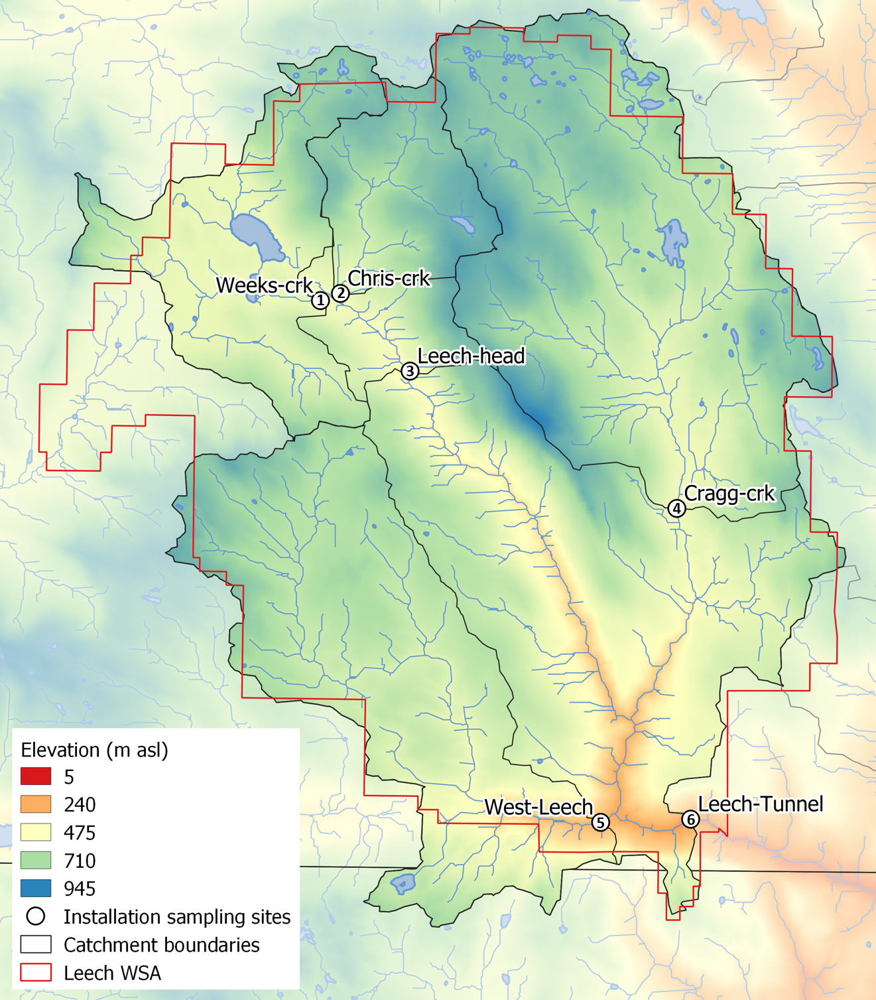
```

\ 

Weeks Creek (site 1), had the greatest proportion of wetland and open water compared to the other sub-basins (Table \@ref(tab:WTScharacterSubbasinTable)). Chris Creek (site 2) and Cragg Creek (site 4) had no metasedimentary parent material (Argillite-Metagraywacke or Metagraywacke). Cragg Creek, draining from the east, was the only sub-basin with preNOMinantly metamorphic parent material (Wark-Gneiss, 78%). West Leech (site 5) was the only sub-basin that did not have Wark-Gneiss nor Chert-Argillite-Volcanic groups as parent materials, and was the only sub-basin of the Metchosin igneous complex (16% Methchosin-volcanics). Like Weeks basin (site 1), which also drains from the West, WestLeech is preNOMinantly underlain by Argillite-Metagreywacke (metasedimentary parent material).       

\  

```{r WTScharacterSubbasinTable}
options(knitr.kable.NA = '')
read_csv("R-inputs_UBC-forWater-MSc_HMc/tables/methods_study-sites_basin-characteristics.csv", col_names = TRUE) %>% 
  knitr::kable(caption = "*Watershed characteristics summary for study sites*")
```

\ 

___this is essentially the same method section as in chapter 2___

At each of the six monitoring sites, a vertical sampling rack was installed. These racks collect discrete water samples during the rising limb of stormflow, without employing costly pump-samplers. Each vertical rack also included a water level logger that recorded continuous stage (at ten-minute intervals). Vertical sampling racks achieved advanced synoptic sampling within stormflow by providing synchronized spatial sampling resolution that would otherwise be difficult to achieve (i.e. sampling multiple sites across the watershed at approximately the same time). Simultaneous stormflow sample collection can provide insights about relative hydrologic pulse responses across nested catchments [@Abbott2018]. Vertical racks collected samples during flows that would otherwise be difficult or unsafe to access and were supplemented with standard grab samples between storm events and during summer baseflow.

\  

The passive sampling bottles employ principles of a siphon design to collect river water as it reaches pre-determined levels on a vertical sampling rack. Siphon sampler bottles were based on a USGS single stage sediment sampler design (US U-59, 1961) which passively collect discrete water samples at a fixed stage on the rising limb of the hydrograph [@Graczyk2000]. The siphon samplers built for this research were 250 mL amber HDPE widemouth bottles with augmented screw caps. The caps were fit with two 1/4" (OD) stainless steel tubes, one longer than the other, both with a 180$^\circ$ bend at the top end.

\  

Each rack included a central stilling well (3.81 cm (1.5") PCV pipe with 1.27 cm (1/2") holes along the length) with a measuring tape affixed to the front. Inside the stilling well was an Odyssey Capacitance Water Level Logger (Dataflow Systems Ltd., New Zealand); and on either side of the central stilling well was a slotted offset angle bar onto which hose clamps held sample bottles fit with custom siphon lids. Each rack also included sensors (HOBO TidbiT v2 Temperature Data Logger, Onset, USA) that recorded air and water temperatures (Figure \@ref(fig:verticalRack)). By combining the height at which each siphon bottle filled with observed stage (stilling-well measuring tape) and level-logger data, the date and time for collection of each rising-stage sample was determined. 

\  

```{r verticalRackCH3, out.width = "30%", fig.pos="h", fig.cap = fig_cap}
fig_cap = "\\label{fig:verticalRack} *Vertical sampling rack and siphon sampler bottle, illustrative of installations at six sites across the LWSA (shown here is Chris Creek (site 2).*"

knitr::include_graphics("R-inputs_UBC-forWater-MSc_HMc/images/Rack_diagram_full.png")
```

\  

The time-stamps of event-based river samples collected near-simultaneously at sites across a watershed were used to inform stage-concentration relationships, and to tease-out insights about relative hydrologic pulse responses across nested catchments.

####   Sample analysis

Water samples were collected in acid-wached 250mL HDPE wide-mouth amber bottles and transported in coolers with ice to the lab for analysis of dissolved organic carbon (DOC) concentrations and spectroscopic absorbance (indicator of NOM character). DOC samples were filtered (0.45-micron PES filters) and acidified (pH < 2), spectroscopy samples were not filtered nor acidified but were ensured to have zero turbidity. Descriptions of sample preparation and quality control are detailed in Chapter 2. DOC was quantified via Method 5310-B on a Shimadzu TOC-V [@StdMet5310], and UV-Vis measurements were completed on a spectro::lyser spectrophotometer (S::can, Vienna, Austria)

\  

Molecular character of NOM in water samples was assessed through specific ultraviolet absorbance at 254nm (SUVA~254~) and the spectral quotient E~2~:E~3~. SUVA~254~ is UV absorption (spectral absorbance coefficient, SAC, m^-1^) at 254 nm wavelength, normalized to the samples DOC concentration [@Weishaar2003], it correlates with NOM aromaticity [@Weishaar2003; @Helms2008; @Chow2008]. E~2~:E~3~ is the ratio of absorbance at wavelengths 250 nm and 365 nm, and is inversely related to aquatic humic solute aromaticity and molecular size  [@Peuravuori1997; @Helms2008].

#### Defining events

___this is the same as in Chapter 2___

The R package _Rainmaker_ (USGS, github.com/USGS-R/Rainmaker) was used with LWSA rain data (average of Chris Creek and Martin's Gulch FWx stations) to define events that corresponded to sampling campaigns and to distinguish between seasons. The pluvial hydroclimatic regime on the coast of BC is characterized by a predominantly wet season and dry season and while the dry season often includes periods of drought there is generally some rainfall throughout the entire year (Figure \@ref(fig:meanWxLWSA)). For this research, seasons were operationally defined by sampling method restrictions such that the "wet" season was defined as the period when rainfall generated stream response significant enough for vertical racks to collect rising limb samples, and the "dry" season was defined by the absence of rainfall response substantial enough for rack sampler collection.

#### RF

include: 
* antecedent 7 day / 14 day / 21 day / 28 day / 35 day temperature & rain
* what are key fire risk parameters -- is there a link between fire weather risk and inceased NOM or DOC?
* include event data (rain intensity, amount, duration)
* include antecedent rain amounts
* include antecedent snow also

### Results

####   Rain events 

LWSA mean FWx precipitation data were used to define rain events using the USGS *Rainmaker* package in R ('RMevents' function). During the study period there were 151 rain events, and 18 events that were classified as major events that corresponded to sample collection by the vertical racks (i.e. events large enough to trigger substantial river responses). Major rain events were defined by precipitation accumulating to 50mm or more, where the events were separated from each other by a period of 14 hours or longer (Table \@ref(tab:EventsTable3)). 

\  

```{r EventsTable3}
read_csv("R-outputs_UBC-forWater-MSc_HMc/tables/CH3_events-n-samples.csv") %>%  
  knitr::kable(digits = c(0,0,1,1,1,0,2,2,2), 
               caption = "*Rain events defined by a threshold of 50mm with 14-hour inter-event period*")
```

\  

An intense (category 3-4) atmospheric river event hit the LWSA January 29-31 (Event 17) and generated incredible flows across the Leech watershed (and across Vancouver Island and most of the south coast of BC). Streamflow at CraggCrk (site 4) and the Tunnel (site 6) over-topped the vertical racks (greater than 2m tall) and ripped the level-loggers out of their stilling wells [^2]. Luckily, the level-loggers were found downstream in February and (after drying the circuit boards) the data were successfully retrieved from both Odyssey loggers. Figure \@ref(fig:EventsPlot) shows stream level at each monitored sub-basin along with events and samples collected. Eight of these events were captured in the 2019 water year (2018-2019 wet season), the other ten in the 2020 water year. For each calender year in the study period, major rain events' minimum and maximum values of depth, duration and intensity were identified and are summarized in Table \@ref(tab:MinMaxEvents).   

[^2]:   Following major event 17 (Jan 29-31), changes to the stream-bed morphology were evident at LeechHead (site 3) in the form of gravel and cobble deposition, there was evidence of substantial coarse woody debris transport at ChrisCrk (site 2), and destruction to hydrologic monitoring equipment at the Leech Tunnel.

\  

```{r EventsPlot, out.width = "100%", fig.pos="h", fig.cap = fig_cap}
fig_cap = "\\label{fig:EventsPlot}*Plot of Precipitation, rain events (as vertical lines), stream rise and sample collection at six sites across the LWSA.*" 

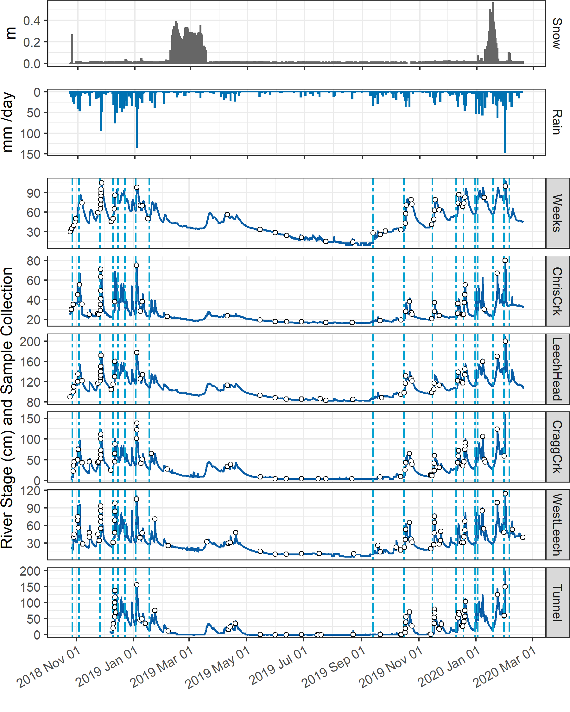
```

\  
 
```{r megaplot, out.width = "100%", fig.pos="h", fig.cap = fig_cap}
fig_cap = "\\label{fig:megaplot} *Rain events, stream response and sample collection across the Leech Water Supply Area. Dashed vertical lines indicate the start of rain events and points indicate the timing and stage of river samples collected.*"

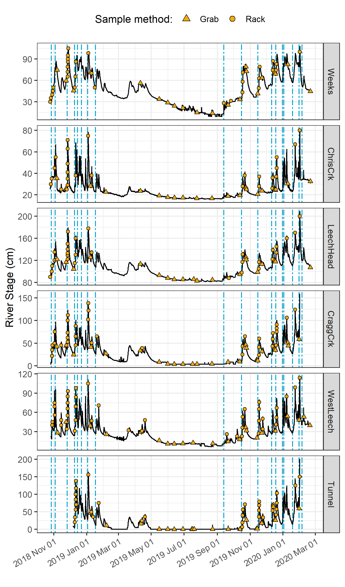
```

\  

```{r MinMaxEvents}
read_csv("R-outputs_UBC-forWater-MSc_HMc/tables/Wx_Events-annual_min-max.csv") %>% 
  knitr::kable(digits = c(0,1,1,1,1,2,1),
               caption = "*Minimum and maximum rain event values *")
```

\  

#### Spatial patterns in DOC & NOM

Samples with maximum DOC concentrations were captured by vertical racks at five of the six sites, with the exception of Leech River head (*'LeechHead'*, site 3) where peak DOC happened to be collected as a Grab sample (Table \@ref(tab:SixDOCsummarySampleType)).

\  

```{r SixDOCsummarySampleType}
read_csv("R-outputs_UBC-forWater-MSc_HMc/tables/DOC-sixsite_summary_sample-type.csv", col_names = TRUE) %>% 
  knitr::kable(col.names = c("Site", "Sample type", "Sample count", "Mean DOC (mg/L)", "sd (± mg/L DOC)", "RSD (± %)", "Min. (mg/L)", "Median (mg/L)", "Max. (mg/L)"),
               digits = c(0, 0, 0, 1, 1, 0, 2, 2, 2),
               caption = "*Summary of DOC across the six LWSA installation sites including breakdown of sample type collected.*")
```

\  

Highest concentrations and variance in DOC occurred at the Weeks Main creek headwater site (*'Weeks'*, site 1), a sub-basin in the northwest of the Leech watershed which includes Weeks Lake and surrounding wetlands. Lowest average concentration and variance in DOC was recorded at Cragg Creek (*'CraggCrk'*, site 4), a mainstem river that drains the east sub-basin of the Leech watershed, including Jarvis Lake and the western slopes of Survey Mountain. DOC concentration and variance at Leech River Tunnel (*'Tunnel'*, site 6) was similar to CraggCrk (Figure \@ref(fig:subbasinDOCbox)).

\  

```{r subbasinDOCbox, out.width = "100%", fig.pos="h", fig.cap = fig_cap}
fig_cap = "\\label{fig:subbasinDOCbox} *Dissolved organic carbon (DOC) concentrations across the Leech watershed over sixteen months, collected by standard grab sampling and on vertical racks (318 samples total).*"

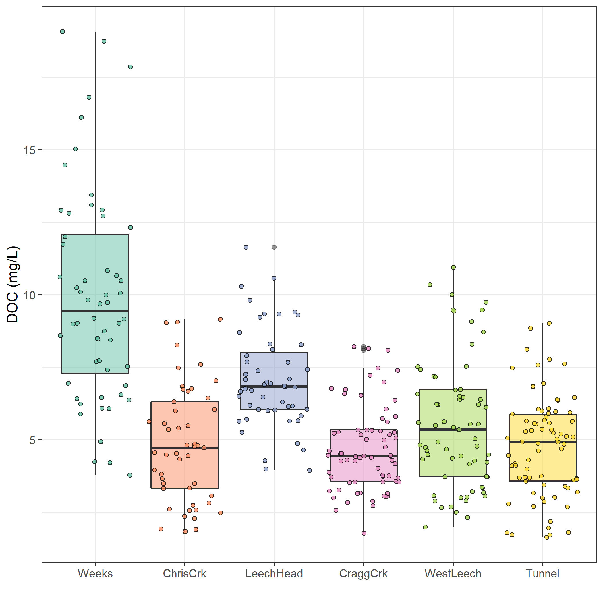
```

\  

##### Spatial and temporal patterns in DOC & NOM

```{r DOCloess, fig.cap = fig_cap}
fig_cap = "\\label{fig:DOCloess} *Trends in dissolved organic carbon concentrations over sixteen months (Oct 2018 to Feb 2020) at six sites across the Leech water supply area (n = 323: 153 grab samples, 170 vertical rack samples. Trend line represents locally weighted smoothing (loess, local polynomial regression).*"

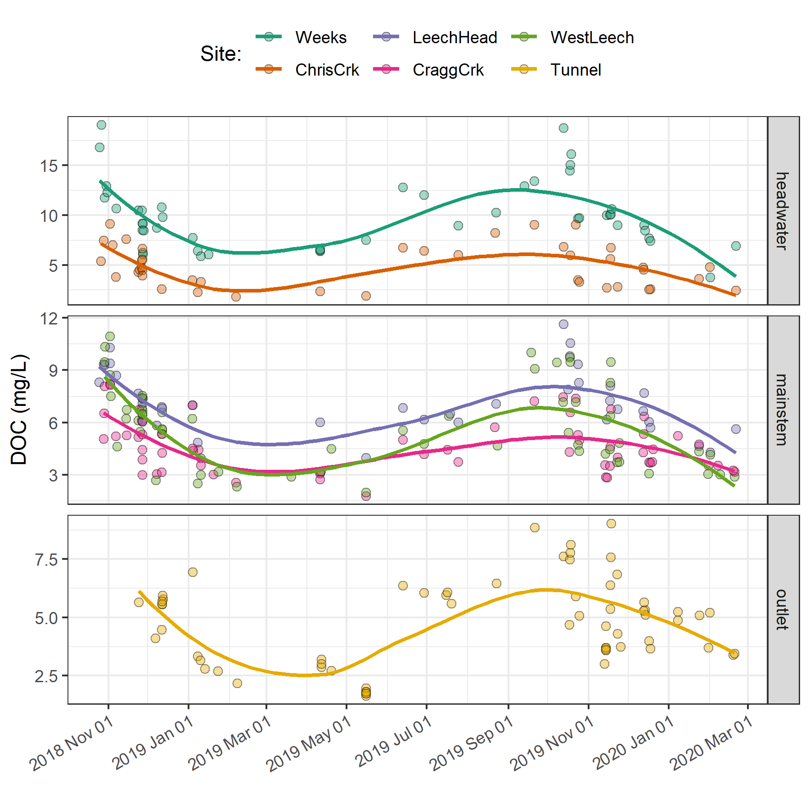
```


Figure \@ref(fig:seasonalDOC)

```{r seasonalDOC, fig.cap = fig_cap}
fig_cap = "\\label{fig:seasonalDOC} *Contrasting DOC from samples collected across wet (n = 279) and dry (n = 39) seasons by both synoptic grab and vertical rack sampling*"

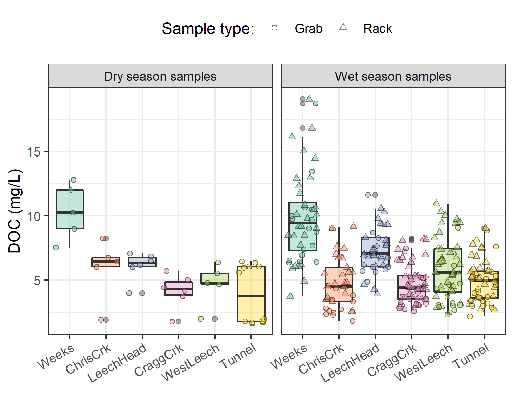
```

Table \@ref(tab:seasonalsamples) 

```{r seasonalsamples}
read_csv("R-outputs_UBC-forWater-MSc_HMc/tables/CH3_seasonal-samples-DOC-summary.csv", col_names = TRUE) %>% 
  knitr::kable(digits = c(0,0,2,2,0,2,2,1), 
               #col.names = c(),
               caption = "*Seasonal comparison of sample DOC results*")
```


#### River response in relation to DOC & NOM

Figure \@ref(fig:stageRelations)

```{r stageRelations, fig.cap = fig_cap}
fig_cap = "\\label{fig:stageRelations} *Relationships between river stage and sample content and character. Data for each variable were normalized (min-max normalization) to clarify relative scales*"

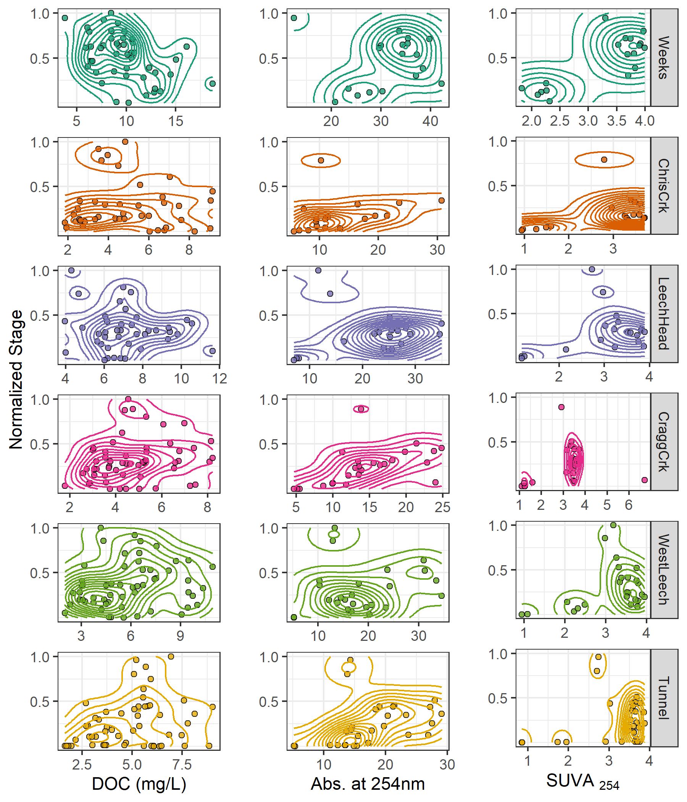
```


#### spatial and temporal variance and synchrony in stage 

Across the LWSA, fluctuations in river stage were temporally synchronized. River responses among the six sites were confirmed to be congruent with high confidence (p-value < 0.001, based on 1050 ranNOMizations) via Kendall's coefficient of concordance (Kendall's W = 0.9721) and Spearman's ranked correlation (ρ = 0.9666).

\  

* _needs work:_ 
* Rates of stream response (times to peak): Table \@ref(tab:stageResponse)

\  

```{r stageResponse}
read_csv("R-outputs_UBC-forWater-MSc_HMc/tables/response_stage-summary.csv", col_names = TRUE) %>% 
  knitr::kable(digits = 1, 
               col.names = c("site", 
                             "shortest time to peak stage (hr)", 
                             "longest time to peak stage (hr)", 
                             "smallest change in stage (cm)", 
                             "largest change in stage (cm)", 
                             "fastest rate of stage change (cm/hr)", 
                             "slowest rate of stage change (cm/hr)"),
               caption = "*Summary of stream response to precipitation events across the LWSA.*")
```

####   Rising stage & NOM dynamics

The wet season was better represented than the dry by sample number and was therefore more interesting in terms of DOC concentration patterns. Additionally, the wet season is more relevant with respect to water supply because that is when flows are great enough to allow diversion for inter-basin transfer. High flows during the wet season also showed increased DOC concentrations relative to low flows; stormflow samples collected on vertical Racks showed higher DOC than Grab samples manually collected across wet seasons (Figure \@ref(fig:subbasinSampletypeBox). 

\  

```{r subbasinSampletypeBox, out.width = "100%", fig.pos="h", fig.cap = fig_cap}
fig_cap = "\\label{fig:subbasinSampletypeBox} *Wet-season dissolved organic carbon concentrations grouped by site and sample collection method, where Grab samples were manually obtained (n = 109) and Rack samples were collected passively on vertical racks fit with siphon sampler bottles (n = 170).*"

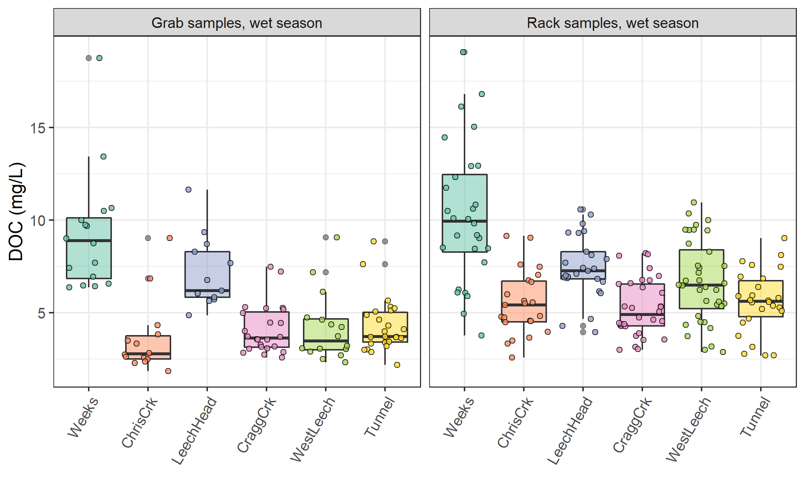
```

\  

A trend in DOC concentration during rising stage can provide information about NOM source and flux dynamics. Increasing DOC with rising stage suggests NOM transport dynamics were driven by hydrologic connectivity to an unlimited supply of source NOM. Alternatively, if DOC concentrations decrease with rising stage it's likely that the NOM source pool was limited (i.e. depletion of terrestrial allochthonous NOM supply)  [@Zarnetske2018]. While not every river response pulse was full sampled across, the vertical racks collected samples at progressively higher stage in each site. Figure \@ref(fig:RisingLimbPlot) shows DOC concentrations in rising limb sample across rain events. Generally, DOC increased with increasing river stage; however, the trend was not linear in each event response.

___Fix___
To get a better idea of stream surge NOM dynamics, well sampled rising limb stream surges were examined... 
* mid wet 2018
Trip 4 // rain event 3 [for sites 1-5] 
Trip 5 // rain event 4 for Tunnel

* earlier 2019
rain events 10 & 11 (maybe)


####   Spatiotemporal synchrony in local extrema: river stage and DOC

Streams responded harmoniously to precipitation across the LWSA, with synchronous changes in stage, but was a similar harmony present for fluctuations in DOC or spectral properties? Aqueous DOC was quantified from discrete river samples, and therefore the temporal synchrony of peaks could not be evaluated in the same manner as stage, which was continuously recorded. However, each river sample was matched to stage and had a corresponding time-stamp, therefore temporal synchrony in DOC could be inferred based on relationships between peak DOC and stage. To determine if local DOC extrema (maxima and minima concentrations) were captured in conjunction with the local extrema of sampled flows (minima and maxima of sampled stage), synchrony tests were run on sample results. For each site, results of samples were grouped by collection period and rain event to identify samples with extreme DOC concentrations as well as samples collected at extreme stage (max/min). Samples corresponding to maxima and minima DOC and stage were compared to determine how often they overlapped (i.e. was the sample with max DOC also the sample collected at the highest stage?). Table \@ref(tab:synchDOCstage) summarizes proportions of common DOC and stage extrema samples, where 1 indicates perfect agreement between samples of extreme DOC and sample-stage, and zero indicates complete asynchrony between DOC and stage highs and lows. 

\  

```{r synchDOCstage}
read_csv("R-outputs_UBC-forWater-MSc_HMc/tables/synchrony_DOC-stage_extrema-simultaneous.csv", col_names = TRUE) %>% 
  knitr::kable(digits = c(0,3,3),
               caption = "*Proportion of samples for which peak DOC was found in the highest sample stage.*")
```

\  

Most samples showed congruence between highs and lows of DOC with stage. West Leech was the only site which had a greater proportion of common maxima compared to minima, all other sites had more frequent occurrence of low DOC occurring at low stage that they did of high DOC occurring at high stage. Overall, each site's samples showed majority, but not absolute, agreement in extremes of DOC-stage relationships. Figure \@ref(fig:extremaplot) shows the extrema samples with stage at each site.

\  

```{r extremaplot, out.width = "100%", fig.pos="h", fig.cap = fig_cap}
fig_cap = "\\label{fig:extremaplot} *Stage and samples collected, highlighting samples with maximum and minimum DOC concentrations for each rain event and collection period. Black vertical lines indicate a subset of samples that were assessed more closely.*"

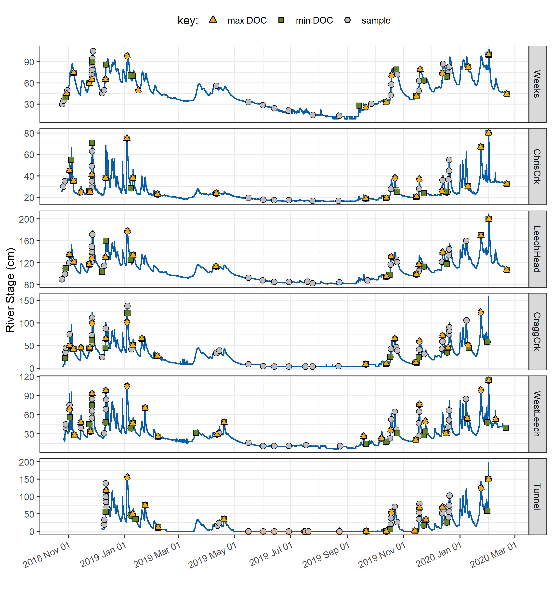
```

\  


__needs work:__ 
* DOC changes in stormflow
* range of DOC in each event: \@ref(tab:DOCResponse) 

\  

```{r DOCResponse}
read_csv("R-outputs_UBC-forWater-MSc_HMc/tables/response_DOC-summary.csv", col_names = TRUE) %>% 
  knitr::kable(digits = 1, 
               col.names = c("site", "lowest DOC in stormflow (mg/L)", "highest DOC in stormflow (mg/L)", 
                             "smallest change in DOC (mg/L)", "largest change in DOC (mg/L)", "smallest difference in DOC during stormflow (%)", "largest difference in DOC during stormflow (%)"),
               caption = "*Summary of DOC changes within stormflow response to precipitation events across the LWSA (samples from wet season only).*")
```

\

To better understand how timing of peak DOC varied among sites during the wet season, a subset of samples was selected for closer analysis (highlighted in Figure \@ref(fig:extremaplot) and expanded in Figure \@ref(fig:subsetExtremaplot)). The subset included samples from rain events 10-12; a subset deemed to be representative of DOC concentrations and rain events across the wet seasons, as there were no significant differences between DOC concentrations or rain events (amount and intensity) for this subset of samples compared to the rest of the study period (Table \@ref(tab:subbsetWilcox)). There were significant differences in UV~254~ absorbance for events 10-12 compared to the rest of the study period, therefore this subset was not considered representative of spectral trends overall and was only examined for DOC trends.

\  

```{r subbsetWilcox}
read_csv("R-outputs_UBC-forWater-MSc_HMc/tables/narrow-subbset_wilcoxon.csv", col_names = TRUE) %>% 
  knitr::kable(digits = c(0,0,4),
               caption = "*p-values from Wilcoxon tests comparing the subset of rain events 10-12 and those samples' DOC results to all other sampled rain events, showing no significant difference between the groups.*")
```

\  

* Rates of stream response (times to peak): Table \@ref(tab:stageResponsesubset)

\  

```{r stageResponsesubset}
read_csv("R-outputs_UBC-forWater-MSc_HMc/tables/response_stage-summary_subset.csv", col_names = TRUE) %>% 
  knitr::kable(digits = 1, 
               col.names = c("site", "max. rain intensity (mm/hr)", "min. rain intensity (mm/hr)", "shortest time to peak stage (hr)", "fastest time to peak stage (hr)", "smallest change in stage (cm)", "largest change in stage (cm)", "fastest time to peak (cm/hr)", "slowest time to peak (cm/hr)"),
               caption = "*Summary of stream response to precipitation events 10-12 across the LWSA.*")
```

\  

* DOC changes in stormflow
* range of DOC in each event: Table \@ref(tab:DOCResponsesubset) 

\  

```{r DOCResponsesubset}
read_csv("R-outputs_UBC-forWater-MSc_HMc/tables/response_DOC-summary_subset.csv", col_names = TRUE) %>% 
  knitr::kable(digits = 1, 
               col.names = c("site", "lowest DOC in stormflow (mg/L)", "highest DOC in stormflow (mg/L)", 
                             "smallest change in DOC (mg/L)", "largest change in DOC (mg/L)", "smallest difference in DOC during stormflow (%)", "largest difference in DOC during stormflow (%)"),
               caption = "*Summary of DOC changes within stormflow response to precipitation events 10-12 across the LWSA.*")
```

\  

```{r subsetExtremaplot, out.width = "100%", fig.pos="h", fig.cap = fig_cap}
fig_cap = "\\label{fig:subsetExtremaplot} *Stage and samples collected for the subset of samples collected over rain events 9-12, highlighting samples with maximum and minimum DOC concentrations for each rain event and collection period.*"

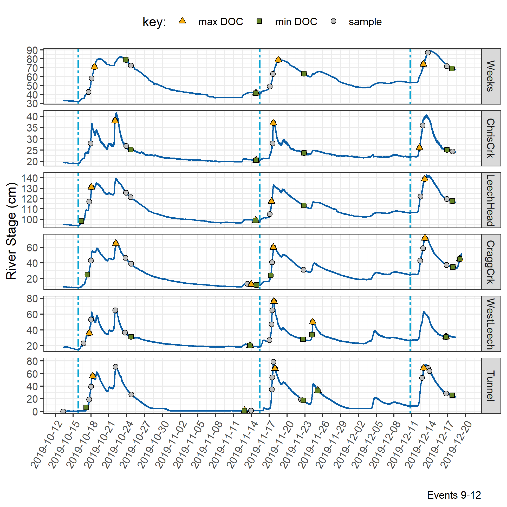
```

\  

#### RF Results

___Note:___ these results are based only on the LWSA monitoring site data, I will update with the full synoptic sites watershed characteristics shortly. 

Dry season data only: (Figure \@ref(fig:dryRF). 

```{r dryRF, fig.cap = fig_cap}
fig_cap = "\\label{fig:dryRF} **"

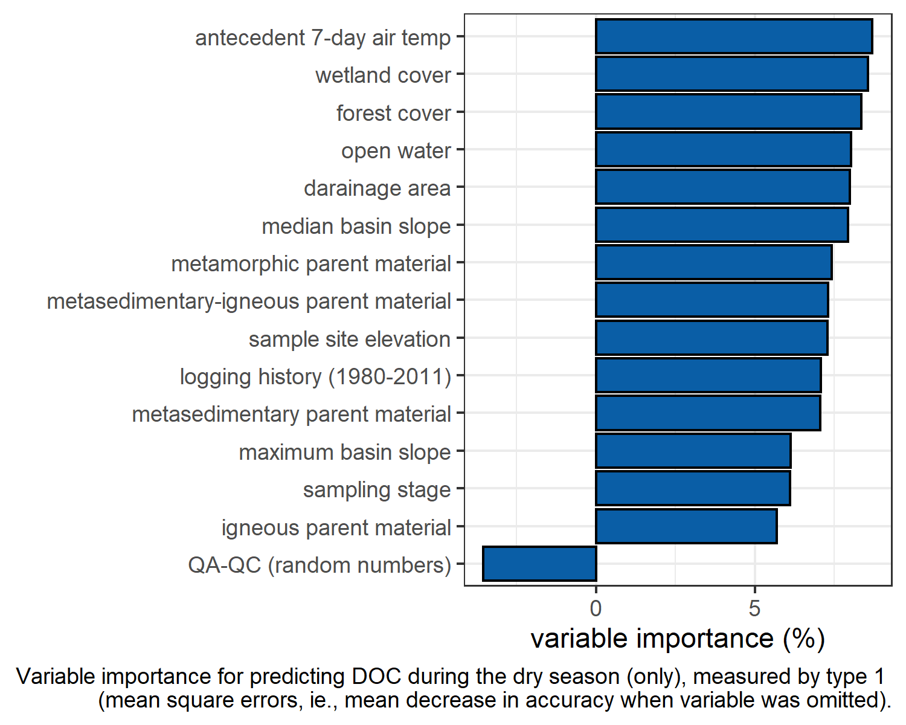
```

Wet season data only: (Figure \@ref(fig:wetRF). 

```{r wetRF, fig.cap = fig_cap}
fig_cap = "\\label{fig:wetRF} *Wet seasons data included in RF (LWSA monitoring sites)*"

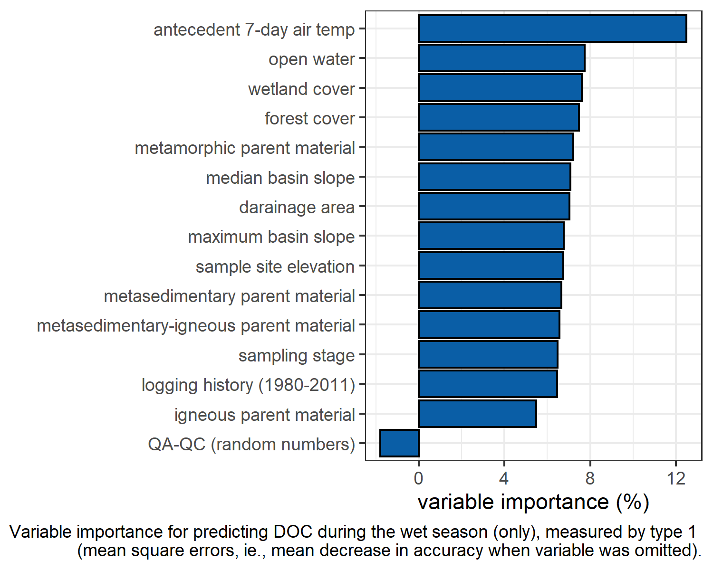
```

RF With all seasons data: (Figure \@ref(fig:allRF). 

```{r allRF, fig.cap = fig_cap}
fig_cap = "\\label{fig:allRF} *All seasons data included in RF (LWSA monitoring sites)*"

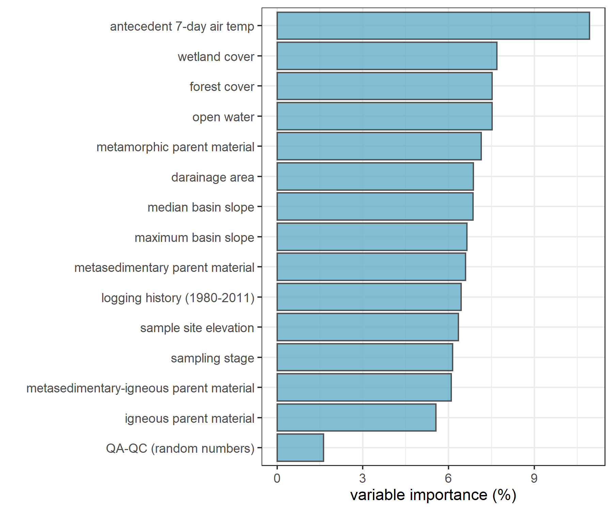
```

\ 


### Discussion


Increasing DOC on the rising limb indicates that source material is not limited and flux is driven by hydrologic connectivity; whereas source limited conditions likely drive NOM dynamics if DOC concentration decreases on the rising limb [@Zarnetske2018]. Analysis of rack samples clarifies the magnitude and direction of water quality changes in response to precipitation relative, which provides information about solute supply and hydrologic connectivity [@Vidon2008; @Abbott2018; @Creed2015; @Zarnetske2018].

* variability among sub-basins versus variability within each sub-basin over time
* timing of peaks and valleys of stage -- at 10 min resolution was there a lag from upstream to downstream?
* source versus transport limitations -- DOC in rising limb
* any hysteretic behaviour? (DOC over time by event)
* was there a relationship between rain event intensity/duration and DOC?
* use RF to determine relative importance of watershed characteristics as DOC predictors
* use RF to in-fill missing NOM absorbance data based on relationship with DOC??? Like Yeonuk did for CH4 flux


 

### Conculsions

* establishing connectivity among nested catchments as a baseline for experimental treatments (future)


Combining methods of vertical sampling racks with standard synoptic grab sampling provided useful time-stamped discrete river samples data that could be adapted and correlated to local rating curves to calculate loads of river material (e.g. nutrients, metals, organics, etc.) exported from monitored catchments. Material transport loads are important for management decisions and comprehensive system understanding. 

future:

* matched sample filling-stage with continuous logger stage could be combined with rating curve to determine mass transport or loading (future)