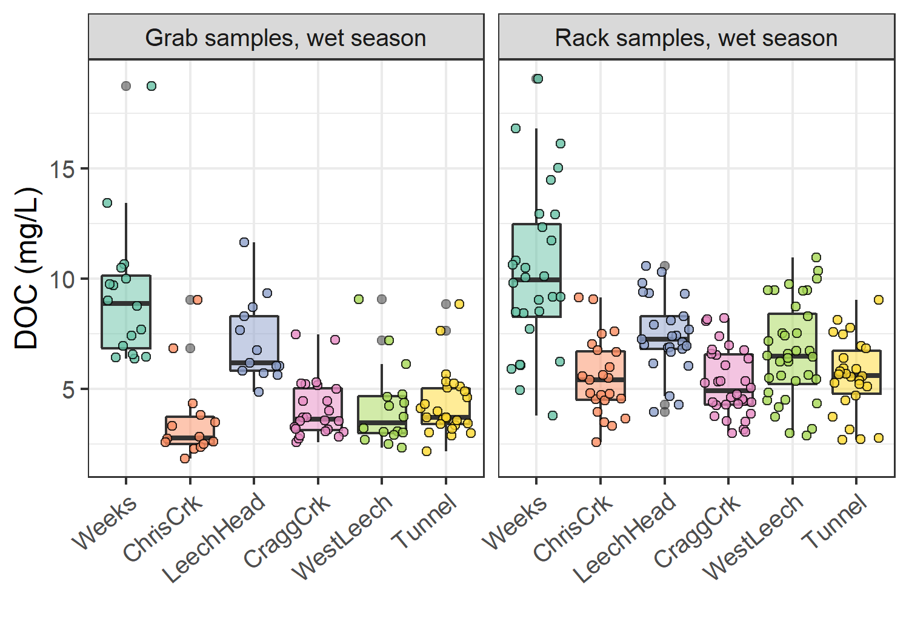
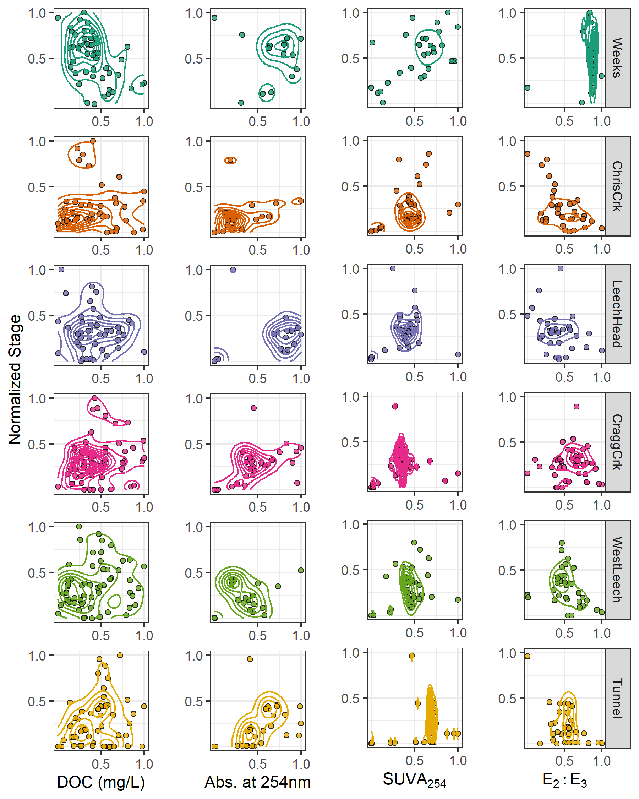

##	Hydrochemcial dynamics: river, DOC & NOM event responses

```{r, include = FALSE, package.startup.message = FALSE}

# load required packages
library(tidyverse)  # keep it tidy
library(readr)      # read in delimited files
library(knitr)      # for nice tables

knitr::opts_chunk$set(warning=FALSE, message=FALSE, echo=FALSE, fig.cap=TRUE)

```


### Introduction

__RQ.2.__   Are hydrological processes the main driver for DOC transport and variation in the LWSA and is there a mechanistic relationship between river stage and DOC or NOM?

__Objective 2:__   Relate water sample results to river stage and report on the relationships between DOC concentrations and NOM character with stage, particularly paying attention to differences between baseflow and storm events.


Additionally, time-stamps of event-based samples were used to inform stage-concentration relationships (Chapter 3). 

***discussion point***
...
The rising limb has been shown to have higher DOC concentration than low flows between storm pulses [@Yang2015; @Raymond2016; @Raymond2010; @Zarnetske2018]. Increasing DOC on the rising limb indicates that source material is not limited and flux is driven by hydrologic connectivity; whereas source limited conditions likely drive DOM dynamics if DOC concentration decreases on the rising limb [@Zarnetske2018]. Analysis of rack samples clarifies the magnitude and direction of water quality changes in response to precipitation relative, which provides information about solute supply and hydrologic connectivity [@Vidon2008; @Abbott2018; @Creed2015; @Zarnetske2018].
...

Additionally, event-based river samples collected near-simultaneously at sites across a watershed can provide insights about relative hydrologic pulse responses across nested catchments [@Abbott2018]....


### Methods


#### Monitoring sites

Six locations across the Leech Water Supply Area (LWSA) were set up as monitoring sites where vertical racks were installed to measure continuous stage and collect water samples as the rivers rose in response to precipitation events. Figure \@ref(fig:megaplot) shows major precipitation events and stream response over the study period as well as the timing and stage of samples collected. 

(Figure \@ref(fig:subbasinMap)).

The sub-basins represent important portions of the Leech River system: two headwater streams (Weeks and Chris Creek, sites 1 & 2), the head of Leech River below the confluence of the two headwater streams (site 3), two mainstem rivers that feed the Leech (Cragg Creek and West Leech, sites 4 & 5). Site 6 was located at the Leech River Tunnel and the drainage area included the entire LWSA.	

\  

```{r subbasinMap, out.width = "50%", fig.pos="h", fig.cap = fig_cap}
fig_cap = "\\label{fig:subbasinMap} *Research sites in the Leech Water Supply Area. Sites are named and numbered, where the number indicates both the sequence of vertical rack installations as well as the relative progression from headwaters to mouth. Each research basin boundary (defined using each sampling site as the drainage outlet) is outlined in black, and the water supply area boundary is delineated in red.*"

knitr::include_graphics("R-inputs_UBC-forWater-MSc_HMc/images/thesis_map_subbasin-sampling_with-numbers.png")
```

\  

#####   Installations 

At each of the six monitoring sites, a vertical sampling rack was installed. These racks collect discrete water samples during the rising limb of stormflow, without employing costly pump-samplers. Each vertical rack also included a water level logger that recorded continuous stage (at ten-minute intervals). Vertical sampling racks achieved advanced synoptic sampling within stormflow by providing synchronized spatial sampling resolution that would otherwise be difficult to achieve (i.e., sampling multiple sites across the watershed at approximately the same time). Simultaneous stormflow sample collection can provide insights about relative hydrologic pulse responses across nested catchments [@Abbott2018]. Vertical racks collected samples during flows that would otherwise be difficult or unsafe to access, and were supplemented with standard grab samples between storm events and during summer baseflow.

\  

The passive sampling bottles employ principles of a siphon design to collect river water as it reaches pre-determined levels on a vertical sampling rack. Siphon sampler bottles were based on a USGS single stage sediment sampler design (US U-59, 1961) which passively collect discrete water samples at a fixed stage on the rising limb of the hydrograph [@Graczyk2000]. The siphon samplers built for this research were 250 mL amber HDPE widemouth bottles with augmented screw caps. The caps were fit with two 1/4" (OD) stainless steel tubes, one longer than the other, both with a 180$^\circ$ bend at the top end.

\  

Each rack included a central stilling well (3.81cm (1.5") PCV pipe with 1.27 cm (1/2") holes along the length) with a measuring tape affixed to the front. Inside the stilling well was an Odyssey Capacitance Water Level Logger (Dataflow Systems Ltd., New Zealand); and on either side of the central stilling well was a slotted offset angle bar onto which hose clamps held sample bottles fit with custom siphon lids. Each rack also included sensors (HOBO TidbiT v2 Temperature Data Logger, Onset, USA) that recorded air and water temperatures (Figure \@ref(fig:verticalRack)). By combining the height at which each siphon bottle filled with observed stage (stilling-well measuring tape) and level-logger data, the date and time for collection of each rising-stage sample was determined. 

\  

```{r verticalRackCH3, out.width = "30%", fig.pos="h", fig.cap = fig_cap}
fig_cap = "\\label{fig:verticalRack} *Vertical sampling rack and siphon sampler bottle, illustrative of installations at six sites across the LWSA (shown here is Chris Creek (site 2).*"

knitr::include_graphics("R-inputs_UBC-forWater-MSc_HMc/images/Rack_diagram_full.png")
```

\  

These vertical racks collected whole water samples on the rising limb of the hydrograph. The rising limb has been shown to have higher DOC concentration than low flows between storm pulses [@Yang2015; @Raymond2016; @Raymond2010; @Zarnetske2018]. Increasing DOC on the rising limb indicates that source material is not limited and flux is driven by hydrologic connectivity; whereas source limited conditions likely drive DOM dynamics if DOC concentration decreases on the rising limb [@Zarnetske2018]. Analysis of rack samples clarifies the magnitude and direction of water quality changes in response to precipitation relative, which provides information about solute supply and hydrologic connectivity [@Vidon2008; @Abbott2018; @Creed2015; @Zarnetske2018].


### Results

####   Rain events 

LWSA mean FWx precipitation data were used to define rain events using the USGS *Rainmaker* package in R ('RMevents' function). During the study period there were 151 rain events, and 18 that were classified as major events. Major rain events were defined by precipitation accumulating to 50mm or more, where the events were separated from each other by a period of 14 hours or longer. Table \@ref(tab:EventsTable3) summarizes the eighteen major rain events that occurred during the study period (2018-10-23 to 2020-02-20). 

\  

```{r EventsTable3}
read_csv("R-outputs_UBC-forWater-MSc_HMc/tables/Wx_Events.csv") %>% 
  knitr::kable(digits = c(0,0,0,1,1,1),
               caption = "*Rain events defined by a threshold of 50mm with 14-hour inter-event period*")
```

\  

An intense (category 3-4) atmospheric river event hit the LWSA January 29-31 (Event 17) and generated incredible flows across the Leech watershed (and across Vancouver Island and most of the south coast of BC). Streamflow at CraggCrk (site 4) and the Tunnel (site 6) over-topped the vertical racks (greater than 2m tall) and ripped the level-loggers out of their stilling wells [^2]. Luckily, the level-loggers were found downstream in February and (after drying the circuit boards) the data were successfully retrieved from both Odyssey loggers. Figure \@ref(fig:EventsPlot) shows stream level at each monitored sub-basin along with events and samples collected. Eight of these events were captured in the 2019 water year (2018-2019 wet season), the other ten in the 2020 water year. For each calender year in the study period, major rain events' minimum and maximum values of depth, duration and intensity were identified and are summarized in Table \@ref(tab:MinMaxEvents).   

[^2]:   Following major event 17 (Jan 29-31), changes to the stream-bed morphology were evident at LeechHead (site 3) in the form of gravel and cobble deposition, there was evidence of substantial coarse woody debris transport at ChrisCrk (site 2), and destruction to hydrologic monitoring equipment at the Leech Tunnel.

\  

```{r EventsPlot, out.width = "100%", fig.pos="h", fig.cap = fig_cap}
fig_cap = "\\label{fig:EventsPlot}*Plot of Precipitation, rain events (as vertical lines), stream rise and sample collection at six sites across the LWSA.*" 

knitr::include_graphics("R-outputs_UBC-forWater-MSc_HMc/figures/Wx-stage-subbasins_megaplot-noTemp.png")
```

\  
 
```{r megaplot, out.width = "100%", fig.pos="h", fig.cap = fig_cap}
fig_cap = "\\label{fig:megaplot} *Rain events, stream response and sample collection across the Leech Water Supply Area. Dashed vertical lines indicate the start of rain events and points indicate the timing and stage of river samples collected.*"

knitr::include_graphics("R-outputs_UBC-forWater-MSc_HMc/figures/Wx-stage-subbasins_megaplot_sampletype.png")
```

\  

```{r MinMaxEvents}
read_csv("R-outputs_UBC-forWater-MSc_HMc/tables/Wx_Events-annual_min-max.csv") %>% 
  knitr::kable(digits = c(0,1,1,1,1,2,1),
               caption = "*Minimum and maximum rain event values *")
```

\  

####    River response: spatial and temporal variance and synchrony in stage 

Across the LWSA, fluctuations in river stage were temporally synchronized. River responses among the six sites were confirmed to be congruent with high confidence (p-value < 0.001, based on 1050 randomizations) via Kendall's coefficient of concordance (Kendall's W = 0.9721) and Spearman's ranked correlation (ρ = 0.9666).

\  

* _needs work:_ 
* Rates of stream response (times to peak): \@ref(tab:stageResponse)

\  

```{r stageResponse}
read_csv("R-outputs_UBC-forWater-MSc_HMc/tables/response_stage-summary.csv", col_names = TRUE) %>% 
  knitr::kable(digits = 1, 
               col.names = c("site", "shortest time to peak stage (hr)", "fastest time to peak stage (hr)", "smallest change in stage (cm)", "largest change in stage (cm)", "fastest time to peak (cm/hr)", "slowest time to peak (cm/hr)"),
               caption = "*Summary of stream response to precipitation events across the LWSA.*")
```

####   Rising stage & DOM dynamics

The wet season was better represented than the dry by sample number and was therefore more interesting in terms of DOC concentration patterns. Additionally, the wet season is more relevant with respect to water supply because that is when flows are great enough to allow diversion for inter-basin transfer. High flows during the wet season also showed increased DOC concentrations relative to low flows; stormflow samples collected on vertical Racks showed higher DOC than Grab samples manually collected across wet seasons (Figure \@ref(fig:subbasinSampletypeBox). 

\  

```{r subbasinSampletypeBox, out.width = "100%", fig.pos="h", fig.cap = fig_cap}
fig_cap = "\\label{fig:subbasinSampletypeBox} *Wet-season dissolved organic carbon concentrations grouped by site and sample collection method, where Grab samples were manually obtained (n = 109) and Rack samples were collected passively on vertical racks fit with siphon sampler bottles (n = 170).*"


```

\  

A trend in DOC concentration during rising stage can provide information about NOM source and flux dynamics. Increasing DOC with rising stage suggests NOM transport dynamics were driven by hydrologic connectivity to an unlimited supply of source NOM. Alternatively, if DOC concentrations decrease with rising stage it's likely that the NOM source pool was limited (i.e., depletion of terrestrial allochthonous NOM supply)  [@Zarnetske2018]. While not every river response pulse was full sampled across, the vertical racks collected samples at progressively higher stage in each site. Figure \@ref(fig:RisingLimbPlot) shows DOC concentrations in rising limb sample across rain events. Generally, DOC increased with increasing river stage; however, the trend was not linear in each event response.

****************
To get a better idea of stream surge DOM dynamics, well sampled rising limb stream surges were examined... 
* mid wet 2018
Trip 4 // rain event 3 [for sites 1-5] 
Trip 5 // rain event 4 for Tunnel

* earlier 2019
rain events 10 & 11 (maybe)
****************
\  

```{r RisingLimbPlot, out.width = "100%", fig.pos="h", fig.cap = fig_cap}
fig_cap = "\\label{fig:RisingLimbPlot} *DOC concentration trends in rising limb samples categorized by rain events*"

knitr::include_graphics("R-outputs_UBC-forWater-MSc_HMc/figures/DOC_rack-trends.png")
```

\  

####   Spatiotemporal synchrony in local extrema: river stage and DOC

Streams responded harmoniously to precipitation across the LWSA, with synchronous changes in stage, but was a similar harmony present for fluctuations in DOC or spectral properties? Aqueous DOC was quantified from discrete river samples, and therefore the temporal synchrony of peaks could not be evaluated in the same manner as stage, which was continuously recorded. However, each river sample was matched to stage and had a corresponding time-stamp, therefore temporal synchrony in DOC could be inferred based on relationships between peak DOC and stage. To determine if local DOC extrema (maxima and minima concentrations) were captured in conjunction with the local extrema of sampled flows (minima and maxima of sampled stage), synchrony tests were run on sample results. For each site, results of samples were grouped by collection period and rain event to identify samples with extreme DOC concentrations as well as samples collected at extreme stage (max/min). Samples corresponding to maxima and minima DOC and stage were compared to determine how often they overlapped (i.e. was the sample with max DOC also the sample collected at the highest stage?). Table \@ref(tab:synchDOCstage) summarizes proportions of common DOC and stage extrema samples, where 1 indicates perfect agreement between samples of extreme DOC and sample-stage, and zero indicates complete asynchrony between DOC and stage highs and lows. 

\  

```{r synchDOCstage}
read_csv("R-outputs_UBC-forWater-MSc_HMc/tables/synchrony_DOC-stage_extrema-simultaneous.csv", col_names = TRUE) %>% 
  knitr::kable(digits = c(0,3,3),
               caption = "*Proportion of samples for which peak DOC was found in the highest sample stage.*")
```

\  

The majority of samples showed congruence between highs and lows of DOC with stage. West Leech was the only site which had a greater proportion of common maxima compared to minima, all other sites had more frequent occurrence of low DOC occurring at low stage that they did of high DOC occurring at high stage. Overall, each sites samples showed majority, but not absolute, agreement in extremes of DOC-stage relationships. Figure \@ref(fig:extremaplot) shows the extrema samples with stage at each site.

\  

```{r extremaplot, out.width = "100%", fig.pos="h", fig.cap = fig_cap}
fig_cap = "\\label{fig:extremaplot} *Stage and samples collected, highlighting samples with maximum and minimum DOC concentrations for each rain event and collection period. Black vertical lines indicate a subset of samples that were assessed more closely.*"


```

\  


* _needs work:_ 
* DOC changes in stormflow
* range of DOC in each event: \@ref(tab:DOCResponse) 

\  

```{r DOCResponse}
read_csv("R-outputs_UBC-forWater-MSc_HMc/tables/response_DOC-summary.csv", col_names = TRUE) %>% 
  knitr::kable(digits = 1, 
               col.names = c("site", "lowest DOC in stormflow (mg/L)", "highest DOC in stormflow (mg/L)", 
                             "smallest change in DOC (mg/L)", "largest change in DOC (mg/L)", "smallest difference in DOC during stormflow (%)", "largest difference in DOC during stormflow (%)"),
               caption = "*Summary of DOC changes within stormflow response to precipitation events across the LWSA (samples from wet season only).*")
```

\

To better understand how timing of peak DOC varied among sites during the wet season, a subset of samples was selected for closer analysis (highlighted in Figure \@ref(fig:extremaplot) and expanded in Figure \@ref(fig:subsetExtremaplot)). The subset included samples from rain events 10-12; a subset deemed to be representative of DOC concentrations and rain events across the wet seasons, as there were no significant differences between DOC concentrations or rain events (amount and intensity) for this subset of samples compared to the rest of the study period (Table \@ref(tab:subbsetWilcox)). There were significant differences in UV~254~ absorbance for events 10-12 compared to the rest of the study period, therefore this subset was not considered representative of spectral trends overall and was only examined for DOC trends.

\  

```{r subbsetWilcox}
read_csv("R-outputs_UBC-forWater-MSc_HMc/tables/narrow-subbset_wilcoxon.csv", col_names = TRUE) %>% 
  knitr::kable(digits = c(0,0,4),
               caption = "*p-values from Wilcoxon tests comparing the subset of rain events 10-12 and those samples' DOC results to all other sampled rain events, showing no significant difference between the groups.*")
```

\  

* Rates of stream response (times to peak): \@ref(tab:stageResponsesubset)

\  

```{r stageResponsesubset}
read_csv("R-outputs_UBC-forWater-MSc_HMc/tables/response_stage-summary_subset.csv", col_names = TRUE) %>% 
  knitr::kable(digits = 1, 
               col.names = c("site", "max. rain intensity (mm/hr)", "min. rain intensity (mm/hr)", "shortest time to peak stage (hr)", "fastest time to peak stage (hr)", "smallest change in stage (cm)", "largest change in stage (cm)", "fastest time to peak (cm/hr)", "slowest time to peak (cm/hr)"),
               caption = "*Summary of stream response to precipitation events 10-12 across the LWSA.*")
```

\  

* DOC changes in stormflow
* range of DOC in each event: \@ref(tab:DOCResponsesubset) 

\  

```{r DOCResponsesubset}
read_csv("R-outputs_UBC-forWater-MSc_HMc/tables/response_DOC-summary_subset.csv", col_names = TRUE) %>% 
  knitr::kable(digits = 1, 
               col.names = c("site", "lowest DOC in stormflow (mg/L)", "highest DOC in stormflow (mg/L)", 
                             "smallest change in DOC (mg/L)", "largest change in DOC (mg/L)", "smallest difference in DOC during stormflow (%)", "largest difference in DOC during stormflow (%)"),
               caption = "*Summary of DOC changes within stormflow response to precipitation events 10-12 across the LWSA.*")
```

\  

```{r subsetExtremaplot, out.width = "100%", fig.pos="h", fig.cap = fig_cap}
fig_cap = "\\label{fig:subsetExtremaplot} *Stage and samples collected for the subset of samples collected over rain events 9-12, highlighting samples with maximum and minimum DOC concentrations for each rain event and collection period.*"

knitr::include_graphics("R-outputs_UBC-forWater-MSc_HMc/figures/narrow_events_9-12_peakDOC-stage.png")
```

\  

* density plots of stage with DOC, UV~254~ and SUVA~254 for each site: \@ref(fig:stageDOCdensityscatter) 

```{r stageDOCdensityscatter, out.width = "100%", fig.pos="h", fig.cap = fig_cap}
fig_cap = "\\label{fig:stageDOCdensityscatter} *Two dimensional density distributions of normalized stage in relation to DOC concentration and DOM molecular character parameters.*"


```


### Discussion

### Conculsion