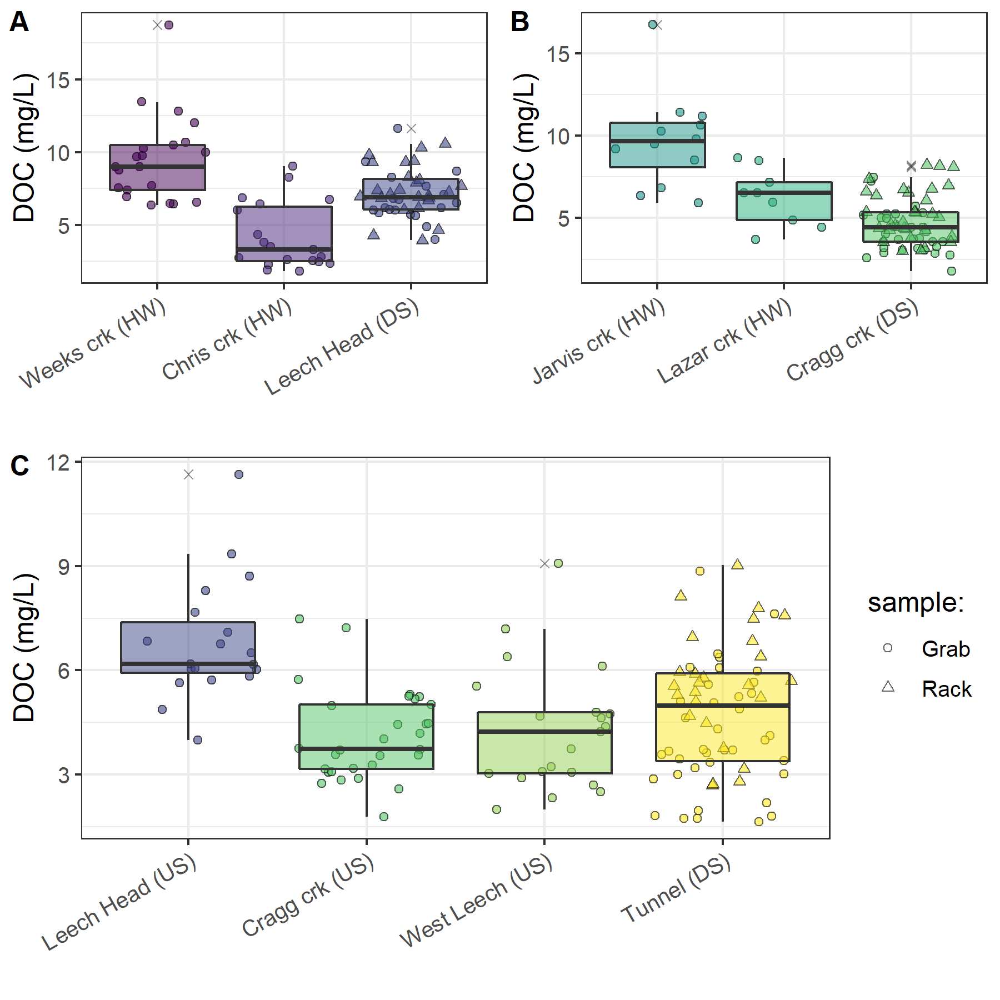
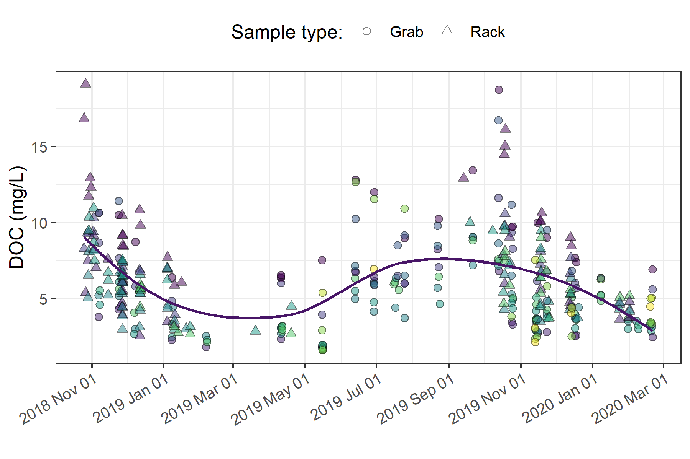
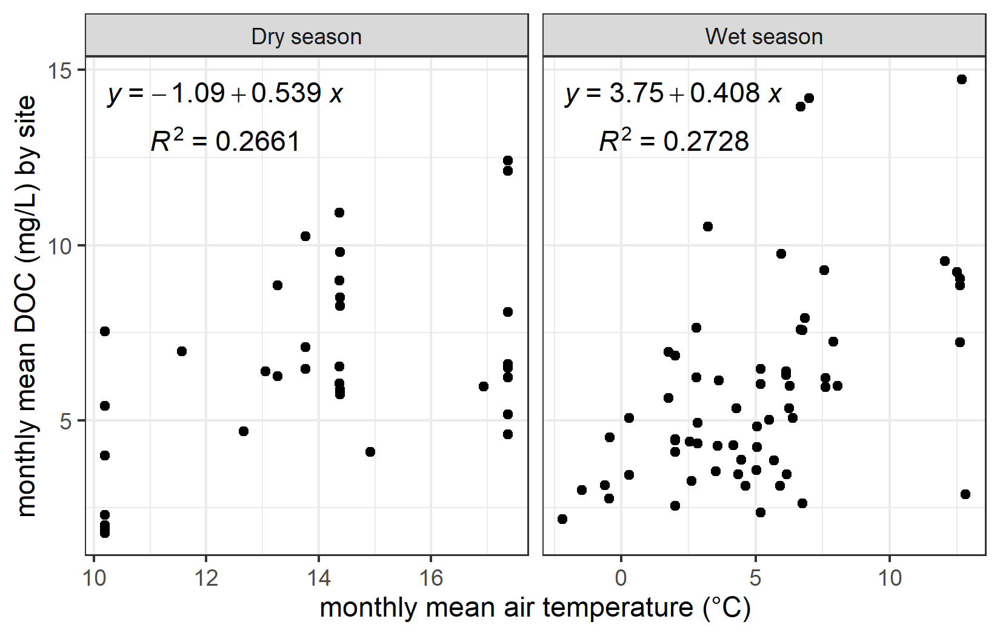
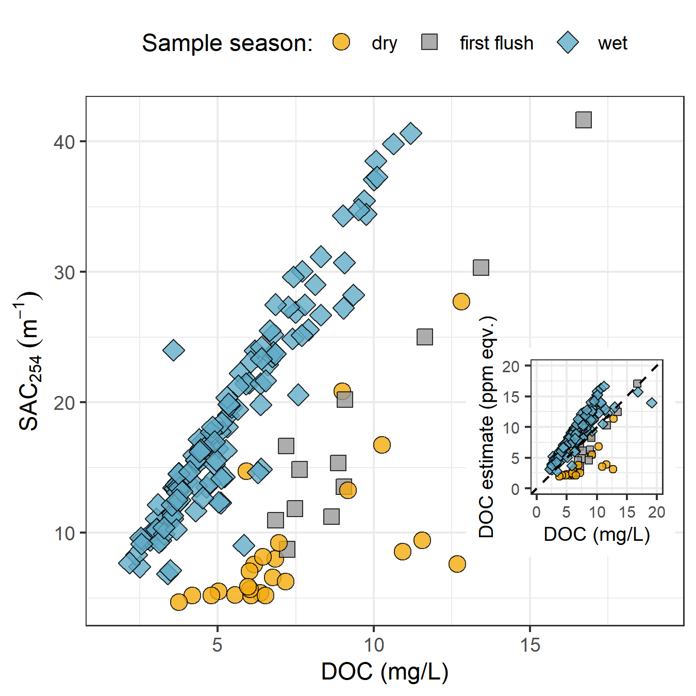
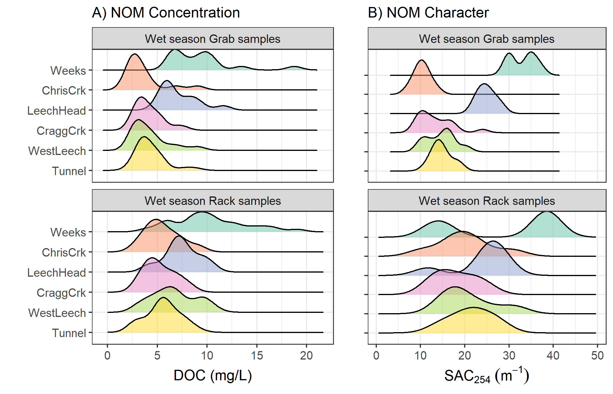

##	Spatial and Temporal Patterns in NOM Quantity and Quality Across the Greater Victoria Water Supply Areas

```{r, include = FALSE, package.startup.message = FALSE}

# load required packages
library(tidyverse)  # keep it tidy
library(readr)      # read in delimited files
library(knitr)      # for nice tables

knitr::opts_chunk$set(warning=FALSE, message=FALSE, echo=FALSE, fig.cap=TRUE)

```

\  

### Synopsis 

The methods defined in Chapter 2 were used to collect and analyze surface water samples across the twelve Greater Victoria water supply area sites (GVWSA, refer to Figure \@ref(fig:sampleSitesMap) for map). The objective was to describe spatial and temporal patterns and variation of natural organic matter (NOM) concentrations (as dissolved organic carbon, DOC) and spectral character (SAC~254~ and E~2~:E~3~). Additionally, sampling results were interpreted with the goal of clarifying the influence of seasonality on quantity and quality of aqueous NOM.     

\  

### Methods

All samples were collected by methods described in Chapter 2, and all data were flagged and filtered based on quality assurance described therein. Here, NOM quantity was assessed based on concentrations of dissolved organic carbon (DOC) and NOM quality was indicated by SAC~254~ (reactivity) and E~2~:E~3~ (molecular size & aromaticity). 

\  

#### Spatial & temporal patterns

Synoptic sample results were evaluated for spatial patterns by comparing low- to high-order streams, between the Leech and Sooke portions of the GVWSA, and by sampling methods at upstream and downstream sites. To assess temporal patterns, results were examined over the full study period (Oct 2018 to Feb 2020), and grouped by wet and dry seasons. For shorter scale temporal pattern assessment, rising limb event-based Rack samples from the six monitoring sites in the Leech WSA were compared to inter-event sampling results (i.e. standard Grab samples). 

\  

Water quality monitoring is generally completed as synoptic sampling, but perhaps monitoring programs could be simplified by installing a Vertical Rack downstream of the confluence of nested catchments. A method evaluation was completed to assess whether the combination of Rack and Grab sampling below a confluence captured the same range in DOC as Grab sampling at multiple upstream sites. Headwater sub-basins of Leech River and Cragg Creek, and three nested catchments above the Leech River Tunnel were examined. The Leech Tunnel is the effective outlet of the Leech WSA, where runoff from each nested catchment is integrated. From a headwater's perspective, runoff from the sub-basins of Weeks Creek and Chris Creek is integrated at the Leech-head site; and runoff from Jarvis and Lazar Creek sub-basins is integrated at the Cragg Creek site (Figure \@ref(fig:sampleSitesMap)). At each of these three site groupings, results from upstream Grab samples were compared to downstream Rack and Grab sample results combined. Results were compared using Levene's test for homoscedasticity (homogeneity of variance). 

\  

Synoptic sampling results were evaluated over time to identify patterns in NOM quantity and quality. And to detect possible changes in NOM character, the relationship between DOC and SAC~254~ was explored in context of seasons.  

\  

Because the most heavily sampled sites were those equipped with Vertical Racks, which collected samples only during the wet season, sample results from the six monitoring sites were isolated. Wet season NOM quantity and quality results were evaluated to compare event-based rising-limb (Rack) samples to non-rising limb (Grab) samples.

\  

### Results

From October 2018 to February 2020, across the GVWSA 426 river samples were collected and analyzed for DOC, and 318 of those samples were analyzed by UV-Vis for NOM character assessment (Table \@ref(tab:samplecount)). Fewer samples were analyzed for UV-Vis properties than for DOC concentration due to method evolution at the start of the project and constraints in instrument availability. Of the samples collected and analyzed, DOC data were reduced by 9.2% (to 387 samples) during hold-time quality control checks (described in Chapter 2). UV-Vis data were reduced by 19.5% (to 256 samples) through hold-time quality control (9% reduction in UV-Vis data) and, unfortunately, an additional 10.5% was lost during instrument maintenance. Analysis of calibration verification standards resulted in an average analytical accuracy of 10% (n = 20).  

\  

```{r samplecount}
read_csv("R-outputs_UBC-forWater-MSc_HMc/tables/summary_samples-count.csv", col_names = TRUE) %>% 
  knitr::kable(caption = "Summary of samples collected, and number included in data analysis following quality assurance filtering based on sample hold-times, turbidity and algae") 
```

\  

Mean DOC across the GVWSA was 6.1 mg/L (± 43%), which included the rising limb samples collected in the Leech WSA. This average concentration was similar to Malcolm Knapp Research Forest, near Maple Ridge on the lower mainland (near Vancouver, BC), where a forested basin (0.97 km^2^) had a mean baseflow DOC concentration of approximately 4.5 mg/L with ~2 mg/L increase during events [@Mistick2019]. 

\  

#### Spatial patterns in NOM quantity and quality  

From 366 quality-controlled river water samples collected over 16 months, DOC ranged from 1.6 to 19.1 mg/L (5.7 mg/L median) with mean DOC of 6.1 ± 2.9 mg/L overall. The relative standard deviation (RSD = std.dev/mean) for DOC in each of the synoptically sampled sites was at least 24% and at most 71%.

\  

The headwaters sites of Weeks creek (11.52 km^2^ sub-basin) and Jarvis creek (1.51 km^2^ sub-basin) had the highest DOC concentrations of the twelve sampling sites (means of 9.9 mg/L (n=49) and 9.7 mg/L (n=12), respectively). The lowest DOC concentrations were recorded at the sampling sites of the Rithet Creek sub-basin (11.12 km^2^) and the Leech Tunnel sub-basin (95.3 km^2^) and their means (5.4 mg/L (n=13) and 4.8 mg/L (n=64), respectively) were not unlike other streams of 3rd order or above (overall average 5.18 mg/L). The greatest range in DOC concentrations was measured at the Rithet Creek site which had a relative standard deviation (RSD) of 71%. The site with the second highest DOC range was the West Leech sub-basin (20.85 km^2^) with mean DOC of 5.8 ± 2.4 mg/L (41% RSD). Between these two sites with the highest DOC variance, the West Leech (a monitoring site) was more heavily sampled (n=57) than Rithet (n=13), which was a synoptic sampling site alone (Table \@ref(tab:synopticDOCdata)).  

\  

```{r synopticDOCdata}
read_csv("R-outputs_UBC-forWater-MSc_HMc/tables/Ch3_DOC-Synoptic-summary.csv", col_names = TRUE) %>% 
  knitr::kable(digits = c(0, 0, 0, 1, 1, 0, 2, 1, 1),
               caption = "Dissolved organic carbon concentrations (DOC) across twelve synoptically sampled sites in the Greater Victoria Water Supply Area",
               col.names = c("Site", "Description", "n", 
                             "Mean DOC (mg/L)", "sd (±)", "Relative sd (± %)", 
                             "Min. DOC (mg/L)", "Median DOC (mg/L)", "Max. DOC (mg/L)"))

``` 

\  

Mean DOC concentrations were similar between the Sooke WSA main tributaries to Sooke Reservoir: Judge Creek (5.7 ± 1.1 mg/L, n=6) and Rithet Creek (5.4 ± 3.9 mg/L, n = 13). Though these three sites were sampled over the same span of time, the number of samples collected at the Tunnel (n=64) was much greater due to less intense focus on the Sooke WSA and Vertical Rack sampling at the Leech Tunnel. Therefore, only overlapping sample dates were evaluated between these three sites to facilitate a preliminary WSA comparison between Sooke WSA main tributaries and the future supplemental supply (Table \@ref(tab:TunRitJud)). Mean DOC was similar between Rithet Creek (3.2 ± 1.4 mg/L, n = 8) and the Leech Tunnel (3.7 ± 1.1 mg/L, n = 9), but higher at Judge Creek (5.7 ± 1.1 mg/L, n = 6).

\  

```{r TunRitJud}
read_csv("R-outputs_UBC-forWater-MSc_HMc/tables/Ch3_DOC-Synoptic-summary_Tunnel-Rithet-Judge.csv", col_names = TRUE) %>% 
  knitr::kable(digits = c(0, 0, 0, 1, 1, 0, 2, 1, 1),
               caption = "Comparing dissolved organic carbon concentrations (DOC) among synoptic grab samples collected on the same day at three sites in the Greater Victoria Water Supply Area: two main tributarites to Sooke Reservoir and the Leech River at the Tunnel",
               col.names = c("Site", "Description", "n", 
                             "Mean DOC (mg/L)", "sd (±)", "Relative sd (± %)", 
                             "Min. DOC (mg/L)", "Median DOC (mg/L)", "Max. DOC (mg/L)"))

```

\  

Spatially, DOC generally decreased from low-order headwater streams to higher-order downstream sites (Figure \@ref(fig:synopticBox)). Like DOC concentration, there was an overall reduction in aromaticity, reactivity, and molecular size of NOM from upstream to downstream sites (Table \@ref(tab:synopticNOMdata), Figure \@ref(fig:synopticBox)). The greatest diversity in NOM reactivity, measured by SAC~254~, were recorded in headwater samples from Chris Creek (50% RSD), Jarvis Creek (47% RSD) and Lazar Creek (45% RSD). The site with the greatest average reactivity, aromaticity and molecular weight NOM was Weeks Creek (mean SAC~254~ 30.3 m^-1^, mean E~2~:E~3~ 4.3 ± 0.2).

\  

The lowest absolute measurement for NOM aromaticity, molecular size and reactivity occurred at the Cragg Creek site (maximum E~2~:E~3~ of 5.03, minimum SAC~254~ 4.69 m^-1^). Cragg Creek also had among the lowest mean aromaticity and molecular weight NOM (E~2~:E~3~ of 4.59 ± 0.22), though it was very similar to Judge Creek (E~2~:E~3~ of 4.59 ± 0.05). Unlike Cragg Creek's low aromaticity and molecular weight NOM, it's headwater sites (Jarvis and Lazar) had samples with highly aromatic and reactive NOM character. Jarvis Creek had the most reactive NOM sample (max SAC~254~ 41.7 m^-1^) and the other headwater creek in Cragg basin, Lazar Creek, had one of the most aromatic samples of all (lowest recorded E~2~:E~3~, 3.77). Lazar Creek sub-basin had the greatest proportion of wetlands (12% by area), and had the greatest range in NOM aromaticity and molecular size (E~2~:E~3~ values with 9% RSD); despite having one of the most aromatic samples of all, Lazar Creek also had the lowest average aromatic NOM (Table \@ref(tab:synopticNOMdata), Figure \@ref(fig:synopticBox)). Algae blooms were observed in the dry-season and early wet season (Appendix A2) in Jarvis Creek, Lazar Creek and Cragg Creek, as well as other small streams draining the east side of Survey Mountain (the ridge separating Leech River headwater sub-basins from Cragg Creek headwater sub-basins).  

\  

```{r synopticNOMdata}
read_csv("R-outputs_UBC-forWater-MSc_HMc/tables/Ch3_NOM-Synoptic-summary.csv", col_names = TRUE) %>% 
  knitr::kable(digits = c(0, 0, 0, 1, 1, 0, 2, 2, 2, 2, 0, 2, 2), 
               caption = "Spectral properties of natural organic matter (NOM) character across twelve synoptically sampled sites in the Greater Victoria Water Supply Area",
               col.names = c("Site", "Description", "Count", 
                             "SAC~254~ Mean (m^-1^)", "stdev (±)", "RSD (± %)",
                             "SAC~254~ Min. (m^-1^)", "SAC~254~ Max. (m^-1^)",
                             "E~2~E~3~ Mean (unitless)", "stdev (±)", "RSD (± %)",
                             "E~2~E~3~ Min.", "E~2~E~3~ Max."))
``` 

\  

```{r synopticBox, fig.cap = fig_cap}

fig_cap = "\\label{fig:synopticBox} Synoptic sampling results of dissolved organic carbon (DOC) concentrations, SAC~254~ and E~2~:E~3~ from 12 sites (arranged left to right from upstream to downstream). Samples were collected from Oct 2018 to Feb 2020. Symbol type indicates samples were collected by siphon samplers on Vertical Racks (triangle) or synoptic Grab sample (circle), outliers are indicated with an 'x'."

knitr::include_graphics("R-outputs_UBC-forWater-MSc_HMc/figures/Ch3_boxplot_allParams-allSites-allSamples.png")
```

\ 

##### Sampling for variance: method evaluation 

Below the confluence of headwaters sites, the combination of Rack and Grab sampling did not capture the ranges of DOC observed in upstream Grab samples alone. Leech-head, below the confluence of Weeks and Chris Creek, collected DOC concentrations that were close to the average of the two headwaters (Figure \@ref(fig:abcDOCbox), plot A); the variance obtained by combining Rack and Grab samples downstream was not the same as upstream Grab sampling (Levene's test for homoscedasticity p-value = 3.8 x 10^-5^). Similarly, Rack and Grab samples collected at Cragg Creek did not cover the same DOC variance as Grab sampling at the headwaters Jarvis and Lazar Creek (Levene's p-value 0.0011). Unlike Leech-head, which had near-average DOC concentrations relative to its two headwaters, samples collected at Cragg Creek had lower DOC concentrations than either of its headwater sites (Figure \@ref(fig:abcDOCbox), plot B). The differences between these two headwater sets can be attributed to different reach lengths between headwaters' confluence and the downstream monitoring sites; where Leech-head was very close to the headwaters' confluence and Cragg Creek was considerably further from its headwaters' sampling locations.

\  

The combination of Vertical Rack and Grab sampling at the Leech Tunnel captured the same variance in DOC that was observed in standard Grab samples at three upstream sites: Leech-head, Cragg Creek, West Leech (Figure \@ref(fig:abcDOCbox), plot C). Levene's test for homoscedasticity confirmed that there was no difference in DOC variance at the downstream Rack and Grab combination compared to Grab-sampling-only at upstream sub-basins (p-value 0.165). Similar patterns were seen for SAC~254~ but not E~2~:E~3~ (Appendix D).  

\  

```{r abcDOCbox, fig.cap = fig_cap}
fig_cap = "\\label{fig:abcDOCbox}  Comparison of dissolved organic carbon concentrations collected by Grab sampling at upstream sites compared to results obtained from both Vertical Rack and Grab sampling below their confluence(s). Plots A and B show Grab samples from headwater (HW) sites compared to Rack & Grab at downstream (DS) monitoring sites. Plot C shows DOC from Grab samples collected at upstream sites (US) compared to Rack & Grab at the mainstem monitoring site."


```

\  

These results indicate that well-represented water quality monitoring for the Leech WSA could be achieved by implementing event-based Vertical Rack sampling combined with standard Grab sampling at the future point of diversion. In the headwaters, however, Rack sampling combined with Grab sampling at 4th order streams did not capture the DOC variance observed upstream in 3rd order headwater stream Grab samples; likely due to greater NOM variability at headwater streams. 

\ 

#### Temporal patterns & seasonal changes

From Oct 2018 to Feb 2020, DOC concentrations followed similar patterns across the synoptic sampling sites (Figure \@ref(fig:DOCloessAll)). DOC was highest early in the wet season and progressively decreased through the fall and winter, reaching minimum concentrations at the end of the wet season (in the spring), and progressively increased over the dry season (summer). These patterns appear as a nearly sinusoidal trend in DOC over the sampling seasons (Figure \@ref(fig:DOCloessAll)).

\  

```{r DOCloessAll, fig.cap = fig_cap}
fig_cap = "\\label{fig:DOCloessAll} Dissolved organic carbon concentrations over sixteen months (Oct 2018 - Feb 2020) at twelve sites across the Greater Victoria Water Supply Area. Trend line shows locally weighted smoothing (loess method, local polynomial regression). Sampling methods are differentiation by point shape, and different colours indicate different sites."


```

\  

There were few data points from mid-February through March 2019 (when snow limited field access); however, DOC concentrations were decreasing up to that gap, and were low following it. Thus, the loess trend line in Figure \@ref(fig:DOCloessAll), though it includes this data-sparse period, appears to match with the overall pattern observed in available data. Indeed, in each sampling season, mean monthly DOC at each site was loosely correlated (r≈0.52) to mean monthly air temperature (Figure \@ref(fig:DOCvsTemp)), where low temperatures corresponded to low concentrations, and higher concentrations occurring at higher temperatures.

\  

```{r DOCvsTemp, fig.cap = fig_cap}
fig_cap = "\\label{fig:DOCvsTemp} Mean monthly dissolved organic carbon (DOC) concentrations versus mean monthly air temperature at twelve sites across the Greater Victoria Water Supply Area, separated into dry and wet seasons."


```

\  

Despite fluctuation in DOC concentrations over time, there was almost no difference between mean DOC concentrations during the wet and dry seasons (6.13 mg/L compared to 6.14 mg/L, Table \@ref(tab:seasonalSummary)). However, there were far fewer DOC samples collected in the dry season (_n_ = 55) than during the wet season (_n_ = 311). In a similar ratio, there were fewer spectral NOM characteristic samples collected in the dry season (_n_ = 25) than wet (_n_ = 139). While concentrations remained similar on average over seasons, NOM character was considerably more reactive in the wet season (SAC~254~ 18.33 m^-1^ ± 44%) than in the dry season (8.99 m^-1^ ± 63%). With respect to extreme values, wet season samples contained higher minimum and maximum DOC concentrations and SAC~254~ values (Table \@ref(tab:seasonalSummary)). 

\  

```{r seasonalSummary}
read_csv("R-outputs_UBC-forWater-MSc_HMc/tables/Ch3_seasonal-summary_conc-char.csv", col_names = TRUE) %>%
  knitr::kable(digits = c(0,0,0, 2,2,2, 0,0, 2,2,2),
                   caption = "Sample Summary by Season for NOM Concentration (DOC) and Character (SAC~254~) from Twelve Synoptic Sampling Sites Across the Greater Victoria Water Supply Area",
               col.names = c("Season", 
                             "DOC sample count", 
                             "Mean DOC (mg/L) ± RSD (%)", "Min. DOC (mg/L)", "Median DOC (mg/L)", "Max. DOC (mg/L)",
                             "SAC~254~ sample count", 
                             "Mean SAC~254~ (m^-1^) ± RSD (%)", "Min. SAC~254~ (m^-1^)", "Median SAC~254~ (m^-1^)", "Max. SAC~254~ (m^-1^)" ))
```

\  

DOC concentration (as NPOC) was well correlated with SAC~254~ during the wet season (R^2^ = 0.896, _n_ = 149) and during the transition from dry to wet seasons (first-flush event, R^2^ = 0.916, _n_ = 14), but the relationship between DOC concentration and SAC~254~ was weak during the dry season (R^2^ = 0.396, _n_ = 25). The seasonal discrepancy between NOM concentration and spectral character is indicative of a shift in NOM source pools between seasons, with allochthonous (humic-like, aromatic) sources contributing in the wet season and autochthonous (biolabile algal-derived, aliphatic) sources dominating in the dry season (Figure \@ref(fig:seasonalDOCest)). 

\  


```{r seasonalDOCest, fig.cap = fig_cap}
fig_cap = "\\label{fig:seasonalDOCest} Stream samples collected Oct. 2018 to Feb. 2020 from twelve sites in the Greater Victoria Water Supply Area (B.C) showing seasonal relationships between dissolved organic carbon concentration (DOC) plotted against spectral absorbance coefficient at 254 nm (SAC~254~, m^-1^). The inset plot shows DOC (as NPOC) plotted against DOC estimated by the spectro::lyser spectrophotometer through an internal calibration file referenced to SAC~254~, where the dashed lined indicates best fit (1:1)."


```

\  

The seasonal shift in NOM source pools indicates that if spectral estimates of concentration are used in studies, season-specific and site-based calibrations should be conducted. Results show that wet-season NOM character causes positive bias in absorbance-based DOC estimates and dry-season sample characteristics lead to negative bias in UV-based DOC estimates (inset, Figure \@ref(fig:seasonalDOCest)).  

\  

#### Leech WSA spatiotemporal patterns and event-based sampling

\  

Across the six Leech WSA monitoring sites, rising-limb event-based Rack samples contained higher NOM quantities on average than non-rising limb Grab samples (6.8 mg/L compared to 5.2 mg/L DOC; Table \@ref(tab:wetDOCcountInstallsites)). Rising limb samples also carried more reactive aromatic NOM (21.37 m^-1^) than non-rising limb samples (17.03 m^-1^). A slightly greater variance (relative standard deviation, RSD) in both concentration and character was captured through Grab sampling (±53% DOC and ±44% for SAC~254~) compared to Rack sampling (±41% DOC and ±32% for SAC~254~). This suggests that stormflow sustained greater concentrations of more reactive NOM compared to non-event flows which had lower concentrations of less reactive NOM. Overall, average wet season DOC was 6.17 mg/L and average SAC~254~ was 18.92 m^-1^ (Table \@ref(tab:wetDOCcountInstallsites)). With respect to extremes, rising limb streamflow contained greater quantities of NOM with greater reactivity, captured by samples with higher minimum and maximum DOC concentrations and SAC~254~ values (Table 12).    

\  

```{r wetDOCcountInstallsites}
read_csv("R-outputs_UBC-forWater-MSc_HMc/tables/Ch3_wet-season-summary_conc-char_overall.csv", col_names = TRUE) %>%
  knitr::kable(digits = c(0,0,0,2,2,2,0,0,2,2,2),
               caption = "Wet season NOM quantity (DOC) and reactivity (SAC~254~) by sample collection method at six monitoring sites in the Leech water supply area",
               col.names = c("Sample type", "DOC sample count", 
                             "Mean DOC (mg/L) ± RSD (%)", 
                             "Min. DOC (mg/L)", "Median DOC (mg/L)", "Max. DOC (mg/L)",
                             "SAC~254~ sample count", 
                             "Mean SAC~254~ (m^-1^) ± RSD (%)", 
                             "Min. SAC~254~ (m^-1^)", "Median SAC~254~ (m^-1^)", "Max. SAC~254~ (m^-1^)"))
```

\  

At all monitoring sites rising-limb Rack samples had higher mean DOC compared to non-rising limb Grab samples (Table \@ref(tab:wetDOCinstallSites)). Leech-head was the only site where maximum NOM quantity was found in a non-rising-limb sample; at all other sites, peak DOC was obtained on the rising limb of event flows by Rack samplers. Interestingly, rising limb Rack sampling at Weeks Creek captured both the highest and lowest DOC concentrations (minimum of 3.8 mg/L, maximum of 19.1 mg/L). 

\  

Four of the six monitoring sites had more reactive NOM in on the rising limb than at other sampled flows. Leech-head and Weeks Creek both had slightly less reactivity NOM in rising-limb samples. These two sites also had higher minimum concentration of DOC collected outside of the hydrograph rising limb, by Grab sample (Table \@ref(tab:wetDOCinstallSites)). Weeks Creek had the greatest quantity of NOM with the most reactive character of all monitoring sites. Weeks had more variable but less reactive NOM moving through the rising limb of event flows (SAC~254~ 28.7 m^-1^ ± 47%) compared to other flow conditions (33.0 m^-1^ ± 9%). A similar pattern was seen downstream at Leech-head, where slightly more variable and less reactive NOM (SAC~254~ 24.04 m^-1^ ± 26%) occurred in rising limb samples than not (24.92 m^-1^ ± 8%). The other monitoring sites showed consistently more reactive NOM with greater variance in rising limb event flows (Table \@ref(tab:wetDOCinstallSites)). 

\  

The difference observed at the Weeks Creek and Leech-head sites indicate their event hydrograph rising limbs were more dilute in character due to precipitation inputs while inter-event and lowers flows were sustained by water from the Weeks sub-basin wetlands and lake; water that had more aromatic NOM content.   

\  

West Leech showed the greatest difference in DOC collected as Grab samples (4.2	± 1.9) versus event-based Rack samples (6.7 ± 2.2 mg/L). This suggests that hydrologic pulses in the West Leech sub-basin created considerably different DOC transport than non-stormflow in that sub-basin (Table \@ref(tab:wetDOCinstallSites), Figure \@ref(fig:wetSeasonPlot)). 

\  

```{r wetDOCinstallSites}
read_csv("R-outputs_UBC-forWater-MSc_HMc/tables/Ch3_wet-season-summary_conc-char_by-site.csv", col_names = TRUE) %>%
  knitr::kable(digits = c(0,0,0,0,2,2,2,0,0,2,2,2),
               caption = "Wet season stream NOM quantity and quality (as DOC & SAC~254~, respectively) by sample collection method at each of six monitoring sites in the Leech watershed",
               col.names = c("Site", "Sample type", "DOC sample count", 
                             "Mean DOC (mg/L) ± RSD (%)", 
                             "Min. DOC (mg/L)", "Median DOC (mg/L)", "Max. DOC (mg/L)",
                             "SAC~254~ sample count", 
                             "Mean SAC~254~ (m^-1^) ± RSD (%)", 
                             "Min. SAC~254~ (m^-1^)", "Median SAC~254~ (m^-1^)", "Max. SAC~254~ (m^-1^)"))
```

\  

```{r wetSeasonPlot, fig.cap = fig_cap}
fig_cap = "\\label{fig:wetSeasonDOC} NOM quantity and reactive quality during the wet season at six monitoring sites, comparing samples collected by Vertical Racks (rising-stage event-based samples) and standard synoptic Grab sampling (non-rising limb). Plot A shows dissolved organic carbon (DOC) concentration and plot B shows spectral absorbance coefficient values at 254 nm (SAC~254~), which indicates aromatic NOM reactivity."


```

\  

### Discussion 

Vertical Racks proved important for measuring event-based rising-limb NOM quantity and quality. Rising limb samples had 26% more DOC, on average, than non-rising limb Grab samples. These results are in agreement with other studies that found higher DOC concentration on the rising limb of the hydrograph compared to non-event samples (e.g. @Yang2015, @Raymond2016, @Raymond2010). Based on relative variance between Rack and Grab sample DOC, it seems that hydrologic pulses transported greater quantities of NOM which remain relatively stable throughout the rising limb of the hydrograph. In addition to greater quantity of NOM, rising limb samples were typically more reactive in character than non-event samples. The exception to this was in basins associated with Weeks Lake and its surrounding wetlands, which appeared to sustain more reactive NOM during non-event flows with dilution of that aromatic and reactive NOM on the rising limb of the hydrograph. 

\  

Rack sampling more than doubled the number of samples collected when compared to Grab sampling alone. Therefore, in addition to providing information about event-based changes in NOM quantity and quality, the Vertical Rack method was a useful tool for collection of event-based samples with increased sampling frequency. On a few occasions, questionable sample hold-times resulted when logistics or high water limited safe rapid retrieval of Vertical Rack samples. However, the method employed in this project allowed for calculation of sample hold-times and quality-control evaluation for data processing of acceptable samples only.  

\  

#### Spatial patterns

Weeks Creek, which drains from Weeks Lake and surrounding wetlands, had the greatest average aromaticity and highest DOC concentrations of all GVWSA synoptic sampling sites. This was to be expected as wetlands have been linked to high concentrations of aromatic-rich NOM [e.g. @Helms2008; @Agren2008; @Aiken1995]. In line with the river continuum concept [@Vannote1980; @Mosher2015; @Abbott2018; @Creed2015], NOM quality and quantity decreased from upstream to downstream sampling sites and there was greater variation in NOM character (i.e. reactivity, aromaticity, molecular size) at the headwater sites than the higher-order streams.    

\  

Data from the West Leech suggests that the pulse shunt concept [@Raymond2016] is relevant to NOM transport in this sub-basin system. Samples from the West Leech site had high aromaticity compared to other higher-order streams and showed considerable event-based changes in NOM concentration (45% difference between Grab and Rack samples) relative to the other monitoring sites; but it was not clear why. The West Leech sub-basin (20.85 km^2^) was of similar size to Leech-head (20.59 km^2^) and Cragg creek sub-basin (28.06 km^2^), with lower percent wetland cover (0.4% compared to 2.6% and 1.6% at Leech-head and Cragg creek sub-basins). The West Leech sub-basin was the only synoptically sampled sub-basin that did not have metamorphic parent-material (wark gneiss). Chapter 4 evaluates watershed features and conditions to identify possible drivers that could explain differences among sites' NOM dynamics. 

\  

Overall, lower DOC was observed in the streams draining from the eastern portion of the Leech WSA catchment (Cragg and Chris Creeks) and higher DOC was observed in the streams draining from the west (West Leech and Weeks Creek).The difference in subsurface geology in the west and east basins of the Leech WSA may have played an important role in NOM differences, this is explored in Chapter 4. 

\  

#### Temporal patterns

While the absolute magnitude of DOC varied among sites, NOM quantity across the GVWSA followed a near-sinusoidal pattern over time. DOC was highest in the early wet season, then progressively decreased with low concentrations occurring during the coldest periods. Low DOC during cold periods could have been due to intermittent soil frost (observed in the field), where freezing of terrestrial NOM sources effectively locked the source pool and reduced in-stream concentrations. It has been shown that freezing stream samples reduces DOC concentrations [@Fellman2008]. The period of lowest winter DOC in this study also corresponded to low flows and snow accumulation in the GVWSA (particularly the Leech WSA). Laudon et al. [-@Laudon2013] found that winter DOC export was positively correlated to mean winter temperature. In agreement, samples from the GVWSA showed positive correlation between mean monthly DOC concentrations and mean monthly air temperatures. Laudon also noted that DOC export was linked to water export, so the low DOC concentrations observed in winter could also have been due to low flows [@Laudon2013].  

\  

DOC concentrations increased over the summer, reaching highs for the start of the wet season.  Overall, there was negligible difference in NOM quantity between seasons; both wet and dry seasons had mean DOC of 6 ± 3 mg/L. Peak values for maximum and minimum concentration and reactivity were measured in samples from the wet season on the rising hydrograph limb. This shows that hydrologic pulses contained greater quantities of more reactive NOM. In general, stream DOC concentrations were higher than the recommended 4 mg/L of TOC for source water quality [@BC2019]. However, future inter-basin transfers would move Leech River water to a reservoir prior to intake for drinking water treatment, and reservoir dynamics would likely alter the quantity and quality of stream NOM [@Stanley2012; @Aiken1995]. 

\  

Seasonal changes in the relationship between DOC and SAC~254~ were observed across the GVWSA. Aqueous NOM was larger, more aromatic and more reactive during the wet seasons than during the dry season. More aromatic NOM in the wet season was likely sourced from autochthonous terrestrial sources (e.g. humic and fluvic acids), while the less aromatic dry season NOM was probably made up of autochthonous NOM from in-stream processes (e.g. algae). The seasonal shift in NOM quality from autochthonous to allochthonous material was predicted by the river continuum concept [@Vannote1980; @Mosher2015; @Meyer1983]. The RCC explains temporal changes in NOM character through variable mobilization of source material and biogeochemical processing.

\  

Rising limb samples generally had greater DOC concentrations and more reactive character than samples collected at other flows. Evaluating the Leech WSA monitoring site data more closely with respect to event-based changes will allow for a more detailed understanding of relationships between streamflow and NOM transport (Chapter 4).

\  

#### Spatiotemporal patterns

Aside from Weeks Creek, which maintained highly aromatic NOM throughout the year due to proximity to the wetlands of Weeks Lake, the Leech WSA sub-basin sites showed longitudinal decrease in NOM quantity. In both wet and dry seasons, DOC concentrations decreased from low to higher order streams, but NOM molecular quality had opposite longitudinal patterns in each season. From low to high order streams, there was an increase in aromaticity and molecular size (indicated by E~2~:E~3~) during the dry season and a decrease in the wet season. It was not expected that higher order streams would have larger and more aromatic NOM than lower order streams during the dry season, especially when DOC concentrations showed the opposite pattern. The wet season decrease in NOM aromaticity was expected to occur in tandem with the longitudinal decrease in DOC concentration, due to dilution effects along stream reaches. Similarly, it was expected that aqueous NOM aromaticity would decrease with downstream transport at low flows, due to abiotic and/or biotic oxidation such as photodegradation and/or heterotrophic processing or adsorption [@Creed2015; @Kalbitz2000; @Stanley2012; @Aiken2011]. 

\ 

It was possible that UV-Vis interference caused the observed NOM quality pattern -- like chromophoric NOM (the target analyte), other dissolved inorganic species (e.g. iron, nitrate, nitrite, bromide) also absorb light at wavelengths around 254 nm [@StdMet5910]. Concentrations of iron and nitrogen species were not measured; therefore, their interference cannot be confirmed; however, the full scan absorption spectra (not shown) displayed gradual decrease in absorbance with increasing wavelength with no major spikes, suggesting few interferences. Therefore, the patterns in spectral indices were believed to be unbiased indication of greater NOM aromaticity at lower reaches in the dry months. 

\  

The relative elevation in downstream NOM aromaticity and molecular size during the dry season could indicate that more easily altered (i.e. labile) NOM was removed (via biotic or abiotic factors) and larger, more aromatic and recalcitrant NOM was transported downstream resulting in a longitudinal concentration in the dry season. Or, the more aromatic NOM character at lower reaches could have been due to humic inputs from NOM-rich tributaries feeding higher order streams, or perhaps in-stream microbial processing of terrestrial organic matter (e.g. leaf litter) generated aqueous humic solutes. 

\  

### Summary and future directions 

The objective of this work was to design a sampling strategy to measure the ranges of NOM between adjacent drainage basins and among nested sub-catchments and to evaluate the influence of seasonality on concentration and character of NOM. The sampling strategy was a combination of synoptic Grab sampling across twelve sites in the Greater Victoria water supply area in tandem with Vertical Rack sampling at six of those sites in the Leech WSA. Sampling campaigns showed longitudinal attenuation of NOM concentrations and character (aromaticity and reactivity), and seasonal shifts from aliphatic NOM in the dry season to more aromatic NOM in the wet season. Across the GVWSA, DOC concentrations ranged from 1.64 mg/L to 19.1 mg/L with mean DOC of 6.1 ± 2.9 mg/L. NOM character was most aromatic and most variable in low-order headwater streams.

\  

The combination of Vertical Rack sampling with Grab sampling at the Leech Tunnel captured the same variance in DOC concentrations as Grab sampling alone at three upstream sites, which indicates that this combined method can achieve good resolution for water quality monitoring. For further comparisons between the Leech and Sooke WSA, it would be informative to install Vertical Racks at the main tributaries to Sooke Reservoir, Rithet and Judge creeks, to compare event-based changes in more detail to Leech River. Expanded comparisons between the Leech Tunnel site, with Rithet and Judge Creeks would be particularly informative if conducted in conjunction with Sooke Reservoir water balance and residence time studies to evaluate changes to riverine source water in a reservoir (e.g. photodegradation of NOM).  

\  

Longitudinal attenuation of NOM concentration and character suggests that there is a downstream dilution effect. These results imply that if a disturbance in headwater systems were to affect NOM (as well as related water quality parameters), the effect would be greatly reduced at downstream sites (e.g. Leech Tunnel). This is encouraging for possible experimental forest treatments (e.g. prescribed burning) in the Leech WSA headwaters. The scaling of DOC from upstream to downstream also bodes well for future inter-basin transfers and drinking water treatability, as lower DOC and SAC~254~ typically result in fewer DBPS being generated, lower risk of biofouling and more effective disinfection with oxidants. Similar DOC concentrations observed at Rithet Creek (primary tributary to Sooke Reservoir) and Leech River at the Tunnel is promising from a source water perspective for future supplemental supply from the Leech.

\ 

