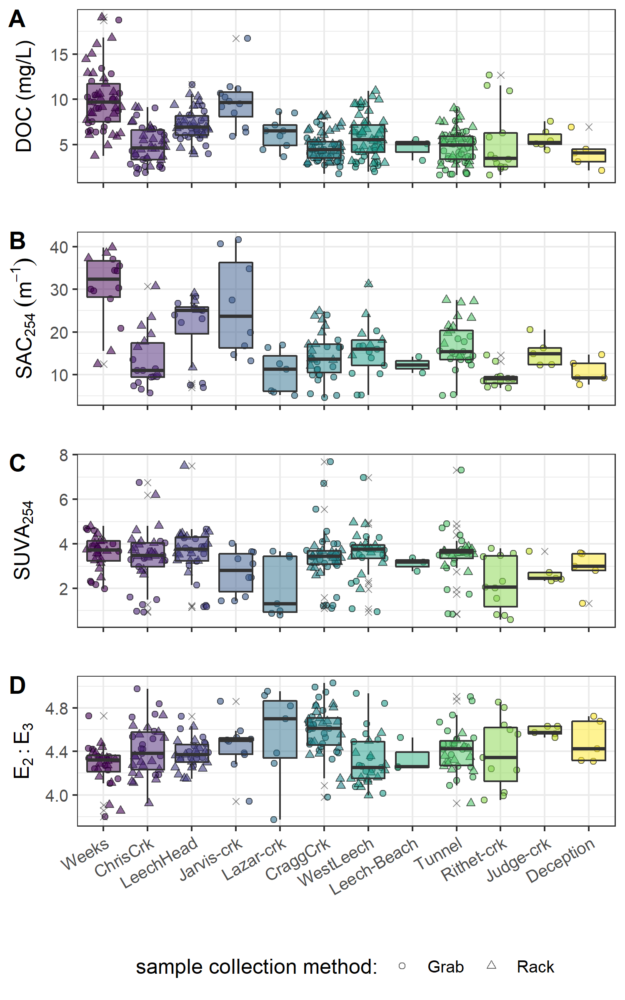

##	Spatial and temporal patterns in DOC & NOM

```{r, include = FALSE, package.startup.message = FALSE}

# load required packages
library(tidyverse)  # keep it tidy
library(readr)      # read in delimited files
library(knitr)      # for nice tables

knitr::opts_chunk$set(warning=FALSE, message=FALSE, echo=FALSE, fig.cap=TRUE)

```

### Introduction

The first objective for the surface water sampling methods defined in Chapter 2 was to describe spatial and temporal patterns and variation of DOC concentrations and NOM character across the Greater Victoria water supply area, and to identify the influence of seasonality on concentration of DOC and character of NOM.

\  

### Results

Over the sixteen-month field study, 426 river samples were collected and analyzed for DOC, and 318 of those samples were analyzed for NOM by UV-Vis (Table \@ref(tab:samplecount)). Fewer samples were analyzed for UV-Vis properties than for DOC concentration due to method evolution at the start of the project and instrument-sharing limitations. Of the samples collected and analyzed, DOC data were filtered and reduced by 9.2% (to 387 samples) during quality control checks (described below) and UV-Vis data were reduced by 19.5% (to 256 samples). Quality control resulted in a 9% reduction in UV-Vis data and an additional 10.5% data loss was unfortunately caused during instrument maintenance.  

\  

```{r samplecount}
read_csv("R-outputs_UBC-forWater-MSc_HMc/tables/summary_samples-count.csv", col_names = TRUE) %>% 
  knitr::kable(caption = "*Summary of samples collected*") 
```


\  

Samples were also measured for phosphate concentration using a colourimetric (ascorbic acid) orthophosphate test kit (HACH PO-19); each water sample had phosphate concentration below detectable limits (0.1 mg/L).

\  

#### Vertical Rack sampling quality control

Hold-time experiments were conducted at the Tunnel site to assess stability of river water samples held in siphon bottles on the vertical rack. Three sets of samples were used in hold-time experiments, each set included samples held on the rack for different periods and the timing and air temperatures for each set were assessed (Figure \@ref(fig:HoldTimeAirPlot)).

\  

```{r HoldTimeAirPlot, out.width = "100%", fig.pos="h", fig.cap = fig_cap}
fig_cap = "\\label{fig:HoldTimeAirPlot}*Plot of air temperature during vertical rack hold-time experiments. Red horizontal lines indicate the 0-7°C range of a typical laboratory refrigerator and dashed vertical lines separate the three sets of hold-time samples from collection of grab samples to retrieval of held samples.*"

knitr::include_graphics("R-outputs_UBC-forWater-MSc_HMc/figures/HoldTime_airTemp_megaplot.png")
```

\  

Each hold-time set included ten replicate samples, each collected at the same time in the same way from the same location. For each hold-time set, five samples were returned to the lab for immediate quantification of DOC and measurement of UV-Vis absorbance ("fresh" samples) and five were placed on the vertical rack, capped with siphon lids to simulate rack samples, and collected at a later date for analysis ("held" samples). All samples were analyzed to quantify DOC and characterized NOM properties (Figure \@ref(fig:HoldTimeBoxPlot)), and the fresh and held samples of hold-time set were compared using two-sided paired Wilcoxon signed rank tests (a.k.a 'Mann-Whitney' test, non-parametric paired difference test that does not assume normally distributed data). For a wider margin of error, a 90% confidence level (rather than 95% or 99%) was used to evaluate the comparisons between fresh and held samples. Results of hold-time comparisons considered the timing of sample collection, the number of days the rack samples were held, the mean air temperature over that period, and the percent change in analytical results (Table \@ref(tab:HoldTimeTtests)).

\  

```{r HoldTimeBoxPlot, fig.cap = fig_cap}
fig_cap = "\\label{fig:HoldTimeBoxPlot}*Sample DOC concentrations and UV absorbance at 254nm contrasting  hold-time samples from collection of grab samples to retrieval of held samples.*"

knitr::include_graphics("R-outputs_UBC-forWater-MSc_HMc/figures/HoldTime_boxplots.png")
```

\ 

```{r HoldTimeTtests}
read_csv("R-outputs_UBC-forWater-MSc_HMc/tables/HoldTime_results-summary.csv", col_names = TRUE) %>%
  knitr::kable(caption = "*Results comparing three vertical-rack hold-time sets*") 
```
_Note:_ one star (*) indicates significant difference at 90% confidence (p < 0.1), 
two stars (**) indicates significant difference at 95% confidence (p < 0.05)

\  

There was a significant change in DOC concentration (at 90% confidence, p-value = 0.063) for hold-time set-A, where mean DOC concentration was 45% lower in the held samples compared to the fresh grab samples. While there was no change in UV absorbance (i.e. SAC~254~ and E~2~:E~3~) for samples from hold-time set-A, the change in DOC generated a significant difference in SUVA~254~. Samples collected for hold-time set-A were DOC-rich "first flush" samples, and the Rack samples were held for 11 days at average temperature of 7° C (slightly above laboratory refrigerator temperatures). 

\  

Set-B had a hold-time of 20 days with average air temperature of 6° C. There were no significant changes to DOC concentrations or E~2~:E~3~ values between fresh and rack-held samples for this set. Wilcoxon tests for set-B showed that the 8% change in SAC~254~ was statistically significant (at 90% confidence). However, the SAC~254~ difference in set-B was determined to be caused by an outlier which could be rejected with 99% confidence by Dixon's Q-test (Q~exp~ = 0.941 > Q~crit~ = 0.821). Therefore, it was concluded that, despite the measured difference (Figure \@ref(fig:HoldTimeBoxPlot), Table \@ref(tab:HoldTimeTtests)) there was not truly a reliable change in SAC~254~ (or SUVA~254~, which relies on SAC~254~) for hold-time set-B. 

\  

Hold-time set-C included samples held for 34 days at an average of 4.4° C, including a period of sub-zero temperatures. While set-C did not yield statistically significant changes in DOC concentration (23% DOC reduction from fresh to held), there were significant changes to SAC~254~ (34% decrease in absorbance), and E~2~:E~3~ (14% decrease). In addition to the change in absorbance, rack-held set-C samples had greater variability for both all variables compared to the fresh sample counterparts. 

\  

Results of these hold-time experiments suggest that early-season ("first flush") samples may contain more labile and aliphatic DOC which is unstable and should be analyzed immediately after collection, whereas later season samples contain DOC which is relatively more stable for up to and including 20 days when held at temperatures that approximate a refrigerator. A hold-time of 34 days with periods of freezing resulted in significant changes to sample NOM molecular character; and while DOC concentrations were not statistically altered, there was a notable increase in held sample DOC standard deviation. Additional tests would be required to determine if the change in NOM character was caused by the length of time the sample was held, or perhaps due only to freezing and thawing, or a combination of both time and temperature. Based on these results, sample analyses data were updated to include quality-assurance/quality-control (QA/QC) flags which were used to filter sample data, reducing the effective number of samples included in results by less than 10% (Table \@ref(tab:samplecount)). 

\  

Hold-times were calculated for each sample as the time between sample collection and analysis. Any sample that remained held for fewer than 20 days at temperatures between 0-7° C were flagged as acceptable for further data analysis; Rack samples that were held for 20 days or longer were flagged for exceeding a reliable hold-time; and samples identified as early-wet-season ("first-flush") that had a hold-time of 7 days or longer were flagged as unacceptable and not included in further data analysis. Because of possible freeze-thaw changes to DOC and NOM, any sample that underwent suspected or confirmed freezing was also flagged for temperature effects. Hold-time temperatures (daily means) at each monitoring site were measured and recorded with Hobo TidbiT loggers from 2019-08-24 to 2020-02-18 (field study end), and temperatures prior to TidbiT deployment were estimated by linear regression (Appendix ###). 

\  

####   Seasonal delineation  

Wet seasons were defined by conditions that generated significant stream responses and Vertical Rack sample collection, and the dry season was defined by baseflow conditions with no detectable stream responses at the Vertical Racks.

\  

LWSA rain data were used to define rain events using the USGS _Rainmaker_ package in R ('RMevents' function), which determined there were 18 major events that corresponded to Vertical Rack sample collection. The conditions that defined major rain events were precipitation accumulating to 50 mm or more, with a period of at least 14 hours passing between 50 mm events. As major rain events were defined based on Rack sampling responses, they were the primary method of delineating seasons, where the wet season was defined by the presence of major rain events and the dry season was defined by their absence. However, there was a period of surprising snowfall in the winter of 2018/2019, during which time rainfall runoff subsided but the eventual melt generated streamflow response across the monitoring sites. Therefore, that period of snow accumulation and melt was included when defining wet seasons, despite the lack of major rain events (Figure \@ref(fig:seasonalMegaPlot)).

\  

```{r seasonalMegaPlot, fig.cap = fig_cap}
fig_cap = "\\label{fig:seasonalMegaPlot}*Plot of LWSA weather, stream response and sample collection at the six monitoring sites across the LWSA. Seasons were separated by stream responses and conditions that initiated or ceased rack sample collection.*" 

knitr::include_graphics("R-outputs_UBC-forWater-MSc_HMc/figures/Wx-stage_subbasins_season-megaplot2.png")
```

\  

While seasons were defined by river responses at the six monitoring sites, it was assumed that seasonality was equal across the GVWSA, and wet and dry seasons were consistent among the twelve synoptic sampling sites. 
\  

#### Spatial patterns in DOC & NOM 

Several comparisons can be made among the twelve synoptically sampled river sites (refer to Figure \@ref(fig:sampleSitesMap)); presented here are comparisons of cross-basin (from LWSA to SWSA) and upstream to downstream, and sampling methods evaluated with respect to nested catchments and DOC range. 

\  

##### Cross-basin & upstream/downstream DOC comparison

Mean DOC concentrations were similar when comparing across basins from the current source water tributaries, Rithet and Judge Creeks, to the future supplemental supply, Leech River at the Tunnel (Table \@ref(tab:synopticDOCdata)). From upstream to downstream sites there was an overall decreasing trend for DOC concentrations and NOM aromaticity and/or molecular size  (Figure \@ref(fig:synopticBox)). 

\  

```{r synopticDOCdata}
read_csv("R-outputs_UBC-forWater-MSc_HMc/tables/Ch2_DOC-Synoptic-summary.csv", col_names = TRUE) %>% 
  knitr::kable(digits = c(0, 0, 0, 1, 1, 0, 2, 1, 1), 
               caption = "*Dissolved organic carbon concentrations across twelve synoptically sampled river sites*")

``` 

\ 

```{r synopticBox, fig.cap = fig_cap}
fig_cap = "\\label{fig:synopticBox}*Synoptic sampling results of dissolved organic carbon concentrations from 12 sites over 16 months.*"


```

\  

\  

```{r synopticNOMdata}
read_csv("R-outputs_UBC-forWater-MSc_HMc/tables/Ch2_NOM-Synoptic-summary.csv", col_names = TRUE) %>% 
  knitr::kable(digits = c(0, 0, 0, 1, 1, 2, 2, 1, 1, 2, 2), 
               caption = "*Spectral properties of natural organic matter (NOM) character across twelve synoptically sampled river sites*",
               col.names = c("Site", "Description", "Count", 
                             "Mean SAC~254~ (m^-1^)", "sd (±)", 
                             "SAC~254~ Min. (m^-1^)", "SAC~254~ Max. (m^-1^)",
                             "Mean E~2~E~3~", "sd (±)", 
                             "E~2~E~3~ Min.", "E~2~E~3~ Max."))
``` 

\ 

##### Nested catchments, DOC and sample-type comparison

As the Leech River Tunnel will be the point of diversion for future inter-basin transfers from Leech water supply area (LWSA) to the Sooke Reservoir basin, the Tunnel (site 6) is the effective outlet of the LWSA where runoff from each nested catchment is integrated. 

\  

From a headwaters perspective, Weeks and ChrisCrk (sites 1 & 2) are integrated at LeechHead (site 3), which is just below the headwaters' confluence. And Jarvis and Lazar creeks are ultimately integrated at CraggCrk site; however, there was a greater distance between CraggCrk and its headwaters' sampling sites compared to LeechHead and its headwaters' locations (see Figure \@ref(fig:sampleSitesMap)). 

Within these nested catchments, sampling methods were evaluated through three comparison sets to assess whether a Rack sampler combined with Grab sampling downstream of a confluence captured the same range in DOC concentrations as synoptic Grab sampling alone at upstream sites (Figure \@ref(fig:abcDOCbox)). Synoptic Grab samples from the headwater sites of Weeks and ChrisCrk were compared to Rack and Grab samples from below their confluence at LeechHead site (Figure \@ref(fig:abcDOCbox), plot A). Similarly, Grab samples collected at the headwaters of Cragg Creek, Jarvis and Lazar creeks, were compared to all samples at the CraggCrk monitoring site (Figure \@ref(fig:abcDOCbox), plot B). Higher order rivers were also examined in a similar way, comparing Rack and Grab samples at the Tunnel to Grab samples collected upstream at LeechHead, CraggCrk and WestLeech sites (Figure \@ref(fig:abcDOCbox), plot C).

\  

```{r abcDOCbox, fig.cap = fig_cap}
fig_cap = "\\label{fig:abcDOCbox}*Grab sample DOC at upstream locations compared to Rack and Grab sample DOC below their confluence(s). A and B show grab samples from headwaters (HW) compared to downstream (DS) monitoring sites; C shows upstream river sites (US) compared to mainstem monitoring.*"

knitr::include_graphics("R-outputs_UBC-forWater-MSc_HMc/figures/Ch2_DOC-boxplot_up-down_metcompar.png")
```

\    

Below the confluences of headwaters sites, the combination of Rack and Grab sampling did not capture the ranges of DOC observed in upstream Grab samples alone. LeechHead, below the confluence of Weeks and ChrisCrk, collected DOC concentrations that were close to the average of the two headwaters. The variance obtained by combining Rack and Grab samples downstream was not the same as upstream Grab sampling variance (Levene's test for homoscedasticity p-value = 3.8 x 10^-5^). Similarly, Rack and Grab samples collected at CraggCrk did not cover the same DOC variance as Grab sampling at the headwaters (Levene's p-value 0.0011). Unlike LeechHead, which had moderate DOC concentrations relative to it's two headwaters, samples collected at CraggCrk had DOC that was lower than concentrations in either of it's headwater sites. The differences in DOC attenuation between these two sets can be attributed to different reach lengths between headwaters' confluence and the downstream monitoring sites; where LeechHead was very close to the headwaters' confluence and CraggCrk was considerably further from it's headwaters' sampling locations.

\  

When higher order rivers were examined in a similar upstream-Grab/downstream-Rack'n'Grab comparison, the combination of Rack and Grab samples at the Leech Tunnel site did capture the DOC ranges observed in Grab samples at three upstream river sites (Figure \@ref(fig:abcDOCbox), plot C). Levene's test for homogeneity of variance (homoscedasticity) confirmed that there was no difference in DOC variance in the downstream Rack/Grab combination results compared to Grab-only from upstream (p-value 0.165). Similar trends were seen for SAC~254~ but not E~2~:E~3~ (Appendix ####).  

\  

#### Temporal patterns in DOC & NOM

Over sixteen months, DOC concentrations followed similar trends across the synoptic sampling sites (Figure \@ref(fig:DOCloessAll)). DOC was highest early in the wet season and progressively decreased through the fall and winter, reaching minimum concentrations in the spring, and progressively increasing over the summer. 


```{r DOCloessAll, fig.cap = fig_cap}
fig_cap = "\\label{fig:DOCloessAll} *Trends in dissolved organic carbon concentrations over sixteen months at twelve sites across the Greater Victoria Water Supply Area. Trend line shows locally weighted smoothing (loess, local polynomial regression).*"

knitr::include_graphics("R-outputs_UBC-forWater-MSc_HMc/figures/Ch2_DOC-loess-trend.png")
```

\  


While there was an apparent sinusoidal trend in DOC over the seasons sampled (Figure \@ref(fig:DOCloessAll)), there was almost no difference between the mean DOC concentration between the wet and dry seasons (Table \@ref(tab:seasonDOCcount)). However, there were far fewer samples collected in the dry season than during the wet season.

\  

```{r seasonDOCcount}
read_csv("R-outputs_UBC-forWater-MSc_HMc/tables/Ch2_seasonal-samples-DOC-summary.csv", col_names = TRUE) %>%
  knitr::kable(digits = c(0,0,2,2,0,1,1,1),
               caption = "*Seasonal sample collection and DOC summary from twelve synoptic sampling sites*",
               col.names = c("Season", "Sample count", "Mean DOC (mg/L)", "sd (± mg/L DOC)", "RSD (± %)", "Min. (mg/L)", "Median (mg/L)", "Max. (mg/L)"))
```

\  

The wet season was most heavily sampled at the six monitoring sites, where Rack samplers more than doubled the number of samples that would have been collected through Grab sampling alone. Isolating DOC results to the six monitoring sites during only the wet season allows for comparison of Vertical Rack sampling methods to standard synoptic Grab sampling (Figure \@ref(fig:wetSeasonDOC), Table \@ref(tab:wetDOCcountInstallsites)). 

\  

```{r wetDOCcountInstallsites}
read_csv("R-outputs_UBC-forWater-MSc_HMc/tables/Ch2_seasonal-InstallSamples-DOC-summary.csv", col_names = TRUE) %>%
  knitr::kable(digits = c(0,0,2,2,0,1,1,1),
               caption = "*Wet season DOC by sample collection method at the six monitoring sites*")
```

\  

```{r wetSeasonDOC, fig.cap = fig_cap}
fig_cap = "\\label{fig:wetSeasonDOC} *DOC from each monitoring site grouped by collection method (synoptic Grab vs. Vertical Rack samples).*"

knitr::include_graphics("R-outputs_UBC-forWater-MSc_HMc/figures/Ch2_subbasin_GvsR_WETseason-ridgeplot.png")
```

\  

Vertical Racks captured higher DOC concentrations than synoptic Grab sampling alone and the two methods collected samples with comparable variance (Table \@ref(tab:wetDOCcountInstallsites)). These results are in agreement with other studies that found higher DOC concentration on the rising limb of the hydrograph compared to non-event samples (e.g. [@Yang2015; @Raymond2016; @Raymond2010]). 

\  

##### Seasonal changes in NOM character

Molecular aromaticity is associated with chromophores which are responsible for UV-Vis absorbance in aqueous NOM, therefore more aromatic NOM molecules (i.e. humic substances) will absorb more energy at 254 nm wavelength than less-aromatic molecules. To evaluate if (and when) molecular character of river samples shifted, DOC concentrations (NPOC) were compared to absorbance-based DOC estimates from the spectro::lyser (Figure \@ref(fig:seasonalDOCest)). 

\  

```{r seasonalDOCest, fig.cap = fig_cap}
fig_cap = "\\label{fig:seasonalDOCest} *Dissolved organic carbon measured directly (as NPOC) plotted against concentration estimated via UV-Vis spectroscopy, grouped by sampling season. The dashed lined indicates best fit (1:1), and the inset shows the relationship between NPOC and SAC at 254 nm, a key absorbance that informs the UV-estimated DOC concentration.*"

knitr::include_graphics("R-outputs_UBC-forWater-MSc_HMc/figures/Ch2_DOC-CDOM_seasonal_with-Inset.png")
```

\  

Characteristics of wet-season samples caused positive bias in absorbance-based DOC estimates, while dry-season sample characteristics lead to negative bias in UV-based DOC estimates. The separation of wet and dry season samples suggests that river NOM had more aromatic character (more humic-like, allochthonous NOM) during the wet-season than during the dry-season.

\  

The concentration of NOM in a sample is proportional to the intensity of absorbance (based on the Beer-Lambert law) which is why SUVA~254~ (specific UV absorbance at 254 nm) is widely used as indicator of sample aromaticity (concentration-relative character). Seasonally grouped DOC and SUVA~254~ (Figure \@ref(fig:seasonalSUVADOC)), also indicated a greater aromatic character in river water samples during the wet season compared to the dry season.

\  

```{r seasonalSUVADOC, fig.cap = fig_cap}
fig_cap = "\\label{fig:seasonalSUVADOC} *Dissolved organic carbon plotted against specific UV absorbance at 254 nm, showing greater aromaticity (more humic-like organic matter) in wet season samples.*"

knitr::include_graphics("R-outputs_UBC-forWater-MSc_HMc/figures/DOC_seasonal_SUVA-NPOC.png")
```

\  

\  

### Discussion

The objective of this work was to design a sampling strategy to measure the ranges of DOC concentration and NOM character between adjacent drainage basins and among nested sub-catchments and to evaluate the influence of seasonality on concentration of DOC and character of NOM. The sampling strategy was a combination of synoptic Grab sampling across twelve sites in the Greater Victoria water supply area in tandem with Vertical Rack sampling at six of those sites in the Leech water supply area (LWSA). 

\  

Vertical Racks were a consistent and comparable method of reproducible sample collection that proved important for passively capturing higher DOC concentrations which were not observed through Grab sampling alone. These results are in agreement with other studies that found higher DOC concentration on the rising limb of the hydrograph compared to non-event samples (e.g. [@Yang2015; @Raymond2016; @Raymond2010]). Rack sampling more than doubled the number of samples that would have been collected through Grab sampling alone. Therefore, the Vertical Rack method was a useful tool for collection of event-based samples with increased sampling frequency. Questionable sample hold-times resulted in a few occasions when logistics or high water limited safe immediate retrieval of Vertical Rack samples. However, the Vertical Rack method employed in this project allowed for calculation of sample hold-times, quality-control evaluation or data for processing of acceptable samples only.  

\  

From 366 quality controlled river water samples collected over 16 months, DOC ranged from 1.6 to 19.1 mg/L (5.7 mg/L median) with mean DOC of 6.1 ± 2.9 mg/L. The relative standard deviation for DOC in each of the synoptically sampled sites was at least 24% and at most 71%, indicating a wide range of variance among the sites. Overall, DOC decreased in concentration from upstream to downstream and followed a sinusoidal trend over time.  

\  

Seasonality was evaluated by operationally separating time into wet and dry seasons, where the wet season corresponded with weather events that generated streamflow response sufficient enough for Vertical Racks to collect samples and the dry season was confined to Grab sampling only (no river responses). While the absolute magnitude of DOC varied between sites, the general temporal trends were similar across the study area. DOC was highest in the early wet season, then progressively decreased through the wet season. DOC was lowest during the coldest periods, and concentrations of DOC increased over the summer. Spectroscopic analyses indicated that the wet season NOM was predominantly humic (i.e., aromatic) content and the summer carbon was derived from more aliphatic NOM sources. These observations support a shift in NOM source pools from autochthonous in the dry (summer) period to allochthonous in the wet season when the landscape was more connected to the river systems. The seasonal shifts observed in this project agree with the shift from autochthonous to allochthonous NOM that is predicted by the river continuum concept [@Vannote1980; @Meyer1983]. 

\ 

At the future point of diversion (5th order river), it was found that the combination of Vertical Rack and Grab samples collected the same variance in DOC that was observed in Grab samples upstream across three 4th order river sites (LeechHead, CraggCrk, WestLeech). This indicates that well-represented water quality monitoring for the LWSA could achieved by combining event-based (i.e. Vertical Rack) sampling with standard Grab sampling at the future point of diversions. In the headwaters, however, Racks combined with Grab samples at 4th order streams did not capture the variance in DOC observed upstream in Grab samples from 3rd order (headwater) stream samples. The longitudinal attenuation of DOC observed in the LWSA is promising for experimental forest fuel treatments (e.g. prescribed burning) in the headwaters, and is a positive indication for future inter-basin transfers and drinking water treatability.  

* DOC scaling from upstream to down stream -- comparable to JimButtle Turkey Lakes studies

\  

### Conclusions and future directions 

Longitudinal attenuation in DOC (decreasing concentrations from upstream to downstream) and SAC~254~ were observed across the sampling sites as was a seasonal shift from autochthonous NOM sources in the dry season to allochthonous NOM sources in the wet season. The structural changes to NOM that occurred seasonally are a strong indicator that site-specific calibrations should be performed at least a few times a year if DOC/NOM is monitoried by UV-Vis *in-situ*. DOC concentrations were typically higher than BC source water Guidelines suggest, however it should be noted that if Leech River water is transferred to a reservoir prior to treatment that NOM is likely to be photodegraded or diminished through microbial processing. 

\  

Expanded comparisons between the Leech Tunnel site, Rithet Creek and Judge Creek would be interesting from a source water perspective, particularly if conducted in conjunction with Sooke Reservoir water balance and residence time studies.  

:)