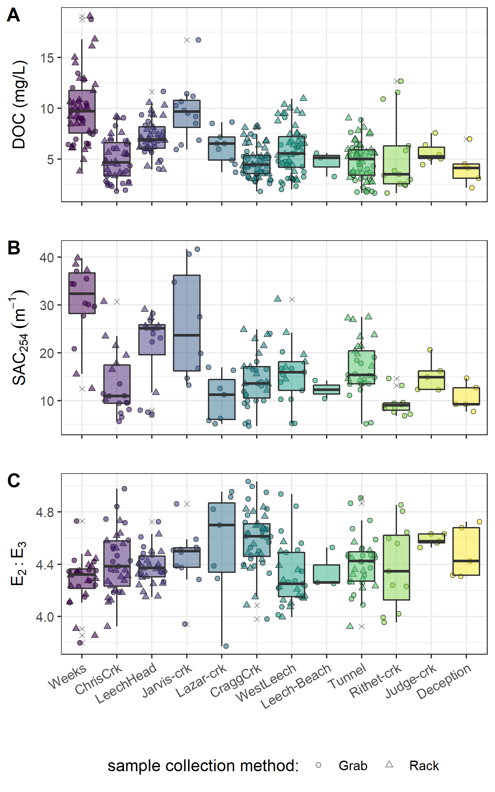
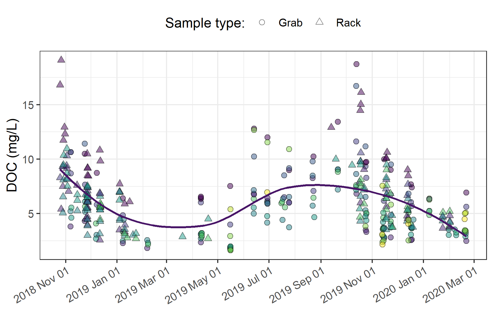
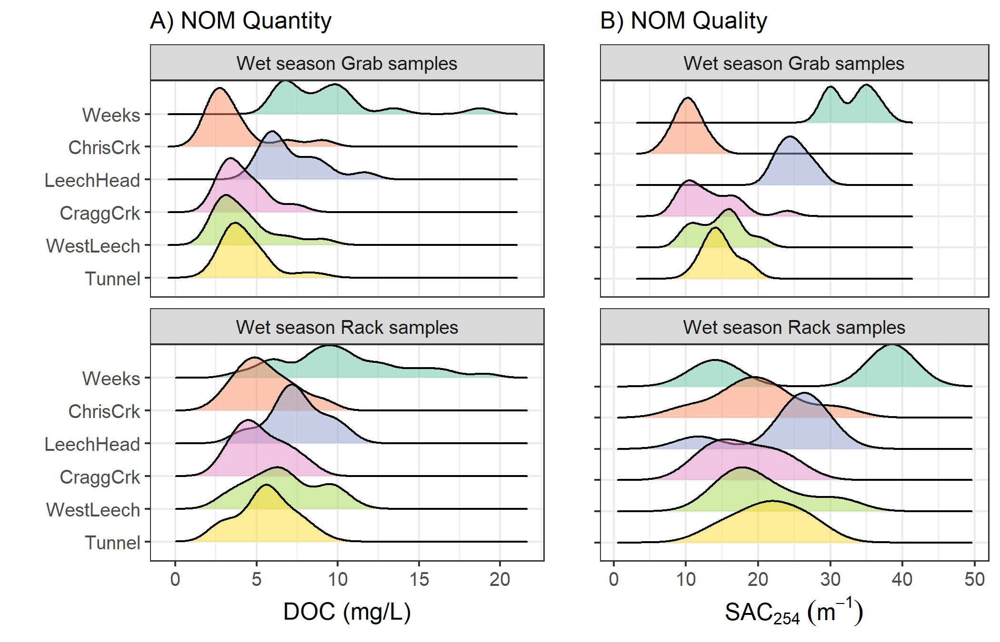

##	Spatial and Temporal Patterns in NOM Concentration and Character Across the Greater Victoria Water Supply Areas

```{r, include = FALSE, package.startup.message = FALSE}

# load required packages
library(tidyverse)  # keep it tidy
library(readr)      # read in delimited files
library(knitr)      # for nice tables

knitr::opts_chunk$set(warning=FALSE, message=FALSE, echo=FALSE, fig.cap=TRUE)

```

\  

### Synopsis 

The methods defined in Chapter 2 were used to collect and analyze surface water samples across the twelve Greater Victoria water supply area sites (GVWSA, refer to Figure \@ref(fig:sampleSitesMap) for map). The objective was to describe spatial and temporal patterns and variation of natural organic matter (NOM) concentrations (as dissolved organic carbon, DOC) and spectral character (SAC~254~ and E~2~:E~3~). Additionally, sampling results were interpreted with the goal of clarifying the influence of seasonality on concentration and character of NOM.     

\  

### Methods

All samples were collected by methods described in Chapter 2, and all data were flagged and filtered based on quality assurance described therein. Here, NOM is assessed based on concentrations of dissolved organic carbon (DOC) and character is indicated by SAC~254~ (reactivity & aromaticity) and E~2~:E~3~ (molecular size & aromaticity). 

\  

Synoptic sample results were evaluated for spatial patterns by comparing low- to high-order streams, between the Leech and Sooke portions of the GVWSA, and by sampling methods at upstream and downstream sites. To assess temporal patterns, results were examined over the full study period (Oct 2018 to Feb 2020), and grouped by wet and dry seasons. For shorter scale temporal pattern assessment, rising limb event-based Rack samples from the six monitoring sites in the Leech WSA were compared to inter-event sampling results (i.e. standard Grab samples). 

\  

### Results

From October 2018 to February 2020, across the GVWSA 426 river samples were collected and analyzed for DOC, and 318 of those samples were analyzed by UV-Vis for NOM character assessment (Table \@ref(tab:samplecount)). Fewer samples were analyzed for UV-Vis properties than for DOC concentration due to method evolution at the start of the project and constraints in instrument availability. Of the samples collected and analyzed, DOC data were reduced by 9.2% (to 387 samples) during hold-time quality control checks (described in Chapter 2). UV-Vis data were reduced by 19.5% (to 256 samples) through hold-time quality control (9% reduction in UV-Vis data) and, unfortunately, an additional 10.5% was lost during instrument maintenance. Analysis of calibration verification standards resulted in an average analytical accuracy of 10% (n = 20).  

\  

```{r samplecount}
read_csv("R-outputs_UBC-forWater-MSc_HMc/tables/summary_samples-count.csv", col_names = TRUE) %>% 
  knitr::kable(caption = "Summary of Samples Collected and Number Included in Data Analysis") 
```

\  

#### Spatial patterns in NOM quantity and quality  

From 366 quality-controlled river water samples collected over 16 months, DOC ranged from 1.6 to 19.1 mg/L (5.7 mg/L median) with mean DOC of 6.1 ± 2.9 mg/L overall. The relative standard deviation (RSD = std.dev/mean) for DOC in each of the synoptically sampled sites was at least 24% and at most 71%, indicating a wide range of variance among the sites. 

\  

The headwaters sites of Weeks creek (11.52 km^2^ sub-basin) and Jarvis creek (1.51 km^2^ sub-basin) had the highest DOC concentrations of the twelve sampling sites (means of 9.9 mg/L (n=49) and 9.7 mg/L (n=12), respectively). The lowest DOC concentrations were recorded at the sampling sites of the Rithet crk sub-basin (11.12 km^2^) and the Leech Tunnel sub-basin (95.3 km^2^) and their means (5.4 mg/L (n=13) and 4.8 mg/L (n=64), respectively) were not unlike other streams of 3rd order or above (overall average 5.18 mg/L). The greatest range in DOC concentrations was measured at the Rithet crk site which had a relative standard deviation (RSD) of 71%. The site with the second highest DOC range was the West Leech sub-basin (20.85 km^2^) with mean DOC of 5.8 ± 2.4 mg/L (41% RSD). Between these two sites with the highest DOC variance, the West Leech (n=57) -- a monitoring site -- was more heavily sampled than Rithet (n=13) -- a synoptic sampling site alone (Table \@ref(tab:synopticDOCdata)).  

\  

Mean DOC concentrations were similar between the Sooke WSA main tributaries to Sooke Reservoir: Judge crk (5.7 ± 1.1 mg/L, n=6) and Rithet crk (5.4 ± 3.9, n = 13). Comparing these Sooke WSA main tributary sites to the future supplemental supply Leech Tunnel site, mean DOC was similar among the three, but slightly higher in the Sooke WSA than at the Leech Tunnel (4.8 ± 1.8 mg/L). Though these three sites were sampled over the same span of time, the number of samples collected at the Tunnel (n=64) was much greater due to less intense focus on the Sooke WSA and Vertical Rack sampling at the Leech Tunnel (Table \@ref(tab:synopticDOCdata)).  

\  

```{r synopticDOCdata}
read_csv("R-outputs_UBC-forWater-MSc_HMc/tables/Ch3_DOC-Synoptic-summary.csv", col_names = TRUE) %>% 
  knitr::kable(digits = c(0, 0, 0, 1, 1, 0, 2, 1, 1),
               caption = "Dissolved Organic Carbon Concentrations (DOC) Across Twelve Synoptically Sampled Sites in the Greater Victoria Water Supply Area",
               col.names = c("Site", "Description", "n", 
                             "Mean DOC (mg/L)", "sd (±)", "Relative sd (± %)", 
                             "Min. DOC (mg/L)", "Median DOC (mg/L)", "Max. DOC (mg/L)"))

``` 

\  

Overall, DOC decreased from low-order headwater streams to higher-order downstream sites (Table \@ref(tab:synopticDOCdata), Figure \@ref(fig:synopticBox)). Similar to DOC concentration, there was an overall reduction in aromaticity, reactivity, and molecular size of NOM from upstream to downstream sites (Table \@ref(tab:synopticNOMdata), Figure \@ref(fig:synopticBox)). The greatest diversity in NOM reactivity, measured by SAC~254~, were recorded in headwater samples from Chris crk (50% RSD), Jarvis crk (47% RSD) and Lazar crk (45% RSD). The site with the greatest average reactivity, aromaticity and molecular weight NOM was Weeks crk (mean SAC~254~ 30.3 m^-1^, mean E~2~:E~3~ 4.3 ± 0.2).

\  

The lowest absolute measurement for NOM aromaticity, molecular size and reactivity occurred at the Cragg crk site (maximum E~2~:E~3~ of 5.03, minimum SAC~254~ 4.69 m^-1^). Cragg crk also had among the lowest mean aromaticity and molecular weight NOM (E~2~:E~3~ of 4.59 ± 0.22), though it was very similar to Judge crk (E~2~:E~3~ of 4.59 ± 0.05). Unlike Cragg crk's low aromaticity and molecular weight NOM, it's headwater sites (Jarvis and Lazar) had samples with highly aromatic and reactive NOM character. Jarvis crk had the most reactive NOM sample (max SAC~254~ 41.7 m^-1^) and the other headwater creek in Cragg basin, Lazar crk, had one of the most aromatic samples of all (lowest recorded E~2~:E~3~, 3.77). Lazar crk sub-basin had the greatest proportion of wetlands (12% by area), and had the greatest range in NOM aromaticity and molecular size (E~2~:E~3~ values with 9% RSD); despite having one of the most aromatic samples of all, Lazar crk also had the lowest average aromatic NOM (Table \@ref(tab:synopticNOMdata), Figure \@ref(fig:synopticBox)). Field observations included dry-season and early wet season algae blooms (Appendix __XXXX__) in Jarvis crk, Lazar crk and Cragg crk (and other small streams draining the west side of Survey Mountain).  

\  

```{r synopticNOMdata}
read_csv("R-outputs_UBC-forWater-MSc_HMc/tables/Ch3_NOM-Synoptic-summary.csv", col_names = TRUE) %>% 
  knitr::kable(digits = c(0, 0, 0, 1, 1, 0, 2, 2, 2, 2, 0, 2, 2), 
               caption = "Spectral Properties of Natural Organic Matter (NOM) Character Across Twelve Synoptically Sampled Sites in the Greater Victoria Water Supply Area",
               col.names = c("Site", "Description", "Count", 
                             "SAC~254~ Mean (m^-1^)", "stdev (±)", "RSD (± %)",
                             "SAC~254~ Min. (m^-1^)", "SAC~254~ Max. (m^-1^)",
                             "E~2~E~3~ Mean (unitless)", "stdev (±)", "RSD (± %)",
                             "E~2~E~3~ Min.", "E~2~E~3~ Max."))
``` 

\  

```{r synopticBox, fig.cap = fig_cap}

fig_cap = "\\label{fig:synopticBox} Synoptic sampling results of dissolved organic carbon concentrations from 12 sites (arranged left to right from upstream to downstream). Samples were collected from Oct 2018 to Feb 2020. Symbol type indicates samples were collected by siphon samplers on Vertical Racks (triangle) or synoptic Grab sample (circle), outliers are indicated with an 'x'."


```

\ 

The Leech River Tunnel is the effective outlet of the Leech WSA, where runoff from each nested catchment is integrated. Similarly, from a headwater's perspective, runoff from the sub-basins of Weeks and Chris crk are integrated at the Leech-head site, and Jarvis and Lazar creek sub-basins are ultimately integrated at the Cragg crk site. There was a greater distance between the Cragg crk site and its headwaters' sampling sites compared to Leech-head and its headwaters' locations (see Figure \@ref(fig:sampleSitesMap)). Within these nested catchments, sampling methods were evaluated to assess whether a Rack sampler combined with Grab sampling downstream of a confluence captured the same range in DOC as synoptic Grab sampling at upstream sites. Synoptic Grab samples from the headwater sites of Weeks and Chris crk were compared to Rack and Grab samples from below their confluence at Leech-head (Figure \@ref(fig:abcDOCbox), plot A). Similarly, Grab samples collected at the headwaters of Cragg crk, Jarvis and Lazar, were compared to all samples at the Cragg crk monitoring site (Figure \@ref(fig:abcDOCbox), plot B). Higher order rivers were also examined in a similar way, comparing Rack and Grab samples at the Leech Tunnel to Grab samples collected upstream at Leech-Head, Cragg crk and West Leech sites (Figure \@ref(fig:abcDOCbox), plot C).

\    

Below the confluence of headwaters sites, the combination of Rack and Grab sampling did not capture the ranges of DOC observed in upstream Grab samples alone. Leech-Head, below the confluence of Weeks and Chris crk, collected DOC concentrations that were close to the average of the two headwaters (Figure \@ref(fig:abcDOCbox), plot A); the variance obtained by combining Rack and Grab samples downstream was not the same as upstream Grab sampling variance (Levene's test for homoscedasticity p-value = 3.8 x 10^-5^). Similarly, Rack and Grab samples collected at Cragg crk did not cover the same DOC variance as Grab sampling at the headwaters Jarvis and Lazar (Levene's p-value 0.0011). Unlike Leech-Head, which had near-average DOC concentrations relative to its two headwaters, samples collected at Cragg crk had DOC that was lower than concentrations in either of its headwater sites (Figure \@ref(fig:abcDOCbox), plot B). The differences in DOC attenuation between these two headwater sets can be attributed to different reach lengths between headwaters' confluence and the downstream monitoring sites; where Leech-Head was very close to the headwaters' confluence and Cragg crk was considerably further from its headwaters' sampling locations.

\  

When higher order rivers were examined in a similar upstream Grab to downstream Rack & Grab comparison, the combination of Rack and Grab samples at the Leech Tunnel site did capture the DOC ranges observed in Grab samples at three upstream sites (Figure \@ref(fig:abcDOCbox), plot C). Levene's test for homogeneity of variance (homoscedasticity) confirmed that there was no difference in DOC variance in the downstream Rack/Grab combination results compared to Grab-only from upstream (p-value 0.165). Similar trends were seen for SAC~254~ but not E~2~:E~3~ (Appendix ####).  

\  

At the future point of diversion, Leech Tunnel (5th order stream), it was found that the combination of Vertical Rack and Grab samples collected the same variance in DOC that was observed in Grab samples alone upstream across three upstream sites (Leech-head, Cragg crk, West Leech). This indicates that well-represented water quality monitoring for the Leech WSA could be achieved by combining event-based (i.e. Vertical Rack) sampling with standard Grab sampling at the future point of diversion; this would be comparable to standard grab sampling at major tributaries upstream. In the headwaters, however, Rack sampling combined with Grab sampling at 4th order streams did not capture the variance in DOC observed upstream in Grab samples from 3rd order headwater stream samples; this is likely due to the greater variability at lower-order streams. 

\ 

```{r abcDOCbox, fig.cap = fig_cap}
fig_cap = "\\label{fig:abcDOCbox}  Comparison of dissolved organic carbon concentrations collected by Grab sampling at upstream sites compared to results obtained from both Vertical Rack and Grab sampling below their confluence(s). Plots A and B show Grab samples from headwater (HW) sites compared to Rack & Grab at downstream (DS) monitoring sites. Plot C shows DOC from Grab samples collected at upstream sites (US) compared to Rack & Grab at the mainstem monitoring site."

knitr::include_graphics("R-outputs_UBC-forWater-MSc_HMc/figures/Ch3_DOC-boxplot_up-down_metcompar.png")
```

\  

#### Temporal patterns & seasonal changes

From Oct 2018 to Feb 2020, DOC concentrations followed similar patterns across the synoptic sampling sites (Figure \@ref(fig:DOCloessAll)). DOC was highest early in the wet season and progressively decreased through the fall and winter, reaching minimum concentrations at the end of the wet season (in the spring), and progressively increasing over the dry season (summer). These patterns appear as a nearly sinusoidal trend in DOC over the sampling seasons (Figure \@ref(fig:DOCloessAll)).

\  

```{r DOCloessAll, fig.cap = fig_cap}
fig_cap = "\\label{fig:DOCloessAll} Dissolved organic carbon concentrations over sixteen months (Oct 2018 - Feb 2020) at twelve sites across the Greater Victoria Water Supply Area. Trend line shows locally weighted smoothing (loess method, local polynomial regression)."


```

\  

There were few data points from mid-February through March 2019 (when snow limited field access); however, DOC concentrations were decreasing up to that gap, and were low following it. Thus, the loess trend line in Figure \@ref(fig:DOCloessAll), though it includes this data-sparse period, appears to match with the overall pattern observed in available data.

\  

Despite DOC fluctuation over time, there was almost no difference between mean DOC concentrations during the wet and dry seasons (6.13 mg/L compared to 6.14 mg/L, Table \@ref(tab:seasonalSummary)). However, there were far fewer DOC samples collected in the dry season (55) than during the wet season (311). In a similar ratio, there were fewer spectral NOM characteristic samples collected in the dry season (25) than wet (139). While NOM concentration remained the same on average between seasons, higher SAC~254~ values in wet season samples indicated greater NOM aromaticity and reactivity compared to dry season stream samples (Table \@ref(tab:seasonalSummary)). Concentration (as NPOC) was well correlated with SAC~254~ during the wet season (R^2^ = 0.896, _n_ = 149) and during the transition from dry to wet seasons (first-flush event, R^2^ = 0.916, _n_ = 14), but the relationship between DOC concentration and SAC~254~ was weak during the dry season (R^2^ = 0.396, _n_ = 25). The seasonal discrepancy between NOM concentration and spectral character is indicative of a shift in NOM source pools between seasons, with allochthonous (humic-like, aromatic) sources contributing in the wet season and autochthonous (biolabile algal-derived, aliphatic) sources dominating in the dry season (Figure \@ref(fig:seasonalDOCest)). 

\  

```{r seasonalSummary}
read_csv("R-outputs_UBC-forWater-MSc_HMc/tables/Ch3_seasonal-summary_conc-char.csv", col_names = TRUE) %>%
  knitr::kable(digits = c(0,0,0, 2,2,2, 0,0, 2,2,2),
                   caption = "Sample Summary by Season for NOM Concentration (DOC) and Character (SAC~254~) from Twelve Synoptic Sampling Sites Across the Greater Victoria Water Supply Area",
               col.names = c("Season", 
                             "DOC sample count", 
                             "Mean DOC (mg/L) ± RSD (%)", "Min. DOC (mg/L)", "Median DOC (mg/L)", "Max. DOC (mg/L)",
                             "SAC~254~ sample count", 
                             "Mean SAC~254~ (m^-1^) ± RSD (%)", "Min. SAC~254~ (m^-1^)", "Median SAC~254~ (m^-1^)", "Max. SAC~254~ (m^-1^)" ))
```

\  

```{r seasonalDOCest, fig.cap = fig_cap}
fig_cap = "\\label{fig:seasonalDOCest} Stream samples collected Oct. 2018 to Feb. 2020 from twelve sites in the Greater Victoria Water Supply Area (B.C) showing seasonal relationships between dissolved organic carbon concentration (DOC) plotted against spectral absorbance coefficient at 254 nm (SAC~254~, m^-1^). The inset plot shows DOC (as NPOC) plotted against DOC estimated by the spectro::lyser spectrophotometer through an internal calibration file referenced to SAC~254~, where the dashed lined indicates best fit (1:1)."

knitr::include_graphics("R-outputs_UBC-forWater-MSc_HMc/figures/Ch3_DOC-SAC254_seasonal_with-Inset.png")
```

\  

The seasonal shift in NOM source pools indicates that if spectral estimates of concentration are used in studies, season-specific and site-based calibrations should be conducted. Results show that wet-season NOM character causes positive bias in absorbance-based DOC estimates and dry-season sample characteristics lead to negative bias in UV-based DOC estimates (inset, Figure \@ref(fig:seasonalDOCest)).  

\  

##### Spatiotemporal patterns & event-based sampling at six monitoring sites in the Leech watershed

\  

The most heavily sampled sites were those equipped with Vertical Racks, which collected many samples in the wet season. Isolating sample results from the six monitoring sites during only the wet season allowed for comparison of results from event-based Vertical Rack samples to standard synoptic Grab samples (Table \@ref(tab:wetDOCcountInstallsites)). Across the six sites, event-based Rack samples contained higher NOM concentrations on average than Grab samples (6.8 mg/L compared to 5.2 mg/L DOC). Event-based samples also carried NOM with greater aromaticity and reactivity (21.37 m^-1^) compared to inter-event samples (17.03 m^-1^). A slightly greater variance (relative standard deviation, RSD) in both concentration and character was captured through Grab sampling (±53% DOC and ±44% for SAC~254~) compared to Rack sampling (±41% DOC and ±32% for SAC~254~). This suggests that stormflow sustained greater concentrations of more aromatic NOM compared to relatively more variable lower concentrations of more aliphatic NOM during inter-event flows. Between Grab and Rack samples, average wet season NOM concentrations were 6.14 mg/L and average SAC~254~ was 18.92 m^-1^ (Table \@ref(tab:wetDOCcountInstallsites)).    

\  

```{r wetDOCcountInstallsites}
read_csv("R-outputs_UBC-forWater-MSc_HMc/tables/Ch3_wet-season-summary_conc-char_overall.csv", col_names = TRUE) %>%
  knitr::kable(digits = c(0,0,0,2,2,2,0,0,2,2,2),
               caption = "Wet Season Dissolved Organic Carbon (DOC) by Sample Collection Method at Six Monitoring Sites in the Leech Watershed",
               col.names = c("Sample type", "DOC sample count", 
                             "Mean DOC (mg/L) ± RSD (%)", 
                             "Min. DOC (mg/L)", "Median DOC (mg/L)", "Max. DOC (mg/L)",
                             "SAC~254~ sample count", 
                             "Mean SAC~254~ (m^-1^) ± RSD (%)", 
                             "Min. SAC~254~ (m^-1^)", "Median SAC~254~ (m^-1^)", "Max. SAC~254~ (m^-1^)"))
```

\  

Leech-head was the only site where the maximum DOC concentration was obtained by Grab sampling (11.6 mg/L), rather than Rack (max 10.6 mg/L). At all other monitoring sites, event-based samples collected by Vertical Racks had higher mean DOC compared to Grab samples (Table \@ref(tab:wetDOCinstallSites)). For NOM character, Leech-head and Weeks crk both had slightly higher average aromaticity collected in Grab samples compared to Rack samples; at each of these two sites, the highest minimum concentration was collected by Grab sample (Table \@ref(tab:wetDOCinstallSites)). The other four monitoring sites all showed greater aromaticity in Vertical Rack samples than in Grab samples. 

Weeks crk had the highest DOC and greatest aromaticity overall. Weeks had slightly higher concentrations occurring during stream rise (10.3 mg/L mean) compared to between events (9.3 mg/L mean). Meanwhile, SAC~254~ in Rack samples was lower with greater variability (28.7 m^-1^ ± 47%) compared to Grab samples (33.0 m^-1^ ± 9%). A similar pattern was seen downstream at Leech-head, where Rack samples had slightly lower and less consistent aromaticity (24.04 m^-1^ ± 26%) than Grab samples (24.92 m^-1^ ± 8%). The other sites showed greater aromaticity and higher variance in Rack samples than Grabs (Table \@ref(tab:wetDOCinstallSites)). The difference observed at the Weeks crk site was likely due to inter-event flows being sustained by more aromatic water from this sub-basin's wetlands and lake, and event flows being more dilute in character due to precipitation inputs.   

Interestingly, Rack sampling at Weeks crk captured that site's highest and lowest DOC concentrations (minimum of 3.8 mg/L, maximum of 19.1 mg/L). West Leech showed the greatest difference in DOC collected as Grab samples (4.2	± 1.9) versus event-based Rack samples (6.7 ± 2.2 mg/L). This suggests that hydrologic pulses in the West Leech sub-basin created considerably different DOC transport than non-stormflow in that sub-basin (Table \@ref(tab:wetDOCinstallSites), Figure \@ref(fig:wetSeasonPlot)). 

\  

```{r wetDOCinstallSites}
read_csv("R-outputs_UBC-forWater-MSc_HMc/tables/Ch3_wet-season-summary_conc-char_by-site.csv", col_names = TRUE) %>%
  knitr::kable(digits = c(0,0,0,0,2,2,2,0,0,2,2,2),
               caption = "Wet Season Stream NOM Concentration and Character (as DOC & SAC~254~, respectively) by Sample Collection Method at Each of the Six Monitoring Sites in the Leech Watershed",
               col.names = c("Site", "Sample type", "DOC sample count", 
                             "Mean DOC (mg/L) ± RSD (%)", 
                             "Min. DOC (mg/L)", "Median DOC (mg/L)", "Max. DOC (mg/L)",
                             "SAC~254~ sample count", 
                             "Mean SAC~254~ (m^-1^) ± RSD (%)", 
                             "Min. SAC~254~ (m^-1^)", "Median SAC~254~ (m^-1^)", "Max. SAC~254~ (m^-1^)"))
```

\  

```{r wetSeasonPlot, fig.cap = fig_cap}
fig_cap = "\\label{fig:wetSeasonDOC} NOM concentration and character during the wet saeason at six monitoring sites, comparing samples collected by Vertical Racks (event-based) and standard synoptic Grab sampling. Plot A shows dissolved organic carbon (DOC) concentration and plot B shows spectral absorbance coefficient values at 254 nm (SAC~254~), which indicates NOM aromaticity and reactivity."


```

\  

\  

### Discussion 

Vertical Racks proved important for measuring event-based DOC concentrations which were 26% higher, on average, than those observed through Grab sampling alone. These results are in agreement with other studies that found higher DOC concentration on the rising limb of the hydrograph compared to non-event samples (e.g. @Yang2015, @Raymond2016, @Raymond2010). While higher mean DOC was observed in event-based samples, they did not have greater variance compared to Grab samples, which was surprising. So, it seems that hydrologic pulses transported higher concentrations which remain relatively stable throughout the rising limb of the hydrograph. In a west coast small-basins (< 1 km^2^) study in the H. J. Andrews Experimental Forest (Oregon, CA) pre-storm DOC was measured as 1-2 mg/L with increases to 5-7 mg/L (~200% increase) during events [@Hood2006]. Evaluating the Leech WSA monitoring site data more closely with respect to event-based changes would allow for a more detailed understanding of relationships between streamflow and NOM dynamics. 

\  

Rack sampling also more than doubled the number of samples collected when compared to Grab sampling alone. Therefore, the Vertical Rack method was a useful tool for collection of event-based samples with increased sampling frequency. In a few occasions, questionable sample hold-times resulted when logistics or high water limited safe immediate retrieval of Vertical Rack samples. However, the method employed in this project allowed for calculation of sample hold-times and quality-control evaluation for data processing of acceptable samples only.  

\  

DOC concentrations in the GVWSA were similar to concentrations measured in Malcolm Knapp Research Forest near Maple Ridge on the lower mainland (near Vancouver, BC), where Emily Mistick found a forested basin (0.97 km^2^) to have mean baseflow DOC of 4.3 ± 0.8 mg/L with approximately 2 mg/L increase during events [@Mistick2019].

\  

#### Spatial patterns

Spatially, lower DOC was observed in the streams draining from the east of the Leech WSA catchment (Cragg and Chris crks) and higher DOC was observed in the streams draining from the west (West Leech and Weeks crk). Weeks crk, which drains from Weeks Lake and surrounding wetlands, had the greatest average aromaticity and highest DOC concentrations of all GVWSA synoptic sampling sites. This was to be expected as wetlands have been linked to high concentrations of aromatic-rich NOM [e.g. @Helms2008; @Agren2008; @Aiken1995]. DOC concentrations and NOM aromaticity decreased from upstream to downstream sampling sites and there was greater variation in NOM character (i.e. aromaticity) at the headwater sites than the higher-order streams. This spatial reduction in NOM molecular diversity from lower-order to higher-order streams agrees with predictions of the river continuum concept [@Vannote1980; @Mosher2015; @Abbott2018; @Creed2015].

\  

It seems that hydrologic pulses in the West Leech sub-basin created notably different NOM transport than non-stormflow, suggesting that theories of the pulse shunt concept could be particularly relevant in the West Leech sub-basin. Samples from the West Leech site had high aromaticity compared to other higher-order streams and showed considerable event-based changes in NOM concentration (45% difference between Grab and Rack samples) relative to the other monitoring sites; but it was not clear why. The West Leech sub-basin (20.85 km^2^) was of similar size to Leech-head (20.59 km^2^) and Cragg creek sub-basin (28.06 km^2^), with lower percent wetland cover (0.4% compared to 2.6% and 1.6% at Leech-head and Cragg creek sub-basins). The West Leech sub-basin was the only synoptically sampled sub-basin that did not have metamorphic parent-material (wark gneiss). Chapter 4 evaluates watershed features and conditions to identify possible drivers that could explain differences between site's NOM dynamics.         

\  

Longitudinal attenuation of NOM concentration and character suggests that there is a downstream dilution effect. These results imply that if a disturbance in headwater systems were to affect NOM (as well as related water quality parameters), the effect would be greatly reduced at downstream sites (e.g. Leech Tunnel). This is encouraging for possible experimental forest treatments (e.g. prescribed burning) in the Leech WSA headwaters. The scaling of DOC from upstream to downstream also bodes well for future inter-basin transfers and drinking water treatability, as lower DOC and SAC~254~ typically result in fewer DBPS being generated, lower risk of biofouling and more effective disinfection with oxidants. Similar DOC concentrations observed at Rithet crk (primary tributary to Sooke Reservoir) and Leech River at the Tunnel is promising from a source water perspective for future supplemental supply from the Leech.

\ 

#### Temporal patterns

\  

While the absolute magnitude of DOC varied between sites, DOC concentrations across the GVWSA followed a near-sinusoidal pattern over time. DOC was highest in the early wet season, then progressively decreased with lows during the coldest periods. DOC concentrations increased over the summer, reaching highs for the start of the wet season.  Overall, there was negligible difference in NOM concentrations between seasons; both wet and dry seasons had mean DOC of 6 ± 3 mg/L. Overall, stream DOC was higher than the recommended 4 mg/L TOC for source water quality [@BC2019]. However, reservoir dynamics would likely alter the concentration and character of stream DOC prior to intake for drinking water treatment. 

\  

While concentrations remained similar on average over seasons, NOM character was considerably more aromatic in the wet season (18.33 m^-1^ ± 44%) than in the dry season (8.99 m^-1^ ± 63%). Seasonal changes in the relationship between DOC and SAC~254~ were observed across the GVWSA and indicated that wet-season NOM was predominantly humic content and dry-season NOM was more aliphatic. These observations support a shift in NOM source pools from autochthonous in the dry (summer) period to allochthonous in the wet season, when the landscape was more connected to the river systems. The seasonal shifts observed in this project agree with the shift from autochthonous to allochthonous NOM that is predicted by the river continuum concept [@Vannote1980; @Meyer1983].

\  

### Summary and future directions 

The objective of this work was to design a sampling strategy to measure the ranges of NOM between adjacent drainage basins and among nested sub-catchments and to evaluate the influence of seasonality on concentration and character of NOM. The sampling strategy was a combination of synoptic Grab sampling across twelve sites in the Greater Victoria water supply area in tandem with Vertical Rack sampling at six of those sites in the Leech WSA. Sampling campaigns showed longitudinal attenuation of NOM concentrations and character (aromaticity and reactivity), and seasonal shifts from aliphatic NOM in the dry season to more aromatic NOM in the wet season. Across the GVWSA, DOC concentrations ranged from 1.64 mg/L to 19.1 mg/L with mean DOC of 6.1 ± 2.9 mg/L. NOM character was most aromatic and most variable in low-order headwater streams.

\  

The combination of Vertical Rack sampling with Grab sampling at the Leech Tunnel captured the same variance in DOC concentrations as Grab sampling alone at three upstream sites, which indicates that this combined method can achieve good resolution for water quality monitoring. For further comparisons between the Leech and Sooke WSA, it would be interesting to install Vertical Racks at the main tributaries to Sooke Reservoir, Rithet and Judge creeks, to compare event-based changes in more detail to Leech River. Such an expanded comparisons between the Leech Tunnel site, with Rithet and Judge creeks would be particularly interesting if conducted in conjunction with Sooke Reservoir water balance and residence time studies to evaluate changes to riverine source water in a reservoir (e.g. photodegredation of NOM).  

\  

