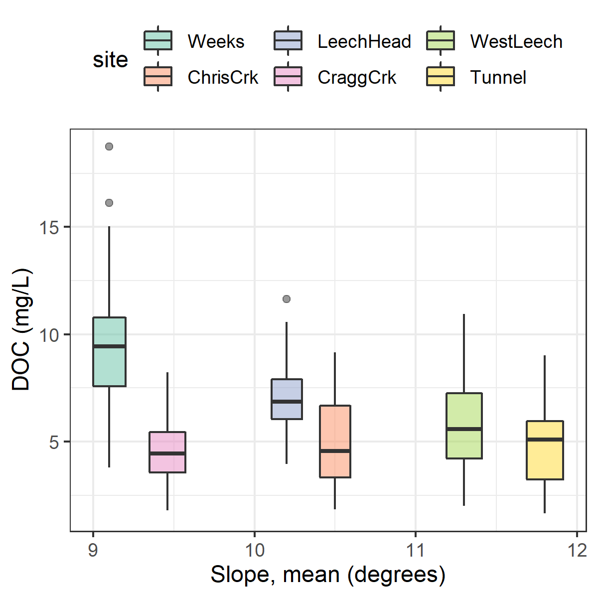

##	Assessing Watershed Characteristics and Conditions as Driving Forces for Aqueous Natural Organic Matter Dynamics Across the Leech River Watershed 

```{r, include = FALSE, package.startup.message = FALSE}

# load required packages
library(tidyverse)  # keep it tidy
library(readr)      # read in delimited files
library(knitr)      # for nice tables

knitr::opts_chunk$set(warning=FALSE, message=FALSE, echo=FALSE, fig.cap=TRUE)

```

\ 

### Synopsis

The previous chapter showed that across the Greater Victoria Water Supply Area (GVWSA), NOM shifted in character from aliphatic to aromatic from the dry to wet seasons and that event-based sampled had higher DOC concentrations than non-event Grab samples. A surprising range in NOM character was observed at the West Leech sub-basin (20.85 km^2^) monitoring site in the Leech WSA. While it wasn't clear why the ranges in NOM were greater at the West Leech Site compared to other streams of similar size (e.g. Leech-head, 20.59 km^2^ sub-basin, and Cragg creek 28.06 km^2^ sub-basin) one possibility was the difference in subsurface geology that set the West leech sub-basin apart from other synoptically sampled sites. In this chapter, watershed characteristics and conditions are  evaluated  to explore possible drivers for change NOM concentration and character across six monitoring sites in the Leech WSA. 

\  

### Methods 

#### Site details

Sample collection and analysis follow the methods detailed in Chapter 2. The study sites of this chapter focus only on the six Leech WSA monitoring sites (Figure \@ref(fig:subbasinMap)). Nested catchments of the Leech River system that were equipped with Vertical Rack samplers included two headwater streams, Weeks and Chris Creek sub-basins (site 1, 11.5 km^2^  & site 2 , 5.9 km^2^); the head of Leech River sub-basin, below the confluence of those two headwater streams (site 3, 20.6 km^2^); two major tributaries that feed the Leech, Cragg creek and West Leech sub-basins (site 4, 28.1 km^2^ & site 5, 20.9 km^2^), and Leech Tunnel (site 6) encompassed the entire Leech WSA drainage area above the point of diversion (95.3 km^2^). 

\  

```{r subbasinMap, fig.cap = fig_cap}

fig_cap = "\\label{fig:subbasinMap} Monitoring sites in the Leech Water Supply Area (WSA). Sites are named and numbered, where the number indicates both the sequence of vertical rack installations as well as the relative progression from headwaters to mouth. Each research basin boundary (defined using each sampling site as the drainage outlet) is outlined in black, and the Leech WSA boundary is delineated in red."

knitr::include_graphics("R-inputs_UBC-forWater-MSc_HMc/images/thesis_map_subbasin-sampling_with-numbers.png")
```

\ 

Weeks Creek (site 1), had the greatest proportion of wetland and open water compared to the other sub-basins (Table \@ref(tab:WTScharacterSubbasinTable)). Chris Creek (site 2) and Cragg creek (site 4) had no metasedimentary parent material (argillite-metagraywacke or metagraywacke). Cragg creek, draining from the east, was the only sub-basin with predominantly metamorphic parent material (wark-gneiss, 78%). West Leech (site 5) was the only sub-basin that did not have wark-gneiss nor chert-argillite-volcanic groups as parent materials and was the only sub-basin of the Metchosin igneous complex (16% Methchosin volcanics). Like Weeks basin (site 1), which also drains from the West, WestLeech is predominantly underlain by argillite-metagreywacke (metasedimentary parent material).       

\  

Most heavily harvested over the past 31 years was the Chris crk sub-basin (63% harvested), then Leech-head and Cragg crk sub-basins (43% and 41% harvested). West Leech was the least harvested between 1980 and 2011 (26%), followed by Weeks crk sub-basin (28%) and Leech Tunnel (34%).

\  

```{r WTScharacterSubbasinTable}
options(knitr.kable.NA = '')
read_csv("R-inputs_UBC-forWater-MSc_HMc/tables/Ch4_monitoring-site_basin_characteristics.csv", col_names = TRUE) %>% 
  knitr::kable(caption = "Summary of Leech Watershed Characteristics for Monitoring Site Sub-basins")
```

\ 

Random Forests were used to explore the watershed characteristics included in Table \@ref(tab:WTScharacterSubbasinTable), along with Leech WSA weather data (Chapter 2) and sample results (Chapter 4) to identify variables that were important predictors for DOC concentrations or NOM character. These predictors were explored as possible drivers for NOM change.

\  

Random Forests are a statistical tool for non-parametric regression, prediction, classification and assessment of variable importance [@Strobl2009]. A Random Forest is composed of a collection of decision trees is. Breiman's Random Forests (RF) is a machine learning algorithm for practical applications, which is popular for its accuracy in real-world systems [@Tyralis2019; @Biau2016] and does not require independence among samples (good news for analysis of nested catchments). In RF, a set of predictor variables (features) are used to predict the outcome of another variable (the predictant) through supervised learning algorithms, grouped as either regression or classification, depending on whether the variables are quantitative (i.e. numeric) or qualitative [@Breiman2001; @Tyralis2019]. 

\  

The RF algorithm learns from many independent Classification And Regression Trees (CARTs) which undergo bootstrap-aggregating ("bagging") with randomization; meaning that no single tree includes all the data, which reduces over-fitting and improves prediction performance [@Breiman2001; @Tyralis2019; @Biau2016]. In RF, many decision trees are created, each one generated by randomly sampling from the full data set (with replacement) and each tree is trained until only one possible solution remains (i.e. leaf nodes contain one deciding variable). For problems of regression (i.e. quantitative numeric variables, such as the data in this thesis), the forest prediction is the average of the individual trees predictions [@Tyralis2019; @Biau2016]. The relative importance of each feature is determined by assessing the accuracy of how well the predictant variable is anticipated in the absence or presence of that feature. 

\  


RF has been widely published in hydrologic and water resource research in recent years, particularly in streamflow and water quality studies [@Tyralis2019].
{{... refs}}

\  

The capability to evaluate variable importance metrics sets RF apart from other data-driven models that focus on prediction [@Tyralis2019]. Variable importance measure is a powerful part of Random Forests that evaluates the impact of each predictor variable on predicting a response variable. To assess the relative importance of sub-basin characteristics and conditions, the variable importance measure (VIM) was employed. VIM was assessed through the RF algorithm by removing predictor variables one at a time and measuring the increase in the mean square error (MSE) of prediction in their absence [@Breiman2001]. The other option for VIM assessment is evaluation of the increase in sum of square errors (SSE, node impurity), which may be more appropriate for categorical variables than quantitative variables. Mixing categorical and quantitative variables has shown bias towards variables with many categories, those with many missing values, and those that had strong cross-correlation to other variables [@Strobl2008]. 

\  

#### Random Forests predictor variable refinement

Possible predictor variables for NOM concentration (i.e. DOC) and character (i.e. SAC~254~ and E~2~:E~3~) included sub-basin characteristics of each of the six monitoring sites (Table \@ref(tab:WTScharacterSubbasinTable)) as well as weather and sampling conditions. To avoid undue bias [@Strobl2008] all predictor variables were numeric values (quantitative) and missing values were removed. 

\  

Parameters were filtered to avoid spurious predictions, variables with correlation coefficients greater than 0.65 were removed. Sub-basin slope was correlated with percent wetland cover and forest cover (± 0.74), and forest and wetland were also correlated (-0.97). Thus, wetland and forest percent cover were not included in VIM assessments, and median slope was. Interestingly, the sub-basin percent of Leech River formation parent material (meta-sedimentary, including argillite-metagreywacke (mudstone) and metagreywacke (meta-sandstone)) was correlated (-0.83) with logging history (percent of basin harvested 1980-2011). Anecdotally, the Leech River formation underlies the Weeks and West Leech sub-basins, areas that contained some of the last parcels of land purchased by the CRD from sustained harvest forest management companies. Parent-material variables were refined to metamorphic (wark-gneiss) and igneous (Metchosin volcanics), which did not show cross-correlation to other predictor variables. 

\  

The nine selected predictor variables included:

* metamorphic parent-material (wark gneiss, percent of basin)
* igneous parent material (Metchosin volcanics & Gabbro stocks, percent of basin)
* drainage area (km^2^) 
* median basin slope (degrees)
* tree age (average, years)
* logging history (harvested 1980-2011, percent of basin)
* antecedent 7-day air temperatures (°C) 
* antecedent 30-day rain (mm, total)
* sampling stage (min-max-normalized to account for differences between site installations)


\  

A 30-day interval was selected for antecedent rain because (1) it was not cross-correlated with antecedent 7-day temperature and (2) it was easier to distinguish from other predictor variables than shorter and longer intervals (e.g. ), and (3) a month of rain should be sufficient to consider as an indicator of antecedent landscape wetness in general (whereas shorter periods may have been lost to interception, evaporation, or evapotranspiration). 

\  

As surface and subsurface characteristics were static values (e.g. basin slope, parent material), it was possible that they might be treated categorically so they were evaluated independent of dynamic weather data to see if there was any shift in calculated importance (as categorical variables mixed with numeric could lead to bias), but the relative results were unchanged so all groups (conditions and characteristics) were evaluated together.  

\  

RF is a black box, and as such a quality assurance variable of random numbers was also included with the watershed characteristics and conditions in the VIM assessment. After ensuring random numbers were calculated to have no predictor importance, the random-number variable was removed (not displayed in results). Following RF VIM analysis, the four watershed variables with relatively greatest predictor importance were further explored by evaluating their relationships with NOM concentration and character. 

\  

#### Hysteresis

information about this... 

Conditions that were calculated to be most important for predicting NOM concentration and character were plotted with their predictant to assess possible hysteresis. This was only possible for dynamic conditions with variable measurements (i.e. not static watershed characteristics predictors).


\  

#### Evaluating local extrema

Results in the previous chapter showed elevated NOM in event-based samples, to explore that relationship more deeply a peak-to-peak comparison was done to see if DOC peaked with stream stage. As DOC was quantified from discrete stream samples the temporal synchrony of peaks could not be evaluated in the same manner as stage, which was continuously recorded. However, each river sample was matched to stage and had a corresponding timestamp, thus inferences could be made based on relationships between peak DOC and stage. To determine if local DOC extrema (maxima and minima concentrations) were captured in conjunction with the local extrema of sampled flows (minima and maxima of sample stage), manual synchrony tests were run on sample results. For each site, results of samples were grouped by collection period and rain event to identify samples with extreme DOC concentrations as well as samples collected at extreme stage (max/min). Samples corresponding to maxima and minima DOC and stage were compared to determine how often they overlapped (i.e. was the sample with max DOC also the sample collected at the highest stage?).

\  


### Results of variable importance measure

The RF variable importance measure showed that DOC and SAC~254~ were predicted by wet and warm conditions, while E~2~:E~3~ wasn't as impacted by 7-day antecedent temperature but was sensitive to rain and sampling stage. 


For each of DOC, SAC~254~ and E~2~:E~3~ conditions ranked among the most important variable group, above most watershed characteristics, and all three had antecedent 30-day rain as one of their top 3 predictor variables. Metamorphic parent material was ranked fourth in importance for predicting each of DOC, SAC~254~ and E~2~:E~3~. Igneous parent material was the least important for all three predictants. 

Slope was relatively more important for concentration than it was for character of NOM and sampling stage was more important to character than concentration. 

Tree age and logging history were quite poor for predicting both DOC concentration and SAC~254~, and more important for E~2~:E~3~. 

Drainage area was not found to be particularly important for any of the three predictants (Figure \@ref(fig:RFplot)). 

\  

```{r RFplot, fig.cap = fig_cap}

fig_cap = "\\label{fig:RFplot} Variable importance for predicting NOM concentration (DOC), molecular aromaticity (SAC~254~), and aromaticity & size (E~2~:E~3~) across six stream monitoring sites in the Leech River watershed. Variable importance measures were extracted from *randomForest* (in R) and determined by mean decrease in prediction accuracy (increase in the mean square error) in the absence of the predictor variable (i.e. type 1 importance measure)."

knitr::include_graphics("R-outputs_UBC-forWater-MSc_HMc/figures/Ch4_RFplot-summary_DOC-E2E3-SAC254.png")
```

\  

#### Predicting DOC

Antecedent 7-day air temperature was calculated to have the greatest relative importance in predicting DOC concentrations. Upon closer inspection, DOC and 7-day temperature were positively related in the wet season with no obvious relationship in the dry season (Figure \@ref(fig:DOC1)). 

\  

```{r DOC1, fig.cap = fig_cap}

fig_cap = "\\label{fig:RFplot} Antecedent 7-day air temperature as a predictor variable for concentrations of dissolved organic carbon in the wet and dry seasons of the Leech Water Supply Area (including loess trend line)"

knitr::include_graphics("R-outputs_UBC-forWater-MSc_HMc/figures/Ch4_RF_DOC-predictor-1-temp.png")
```

\  

For DOC, antecedent 30-day rain accumulation had the second greatest relative predictor importance. There was a non-linear relationship between the two variables which showed an initial increase in DOC with increasing antecedent wetness, and then a gradual decline in DOC with increasing accumulated rain (Figure \@ref(fig:DOC2)). Lower order streams (Weeks, Chris, Leech-head) showed a steeper decline in DOC with increasing 30-day antecedent rain. 

\  

```{r DOC2, fig.cap = fig_cap}

fig_cap = "\\label{fig:RFplot} Antecedent 30-day rain as a predictor variable for concentrations of dissolved organic carbon at six sites across the Leech Water Supply Area (including loess trend line). "


```

\  

Sub-basin slope ranked third in importance as a predictor for DOC. The relationship between slope and DOC across the six monitoring sites was not linear, but in general lower slope was related to higher DOC (Figure \@ref(fig:DOC4)). Slope was also negatively correlated to percent wetland, which is known to be linked with high DOC concentrations.  

\  

```{r DOC3, fig.cap = fig_cap}

fig_cap = "\\label{fig:RFplot} : Median basin slope as a predictor variable for concentrations of dissolved organic carbon in the Leech Water Supply Area "


```

\  

The fourth ranking predictor variable for DOC was metamorphic parent material, of which West Leech sub-basin had none. For the five sites that were underlain by some proportion of wark-gneiss, DOC decreased with increasing percentage of this metamorphic surficial deposit. While greater percent metamorphic material corresponded to lower DOC, the absence of wark-gneiss in West Leech sub-basin did not correspond to the highest DOC (Figure \@ref(fig:DOC3)). 

\  

```{r DOC4, fig.cap = fig_cap}

fig_cap = "\\label{fig:RFplot} Metamorphic parent material (Wark-Gneiss) as a predictor variable for concentrations of dissolved organic carbon (DOC) in the Leech Water Supply Area"


```

\  

#### Predicting SAC~254~

\  

Stream stage at sample collection was the most important variable to predict SAC~254~. Up to approximately 75% of maximum sampling stage at each site, SAC~254~ increased with increasing sampling stage and then dropped off (Figure \@ref(fig:SAC1)). This indicates that as stream levels increased, so too did NOM aromaticity. The threshold level (3/4 of max stage) could suggest a point at which aromatic NOM sources were depleted.  

\  

```{r SAC1, fig.cap = fig_cap}

fig_cap = "\\label{fig:SAC1} Sampling stage as a predictor variable for SAC~254~ in the Leech Water Supply Area (including loess trend line)"

knitr::include_graphics("R-outputs_UBC-forWater-MSc_HMc/figures/Ch4_RF_SAC254-predictor-1-stage.png")
```

\  

The second ranking predictor variable for SAC~254~ was antecedent 7-day air temperature... which is a bit difficult to interpret... more to come, or possibly this will be moved to the appendix and left out of this section... (Figure \@ref(fig:SAC2)). 

\  

```{r SAC2, fig.cap = fig_cap}

fig_cap = "\\label{fig:SAC2} Antecedent 7-day air temperature as a predictor variable for SAC~254~ in the Leech Water Supply Area (including loess trend line)"

knitr::include_graphics("R-outputs_UBC-forWater-MSc_HMc/figures/Ch4_RF_SAC254-predictor-2-temp.png")
```

\  

Antecedent 30-day rain was ranked third most important for predicting SAC~254~, and, although there were missing values for SAC~254~ where DOC had data, the pattern was similar to that of DOC and 30-day antecedent rain. Rain accumulation in the 30 days prior to sample collection was positively related to SAC~254~ up to approximately 150 mm; SAC~254~ was relatively low with antecedent 30-day rain above 400 mm (Figure \@ref(fig:SAC3)). 

\  

```{r SAC3, fig.cap = fig_cap}

fig_cap = "\\label{fig:SAC3} Antecedent 30-day rain as a predictor variable for of SAC~254~ in the Leech Water Supply Area (including loess trend line with uncertainty shaded in grey) "


```

\  

Ranking fourth for predicting SAC~254~ was metamorphic parent material. Like DOC, greater metamorphic parent material corresponded with lower SAC~254~ values, but the absence of wark-gneiss did not correspond to the sub-basin with the highest SAC~254~ (Figure \@ref(fig:SAC4)). 

\  

```{r SAC4, fig.cap = fig_cap}
fig_cap = "\\label{fig:SAC4} Metamorphic parent material (Wark-Gneiss) as a predictor variable of SAC~254~ in the Leech Water Supply Area"

knitr::include_graphics("R-outputs_UBC-forWater-MSc_HMc/figures/Ch4_RF_SAC254-predictor-4-metamorphic.png")
```

\  

\  

#### Predicting E~2~:E~3~

\  

As a predictor for E~2~:E~3~, antecedent 30-day rain was ranked most important. Similar to the patterns seen with DOC and SAC~254~, there was an initial positive relationship up to approximately 150 mm of antecedent 30-day rain, then E~2~:E~3~ decreased until antecedent 30-day rain reached around 300 mm at which point E~2~:E~3~ more or less plateaued (Figure \@ref(fig:E1)). 

\  

```{r E1, fig.cap = fig_cap}

fig_cap = "\\label{fig:E1} Antecedent 30-day rain as a predictor variable for of E~2~:E~3~ in the Leech Water Supply Area (including loess trend line)"


```

\  

The second most important predictor was sampling stage which was inversely related to E~2~:E~3~ (Figure \@ref(fig:E2)). This shows that as stream stage increased across the Leech WSA, so too did aromaticity and/or NOM molecular size. Similar to SAC~254~, E~2~:E~3~ and stage had a weaker relationship around 75% of maximum stage, indicating a threshold at which aromaticity no longer increased; possibly due to the aromatic pool being exhausted, or possibly that the most aromatic sources had reached peak connectivity to the streams and the NOM could get no more humic in nature.    

\  

```{r E2, fig.cap = fig_cap}

fig_cap = "\\label{fig:E2} Sampling stage as a predictor variable for E~2~:E~3~ in the Leech Water Supply Area (including loess trend line)"

knitr::include_graphics("R-outputs_UBC-forWater-MSc_HMc/figures/Ch4_RF_E2E3-predictor-2-stage.png")
```

\  

Ranking third for variable importance in predicting E~2~:E~3~ was average tree age in each monitoring basin. Tree age was partially due to forest harvest, which was the fifth ranked VIM predictor, so these two variables were plotted together for interpretation. Sub-basin area harvested between 1980 and 2011 was positively related to E~2~:E~3~ at four of the six sub-basin sites (West Leech, Weeks, Tunnel, Cragg crk), which showed increasing E~2~:E~3~ with percent area harvested over the past 31 years. However, Leech-head and Chris creek sub-basins, which had higher percent harvest over the past 31 years (thus youngest trees) did not continue this pattern (Figure \@ref(fig:E3n4)). These results suggests that NOM character was less aromatic in more heavily harvest sub-basins.  ...{?}

\  

```{r E3n4, fig.cap = fig_cap}

fig_cap = "\\label{fig:E3n4} Average tree age and percent basin area harvested as predictors for E~2~:E~3~ in the Leech Water Supply Area "

knitr::include_graphics("R-outputs_UBC-forWater-MSc_HMc/figures/Ch4_RF_E2E3-predictor-3n4-Trees-Logging.png")
```

\  

Metamorphic parent material ranked fourth in importance for predicting E~2~:E~3~, which showed agreement with DOC and SAC~254~. Greater metamorphic parent material corresponded to lower aromaticity and molecular weight (higher E~2~:E~3~ values). In contrast to DOC and SAC~254~ the absence of wark-gneiss did correspond to the lowest mean E~2~:E~3~, the sub-basin with the greatest aromaticity and molecular weight (Figure \@ref(fig:E5)). 

\  

```{r E5, fig.cap = fig_cap}

fig_cap = "\\label{fig:E5} Metamorphic parent material (Wark-Gneiss) as a predictor variable of E~2~:E~3~ in the Leech Water Supply Area"


```

\  

Across the Leech WSA, warm conditions during the wet season were an important driver for DOC concentrations. Antecedent rain was positively related to DOC concentrations up to a 30-day accumulation of approximately 150 mm, at which point DOC concentrations declined with increasing antecedent wetness. This suggested a possible threshold at which dilution overtook NOM transport. NOM concentration and aromaticity in sub-basins with wark-gneiss parent material showed a negative relationship to this metamorphic parent material. 

\  

Like concentration, NOM character was driven by antecedent wetness but only up to a threshold of approximately 150 mm of 30-day antecedent rain. After this threshold, the relationship was no longer positive. In a similar way, NOM aromaticity increased with increasing sample collection stage up to approximately 75% of maximum stage at each site.

\  


#### Evaluating rain events with NOM concentration and character

\  

Antecedent moisture was important for each of the three predictant variables evaluated though RF VIM. Across the Leech WSA, the highest DOC occurred in the earliest events of each wet season (events 1 & 9, Table \@ref(tab:EventsTab)), while SAC~254~ peaked later than DOC during the third major event in the 2019/2020 wet season (event 11, Table \@ref(tab:EventsTab)). While E~2~:E~3~ indicated maximum aromaticity and molecular size occurred during the last major events, at the end of each wet season (events 3 & 17, Table \@ref(tab:EventsTab)).

\  

```{r EventsTab}
read_csv("R-outputs_UBC-forWater-MSc_HMc/tables/CH4_events-n-samples.csv") %>% 
  select(-c("mean SUVA")) %>% 
  knitr::kable(digits = c(0,0,1,1,1,0,2,2,2), 
               caption = "Rain Events (Threshold of 50 mm and 14-hour Inter-event Period) Defined by Vertical Rack Sample Collection Across the Six monitoring Sites of the Leech WSA",
               col.names = c("Major event no.", "Start Date", "Duration (days)", "Rainfall (mm)", "Intensity (mm/24-hr)", "Samples collected", "mean DOC (mg/L)", "mean SAC~254~", "mean E~2~:E~3~"))

```

\  

Moisture was important to each of the three predictant variables, so a comparison between the wet and dry season sample results was done to assess difference in spatial patterns for DOC, SAC~254~ and E~2~:E~3~. During the dry-season, SAC~254~ and E~2~:E~3~ indicated that Weeks creek had much greater aromaticity compared to the other sites. Aside from the highly aromatic character of NOM observed at Weeks, E~2~:E~3~ suggested that aqueous NOM in the dry-season had increasing aromaticity from upstream to downstream sites; while this quotient can also be indicative of molecular size (by an inverse relationship), the simultaneous decrease in DOC concentration indicates that molecular weight was not increasing downstream (Figure \@ref(fig:seasonalNOM)). SAC~254~ showed a similar increase in aromatic character from headwaters to mouth during the dry season, albeit the pattern was less pronounced and there was a larger difference between Chris crk and Leech-Head in SAC~254~ than in E~2~:E~3~. As we know from Chapter 3, DOC concentrations decreased from headwaters to mouth in both the wet and dry seasons, with the greatest dry-season variance at the head (Weeks) and mouth (Tunnel). 

\  

The dry season patterns of decreasing DOC and SAC~254~ from low- to high-order streams were apparent in the wet season also. But the wet season spatial pattern of E~2~:E~3~ was almost the reverse of what was seen in the dry season. While dry season samples' E~2~:E~3~ showed increasing aromaticity from upstream to downtream, the wet season E~2~:E~3~ showed decreasing aromaticity from head to mouth. These seasonal differenced suggest a possible shift in NOM source material, and also a possible dilution effect.      

\    

```{r seasonalNOM, fig.cap = fig_cap}
fig_cap = "\\label{fig:seasonalNOM} Sample results over the dry and wet seasons for [A] dissolved organic carbon concentrations (DOC), [B] specific absorbance coefficient at 254 nm (SAC~254~, m^-1^), and [C] the quotient of SAC~250~/SAC~365~ (E~2~:E~3~). Note that each season has a differnt y-scale to clarify patterns. The inset in panel B is an elargement of SAC~254~ for all sites except Weeks."

knitr::include_graphics("R-outputs_UBC-forWater-MSc_HMc/figures/Ch4_NOM-DOC_boxplots-by-season.png")
```

\  

##### Rising stage and NOM dynamics across the LWSA

Streams across the Leech WSA responded harmoniously to precipitation with synchronous changes in stage. Over the full sixteen-month study period, stage changes at the six sites were temporally synchronized and confirmed to be congruent with high confidence (p-value < 0.001, based on 1050 randomizations) via Kendall's coefficient of concordance (Kendall's W = 0.9721) and Spearman's ranked correlation (ρ = 0.9666).

\  

Rates of change in stream response were calculated for each site to evaluate the fastest and slowest times to peak stage and relative magnitudes of change (Table \@ref(tab:stageResponse)). As expected, rate of change in stage was greatest at the highest order stream, the Tunnel site, and smallest at Weeks creek.

\  

```{r stageResponse}
read_csv("R-outputs_UBC-forWater-MSc_HMc/tables/Ch3_response_stage-summary.csv", col_names = TRUE) %>% 
  knitr::kable(digits = c(0,1,1,1,1,2,1), 
               col.names = c("site", 
                             "shortest time to peak stage (hr)", 
                             "longest time to peak stage (hr)", 
                             "smallest change in stage (cm)", 
                             "largest change in stage (cm)", 
                             "minimum rate of stage change (cm/hr)", 
                             "maximum rate of stage change (cm/hr)"),
               caption = "Summary of Stream Response to Rain Events Across Six Monitoring sites in the Leech Water Supply Area.")
```

\  

To determine is a similar harmony was present for fluctuations in DOC or spectral properties, the proportion of common DOC and stage extrema samples were calculated (Table \@ref(tab:synchDOCstage). A proportion of 1 indicates perfect agreement between samples of extreme DOC and sample stage, and zero indicates complete asynchrony between DOC and stage highs and lows. Most samples showed congruence between highs and lows of DOC with stage. West Leech was the only site which had a greater proportion of common maxima compared to minima, all other sites had more frequent occurrence of low DOC occurring at low stage that they did of high DOC occurring at high stage. 

\  

```{r synchDOCstage}
read_csv("R-outputs_UBC-forWater-MSc_HMc/tables/synchrony_DOC-stage_extrema-simultaneous.csv", col_names = TRUE) %>% 
  knitr::kable(digits = c(0,3,3),
               caption = "Proportion of Samples for Which Peak Dissolved Organic Carbon (DOC) was Collected at the Highest Sample Stage.")
```

\  

Each of the six site's samples showed majority, but not absolute, agreement in extremes of DOC-stage relationships. In general DOC concentrations were lowest at the beginning of events and increased with a rise in stage (Figure \@ref(fig:extremaplot)). 

\  

```{r extremaplot, out.width = "100%", fig.pos="h", fig.cap = fig_cap}
fig_cap = "\\label{fig:extremaplot} Stage and samples collected, highlighting samples with maximum and minimum DOC concentrations for each rain event and collection period. Black vertical lines indicate a subset of samples that were assessed more closely."

knitr::include_graphics("R-outputs_UBC-forWater-MSc_HMc/figures/extrema_peakDOC-stage_plot.png")
```

\  

Changes in DOC during events varied from a little more than 1% DOC change to nearly 100% change during event response (Table \@ref(tab:DOCResponse)).

\  

* Still to do:___look at individual events and pull out interesting facts (during this event, DOC concentration tripled or doubled, etc)... + differences among events___

\  

```{r DOCResponse}
read_csv("R-outputs_UBC-forWater-MSc_HMc/tables/response_DOC-summary.csv", col_names = TRUE) %>% 
  knitr::kable(digits = 1, 
               col.names = c("site", "lowest DOC in stormflow (mg/L)", "highest DOC in stormflow (mg/L)", "smallest change in DOC (mg/L)", "largest change in DOC (mg/L)", "smallest difference in DOC during stormflow (%)", "largest difference in DOC during stormflow (%)"),
               caption = "Summary of DOC Changes Within Stormflow Response to Precipitation Events Across the Leech WSA (Samples from Wet Season Only). ")
```

\

In general, DOC concentrations increased with increasing stage across the LWSA, thought the patterns were not necessarily linear and not always consistent. The relationships between spectral indicators of NOM character and stage showed tighter patterns than DOC concentration with stage at all sites, but again the relationships were not linear (Figure \@ref(fig:stageRelations)). 

\  

```{r stageRelations, fig.cap = fig_cap}
fig_cap = "\\label{fig:stageRelations} Relationships between river stage and sample NOM concentrations and character. Data for each variable were normalized (min-max normalization) to clarify relative scales in each relationship. None of the relationships were were linear, some had larger variance and some variables remained consistent with changing stage."

knitr::include_graphics("R-outputs_UBC-forWater-MSc_HMc/figures/Ch4_StageNorm_DOC-NOM.png")
```


\

#### Hysteresis of NOM with predictor variables


### Discussion

DOC concentrations were highest early in the wet season with peak concentrations found in the first event-based samples, while aromaticity of NOM peaked in later events. For smaller and less aromatic NOM, peak rain events were third in the wet season while larger more aromatic NOM peaked in the final events of the sampled wet seasons. These results indicate that early wet-season rain events export DOC-rich, aliphatic NOM from sources that are likely autochthonous and quickly depleted. Later wet-season rain events transport larger, more aromatic NOM from source pools that are likely allochthonous humic material whose export relies on greater landscape saturation and hydrologic connectivity. While DOC decreased across the wet season, the highest DOC sample was found at the highest sampled stage approximately 80% of the time.    

\  

Indeed, Random Forest variable importance measure showed that weather conditions, especially antecedent wetness, ranked among the most important for predicting each of DOC, SAC~254~ and E~2~:E~3~. Antecedent wetness is an important watershed driver for NOM export as it influences the availability of source material and impacts hydrologic connectivity, or flow paths [@McMillan2018]. Aromaticity of NOM increased with antecedent wetness and sampling stage up to a threshold level for each (approximately 75% of maximum stage and about 150 mm of 30-day antecedent rain). The apparent thresholds of sampling stage and antecedent wetness as drivers for NOM character suggest a point at which humic NOM sources either reach maximum connectivity with the streams, or that the aromatic source pools are depleted.

\  

In general, DOC concentrations increased with increasing stage across the LWSA, thought the patterns were not necessarily linear and not always consistent. The relationships between spectral indicators of NOM character and stage showed tighter patterns than DOC concentration with stage at all sites, but again the relationships were not linear.

\  the magnitude and direction of water quality changes in response to precipitation, which provides information about solute supply and hydrologic connectivity [@Vidon2008; @Abbott2018; @Creed2015; @Zarnetske2018].

Increasing DOC on the rising limb indicates that source material is not limited and flux is driven by hydrologic connectivity; whereas source limited conditions likely drive NOM dynamics if DOC concentration decreases on the rising limb [@Zarnetske2018]. Analysis of rising limb Rack samples showed that DOC increased with increasing stage and peak DOC coincided with peak sampling stage approximately 80% of the time.  


*

\  

```

```

\   

A pattern in DOC concentration during rising stage can provide information about NOM source and flux dynamics. Increasing DOC with rising stage suggests NOM transport dynamics were driven by hydrologic connectivity to an unlimited supply of source NOM. Alternatively, if DOC concentrations decrease with rising stage it's likely that the NOM source pool was limited (i.e. depletion of terrestrial allochthonous NOM supply)  [@Zarnetske2018].

\  

___Future directions:___

\  

With additional Fire-weather data, it would be interesting to explore whether the variables for fire risk (humidity) were also predictors for increased NOM or DOC.

\  

* matched sample filling-stage with continuous logger stage could be combined with rating curve to determine mass transport or loading... 

Combining methods of vertical sampling racks with standard synoptic grab sampling provided useful time-stamped discrete river samples data that could be adapted and correlated to local rating curves to calculate loads of river material (e.g. nutrients, metals, organics, etc.) exported from monitored catchments. Material transport loads are important for management decisions and comprehensive system understanding. 

\  

### Conclusions

* establishing connectivity among nested catchments as a baseline for experimental treatments (future)

