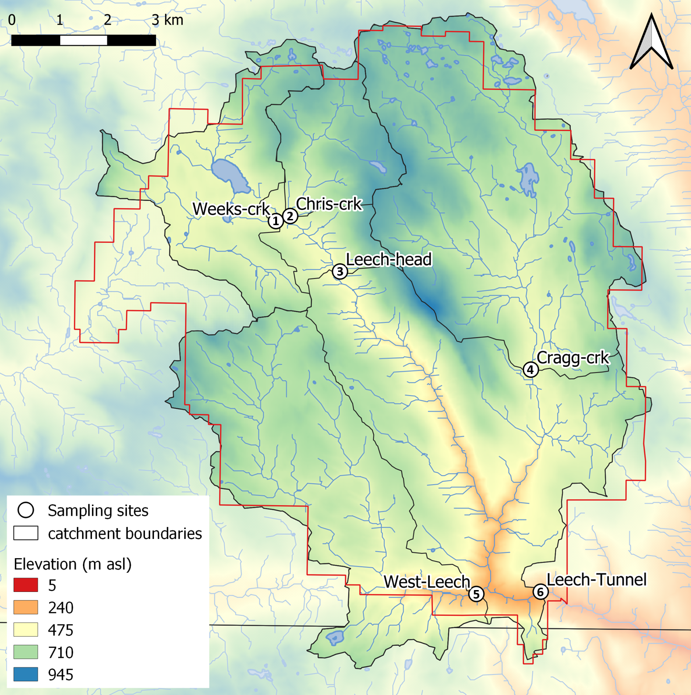
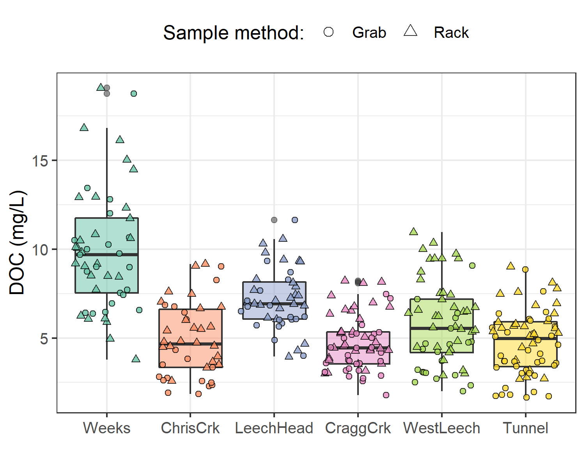
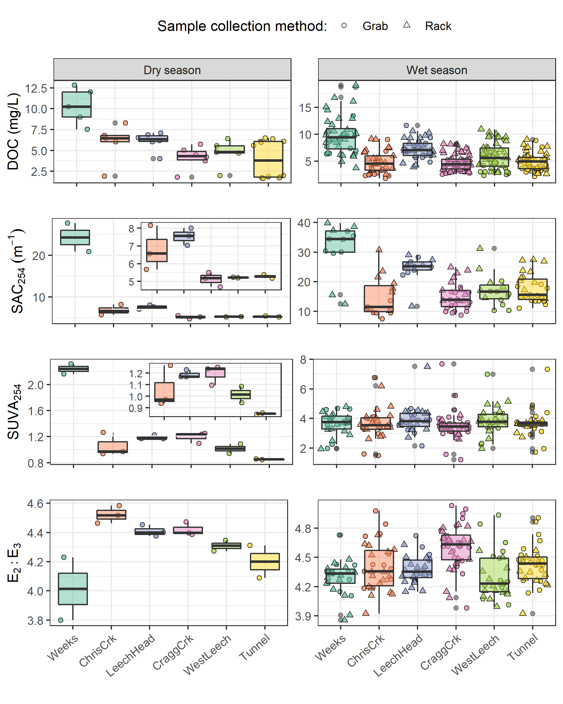
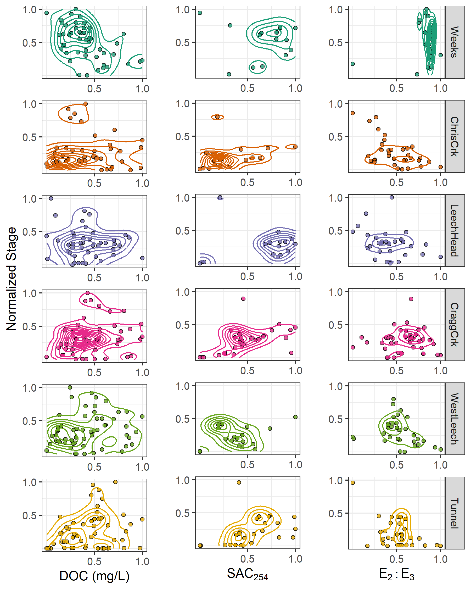

##	Leech Watershed Monitoring Sites & Driving Forces for Dynamics of Aqueous Natural Organic Matter

```{r, include = FALSE, package.startup.message = FALSE}

# load required packages
library(tidyverse)  # keep it tidy
library(readr)      # read in delimited files
library(knitr)      # for nice tables

knitr::opts_chunk$set(warning=FALSE, message=FALSE, echo=FALSE, fig.cap=TRUE)

```

\ 

### Synopsis

The previous chapter showed that across the Greater Victoria Water Supply Area (GVWSA), NOM shifted in character from aliphatic to aromatic from the dry to wet seasons and that event-based sampled had higher DOC concentrations than non-event Grab samples. A surprising range in NOM character was observed at the West Leech sub-basin (20.85 km^2^) monitoring site in the Leech WSA. While it wasn't clear why the ranges in NOM were greater at the West Leech Site compared to other streams of similar size (e.g. Leech-head, 20.59 km^2^ sub-basin, and Cragg creek 28.06 km^2^ sub-basin) one possibility was the difference in subsurface geology that set the West leech sub-basin apart from other synoptically sampled sites. 

\  

Watershed characteristics and conditions are  evaluated in this chapter to explore possible drivers for change in DOC and NOM across monitoring sites in the Leech WSA. Here, water sample results are interpretted to relate NOM concentration and character to conditions and watershed characteristic variables.

\  

```
intro section needs to lay out the problem you are trying to solve ie what are the drivers of DOC and NOM in the watershed and highlight some studies that have done this, and maybe the methods they have used.  
```

\  

### Methods 

Sample collection and analysis follow the methods detailed in Chapter 2. The study sites of this chapter focus only on the six Leech WSA monitoring sites. Nested catchments of the Leech River system that were equipped with Vertical Rack samplers included two headwater streams (Weeks and Chris Creek, sites 1 & 2), the head of Leech River below the confluence of the two headwater streams (site 3), two major tributaries that feed the Leech (Cragg creek and West Leech, sites 4 & 5), and Leech Tunnel (site 6) encompassed the entire Leech WSA drainage area above the point of diversion (Figure \@ref(fig:subbasinMap)).

\  

```{r subbasinMap, fig.cap = fig_cap}

fig_cap = "\\label{fig:subbasinMap} Monitoring sites in the Leech Water Supply Area (WSA). Sites are named and numbered, where the number indicates both the sequence of vertical rack installations as well as the relative progression from headwaters to mouth. Each research basin boundary (defined using each sampling site as the drainage outlet) is outlined in black, and the Leech WSA boundary is delineated in red."


```

\ 

Weeks Creek (site 1), had the greatest proportion of wetland and open water compared to the other sub-basins (Table \@ref(tab:WTScharacterSubbasinTable)). Chris Creek (site 2) and Cragg Creek (site 4) had no metasedimentary parent material (Argillite-Metagraywacke or Metagraywacke). Cragg Creek, draining from the east, was the only sub-basin with predominantly metamorphic parent material (Wark-Gneiss, 78%). West Leech (site 5) was the only sub-basin that did not have Wark-Gneiss nor Chert-Argillite-Volcanic groups as parent materials and was the only sub-basin of the Metchosin igneous complex (16% Methchosin-volcanics). Like Weeks basin (site 1), which also drains from the West, WestLeech is predominantly underlain by Argillite-Metagreywacke (metasedimentary parent material).       

\  

```{r WTScharacterSubbasinTable}
options(knitr.kable.NA = '')
read_csv("R-inputs_UBC-forWater-MSc_HMc/tables/methods_study-sites_basin-characteristics.csv", col_names = TRUE) %>% 
  knitr::kable(caption = "Summary of Leech Watershed Characteristics for Monitoring Site Sub-basins")
```

\ 

Random Forests were used to explore the watershed characteristics included in Table \@ref(tab:WTScharacterSubbasinTable), along with Leech WSA weather data (Chapter 2) and sample results (Chapter 4) to identify variables that were important predictors for DOC concentrations or NOM character. These predictors were explored as possible drivers for NOM change.

\  

Random Forests are a statistical tool for non-parametric regression, prediction, classification and assessment of variable importance [@Strobl2009]. A Random Forest is composed of a collection of decision trees is. Breiman's Random Forests (RF) is a machine learning algorithm for practical applications, which is popular for its accuracy in real-world systems [@Tyralis2019; @Biau2016] and does not require independence among samples (good news for analysis of nested catchments). In RF, a set of predictor variables (features) are used to predict the outcome of another variable (the predictant) through supervised learning algorithms, grouped as either regression or classification, depending on whether the variables are quantitative (i.e. numeric) or qualitative [@Breiman2001; @Tyralis2019]. 

\  

The RF algorithm learns from many independent Classification And Regression Trees (CARTs) which undergo bootstrap-aggregating ("bagging") with randomization; meaning that no single tree includes all the data, which reduces over-fitting and improves prediction performance [@Breiman2001; @Tyralis2019; @Biau2016]. In RF, many decision trees are created, each one generated by randomly sampling from the full data set (with replacement) and each tree is trained until only one possible solution remains (i.e. leaf nodes contain one deciding variable). For problems of regression (i.e. quantitative numeric variables, such as the data in this thesis), the forest prediction is the average of the individual trees predictions [@Tyralis2019; @Biau2016]. The relative importance of each feature is determined by assessing the accuracy of how well the predictant variable is anticipated in the absence or presence of that feature. 

\  


RF has been widely published in hydrologic and water resource research in recent years, particularly in streamflow and water quality studies [@Tyralis2019].
{{... refs}}

\  

The capability to evaluate variable importance metrics sets RF apart from other data-driven models that focus on prediction [@Tyralis2019]. Variable importance measure is a powerful part of Random Forests that evaluates the impact of each predictor variable on predicting a response variable. To assess the relative importance of sub-basin characteristics and conditions, the variable importance measure (VIM) was employed. VIM was assessed through the RF algorithm by removing predictor variables one at a time and measuring the increase in the mean square error (MSE) of prediction in their absence [@Breiman2001]. The other option for VIM assessment is evaluation of the increase in sum of square errors (SSE, node impurity), which may be more appropriate for categorical variables than quantitative variables. Mixing categorical and quantitative variables has shown bias towards variables with many categories, those with many missing values, and those that had strong cross-correlation to other variables [@Strobl2008]. 

\  

#### Variable refinement

Possible predictor variables for DOC concentrations and NOM character (i.e. SAC~254~ and E~2~:E~3~) included sub-basin characteristics of each of the six monitoring sites (Table \@ref(tab:WTScharacterSubbasinTable)) as well as weather and sampling conditions. To avoid undue bias [@Strobl2008] all predictor variables were numeric values (quantitative) and missing values were removed. 

\  

Parameters were filtered as much as possible to remove those that could cause spurious correlations (i.e. cross-correlated variables); variables with correlation coefficients greater than 0.65 were removed. Sub-basin slope was correlated with percent wetland cover and forest cover (± 0.74), and forest and wetland were also correlated (-0.97). Thus, wetland and forest percent cover were not included in VIM assessments, and median slope was. Interestingly, the sub-basin percent of Leech River formation parent material (meta-sedimentary, including Argillite Metagreywacke (mudstone) and Metagreywacke (meta-sandstone)) was correlated with logging history (percent of basin harvested 1980-2011). Anecdotally, the Leech River formation underlies the Weeks and West Leech sub-basins, both of which were heavily harvested and contained some of the last parcels of land purchased by the CRD from sustained harvest forest management companies. Parent-material variables were refined to metamorphic (Wark-Gneiss) and igneous (Metchosin Volcanics).  

The nine selected predictor variables included:

* metamorphic parent-material (Wark Gneiss)
* igneous parent material (Metchosin Volcanics)
* drainage area 
* median basin slope
* tree age (average, years)
* logging history (percent area harvested 1980-2011)
* antecedent 7-day temperatures 
* antecedent 30-day rain 
* sampling stage (min-max-normalized to account for differences between site installations)

\  

_note to self:_

* include event data (rain intensity, amount, duration)
* include antecedent snow also

As surface and subsurface characteristics were static values (e.g. basin slope, parent material), it was possible that they might be treated categorically so they were evaluated independent of dynamic weather data to see if there was any shift in calculated importance (as categorical variables mixed with numeric could lead to bias), but the relative results were unchanged so all groups (conditions and characteristics) were evaluated together.  

\  

RF is a black box, and as such a quality assurance variable of random numbers was also included with the watershed characteristics and conditions in the VIM assessment. After ensuring random numbers were calculated to have no predictor importance, the random-number variable was removed (not displayed in results). Following RF VIM analysis, the watershed variables with relatively more predictor importance were further explored by evaluating their relationships with NOM concentration and character. 

\  

#### Evaluating local extrema

Results in the previous chapter showed elevated NOM in event-based samples, to explore that relationship more deeply a peak-to-peak comparison was done to see if DOC peaked with stream stage. As DOC was quantified from discrete stream samples the temporal synchrony of peaks could not be evaluated in the same manner as stage, which was continuously recorded. However, each river sample was matched to stage and had a corresponding time-stamp, so inferences could be made based on relationships between peak DOC and stage. To determine if local DOC extrema (maxima and minima concentrations) were captured in conjunction with the local extrema of sampled flows (minima and maxima of sample stage), synchrony tests were run on sample results. For each site, results of samples were grouped by collection period and rain event to identify samples with extreme DOC concentrations as well as samples collected at extreme stage (max/min). Samples corresponding to maxima and minima DOC and stage were compared to determine how often they overlapped (i.e. was the sample with max DOC also the sample collected at the highest stage?).

\  


### Results of variable importance measure


\  

```{r RFplot, fig.cap = fig_cap}

fig_cap = "\\label{fig:RFplot} Variable importance for predicting NOM concentration (DOC), molecular aromaticity and size (E~2~:E~3~) and aromaticity (SAC~254~). Variable importance measures were extracted from randomForest (in R) and determined by mean decrease in prediction accuracy (increase in the mean square error) in the absence of the predictor variable (i.e. type 1 importance measure)."

knitr::include_graphics("R-outputs_UBC-forWater-MSc_HMc/figures/Ch4_RFplot-summary_DOC-E2E3-SAC254.png")
```


\  

```{r EventsTable3}
read_csv("R-outputs_UBC-forWater-MSc_HMc/tables/CH3_events-n-samples.csv") %>%  
  knitr::kable(digits = c(0,0,1,1,1,0,2,2,2,2), 
               caption = "*Rain events defined by a threshold of 50mm with 14-hour inter-event period*",
               col.names = c("Major event no.", "Start Date", "Duration (days)", "Rainfall (mm)", "Intensity (mm/hr)", "Samples collected", "mean DOC (mg/L)", "mean SAC~254~", "mean SUVA~254~", "mean E~2~:E~3~"))

```

\  

Eight of the 18 rain events were captured in the 2019 water year (2018-2019 wet season), the other ten in the 2020 water year. For each calender year in the study period, major rain events' minimum and maximum values of depth, duration and intensity were identified (Table \@ref(tab:MinMaxEvents)).   

\  

```{r MinMaxEvents}
read_csv("R-outputs_UBC-forWater-MSc_HMc/tables/Wx_Events-annual_min-max.csv") %>% 
  knitr::kable(digits = c(0,1,1,1,1,2,1),
               caption = "*Minimum and maximum rain event values *")
```

\  

An intense atmospheric river event hit the LWSA January 29-31 (event 17, Table \@ref(tab:EventsTable3)) and generated incredible flows across the Leech watershed (and across southern Vancouver Island). Streamflow at CraggCrk (site 4) and the Tunnel (site 6) over-topped the 2 m vertical racks and ripped the level-loggers out of their stilling wells. Luckily, the level-loggers were found downstream in February and (after drying the circuit boards) the data were successfully retrieved from both Odyssey loggers. Following event 17, changes to the stream-bed morphology were evident at LeechHead (site 3) in the form of gravel and cobble deposition, there was evidence of substantial coarse woody debris transport at ChrisCrk (site 2), and destruction to hydrologic monitoring equipment at the Leech Tunnel.

\  

...

\  

#### Spatial patterns in DOC & NOM

Samples with maximum DOC concentrations were captured by vertical racks at five of the six sites, except for the head of Leech River (LeechHead, site 3) where peak DOC happened to be collected as a Grab sample (Table \@ref(tab:SixDOCsummarySampleType)).

\  

```{r SixDOCsummarySampleType}
read_csv("R-outputs_UBC-forWater-MSc_HMc/tables/DOC-sixsite_summary_sample-type.csv", col_names = TRUE) %>% 
  knitr::kable(col.names = c("Site", "Sample type", "Sample count", "Mean DOC (mg/L)", "sd (± mg/L DOC)", "RSD (± %)", "Min. (mg/L)", "Median (mg/L)", "Max. (mg/L)"),
               digits = c(0, 0, 0, 1, 1, 0, 2, 2, 2),
               caption = "*Summary of DOC across the six LWSA installation sites including breakdown of sample type collected.*")
```

\  

Highest concentrations and variance in DOC occurred at the Weeks Main creek headwater site (Weeks, site 1), a sub-basin in the northwest of the Leech watershed which includes Weeks Lake and surrounding wetlands. Lowest average concentration and variance in DOC was recorded at Cragg Creek (CraggCrk, site 4), a mainstem river that drains the east sub-basin of the Leech watershed including Jarvis Lake and the western slopes of Survey Mountain. DOC concentration and variance at Leech River Tunnel (Tunnel, site 6) was somewhat between that at WestLeech and CraggCrk (Figure \@ref(fig:subbasinDOCbox)).

\  

```{r subbasinDOCbox, fig.cap = fig_cap}
fig_cap = "\\label{fig:subbasinDOCbox} *Dissolved organic carbon (DOC) concentrations across the Leech watershed over sixteen months, collected by standard grab sampling and on vertical racks (318 samples total).*"


```

\  

##### Seasonal patterns in DOC & NOM

DOC concentrations followed similar sinusoidal trends over time at each site, with amplitude of variation decreasing from upstream to downstream sites (Figure \@ref(fig:DOCloess)).     

```{r DOCloess, fig.cap = fig_cap}
fig_cap = "\\label{fig:DOCloess} *Trends in dissolved organic carbon concentrations over sixteen months (Oct 2018 to Feb 2020) at six sites across the Leech water supply area. Trend lines represents locally weighted smoothing ('loess' method of local polynomial regression).*"

knitr::include_graphics("R-outputs_UBC-forWater-MSc_HMc/figures/DOC_trend_bassin-type-facet_loess.png")
```

\  

The wet season was better represented than the dry by sample number and was therefore more interesting in terms of DOC concentration patterns. Additionally, the wet season water quality is most relevant with respect to water supply because that is when flows are great enough to allow diversion for inter-basin transfer. High flows during the wet season also showed increased DOC concentrations relative to low flows; stormflow samples collected on vertical Racks showed higher DOC than Grab samples manually collected across wet seasons (Figure \@ref(fig:subbasinSampletypeBox). 

\  

```{r subbasinSampletypeBox, out.width = "100%", fig.pos="h", fig.cap = fig_cap}
fig_cap = "\\label{fig:subbasinSampletypeBox} *Wet-season dissolved organic carbon concentrations grouped by site and sample collection method, where Grab samples were manually obtained (n = 109) and Rack samples were collected passively on vertical racks fit with siphon sampler bottles (n = 170).*"


```

\  

```{r wetDOCtable}
read_csv("R-outputs_UBC-forWater-MSc_HMc/tables/Ch3_DOC_wet-season_subbasin_MeanMinMax-SampleType.csv", col_names = TRUE) %>% 
  knitr::kable(digits = c(0,0,0,1,0,0,2,2), 
               col.names = c("Site", 
                             "Sample type",
                             "Sample count",
                             "Mean DOC (mg/L)", "sd (± mg/L DOC)", "RSD (± %)", 
                             "Min. (mg/L)", "Max. (mg/L)"),
               caption = "*Wet-season dissolved organic carbon concentrations by sample collection method across six monitoring sites in the LWSA.*")

```

\  

More samples were collected over the wet seasons than during the dry season due to event-based sampling and the relatively longer wet season period compared to dry (Table \@ref(tab:seasonalsamples)). Despite seasonal sample count differences, interesting spatial differences emerged when sample results were grouped by season (Figure \@ref(fig:seasonalNOM)). 


___what was interesting???___

 

\  

```{r seasonalsamples}
read_csv("R-outputs_UBC-forWater-MSc_HMc/tables/Ch3_NOM-seasonal-summary.csv", col_names = TRUE) %>% 
  knitr::kable(digits = c(0,0,0,1,1,1,1,1,1,2,2), 
               col.names = c("Site", "season", "count", 
                             "mean DOC (mg/L)", "sd (±)",
                             "mean SAC~254~ (m^-1^)", "sd (±)", 
                             "mean SUVA~254~ (L mg^-1^ m^-1^)", "sd (±)",
                             "mean E~2~E~3~", "sd (±)"),
               caption = "*Seasonal comparison of sample results by monitoring site*")
```

\  

```{r seasonalNOM, fig.cap = fig_cap}
fig_cap = "\\label{fig:seasonalNOM} *Sample results over the dry and wet seasons for DOC (as NPOC, mg/L) concentrations and indicators of NOM aromaticity and molecular size: SAC~254~(m^-1^), SUVA (L mg^-1^ m^-1^), E~2~:E~3~.*"


```

\  

The spectral indices indicated that, during the dry-season, Weeks (site 1) had much greater aromaticity compared to the other sites -- this may have been due to inputs from Weeks Lake and its surrounding wetlands. Aside from the highly aromatic character of NOM observed at Weeks in the dry months, E~2~:E~3~ suggests that aqueous NOM increased in aromaticity from upstream to downstream; while this quotient can also be indicative of molecular size (by an inverse relationship), the simultaneous decrease in DOC concentration indicates that molecular weight was not increasing downstream (Figure \@ref(fig:seasonalNOM)). SAC~254~ showed a similar increase in aromatic character from headwaters to mouth during the dry season, albeit the trend was less pronounced and there was a larger difference between ChrisCrk and LeechHead in SAC~254~ than in E~2~:E~3~. SUVA~254~, as could be expected, displayed a combination of DOC and SAC~254~ trends. DOC concentrations decreased from headwaters to mouth in both the wet and dry seasons, with the greatest variance at the head (Weeks) and mouth (Tunnel). 

\  

In the wet season, there was a spatial decrease in NOM aromaticity from headwaters to the Tunnel. In the headwater streams (sites 1 & 2), wet season NOM character was more aromatic at Weeks but had a broader range in spectral indices values at ChrisCrk. 

\  

#### Rising stage and NOM dynamics

Across the LWSA, fluctuations in river stage were temporally synchronized over the sixteen-month study period. Overall river responses among the six sites were confirmed to be congruent with high confidence (p-value < 0.001, based on 1050 randomizations) via Kendall's coefficient of concordance (Kendall's W = 0.9721) and Spearman's ranked correlation (ρ = 0.9666).

\  

```{r stageResponse}
read_csv("R-outputs_UBC-forWater-MSc_HMc/tables/Ch3_response_stage-summary.csv", col_names = TRUE) %>% 
  knitr::kable(digits = c(0,1,1,1,1,2,1), 
               col.names = c("site", 
                             "shortest time to peak stage (hr)", 
                             "longest time to peak stage (hr)", 
                             "smallest change in stage (cm)", 
                             "largest change in stage (cm)", 
                             "minimum rate of stage change (cm/hr)", 
                             "maximum rate of stage change (cm/hr)"),
               caption = "*Summary of stream response to precipitation events across the LWSA.*")
```

\  

Rates of change in stream response were calculated for each site to evaluate the fastest and slowest times to peak stage and relative magnitudes of change (Table \@ref(tab:stageResponse)). As expected, rate of change in stage was greatest at the Tunnel (site 6) and smallest at the Weeks headwater creek (site 1) which drains Weeks Lake and surrounding wetlands. 

\  

####   Spatiotemporal synchrony in local extrema: river stage and DOC


\  

Streams responded ___harmoniously___ to precipitation across the LWSA, with synchronous changes in stage, but was a similar harmony present for fluctuations in DOC or spectral properties? 


 Table \@ref(tab:synchDOCstage) summarizes proportions of common DOC and stage extrema samples, where 1 indicates perfect agreement between samples of extreme DOC and sample-stage, and zero indicates complete asynchrony between DOC and stage highs and lows. 

\  

```{r synchDOCstage}
read_csv("R-outputs_UBC-forWater-MSc_HMc/tables/synchrony_DOC-stage_extrema-simultaneous.csv", col_names = TRUE) %>% 
  knitr::kable(digits = c(0,3,3),
               caption = "*Proportion of samples for which peak DOC was found in the highest sample stage.*")
```

\  

Most samples showed congruence between highs and lows of DOC with stage. West Leech was the only site which had a greater proportion of common maxima compared to minima, all other sites had more frequent occurrence of low DOC occurring at low stage that they did of high DOC occurring at high stage. Overall, each site's samples showed majority, but not absolute, agreement in extremes of DOC-stage relationships (Figure \@ref(fig:extremaplot)).

\  

...

\ 

In general DOC concentations were lowest at the beginning of events and increased with a rise in stage.  Then identify instances where this was not the case and if you noticed dilution affects as the season progressed – you could just make a simple plot of stage vs DOC (ie x vs y plot) at each site and see how they group and see if this grouping changes through the season.

\  

...

\  

```{r extremaplot, out.width = "100%", fig.pos="h", fig.cap = fig_cap}
fig_cap = "\\label{fig:extremaplot} *Stage and samples collected, highlighting samples with maximum and minimum DOC concentrations for each rain event and collection period. Black vertical lines indicate a subset of samples that were assessed more closely.*"

knitr::include_graphics("R-outputs_UBC-forWater-MSc_HMc/figures/extrema_peakDOC-stage_plot.png")
```

\  

Changes in DOC during events varied from a little more than 1% DOC change to nearly 100% change during event response (Table \@ref(tab:DOCResponse)).

\  

___This table provides some useful info.  I would tru to look at individual events and pull out interesting facts like during this event, DOC concentration tripled or doubled or etc.  And then maybe present mean differences among events:___

\  

```{r DOCResponse}
read_csv("R-outputs_UBC-forWater-MSc_HMc/tables/response_DOC-summary.csv", col_names = TRUE) %>% 
  knitr::kable(digits = 1, 
               col.names = c("site", "lowest DOC in stormflow (mg/L)", "highest DOC in stormflow (mg/L)", "smallest change in DOC (mg/L)", "largest change in DOC (mg/L)", "smallest difference in DOC during stormflow (%)", "largest difference in DOC during stormflow (%)"),
               caption = "Summary of DOC Changes Within Stormflow Response to Precipitation Events Across the Leech WSA (Samples from Wet Season Only).*")
```

\

#### River stage, DOC & NOM

In general, DOC concentrations increased with increasing stage across the LWSA, thought the patterns were not necessarily linear and not always consistent. The relationships between spectral indicators of NOM character and stage showed tighter patterns than DOC concentration with stage at all sites, but again the relationships were not linear (Figure \@ref(fig:stageRelations)). ...___I don’t actually see that pattern at all in those figures – not sure you can do hysteresis plots with the data you have, but you should try___....

\  

```{r stageRelations, fig.cap = fig_cap}
fig_cap = "\\label{fig:stageRelations} *Relationships between river stage and sample DOC concentrations and NOM character. Data for each variable were normalized (min-max normalization) to clarify relative scales in each relationship. None of the relationships were were linear, some had more large variance and some variables remained consistent with changing stage.*"


```

\  


### Remove until you fix this

___this section is a bit whacky -- needs attention to Fix___
To get a better idea of stream surge NOM dynamics, well sampled rising limb stream surges were examined... 
* mid wet 2018
Trip 4 // rain event 3 [for sites 1-5] 
Trip 5 // rain event 4 for Tunnel

* earlier 2019
rain events 10 & 11 (maybe)


To better understand how timing of peak DOC varied among sites during the wet season, a subset of samples was selected for closer analysis (highlighted in Figure \@ref(fig:extremaplot) and expanded in Figure \@ref(fig:subsetExtremaplot)). The subset included samples from rain events 10-12; a subset deemed to be representative of DOC concentrations and rain events across the wet seasons, as there were no significant differences between DOC concentrations or rain events (amount and intensity) for this subset of samples compared to the rest of the study period (Table \@ref(tab:subbsetWilcox)). There were significant differences in UV~254~ absorbance for events 10-12 compared to the rest of the study period, therefore this subset was not considered representative of spectral trends overall and was only examined for DOC trends.

\  

```{r subbsetWilcox}
read_csv("R-outputs_UBC-forWater-MSc_HMc/tables/narrow-subbset_wilcoxon.csv", col_names = TRUE) %>% 
  knitr::kable(digits = c(0,0,4),
               caption = "*p-values from Wilcoxon tests comparing the subset of rain events 10-12 and those samples' DOC results to all other sampled rain events, showing no significant difference between the groups.*")
```

\  

* Rates of stream response (times to peak): Table \@ref(tab:stageResponsesubset)

\  

```{r stageResponsesubset}
read_csv("R-outputs_UBC-forWater-MSc_HMc/tables/response_stage-summary_subset.csv", col_names = TRUE) %>% 
  knitr::kable(digits = 1, 
               col.names = c("site", "max. rain intensity (mm/hr)", "min. rain intensity (mm/hr)", "shortest time to peak stage (hr)", "fastest time to peak stage (hr)", "smallest change in stage (cm)", "largest change in stage (cm)", "fastest time to peak (cm/hr)", "slowest time to peak (cm/hr)"),
               caption = "*Summary of stream response to precipitation events 10-12 across the LWSA.*")
```

\  

* DOC changes in stormflow
* range of DOC in each event: Table \@ref(tab:DOCResponsesubset) 

\  

```{r DOCResponsesubset}
read_csv("R-outputs_UBC-forWater-MSc_HMc/tables/response_DOC-summary_subset.csv", col_names = TRUE) %>% 
  knitr::kable(digits = 1, 
               col.names = c("site", "lowest DOC in stormflow (mg/L)", "highest DOC in stormflow (mg/L)", 
                             "smallest change in DOC (mg/L)", "largest change in DOC (mg/L)", "smallest difference in DOC during stormflow (%)", "largest difference in DOC during stormflow (%)"),
               caption = "*Summary of DOC changes within stormflow response to precipitation events 10-12 across the LWSA.*")
```

\  

```{r subsetExtremaplot, out.width = "100%", fig.pos="h", fig.cap = fig_cap}
fig_cap = "\\label{fig:subsetExtremaplot} *Stage and samples collected for the subset of samples collected over rain events 9-12, highlighting samples with maximum and minimum DOC concentrations for each rain event and collection period.*"

knitr::include_graphics("R-outputs_UBC-forWater-MSc_HMc/figures/narrow_events_9-12_peakDOC-stage.png")
```

\  

___end whacky section___

\

### Discussion


Increasing DOC on the rising limb indicates that source material is not limited and flux is driven by hydrologic connectivity; whereas source limited conditions likely drive NOM dynamics if DOC concentration decreases on the rising limb [@Zarnetske2018]. Analysis of rack samples clarifies the magnitude and direction of water quality changes in response to precipitation relative, which provides information about solute supply and hydrologic connectivity [@Vidon2008; @Abbott2018; @Creed2015; @Zarnetske2018].

* variability among sub-basins versus variability within each sub-basin over time
* timing of peaks and valleys of stage -- at 10 min resolution was there a lag from upstream to downstream?
* source versus transport limitations -- DOC in rising limb
* any hysteretic behaviour? (DOC over time by event)
* was there a relationship between rain event intensity/duration and DOC?
* use RF to determine relative importance of watershed characteristics as DOC predictors
* use RF to in-fill missing NOM absorbance data based on relationship with DOC??? Like Yeonuk did for CH4 flux

* 
\   

A pattern in DOC concentration during rising stage can provide information about NOM source and flux dynamics. Increasing DOC with rising stage suggests NOM transport dynamics were driven by hydrologic connectivity to an unlimited supply of source NOM. Alternatively, if DOC concentrations decrease with rising stage it's likely that the NOM source pool was limited (i.e. depletion of terrestrial allochthonous NOM supply)  [@Zarnetske2018].

\  

With additional Fire-weather data, it would be interesting to explore whether the variables for fire risk (humidity) were also predictors for increased NOM or DOC.

### Conculsions

* establishing connectivity among nested catchments as a baseline for experimental treatments (future)


Combining methods of vertical sampling racks with standard synoptic grab sampling provided useful time-stamped discrete river samples data that could be adapted and correlated to local rating curves to calculate loads of river material (e.g. nutrients, metals, organics, etc.) exported from monitored catchments. Material transport loads are important for management decisions and comprehensive system understanding. 

future:

* matched sample filling-stage with continuous logger stage could be combined with rating curve to determine mass transport or loading (future)