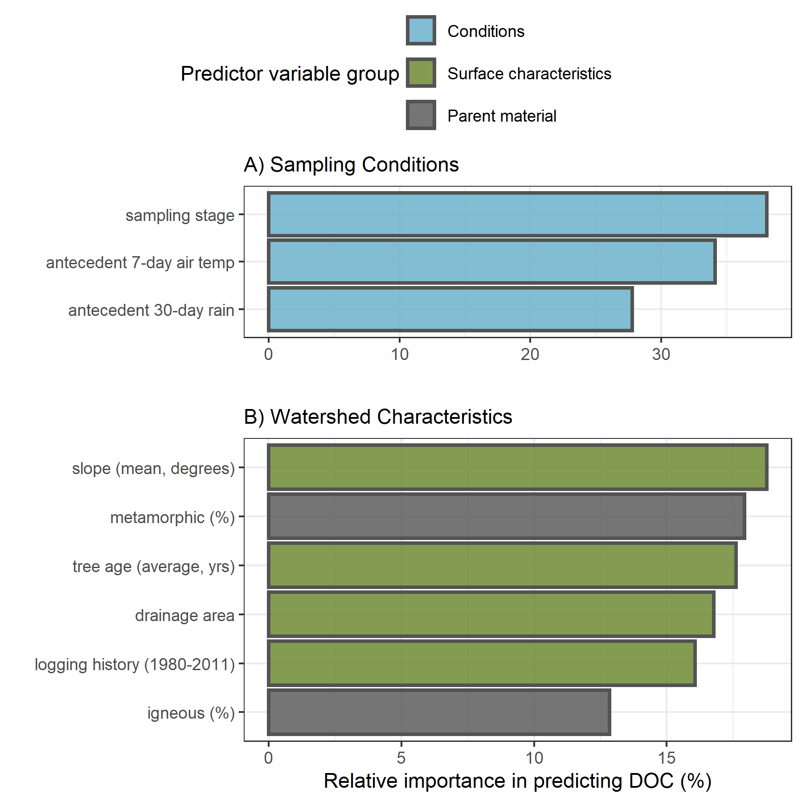
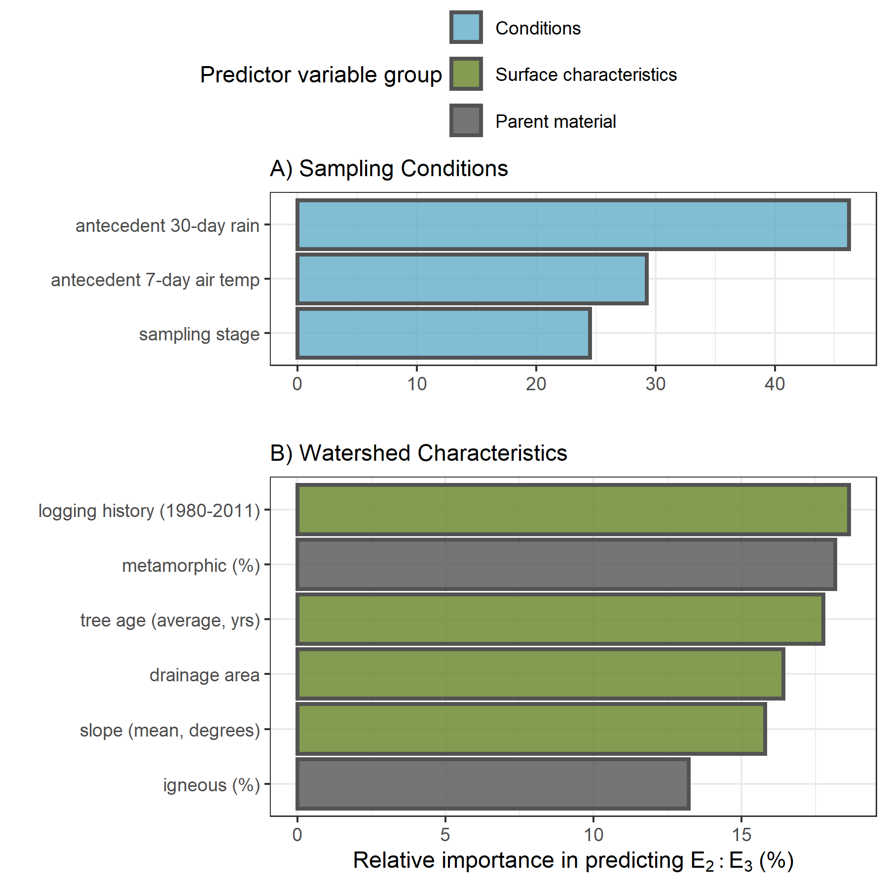
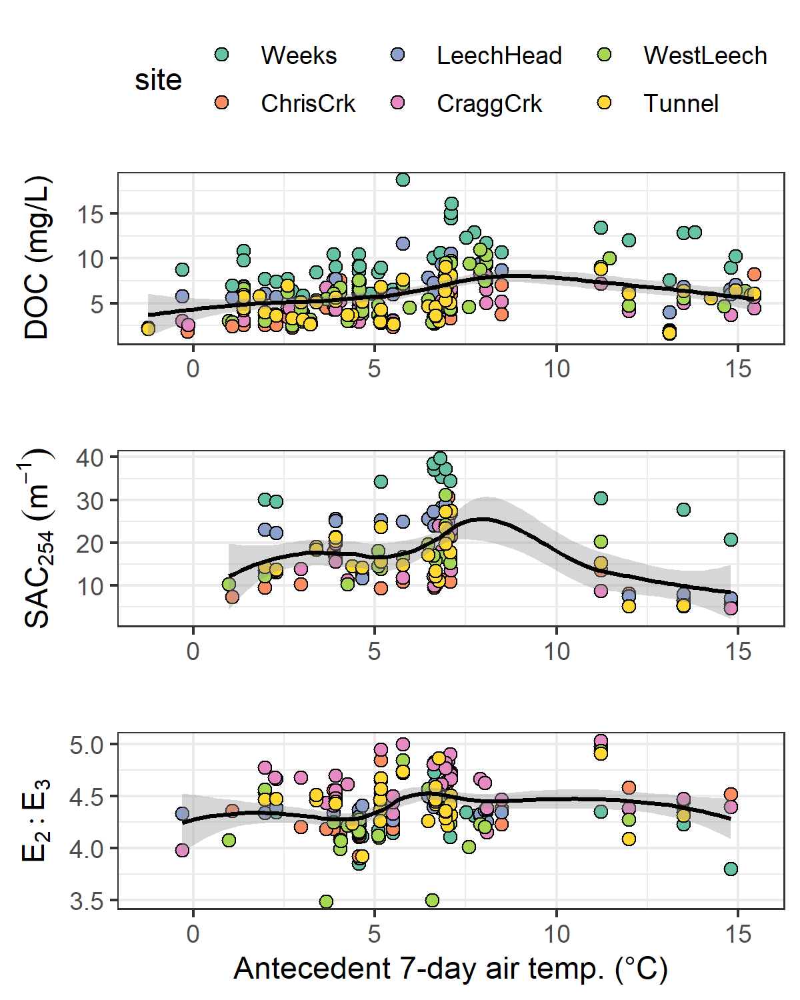

##	Watershed Characteristics and Sampling Conditions as Driving Forces for Aqueous Natural Organic Dynamics Across the Leech River Watershed 

```{r, include = FALSE, package.startup.message = FALSE}

# load required packages
library(tidyverse)  # keep it tidy
library(readr)      # read in delimited files
library(knitr)      # for nice tables

knitr::opts_chunk$set(warning=FALSE, message=FALSE, echo=FALSE, fig.cap=TRUE)

```

\ 

### Synopsis 

The previous chapter showed that across the Leech WSA and portions of the Sooke Reservoir watershed, the character of natural organic matter (NOM) shifted from predominantly aliphatic in the dry season to predominantly aromatic during the wet seasons. The seasonal character shift agreed with predictions of the river continuum concept (RCC), as did an observed spatial reduction in NOM molecular diversity from lower-order to higher-order streams [@Vannote1980; @Abbott2018; @Mosher2015; @Creed2015]. Results also confirmed that rising limb event-based Rack samples had higher DOC concentrations than non-rising limb samples. Elevated NOM in stormflow was expected (e.g. @Vidon2008; @Raymond2010) and is a key aspect of the pulse-shunt concept [@Raymond2016]. While seasonality and hydrologic pulses were expected to drive changes in aqueous NOM dynamics, differences in surfce and subsurface characteristics among the sub-basins could also be responsible for spatial variation in NOM dynamics.    

\  

Of the main tributaries to the Leech River mainstem, Cragg crk (draining from the east) had the lowest average DOC concentration and least aromatic reactive character, while West Leech NOM was higher in DOC concentration and more reactive NOM (Figure \@ref(fig:subbasinMap)). It was expected that that there would be differences in NOM concentration and character among monitoring sites, but it wasn’t immediately obvious why event-based NOM variances were greater at the West Leech site (20.85 km^2^ sub-basin) compared to other streams draining catchments of similar size (i.e. Leech-head, 20.59 km^2^ sub-basin; and Cragg crk 28.06 km^2^ sub-basin). As water quality is intrinsically linked to watershed characteristics, there may be a key feature (or combination of features) that operate in tandem with weather conditions to drive NOM concentration and character dynamics. This chapter evaluates watershed characteristics (e.g. land cover, parent material, slope) in concert with hydroclimatic conditions (e.g. antecedent rain, sampling stage) to identify possible explanatory variables for differences and drivers of change in NOM concentration and character across the six monitoring sites in the Leech WSA.

\  

### Methods 

#### Site details

This chapter focuses on the six Leech WSA monitoring sites (Figure \@ref(fig:subbasinMap)), which were equipped with Vertical Rack samplers. Nested catchments of the Leech WSA included two headwater streams, Weeks and Chris crk sub-basins (site 1, 11.5 km^2^  & site 2 , 5.9 km^2^); the head of Leech River ('Leech-head'), below the confluence of those two headwater streams (site 3, 20.6 km^2^ sub-basin); two major tributaries that feed the Leech, Cragg crk and West Leech sub-basins (site 4, 28.1 km^2^ & site 5, 20.9 km^2^), and Leech Tunnel (site 6) which encompassed drainage of the entire Leech WSA above the point of diversion (95.3 km^2^). Sample collection and analysis follow the methods detailed in Chapter 2. 

\  

```{r subbasinMap, fig.cap = fig_cap}

fig_cap = "\\label{fig:subbasinMap} Monitoring sites in the Leech Water Supply Area (WSA). Sites are named and numbered, where the number indicates both the sequence of vertical rack installations as well as the relative progression from headwaters to mouth. Each sub-basin boundary (defined using each sampling site as the drainage outlet) is outlined in black, and the Leech WSA boundary is delineated in red."

knitr::include_graphics("R-inputs_UBC-forWater-MSc_HMc/images/thesis_map_subbasin-sampling_with-numbers.png")
```

\ 

Surficial materials and soils in the Leech WSA are predominantly podzolic with approximately 50% of the parent material in each sub-basin composed of colluvial deposits with O-HFP development (orthic humo-ferric podzol). The second most dominant parent material for soil was till (morainal) with duric humo-ferric podzol (DU-HFP) soil development in all sub-basins except for West Leech, which had till-based O-HFP soils [@SoilsCanada2018]. DU-HFP differs from O-HFP by the presence of a strongly cemented layer (duric horizon) that is unlike the B horizon in O-HFP [@SoilScience2020]. Both DU-HFP and O-HFP are well drained, or moderately so, and O-HFP tends to be acidic (pH < 5.6) while DU-HFP is generally moderately acidic to neutral (pH 5.6 - 7.4) [@SoilsCanada2018]. There was a small amount of poorly drained terric mesisol (T.M., undifferentiated organic soil) present only in the Weeks crk sub-basin (Table \@ref(tab:WTScharacterSubbasinTable)). 

\ 

There were a few notable differences in subsurface geology between sub-basins (Table \@ref(tab:WTScharacterSubbasinTable)). West Leech was characterized by the absence of wark gneiss and chert argillite volcanic parent materials (0%), which were present in all other sub-basins. Both Weeks crk and West Leech sub-basins were dominated by argillite metagreywacke parent material (64% and 77%, respectively). West Leech was also underlain by metagreywacke (7%) and Metchosin volcanics (16%), which were absent in each of the other monitoring sub-basins. Cragg crk sub-basin (site 4) was underlain predominantly by metamorphic wark gneiss (78%) with no argillite metagreywacke parent material (0%). Metagreywacke parent materials are part of the metasedimentary Leech River Formation, where metagreywacke is meta-sandstone and argillite metagreywacke is more of a meta-mudstone [@Groome2003]. The Leech River Formation tends to be more erodible than wark-gneiss [@Ussery2015]. Chris crk and Cragg crk sub-basins had no metasedimentary parent material of the Leech River Formation.

\  

At the surface, Weeks crk sub-basin had the greatest proportion of wetland and open water compared to the other sub-basin sites (Table \@ref(tab:WTScharacterSubbasinTable)). Cragg crk sub-basin had the oldest average tree age (59 years). By area, the most heavily harvested basin since 1980 was the Chris crk sub-basin (63% harvested), then Leech-head and Cragg crk sub-basins (43% and 41% harvested, respectively). West Leech was the least harvested between 1980 and 2011 (26%), followed by Weeks crk sub-basin (28% harvested, but is also 7% open water and wetland), followed by the entire Leech Tunnel catchment area (34%).

\  

```{r WTScharacterSubbasinTable}
options(knitr.kable.NA = '')
read_csv("R-inputs_UBC-forWater-MSc_HMc/tables/Ch4_monitoring-site_basin_characteristics.csv", col_names = TRUE) %>% 
  knitr::kable(caption = "Summary of Leech watershed monitoring site sub-basin characteristics. Variables preceded by square brackets indicate sub-surface features of parent material ([PM]) and soil groups ([S]).")
```

\ 

The watershed characteristics included in Table \@ref(tab:WTScharacterSubbasinTable) were combined with Leech WSA weather data (Chapter 2) and sample results (Chapter 3) to identify possible explanatory variables that were driving changes in NOM concentration and character across the Leech WSA. Watershed characteristics and conditions were evaluated as possible predictors for NOM change using Random Forest algorithms. 

\  

#### Random Forests

Breiman's Random Forests (RF) is a machine learning algorithm which composes a statistical tool for non-parametric regression, prediction, classification and assessment of variable importance [@Breiman2001; @Strobl2009]. RF does not require independence among samples and is unique in its capacity to evaluate variable importance metrics [@Tyralis2019; @Biau2016]. The relative importance of each feature in RF can be determined by assessing the accuracy of how well the response variable (predictant) is anticipated in the absence or presence of each predictor feature (see Appendix G1 for extended background and details). Through the RF algorithm, variable importance measure (VIM) is assessed by removing predictor variables one at a time and measuring the decrease in prediction accuracy in their absence [@Breiman2001]. 

\  

##### Predictor variable refinement and quality assurance

RF variable importance measures (VIMs) were used to assess the relative importance of sub-basin characteristics and conditions as predictors of NOM concentration and character using the MSE method (type 1). Possible predictor variables for NOM concentration (i.e. DOC) and character (i.e. SAC~254~ and E~2~:E~3~) included sub-basin characteristics of each of the six monitoring sites (Table \@ref(tab:WTScharacterSubbasinTable)) as well as sampling stage and antecedent weather conditions. To avoid undue bias [@Strobl2008] all predictor variables were numeric values (quantitative) and missing values were removed. As cross-correlated predictors can cause biased VIM in RF, variables with correlation coefficients greater than 0.65 were omitted (though there is no standard definition for levels of correlation coefficient strengths, 0.65 seemed a reasonable threshold to separate moderate and more strongly correlated variables). 

\  

Sampling stages for each site were scaled (min-max-normalized) to account for differences between Vertical Rack installations and to allow for comparison between sites (example calculation in Appendix B). For antecedent rain and air temperatures, different periods of time were considered in exploratory data analysis. Intervals of 3, 5, 7, 14, 21 and 30 days prior to sample collection were evaluated for cross-correlations and relative VIM results.  

\  

RF is a black box; for that reason, a variable of random numbers was included in the VIM assessment as a means for quality assurance (QA). VIM assessment, with the QA variable, was completed for watershed characteristics and conditions to ensure that random numbers were not assigned any predictor importance. The QA variable was removed from final assessment and is not displayed in results (below). 

\  

Following RF VIM analyses, the variables with relatively greatest predictor importance were further explored by evaluating their one-on-one relationships with NOM concentration and character. Results of RF VIM assessment were also used to retrospectively infer importance of variables that were excluded from VIM due to their cross correlation(s). Where possible, important predictor variables were assessed for hysteretic behaviour. 

\  

#### Evaluating local extrema sample stage and DOC

Results in the previous chapter showed elevated NOM in event-based samples. To explore the relationship between DOC and event flows, a peak-to-peak comparison was done to see if DOC concentrations peaked with stream stage during events. As DOC was quantified from discrete stream samples the temporal synchrony of peaks could not be evaluated in the same manner as stage, which was continuously recorded. However, each river sample was matched to stage and had a corresponding timestamp, thus inferences could be made based on relationships between peak DOC and stage. To determine if local DOC extrema (maxima and minima concentrations) were captured in conjunction with the local extrema of sampled flows (minima and maxima of sample stage), manual synchrony tests were run on sample results. For each site, results of samples were grouped by collection period and rain event to identify samples with extreme DOC concentrations as well as samples collected at extreme stage (max/min). Samples corresponding to maxima and minima DOC and stage were compared to determine how often they overlapped (i.e. was the sample with max DOC also the sample collected at the highest stage?).

\  


### Foundational results of Random Forest refinement

Values for median basin slopes were the same across three sites, so mean slopes were selected instead, as means were unique to each sampling basin. Sub-basin percent wetland cover was correlated with slope (-0.73), as well as forest cover (-0.97). Thus, wetland and forest percent cover were not included in VIM assessments, and slope was. Interestingly, the percent of sub-basins underlain by the meta-sedimentary Leech River formation (including argillite-metagreywacke (mudstone) and metagreywacke (meta-sandstone)) was correlated (-0.83) with 30-year logging history (percent of basin harvested 1980-2011). The Leech River geologic formation underlies the Weeks crk and West Leech sub-basins, which were also the two sub-basins least harvested since 1980 (Table \@ref(tab:WTScharacterSubbasinTable)). These are the types of correlations that could cause spurious VIM bias in RF, because it's unlikely that the presence of meta-sedimentary parent material was the cause for these basins to be less harvested. Parent material variables were refined to metamorphic (wark gneiss) and igneous (Metchosin volcanics & gabbro stocks), which did not show cross-correlation to other predictor variables. As one might expect, soil materials were correlated with geologic parent materials (as well as with each other and logging history), thus soils were not included with RF VIM predictor variables.  

\  

The nine selected predictor variables for RF VIM assessment included:

* metamorphic parent-material (wark gneiss, percent of basin)
* igneous parent material (Metchosin volcanics & gabbro stocks, percent of basin)
* drainage area (km^2^) 
* mean basin slope (degrees)
* tree age (average, years)
* logging history (percent of basin harvested 1980-2011)
* antecedent 7-day air temperatures (°C, mean) 
* antecedent 30-day rain (mm, total)
* sampling stage (normalized)  

\  

The length of antecedent periods of 30 days for antecedent rain and 7 days for antecedent air temperature were chosen because (1) they were not cross-correlated with other predictor variables or each other and (2) each was more easily distinguished in VIM results than other interval options.

\  

Furthermore, the amount of rainfall in the 30 days prior to sample collection could be considered as an indicator of overall antecedent landscape wetness. A longer period of antecedent rain may be indicative of greater connectivity of streams to distant/deeper terrestrial environments. Using the same VIM parameters tuned for DOC prediction, 30-day antecedent rain was relatively more important than 7-day rain (15.3% vs. 12.8%) for predicting E~2~:E~3~, and 7-day antecedent air temperatures were more important than 30-day air temperatures (8.5% vs. 6.5%). This confirmed that relatively short-term temperatures (rolling 7-day mean) and relatively long-term rain (rolling 30-day sum) were appropriate selections for the RF VIM assessments.

\  

Surface and subsurface watershed characteristics were static values (e.g. basin slope, parent material), whereas sampling stage and antecedent weather were dynamic values (different for each sample). Although all variables were numeric, it was possible that RF might treat static values categorically [@Strobl2008], and RF bias can result from VIM assessment of combined categorical and quantitative predictor variables. So, sub-basin characteristics and conditions were evaluated independently as well as together to see if there was a shift in overall relative VIM ranking results.  


##### RF quality assurance

A variable of random numbers was included with watershed characteristic and sampling conditions as a method of quality assurance (QA) in using the RF variable importance measure (VIM). Because random numbers are not a real predictor of NOM concentration or character, the VIM assessment should rank the QA variable as the least important predictor and assign it negligible importance. Recall that there are two methods for evaluating variable importance in randomForest (RF): type 1 measures the mean decrease in accuracy and type 2 measures the decrease in node impurity [@Liaw2018]. For the Leech WSA data, both VIM methods were checked and type 2 (total decrease in node impurities from splitting on the variable) assigned the random number variable relatively high importance (ranked more important than a real variable) while type 1 (permutation on out-of-bag data) ranked the random number variable as least important with insignificant weight [@Liaw2018]. These results clarified that type 1 VIM was the best choice and suggests that quantitative data is best assessed for VIM by mean decrease in accuracy (MSE, type 1) rather than mean decrease in node impurity (SSE, type 2).

\  

##### RF variable groupings

Sub-basin characteristics and conditions were evaluated independently as well as together to see if there was a shift in VIM relative rankings due to the combination of static and dynamic values. While it was expected that the relative importance (as a percent) would shift when all predictant variables were combined, it was not expected that the relative ranking would change -- but it did. When dynamic conditions and static characteristics were combined for RF VIM, the relative ranking of several predictants were changed compared to when conditions and characteristics were analyzed separately (see Appendix G2, Figure \@ref(fig:RFallvars), for plots of combined predictors). These results suggest that static and dynamic predictor variables should be separated for RF VIM. Here, variables were separated based on whether they were static or dynamic with predictant variables. The combination of dynamic and static predictor variables appeared to create bias relative VIM ranking. The key was not whether the input was numeric, but rather if the predictant changed (or not) with the predictor. It seems that dynamic variables (ones that changed with the predictant) were treated for regression while static variables were treated categorically. VIM results are presented for the three predictants (DOC, SAC~254~, E~2~:E~3~) with conditions and characteristics grouped separately. 

\  

### Results

#### Random Forest variable importance

##### Predicting DOC concentration: NOM quantity 

Across the Leech WSA monitoring sites, the hydroclimatic condition with greatest influence on NOM concentration (DOC) was found to be sampling stage, followed by antecedent 7-day air temperature and then antecedent wetness (30-day rain). The top three watershed characteristic predictors for NOM concentrations were slope, percent of the basin underlain by metamorphic parent material and average tree age (Figure \@ref(fig:RFplotDOC)). 

\  

```{r RFplotDOC, fig.cap = fig_cap}

fig_cap = "\\label{fig:RFplotDOC} Variable importance for predicting NOM concentration (DOC) across six stream monitoring sites in the Leech River watershed. Variable importance measures were extracted from *randomForest* (in R) and determined by mean decrease in prediction accuracy (increase in the mean square error) in the absence of the predictor variable (i.e. type 1 importance measure)."


```

\  

##### Predicting SAC~254~: aromatic NOM reactivity

Like DOC, SAC~254~ was best predicted by sampling stage; unlike DOC, SAC~254~ was relatively more sensitive to antecedent rain than air temperatures. The top three watershed characteristic predictors for NOM aromaticity and reactivity (SAC~254~) were slope, percent of the basin underlain by metamorphic parent material (wark gneiss), and logging history (Figure \@ref(fig:RFplotSAC254)).


\  

```{r RFplotSAC254, fig.cap = fig_cap}

fig_cap = "\\label{fig:RFplotSAC254} Variable importance for predicting NOM molecular aromaticity (SAC~254~) across six stream monitoring sites in the Leech River watershed. Variable importance measures were extracted from *randomForest* (in R) and determined by mean decrease in prediction accuracy (increase in the mean square error) in the absence of the predictor variable (i.e. type 1 importance measure)."

knitr::include_graphics("R-outputs_UBC-forWater-MSc_HMc/figures/Ch4_RFplot_sep-SAC254.png")
```

\  

##### Predicting E~2~:E~3~: NOM molecular size & aromaticity

Sampling conditions VIM ranking for E~2~:E~3~ were the reverse of those for DOC. NOM molecular size and aromaticity (E~2~:E~3~) was best predicted by antecedent 30-day rain, followed by 7-day air temperatures and then sampling stage. The top three watershed characteristic predictors for E~2~:E~3~ were percent of the basin logged from 1980-2011, followed by percent underlain by metamorphic parent material (wark gneiss) which was nearly tied with average tree age (Figure \@ref(fig:RFplotE2E3)).

\  

```{r RFplotE2E3, fig.cap = fig_cap}

fig_cap = "\\label{fig:RFplotE2E3} Variable importance for predicting NOM aromaticity & molecular size (E~2~:E~3~) across six stream monitoring sites in the Leech River watershed. Variable importance measures were extracted from *randomForest* (in R) and determined by mean decrease in prediction accuracy (increase in the mean square error) in the absence of the predictor variable (i.e. type 1 importance measure)."


```

\  

#### Predictors in relation to NOM quantity and quality 

When all variables were assessed together, sampling conditions were relatively more important than watershed characteristics for predicting NOM concentration and character across the Leech WSA monitoring sites (Appendix G2, Figure \@ref(fig:RFallvars)). 

\  

##### Sampling conditions

The ranking of relative importance for sampling conditions were in reverse order for DOC (stage, temp, rain) and E~2~:E~3~ (rain, temp, stage). Like DOC, SAC~254~ was influenced most by sampling stage; and like E~2~:E~3~, SAC~254~ was more sensitive to antecedent wetness than antecedent air temperatures. The relative sensitivity of NOM concentration to stream stage points to hydrologic mass transport, whereas the sensitivity to antecedent wetness points to the importance of hydrologic connectivity between the terrestrial landscape and stream system for NOM molecular character. 

\  

###### Sampling stage

Stream stage at the time of sample collection was the most important condition predictor variable for DOC and SAC~254~. Concentration of DOC increased with increasing stage up to approximately 60% of maximum sampling stage at each site. The same relationship was seen (albeit more dramatically) for SAC~254~ (Figure \@ref(fig:VIMstage)). This indicates that as stream levels increased, so too did NOM concentration and aromaticity. This was expected based on results in Chapter 3 that showed higher concentrations of more aromatic NOM in Vertical Rack samples compared to (inter-event) Grab samples. The threshold level (~0.6 of peak stage) points to a change where increasing stage led to dilution rather than mobilization.

\  

Stream stage was the least important sampling condition for predicting E~2~:E~3~ (below antecedent rain and air temperature), and the two variables were inversely related. This pattern supports results of stage in relation to SAC~254~ and shows that as stream stage increased across the Leech WSA, so too did NOM molecular size & aromaticity. Like SAC~254~, E~2~:E~3~ and stage had a weaker relationship around 60-75% of maximum stage (indicated by the greater uncertainty in the loess trend line, Figure \@ref(fig:VIMstage)) which indicates a point at which aromaticity no longer increased with stage. While there were fewer high-flow samples collected compared to mid-range and low-flow samples, this apparent sampling stage threshold may indicate depletion of a terrestrial NOM aromatic pool, or could suggest that the most aromatic sources had reached peak connectivity to the streams and NOM could get no more humic in nature. 

\  

```{r VIMstage, fig.cap = fig_cap}

fig_cap = "\\label{fig:VIMstage} Sampling stage as a predictor for NOM concentration (DOC) and character (SAC~254~ & E~2~:E~3~). Each plot includes a loess trend line."

knitr::include_graphics("R-outputs_UBC-forWater-MSc_HMc/figures/Ch4_RF_stage.png")
```

\  

###### Antecedent 7-day air temperature

Antecedent 7-day air temperature (mean air temperature for the 7-day period prior to sample collection) ranked second most important for predicting DOC and E~2~:E~3~ and was the least important (third) sampling condition for predicting SAC~254~. The concentration, reactivity, aromaticity and molecular weight of NOM increased with antecedent air temperature up to approximately 10°C (Figure \@ref(fig:VIMtemp)). DOC and 7-day temperature were positively related in the wet season with no obvious relationship in the dry season (Appendix G2, Figure \@ref(fig:RFtempDOC)) and too few spectral samples were collected in the dry season to shed light on seasonal trends in NOM character with antecedent temperatures.

\  

```{r VIMtemp, fig.cap = fig_cap}

fig_cap = "\\label{fig:VIMtemp} Antecedent 7-day air temperature as a predictor for NOM concentration (DOC) and character (SAC~254~ & E~2~:E~3~) across six monitoring sites in the Leech watershed. Each plot includes a loess trend line."


```


\  

###### Antecedent 30-day rain

Antecedent 30-day cumulative rain (i.e. antecedent wetness) was the sampling condition calculated to have the greatest relative importance in predicting E~2~:E~3~, second-most importance for SAC~254~ and was the least important sampling condition for predicting DOC concentration. As antecedent 30-day rain increased to approximately 150 mm, there was an apparent decrease in NOM aromaticity and molecular size (E~2~:E~3~ increased); above ~150 mm (~25% of maximum antecedent 30-day rain), NOM aromaticity and molecular size increased. At approximately 300 mm of 30-day antecedent rain, NOM aromaticity and molecular size appeared to become less variable (Figure \@ref(fig:VIMrain)). 

\  

Fewer sample results were obtained for SAC~254~, with a data gap for samples collected between 200 mm and 400 mm of 30-day antecedent rain; therefore, the pattern of SAC~254~ with antecedent wetness was less precise (large uncertainty, Figure \@ref(fig:VIMrain)). For these available data, rain accumulation in the 30 days prior to sample collection was positively related to SAC~254~ up to approximately 150 mm and SAC~254~ was relatively low with antecedent 30-day rain above 400 mm. Though the relationship was non-linear, there was a slight initial increase in DOC with increasing antecedent wetness, followed by a gradual decline in DOC with increasing accumulated rain (Figure 18). Lower order streams (Weeks, Chris crk, Leech-head) showed a steeper decline in DOC with increasing 30-day antecedent rain (site-specific plot in Appendix G2, Figure \@ref(fig:VIMrainSites)). 

\  

```{r VIMrain, fig.cap = fig_cap}

fig_cap = "\\label{fig:VIMrain} Antecedent 30-day rain as a predictor for NOM concentration (DOC) and character (SAC~254~ & E~2~:E~3~) across six monitoring sites in the Leech watershed. Each plot includes a loess trend line."

knitr::include_graphics("R-outputs_UBC-forWater-MSc_HMc/figures/Ch4_RF_rain.png")
```

\  

These patterns of antecedent wetness with DOC and E~2~:E~3~ suggest that smaller, more aliphatic NOM was flushed through the Leech system when antecedent wetness was low (i.e. near the onset of the wet season). As rains continued, streams had greater connection to more aromatic NOM source pools (humic material, possibly from upland sources). The slight decline in aromatic DOC with antecedent wetness (above approximately 350 mm in 30 days) suggests exhaustion of humic NOM source pools and a shift to dilution. These results largely support seasonal characteristic shifts described in Chapter 3, which follow prediction of the River Continuum Concept.   

\  

##### Watershed characteristics

Of watershed characteristics, the top predictors for NOM concentration and character were a combination of mean sub-basin slope, metamorphic parent material (percent of basin), logging history (percent of basin harvested 1980-2011), tree age (average) and/or drainage area. 

\  

###### Sub-basin slope

Sub-basin slope ranked most important as a predictor for DOC and SAC~254~. Across the six monitoring sites, the relationship between slope and these two variables was not linear but in general, lower sub-basin slope was related to higher DOC. A pattern appeared, where the six monitoring basins were grouped in pairs with two sites each between mean slopes of 9°- 10°, 10°- 11° and 11°- 12°. Within these pairs, the basin with lower slope had slightly greater NOM aromaticity, reactivity and concentration (Figure \@ref(fig:VIMslope)). Slope was negatively correlated to percent wetland (-0.73), and wetlands are known to be linked with high DOC concentrations and greater NOM aromaticity [e.g. @@Oliver2017; @Aiken1995; @Agren2008; @Musolff2018]. Indeed, SAC~254~ indicated higher aromaticity in sub-basins with lower mean slope (Figure \@ref(fig:VIMslope)). While slope was not ranked as a strong predictor for E~2~:E~3~, the relationship between the two largely agreed with results for SAC~254~.

\  

```{r VIMslope, fig.cap = fig_cap}

fig_cap = "\\label{fig:VIMslope} Sub-basin mean slope as a predictor for NOM concentration (DOC) and character (SAC~254~ & E~2~:E~3~) across six monitoring sites in the Leech watershed."


```

\ 

###### Parent material (metamorphic wark gneiss)

The percent of wark gneiss underlying each sub-basin was ranked as the second most important watershed characteristic for predicting each of DOC, SAC~254~ and E~2~:E~3~. Wark gneiss was inversely correlated (-0.92) to the metasedimentary Leech River Formation. 
 
\  

For the five sites that were underlain by some proportion of wark gneiss, stream DOC concentrations decreased with increasing percentage of this metamorphic surficial deposit. While more metamorphic material corresponded to lower DOC, the absence of wark gneiss in West Leech sub-basin did not correspond to the highest DOC concentration (Figure \@ref(fig:VIMwark)). NOM character had a similar pattern to concentration, where greater metamorphic parent material corresponded to lower NOM aromaticity and reactivity (SAC~254~), but its absence did not correspond to the sub-basin with the lowest SAC~254~ (Figure \@ref(fig:VIMwark)). E~2~:E~3~ showed that greater metamorphic parent material corresponded to lower NOM aromaticity and molecular weight (higher E~2~:E~3~ values) and, in contrast to DOC and SAC~254~, the sub-basin with the greatest molecular weight NOM (lowest mean E~2~:E~3~) did correspond with the absence of wark gneiss (Figure \@ref(fig:VIMwark)).

\  

```{r VIMwark, fig.cap = fig_cap}

fig_cap = "\\label{fig:VIMwark} Percent of each sub-basin underlain by wark gneiss (metamorphic parent material) as a predictor for NOM concentration (DOC) and character (SAC~254~ & E~2~:E~3~) across six monitoring sites in the Leech watershed."

knitr::include_graphics("R-outputs_UBC-forWater-MSc_HMc/figures/Ch4_RF_metamorphic.png")
```

\  

###### Logging history and mean tree age 

Logging history (percent of basin harvested from 1980-2011) was ranked first among watershed characteristics for predicting E~2~:E~3~ and third for predicting SAC~254~. Average tree age was third in variable importance for predicting E~2~:E~3~ and DOC. Tree age and logging history were examined together because average tree age was partially due to the history of forest harvest.

\  

Sub-basin area harvested between 1980 and 2011 was positively related to E~2~:E~3~ at four of the six sub-basin sites. West Leech, Weeks, Leech Tunnel, and Cragg crk sub-basins showed decreasing NOM molecular weight and aromaticity (increasing E~2~:E~3~) with increasing area harvested. However, the sub-basins of Chris crk and Leech-head (just downstream) had higher harvested area (ergo younger trees) and did not match this pattern of less aromatic, lower molecular weight NOM with greater harvest history (Figure \@ref(fig:VIMloggingtree)). The sites with more aromatic and higher molecular weight NOM were not clearly linked to average tree age (Figure \@ref(fig:VIMloggingtree)).

\  

Chris crk and Cragg crk sub-basins had the youngest and oldest trees, respectively; yet, these two sites had very similar averages for NOM concentration and character, though Chris crk had slightly higher molecular weight NOM. While Cragg crk sub-basin had, on average, the oldest trees (likely due to old growth maintained on Horton Ridge), it was West Leech that was the least-harvested sub-basin of the six monitoring sites. Cragg crk and West Leech had similar mean DOC and SAC~254~ values but mean E~2~:E~3~ was different; Cragg crk had greater molecular weight NOM than West Leech (but their error bars overlapped entirely). It is possible that the GIS data for forest harvest and tree age were missing some details, or that the average tree age was not a good indicator variable.

\  

```{r VIMloggingtree, fig.cap = fig_cap}

fig_cap = "\\label{fig:VIMloggingtree} Sub-basin mean tree age as a predictor for NOM concentration (DOC) and character (SAC~254~ & E~2~:E~3~) across six monitoring sites in the Leech watershed."

knitr::include_graphics("R-outputs_UBC-forWater-MSc_HMc/figures/Ch4_RF_logging-tree-age.png")
```

\  

##### Variable importance Summary

Of the watershed characteristics examined, the percent of each basin with metamorphic wark gneiss parent material appeared to be the most relevant and was a common predictor variable to each of DOC, SAC~254~ and E~2~:E~3~. The absence of wark gneiss was not related to the site with highest DOC, despite DOC decreasing with increasing metamorphic representation. Because subsurface materials were largely cross-correlated, the observed patterns with wark gneiss may point to more nuanced relationships that couldn't be teased out in this RF analysis because of cross-correlations with other predictor variables. It could be that what is observed as a negative relationship with wark gneiss is a positive relationship between NOM and another parent material, probably the schist-like Leech River Formation. 

\ 

Across the Leech WSA, warm and wet conditions were an important driver for NOM concentration and character. Antecedent rain was positively related to DOC concentrations and sample aromaticity up to a threshold of approximately 150 mm of 30-day antecedent rain, at which point NOM concentration and aromaticity/reactivity/molecular weight declined with increasing wetness. This suggested a threshold at which dilution overtook NOM transport. In a similar way, NOM aromaticity increased with sampling stage up to approximately 60-75% of maximum stage at each site.

\  

#### Warm and wet: seasonal patterns and rain events

Moisture and temperature, important to each of the three predictant variables, corresponded to different seasons. Given the evidence of strong seasonality for NOM character (Chapter 3), a comparison between wet and dry season sample results was used to assess spatial difference between seasons for DOC, SAC~254~ and E~2~:E~3~. 

\  

During the dry-season, SAC~254~ and E~2~:E~3~ indicated that Weeks crk had greater aromaticity compared to the other sites. Aside from the highly aromatic character of NOM observed at Weeks, E~2~:E~3~ suggested that aqueous NOM in the dry-season had increasing aromaticity from upstream to downstream sites; while this quotient can also be indicative of molecular size (by an inverse relationship), the simultaneous decrease in DOC concentration indicates that molecular weight was not increasing downstream (Figure \@ref(fig:seasonalNOM)). SAC~254~ showed a similar increase in aromatic character from headwaters to mouth during the dry season, albeit the pattern was less pronounced and there was a larger difference between Chris crk and Leech-head in SAC~254~ than in E~2~:E~3~. These results show that dry season aqueous NOM increased in aromaticity from upstream to downstream sites. 

\  

The dry season pattern of decreasing DOC from low- to high-order streams was apparent in the wet season also. But the wet season spatial pattern of E~2~:E~3~ was almost the reverse of what was seen in the dry season. While dry season samples' E~2~:E~3~ showed increasing aromaticity from upstream to downstream, the wet season E~2~:E~3~ showed decreasing aromaticity from head to mouth. These seasonal differences support a shift in NOM source material, and/or a shift from NOM processing in the dry season and transport/dilution effects in the wet season.      

\    

```{r seasonalNOM, fig.cap = fig_cap}
fig_cap = "\\label{fig:seasonalNOM} Sample results over the dry and wet seasons for [A] dissolved organic carbon concentrations (DOC), [B] specific absorbance coefficient at 254 nm (SAC~254~, m^-1^), and [C] the quotient of SAC~250~/SAC~365~ (E~2~:E~3~). Note that each season has a different y-scale to clarify patterns. The inset in panel B is an enlargement  of SAC~254~ for all sites except Weeks crk."

knitr::include_graphics("R-outputs_UBC-forWater-MSc_HMc/figures/Ch4_NOM-DOC_boxplots-by-season.png")
```

\  


##### Rising stage and aqueous NOM dynamics 

Antecedent moisture and/or sampling stage was important for each of the three predictant variables evaluated though RF VIM. Across the Leech WSA, the highest DOC concentration occurred in the earliest events of each wet season (events 1 & 9, Table \@ref(tab:EventsTab)), while NOM reactivity (SAC~254~) peaked later, during the third major event in the 2019/2020 wet season (event 11, Table \@ref(tab:EventsTab)). Maximum NOM aromaticity and molecular size (E~2~:E~3~) occurred during the last major events, at the end of each wet season (events 3 & 17, Table \@ref(tab:EventsTab)).

\  

```{r EventsTab}
read_csv("R-outputs_UBC-forWater-MSc_HMc/tables/CH4_events-n-samples.csv") %>% 
  select(-c("mean SUVA")) %>% 
  knitr::kable(digits = c(0,0,1,1,1,0,2,2,2), 
               caption = "Rain events (with a threshold of 50 mm and 14-hour inter-event period) defined by Vertical Rack sample collection across the six monitoring sites of the Leech WSA",
               col.names = c("Major event no.", "Start Date", "Duration (days)", "Rainfall (mm)", "Intensity (mm/24-hr)", "Samples collected", "mean DOC (mg/L)", "mean SAC~254~", "mean E~2~:E~3~"))

```

\  

Streams across the Leech WSA responded harmoniously to precipitation with synchronous changes in stage. Over the full sixteen-month study period, stage changes at the six monitoring sites were synchronized and confirmed to be congruent with high confidence (p-value < 0.001, based on 1050 randomizations) via Kendall's coefficient of concordance (Kendall's W = 0.9721) and Spearman's ranked correlation (ρ = 0.9666). Rates of change in stream response were calculated for each site to determine the fastest and slowest times to peak stage and relative magnitudes of stage change (Table \@ref(tab:stageResponse)). As expected, stage changed at the fastest rate in the highest order stream, the Tunnel site, and slowest rate at Weeks crk.

\  

```{r stageResponse}
read_csv("R-outputs_UBC-forWater-MSc_HMc/tables/Ch3_response_stage-summary.csv", col_names = TRUE) %>% 
  knitr::kable(digits = c(0,1,1,1,1,2,1), 
               col.names = c("site", 
                             "shortest time to peak stage (hr)", 
                             "longest time to peak stage (hr)", 
                             "smallest change in stage (cm)", 
                             "largest change in stage (cm)", 
                             "minimum rate of stage change (cm/hr)", 
                             "maximum rate of stage change (cm/hr)"),
               caption = "Summary of stream response to rain events across six monitoring sites in the Leech Water Supply Area")
```

\  

To determine if a similar harmony was present for fluctuations in DOC or spectral properties, the proportion of common DOC and stage extrema samples were calculated (Table \@ref(tab:synchDOCstage)). A proportion of 1 indicates perfect agreement between samples of extreme DOC and sample stage, and zero indicates complete asynchrony between DOC and stage highs and lows. Most samples showed congruence between highs and lows of DOC with stage. West Leech was the only site which had a greater proportion of common maxima compared to minima, all other sites had more frequent occurrence of low DOC occurring at low stage that they did of high DOC occurring at high stage. 

\  

```{r synchDOCstage}
read_csv("R-outputs_UBC-forWater-MSc_HMc/tables/synchrony_DOC-stage_extrema-simultaneous.csv", col_names = TRUE) %>% 
  knitr::kable(digits = c(0,4,4),
               caption = "Proportion of samples for which the highest dissolved organic carbon (DOC) concentration was collected at the highest sample stage")
```

\  

Four of the six site's samples showed majority, but not absolute, agreement in extremes of DOC-stage relationships; Chris crk and Leech-head each had the same proportion of common maxima and minima. In general DOC concentrations were lowest at the beginning of events and increased with a rise in stage (Figure \@ref(fig:extremaplot)). Early in the wet season, peak stage was more associated with minimum DOC, and later in the wet season peak stage was more associated with peak DOC. These results suggest dilution of NOM early in the wet season, and enrichment later in the wet season. 

\  

```{r extremaplot, out.width = "100%", fig.pos="h", fig.cap = fig_cap}
fig_cap = "\\label{fig:extremaplot} Stage and samples collected, highlighting samples with maximum and minimum DOC concentrations for each rain event and collection period"

knitr::include_graphics("R-outputs_UBC-forWater-MSc_HMc/figures/extrema_peakDOC-stage_plot.png")
```

\  

For events where several samples were collected, the change in DOC concentration varied from a little more than 1% to nearly 100% (Table \@ref(tab:DOCResponse)). The smallest event-based concentration change occurred at Leech head (1.2%) and the Tunnel (1.4%). The largest event-based change in concentration was observed at West Leech (94.6%), and the second largest change occurred at Chris crk (82% change in DOC).  

\  

```{r DOCResponse}
read_csv("R-outputs_UBC-forWater-MSc_HMc/tables/response_DOC-summary.csv", col_names = TRUE) %>% 
  knitr::kable(digits = 1, 
               col.names = c("site", "lowest DOC in stormflow (mg/L)", "highest DOC in stormflow (mg/L)", "smallest change in DOC (mg/L)", "largest change in DOC (mg/L)", "smallest difference in DOC during stormflow (%)", "largest difference in DOC during stormflow (%)"),
               caption = "Summary of DOC changes within stormflow response to precipitation events across the Leech WSA (samples from wet season only) ")
```

\  


### Discussion 

The sampling conditions and watershed characteristics included in Random Forest variable importance measures (RF VIM) showed that across the six monitoring sites in the Leech WSA, stream NOM concentration and character were influenced by warm and wet conditions and the parent material in each basin. No model is perfect, and the relative importance derived from RF VIM in this chapter was limited to the data provided and the assumptions associated with those data. Based on the variables assessed, sampling stage and antecedent wetness ranked among the most important variables for predicting NOM quantity and quality, as did the percent of wark gneiss underlying each basin.  
 
\  

NOM quantity and quality in each sub-basin was inversely realted to representation of metamorphic wark gneiss parent material, but the absence of wark gneiss did not correspond to the site with greatest NOM quantity or reactive and aromatic character. The patterns observed between NOM and metamorphic parent material suggests a more complex relationship between watershed characteristics and NOM dynamics. The metasedimentary Leech River formation (argillite metagreywacke and metagreywacke) was inversely correlated (-0.92) to wark gneiss in the monitoring basins and wasn't included in RF VIM analyses. There may be an effect on aqueous NOM associated with a combination of parent materials and soil development that wasn’t full elucidated in this analysis.      

\  

Antecedent wetness is an important watershed driver for NOM export as it influences flow paths and hydrologic connectivity to source material [@McMillan2018]. Solute supply and hydrologic connectivity can be interpreted through the magnitude and direction of water quality changes in response to precipitation [@Vidon2008; @Abbott2018; @Creed2015; @Zarnetske2018]. In the Leech WSA, stage changed in response to precipitation and there was an apparent threshold (near 0.75 of peak sampling stage) that suggested a point at which terrestrial aromatic NOM pools had reached peak connectivity to the monitored streams. 

\  

A pattern in DOC concentration during rising stage can provide information about NOM source and flux dynamics. Increasing DOC with rising stage suggests NOM transport dynamics were driven by hydrologic connectivity to an unlimited supply of source material. Alternatively, if DOC concentrations decreased with rising stage it's likely that the NOM source pool was limited [@Zarnetske2018]. Event-based rising limb changes in DOC concentration varied from a little more than 1% (at Leech-head and the Tunnel) to 95% (at West Leech). 

In a west coast small-basins (< 1 km^2^) study in the H. J. Andrews Experimental Forest (Oregon, CA) pre-storm DOC was measured at three sites as 1-2 mg/L with increases to 5-7 mg/L (~200% increase) during events [@Hood2006]. In the Leech WSA, DOC concentrations at the onset of stream rise were higher (2-6 mg/L) as were peak rising limb concentrations (6-16 mg/L), resulting in relative rising limb DOC changes bring less dramatic (<100% increase) than Hood et. al found [-@Hood2006]. While the same relative magnitude of change in DOC was not measured in the Leech WSA, the methods used by Hood et al [-@Hood2006] included continuous monitoring as opposed to this study which quantified discrete samples. It's possible that the changes in DOC that were not captured (i.e. in the stage between vertically staggered Rack bottles) could have shown greater deviation. Or, the magnitude of change in the Leech WSA could simply be lower than in H.J. Andrews, possibly due to realtively higher baseline DOC concentrations.

\  

Across the Leech WSA, stream samples with the highest DOC were collected at the highest sampled stage 83% of the time; and there was an 80% co-occurrence of low DOC with low sampling stage. These results indicate an overall pattern of increasing DOC with stage, suggesting that approximately 80% of the time streams were hydrologically connected to a rich supply of NOM. Furthermore, there was a positive relationship between sample aromaticity and stage at the Tunnel, where streamflow from all sub-basins' is integrated; when coupled with the observed stage-DOC dynamics, this indicates that the supply of NOM was humic in origin approximately 80% of the time.

\  

In three of the six monitoring sites, low DOC was more often collected at low stages than high DOC was at high stages; the opposite was found at West Leech, where concentration and stage had a greater proportion of common maxima compared to common minima. The headwater sub-basin sites of Chris crk and Leech-head had the same proportions of samples with common maxima and minima of DOC and stage. These patterns changed across the wet season. Peak stage was more often associated with minimal DOC early in the wet season, whereas DOC tended to peak with stage (or close to peak stage) later in the wet season. These observed temporal changes in NOM concentration with stage is additional evidence of early wet-season NOM being limited in supply and subject to rapid flushing, while late wet-season NOM in streams was drawn from a more sustainable pool of source material. The apparent stage and wetness threshold for NOM concentration and character (approximately 75% of maximum stage and about 150 mm of antecedent 30-day rain), suggested a point at which humic NOM sources either reached maximum connectivity with the streams, or that the aromatic source pools were depleted. Aanother possible explanation for the concentration-stage threshold could be indicative of a transition point in the event hydrograph from soil water contributions to throughfall and overland flow [@Penna2019].

\  

The quantity of stream NOM was greatest early in the wet season, with peak DOC concentrations found in the first event-based samples; while NOM aromaticity, reactivity and molecular weight peaked later in the wet season. Coupled with the other results, this indicates that early wet-season rain events exported high concentrations of aliphatic NOM from sources that were likely autochthonous and quickly depleted. Between the wet and dry season, there were opposite spatial patterns for NOM molecular size and aromatic character. NOM aromaticity increased from upstream to downstream in the dry season, while the wet season showed decreasing aromaticity from head to mouth. The different seasonal patterns in NOM quality support a change in source material and a shift from NOM processing in the dry season to dilution effects in the wet season.

\  

### Summary and future directions

The parent material in each sub-basin was important for NOM dynamics. Although the precise relationship was not completely resolved, it was evident that a greater proportion of metamorphic parent material corresponded to lower concentrations of less aromatic and less reactive NOM in streams. 

\  

Approximately 80% of the time during hydrologic pulses in the wet season, monitoring sites were connected to rich supplies of humic NOM. For a shorter time, early in the wet-season, streams exported high concentrations of aliphatic NOM from autochthonous sources that were subject to rapid flushing and were quickly depleted. Streams were hydrologically connected to sustainable pools of allochthonous source material later in the wet season. It appeared that when streams were near 75% of their maximum stage (therefore, approximately 0.75 of peak flow) humic source pools reached maximum connectivity with the streams.

\  

In the future, Vertical Rack sampling (and matched sample filling-stage with continuous logger stage) could be combined with a rating curve to determine mass transport or loading. Combining methods of vertical sampling racks with standard synoptic grab sampling provided useful time-stamped discrete river samples data that could be adapted and correlated to local rating curves to calculate loads of river material (e.g. nutrients, metals, organics, etc.) exported from monitored catchments. Material transport loads are important for management decisions and comprehensive system understanding. 

\  

It was assumed that the arithmetic means of precipitation measured at Chris Creek and Martin's Gulch Fire Weather Stations were representative of conditions across the Leech WSA and mean rain data were applied to all monitoring sites (Chapter 2). However, it is entirely likely that the West Leech sub-basin experienced different weather than the rest of the watershed; observations during field work (Appendix C2) support this possibility. When a weather station is constructed in the West Leech basin, more precise explorations could be conducted with respect to antecedent wetness and water quality dynamics. 

\  

With additional weather data (e.g. humidity), it would be interesting and informative to explore whether the variables associated with increased fire risk or mass wasting might also be predictors for NOM dynamics (or any other water quality parameter of interest). The security of drinking water supply quality depends on weather, which is also a major player in other risks to the forested watershed. With greater understanding of the conditions and characteristics that drive water quality dynamics, an index system could be created that incorporates predictors for drinking water supply quality with those for forested watershed threats (e.g. wildfire or windthrow).  

\  
