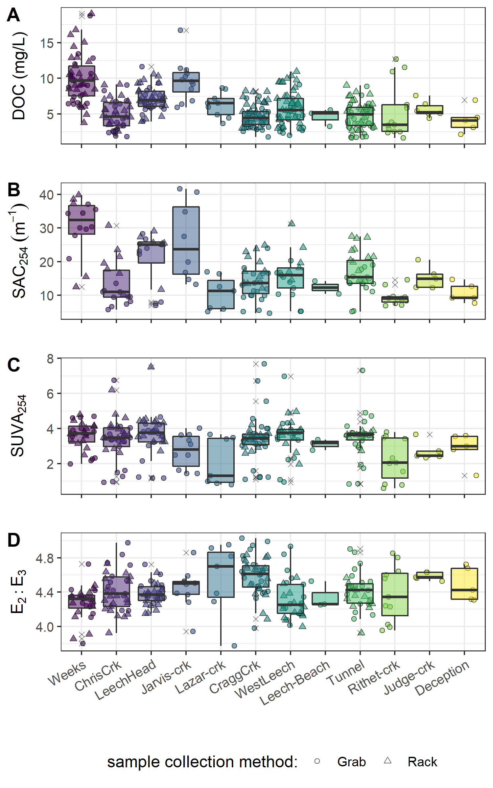
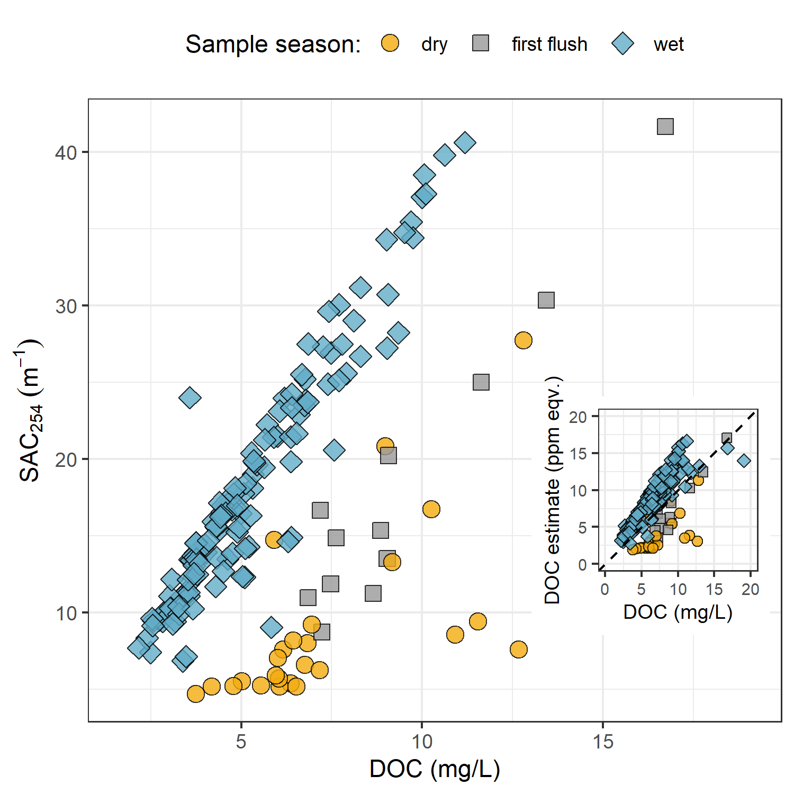

##	Spatial and temporal patterns in DOC & NOM

```{r, include = FALSE, package.startup.message = FALSE}

# load required packages
library(tidyverse)  # keep it tidy
library(readr)      # read in delimited files
library(knitr)      # for nice tables

knitr::opts_chunk$set(warning=FALSE, message=FALSE, echo=FALSE, fig.cap=TRUE)

```

### Synopsis

The first objective for the surface water sampling methods defined in Chapter 2 was to describe spatial and temporal patterns and variation of DOC concentrations and NOM character across the Greater Victoria water supply area (GVWSA, refer to Chapter 2, Figure \@ref(fig:sampleSitesMap) for map), and to identify the influence of seasonality on concentration of DOC and character of NOM.

\  

### Results

From October 2018 to February 2020, across the GVWSA 426 river samples were collected and analyzed for DOC, and 318 of those samples were analyzed for NOM by UV-Vis (Table \@ref(tab:samplecount)). Fewer samples were analyzed for UV-Vis properties than for DOC concentration due to method evolution at the start of the project and instrument-sharing limitations. Of the samples collected and analyzed, DOC data were filtered and reduced by 9.2% (to 387 samples) during Hold-time quality control checks (described in Chapter 2) and UV-Vis data were reduced by 19.5% (to 256 samples). Quality control resulted in a 9% reduction in UV-Vis data and an additional 10.5% data loss was unfortunately caused during instrument maintenance. Analysis of calibration verification standards resulted in an average analytical accuracy of 10.8% (n=20).  

\  

```{r samplecount}
read_csv("R-outputs_UBC-forWater-MSc_HMc/tables/summary_samples-count.csv", col_names = TRUE) %>% 
  knitr::kable(caption = "*Summary of samples collected*") 
```


\  

Samples were also measured for phosphate concentration using a colourimetric (ascorbic acid) orthophosphate test kit (HACH PO-19); each water sample had phosphate concentration below detectable limits (0.1 mg/L).

\  

#### Spatial patterns in DOC & NOM 

The headwaters sites of Weeks creek (11.52 km^2^ sub-basin) and Jarvis creek (1.51 km^2^ sub-basin) had the highest DOC concentrations of the twelve sites (means of 9.9 mg/L and 9.7 mg/L, respectively). The lowest DOC concentrations were recorded at the sampling sites of the Rithet crk sub-basin (11.12 km^2^) and the Leech Tunnel sub-basin (95.3 km^2^), though their means were not unusually low (5.4 mg/L and 4.8 mg/L, respectively) compared to other streams of 3rd order or above (overall average 5.18 mg/L). The greatest range in DOC concentrations was measured at the Rithet crk site, which had a mean of 5.4 ± 3.9 mg/L (relative standard deviation, RSD, of 71%). The site with the second highest DOC range was the West Leech sub-basin (20.85 km^2^) with mean DOC of 5.8 ± 2.4 mg/L (41% RSD).  

\  

Mean DOC concentrations were similar between the Sooke WSA main tributaries of Judge crk (8.33 km^2^ sub-basin) and Rithet crk (mean DOC of 5.7 ± 1.1 mg/L and 5.4 ± 3.9 mg/L). Comparing these Sooke WSA main tributary sites to the future supplemental supply (Leech Tunnel site), mean DOC was similar among the three, but slightly higher in the Sooke WSA than at the Leech Tunnel (4.8 ± 1.8 mg/L). Overall, DOC concentrations decreased from low-order headwater streams to higher-order downstream sites (Table \@ref(tab:synopticDOCdata), Figure \@ref(fig:synopticBox)). 

\  

```{r synopticDOCdata}
read_csv("R-outputs_UBC-forWater-MSc_HMc/tables/Ch2_DOC-Synoptic-summary.csv", col_names = TRUE) %>% 
  knitr::kable(digits = c(0, 0, 0, 1, 1, 0, 2, 1, 1),
               caption = "*Dissolved Organic Carbon Concentrations Across Twelve Synoptically Sampled River Sites in the Greater Vistoria Water Supply Area*",
               col.names = c("Site", "Description", "Count", 
                             "Mean DOC (mg/L)", "sd (±)", "Relative sd (± %)", 
                             "Min. DOC (mg/L)", "Median DOC (mg/L)", "Max. DOC (mg/L)"))

``` 

\  

```{r synopticBox, fig.cap = fig_cap}

fig_cap = "\\label{fig:synopticBox}*Synoptic sampling results of dissolved organic carbon concentrations from 12 sites (arranged left to right, from upstream to downstream). Samples were collected from Oct 2018 to Feb 2020. Symbol type indicates samples were collected by siphon samplers on Vertical Racks (triangle) or synoptic Grab sample (circle), outliers are indicated with an x.*"


```

\  

Similar to DOC, there was an overall reduction in NOM aromaticity and/or molecular size From upstream to downstream sites (Figure \@ref(fig:synopticBox)). The sub-basin with the greatest aromaticity was:  

extrema:
lowest aromaticity: Cragg (SAC254 4.69)
lowest aromaticity: Cragg (E2E3 5.03) 

greatest aromaticity: Lazar (E2E3 3.77)
greatest aromaticity: Jarvis (SAC254 41.7)

means:
(least aromatic)
Lazar (SAC254 10.6)  
Cragg == Judge (E2E3 4.59) //  close 2nd: Lazar (E2E3 4.55) 

(most aromatic)
Weeks (SAC254 30.3)
Weeks (E2E3 4.27)


\  

```{r synopticNOMdata}
read_csv("R-outputs_UBC-forWater-MSc_HMc/tables/Ch2_NOM-Synoptic-summary.csv", col_names = TRUE) %>% 
  knitr::kable(digits = c(0, 0, 0, 1, 1, 2, 2, 2, 1, 2, 2), 
               caption = "*Spectral properties of natural organic matter (NOM) character across twelve synoptically sampled river sites*",
               col.names = c("Site", "Description", "Count", 
                             "Mean SAC~254~ (m^-1^)", "sd (±)", 
                             "SAC~254~ Min. (m^-1^)", "SAC~254~ Max. (m^-1^)",
                             "Mean E~2~E~3~", "sd (±)", 
                             "E~2~E~3~ Min.", "E~2~E~3~ Max."))
``` 

\ 

Several comparisons can be made among the twelve synoptically sampled river sites . Presented here are comparisons between the Leech WSA and Sooke WSA (cross-basin), upstream to downstream, and evaluation of sampling methods with respect to nested catchments and DOC ranges. 

\ 

As the Leech River Tunnel is the likely point of diversion for future inter-basin transfers from Leech water supply area (LWSA) to the Sooke Reservoir basin, the Tunnel is the effective outlet of the LWSA where runoff from each nested catchment is integrated. From a headwaters perspective, water from Weeks and ChrisCrk sub-basins is integrated at LeechHead, which is just below the headwaters' confluence; similarly, Jarvis and Lazar creek sub-basins are ultimately integrated at CraggCrk site. However, there was a greater distance between CraggCrk and its headwaters' sampling sites compared to LeechHead and its headwaters' locations (see Figure \@ref(fig:sampleSitesMap)). 

\  

Within these nested catchments, sampling methods were evaluated through three comparison sets to assess whether a Rack sampler combined with Grab sampling downstream of a confluence captured the same range in DOC concentrations as synoptic Grab sampling alone at upstream sites (Figure \@ref(fig:abcDOCbox)). Synoptic Grab samples from the headwater sites of Weeks and ChrisCrk were compared to Rack and Grab samples from below their confluence at LeechHead site (Figure \@ref(fig:abcDOCbox), plot A). Similarly, Grab samples collected at the headwaters of Cragg Creek, Jarvis and Lazar creeks, were compared to all samples at the CraggCrk monitoring site (Figure \@ref(fig:abcDOCbox), plot B). Higher order rivers were also examined in a similar way, comparing Rack and Grab samples at the Tunnel to Grab samples collected upstream at LeechHead, CraggCrk and WestLeech sites (Figure \@ref(fig:abcDOCbox), plot C).

\  

```{r abcDOCbox, fig.cap = fig_cap}
fig_cap = "\\label{fig:abcDOCbox}*Grab sample DOC at upstream locations compared to Rack and Grab sample DOC below their confluence(s). A and B show grab samples from headwaters (HW) compared to downstream (DS) monitoring sites; C shows upstream river sites (US) compared to mainstem monitoring.*"

knitr::include_graphics("R-outputs_UBC-forWater-MSc_HMc/figures/Ch2_DOC-boxplot_up-down_metcompar.png")
```

\    

Below the confluences of headwaters sites, the combination of Rack and Grab sampling did not capture the ranges of DOC observed in upstream Grab samples alone. LeechHead, below the confluence of Weeks and ChrisCrk, collected DOC concentrations that were close to the average of the two headwaters. The variance obtained by combining Rack and Grab samples downstream was not the same as upstream Grab sampling variance (Levene's test for homoscedasticity p-value = 3.8 x 10^-5^). Similarly, Rack and Grab samples collected at CraggCrk did not cover the same DOC variance as Grab sampling at the headwaters (Levene's p-value 0.0011). Unlike LeechHead, which had moderate DOC concentrations relative to it's two headwaters, samples collected at CraggCrk had DOC that was lower than concentrations in either of it's headwater sites. The differences in DOC attenuation between these two sets can be attributed to different reach lengths between headwaters' confluence and the downstream monitoring sites; where LeechHead was very close to the headwaters' confluence and CraggCrk was considerably further from it's headwaters' sampling locations.

\  

When higher order rivers were examined in a similar upstream-Grab/downstream-Rack'n'Grab comparison, the combination of Rack and Grab samples at the Leech Tunnel site did capture the DOC ranges observed in Grab samples at three upstream river sites (Figure \@ref(fig:abcDOCbox), plot C). Levene's test for homogeneity of variance (homoscedasticity) confirmed that there was no difference in DOC variance in the downstream Rack/Grab combination results compared to Grab-only from upstream (p-value 0.165). Similar trends were seen for SAC~254~ but not E~2~:E~3~ (Appendix ####).  

\  

___a lot going on in this section – pull out what is most important in a final paragraph.___

\  
#### Temporal patterns in DOC & NOM

Over sixteen months, DOC concentrations followed similar patterns across the synoptic sampling sites (Figure \@ref(fig:DOCloessAll)). DOC was highest early in the wet season and progressively decreased through the fall and winter, reaching minimum concentrations in the spring, and progressively increasing over the summer. 


```{r DOCloessAll, fig.cap = fig_cap}
fig_cap = "\\label{fig:DOCloessAll} *Trends in dissolved organic carbon concentrations over sixteen months at twelve sites across the Greater Victoria Water Supply Area. Trend line shows locally weighted smoothing (loess, local polynomial regression).*"

knitr::include_graphics("R-outputs_UBC-forWater-MSc_HMc/figures/Ch2_DOC-loess-trend.png")
```

\  


While there was an apparent sinusoidal trend in DOC over the seasons sampled (Figure \@ref(fig:DOCloessAll)), there was almost no difference between the mean DOC concentration between the wet and dry seasons (6.13 vs 6.14 mg/L, Table \@ref(tab:seasonDOCcount)). However, there were far fewer samples collected in the dry season (55) than during the wet season (311).

\  

```{r seasonDOCcount}
read_csv("R-outputs_UBC-forWater-MSc_HMc/tables/Ch2_seasonal-samples-DOC-summary.csv", col_names = TRUE) %>%
  knitr::kable(digits = c(0,0,2,2,0,1,1,1),
               caption = "*Seasonal sample collection and DOC summary from twelve synoptic sampling sites*",
               col.names = c("Season", "Sample count", "Mean DOC (mg/L)", "sd (± mg/L DOC)", "RSD (± %)", "Min. (mg/L)", "Median (mg/L)", "Max. (mg/L)"))
```

\  

The wet season was most heavily sampled at the six monitoring sites, where Rack samplers more than doubled the number of samples that would have been collected through Grab sampling alone. Isolating DOC results to the six monitoring sites during only the wet season allows for comparison of Vertical Rack sampling methods to standard synoptic Grab sampling (Figure \@ref(fig:wetSeasonDOC), Table \@ref(tab:wetDOCcountInstallsites)). 

\  

```{r wetDOCcountInstallsites}
read_csv("R-outputs_UBC-forWater-MSc_HMc/tables/Ch2_seasonal-InstallSamples-DOC-summary.csv", col_names = TRUE) %>%
  knitr::kable(digits = c(0,0,2,2,0,1,1,1),
               caption = "*Wet season DOC by sample collection method at the six monitoring sites*")
```

\  

```{r wetSeasonDOC, fig.cap = fig_cap}
fig_cap = "\\label{fig:wetSeasonDOC} *DOC from each monitoring site grouped by collection method (synoptic Grab vs. Vertical Rack samples).*"

knitr::include_graphics("R-outputs_UBC-forWater-MSc_HMc/figures/Ch2_subbasin_GvsR_WETseason-ridgeplot.png")
```

___what else do you see in these figures?  It looks to be Crag and Chris are very similar, and Weeks, Leach head and West Leach are very different from each other, and the Chris, Cragg, West leach and the tunnel___

\  

Vertical Racks captured higher DOC concentrations than synoptic Grab sampling alone and the two methods collected samples with comparable variance (Table \@ref(tab:wetDOCcountInstallsites)). 

\  

##### Seasonal changes in NOM character

To evaluate if (and when) molecular character of river samples shifted, DOC concentrations (NPOC) were compared to specific absorbance coefficients at 254 nm (used by the spectro::lyser to estimate DOC). DOC concentration was correlated with SAC~254~ during the wet season, but the relationship was not as tight in the dry season or during the transition from dry to wet seasons in the first-flush event. Characteristics of wet-season samples caused positive bias in absorbance-based DOC estimates, while dry-season sample characteristics lead to negative bias in UV-based DOC estimates (Figure \@ref(fig:seasonalDOCest)). The separation of wet and dry season samples suggests that river NOM had more aromatic character (more humic-like, allochthonous NOM) during the wet-season than during the dry-season.

\  

```{r seasonalDOCest, fig.cap = fig_cap}
fig_cap = "\\label{fig:seasonalDOCest} *Dissolved organic carbon measured directly (as NPOC) plotted against concentration estimated via UV-Vis spectroscopy, grouped by sampling season. The dashed lined indicates best fit (1:1), and the inset shows the relationship between NPOC and SAC at 254 nm, a key absorbance that informs the UV-estimated DOC concentration.*"


```

\  

### Discussion

___This section is pretty thin…. You need to look at the dataset and results and pull out what is interesting, what is  in the norm and what his means – how does this compare to the literature? Other areas across BC, the country etc, what appears to drive variation, possible differences etc.  What do you think is happening to DOC as it moves from US to DS.  How could this be further investigated and then set the story up for the next chapter.___


\  

Vertical Racks were a consistent and comparable method of reproducible sample collection that proved important for passively capturing higher DOC concentrations which were not observed through Grab sampling alone. These results are in agreement with other studies that found higher DOC concentration on the rising limb of the hydrograph compared to non-event samples (e.g. [@Yang2015; @Raymond2016; @Raymond2010]). Rack sampling more than doubled the number of samples that would have been collected through Grab sampling alone. Therefore, the Vertical Rack method was a useful tool for collection of event-based samples with increased sampling frequency. Questionable sample hold-times resulted in a few occasions when logistics or high water limited safe immediate retrieval of Vertical Rack samples. However, the Vertical Rack method employed in this project allowed for calculation of sample hold-times, quality-control evaluation or data for processing of acceptable samples only.  

\  

From 366 quality controlled river water samples collected over 16 months, DOC ranged from 1.6 to 19.1 mg/L (5.7 mg/L median) with mean DOC of 6.1 ± 2.9 mg/L. The relative standard deviation for DOC in each of the synoptically sampled sites was at least 24% and at most 71%, indicating a wide range of variance among the sites. Overall, DOC decreased in concentration from upstream to downstream and followed a sinusoidal trend over time.  

\  

Seasonality was evaluated by operationally separating time into wet and dry seasons, where the wet season corresponded with weather events that generated streamflow response sufficient enough for Vertical Racks to collect samples and the dry season was confined to Grab sampling only (no river responses). While the absolute magnitude of DOC varied between sites, the general temporal trends were similar across the study area. DOC was highest in the early wet season, then progressively decreased through the wet season. DOC was lowest during the coldest periods, and concentrations of DOC increased over the summer. Spectroscopic analyses indicated that the wet season NOM was predominantly humic (i.e., aromatic) content and the summer carbon was derived from more aliphatic NOM sources. These observations support a shift in NOM source pools from autochthonous in the dry (summer) period to allochthonous in the wet season when the landscape was more connected to the river systems. The seasonal shifts observed in this project agree with the shift from autochthonous to allochthonous NOM that is predicted by the river continuum concept [@Vannote1980; @Meyer1983]. 

\ 

At the future point of diversion (5th order river), it was found that the combination of Vertical Rack and Grab samples collected the same variance in DOC that was observed in Grab samples upstream across three 4th order river sites (LeechHead, CraggCrk, WestLeech). This indicates that well-represented water quality monitoring for the LWSA could achieved by combining event-based (i.e. Vertical Rack) sampling with standard Grab sampling at the future point of diversions. In the headwaters, however, Racks combined with Grab samples at 4th order streams did not capture the variance in DOC observed upstream in Grab samples from 3rd order (headwater) stream samples. The longitudinal attenuation of DOC observed in the LWSA is promising for experimental forest fuel treatments (e.g. prescribed burning) in the headwaters, and is a positive indication for future inter-basin transfers and drinking water treatability.  

* DOC scaling from upstream to down stream -- comparable to JimButtle Turkey Lakes studies

* Low DOC at Rithet and Leech Tunnel sub-basin sites is good news from a source water perspective, as lower DOC concentrations typically result in fewer DBPS being generated, lower risk of biofouling and more effective disinfection with oxidants.  

* "Vertical Racks captured higher DOC concentrations than synoptic Grab sampling alone and the two methods collected samples with comparable variance (Table \@ref(tab:wetDOCcountInstallsites))." These results are in agreement with other studies that found higher DOC concentration on the rising limb of the hydrograph compared to non-event samples (e.g. [@Yang2015; @Raymond2016; @Raymond2010]). 

\  

### Conclusions and future directions 

___maybe some version of this in the summary:___ _The objective of this work was to design a sampling strategy to measure the ranges of DOC concentration and NOM character between adjacent drainage basins and among nested sub-catchments and to evaluate the influence of seasonality on concentration of DOC and character of NOM. The sampling strategy was a combination of synoptic Grab sampling across twelve sites in the Greater Victoria water supply area in tandem with Vertical Rack sampling at six of those sites in the Leech water supply area (LWSA)._ 

Longitudinal attenuation in DOC (decreasing concentrations from upstream to downstream) and SAC~254~ were observed across the sampling sites as was a seasonal shift from autochthonous NOM sources in the dry season to allochthonous NOM sources in the wet season. The structural changes to NOM that occurred seasonally are a strong indicator that site-specific calibrations should be performed at least a few times a year if DOC/NOM is monitoried by UV-Vis *in-situ*. DOC concentrations were typically higher than BC source water Guidelines suggest, however it should be noted that if Leech River water is transferred to a reservoir prior to treatment that NOM is likely to be photodegraded or diminished through microbial processing. 

\  

Expanded comparisons between the Leech Tunnel site, Rithet Creek and Judge Creek would be interesting from a source water perspective, particularly if conducted in conjunction with Sooke Reservoir water balance and residence time studies.  

:)