#   Appendices

```{r appendix-setup, warning = FALSE, message = FALSE, include = FALSE, package.startup.message = FALSE}

# load required packages
library(tidyverse)
library(readr)    # read in delimited files
library(knitr)    # for tidy tables

knitr::opts_chunk$set(echo = FALSE, warning = FALSE)

```

####### NSERC forWater Network & the Capital Regional District 

The forWater NSERC Network for source water protection strategies is a transdisciplinary, cross-Canada, applied research collaboration focused on the connections between treated drinking water quality and land-use impacts of forest management. The majority of source drinking water originates in forested headwaters, so forWater researchers are studying water quality in watersheds across Canada, under a variety of different forest management strategies. Through collaborative analyses, forWater is working to evaluate source water treatability metrics, downstream propagation effects, and resource economics with the goal of providing a framework for treatment demands as they relate to forested source water. 

\  

######## Greater Victoria Regional Water Supply System, CRD

The Capital Regional District (CRD) owns and operates the water supply system for the Greater Victoria region. As a water purveyor, CRD supplies an average of 130 million liters of treated water to customers each day (130,000 m^3^ day^-1^) [@CapitalRegionDistrict2017]. The provision of safe and sustainable drinking water has three tiers of regulation above the CRD: federal, provincial, and regional. Federally, Health Canada publishes Canadian Drinking Water Quality Guidelines which outline quantitative bounds for microbial, chemical, radiological parameters and physical aesthetic characteristics for safe drinking water. The province of British Columbia sets requirements for planning, reporting and regulating of drinking water providers through the Drinking Water Protection Act and the Water Sustainability Act, and the Public Health Act and Regulations. Regionally, the CRD reports to the Vancouver Island Health Authority (Island Health) regarding water quality information and provincial legislation. 

\  

The Greater Victoria Water Supply Area (GVWSA) includes 20,549 hectares (205.49 km^2^) of protected drinking water catchment lands. The primary water supply is sourced from Sooke reservoir, the secondary supply source is Goldstream reservoir and the designated (supplemental) future water supply is the Leech River watershed. Unfiltered source water is first treated with ultraviolet light and free chlorine (to deactivate parasites, bacteria and viruses); secondarily, ammonia is added to produce chloramine, a long-lasting disinfectant that persists through distribution systems [@CapitalRegionDistrict2017].  
 
\  

The Leech River watershed is a sub-catchment of the Sooke River watershed (~25% by area), located west of Sooke Reservoir (primary water supply for the Greater Victoria Area). In anticipation of future water demands and uncertainty related to rainfall and climate change, the Capital Regional District (CRD) purchased 9,628 hectares (about 92%) of the Leech River watershed in 2007 (84%) and 2010 (additional 8%), and designated the Leech Water Supply Area (LWSA) for future supplemental water supply. 

\  

In 1977, the CRD obtained a provincial water license authorizing the diversion of up to 30.6 million cubic meters per year from the Leech River to the Sooke Reservoir [@Ussery2015]. Based on the 2017 strategic plan statement of a daily average water supply of 130,000 m^3^ [-@CapitalRegionDistrict2017], the Leech water license could contribute about 65% of 2017 average water supply. The license allows diversion only as long as minimum flows (>5.7 m^3^ s^-1^) are maintained to protect fish and downstream ecology [@Ussery2015]. Based on current hydroclimatic dynamics, the water license flow requirements will exclude the summer months from inter-basin transfer and limit streamflow diversion to the winter (November to approximately April). The Leech Tunnel was constructed in the 1980s to transfer Leech River water into the Sooke Reservoir. The Tunnel is not currently operational, and it's anticipated that inter-basin transfer won't be required until 2050 or later. 

\  

######## Leech water supply area monitoring sites: details and observations 

The Leech River watershed ("the Leech") is located on south-east Vancouver Island, British Columbia, Canada. Like most of coastal BC, it is in the Coastal Western Hemlock Biogeoclimatic Zone. The hydroclimatic regime of the Leech is pluvial (i.e. rain-dominated). Annual rainfall is typically around 2500 mm/yr. This areas has a strong seasonal distribution of rainfall: approximately 90% of rain falls from September to April, with only about 10% of annual rainfall occurring from May to August. Across the Leech, elevation ranges from approximately 200 m above sea level (asl), near the Leech Tunnel, to 941 m asl in the centre of the watershed, at the top of Survey Mountain. While the majority of precipitation falls as rain, snow does accumulate for short periods at higher elevations. 

\  

Around 99% of the Leech WSA is forested. The Leech forests are dominated by western red cedar, western hemlock, and Douglas fir; subspecies include Amabalis fir (Pacific silver fir), white pine, yellow cedar (at higher elevations), Alder, broadleaf maple, and arbutus. Prior to purchase by the CRD, the LWSA was privately managed forest land that was harvested from the mid-1940s to 2007 [@Ussery2015]. Approximately 95% of the Leech watershed was harvested by clear cut prior to 2007 [@Ussery2015, @CRD2019]; as a result, ~94% of LWSA forests are younger than 60 years old and a large portion of stands are under 30 years of age. Now designated as a Water Supply Area, the CRD manages the Leech for source water protection, ecosystem services, and forest resilience. As forest fires pose a serious threat to monocultured and even-aged stands, particularly during the drought of summer, forest fuel management is an important preemptive risk reduction for the CRD [@CRD2019]. 

\  

The Leech River system is composed of three mainstem rivers, numerous tributaries, and four small headwater lakes. Hydrologic responses vary with terrain steepness, soil infiltrability, vegetation, percent cover of lakes and wetlands, air temperature and the intensity and duration of precipitation. In the Leech, runoff peaks in the winter under saturated conditions. In the wet season, rivers in the Leech watershed are flashy: they respond rapidly to precipitation events, rising and falling dramatically. In 1993 CRD Water Services set up a hydrometric monitoring station on the Leech River (about 3.5 km downstream of the Tunnel) to measure discharge with hourly stage measurements [@Ussery2015]. Peak flow on the lower Leech River was recorded as 168 m^3^s^-1^ (in October, 2003) [@Ussery2015]. However, the rating curve at this historic gauging station was not verified over time and hydraulic action rendered it unreliable.

\  

Overall, the hydrology of the LWSA is poorly understood, as are water quality dynamics. In the mid-1980s, some water was transferred from the Leech River into Deception Gulch and Reservoir (adjacent to but physically separated from Sooke Reservoir). The mixing resulted in biological water quality problems that included odour and raised concerns about the operational usage of the existing tunnel. The Leech River Tunnel and anticipated inter-basin transfer will provide interesting research opportunities which are beyond the scope of this thesis research. Before work is done on inter-basin transfers, the hydrology and water quality of the Leech River system need to be better understood. Understanding source water quality, as well as the timing and magnitude of flows, is an essential component to multiple barrier approach to ensuring clean drinking water. 

\  

Six sites were selected across the Leech Water Supply Area. The six research sites represent five nested catchments and the entire water supply area basin defined from the point of (future) diversion, the Leech Tunnel. 

\  

######### Weeks Creek (site 1)

The Weeks Creek (on Weeks Main) research site monitored water draining approximately 16 km^2^ of the northwest Leech River watershed, including a wetland (Jordan Meadows fen) and Weeks Lake (approximately 27 ha) [@Ussery2015]. Jordan Meadows wetland drains to the east and joins the outflow of Weeks Lake (south end of the lake). The wetland and lake outflow streams join and flow east to Research Site #1, "Weeks", which is a third order stream (Strahler) of the western headwaters of Leech River. The channel is straight, with bed and bank material appearing to be primarily silt/clay (fine grain, easily suspended). The water at this site was notably tannin-coloured. This research site was located about 0.4 km west (upstream) of the confluence with Chris Creek. 
    
\  

A large culvert upstream of the monitoring site was replace with a bridge in August of 2019. The culvert had been perched above the streambed level and was obstructing the movement of fish and water flow. Prior to the culvert removal, several groundwater seeps were observed downstream; these seeps maintained base flow of summer waters in this low-relief stream reach.  There were high levels of iron (above Guideline aesthetic objectives) in the water downstream of the culvert, possibly due to culvert rust. 

\ 

(Figure \@ref(fig:site1)).

```{r site1, fig.cap = "Photo of Weeks Creek, site 1 in the Leech WSA"}

```

\  

######### Chris Creek (site 2)

Chris Creek is the western headwaters of Leech River. This research site was approximately 0.2 km east (upstream) of the confluence with Site 1, Weeks Creek. The study site on Chris Creek monitored waters draining from approximately 9.6 km^2^ of forested land, including Worley Lake (approximately 3.5 ha) [@Ussery2015]. The monitoring site of Chris Creek was downstream of a bridge, on a slightly sinuous reach with boulders and bedrock and turbulent cascading step-pool morphology. Coarse woody debris was observed upstream of the Chris Creek monitoring site, with obvious new deposits on the banks following a high intensity rain event and associated flooding in January 2020.   

\  

######### Leech Head (site 3)

Research site 3 was approximately 1.4 km downstream of the confluence of Weeks and Chris Creeks. The "Leech Head" study site, a 4th order stream, was in a pool between riffles with predominantly Schist bedrock and low relief (~2%) and relatively straight morphology. The water at this site was often coloured by tannins (likely from Weeks, upstream). There once was a logging bridge across the river at this site; rip-rap remains on either bank. 

\  

######### Cragg Creek (site 4)

Cragg Creek is a mainstem river that originates in the northeast of the Leech River watershed. Cragg Creek site, a 4th order stream, had a drainage area of approximately 37 km^2^ that included Jarvis Lake (15 ha). The Cragg Creek research station was installed upstream of a bridge, at a CRD hydrological monitoring site (installed over the span of this thesis project). The bed morphology at this site is Schist bedrock and the stream is straight channel with fairly high width-to-depth ratio. Upstream of the bridge Cragg Creek flows turbulently along a low slope, and downstream of the bridge it cascades into several deep pools. From the Cragg Creek research site, the river flows approximately 4.5 km through a steep ravine to confluence with the Leech River (this confluence is around 6 km downstream of the Leech Head site, site #3).   

\  

A fall algae bloom was observed in Cragg Creek November 2019 and was also observed in most of the streams and creeks draining the east side of Survey Mountain. The Algae was identified by CRD microbiologist Huy Nguyen as Draparnaldia, a green-algal species, that occurs mostly in clean, cool (often spring-fed) streams (personal communication).  

\  

```{r Draparnaldia, fig.cap = fig_cap}
fig_cap = "\\label{fig:Draparnaldia} Draparnaldia species of green algae (nicknamed 'Christmas Tree') identified in a fall bloom at Cragg Creek (site 4) November 2019"

knitr::include_graphics("R-inputs_UBC-forWater-MSc_HMc/images/Draparnaldia_CraggCreek_2019-11-13.png")
```

\  

######### West Leech (site 5)

Originating in the west of the Leech River watershed, West Leech River is a 4th order mainstem river. The West Leech research site monitored a drainage area of approximately 35 km^2^ which included a small lake (Boulder lake) at the southwest of Leech watershed. This research site had boulder and bedrock substrate, straight channel with relatively high width-to-depth ratio and pool-riffle morphology. The West Leech site is approximately 120 m upstream of the confluence with Leech mainstem (~1.5 km downstream of the confluence of Cragg Creek with Leech River). During sampling trips, different weather patterns were consistently observed at the West Leech monitoring site compared to other sampling sites in the Leech watershed. For example, consistent rain was sometimes falling at the West Leech site, when other sites in the Leech were dry. 

\  

######### Leech Tunnel (site 6)

This research site was at the point of future diversion, the Leech River Tunnel. The Leech is a 5th order river, and this research site had a drainage area of approximately 96 km^2^ (the entire watershed above the point of diversion). The stream bed here is dominated by Schist bedrock and boulders. The bedrock in the center of the channel is deeply incised but overall, the river is wider than it is deep. The Tunnel site was approximately 1 km downstream of the West Leech confluence. 

\  

######## Field protocol

Following the installation of a vertical sampling rack, the field protocol was to visit the site approximately biweekly (or more frequently, based on storms) to check, collect and set the rack. Every time a site was visited, a grab sample was also collected. When a bottle was placed on its rack (attached by 3" hose clamp), the filling stage (height of intake tube crown) was recorded relative to the central still well tape. Bottles were staggered, generally from water level to approximately 120 cm above water level (as experience showed that a bottle should always be placed above the stage of anticipated peak streamflow). Following a rain event, each site was revisited to collect rack samples; for full bottles, the siphon lid was replaced with a labelled HDPE lid and samples were transported in a cooler with ice packs back to the lab and refrigerated until analysis.     

\  

####### Weather and Climate (Chapter 2 results extended, ancillary data)

######## Climate normals and weather anomalies

The Pacific Climate Impacts Consortium (PCIC, pacificclimate.org) assembles data from BC Ministry of Environment and Climate Change’s Monitoring Program to provide BC climate data of monthly weather anomalies from 1970 onward. Departures from normal were collated for monthly average daily maximum and minimum air temperature as well as total precipitation measured at two stations located southwest (Bear Creek. Res.) and northeast (Shawnigan Lake) of the GVWSA (Table \@ref(tab:PCICstns)).  

\  

```{r PCICstns}
read_csv("R-inputs_UBC-forWater-MSc_HMc/tables/Appendix_PCIC-stations.csv", 
         col_names = TRUE) %>% 
  rename("Station_name" = Station_name,
         "Elevation_asl" = Elevation_asl,
         "Latitude (°W)" = Latitude,
         "Longitude (°N)" = Longitude ) %>% 
  knitr::kable(caption = "Pacific Climate Impacts Consortium British Columbia weather stations used to establish weather anomalies and departures from normal for the study period from Oct. 2018 to Feb. 2020", 
               digits = c(0, 0, 5, 5))
``` 

\  

Based on the PCIC weather anomaly data, the study period (October 2018 through to February 2020) was 0.56° C warmer and 13.4% drier than normal (Table \@ref(tab:PCICdepartures)). On average, each of the sampled wet seasons were drier than normal (26% and 5%) and the dry season was 1.4% wetter than normal. Prior to the start of the project, the summer/dry-season was 38% drier than normal and 1.6°C warmer.     

\  

```{r PCICdepartures}
read_csv("R-inputs_UBC-forWater-MSc_HMc/tables/Appendix_PCIC-departures.csv", 
         skip = 1, col_names = TRUE) %>% 
  rename("Sampling season" = Sampling_season,
         "Date range" = Date_range,
         "Temperature departure (°C)" = temp_depart,
         "Precipitation departure (%)" = precip_depart) %>% 
  knitr::kable(caption = "Average weather departures from climate normals from Bear Creek Reservoir and Shawnigan Lake weather stations", 
               digits = c(0, 0, 2, 1))
``` 

\  

Most, though not all, months had weather anomalies that were warmer and drier than normal (Table \@ref(tab:PCICanomalies)). In the 4.5 months prior to the start of the project, it was 1.6° C warmer and 38 % drier than normal; the 2018 wet season (October 2018 - April 2019) was 0.5° C warmer and 26 % drier than normal; the 2019 dry season (May - Oct) was 0.9° C warmer and 1 % wetter than normal; and the 2019 wet season was 0.38° C warmer and 5% drier than normal, with two precipitation anomalies that departed from normal by more than 100%: Sept 2019 was 108% wetter than normal and January 2020 was 136% wetter than normal) 

\  

```{r PCICanomalies}
read_csv("R-inputs_UBC-forWater-MSc_HMc/tables/Appendix_PCIC-anomalies.csv", 
         skip = 1, col_names = TRUE) %>% 
  rename("Min. temp. departure (°C)" = temp_min_depart,
         "Max. temp. departure (°C)" = temp_max_depart,
         "Precipitation departure (%)" = precip_depart ) %>% 
  knitr::kable(caption = "Average monthly weather anomalies from 1970 onward at Bear Creek Reservoir and Shawnigan Lake weather stations", 
               digits = c(0, 0, 2, 2, 1))
``` 

\ 

######## FWx stations in the LWSA

There were two weather stations that operated during the study period: Chris Creek station is in the headwaters of the LWSA and Martin's Gulch station is located near the future diversion point (Leech River Tunnel). 

\  

The CRD provided weather station data from Chris Creek and Martin's Gulch weather stations from January 2018 to March 2020. Slightly more precipitation was recorded at Martin's Gulch than Chris Creek station (Figure \@ref(fig:WxLWSA), Table \@ref(tab:WxLWSAdata)). Data from these two FWx stations were used to calculate arithmetic means of LWSA weather (see Chapter 2).

\  
 
```{r WxLWSA, fig.cap = fig_cap}
fig_cap = "\\label{fig:WxLWSA} Weather from FWx stations in the Leech water supply area. Coloured sections of plots highlight the field study period of this project"

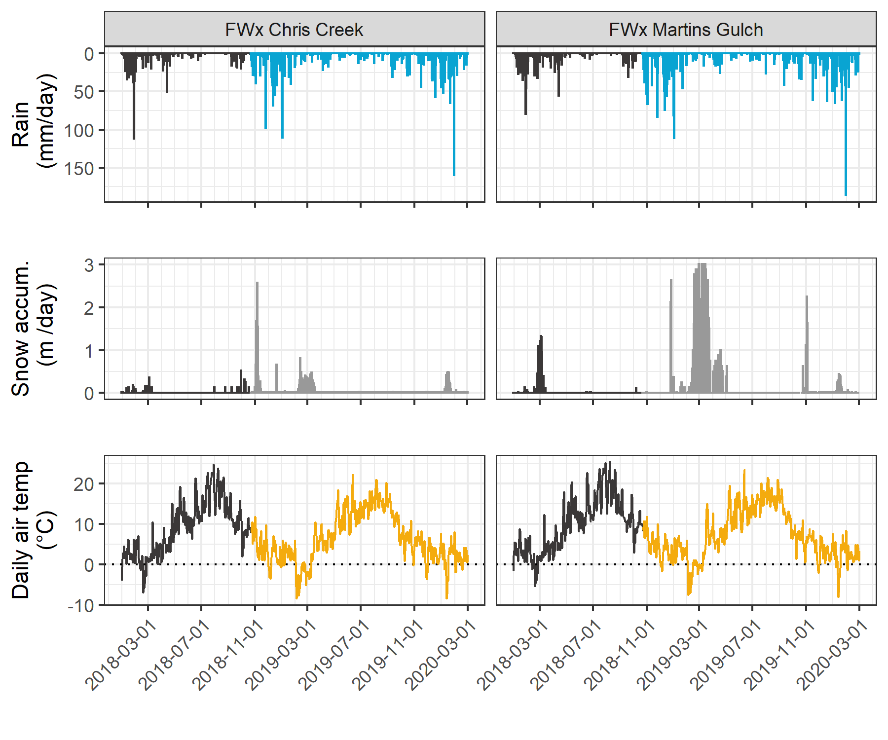
```

\  

```{r WxLWSAdata}
read_csv("R-outputs_UBC-forWater-MSc_HMc/tables/Wx_LWSA-summary.csv", col_names = TRUE) %>% 
  knitr::kable(caption = "Annual weather from CRD FWx stations in the Leech water supply area", 
               digits = c(0, 0, 1, 2, 1, 1, 1, 1))
``` 

\  

######### Linear regression for air temperatures at Vertical Racks

TidbiT temperature loggers (HOBO TidbiT v2 Temperature Data Logger, Onset, USA) were attached to the top and bottom of each vertical rack installation to record air and water temperature at 30-minute intervals. Loggers at the top of racks recorded air temperature and those at the bottom recorded water temperature (Figure \@ref(fig:TidbiTairwaterLine)). 

\ 

```{r TidbiTairwaterLine, fig.cap = fig_cap}
fig_cap = "\\label{fig:TidbiTairwaterLine} Temperatures recorded in air and water on vertical racks at each research site"
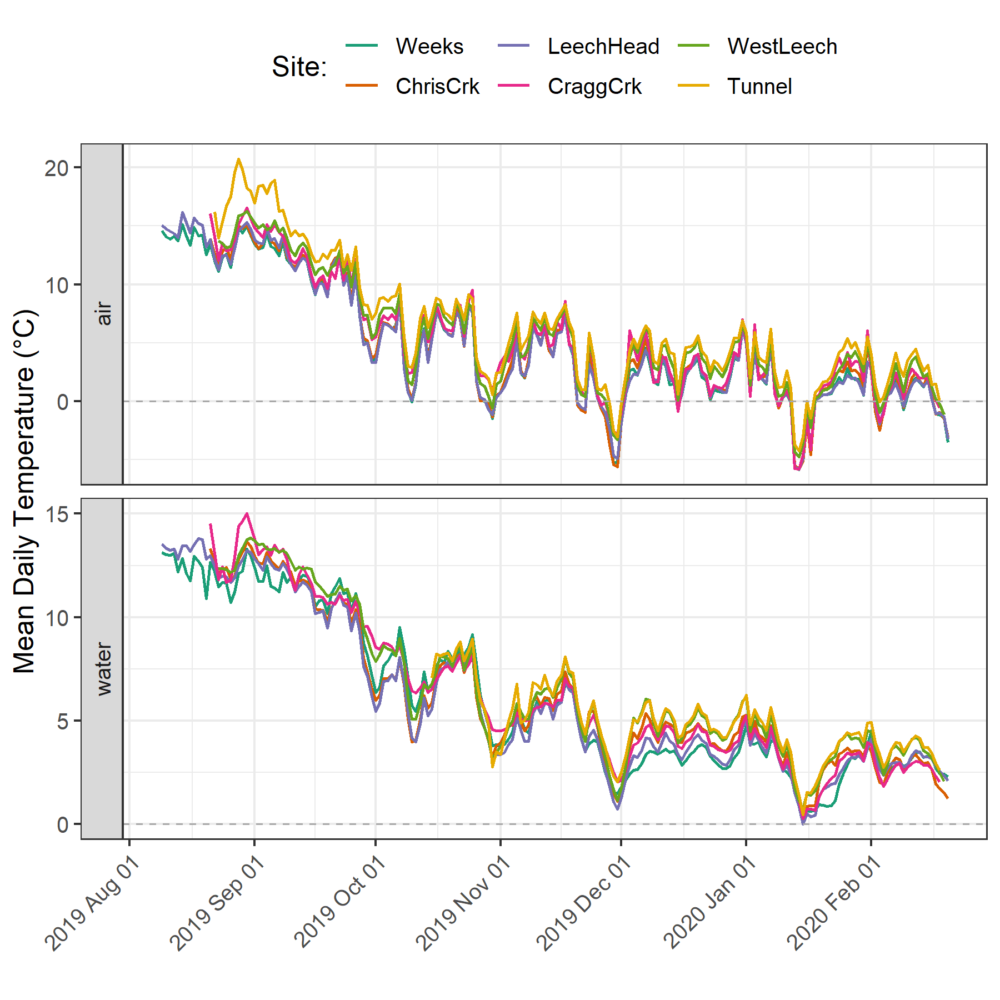
```

\  

While loggers were installed in both positions (air and water) on each rack at the same time, it wasn't until mid-October that all sites' water temperature loggers were submerged. Figure \@ref(fig:TidbiTairwaterBox) shows the distributions of air and water temperatures at each site, where water temperature was limited to the period when all sites water temperature loggers were submerged. Median water temperatures increased from the headwaters of Leech River to the point of diversion (Leech-Head < Cragg-Creek < West-Leech < Tunnel).  

\  

```{r TidbiTairwaterBox, fig.cap = fig_cap}
fig_cap = "\\label{fig:TidbiTairwaterBox} Temperatures recorded in air and water on vertical racks at each research site "

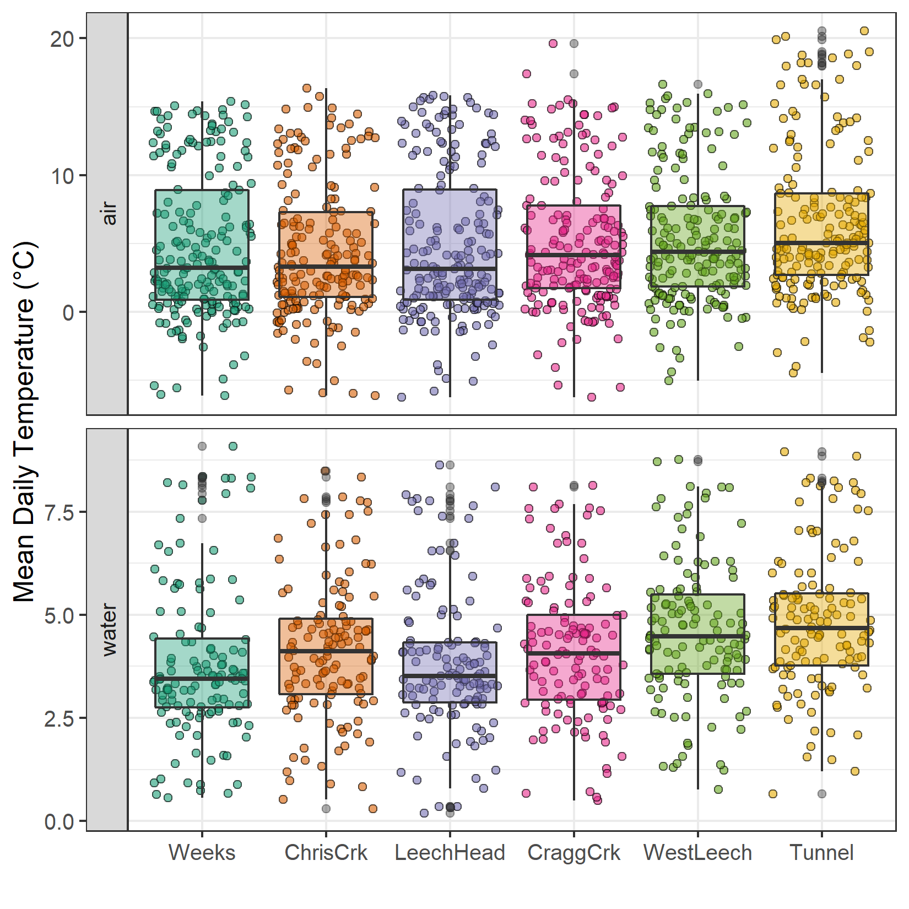
```

\  

Air temperatures recorded at each of the six sites were compared to LWSA FWx for the overlapping period (August 24, 2019 to February 20, 2020). Overall, FWx temperatures were slightly higher than those recorded at each site installation. Figure \@ref(fig:TidbiTFWxridges) shows the density distribution of air temperature measured at each site compared to the LWSA FWx mean. 

\  

```{r TidbiTFWxridges, fig.cap = fig_cap}
fig_cap = "\\label{fig:TidbiTFWxridges} Density distribution of air temperatures recorded at each sub-basin compared to mean LWSA air temperatures from CRD fire weather stations "

knitr::include_graphics("R-outputs_UBC-forWater-MSc_HMc/figures/TidbiTs-FWx_ridgeplot-subbasins.png")
```

\  

Results of two-sided Wilcoxon rank sum tests revealed that 15-minute air temperatures at West Leech (site-5) were similar to LWSA FWx (p-value 0.02), and the differences between the other five sites and FWx were found to be significantly different (p-values << 0.001). However, when daily mean temperatures were compared (rather than 15 minute data) the differences between sites and FWx temperatures were less dramatic (Table \@ref(tab:wilcoxonpvalues)) with no statistical difference (at 90% confidence) for Cragg Creek, West Leech and the Tunnel (sites 4, 5, 6). 

\  

```{r wilcoxonpvalues}
read_csv("R-outputs_UBC-forWater-MSc_HMc/tables/TidbiT-FWx-Tdaily_Wilcoxon-pvalues.csv",
         col_names = TRUE) %>% 
  knitr::kable(digits = c(0,4),
               caption = "Relationships between mean daily air temperature recorded at each monitoring site compared to mean LWSA air temperature recorded by Chris Creek and Martin's Gulch fire weather stations")
               
```

\  

Despite some differences between FWx and Hobo site data, the overlapping FWx and TidbiT daily mean air temperature data were used to generate linear regression relationships to estimate air temperatures at each site for the time preceding Hobo TidbiT deployment (Figure \@ref(fig:HoboFWxLinearReg)). Table \@ref(tab:TidbiTestimateErrors) summarizes the average percent error of estimated air temperatures based on a test period of overlapping data. Estimated mean daily air temperatures at each site were used in flagging Rack sample data for quality control with respect to days samples remained on vertical racks (hold-times). 

\  

```{r TidbiTestimateErrors}
read_csv("R-outputs_UBC-forWater-MSc_HMc/tables/TidbiT-FWx_lm_prediction-errors.csv", col_names = TRUE) %>% 
  #mutate(p.value = format(p.value, digits = 2)) %>% 
  knitr::kable(digits = c(0,1,1,1,1,1,1,1),
               caption = "Summary of predicted air temperature at each site compared to mean LWSA temperature from CRD FWx stations for the same time period",
               col.names = c("Site", "Error (%)", 
                             "Median Temp. (°C)", 
                             "Estimated Median (°C)",
                             "Min. Temp (°C)",
                             "Estimated Min. (°C)",
                             "Max. Temp (°C)",
                             "Estimated Max. (°C)"))
```

\  

```{r HoboFWxLinearReg, fig.cap = fig_cap}
fig_cap = "\\label{fig:HoboFWxLinearReg} Linear regression relationships between mean daily air temperature recorded at each monitoring site compared to mean Leech WSA air temperature recorded by Chris Creek and Martin's Gulch fire weather stations "

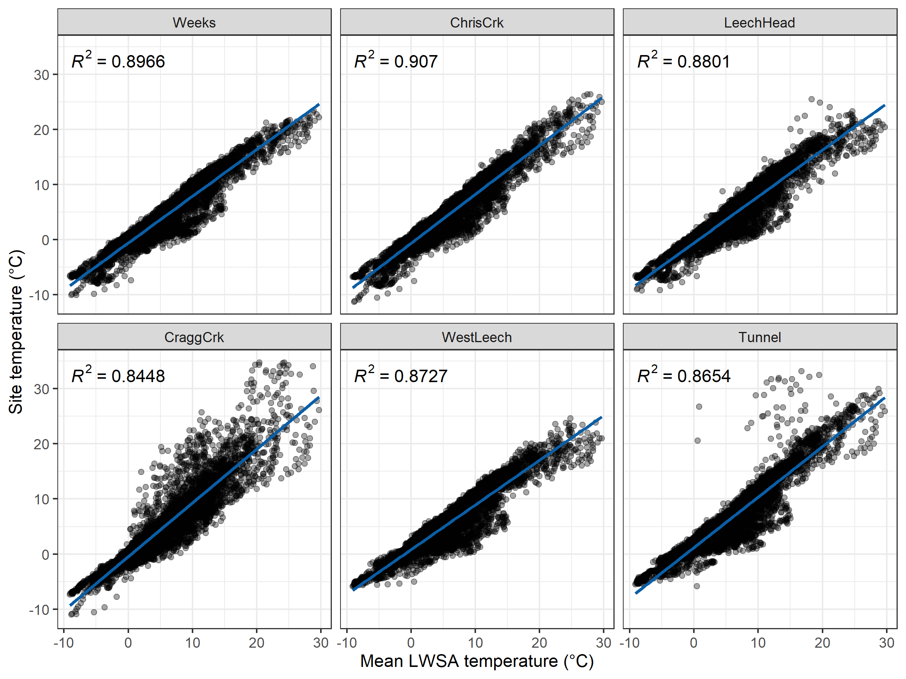
```

\  

####### Additional sampling and analysis (Chapter 2 extended)

At UBC, stream samples were also measured for phosphate concentration using a colourimetric (ascorbic acid) orthophosphate test kit (HACH PO-19); all water samples had ortho-phosphate concentrations below the detectable limit (0.1 mg/L).

\  

########   Treatability: forWater coordinated treatability analyses for disinfection by-product formation potentials (DBP-FP)

Four of the synoptic sampling sites were selected as treatability sampling sites, where source water was collected and shipped to collaborative researchers in the forWater Network for analyses of drinking water treatability metrics. The four treatability sites were: 

\  

1. Leech River at the future point of diversion (near Leech Tunnel inlet)
2. Deception Reservoir, downstream from Deception Gulch (outlet of Leech Tunnel)
3. Rithet Creek (main tributary to Sooke Reservoir)
4. Judge Creek (2nd largest tributary to Sooke Reservoir)

\  

These sites were selected to represent future supplemental source water, the future balancing reservoir between the Leech and Sooke water supply areas, and the current tributary source waters to the Sooke Reservoir.

\  

Two sets of duplicate samples from the four sites were collected during winter of the 2020 water year (November 12, 2019 and February 18, 2020) and were shipped to the Universities of Alberta and Waterloo for treatability analyses. At the University of Waterloo, the samples (_n_ = 8) were analyzed for treatability parameters including: maximum potential disinfection byproduct formation potential (for trihalomethanes (THMs) and haloacetic acids (HAAs) in μg/L), pH, UV~254~(cm^-1^), DOC (mg/L), Turbidity (NTU), and Zeta Potential (mV). Relationships between disinfection by-product formation potentials (DBP-FPs), UV-absorbance at 254 nm, and DOC concentrations were examined. 

\  

######### Results: Treatability & DOC

Dissolved organic matter -- particularly high molecular weight aromatic compounds -- are precursors to disinfection by-products (DBPs), which are formed during chlorination of source drinking water. Drinking water supply for the CRD is treated simply by chlorinating raw source water, and therefore source water NOM could have important implications for treatability. To assess the potential of source water to form potentially harmful DBPs, samples were collected from four locations and sent to partners at the University of Waterloo for treatability analyses (specifically, DBP formation potentials (DBP-FPs)). 

\  

Results from two sets of samples at four selected sites showed DBP-FPs were weakly correlated to DOC concentrations and SUVA~254~ and more strongly correlated to SAC~254~ (Figure \@ref(fig:treatability)). The relatively stronger correlation between DBP-FPs and SAC~254~ indicates that while DOC concentration is an important indicator of source water treatability challenges, SAC~254~ is a better indicator of NOM reactivity with respect to DBP-FPs (Table \@ref(tab:DBPcor), Figure \@ref(fig:treatability)). In particular, SAC~254~ was well correlated with total trihalomethanes (THM, r=0.9882) including trichloromethane (TCM, r=0.9869), total haloacetic acids (HAAs, r=0.9927) including dichloroacetic acid (DCAA, r=0.9945) and trichloroacetic acid (TCAA, r=0.9900); and was only weakly correlated to bromodichloromethane (BDCM, r=0.6539). Below levels of detection (thus not shows here) were DBP-FP results for tribromomethane (TBM), dibromoacetic acid (DBAA), dibromochloromethane (DBCM), monochloroacetic acid (MCAA), monobromoacetic acid (MBAA). 

\  

```{r DBPcor}
read.table("R-outputs_UBC-forWater-MSc_HMc/tables/Appendix_DBPcorrelations.csv") %>% 
  knitr::kable(digits = c(5), 
               caption = "Correlation coefficients for disinfection byproducts with spectral absorbance coefficient at 254 nm (SAC~254~), dissolved organic carbon concentration (DOC), and specific UV absorbance at 254 nm (SUVA~254~). DBP-FP values that were below detection were not included in the matrix ")
```

\  

It's important to note that while SAC~254~ is related to aqueous NOM and DOC, naturally occurring aqueous nitrate and iron can interfere with spectroscopic analyses and lead to positive bias in spectroscopy. Dissolved or colloidal nitrate, nitrite and iron species can absorb light at 250 nm, 254 nm or 365 nm, the wavelengths common to NOM absorption [@StdMet5910]. However, aqueous nitrogen, in combination with NOM, can also play an important roll as a precursor to nitrogenous-DBPs, which could potentially make SAC~254~ an even better indicator of DBP-FP. It would be interesting to evaluate nitrogenous DBPs in realtion to SAC~254~, NOM, and DBP-FPs. 

\  

######## Metals & DOC: collaborative sampling for Metals on behalf of the CRD

Aqueous natural organic matter (NOM) can play an important role in transportation of metals in solution because it has the physiochemical ability to act as a ligand and create coordinated complexes with metals. From November 2018 to July 2019, eight sets of samples were collected from the six Leech WSA monitoring sites. Metals samples were collected on behalf of the CRD and were analyzed at Bureau Veritas Laboratories (BL Labs, formerly Maxxam Analytics Inc., Sidney, BC). For each metals sample collected, a parallel Grab sample was analyzed for DOC (at UBC). A suite of total metals was included in the analyses and reports from BL Labs were provided by the CRD (for the samples collected in association with this research). Data were used to evaluate relationships between DOC and metals in solution. Samples which had detectable metals concentrations were plotted against parallel sample DOC concentrations. Figure \@ref(fig:metalsug) shows DOC with total metals in μg/L, and Figure \@ref(fig:metalsmg) shows metals in mg/L. 

\  

```{r metalsug, fig.cap = fig_cap}
fig_cap = "\\label{fig:metalsug} Concentrations of total metals (in μg/L) and dissolved organic carbon (DOC) concentrations in stream water samples collected across the Leech WSA"

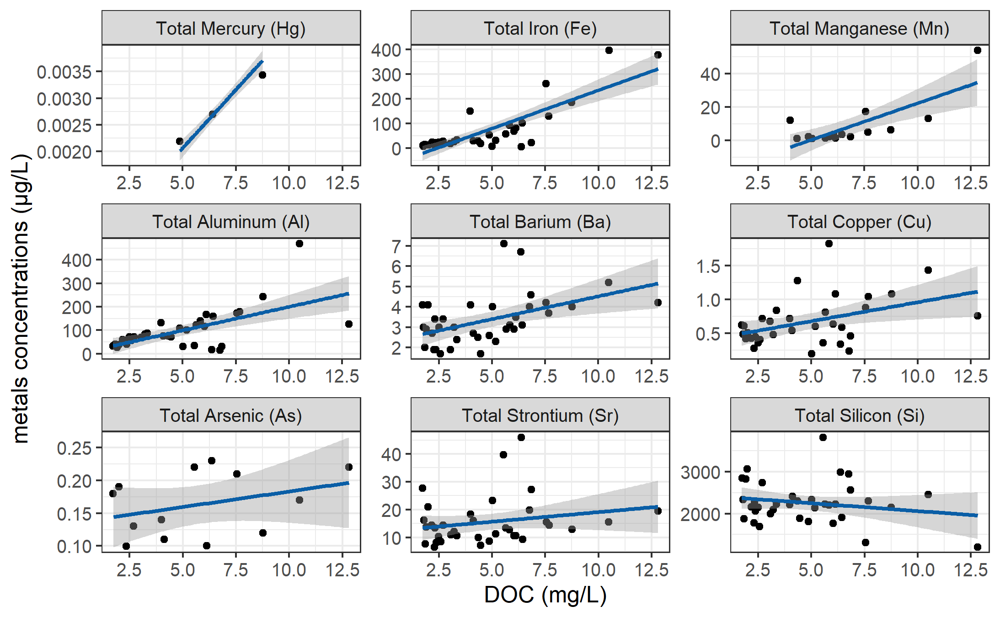
```

\  

```{r metalsmg, fig.cap = fig_cap}
fig_cap = "\\label{fig:metalsmg} Concentrations of total metals (in mg/L) and dissolved organic carbon (DOC) concentrations in stream water samples collected across the Leech WSA "

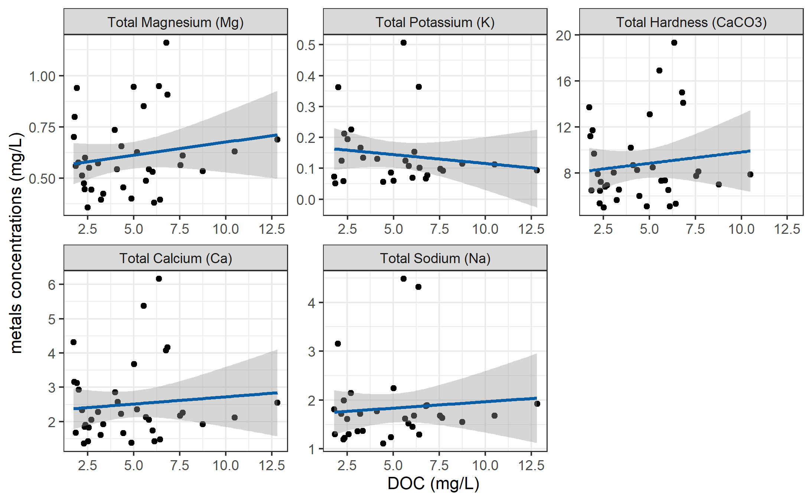
```

\  

DOC concentrations had strong positive relationships with total mercury, iron, manganese, aluminum. While the relationships were not as strong, DOC was also positively related to concentrations of barium, copper, and arsenic. There was a weak inverse relationship between DOC with silicon and potassium (Table \@ref(tab:metalsdata)). All metals concentrations were below maximum allowable concentrations and aesthetic objectives for drinking source water quality guidelines [@BC2019].

\  

```{r metalsdata}
read_csv("R-outputs_UBC-forWater-MSc_HMc/tables/metals-doc_correlations.csv", 
         col_names = TRUE) %>% 
  knitr::kable(digits = c(1, 1, 0, 2, 2, 4), 
               col.names = c("Metal", "unit", "n", "slope", "Y intercept", "R squared"),
               caption = "Linear relationships between total metals with dissolved organic carbon in stream water samples collected across the Leech WSA")
```

\  

####### NOM sampling in nested catchments (Chapter 3 extended)

Below the confluences of headwaters sites (Figure \@ref(fig:NOMnesty), plots A & B), the combination of Rack and Grab sampling did not capture the ranges of SAC~254~ observed in upstream Grab samples alone. At both sets of headwater sites, the variance obtained by combining Rack and Grab samples downstream was not the same as upstream Grab sampling variance (Levene's test for homoscedasticity p-value =  0.0174). At higher order rivers, the combination of Rack and Grab samples at the Leech Tunnel site did capture the SAC~254~ ranges observed in Grab samples at three upstream river sites (Figure \@ref(fig:NOMnesty), plot C). Levene's test for homogeneity of variance (homoscedasticity) confirmed that there was no difference in SAC~254~ variance in the downstream Rack/Grab combination results compared to Grab-only from upstream (p-value 0.105). 
\  

```{r NOMnesty, fig.cap = fig_cap}
fig_cap = "\\label{fig:NOMnesty} Grab sample SAC~254~ at upstream locations compared to Rack and Grab sample SAC~254~ below their confluence(s). A and B show grab samples from headwaters (HW) compared to downstream (DS) monitoring sites; C shows upstream river sites (US) compared to mainstem monitoring"

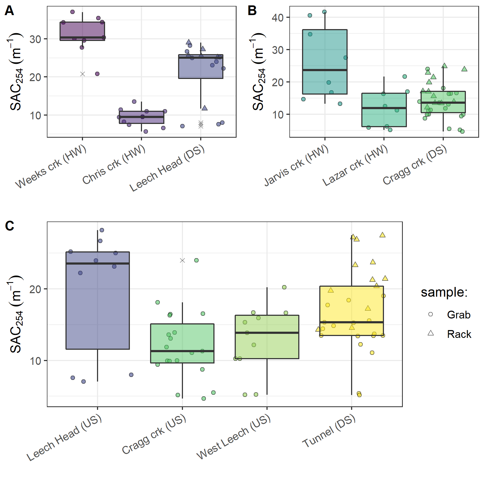

```

\  

No apparent trend was seen in the E~2~:E~3~ characteristic for aromaticity/molecular size (Figure \@ref(fig:aroma)). There were similar variances in E~2~:E~3~ values across all groupings (Levene's p-values 0.1225, 0.09551, 0.09298 for sets A, B, C). 

```{r aroma, fig.cap = fig_cap}
fig_cap = "\\label{fig:aroma} Grab sample E~2~:E~3~ at upstream locations compared to Rack and Grab sample E~2~:E~3~ below their confluence(s). A and B show grab samples from headwaters (HW) compared to downstream (DS) monitoring sites; C shows upstream river sites (US) compared to mainstem monitoring "

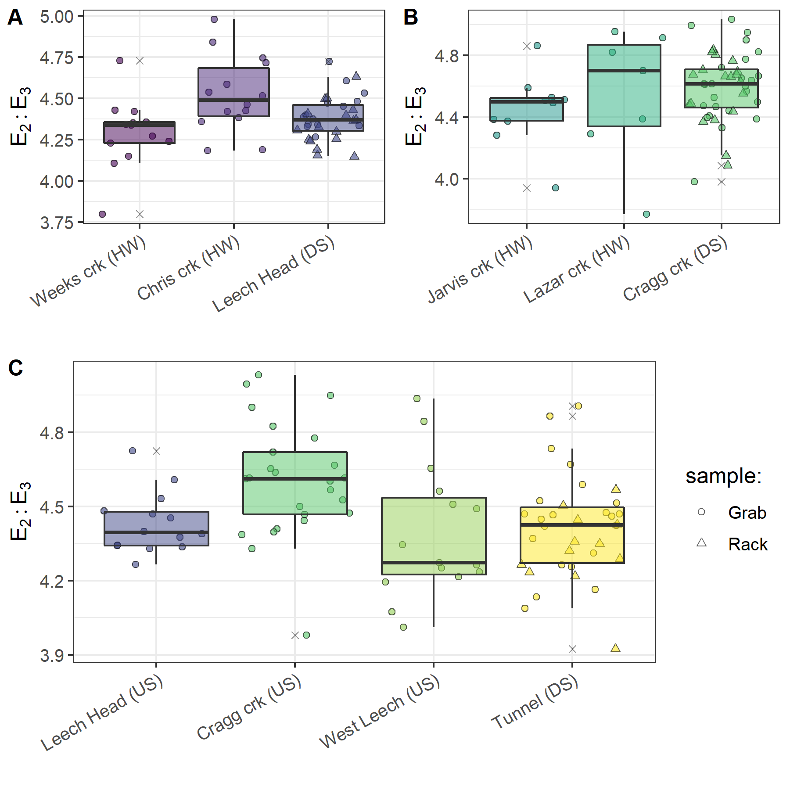
```

\  

####### Random Forests (Chapter 4 extended)

######## Random Forests background

\  

A Random Forest is a collection of decision trees, that collectively comprise a statistical tool for non-parametric regression, prediction, classification and assessment of variable importance [@Strobl2009]. Breiman's Random Forests (RF) is a machine learning algorithm for practical applications, which is popular for its accuracy in real-world systems [@Tyralis2019; @Biau2016] and does not require independence among samples; as such, it is appropriate for analysis of nested catchments, which by definition are not independent. RF has been widely published in hydrologic and water resource research in recent years, particularly in streamflow and water quality studies [see @Tyralis2019 and references therein]. In RF, a set of predictor variables (features) are used to predict the outcome of another variable (the predictant) through supervised learning algorithms which are grouped as either regression or classification, depending on whether the variables are quantitative (i.e. numeric) or qualitative [@Breiman2001; @Tyralis2019]. 

\  

The RF algorithm learns from many independent Classification And Regression Trees which undergo bootstrap-aggregating ("bagging") with randomization; meaning that no single tree includes all the data, which reduces over-fitting and improves prediction performance [@Breiman2001; @Tyralis2019; @Biau2016]. In RF, many decision trees are created, each one generated by randomly sampling from the full data set (with replacement) and each tree is trained until only one possible solution remains (i.e. leaf nodes contain one deciding variable). For problems of regression (i.e. quantitative numeric variables, such as the data in this thesis), the final forest prediction is equal to the average of individual tree predictions [@Tyralis2019; @Biau2016]. 

\  

The capacity to evaluate variable importance metrics sets RF apart from other data-driven models that focus on prediction [@Tyralis2019]. The relative importance of each feature can be determined by assessing the accuracy of how well the response variable (predictant) is anticipated in the absence or presence of each predictor feature. Through the RF algorithm, the variable importance measure (VIM) is assessed by removing predictor variables one at a time and measuring the decrease in prediction accuracy in their absence [@Breiman2001]. This is achieved based on either the increase in mean square error (MSE, type 1) or the increase in sum of square errors (SSE, type 2). Type 1 of VIM is calculated by permutation [@Liaw2018] and type 2 is assessed as a decrease in node impurity; for classification problems this is measured by the Gini index and for regression, it's measures by the residual sum of squares [@Liaw2018]. The SSE method may be more appropriate for categorical variables than quantitative variables, for which MSE method appears to be more appropriate (Chapter 4, 'RF quality control' section). Despite the ability of RF to handle non-independent real world data, bias can result from cross-correlations among predictor variables, and mixing categorical and quantitative data may result in bias towards variables with many categories or many missing values [@Strobl2008]. Therefore, some predictor refinement is important and was conducted in the Chapter 4 analysis. 

\  

######## Random Forests Variable Importance Measure 

Random Forest variable importance measure (VIM) treated static watershed characteristics categorically and treated dynamic sampling conditions as numeric variables to be used in regression. When conditions and characteristics were combined for RF VIM, the relative ranking of each predictant was changed compared to when conditions and characteristics were analyzed separately. While it was expected that the relative importance (as a percent) would shift when all predictants were combined, it was not expected that the relative ranking would change, and that suggests that these two groups (static and dynamic) of predictants should be separated for RF VIM. Compare plots for the two groups (Ch 4) to Figure \@ref(fig:RFallvars) and see how the relative rankings changed.


```{r RFallvars, fig.cap = fig_cap}
fig_cap = "\\label{fig:RFallvars} Random Forest variable importance measure for NOM concentration and character using combined predictant types (dynamic conditions and static watershed characteristics), which altered the relative importance ranking compared to when the groups were assessed separately"

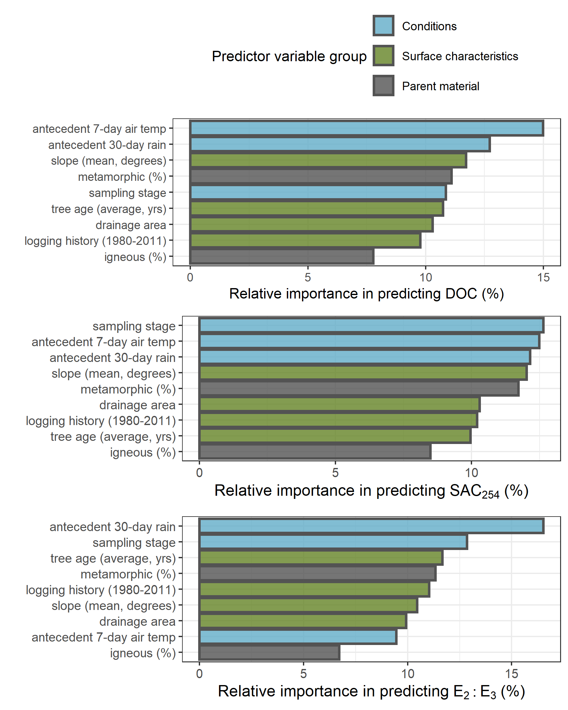
```

\  

Enough samples were collected for DOC assessment in both the dry and wet seasons to see a pattern of wet season increase in DOC with increasing antecedent air temperatures; there was no clear pattern in the dry season (Figure \@ref(fig:RFtempDOC)). 

\  

```{r RFtempDOC, fig.cap = fig_cap}
fig_cap = "\\label{fig:RFtempDOC} Antecedent 7-day air temperature as a predictor variable for concentrations of dissolved organic carbon in the wet and dry seasons of the Leech Water Supply Area (including loess trend lines)"

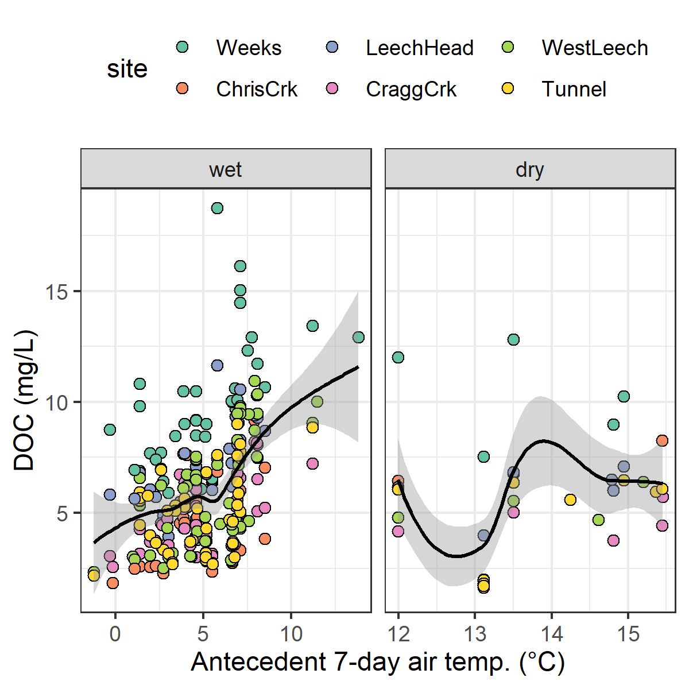
```

\  

The relationships between NOM proxy parameters (DOC, SAC~254~ and E~2~:E~3~) with 30-day antecedent rain were slightly different at each site (Figure \@ref(fig:VIMrainSites)). Generally, DOC decreased with increasing 30-day antecedent rain at all site above approximately 200 mm of accumulated rain. There were insufficient data at each site to tease out clear patterns with SAC~254~ or E~2~:E~3~. 

\  

```{r VIMrainSites, fig.cap = fig_cap}

fig_cap = "\\label{fig:VIMrainSites} Antecedent 30-day rain as a predictor for NOM concentration (DOC) and character (SAC~254~ & E~2~:E~3~) across six monitoring sites in the Leech watershed. Each plot includes a loess trend line."

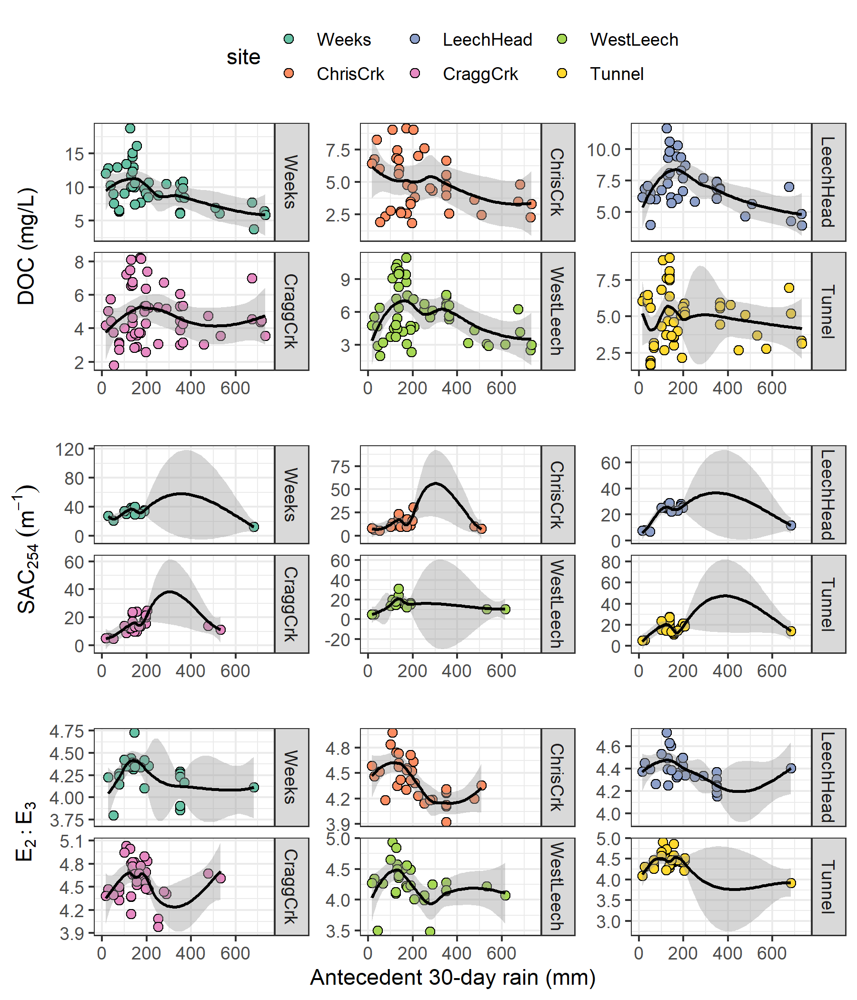
```

\  

####### Hysteresis (Chapter 4 Bonus!)

######## Background

Storm events are understood to be a key driver for solute and particle mobilization in streams [e.g. @Aguilera2018]. Material transport (be it in solution or suspension) tends to show a non-linear relationship to discharge, in that concentrations do not necessarily peak in congruence with flow. This hysteretic behaviour, where the relationship between concentration and discharge (i.e. C-Q)  is different on the rising limb versus the falling limb of the hydrograph, creates a hysteresis loop that can reveal information about origins and transport of aquatic material, relative to the point of measurement [@Vaughan2019; @Evans1998; @Aguilera2018]. Concentration-discharge hysteresis may be due to episodic flushing of material or from component mixing processes [@Evans1998]. Information about flow-paths and source pools can be obtained from four elements of the C-Q relationship plot: the shape (linear, circular, figure-eight), the direction of a hysteresis loop (i.e. clockwise vs. counterclockwise), the magnitude, and the direction of slope [@Aguilera2018].    

\  

Concentration-discharge relationships can elucidate flow-paths and aid in estimating proportional streamflow contributions (i.e. subsurface vs. overland, or near-stream vs. upland) [@Evans1999]. C-Q can be used to determine whether a catchment's solute export regime is chemostatic or chemodynamic [@Musolff2015]. For example, in an assessment of ~400 stream events in coastal California, Aguilera and Melack [-@Aguilera2018] found that sediment-associated concentrations peaked during high flows but dissolved nitrogen species had hysteretic behaviour with flow, the direction of which differed depending on land-use. 

\  

Dominant sources and flow paths during events can be inferred from the slope (positive or negative) and the direction of the hysteresis loop rotation [@Evans1998; @Aguilera2018]. A clockwise C-Q hysteresis loop indicates rapid flushing and dilution (higher concentration on the rising limb than falling limb) while a counter-clockwise loop indicates enrichment via delayed material delivery from distant (upstream) or deeper subsurface source pools [@Aguilera2018]. Evans et al. [-@Evans1999] determined that C-Q analysis requires a minimum of five samples to determine the rotational direction of hysteresis: pre and post episode low-flow, rising and falling limbs and near to peak Q. 

\  

Using end-member mixing, with hydrometric monitoring and carbon isotope (δ^13^C~DOC~) data, Lambert et al. [-@Lambert2014] determined that approximately 80% of stream DOC flowed through the riparian domain's most superficial soil horizons, and that riparian soil DOC was sourced from both riparian and upland areas. Upland NOM source pools were determined to contribute significant amounts of carbon to streams but were supply-limited; whereas riparian NOM was found to be a near-infinite carbon source. Lambert et al. [-@Lambert2014] also found that upland sources contributed relatively more early in the wet season (~30% of stream DOC) and less as high-flows continued (decreased to ~10% of stream DOC later in the wet period). In that vein, antecedent weather conditions are important for nutrient and sediment export and C-Q relationships, as the first precipitation events after a prolonged dry period can result in rapid flushing of accumulated material [@Aguilera2018].  

\  

######## Methods

Hydrochemical hysteresis is most often evaluated through C-Q relationships, but the concept of hysteresis applies to any time-based predictor and effected values. The principle of hysteresis is based on a lag between a driving force (e.g. discharge, Q) and the analyte that is driven to change (e.g. solute concentration, C). Ideally, streamflow data would accompany all sample data collected for this research, however that was not the case. Stage data was collected, and given the strong relationship between stage and discharge, stage can be evaluated as an indicator for Q. Similarly, because streamflow in the Leech WSA is governed by precipitation, antecedent wetness (rain) could be proxy data in a hysteresis analysis. Conditions that were calculated to be most important for predicting NOM concentration and character were plotted with their predictant to assess possible hysteresis; this was only possible for dynamic conditions with variable measurements (i.e. not static watershed characteristics predictors).

\  

For a C-Q hysteresis loop, clockwise rotation indicates rapid flushing and dilution, while counter-clockwise rotation indicates enrichment via delayed material delivery from distant (upstream) or deeper subsurface source pools [@Aguilera2018]. Because of the assumed relationship between antecedent rain and streamflow, a similar interpretation was used here despite the absence of discharge data.  

\

######## Results and discussion: Hysteresis of NOM with antecedent wetness 

Events 10 and 11 were relatively well represented by sampling at each of the six sites and were found to be representative of other rain events as well. Wilcoxon tests showed events 10 and 11 were not statistically different from the other sampling events, with the same mean rain durations (p = 0.837), rain amounts (p = 0.732), rain intensity (p = 0.549), DOC (p = 0.512), SAC~254~ (p= 0.218) and E~2~:E~3~ (p = 0.148). Samples were collected across the rising limb, near peak-flows, and at least one sample on the falling limb and at low flow (Figure \@ref(fig:events1011)).

\  

```{r events1011, fig.cap = fig_cap}
fig_cap = "\\label{fig:events1011} Stage and sample collection points at six Leech watershed monitoring sites during rain events 10 and 11 (early fall 2019). Vertical yellow lines indicate the start of each rain event (event 10 and 11, respectively). Results of samples in each event were compared to antecedent 30-day rain to assess hysteretic behaviour of NOM with catchment wetness."

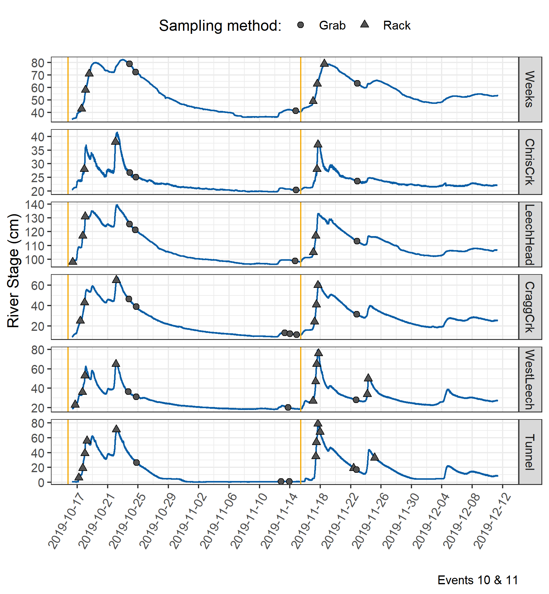
```

\  

Sample DOC concentrations from rain events 10 and 11 were plotted with their corresponding antecedent wetness (30-day rain) to explore possible hysteresis (Figure \@ref(fig:hysteresisplots)). The relationship of DOC to antecedent wetness within a hydrologic event was interpreted in the same manner as a concentration-discharge (C-Q) relationship, where rapid flushing and dilution are indicated by a hysteresis loop with clockwise rotation, and counterclockwise rotation points to delayed material delivery and stream enrichment. Event 10 was the second measured rain event in the 2019/2020 wet season and had twice as much rain fall as event 11 (136 mm in event 10 compared to 68 mm in event 11, Table \@ref(tab:EventsTab)). Event 10 was longer in duration (6.4 days) compared to event 11 (2.3 days) with slightly lower intensity (21 vs 29 mm/24-hr.). Between these two events, mean DOC concentrations were comparable (6.7 mg/L and 6.4 mg/L). There was a clockwise rotation pattern for DOC with antecedent wetness in event 10 and a counterclockwise rotation in event 11 (Figure \@ref(fig:hysteresisplots)). At the Tunnel, there was a change in loop direction at the end of each event. 

\  

```{r hysteresisplots, fig.cap = fig_cap}
fig_cap = "\\label{fig:hysteresisplots} Dissolved organic carbon (DOC) concentrations plotted with antecedent 30-day rain during events 10 and 11 at six monitoring sites in the Leech watershed"

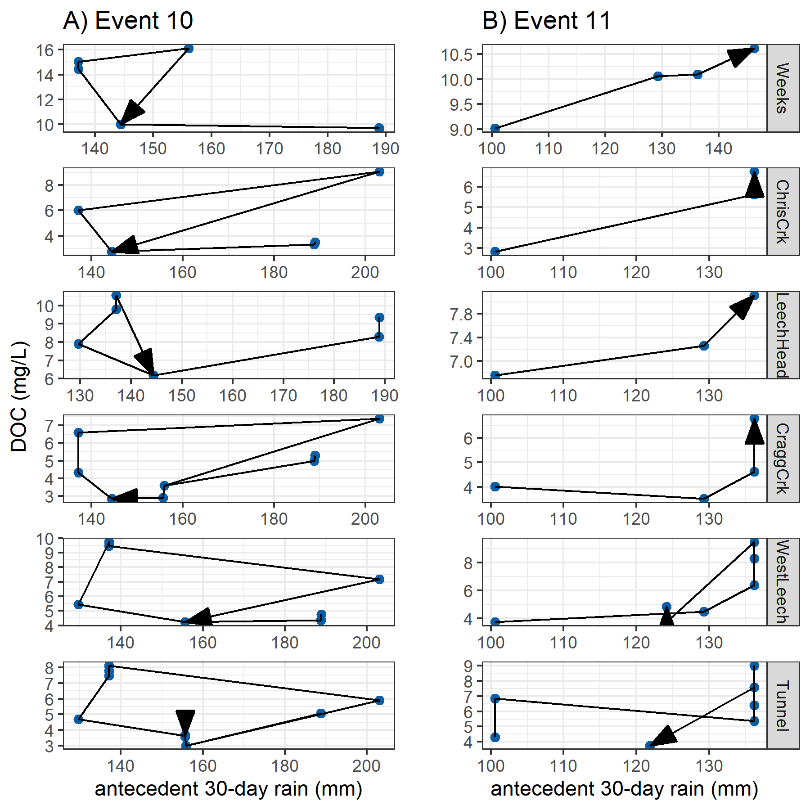
```

\  

The antecedent wetness hysteresis loop of event 10 supports the hypothesis for dilution of near-stream (or in-stream) NOM early in the wet season. Later wet-season rain events transported larger, more aromatic NOM from source pools that were likely allochthonous humic material and whose export relied on greater landscape saturation and hydrologic connectivity. The hysteresis loop for event 11 supported the idea of stream NOM enrichment occurring as antecedent wetness increased (i.e. hydrologic connectivity increased). 

\  

Antecedent rain was used like a surrogate for stream discharge in a proxy Q-C hysteresis evaluation. This seemed reasonable because in the Leech WSA rain is a main contributor to streamflow. For each sample collected at each of the six monitoring sites, the relationship between antecedent rain (from LWSA Fwx mean of Chris Creek and Martin's Gulch rain data) and measured stage loosely resembles the shape of an expected rating curve (Figure \@ref(fig:Ant30RainStage)).

\  

```{r Ant30RainStage, fig.cap = fig_cap}
fig_cap = "\\label{fig:Ant30RainStage} Relationship between sample stage and antecedent 30-day rain at the six Leech WSA monitoring sites."

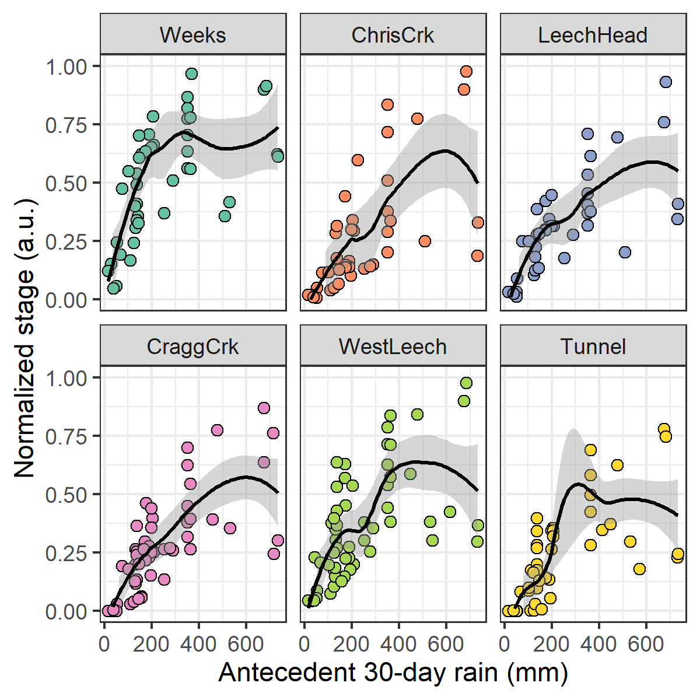
```

\ 

####### Technology summary

Digital equipment used in this thesis are summarized in Table \@ref(tab:techsumm).  

\  

```{r techsumm}

read_csv("R-inputs_UBC-forWater-MSc_HMc/tables/Appendix_MSc_technology-summary.csv", skip = 3, col_names = TRUE) %>% 
  knitr::kable(caption = "Summary of hardware and sofware used in this thesis project")
```

\  

####### Done

Hannah McSorley thanks you for reading this thesis, and thanks her pal Stewart Butler again for helping with field installations in the coldest and darkest parts of 2018 and 2019 (Figure \@ref(fig:stewb)).

```{r stewb, fig.cap = "Photo of Hannah J. McSorley and Stewart Butler near the Sooke Gate in the Greater Victoria Water Supply Area, circa November 2018"}

```
