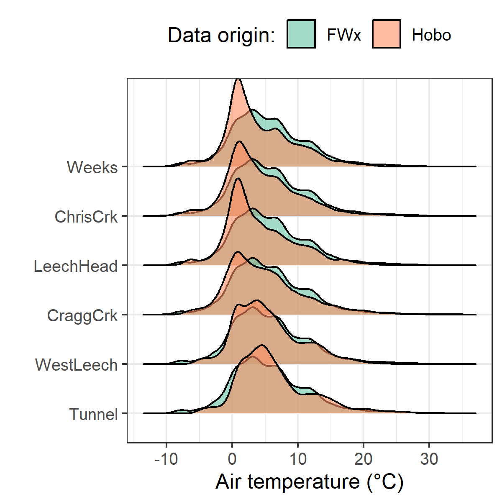
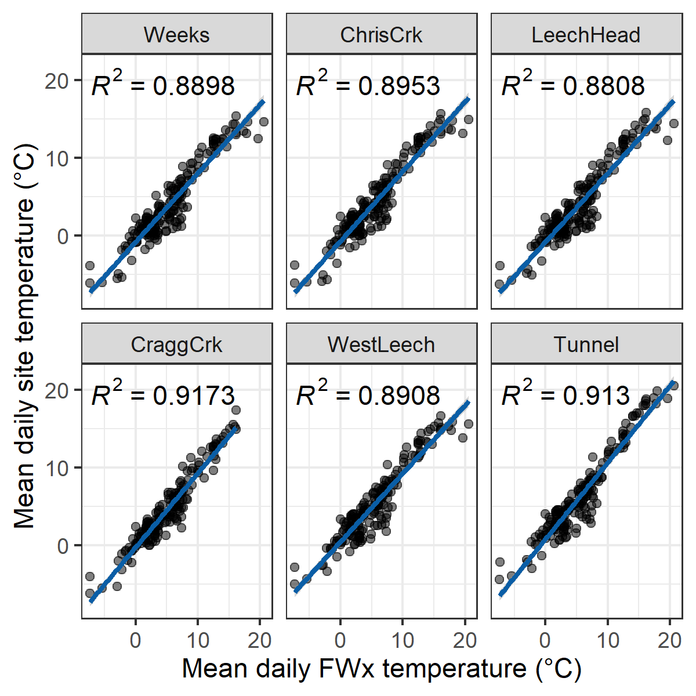

--- 
title: " 'Spatial and temporal variation in dissolved organic carbon across a second growth forested watershed on Vancouver Island, BC' OR 'Quantifying synchrony and variability in source water quality across nested catchments of a protected second growth forested water supply area' "
author: "Hannah J. McSorley"
date: "2020"
site: bookdown::bookdown_site
output:
  bookdown::word_document2:
    lof: true
    lot: true
    toc: true
    fig_caption: true
    reference_docx: UBC-RC_ThesisTemplate_V9_HMc-Template.docx
bibliography: library.bib
link-citations: yes
---

```{r index-setup, warning = FALSE, message=FALSE, include = FALSE, package.startup.message = FALSE}

knitr::opts_chunk$set(warning=FALSE, message=FALSE, echo=FALSE)

# load required packages
library(bookdown)
library(tidyverse)
library(readr)    # read in delimited files
library(knitr)    # for tidy tables

```

# Abstract  

_(max 350 words) - roman numeral TOC_

***to be updated following completion of results*** 

Most drinking water in Canada originates in forested headwaters, therefore forest management is intimately tied to the quality and quantity of water supply for many communities. However, without a baseline understanding of a watershed’s hydrochemical dynamics, it is difficult to determine if observations indicate a departure from natural variance due to forest treatments, or if observations fall within baseline variation. This research was conducted in the Leech River Watershed (~96 km^2^, elevation 215 to 870 m a.s.l) which experienced extensive forest harvesting prior to 2007 and is designated as a future supplemental drinking water supply area for Greater Victoria, British Columbia, Canada. The primary objective of this study was to characterize the range of hydrochemical dynamics and the synchrony of rainfall responses among sub-basins ranging in size from 9.6 to 37 km^2^. Six sites were equipped with vertical racks to passively collect water samples on the rising limb of the hydrograph while measuring stream stage. Synoptic water sampling was completed every two to four weeks from November 2018 to February 2020. A total of 458 samples (204 Rack and 254 Synoptic Grab samples) were collected and analyzed for dissolved organic carbon (DOC) and dissolved organic matter (DOM). Additionally, a subset of 42 samples were analyzed for a suite of total metals to assess aqueous DOM transport relationships. Mean sub-basin DOC concentrations ranged from 7.4 ± 1.5 mg L^-1^ to 10.4 ± 3.6 mg L^-1^ (DOC range spanned 2.5 - 29.75 mg L^-1^). Across the Leech watershed, there was an overall reduction in DOC concentration from low to high order streams, and DOC concentrations decreased throughout the wet season (Oct-Mar). Concentrations of DOC exhibited a positive relationship with concentrations of several metals (R2 values for Hg: 0.99; Al: 0.81; Fe: 0.72; Cu: 0.47; Ba: 0.25; Mn: 0.21). Seasonal differences in DOM character were assessed by SUVA~254~ and other spectral indices derived from UV-Vis absorbance full-scan data. DOC concentration patterns during stormflow will be used to indicate whether DOC flux was driven by DOM supply limitation or hydrologic controls. Rainfall response will be discussed on a per-storm basis regarding response synchrony among sub-basins. This research establishes a baseline of hydrochemical dynamics across a water supply area where commercial forest management ceased more than a decade ago. These data may also be useful for future assessment of forest management strategies to reduce wildfire risk. Furthermore, results from this work will aid source water protection strategies when the Leech Water Supply Area becomes an active source for the Greater Victoria water supply via inter-basin transfer. objective

# Lay Summary 

_(max 150 words) - roman numeral TOC_

***to be updated following completion of results*** 

This research contributes to understanding the variability in DOM and DOC across a forested riverine watershed: the Leech River watershed on Vancouver Island, British Columbia, Canada. Land-use impacts are controlled in this research area as 96% of the watershed is protected as drinking water supply area (Leech Water Supply Area). Like most forested areas on Vancouver Island, the Leech watershed is second-growth softwood forest with a history of extensive harvest (nearly 96% cleared).

Sixteen months of bi-weekly field work was completed with the goals of contributing to the characterization of the Leech Water Supply Area (LWSA) while furthering our understanding of the variability of dissolved organic matter (DOM) dynamics in hydrologic response across a second growth forested watershed. 

The purpose of this master's research project was to establish a baseline understanding of hydrologic responses and water quality variability in rivers across the LWSA. The approach includes advanced passive sampling within stormflow, supplemented with synoptic grab sampling between storm events and during summer baseflow. Discrete samples of river water were collected passively during the rising limb of stormflow using low-powered, low-cost, custom-built vertical rack samplers including water level loggers (Odyssey) and observational reference staff gauges. By collecting samples during stormflow, a more robust understanding of water quality dynamics was achieved than basic grab sampling alone. Using low-powered passive sampling techniques allowed for multiple (six) sites to be equipped with monitoring/sampling racks, providing spatial resolution of hydrochemical variability across the watershed. 

# Preface

_roman numeral TOC_

This dissertation is an original intellectual product of the author, Hannah J. McSorley. 

The vertical sampling racks (Chapter 2) were based on principles employed by Maartje Korver (MSc Vrije Universiteit Amsterdam) at Hakai Institute, BC, Canada. The siphon sampling bottles were built by H.J.McSorley based on M.Korver's prototypes and the US Geological Survey's single-stage siphon sampler for suspended sediment design (USGS U-59 Sampler). 

Weather station data and geospatial data (forests and subsurface geological layers) for the Leech Watershed was supplied by the Capital Regional District and used with their permission.

Laboratory analyses conducted at the University of British Columbia (UBC) were completed solely by Hannah J. McSorley.

All data analysis was completed by H.J.McSorley using R (R-3.6.2) in RStudio (Version 1.3.820). Geospatial data were collected from GeoGratis, the Government of Canada Geospatial Data Extraction tool (geogratis.gc.ca) with supplemental data provided by the CRD. Any and all geospatial data provided by the CRD was used with permission from the Capital Regional District. All maps inlcuded in this thesis were created by H.J.McSorley using QGIS (version 3.12.1, Bucuresti; www.qgis.org), and catchment boundaries were delineated using the QGIS GRASS plugin (GRASS GIS 7, version 2). All geospatial data extraction (Chapter 2, Table #####) was completed or confirmed by (in the case of watershed boundary delineation) Alison Bishop, BSc, ADGIS (Research Assistant, VIU Coastal Hydrology Research Lab). 

see: https://www.grad.ubc.ca/sites/default/files/doc/page/thesis_sample_prefaces.pdf

\  

* TOC
* LOT
* LOF

\  
```{r Abbreviations, echo = FALSE}
read_csv("R-inputs_UBC-forWater-MSc_HMc/tables/index-acronyms.csv", col_names = TRUE) %>%
  arrange(Acronym) %>% 
  knitr::kable(caption = "**List of Abbreviations**")
```

\  

# Acknowledgments

This research work would not have been possible without the support and accommodation of the Capital Regional District (CRD) Watershed Protection and Management Division, Integrated Water Services (IWS) (Victoria, BC). I would like to acknowledge the help, support and assistance provided by the following CRD folks: Tobi Gardner, Annette Constabel, Kathy Haesevoats, Joel Ussery, Patrick McCoubrey, Ryan Biggs, Burn Hemus, Christoph Moch, Jessica Dupuis, Devon Barnes, and Athina Connor. I'm grateful to have been supported by the entire CRD Field Operations Staff; thank you all for making me feel welcome on site and including me in daily field operations and worker checks. 

This research also would not have been possible without the support and encouragement from my academic supervisors -- Bill Floyd and Mark Johnson -- and from partners in the NSERC forWater Network: Suzanne Tank, Mike Stone, Dana Harriman, Monica Emelko, Uldis Silins, Axel Anderson. I would like to acknowledge the support from Vancouver Island University, the University of British Columbia and the NSERC Canadian Graduate Scholarship Masters Award -- thank you for supporting me as a master's student.   

For help with field installations and streamflow gauging, a big thanks to my friend and former field partner, Stewart Butler (VIU Coastal Hydrology Research Lab); thanks Stew. Thanks also to Alison Bishop for assistance on a field trip during the winter of 2019/2020 and for help with GIS.

Big thanks to my incredibly wonderful friends and family for supporting me in my scientific and academic pursuits. I really appreciate all the love and support, dinners, coffees, bike rides, beers, proof-reading and encouragement. Thank you all for your patience also, this was a big project.

__Land Acknowledgement__

The author, Hannah J. McSorley, acknowledges and thanks the First Nations on whose traditional lands she traveled, learned, researched, lived and played on during this master's thesis project, and on whose land she continues to live.

\  

The research sites in Greater Victoria water supply areas are located on traditional territory of the T’sou-ke (Sooke) Nation, who have lived on these lands since time immemorial and who were the original watershed protectors. The Capital Regional District occupies land of the Scia'new (Beecher Bay), Songhees, T’Sou-ke First Nation and Malahat First Nation.

Research at the University of British Columbia in Vancouver BC was conducted on the traditional, unceded territories of xʷməθkʷəy̓əm (Musqueam) People. For the duration of this masters research, Hannah gratefully lived and played in East Vancouver on traditional territory of the Musqueam, Sḵwx̱wú7mesh (Squamish), and Səlilwətaɬ (Tsleil-Waututh) Nations. Traveling between UBC and the water supply areas included passage across Tsawout and Tsawwassen First Nation territories. 

Vancouver Island University (Nanaimo campus) is located on traditional lands of the Snuneymuxw First Nation, Quw’utsun and Tla’Amin Peoples. The land traveled between VIU and the research sites, along the south east coast of Vancouver Island, includes territories of the Stz'uminus First Nation (Chemainus), Halalt, Cowichan Tribes, Malahat First Nation, T'Sou-ke First Nation, and Songhees.

\  

# Dedication

First, I dedicate this thesis to each person who reads it in its entirety.

\  

Second, I dedicate this thesis to the love of data science. I'm grateful for Jenny Bryan's online resources, Stack Overflow (stackoverflow.com) for the solution to so many coding challenges, and to Dan Moore for teaching me R (UBC GEOB 503) and continuing to support my R development with additional resources. Thank you to RStudio for making a functional and friendly IDE for the R programming language and to GitHub for making version control streamlined and reproducible. Cheers to Hadley Wickham for the tidyverse and Yihui Xie for the bookdown package (in which I generated this thesis).

\  

Third, I dedicate this to my undergraduate research supervisor and mentor, Dr. Erik Krogh (VIU Chemistry), for inspiring me to realize my potential as a scientific researcher. 

\  

Thank you to the First Nations who are the original land protectors of the areas I call home; I tread lightly, and I am actively un-learning and re-learning our history.

\  

Cheers!

<!--chapter:end:index.Rmd-->

---
output: bookdown::word_document2
---

##	Introduction & background

###	Forested source water supplies and drinking water treatment 
	
Surface water is the primary source of drinking water for over 85% of the Canadian population and in the province of British Columbia, approximately 80% of drinking water originates from forested headwaters [@Pike2010]. Forests offer a variety of ecosystem services (e.g. biodiversity) and also slow and filter runoff which can result in high quality source water supply [@Dudley2003]. Surface water quality varies over time and space due to climate, weather, and physical characteristics of the watershed (such as topography, land cover and geology), with runoff introducing terrestrial material, sediments, nutrients, and organic matter into surface waters [@Pike2010; @Johnson1997; @Delpla2016; @HealthCanada2019; @Yang2015; @Matilainen2010]. 

\  

In Canada, all drinking water must meet Health Canada drinking water quality guidelines, which specify allowable levels of biological, physical and chemical parameters that are safe for human use and consumption [@BC2019; @HealthLinkBC2018; @HealthCanada2019a]. To meet guidelines, source water is most commonly treated to remove substances which may pose a health risk. Drinking water treatment processes vary from simple chlorination to combinations of physical filtration, chemically assisted filtration, reverse osmosis, and or advanced oxidative processes [@MWH2014; @Emelko2011]. Drinking water treatment technologies differ between communities by infrastructure design and operation, which may be guided by source water quality, infrastructure capabilities, budget, regional size and  water quality regulations [@Emelko2011]. All drinking water treatment processes share the same goal: ensure public health by providing a continuous supply of safe water. While there are guidelines for radiological, chemical and physical parameters (e.g. removal of metals), the highest priority drinking water guidelines focus on the inactivation of potentially harmful microorganisms, therefore disinfection is the most important step in the treatment process [@MWH2014; @HealthCanada2019a]. In BC, chlorination remains the most widely used method of disinfection, whether it is used alone or in combination with other treatment processes [@HealthCanada2006; @HealthLinkBC2018]. 

\  

Because drinking water treatment requirements vary with source water quality, there are source water quality guidelines in place in addition to treated drinking water quality guidelines [@HealthLinkBC2018; @BC2019]. Stable source water conditions lead to predictable treatment procedures, while fluctuating source water quality creates treatment challenges [@Emelko2011]. Treatment effectiveness is influenced, for example, by turbidity levels (i.e. suspended solids), varying temperature, dissolved oxygen, pH and natural organic matter.

\  

Aqueous natural organic matter (NOM) can lead to issues of objectionable taste, odour and colour (i.e. guideline aesthetic objectives) and while these aesthetic issues may create unpalatable drinking water, they do not directly impact human health [@HealthCanada2019; @HealthCanada2019a]. However, source water NOM can interfere with effective drinking water treatment and therefore BC source drinking water quality guidelines include colour as an indicator of aqueous NOM [@BC2019; @HealthCanada2019]. Depending on infrastructure design and operation of a drinking water treatment plant, elevated levels of NOM in source water can increase coagulant demand which increases the production of sludge (to be disposed of) and promote the formation of disinfection by-products [@Matilainen2010; @HealthCanada2019]. NOM reduces treatment effectiveness by interfering with ultraviolet (UV) disinfection and/or increasing chlorination demand; NOM can effect coagulation efficiency and oxidative processes; and because NOM promotes biological growth, it can lead to fouling of treatment and distribution infrastructure [@BC2019; @Matilainen2010; @HealthCanada2019; @Jacangelo1995].

\  

In addition to operational impediments, NOM is partly responsible for unintended chemical contaminants in treated drinking water. When source water is chlorinated, chemical reactions with NOM can form a variety of chlorinated organic compounds which are broadly classified as disinfection by-products (DBPs) [@Richardson2007; @Delpla2016; @HealthCanada2019; @Yang2015; @Hua2015; @StdMet5310]. A number of chlorinated carbonaceous DBPs are included in Health Canada's drinking water quality guidelines, and have maximum allowable concentrations in treated water due to their possible or known health affects (i.e. possible genotoxicity or carcinogenicity) [@Richardson2007; @BC2019; @HealthCanada2019].
 

####    Source water considerations for Greater Victoria's water supply areas

The Capital Regional District (CRD), encompassing the southern tip of Vancouver Island (including Victoria) and the southern Gulf Islands,  is committed to the multiple barrier approach to clean drinking water and has taken control of source water protection by purchasing and privatizing the water supply areas for Greater Victoria. Located on southeastern Vancouver Island, British Columbia, Canada, the Greater Victoria Water Supply Area (GVWSA) includes 20,549 hectares (205.49 km^2^) of protected drinking water catchment lands. Currently, Greater Victoria's water supply is sourced from five surface water reservoirs in the Sooke and Goldstream watersheds; Sooke Reservoir is the primary drinking water supply. 

\  

The provincial Drinking Water Protection Act and Drinking Water Protection Regulation frameworks were developed to implement Health Canada's drinking water quality guidelines and set out requirements for drinking water operators & suppliers to ensure the provision of safe drinking water [@BC2019]. Treatment of source water from the Greater Victoria Water Supply Area consists only of disinfection: raw water (unfiltered) is treated with ultraviolet light as primary disinfection, chlorination is secondary, and finally ammonia is added to produce chloramine (NH~2~Cl, a long-lasting disinfectant that persists throughout the distribution system). 

\  

In anticipation of future water demands and uncertainty related to rainfall and climate change, the Capital Regional District (CRD) purchased an additional 96.28 km^2^ (9,628 hectares) of land in 2007 and 2010. This area includes about 92% of the Leech River watershed (~96 km^2^) which was designated as the Leech Water Supply Area (LWSA) for future supplemental source water. In the future (possibly by 2050), inter-basin transfer will move water from the LWSA through a diversion tunnel to supplement Sooke Reservoir (Figure \@ref(fig:GVWSAoverview)). Approximately 92% of the Leech River watershed above the point of diversion (Leech Tunnel) is protected as WSA . 

\  

```{r GVWSAoverview, out.width = "50%", fig.pos="h", fig.cap = fig_cap}
fig_cap = "*Overview of the Leech and Sooke Water Supply Areas (Greater Victoria, CRD), located on southeastern Vancouver Island, British Columbia, Canada. The overview (bottom) illustrates precipitation and an atmospheric river event common to the west coast. The map (top) was generated in QGIS, and the image of Canada (bottom) and inset of Vancouver Island are screenshots from the Windy app (Windy.com).*"

knitr::include_graphics("R-inputs_UBC-forWater-MSc_HMc/images/thesis-map_inset-overview_colour.png")
```

\  

Hydrology and water quality monitoring programs for the Leech began in 2017, thus there is little historical data to describe hydrochemical dynamics in the Leech watershed. The Leech River watershed includes three mainstem rivers (Cragg Creek, Leech River, and West Leech River) as well as several small headwater lakes (Weeks, Jarvis, and Worley) and wetlands (Jordan Meadows surrounding Weeks Lake and Lazar meadows north of Jarvis Lake). Runoff is greatest in the winter under saturated conditions when rivers respond rapidly to precipitation events, rising and falling dramatically. Across the watershed, elevation ranges from approximately 200 m above sea level (asl), near the Leech Tunnel, to 941 m asl in the centre of the watershed, at the top of Survey Mountain. 

\  

In the mid-1980’s, some water was transferred from the Leech River into Deception Gulch and Reservoir (adjacent to but physically separated from Sooke Reservoir), and the mixing resulted in biological water quality problems that included odour and raised concerns about the operational usage of the existing tunnel [*personal communication ?refs*]. Before work is done on inter-basin transfers, the hydrology and water quality of the Leech River system need to be better understood. 

\  

The LWSA was privately managed forest land which was extensively harvested over the past 70 years (nearly 96% clearcut); as a result, a large portion of the WSA is densely forested with softwood stands less than 35 years of age as of 2020. The second growth forests of the LWSA are no longer managed for timber supply, but rather to improve and maintain drinking source water quality and to reduce the risk of landscape level wildfire. Due to prior harvest, reforestation and active fire suppression, forest fire fuels have accumulated in the LWSA and pose a threat if a fire occurs. In the Sooke WSA, the CRD implements forest treatments designed to foster healthy forest stands capable of reducing fire intensity, such as reducing fuel hazards and creating conditions that are safe for crews to action a fire (e.g. closed-canopy fuel breaks). Similar preventative fire treatments may be applied in the LWSA prior to inter-basin transfers. 

\  

Establishing an understanding of baseline water quality dynamics and hydrologic forces in the LWSA will help to inform forest management strategies and evaluate the effects of fire fuel management on water supply. Furthermore, developing relationships between event-based water quality dynamics and establishing hydrochemical ranges across the LWSA will help to anticipate possible treatment challenges that may accompany future inter-basin transfer from the LWSA to the Sooke WSA.

###   Research questions and objectives

This Master of Science thesis research was conducted in partnership with the CRD and forWater Network in an effort to help characterize the Leech Water Supply Area while contributing to our understanding of variations in source water quality (primarily with respect to DOC and NOM) across nested catchments in a second growth forested watershed. This thesis tackled four research questions (RQ) and associated objectives (below), each of which is addressed in subsequent chapters.

\  

__RQ.1.__   What are the ranges for DOC concentration and NOM character between adjacent drainage basins and among nested sub-catchments in the Greater Victoria water supply area, and what influence does seasonality have on concentration of DOC and character of NOM?

__Objective 1:__   Design a sampling strategy to measure the spatial and temporal variation of DOC concentration and NOM character, then describe spatiotemporal patterns that were observed.

\  

__RQ.2.__   Are hydrological processes the main driver for DOC transport and variation in the LWSA and is there a mechanistic relationship between river stage and DOC or NOM?

__Objective 2:__   Relate water sample results to river stage and report on the relationships between DOC concentrations and NOM character with stage, particularly paying attention to differences between baseflow and storm events.

\  

__RQ.3.__   Are some watershed characteristics more important than others for influencing DOC and NOM dynamics?

__Objective 3:__   Assess the importance of watershed characteristics and conditions as explanatory variables for DOC and DOM patterns.

\  

__RQ.4.__   What are the implications for watershed management and future drinking water supply?

__Objective 4:__   Provide context of how results can be used to inform watershed management planning for wildfire reduction strategies and design of continued water quality monitoring for future inter-basin transfers.

\  

Ideally, results of this research will contribute to baseline understanding for further exploration of forest management strategies, such as fire fuel management, and their impacts on source water quality and supply. Understanding source water quality in relation to hydrology is an essential component to multiple barrier approach to ensuring clean drinking water. 

<!--chapter:end:01_Introduction.Rmd-->

---
output: bookdown::word_document2
---

##	Spatial and temporal patterns in DOC & NOM

```{r, include = FALSE, package.startup.message = FALSE}

# load required packages
library(tidyverse)  # keep it tidy
library(readr)      # read in delimited files
library(knitr)      # for nice tables

knitr::opts_chunk$set(warning=FALSE, message=FALSE, echo=FALSE, fig.cap=TRUE)

```

### Introduction

Drinking water in Canada is primarily sourced from surface water supplies.
Over 85% of Canadians, and approximately 80% of British Columbians depend on drinking water that originates from forested headwaters [@Pike2010]. Climate, weather, and physical characteristics of a watershed lead to variations in surface water quality, and runoff links surface water sources to the landscape by introducing terrestrial sediments, nutrients, and organic matter into solution [@Pike2010; @Johnson1997; @Delpla2016; @HealthCanada2019; @Yang2015; @Matilainen2010]. 

\  

####   Aqueous natural organic matter in source water supply

Natural organic matter (NOM) comprises a dynamic collection of molecules that originate from a variety of sources, and aqueous NOM exists in complex and diverse combinations of particulate, colloidal and dissolved fractions [@Peuravuori1997 ;@Aiken2011; @Matilainen2011; @Ruhala2017]. NOM can be introduced to a water body from terrestrial sources (i.e. allochthonous NOM) or generated through in-stream processes (i.e. autochthonous NOM) which are often associated with autotrophic organisms like algae and cyanobacteria [@HealthCanada2019; @Epps1994]. Terrestrial organic matter (allochthonous NOM) includes humic and fluvic acids, tannins, and a wide variety of other compounds (e.g. phenols and lignin, hydrocarbons, proteins, carbohydrates, etc.), which enter fresh water through runoff [@Zarnetske2018; @HealthCanada2019]. 

\  

NOM concentration and character vary widely in source water depending on source material, hydrology, and biogeochemical factors [@Aiken2011; @Abbott2018; @Zarnetske2018; @Matilainen2010]. Molecular composition and physical structure of NOM influence its functionality and reactivity, therefore different types of aqueous NOM in drinking source water have different disinfection by-product formation potentials (DBP-FPs) [@Delpla2016; @Yang2015; @HealthCanada2019; @Chow2008], and different aquatic ecosystem roles [@Cory2011]. Furthermore, different species of NOM vary in molecular size, structure and charge distribution, which determine requirements for effective treatment and removal [@Jacangelo1995; @Matilainen2010].  

\  

Molecular structures of NOM can contain nitrogen, silica, oxygen and hydrogen and are composed primarily of carbon; thus, organic carbon (OC) is often quantified as a proxy for NOM concentration [@Cory2011; @HealthCanada2019; @Matilainen2010; @MWH2014]. Total organic carbon (TOC) is operationally divided into particulate and dissolved fractions (POC and DOC, respectively) which are typically distinguished based on separation by a 0.45-micron filter [@StdMet5310; @Aiken2011]. Generally, DOC is the predominant fraction of TOC in surface water, and the amount of DBPs in treated water is proportional to raw water DOC concentration [@Weishaar2003; @Ruhala2017; @Chow2008]. 

\  

In addition to acting as a precursor for DBPs, DOC (thus NOM) has been called a master variable due to it's terrestrial-aquatic linkages, influence on water chemistry and role in contaminant transport [@Zarnetske2018; @Ruhala2017]. NOM is an energy source for aquatic heterotrophs, it has the ability to bind and transport contaminants in solution (e.g. metals, hydrophobic organic pollutants, nutrients), can influence stream pH and aquatic light and temperature regimes; which, in turn, effect aquatic microbial communities [@Matilainen2010; @Oni2013; @Aiken2011; @Weishaar2003; @LaZerte1991; @Palleiro2013; @Stanley2012; @Cory2011]. 

\  

DOC is an important source water quality parameter to monitor and guidelines in British Columbia specify that drinking source water TOC should remain below 4 mg/L, primarily to reduce the production of trihalomethanes (e.g. chloroform, a common DBP) in treated drinking water [@BC2019]. Aside from DBPs, monitoring source water DOC is important for addressing other operational issues associated with NOM and drinking water treatment challenges. Within a watershed, the characteristics and concentrations of NOM (and therefore DOC) naturally fluctuate over space and through time, creating dynamic conditions and potential treatability concerns [@Li2014; @Yang2015].

\  

#### Surface water sampling strategies

\  

A discrete water sample cannot tell a complete story of a hydrologic system's water quality dynamics but it can provide information about specific attributes of the water in a given place at a certain time, if it accurately represent the body from which it was collected. Non-representative sampling techniques will lead to non-representative analytical results and ultimately to erroneous conclusions [@CCME2011]. Collection of water samples must be done consistently and carefully to avoid sample contamination or sampling errors which would generate unreliable analytical results [@CCME2011]. In a carbon-based world, sample contamination must be a crucial and constant consideration when sampling for NOM [@CCME2011; @Cory2011]. 

\  

The basis of a water quality monitoring network is the collection of representative quantitative data for physical, chemical or biological parameters that help to characterize a hydrologic system over time [@Strobl2008a]. A monitoring network, therefore, will involve some form of a sampling program and it's design should reflect research objectives, account for physical realities (e.g. spatiotemporal heterogeneity, access), while being cost-effective and practical [@Strobl2008a; @Kirchner2006]. Grab-sampling is a standard method of collecting whole-water samples for laboratory or stream-side analysis [@CCME2011; @Ruhala2017]. Synoptic grab sampling can be completed at a number of sites over a relatively short period of time (e.g. hours to days) to assess spatial variations, however there is often a lack of temporal resolution due to scheduled, convenient or opportunistic sampling at relatively low frequencies [@Ruhala2017]. 

\  

It can be difficult to schedule a synoptic sampling campaign for specific weather and flow conditions, especially for short duration of rapid runoff (@Harmel2003). Flow changes in response to precipitation or melt events are of interest for NOM studies as the rising limb of the hydrograph has been shown to have higher DOC concentration that non-storm flow [@Yang2015; @Raymond2016; @Raymond2010]. While high flows present an opportunity to capture the dynamic water quality changes that occur during events, it is logistically challenging and potentially dangerous to manually collect grab samples during events across multiple sites (@Graczyk2000; @Mackay2012). So, pump samplers or passive siphon samplers can be used to collect water samples under difficult or unsafe conditions. 

\  

A pump sampler (e.g. ISCO samplers, Teledyne ISCO, Inc., Lincoln, NE, USA; or Global Water Instrumentation, Gold River, California) can be set up in the field and programmed to collect a set of water samples based on time intervals or changes in conditions (e.g. stage or turbidity thresholds). Pump samplers are effective for automatic event-based sampling (@Harmel2003) but can be prohibitively expensive ($2K-3K CAD), and also require a reliable power source which can pose logistical challenged for setting up at multiple sites in remote or difficult to access locations (@Mackay2012). A passive siphon sampler is an alternative to a pump sampler that automatically and effectively collects discrete water samples on the rising limb of the hydrograph (e.g.: @Mackay2012; @Graczyk2000; @Diehl2007). Siphon samplers are limited to sampling a single event and (so far) are not suitable for sampling the falling hydrograph limb; they are however very low cost, customizable and require no power [@Newham2001].

\  

In this project, a sampling strategy was developed to quantify the ranges of DOC concentration and NOM character between adjacent drainage basins and among nested sub-catchments in the Greater Victoria water supply area. 

\  

### Methods

To measure the ranges of dissolved organic carbon (DOC) concentration and natural organic matter (NOM) character over space and time, river sampling was conducted from October 2018 to February 2020. Water samples were collected and analyzed at UBC for DOC concentration and NOM character via high temperature combustion and UV-Vis spectroscopy, respectively (details follow in *'Analytical Techniques'*). The river sampling program designed for this project included synoptic sampling of 12 sites across the Sooke and Leech water supply areas (WSA), as well as installation of monitoring and sampling stations at 6 sites in the Leech River watershed. Results of synoptic sampling analyses were used to elucidate spatial and temporal patterns in NOM and DOC.  

####    Sampling sites 

Most of sampling sites were in the Leech WSA and a few key rivers in the Sooke WSA were also included (Figure \@ref(fig:sampleSitesMap)). Rithet Creek is the largest tributary to Sooke Reservoir and Judge Creek is the second largest. Deception (gulch) is a small tributary to Deception Reservoir and the Leech River Tunnel (currently deactivated) terminates at Deception gulch. Thus, Deception Reservoir is a likely balancing reservoir for future inter-basin transfers, and it is separated entirely from the current water supply (Sooke Reservoir) by a dam. 

In the LWSA, Weeks and Chris Creek are headwater streams of the Leech River and Lazar and Jarvis Creeks are headwaters of Cragg Creek, a major tributary to the Leech. West Leech River is the other major tributary to the Leech River, and Leech-Beach site was located just downstream from the confluence of West Leech with the mainstem. The Leech Tunnel site was located near the effective mouth of the LWSA, at the Leech River Tunnel. 

```{r sampleSitesMap, fig.cap = fig_cap}
fig_cap = "\\label{fig:sampleSitesMap} *River sampling sites across the Leech and Sooke Water Supply Areas (WSA), Greater Victoria, BC.*"

knitr::include_graphics("R-inputs_UBC-forWater-MSc_HMc/images/thesis_map_all_sites-catchments.png")
```  

\  

#####    Synoptic sampling 

Synoptic sampling involved collecting grab samples of river water at as many sites as possible over a relatively short time period (e.g. 1 day). River water was collected in triple-rinsed acid-washed 250 mL high-density polyethylene (HDPE) wide-mouth amber bottles. Samples were capped with minimal head-space and transported in coolers with ice to the lab for analysis of dissolved organic carbon (DOC) concentrations and spectroscopic absorbance (an indicator of NOM character). 

\  

Samples were collected (via wading) from within 2 meters of the same location at each sampling site, at the safest proximity to channel center, from approximately 10 cm below water surface. All samples were refrigerated while they were held between collection and analysis. Grab samples collected for DOC quantification were filtered and acidified within 48 hours of collection, except for a set of a dozen samples that were collected by CRD staff in January 2020 which were refrigerated for almost two weeks prior to filtration and acidification. Samples for NOM spectroscopy were not acidified, they were confirmed to have zero turbidity and measured unfiltered. 

\  

#####    Monitoring & sampling stations 

Six of the sampling sites in the LWSA were selected for more intensive monitoring (numbered sites in Figure \@ref(fig:sampleSitesMap)). These sites represent the drainage area upstream of the Leech River Tunnel and five sub-basins nested within the Leech Tunnel catchment. Site 6 included the drainage area for the entire LWSA and was located at the Leech River Tunnel. The five sub-basin sites represented important portions of the Leech River system: two headwater streams, Weeks and Chris Creek (sites 1 & 2) and the head of Leech River below their confluence (site 3); and two major tributaries that feed the Leech River, Cragg Creek and West Leech (sites 4 & 5). Monitoring at these sites included river stage, temperatures, and passive siphon sampling schemes. 

\  

The Leech watershed system responds quickly to rainfall, and the logistics of grab sampling through events at multiple sites would have been very challenging for one person to accomplish, could have been dangerous to manually sample, and would have required site access beyond safe working hours (i.e. not logistically feasible). It was important to sample across the hydrograph to capture sample-sets that represented the variation in DOC and NOM that occurred during changing flow conditions (i.e. within storm variability). Based on cost, logistical considerations and curiosity, siphon sampling strategies were employed at the monitoring sites across the LWSA. Siphon sampling bottles were used on vertical sampling racks as a cost-effective, logistically practical, reliable and consistent method of passive event-based sampling that enhanced the synoptic sampling program. In addition to passively collecting samples across the Leech watershed during increasing flow conditions, the vertical racks also recorded river stage and air/water temperatures (using HOBO TidbiT v2 Temperature Data Loggers, Onset, USA). 

\  

Each vertical sampling rack included a central stilling well (3.81 cm (1.5") PCV pipe with 1.27 cm (1/2") holes along the length) with a measuring tape affixed to the front. Inside the stilling well was an Odyssey Capacitance Water Level Logger (Dataflow Systems Ltd., New Zealand); and on either side of the central stilling well was a slotted offset angle bar onto which hose clamps held siphon sampler bottles (Figure \@ref(fig:verticalRack)). 

```{r verticalRack, fig.cap = fig_cap}
fig_cap = "\\label{fig:verticalRack} *Vertical sampling rack and siphon sampler bottle, illustrative of installations at six sites across the LWSA (shown here is Chris Creek (site 2).*"

knitr::include_graphics("R-inputs_UBC-forWater-MSc_HMc/images/Rack_diagram_full.png")
```  

Custom-built siphon sampler bottles used in this research were based on a USGS single stage sediment sampler design (US U-59, 1961, [see @Graczyk2000]). Screw caps for 250 mL amber HDPE wide-mouth bottles were augmented to include a siphon system made of two 1/4" (O.D.) stainless steel tubes, each with a 180$^\circ$ bend at the top end; the longer tube formed an air vent, the shorter acted as a water inlet. The sample bottle filled when river water reached the top of the inlet tube bend (Figure \@ref(fig:verticalRack)). Marine epoxy was applied to the outside of siphon caps to ensure a water-tight seal around the inlet and exhaust tubes, and inert silicone sealant was added to the inside of lids to ensure watertightness and clean sample containment. The siphon samplers collected river water from approximately 5 cm below the surface (the distance between bend at top of intake tube to inlet orifice). Sampled water filled each siphon bottle with approximately 1 cm of head space between the water level and sealed lid, such that a sample was not in direct contact with the siphon lid.   

\  

Each time a monitoring site was visited, empty acid-washed sample bottles with siphon lids were set out on vertical racks. Sampling bottles could be placed at any height and were generally staggered at 10-20 cm intervals. The stage at which each siphon bottle filled was recorded -- this was the observed height on the stilling-well measuring tape that corresponded to the top of each siphon intake tube bend (filling-stage). Samples were passively collected in my absence as rivers responded to precipitation, and I retrieved them on subsequent field trips (at which point the filling-stage was double checked). 

\  

During data analysis, each siphon bottle's filling-stage was references to level-logger data to determine the date and time of collection for each rising-stage sample. To the best of my knowledge, this project was the first to combine vertically staggered passive siphon samplers with observed and continuously recorded stage to obtain timestamps of sample collection. The timestamps were used to asses temporal variability in DOC & NOM (details in Chapter 3) and to inform quality management of samples (below).   

\  

######    Siphon sampler assumptions

The representativeness of vertical rack samples relied on two key assumptions: (1) the water column was well mixed (no stratification) therefore the sample collected was representative of river water quality at each sampling stage; and (2) the sample was discrete, such that there was no infiltration or mixing between surrounding river water and the sample in the bottle once the sample was collected.

\  

Based on turbulence associated with flows upstream of the vertical racks (step-pool formations), the assumption of fully mixed and unstratified water seemed justified. Sample discretion was validated in lab using food colouring and a flow-through bucket system. In this test, a siphon sampler bottle was submerged in a container filled with circulating tap water; following siphon sample collection, food colouring was added to the system and circulated for 15 minutes, then the sample bottle was removed from this dye chamber and the colour of the sample inside the siphon bottle was compared to the dyed water that had circulated around it. This test was repeated five times with different siphon-lid bottles. There was no dye present in any of the siphon sample bottles following the tests. This affirmed the assumption of discrete siphon sample collection.  

\  

######    Sampling rack hold-time experiments

Every effort was made to retrieve rack samples as quickly as possible from the racks following rain events. None the less, some samples remained on a rack for more than a few days due to logistical, access and safety considerations. So, hold-time experiments were performed to assess river sample stability over periods between rack sample collection and retrieval. The hold-time experiments included replicate sample collection (n = 10) where half the samples were capped with siphon lids and placed out of water on a vertical rack in the field and the other half of samples were immediately returned to the lab for analysis. Three sets of hold-time experiments were completed such that the simulated-rack samples were left in the field for 11, 20 and 34 days before being retrieved for analysis and comparison to their counterpart replicates (details in results section). The temperature sensors installed at each vertical rack were used as part of the hold-time assessment for sample stability and results were used to flag data as suspect or acceptable for inclusion in results.

\  

####   Laboratory analyses of water samples

Each water sample was transported from the field to the lab in a cooler with ice for quantification of dissolved organic carbon (DOC) and qualitative assessment of natural organic matter (NOM) molecular character. Aqueous forms of NOM in freshwater play important ecological roles but can be problematic for drinking water treatment because they increase oxidant demand (e.g. chlorination), contribute to the formation of disinfection by-products, and cause other disruptions (e.g. short filter run times, microbial bio-fouling, coagulant demand). Because the backbone of NOM is carbon, DOC is a measure of the dissolved forms of NOM in a sample. While quantifying a sample's DOC is important in describing the amount of NOM, it tells us nothing about the structure (and therefore the function) of that material. Characterizing molecular attributes in addition to quantifying NOM provides greater insight than quantification alone; therefore, both quantification of DOC and characterization of NOM were tackled for this project. Samples were also measured for phosphate concentration using a colourimetric (ascorbic acid) orthophosphate test kit (HACH PO-19); each water sample had phosphate concentration below detectable limits (0.1 mg/L).

\  

##### Quantifying DOC (dissolved organic carbon)

To quantify dissolved organic carbon (DOC), the major constituent of natural organic matter, samples were analyzed for non-purgeable organic carbon (NPOC) via High-Temperature Combustion (Method 5310-B) on a Shimadzu TOC-V [@StdMet5310]. 

\  

###### Sample preparation

Water samples were brought to room temperature, inverted to mix, then filtered and acidified by hand. A clean 60 mL luer-lock syringe was pre-rinsed with sample water three times, then used to triple-rinse a vial (acid-washed 40 mL borosilicate amber glass vial) with filtered sample water. Samples were filtered using pre-rinsed (filter to waste) 0.45 μm polyethersulfone syringe filters [@Karanfil2003; @StdMet5310]. Each sample was syringe-filtered into its pre-rinsed vial and acidified to bring pH below 2 (by adding 200 μL of 4 M hydrochloric acid, reagent grade, into 35 mL filtered sample). Filtered and acidified samples were sealed with Parafilm and place on the autosampler tray (Shimadzu ASI) for instrumental analysis. On a few occasions with extended time in the field (greater than 48hrs), samples were filtered and acidified (as above) at the field house, then capped with Teflon-lined caps and refrigerated until return to the lab for analysis. 

\  

###### Instrumental analysis

The first five vials of each analytic run contained only lab grade water; these blanks were analyzed to (1) flush the system and (2) assess instrumental stability (i.e. precision). In series, the Shimadzu autosampler sparged each sample vial with high purity hydrocarbon-free air (1 minute) to drive off dissolved inorganic carbon (upon acidification, inorganic species were converted to aqueous CO~2~), leaving only dissolved organic carbon in the sample. Aliquots of sparged sample (80 μL) were then drawn into the TOC-V and catalytically combusted (Shimadzu standard catalyst with quartz wool) to convert all organic carbon into carbon dioxide which was measured by non-dispersive infrared gas detection to quantify sample NPOC (i.e. DOC). The instrument measured three to five aliquots from each vial to ensure the replicate measurements coefficient of variation (CV) was below 2% and standard deviation (SD) was below 0.1 mg/L. This method represents a direct quantitative measure of DOC; although small volatile organic compounds could be removed in the sparging process, most NOM compounds are of higher molecular weight (e.g. humic substances) and it is unlikely that DOC analytes would be lost [@StdMet5310; @Matilainen2011; @Aiken1995].

\  

Files output by the TOC-V software included sample identification information, details of analytical processes and results including detected intensities and calculated NPOC concentrations. Concentration results were calculated from a selected calibration file. Calibration was completed each time the zero-air gas cylinder was replaced, and in one instance when the gas flow rate was adjusted. A five- or six-point calibration curve (0-30 mg/L organic carbon) was created with series made from stock solution of anhydrous primary-standard grade potassium hydrogen phthalate. Calibration was verified regularly by including a 'cal-ver' in most sample trays (standard solution (labchecm.com, catalog No.LC129107) diluted to approximately 5 mg/L); these cal-vers resulted in an average accuracy of 10.8% (n=20).

\  

##### Characterization of NOM (natural organic matter)

To assess the molecular character of NOM, samples were analyzed by UV-Vis spectroscopy (ultraviolet-visible light) using a spectro::lyser (s::can, Vienna, Austria). The spectro::lyser is a self-contained spectrophotometer and data-logger (with external power source) that measures turbidity and UV-Vis absorbance (i.e. light attenuation) across the wavelength range of 200 nm to 750 nm (recorded at 2.5 nm intervals). While the spectro::lyser is a field-deployable instrument, it was used in-lab for this project. 

\  

For NOM to be detected by UV-Vis spectroscopy the molecules must absorb ultraviolet (UV) or visible (Vis) light, which is a physiochemical ability determined by the electronic structure of a molecule. UV-Vis absorption requires the presence of a conjugated pi-bond system (i.e. a chromophore) in the molecule, which is common in aromatic molecules. In a forested watershed, the suite of molecules that comprise NOM generally have more aromatic than aliphatic character [@Weishaar2003]. Increasing aromaticity will lead to greater absorbance at shorter wavelengths (shorter wavelength, higher energy), and a more concentrated sample will lead to greater absorption intensity; therefore, the UV-Vis spectrum of a sample can provide valuable information about relative weights, aromaticity and relative concentrations of aqueous NOM [@Helms2008; @cory2011; @Agren2008; @Karanfil2002; @Karanfil2003]. DOC concentration estimated from UV-Vis absorbance is a proxy measure that represents the chromophoric component of NOM, which is proportional to the samples' average aromatic carbon component [@Helms2008]. 

\  

###### Sample analysis

Water samples were removed from refrigeration, brought to room temperature, and inverted to mix prior to spectral analysis. The spectro::lyser comes with a sleeve to contain approximately 100 mL of sample around the spectral path. The analytical sample space (path and sleeve) was triple-rinsed with room-temperature sample water prior to analysis, then the sample sleeve was filled, and the sample was analyzed. 

\  

The spectro::lyser has been shown to effectively determine DOC content and character on unfiltered samples [@Avagyan2014]. However, suspended matter interferes with UV-Vis absorbance due primarily to light scattering [@StdMet5910]. While unfiltered water samples were analyzed in the spectrolyser for NOM, samples that had detectable turbidity (greater than 0.0000 FTU) were removed from data analysis. 

\  

###### Instrument and data handling

Files output by the spectro::lyser software (ana::pro, Version 5.9h (1.0.z)) include results of estimated concentrations (details follow) and specific absorbance coefficients (m^-1^) at 254 nm and 436 nm (A~254~ and A~436~, respectively), as well as another "fingerprint" file of specific absorbance coefficients for the entire wavelength range. Within the instrument software, full scan absorbance data (unitless absorbance values) were converted to specific absorbance coefficient (SAC). SAC represents absorbance at a given wavelength (abs~λ~) normalized to the spectrophotometer pathlength (SAC~λ~$={abs_{\lambda}}/{pathlength}$); the spectro::lyser used in these analyses had a fixed pathlength of 35.0 mm. 

\  

The spectro::lyser is pre-calibrated with an internal Global calibration file (Global Calib.: "RIVER000V120") to calculate estimates of total organic carbon (TOC), dissolved organic carbon (DOC), and nitrate-nitrogen (NO~3~^-^-N) concentrations. Details of the Global calibration algorithm were not provided by the manufacturer, but the local representative (Aquatic Life, Ltd.) suggested a paper that reported the Global Calibration as "multi-wavelength algorithms of a turbidity-compensated absorbance fingerprint" [@Avagyan2014]. Spectro::lyser DOC estimates were evaluated in comparison to NPOC as an indicator of molecular changes, otherwise specific absorbance coefficients were used to calculate SUVA~254~ and E~2~:E~3~ (SAC~254~:SAC~365~), which are spectral indices used to describe NOM character. 

\  

###### SUVA~254~ (specific ultraviolet absorbance)

Specific ultraviolet absorbance at 254 nm (SUVA~254~) is a widely adopted indicator of NOM character that measures the aromatic content of a sample per unit concentration of organic carbon (e.g. @Weishaar2003; @Chow2008), it is the ratio of SAC~254~ normalized to the samples DOC concentration. SUVA~254~ was calculated by dividing SAC~254~ by DOC concentration (mgL^-1^ as NPOC) and is reported in units of liter per milligram carbon per meter (Lmg-C^-1^m^-1^, i.e. L/mg-m) [@Weishaar2003; @Karanfil2003]. SUVA~254~ has been shown to correlate strongly with aromaticity and also with chemical reactivity [@Weishaar2003; @Helms2008; @Chow2008]. 

\  

With respect to SUVA~254~ and drinking water treatability, it's important to consider the diversity of DOM and DBP species and the heterogeneous character contained in a water sample. While SUVA~254~ may indicate reactivity, it is not necessarily a strong indicator of disinfection by-product formation potentials (DBP-FPs) [@Weishaar2003; @Chow2008]. This is because some DBP precursor NOM components which have negligible absorptivity in the UV-Vis range (e.g. aliphatic components) may contribute to DBPs but not SUVA~254~ [@Owen1995]; additionally, not all NOM with measurable SUVA~254~ will create DBPs [@Weishaar2003]. Therefore, SUVA~254~ should be interpreted primarily as an indicator of molecular aromaticity and size. Aside from DBPs, aromaticity and size are important when considering other treatability factors such as biofouling, filter clogging and interference with UV disinfection.

\  

A sample with high SUVA (relatively great UV absorption at 254 nm for the amount of DOC in the sample) indicates more aromatic, larger (higher molecular weight) NOM components, and a lower SUVA value (e.g. below 3 L/mg-m) corresponds to a sample with lower molecular weight, more aliphatic and hydrophilic, less humic NOM [@Karanfil2002]. Because allochthonous NOM (i.e. humic substances) are more aromatic than aliphatic, SUVA~254~ is a good indicator of terrestrial sources of NOM [@Weishaar2003; @Vidon2008; @Abbott2018].

\  

###### E~2~:E~3~ (spectral ratio)

In the absence of fluorescence excitation-emission matrices, or high-resolution spectrometric methods, UV-Vis absorbance data provides a simple tool for elucidating the molecular characteristics of aromaticity and weight. Two indices used for molecular characterization are spectral slopes and absorbance quotients.

\  

A spectral slope (S) is the change in absorbance intensity over a range of wavelengths. The ratio of S over the range 275-295 nm (S~275-295~) to S over 350-400 nm (S~350-400~) is a semi-quantitative indicator called slope ratio (S~R~) which is inversely proportional to molecular weight and aromaticity of chromophoric organic matter [@Helms2008]. S~275-295~ and S~350-400~ are calculated from linear regression of log-transformed spectral absorbance coefficients (m^-1^), or from fitting absorption spectra to an exponential decay function by non linear regression (see @Helms2008 p 958, or @Fichot2012 eqn.1, p 1455). 

\  

Alternatively, the quotient E~2~:E~3~ provides information analogous to that of S~R~ and is a much simpler calculation [@Helms2008]. E~2~:E~3~ is the ratio of absorbance coefficients at wavelengths 250 nm and 365 nm (calculated by dividing A~250~ by A~365~) and, like S~R~, is inversely related to the aromaticity and molecular weight of aquatic humic solutes [@Peuravuori1997; @Helms2008]. E~2~:E~3~ values were calculated to elucidate molecular character of NOM in samples. 

\  

##### Weather in the Leech watershed 

The Capital Regional District (CRD) provided data from two fire-weather ("FWx") stations located in the Leech water supply area (LWSA). Chris Creek weather station was near the headwaters of the Leech watershed and Martin's Gulch was located near the future point of diversion, the Leech River Tunnel (Table \@ref(tab:StnSummary) & Figure 1, Chapter 1). Data from January 2018 to March 2020 were provided and were used in defining sampling seasons and in quality control assessments of vertical rack samples. 

\  
 
```{r StnSummary}
read_csv("R-inputs_UBC-forWater-MSc_HMc/tables/methods_FWx_Stn_summary.csv",
         col_names = TRUE) %>% 
  knitr::kable(caption = "*CRD fire weather station (FWx) summary of features*")

```

\  

Average LWSA weather data was calculated as arithmetic means from Chris Creek and Martin's Gulch FWx stations data (Figure \@ref(fig:meanWxLWSA), Table \@ref(tab:meanWxLWSAdata), see Appendix for summary of each FWx station). It was assumed that the arithmetic means of rainfall from Chris Creek and Martin's Gulch stations were representative of rain conditions across the Leech watershed (LWSA rain) and were used to define storm events that corresponded to vertical rack sample collection. Mean LWSA air temperature data were used in linear regression to estimate temperatures at each of the six monitoring sites for the period before temperature loggers were deployed. While snow melt contributed to runoff and river responses at the six LWSA monitoring sites, the CRD FWx stations are situated at elevation and therefore snow depth records were not assumed to be representative of snow cover across the LWSA and snow depth data were not included in event calculations, but were taken into consideration when defining seasons.

\  

```{r meanWxLWSAdata}
read_csv("R-outputs_UBC-forWater-MSc_HMc/tables/Wx_LWSA-mean-summary.csv", col_names = TRUE) %>% 
  knitr::kable(digits = c(1, 1, 1, 2, 1, 1, 1, 1),
               caption = "*Average weather data from CRD stations in Leech water supply area in 2018, 2019, and the period of 2020 included in this project*")
```

\  

```{r meanWxLWSA, out.width = "100%", fig.pos="h", fig.cap = fig_cap}
fig_cap = "\\label{fig:meanWxLWSA}*Average weather from two stations in the Leech water supply area, where the highlighted section indicates the study period.*"

knitr::include_graphics("R-outputs_UBC-forWater-MSc_HMc/figures/Wx_LWSA-means.png")
```

\  

###### Defining seasons 

Coastal BC climate is characterized by a predominantly wet season and dry season and while the dry season often includes periods of drought there is generally some rainfall throughout the entire year (Figure \@ref(fig:meanWxLWSA)). For this research, seasons were operationally defined by sampling method restrictions such that the "wet" season was defined as the period when rainfall generated stream response significant enough for Vertical Racks to collect rising limb samples, and the "dry" season was defined by the absence of rainfall response substantial enough for Rack sampler collection. The R package _Rainmaker_ (github.com/USGS-R/Rainmaker) was used with LWSA rain data (average of Chris Creek and Martin's Gulch FWx stations) to define events that corresponded to Rack sampling, which helped to distinguish between seasons. Snow was qualitatively considered when defining seasons, as it did not contribute to event definitions but did contribute to stream levels at each monitoring site. 

\  

\    

### Results

Over the sixteen-month field study, 426 river samples were collected and analyzed for DOC, and 318 of those samples were analyzed for NOM by UV-Vis (Table \@ref(tab:samplecount)). Fewer samples were analyzed for UV-Vis properties than for DOC concentration due to method evolution at the start of the project and instrument-sharing limitations. Of the samples collected and analyzed, DOC data were filtered and reduced by 9.2% (to 387 samples) during quality control checks (described below) and UV-Vis data were reduced by 19.5% (to 256 samples). Quality control resulted in a 9% reduction in UV-Vis data and an additional 10.5% data loss was unfortunately caused during instrument maintenance.  

\  

```{r samplecount}
read_csv("R-outputs_UBC-forWater-MSc_HMc/tables/summary_samples-count.csv", col_names = TRUE) %>% 
  knitr::kable(caption = "*Summary of samples collected*") 
```


\  

#### Vertical Rack sampling quality control

Hold-time experiments were conducted at the Tunnel site to assess stability of river water samples held in siphon bottles on the vertical rack. Three sets of samples were used in hold-time experiments, each set included samples held on the rack for different periods and the timing and air temperatures for each set were assessed (Figure \@ref(fig:HoldTimeAirPlot)).

\  

```{r HoldTimeAirPlot, out.width = "100%", fig.pos="h", fig.cap = fig_cap}
fig_cap = "\\label{fig:HoldTimeAirPlot}*Plot of air temperature during vertical rack hold-time experiments. Red horizontal lines indicate the 0-7°C range of a typical laboratory refrigerator and dashed vertical lines separate the three sets of hold-time samples from collection of grab samples to retrieval of held samples.*"

knitr::include_graphics("R-outputs_UBC-forWater-MSc_HMc/figures/HoldTime_airTemp_megaplot.png")
```

\  

Each hold-time set included ten replicate samples, each collected at the same time in the same way from the same location. For each hold-time set, five samples were returned to the lab for immediate quantification of DOC and measurement of UV-Vis absorbance ("fresh" samples) and five were placed on the vertical rack, capped with siphon lids to simulate rack samples, and collected at a later date for analysis ("held" samples). All samples were analyzed to quantify DOC and characterized NOM properties (Figure \@ref(fig:HoldTimeBoxPlot)), and the fresh and held samples of hold-time set were compared using two-sided paired Wilcoxon signed rank tests (a.k.a 'Mann-Whitney' test, non-parametric paired difference test that does not assume normally distributed data). To err on the side of caution, a 90% confidence level was used to evaluate the comparisons between fresh and held samples. Results of hold-time comparisons considered the timing of sample collection, the number of days the rack samples were held, the mean air temperature over that period, and the percent change in analytical results (Table \@ref(tab:HoldTimeTtests)).

\  

```{r HoldTimeBoxPlot, out.width = "100%", fig.cap = fig_cap}
fig_cap = "\\label{fig:HoldTimeBoxPlot}*Sample DOC concentrations and UV absorbance at 254nm contrasting  hold-time samples from collection of grab samples to retrieval of held samples.*"

knitr::include_graphics("R-outputs_UBC-forWater-MSc_HMc/figures/HoldTime_boxplots.png")
```

\ 

```{r HoldTimeTtests}
read_csv("R-outputs_UBC-forWater-MSc_HMc/tables/HoldTime_results-summary.csv", col_names = TRUE) %>%
  knitr::kable(caption = "*Results comparing three vertical-rack hold-time sets*") 
```
_Note:_ one star (*) indicates significant difference at 90% confidence (p < 0.1), 
two stars (**) indicates significant difference at 95% confidence (p < 0.05)

\  

There was a significant change in DOC concentration (at 90% confidence, p-value = 0.063) for hold-time set-A, where mean DOC concentration was 45% lower in the held samples compared to the fresh grab samples. While there was no change in UV absorbance (i.e. SAC~254~ and E~2~:E~3~) for samples from hold-time set-A, the change in DOC generated a significant difference in SUVA~254~. Samples collected for hold-time set-A were DOC-rich "first flush" samples, and the Rack samples were held for 11 days at average temperature of 7° C (slightly above laboratory refrigerator temperatures). 

\  

Set-B had a hold-time of 20 days with average air temperature of 6° C. There were no significant changes to DOC concentrations or E~2~:E~3~ values between fresh and rack-held samples for this set. Wilcoxon tests for set-B showed that the 8% change in SAC~254~ was statistically significant (at 90% confidence). However, the SAC~254~ difference in set-B was determined to be caused by an outlier which could be rejected with 99% confidence by Dixon's Q-test (Q~exp~ = 0.941 > Q~crit~ = 0.821). Therefore, it was concluded that, despite the measured difference (Figure \@ref(fig:HoldTimeBoxPlot), Table \@ref(tab:HoldTimeTtests)) there was not truly a reliable change in SAC~254~ (or SUVA~254~, which relies on SAC~254~) for hold-time set-B. 

\  

Hold-time set-C included samples held for 34 days at an average of 4.4° C, including a period of sub-zero temperatures. While set-C did not yield statistically significant changes in DOC concentration (23% DOC reduction from fresh to held), there were significant changes to SAC~254~ (34% decrease in absorbance), and E~2~:E~3~ (14% decrease). In addition to the change in absorbance, rack-held set-C samples had greater variability for both all variables compared to the fresh sample counterparts. 

\  

Results of these hold-time experiments suggest that early-season ("first flush") samples may contain more labile and aliphatic DOC which is unstable and should be analyzed immediately after collection, whereas later season samples contain DOC which is relatively more stable for up to and including 20 days when held at temperatures that approximate a refrigerator. A hold-time of 34 days with periods of freezing resulted in significant changes to sample NOM molecular character; and while DOC concentrations were not statistically altered, there was a notable increase in held sample DOC standard deviation. Additional tests would be required to determine if the change in NOM character was caused by the length of time the sample was held, or perhaps due only to freezing and thawing, or a combination of both time and temperature. Based on these results, sample analyses data were updated to include quality-assurance/quality-control (QA/QC) flags which were used to filter sample data, reducing the effective number of samples included in results by less than 10% (Table \@ref(tab:samplecount)). 

\  

Hold-times were calculated for each sample as the time between sample collection and analysis. Any sample that remained held for fewer than 20 days at temperatures between 0-7° C were flagged as acceptable for further data analysis; Rack samples that were held for 20 days or longer were flagged for exceeding a reliable hold-time; and samples identified as early-wet-season ("first-flush") that had a hold-time of 7 days or longer were flagged as unacceptable and not included in further data analysis. Because of possible freeze-thaw changes to DOC and NOM, any sample that underwent suspected or confirmed freezing was also flagged for temperature effects. Hold-time temperatures (daily means) at each monitoring site were measured and recorded with Hobo TidbiT loggers from 2019-08-24 to 2020-02-18 (field study end), and temperatures prior to TidbiT deployment were estimated by linear regression (Appendix ###). 

\  

####   Seasonal delineation  

Wet seasons were defined by conditions that generated significant stream responses and Vertical Rack sample collection, and the dry season was defined by baseflow conditions with no detectable stream responses at the Vertical Racks.

\  

LWSA rain data were used to define rain events using the USGS _Rainmaker_ package in R ('RMevents' function), which determined there were 18 major events that corresponded to Vertical Rack sample collection. The conditions that defined major rain events were precipitation accumulating to 50 mm or more, with a period of at least 14 hours passing between 50 mm events. As major rain events were defined based on Rack sampling responses, they were the primary method of delineating seasons, where the wet season was defined by the presence of major rain events and the dry season was defined by their absence. However, there was a period of surprising snowfall in the winter of 2018/2019, during which time rainfall runoff subsided but the eventual melt generated streamflow response across the monitoring sites. Therefore, that period of snow accumulation and melt was included when defining wet seasons, despite the lack of major rain events (Figure \@ref(fig:seasonalMegaPlot)).

\  

```{r seasonalMegaPlot, out.width = "100%", fig.pos="h", fig.cap = fig_cap}
fig_cap = "\\label{fig:seasonalMegaPlot}*Plot of LWSA weather, stream response and sample collection at the six monitoring sites across the LWSA. Seasons were separated by stream responses and conditions that initiated or ceased rack sample collection.*" 

knitr::include_graphics("R-outputs_UBC-forWater-MSc_HMc/figures/Wx-stage_subbasins_season-megaplot2.png")
```

\  

#### Spatial patterns in DOC & NOM 

Several comparisons can be made among the twelve synoptically sampled river sites (refer to Figure \@ref(fig:sampleSitesMap)); presented here are comparisons of cross-basin (from LWSA to SWSA) and upstream to downstream, and sampling methods evaluated with respect to nested catchments and DOC range. 

\  

##### Cross-basin & upstream/downstream DOC comparison

Mean DOC concentrations were similar when comparing across basins from the current source water tributaries, Rithet and Judge Creeks, to the future supplemental supply, Leech River at the Tunnel (Table \@ref(tab:synopticDOCdata)). From upstream to downstream sites there was an overall decreasing trend for DOC concentrations and NOM aromaticity and/or molecular size  (Figure \@ref(fig:synopticBox)). 

\  

```{r synopticDOCdata}
read_csv("R-outputs_UBC-forWater-MSc_HMc/tables/Ch2_DOC-Synoptic-summary.csv", col_names = TRUE) %>% 
  knitr::kable(digits = c(0, 0, 0, 1, 1, 0, 2, 1, 1), 
               caption = "*Dissolved organic carbon concentrations across twelve synoptically sampled river sites*")

``` 

\ 

```{r synopticBox, fig.cap = fig_cap}
fig_cap = "\\label{fig:synopticBox}*Synoptic sampling results of dissolved organic carbon concentrations from 12 sites over 16 months.*"

knitr::include_graphics("R-outputs_UBC-forWater-MSc_HMc/figures/Ch2_boxplot_allParams-allSites-allSamples.png")
```

\  

\  

```{r synopticNOMdata}
read_csv("R-outputs_UBC-forWater-MSc_HMc/tables/Ch2_NOM-Synoptic-summary.csv", col_names = TRUE) %>% 
  knitr::kable(digits = c(0, 0, 0, 1, 1, 2, 2, 1, 1, 2, 2), 
               caption = "*Dissolved organic carbon concentrations across twelve synoptically sampled river sites*")

``` 

\ 

##### Nested catchments, DOC and sample-type comparison

As the Leech River Tunnel will be the point of diversion for future inter-basin transfers from Leech water supply area (LWSA) to the Sooke Reservoir basin, the Tunnel (site 6) is the effective outlet of the LWSA where runoff from each nested catchment is integrated. 

\  

From a headwaters perspective, Weeks and ChrisCrk (sites 1 & 2) are integrated at LeechHead (site 3), which is just below the headwaters' confluence. And Jarvis and Lazar creeks are ultimately integrated at CraggCrk site; however, there was a greater distance between CraggCrk and its headwaters' sampling sites compared to LeechHead and its headwaters' locations (see Figure \@ref(fig:sampleSitesMap)). 

Within these nested catchments, sampling methods were evaluated through three comparison sets to assess whether a Rack sampler combined with Grab sampling downstream of a confluence captured the same range in DOC concentrations as synoptic Grab sampling alone at upstream sites (Figure \@ref(fig:abcDOCbox)). Synoptic Grab samples from the headwater sites of Weeks and ChrisCrk were compared to Rack and Grab samples from below their confluence at LeechHead site (Figure \@ref(fig:abcDOCbox), plot A). Similarly, Grab samples collected at the headwaters of Cragg Creek, Jarvis and Lazar creeks, were compared to all samples at the CraggCrk monitoring site (Figure \@ref(fig:abcDOCbox), plot B). Higher order rivers were also examined in a similar way, comparing Rack and Grab samples at the Tunnel to Grab samples collected upstream at LeechHead, CraggCrk and WestLeech sites (Figure \@ref(fig:abcDOCbox), plot C).

\  

```{r abcDOCbox, fig.cap = fig_cap}
fig_cap = "\\label{fig:abcDOCbox}*Grab sample DOC at upstream locations compared to Rack and Grab sample DOC below their confluence(s). A and B show grab samples from headwaters (HW) compared to downstream (DS) monitoring sites; C shows upstream river sites (US) compared to mainstem monitoring.*"

knitr::include_graphics("R-outputs_UBC-forWater-MSc_HMc/figures/Ch2_DOC-boxplot_up-down_metcompar.png")
```

\    

Below the confluences of headwaters sites, the combination of Rack and Grab sampling did not capture the ranges of DOC observed in upstream Grab samples alone. LeechHead, below the confluence of Weeks and ChrisCrk, collected DOC concentrations that were close to the average of the two headwaters. The variance obtained by combining Rack and Grab samples downstream was not the same as upstream Grab sampling variance (Levene's test for homoscedasticity p-value = 3.8 x 10^-5^). Similarly, Rack and Grab samples collected at CraggCrk did not cover the same DOC variance as Grab sampling at the headwaters (Levene's p-value 0.0011). Unlike LeechHead, which had moderate DOC concentrations relative to it's two headwaters, samples collected at CraggCrk had DOC that was lower than concentrations in either of it's headwater sites. The differences in DOC attenuation between these two sets can be attributed to different reach lengths between headwaters' confluence and the downstream monitoring sites; where LeechHead was very close to the headwaters' confluence and CraggCrk was considerably further from it's headwaters' sampling locations.

\  

When higher order rivers were examined in a similar upstream-Grab/downstream-Rack'n'Grab comparison, the combination of Rack and Grab samples at the Leech Tunnel site did capture the DOC ranges observed in Grab samples at three upstream river sites (Figure \@ref(fig:abcDOCbox), plot C). Levene's test for homogeneity of variance (homoscedasticity) confirmed that there was no difference in DOC variance in the downstream Rack/Grab combination results compared to Grab-only from upstream (p-value 0.165).  

\  

#### Temporal patterns in DOC & NOM

Over sixteen months, DOC concentrations followed similar trends across the synoptic sampling sites (Figure \@ref(fig:DOCloessAll)). DOC was highest early in the wet season and progressively decreased through the fall and winter, reaching minimum concentrations in the spring, and progressively increasing over the summer. 


```{r DOCloessAll, fig.cap = fig_cap}
fig_cap = "\\label{fig:DOCloessAll} *Trends in dissolved organic carbon concentrations over sixteen months at twelve sites across the Greater Victoria Water Supply Area. Trend line shows locally weighted smoothing (loess, local polynomial regression).*"

knitr::include_graphics("R-outputs_UBC-forWater-MSc_HMc/figures/Ch2_DOC-loess-trend.png")
```

\  


While there was an apparent sinusoidal trend in DOC over the seasons sampled (Figure \@ref(fig:DOCloessAll)), there was almost no difference between the mean DOC concentration between the wet and dry seasons (Table \@ref(tab:seasonDOCcount)). However, there were far fewer samples collected in the dry season than during the wet season.

\  

```{r seasonDOCcount}
read_csv("R-outputs_UBC-forWater-MSc_HMc/tables/Ch2_seasonal-samples-DOC-summary.csv", col_names = TRUE) %>%
  knitr::kable(digits = c(0,0,2,2,0,1,1,1),
               caption = "*Seasonal sample collection and DOC summary from twelve synoptic sampling sites*")
```

\  

The wet season was most heavily sampled at the six monitoring sites, where Rack samplers more than doubled the number of samples that would have been collected through Grab sampling alone. Isolating DOC results to the six monitoring sites during only the wet season allows for comparison of Vertical Rack sampling methods to standard synoptic Grab sampling (Figure \@ref(fig:wetSeasonDOC, Table \@ref(tab:wetDOCcountInstallsites)). 

\  

```{r wetDOCcountInstallsites}
read_csv("R-outputs_UBC-forWater-MSc_HMc/tables/Ch2_seasonal-InstallSamples-DOC-summary.csv", col_names = TRUE) %>%
  knitr::kable(digits = c(0,0,2,2,0,1,1,1),
               caption = "*DOC summary by sample collection method during the wet season at the six monitoring sites*")
```

\  

```{r wetSeasonDOC, fig.cap = fig_cap}
fig_cap = "\\label{fig:wetSeasonDOC} *DOC from each monitoring site split by collection method.*"

knitr::include_graphics("R-outputs_UBC-forWater-MSc_HMc/figures/Ch2_subbasin_GvsR_WETseason-ridgeplot.png")
```

\  

Vertical Racks captured higher DOC concentrations than synoptic Grab sampling alone and the two methods collected samples with comparable variance . These results are in agreement with other studies that found higher DOC concentration on the rising limb of the hydrograph compared to non-event samples (e.g. [@Yang2015; @Raymond2016; @Raymond2010]). 

\  

##### Seasonal changes in NOM character

Molecular aromaticity is associated with chromophores which are responsible for UV-Vis absorbance in aqueous NOM, therefore more aromatic NOM molecules (i.e. humic substances) will absorb more energy at 254 nm wavelength than less-aromatic molecules. To evaluate if (and when) molecular character of river samples shifted, DOC concentrations (NPOC) were compared to absorbance-based DOC estimates from the specto::lyser (Figure \@ref(fig:seasonalDOCest)). 

\  

```{r seasonalDOCest, out.width = "100%", fig.pos="h", fig.cap = fig_cap}
fig_cap = "\\label{fig:seasonalDOCest} *Dissolved organic carbon measured directly (as NPOC) plotted against concentration estimated via UV-Vis spectroscopy. The dashed lined indicates best fit (1:1), and the inset shows the relationship between NPOC and SAC at 254 nm, a key absorbance that informs the UV-estimated DOC concentration.*"

knitr::include_graphics("R-outputs_UBC-forWater-MSc_HMc/figures/Ch2_DOC-CDOM_seasonal_with-Inset.png")
```

\  

Characteristics of wet-season samples caused positive bias in absorbance-based DOC estimates, while dry-season sample characteristics lead to negative bias in UV-based DOC estimates. The separation of wet and dry season samples suggests that river NOM had more aromatic character (more humic-like, allochthonous NOM) during the wet-season than during the dry-season.

\  

The concentration of NOM in a sample is proportional to the intensity of absorbance (based on the Beer-Lambert law) which is why SUVA~254~ (specific UV absorbance at 254 nm) is widely used as indicator of sample aromaticity (concentration-relative character). Seasonally grouped DOC and SUVA~254~ (Figure \@ref(fig:seasonalSUVADOC)), also indicated a greater aromatic character in river water samples during the wet season compared to the dry season.

\  

```{r seasonalSUVADOC, out.width = "100%", fig.pos="h", fig.cap = fig_cap}
fig_cap = "\\label{fig:seasonalSUVADOC} *Dissolved organic carbon plotted against specific UV absorbance at 254 nm, showing greater aromaticity (more humic-like organic matter) in wet season samples.*"

knitr::include_graphics("R-outputs_UBC-forWater-MSc_HMc/figures/DOC_seasonal_SUVA-NPOC.png")
```

\  

### Discussion

The objective of this work was to design a sampling strategy to measure the ranges of DOC concentration and NOM character between adjacent drainage basins and among nested sub-catchments and to evaluate the influence of seasonality on concentration of DOC and character of NOM. The sampling strategy designed was a combination of Vertical Rack sampling at select monitoring sites in the Leech water supply area (LWSA) and synoptic Grab sampling across those sites and an additional six sites in the Greater Victoria water supply area. 

Vertical Racks passively collected event-based samples and more than doubled the number of samples that would have been collected through Grab sampling alone. The Racks proved important for capturing higher DOC concentrations which were not observed through Grab sampling alone.  

Spatially, DOC concentrations typically decreased from upstream to downstream...


spatial and temporal variation of DOC concentration and NOM character.

then describe spatiotemporal patterns that were observed.

From 366 quality controlled river water samples collected over 16 months, DOC ranged from 1.6 to 19.1 mg/L (5.7 mg/L median) with mean DOC of 6.1 ± 2.9 mg/L. The relative standard deviation for DOC in each of the thirteen synoptically sampled sites was at least 24% and at most 71%, indicating a wide range of variance among the sites. Overall, DOC decreased in concentration from upstream to downstream, 

#### Sampling method evaluation


At the future point of diversion, it was found that the combination of Vertical Rack and Grab samples collected the same variance in DOC that was observed by collecting only Grab samples at three river sites upstream (LeechHead, CraggCrk, WestLeech).


__RQ.1.__   What are the ranges for DOC concentration and NOM character between adjacent drainage basins and among nested sub-catchments in this water supply area, and what influence does seasonality have on concentration of DOC and character of NOM?

__Objective 1:__   Design a sampling strategy to measure the spatial and temporal variation of DOC concentration and NOM character, then describe spatiotemporal patterns that were observed.

* method evaluation: more samples, valuable samples, some danger of not being able to collect them in time, 
* rack samples were important for capturing (1) more samples and (2) concentrations that were not captured by synoptic grab sampling alone
* relative changes comparable over time among sites, but the magnitude of concentrations was different (higher in the head lower at the mouth)
* DOC scaling from upstream to down stream -- comparable to JimButtle Turkey Lakes studies
* upstream to downstream attenuation is a good thing for drinking water supply

\  

### Conclusions and future directions 

describe observed spatiotemporal patterns in DOC concentration and NOM character.

* an expanded hold time experiment with replicates would be useful
* matched sample filling-stage with continuous logger stage could be combined with rating curve to determine mass transport or loading (future)

Combining methods of vertical sampling racks with standard synoptic grab sampling provided useful time-stamped discrete river samples data that could be adapted and correlated to local rating curves to calculate loads of river material (e.g. nutrients, metals, organics, etc.) exported from monitored catchments. Material transport loads are important for management decisions and comprehensive system understanding.    

<!--chapter:end:02_Spatiotemporal-DOC-DOM.Rmd-->

---
output: bookdown::word_document2
---

##	Hydrochemical dynamics: river, DOC & NOM event responses

```{r, include = FALSE, package.startup.message = FALSE}

# load required packages
library(tidyverse)  # keep it tidy
library(readr)      # read in delimited files
library(knitr)      # for nice tables

knitr::opts_chunk$set(warning=FALSE, message=FALSE, echo=FALSE, fig.cap=TRUE)

```


### Introduction

__RQ.2.__   Are hydrological processes the main driver for DOC transport and variation in the LWSA and is there a mechanistic relationship between river stage and DOC or NOM?

__Objective 2:__   Relate water sample results to river stage and report on the relationships between DOC concentrations and NOM character with stage, particularly paying attention to differences between baseflow and storm events.


####   Watershed processes and water quality
	
Streams are intrinsically linked to their watersheds through dynamic biotic-abiotic interactions and hydroclimatic relationships; as a result, aqueous biogeochemicals represent an important link between ecosystem processes, land-use, hydrology, and water resources. Biogeochemical signatures are useful tracers to better understand catchment processes and regional hydrology, as they are indicative of flow paths, sources, chemical origins and transport pathways [@Abbott2018; @Meyer1983; @Vidon2008; @Rautu2019]. The origins, transport and fate of biogeochemicals in source waters is important for drinking water treatment, because the quality of source water (physiochemical composition and concentrations) governs treatment requirements and largely dictates the quality of treated water [@Weishaar2003; @Chow2008]. Natural organic matter (NOM) encompasses a suite of biogeochemical compounds that link the landscape and fluvial systems, with runoff introducing terrestrial compounds into aquatic systems. Because NOM is a complicated medley of molecules it can be challenging to measure, but measuring organic carbon (the backbone of NOM) is standard and thus quantified as a surrogate for NOM.    

\  

NOM exhibits dynamic variability across watersheds. The river continuum concept (RCC) predicts a temporal shift in NOM character, including seasonal shifts between autotrophic generation of NOM and heterotrophic processing of detritus; a shift from autochthonous to allochthonous NOM [@Vannote1980; @Meyer1983]. The RCC also predicts a spatial reduction in NOM molecular diversity from headwaters (entry point for majority of solutes) to river mouth (i.e., reduced NOM diversity from low to high order streams) [@Vannote1980; @Mosher2015; @Abbott2018; @Creed2015]. The longitudinal attenuation of NOM diversity can be explained by a combination of hydrological processes; geomorphic variables and physical impoundments; organic matter inputs and sources; sediment transport; solar inputs; and processing by aquatic invertebrates and microbes [@Vannote1980; @Stanley2012; @Aiken2011; @Zarnetske2018]. 

\  

On a finer temporal scale, hydrologic pulses can cause temporal variability in NOM characteristics; for example, the character of NOM has been shown to vary during hydrologic response to precipitation, which indicates a change in NOM source over the course of an event [@Vidon2008; @Abbott2018]. The Pulse Shunt Concept supplements the temporal aspects of RCC by considering how major hydrologic events drive regional NOM metabolism and the magnitude, timing and spatial extent of NOM flux [@Raymond2016]. While the link between mobilization of source material and biogeochemical processes govern the character of aqueous NOM, the Pulse Shunt Concept (PSC) shows that it is hydrologic processes that govern NOM concentrations in streams [@Abbott2018; @Creed2015; @Zarnetske2018]. Where the RCC relies on in-stream biogeochemical processing to explain longitudinal alteration of NOM character, intense hydrologic pulses (related to precipitation or melt events) override the rate of biogeochemical processing and force mass transport events. Discharge determines the magnitude of dissolved organic carbon (DOC) flux (i.e., concentration transport) and under pluvial regime, precipitation and discharge are the primary controls on stream DOC concentrations [@Zarnetske2018; @Vidon2008]. Indeed, brief flood events are often responsible for most of the fluvial DOC transport in a watershed [@Raymond2010]. With respect to drinking water supply, the timing and magnitude of fluvial DOC transport is important for water treatment considerations; treatment infrastructure can be designed and adjusted to handle a range of source water conditions, but rapid changes and dramatic variations in source water quality pose major challenges for drinking water treatment.   

\  

Through a large and geographically diverse data study in the United States, Zarnetske _et al_ [-@Zarnetske2018] found that increasing flows systematically increased DOC fluxes in 80% of watersheds (n=1006) across ecoregions. Proportional increases in DOC flux and discharge indicates that the flux is not limited by organic matter supply, but rather by hydrologic connectivity and mobilization [@Creed2015; @Zarnetske2018]. Watershed size and stream order were determined to be weak indicators of DOC flux-discharge relationship while watershed slope and mean precipitation were strong predictors of DOC flux [e.g. @Zarnetske2018 ___add more refs___]. Zarnetske _et al_ [-@Zarnetske2018] also found that wetland area exerted non-linear control over whether DOC flux was limited by supply or hydrologic transport. 

\  

Aspects of both the RCC and PSC were illustrated in a recent nested catchment study by Abbott _et al_ [-@Abbott2018] which found greater NOM chemical diversity in headwaters relative to downstream, but not greater temporal variance in headwaters biogeochemistry. Despite longitudinal differences in molecular character, solute concentrations varied synchronously among upstream and downstream sites, leading to temporal stability in relative biogeochemical signatures [@Abbott2018]. The temporal extent to which water quality changes echo across nested sub-catchments depends on the synchrony (i.e. mean covariance) of the hydrologic pulse generation among sub-catchments [@Abbott2018]. 

\  

Changing climatic conditions are likely to lead to increases in hydrologic pulse generation -- through increased precipitation, earlier or more intense freshet conditions, or changes in subsurface flow and connectivity [@ ? *refs*]-- it follows that drinking water treatment challenges could arise in response to more variable source water conditions. For forested source water supply areas, developing a better understanding of hydrochemical dynamics and their responses to landscape changes (e.g. wildfire, forest management strategies, mass wasting events) could bolster drinking water security by developing source water protection plans to facilitate more predictable treatment requirements. Understanding water supply area source water quality, variability and response patterns is an important part of the multi-barrier approach to safe drinking water [@CCME2004]. 

\  

Forest management and landscape disturbances can also affect water quality by altering material inputs, biogeochemical processes and stream ecology, as well as changing preferential flow-paths and the mobilization, transport and dilution of biogeochemcial components [@Meyer1983]. For example, wildfire combined with post-fire salvage logging in the slopes of Alberta's southern rockies resulted in higher turbidity and DOC compared to basins that experienced fire without salvage logging, and both disturbed basins had elevated suspended solids and DOC compared to unburned catchments [@Emelko2011; *more refs*]. In other studies, it was shown that two to three years post-harvest, baseflow DOC concentrations were higher in forested catchments than in clear-cut catchments; however, these studies also showed variable stormflow DOC responses in harvested and forested catchments [@Meyer1983; @Mistick2019]. In the absence of long-term baseline data (i.e., pre- and post-disturbance data sets), the natural variability in fluvial processes complicates land-use studies and anthropogenic climate change can further confound our interpretations. Overall, DOC trends related to land-use are highly dependent on catchment attributes and hydrologic forces. Understanding the hydrochemistry of a water supply area is key to conducting informed preventative forest management applications.

\  

##### Event based sampling 

The rising limb of the hydrograph has been shown to have higher DOC concentration than low flows between storm pulses [@Yang2015; @Raymond2016; @Raymond2010; @Zarnetske2018]. Increasing DOC on the rising limb indicates that source material is not limited and flux is driven by hydrologic connectivity; whereas source limited conditions likely drive NOM dynamics if DOC concentration decreases on the rising limb [@Zarnetske2018]. Therefore, the collection of event-based river samples is important for clarifying the magnitude and direction of water quality changes in response to precipitation, which provides information about solute supply and hydrologic connectivity to the landscape [@Vidon2008; @Abbott2018; @Creed2015; @Zarnetske2018].

___... add more on sampling...___

### Methods

####    Leech River Watershed

The Leech River watershed and Sooke water supply area are in the Coastal Western Hemlock biogeoclimatic zone (CWH), with forests NOMinated by Douglas-fir (Pseudotsuga menziesii), western hemlock (Tsuga heterophylla) and western red cedar (Thuja plicata); subspecies include white pine (Pinus monticola), amabalis fir (Abies amabilis), alder (Alnus rubra), broad-leaf maple (Acer macrophyllum) and arbutus (Arbutus menziesii). The Leech watershed also includes the moist and dry maritime sub-zones of the CWH (Montane moist 43%, submontane moist 38%, xeric 19%) [@Ussery2015]. While some precipitation occurs as snow at higher elevations, the majority of the ~2000 mm per year falls as rain (i.e., pluvial hydroclimatic regime) [@CRD2020]. Like much of the south coast of BC, the water year can be broadly divided into wet and dry seasons, where approximately October through April are wet while May through September are relatively dry.

\  

#### Monitoring sites and sub-basin characteristics

Six locations across the Leech Water Supply Area (LWSA) were set up as monitoring sites where vertical racks were installed to measure continuous stage and collect water samples as the rivers rose in response to precipitation events (Figure \@ref(fig:subbasinMap)). Nested catchments of the Leech River system included two headwater streams (Weeks and Chris Creek, sites 1 & 2), the head of Leech River below the confluence of the two headwater streams (site 3), two mainstem rivers that feed the Leech (Cragg Creek and West Leech, sites 4 & 5) and the entire LWSA drainage area above the point of diversion, Leech Tunnel (Site 6).	

\  

```{r subbasinMap, out.width = "50%", fig.pos="h", fig.cap = fig_cap}
fig_cap = "\\label{fig:subbasinMap} *Research sites in the Leech Water Supply Area. Sites are named and numbered, where the number indicates both the sequence of vertical rack installations as well as the relative progression from headwaters to mouth. Each research basin boundary (defined using each sampling site as the drainage outlet) is outlined in black, and the water supply area boundary is delineated in red.*"

knitr::include_graphics("R-inputs_UBC-forWater-MSc_HMc/images/thesis_map_subbasin-sampling_with-numbers.png")
```

\ 

Weeks Creek (site 1), had the greatest proportion of wetland and open water compared to the other sub-basins (Table \@ref(tab:WTScharacterSubbasinTable)). Chris Creek (site 2) and Cragg Creek (site 4) had no metasedimentary parent material (Argillite-Metagraywacke or Metagraywacke). Cragg Creek, draining from the east, was the only sub-basin with preNOMinantly metamorphic parent material (Wark-Gneiss, 78%). West Leech (site 5) was the only sub-basin that did not have Wark-Gneiss nor Chert-Argillite-Volcanic groups as parent materials, and was the only sub-basin of the Metchosin igneous complex (16% Methchosin-volcanics). Like Weeks basin (site 1), which also drains from the West, WestLeech is preNOMinantly underlain by Argillite-Metagreywacke (metasedimentary parent material).       

\  

```{r WTScharacterSubbasinTable}
options(knitr.kable.NA = '')
read_csv("R-inputs_UBC-forWater-MSc_HMc/tables/methods_study-sites_basin-characteristics.csv", col_names = TRUE) %>% 
  knitr::kable(caption = "*Watershed characteristics summary for study sites*")
```

\ 

___this is essentially the same method section as in chapter 2___

At each of the six monitoring sites, a vertical sampling rack was installed. These racks collect discrete water samples during the rising limb of stormflow, without employing costly pump-samplers. Each vertical rack also included a water level logger that recorded continuous stage (at ten-minute intervals). Vertical sampling racks achieved advanced synoptic sampling within stormflow by providing synchronized spatial sampling resolution that would otherwise be difficult to achieve (i.e., sampling multiple sites across the watershed at approximately the same time). Simultaneous stormflow sample collection can provide insights about relative hydrologic pulse responses across nested catchments [@Abbott2018]. Vertical racks collected samples during flows that would otherwise be difficult or unsafe to access and were supplemented with standard grab samples between storm events and during summer baseflow.

\  

The passive sampling bottles employ principles of a siphon design to collect river water as it reaches pre-determined levels on a vertical sampling rack. Siphon sampler bottles were based on a USGS single stage sediment sampler design (US U-59, 1961) which passively collect discrete water samples at a fixed stage on the rising limb of the hydrograph [@Graczyk2000]. The siphon samplers built for this research were 250 mL amber HDPE widemouth bottles with augmented screw caps. The caps were fit with two 1/4" (OD) stainless steel tubes, one longer than the other, both with a 180$^\circ$ bend at the top end.

\  

Each rack included a central stilling well (3.81 cm (1.5") PCV pipe with 1.27 cm (1/2") holes along the length) with a measuring tape affixed to the front. Inside the stilling well was an Odyssey Capacitance Water Level Logger (Dataflow Systems Ltd., New Zealand); and on either side of the central stilling well was a slotted offset angle bar onto which hose clamps held sample bottles fit with custom siphon lids. Each rack also included sensors (HOBO TidbiT v2 Temperature Data Logger, Onset, USA) that recorded air and water temperatures (Figure \@ref(fig:verticalRack)). By combining the height at which each siphon bottle filled with observed stage (stilling-well measuring tape) and level-logger data, the date and time for collection of each rising-stage sample was determined. 

\  

```{r verticalRackCH3, out.width = "30%", fig.pos="h", fig.cap = fig_cap}
fig_cap = "\\label{fig:verticalRack} *Vertical sampling rack and siphon sampler bottle, illustrative of installations at six sites across the LWSA (shown here is Chris Creek (site 2).*"

knitr::include_graphics("R-inputs_UBC-forWater-MSc_HMc/images/Rack_diagram_full.png")
```

\  

The time-stamps of event-based river samples collected near-simultaneously at sites across a watershed were used to inform stage-concentration relationships, and to tease-out insights about relative hydrologic pulse responses across nested catchments.

####   Sample analysis

Water samples were collected in acid-wached 250mL HDPE wide-mouth amber bottles and transported in coolers with ice to the lab for analysis of dissolved organic carbon (DOC) concentrations and spectroscopic absorbance (indicator of NOM character). DOC samples were filtered (0.45-micron PES filters) and acidified (pH < 2), spectroscopy samples were not filtered nor acidified but were ensured to have zero turbidity. Descriptions of sample preparation and quality control are detailed in Chapter 2. DOC was quantified via Method 5310-B on a Shimadzu TOC-V [@StdMet5310], and UV-Vis measurements were completed on a spectro::lyser spectrophotometer (S::can, Vienna, Austria)

\  

Molecular character of NOM in water samples was assessed through specific ultraviolet absorbance at 254nm (SUVA~254~) and the spectral quotient E~2~:E~3~. SUVA~254~ is UV absorption (spectral absorbance coefficient, SAC, m^-1^) at 254 nm wavelength, normalized to the samples DOC concentration [@Weishaar2003], it correlates with NOM aromaticity [@Weishaar2003; @Helms2008; @Chow2008]. E~2~:E~3~ is the ratio of absorbance at wavelengths 250 nm and 365 nm, and is inversely related to aquatic humic solute aromaticity and molecular size  [@Peuravuori1997; @Helms2008].

#### Defining events

___this is the same as in Chapter 2___

The R package _Rainmaker_ (USGS, github.com/USGS-R/Rainmaker) was used with LWSA rain data (average of Chris Creek and Martin's Gulch FWx stations) to define events that corresponded to sampling campaigns and to distinguish between seasons. The pluvial hydroclimatic regime on the coast of BC is characterized by a predominantly wet season and dry season and while the dry season often includes periods of drought there is generally some rainfall throughout the entire year (Figure \@ref(fig:meanWxLWSA)). For this research, seasons were operationally defined by sampling method restrictions such that the "wet" season was defined as the period when rainfall generated stream response significant enough for vertical racks to collect rising limb samples, and the "dry" season was defined by the absence of rainfall response substantial enough for rack sampler collection.


### Results

####   Rain events 

LWSA mean FWx precipitation data were used to define rain events using the USGS *Rainmaker* package in R ('RMevents' function). During the study period there were 151 rain events, and 18 events that were classified as major events that corresponded to sample collection by the vertical racks (i.e., events large enough to trigger substantial river responses). Major rain events were defined by precipitation accumulating to 50mm or more, where the events were separated from each other by a period of 14 hours or longer (Table \@ref(tab:EventsTable3)). 

\  

```{r EventsTable3}
read_csv("R-outputs_UBC-forWater-MSc_HMc/tables/CH3_events-n-samples.csv") %>%  
  knitr::kable(digits = c(0,0,1,1,1,0,2,2,2), 
               caption = "*Rain events defined by a threshold of 50mm with 14-hour inter-event period*")
```

\  

An intense (category 3-4) atmospheric river event hit the LWSA January 29-31 (Event 17) and generated incredible flows across the Leech watershed (and across Vancouver Island and most of the south coast of BC). Streamflow at CraggCrk (site 4) and the Tunnel (site 6) over-topped the vertical racks (greater than 2m tall) and ripped the level-loggers out of their stilling wells [^2]. Luckily, the level-loggers were found downstream in February and (after drying the circuit boards) the data were successfully retrieved from both Odyssey loggers. Figure \@ref(fig:EventsPlot) shows stream level at each monitored sub-basin along with events and samples collected. Eight of these events were captured in the 2019 water year (2018-2019 wet season), the other ten in the 2020 water year. For each calender year in the study period, major rain events' minimum and maximum values of depth, duration and intensity were identified and are summarized in Table \@ref(tab:MinMaxEvents).   

[^2]:   Following major event 17 (Jan 29-31), changes to the stream-bed morphology were evident at LeechHead (site 3) in the form of gravel and cobble deposition, there was evidence of substantial coarse woody debris transport at ChrisCrk (site 2), and destruction to hydrologic monitoring equipment at the Leech Tunnel.

\  

```{r EventsPlot, out.width = "100%", fig.pos="h", fig.cap = fig_cap}
fig_cap = "\\label{fig:EventsPlot}*Plot of Precipitation, rain events (as vertical lines), stream rise and sample collection at six sites across the LWSA.*" 

knitr::include_graphics("R-outputs_UBC-forWater-MSc_HMc/figures/Wx-stage-subbasins_megaplot-noTemp.png")
```

\  
 
```{r megaplot, out.width = "100%", fig.pos="h", fig.cap = fig_cap}
fig_cap = "\\label{fig:megaplot} *Rain events, stream response and sample collection across the Leech Water Supply Area. Dashed vertical lines indicate the start of rain events and points indicate the timing and stage of river samples collected.*"

knitr::include_graphics("R-outputs_UBC-forWater-MSc_HMc/figures/Wx-stage-subbasins_megaplot_sampletype.png")
```

\  

```{r MinMaxEvents}
read_csv("R-outputs_UBC-forWater-MSc_HMc/tables/Wx_Events-annual_min-max.csv") %>% 
  knitr::kable(digits = c(0,1,1,1,1,2,1),
               caption = "*Minimum and maximum rain event values *")
```

\  

#### Spatial patterns in DOC & NOM

Samples with maximum DOC concentrations were captured by vertical racks at five of the six sites, with the exception of Leech River head (*'LeechHead'*, site 3) where peak DOC happened to be collected as a Grab sample (Table \@ref(tab:SixDOCsummarySampleType)).

\  

```{r SixDOCsummarySampleType}
read_csv("R-outputs_UBC-forWater-MSc_HMc/tables/DOC-sixsite_summary_sample-type.csv", col_names = TRUE) %>% 
  knitr::kable(col.names = c("Site", "Sample type", "Sample count", "Mean DOC (mg/L)", "sd (± mg/L DOC)", "RSD (± %)", "Min. (mg/L)", "Median (mg/L)", "Max. (mg/L)"),
               digits = c(0, 0, 0, 1, 1, 0, 2, 2, 2),
               caption = "*Summary of DOC across the six LWSA installation sites including breakdown of sample type collected.*")
```

\  

Highest concentrations and variance in DOC occurred at the Weeks Main creek headwater site (*'Weeks'*, site 1), a sub-basin in the northwest of the Leech watershed which includes Weeks Lake and surrounding wetlands. Lowest average concentration and variance in DOC was recorded at Cragg Creek (*'CraggCrk'*, site 4), a mainstem river that drains the east sub-basin of the Leech watershed, including Jarvis Lake and the western slopes of Survey Mountain. DOC concentration and variance at Leech River Tunnel (*'Tunnel'*, site 6) was similar to CraggCrk (Figure \@ref(fig:subbasinDOCbox)).

\  

```{r subbasinDOCbox, out.width = "100%", fig.pos="h", fig.cap = fig_cap}
fig_cap = "\\label{fig:subbasinDOCbox} *Dissolved organic carbon (DOC) concentrations across the Leech watershed over sixteen months, collected by standard grab sampling and on vertical racks (318 samples total).*"

knitr::include_graphics("R-outputs_UBC-forWater-MSc_HMc/figures/DOC_subbasin_boxplots.png")
```

\  

##### Spatial and temporal patterns in DOC & NOM

```{r DOCloess, fig.cap = fig_cap}
fig_cap = "\\label{fig:DOCloess} *Trends in dissolved organic carbon concentrations over sixteen months (Oct 2018 to Feb 2020) at six sites across the Leech water supply area (n = 323: 153 grab samples, 170 vertical rack samples. Trend line represents locally weighted smoothing (loess, local polynomial regression).*"

knitr::include_graphics("R-outputs_UBC-forWater-MSc_HMc/figures/DOC_trend_bassin-type-facet_loess.png")
```


Figure \@ref(fig:seasonalDOC)

```{r seasonalDOC, fig.cap = fig_cap}
fig_cap = "\\label{fig:seasonalDOC} *Contrasting DOC from samples collected across wet (n = 279) and dry (n = 39) seasons by both synoptic grab and vertical rack sampling*"

knitr::include_graphics("R-outputs_UBC-forWater-MSc_HMc/figures/CH3_DOC-seasonal-subbasin_boxplots.png")
```

Table \@ref(tab:seasonalsamples) 

```{r seasonalsamples}
read_csv("R-outputs_UBC-forWater-MSc_HMc/tables/CH3_seasonal-samples-DOC-summary.csv", col_names = TRUE) %>% 
  knitr::kable(digits = c(0,0,2,2,0,2,2,1), 
               #col.names = c(),
               caption = "*Seasonal comparison of sample DOC results*")
```


#### River response in relation to DOC & NOM

Figure \@ref(fig:stageRelations)

```{r stageRelations, fig.cap = fig_cap}
fig_cap = "\\label{fig:stageRelations} *Relationships between river stage and sample content and character. Data for each variable were normalized (min-max normalization) to clarify relative scales*"

knitr::include_graphics("R-outputs_UBC-forWater-MSc_HMc/figures/StageNorm_DOC-abs-SUVA.png")
```


#### spatial and temporal variance and synchrony in stage 

Across the LWSA, fluctuations in river stage were temporally synchronized. River responses among the six sites were confirmed to be congruent with high confidence (p-value < 0.001, based on 1050 ranNOMizations) via Kendall's coefficient of concordance (Kendall's W = 0.9721) and Spearman's ranked correlation (ρ = 0.9666).

\  

* _needs work:_ 
* Rates of stream response (times to peak): Table \@ref(tab:stageResponse)

\  

```{r stageResponse}
read_csv("R-outputs_UBC-forWater-MSc_HMc/tables/response_stage-summary.csv", col_names = TRUE) %>% 
  knitr::kable(digits = 1, 
               col.names = c("site", 
                             "shortest time to peak stage (hr)", 
                             "longest time to peak stage (hr)", 
                             "smallest change in stage (cm)", 
                             "largest change in stage (cm)", 
                             "fastest rate of stage change (cm/hr)", 
                             "slowest rate of stage change (cm/hr)"),
               caption = "*Summary of stream response to precipitation events across the LWSA.*")
```

####   Rising stage & NOM dynamics

The wet season was better represented than the dry by sample number and was therefore more interesting in terms of DOC concentration patterns. Additionally, the wet season is more relevant with respect to water supply because that is when flows are great enough to allow diversion for inter-basin transfer. High flows during the wet season also showed increased DOC concentrations relative to low flows; stormflow samples collected on vertical Racks showed higher DOC than Grab samples manually collected across wet seasons (Figure \@ref(fig:subbasinSampletypeBox). 

\  

```{r subbasinSampletypeBox, out.width = "100%", fig.pos="h", fig.cap = fig_cap}
fig_cap = "\\label{fig:subbasinSampletypeBox} *Wet-season dissolved organic carbon concentrations grouped by site and sample collection method, where Grab samples were manually obtained (n = 109) and Rack samples were collected passively on vertical racks fit with siphon sampler bottles (n = 170).*"

knitr::include_graphics("R-outputs_UBC-forWater-MSc_HMc/figures/DOC_subbasin_GvsR_boxplot.png")
```

\  

A trend in DOC concentration during rising stage can provide information about NOM source and flux dynamics. Increasing DOC with rising stage suggests NOM transport dynamics were driven by hydrologic connectivity to an unlimited supply of source NOM. Alternatively, if DOC concentrations decrease with rising stage it's likely that the NOM source pool was limited (i.e., depletion of terrestrial allochthonous NOM supply)  [@Zarnetske2018]. While not every river response pulse was full sampled across, the vertical racks collected samples at progressively higher stage in each site. Figure \@ref(fig:RisingLimbPlot) shows DOC concentrations in rising limb sample across rain events. Generally, DOC increased with increasing river stage; however, the trend was not linear in each event response.

___Fix___
To get a better idea of stream surge NOM dynamics, well sampled rising limb stream surges were examined... 
* mid wet 2018
Trip 4 // rain event 3 [for sites 1-5] 
Trip 5 // rain event 4 for Tunnel

* earlier 2019
rain events 10 & 11 (maybe)


####   Spatiotemporal synchrony in local extrema: river stage and DOC

Streams responded harmoniously to precipitation across the LWSA, with synchronous changes in stage, but was a similar harmony present for fluctuations in DOC or spectral properties? Aqueous DOC was quantified from discrete river samples, and therefore the temporal synchrony of peaks could not be evaluated in the same manner as stage, which was continuously recorded. However, each river sample was matched to stage and had a corresponding time-stamp, therefore temporal synchrony in DOC could be inferred based on relationships between peak DOC and stage. To determine if local DOC extrema (maxima and minima concentrations) were captured in conjunction with the local extrema of sampled flows (minima and maxima of sampled stage), synchrony tests were run on sample results. For each site, results of samples were grouped by collection period and rain event to identify samples with extreme DOC concentrations as well as samples collected at extreme stage (max/min). Samples corresponding to maxima and minima DOC and stage were compared to determine how often they overlapped (i.e. was the sample with max DOC also the sample collected at the highest stage?). Table \@ref(tab:synchDOCstage) summarizes proportions of common DOC and stage extrema samples, where 1 indicates perfect agreement between samples of extreme DOC and sample-stage, and zero indicates complete asynchrony between DOC and stage highs and lows. 

\  

```{r synchDOCstage}
read_csv("R-outputs_UBC-forWater-MSc_HMc/tables/synchrony_DOC-stage_extrema-simultaneous.csv", col_names = TRUE) %>% 
  knitr::kable(digits = c(0,3,3),
               caption = "*Proportion of samples for which peak DOC was found in the highest sample stage.*")
```

\  

Most samples showed congruence between highs and lows of DOC with stage. West Leech was the only site which had a greater proportion of common maxima compared to minima, all other sites had more frequent occurrence of low DOC occurring at low stage that they did of high DOC occurring at high stage. Overall, each site's samples showed majority, but not absolute, agreement in extremes of DOC-stage relationships. Figure \@ref(fig:extremaplot) shows the extrema samples with stage at each site.

\  

```{r extremaplot, out.width = "100%", fig.pos="h", fig.cap = fig_cap}
fig_cap = "\\label{fig:extremaplot} *Stage and samples collected, highlighting samples with maximum and minimum DOC concentrations for each rain event and collection period. Black vertical lines indicate a subset of samples that were assessed more closely.*"

knitr::include_graphics("R-outputs_UBC-forWater-MSc_HMc/figures/extrema_peakDOC-stage_plot.png")
```

\  


__needs work:__ 
* DOC changes in stormflow
* range of DOC in each event: \@ref(tab:DOCResponse) 

\  

```{r DOCResponse}
read_csv("R-outputs_UBC-forWater-MSc_HMc/tables/response_DOC-summary.csv", col_names = TRUE) %>% 
  knitr::kable(digits = 1, 
               col.names = c("site", "lowest DOC in stormflow (mg/L)", "highest DOC in stormflow (mg/L)", 
                             "smallest change in DOC (mg/L)", "largest change in DOC (mg/L)", "smallest difference in DOC during stormflow (%)", "largest difference in DOC during stormflow (%)"),
               caption = "*Summary of DOC changes within stormflow response to precipitation events across the LWSA (samples from wet season only).*")
```

\

To better understand how timing of peak DOC varied among sites during the wet season, a subset of samples was selected for closer analysis (highlighted in Figure \@ref(fig:extremaplot) and expanded in Figure \@ref(fig:subsetExtremaplot)). The subset included samples from rain events 10-12; a subset deemed to be representative of DOC concentrations and rain events across the wet seasons, as there were no significant differences between DOC concentrations or rain events (amount and intensity) for this subset of samples compared to the rest of the study period (Table \@ref(tab:subbsetWilcox)). There were significant differences in UV~254~ absorbance for events 10-12 compared to the rest of the study period, therefore this subset was not considered representative of spectral trends overall and was only examined for DOC trends.

\  

```{r subbsetWilcox}
read_csv("R-outputs_UBC-forWater-MSc_HMc/tables/narrow-subbset_wilcoxon.csv", col_names = TRUE) %>% 
  knitr::kable(digits = c(0,0,4),
               caption = "*p-values from Wilcoxon tests comparing the subset of rain events 10-12 and those samples' DOC results to all other sampled rain events, showing no significant difference between the groups.*")
```

\  

* Rates of stream response (times to peak): Table \@ref(tab:stageResponsesubset)

\  

```{r stageResponsesubset}
read_csv("R-outputs_UBC-forWater-MSc_HMc/tables/response_stage-summary_subset.csv", col_names = TRUE) %>% 
  knitr::kable(digits = 1, 
               col.names = c("site", "max. rain intensity (mm/hr)", "min. rain intensity (mm/hr)", "shortest time to peak stage (hr)", "fastest time to peak stage (hr)", "smallest change in stage (cm)", "largest change in stage (cm)", "fastest time to peak (cm/hr)", "slowest time to peak (cm/hr)"),
               caption = "*Summary of stream response to precipitation events 10-12 across the LWSA.*")
```

\  

* DOC changes in stormflow
* range of DOC in each event: Table \@ref(tab:DOCResponsesubset) 

\  

```{r DOCResponsesubset}
read_csv("R-outputs_UBC-forWater-MSc_HMc/tables/response_DOC-summary_subset.csv", col_names = TRUE) %>% 
  knitr::kable(digits = 1, 
               col.names = c("site", "lowest DOC in stormflow (mg/L)", "highest DOC in stormflow (mg/L)", 
                             "smallest change in DOC (mg/L)", "largest change in DOC (mg/L)", "smallest difference in DOC during stormflow (%)", "largest difference in DOC during stormflow (%)"),
               caption = "*Summary of DOC changes within stormflow response to precipitation events 10-12 across the LWSA.*")
```

\  

```{r subsetExtremaplot, out.width = "100%", fig.pos="h", fig.cap = fig_cap}
fig_cap = "\\label{fig:subsetExtremaplot} *Stage and samples collected for the subset of samples collected over rain events 9-12, highlighting samples with maximum and minimum DOC concentrations for each rain event and collection period.*"

knitr::include_graphics("R-outputs_UBC-forWater-MSc_HMc/figures/narrow_events_9-12_peakDOC-stage.png")
```

\  


### Discussion


Increasing DOC on the rising limb indicates that source material is not limited and flux is driven by hydrologic connectivity; whereas source limited conditions likely drive NOM dynamics if DOC concentration decreases on the rising limb [@Zarnetske2018]. Analysis of rack samples clarifies the magnitude and direction of water quality changes in response to precipitation relative, which provides information about solute supply and hydrologic connectivity [@Vidon2008; @Abbott2018; @Creed2015; @Zarnetske2018].

* variability among sub-basins versus variability within each sub-basin over time
* timing of peaks and valleys of stage -- at 10 min resolution was there a lag from upstream to downstream?
* source versus transport limitations -- DOC in rising limb
* any hysteretic behaviour? (DOC over time by event)
* was there a relationship between rain event intensity/duration and DOC?
* use RF to determine relative importance of watershed characteristics as DOC predictors
* use RF to in-fill missing NOM absorbance data based on relationship with DOC??? Like Yeonuk did for CH4 flux


 

### Conculsions

* establishing connectivity among nested catchments as a baseline for experimental treatments (future)

<!--chapter:end:03_Hydro-chem-Dynamics.Rmd-->

---
output: bookdown::word_document2
---

## Watershed characteristics as predictors for DOC and NOM	

```{r, include = FALSE, package.startup.message = FALSE}

# load required packages
library(tidyverse)  # keep it tidy
library(readr)      # read in delimited files
library(knitr)      # for nice tables

knitr::opts_chunk$set(warning=FALSE, message=FALSE, echo=FALSE, fig.cap=TRUE)

```


### Introduction
__RQ.3.__   Are some watershed characteristics more important than others for influencing DOC and NOM dynamics?

__Objective 3:__   Assess the importance of watershed characteristics and conditions as explanatory variables for DOC and DOM patterns.


#### Random Forests

A collection of decision trees is a Random Forest, which play an important role for both predictive modeling and inference purposes. 

The Breiman's Random Forests (RF) is a machine learning algorithm for practical applications, which is popular for its accuracy in real-world systems [@Tyralis2019; @Biau2016]. In RF, a set of predictor variables (features) are used to predict the outcome of another variable (the predictant) through supervised learning algorithms, grouped as either regression or classification, depending on whether the variables are quantitative (i.e. numeric) or qualitative [@Breiman2001; @Tyralis2019]. 

The RF algorithm learns from many independent Classification And Regression Trees (CARTs) which undergo bootstrap-aggregating ("bagging") with randomization; meaning that no single tree includes all the data, which reduces over-fitting and improves prediction performance [@Breiman2001; @Tyralis2019; @Biau2016]. 

IN RF, many decision tree area created, each one generated by randomly sampling from the full data set (with replacement) and each tree is trained until only one possible solution remains (i.e., leaf nodes contain one deciding variable). For problems of regression (i.e., quantitative numeric variables, such as the data in this thesis), the forest prediction is the average of the individual trees predictions [@Tyralis2019; @Biau2016]. 

The relative importance of each feature is determined by assessing the accuracy of how well the predictant variable is anticipated in the absence of that feature. 

The R package RandomForest was built on Breiman's Random Forests algorithm. RandomForest was used to determine the relative importance of watershed characteristics and conditions in determining DOC concentrations and DOM character in across the six sites of the LWSA. 

* ref: [@Breiman2001]


* does forest harvest history play a large role in predicting DOC?
 
### Methods


include: 
* antecedent 7 day / 14 day / 21 day / 28 day / 35 day temperature & rain
* what are key fire risk parameters -- is there a link between fire weather risk and inceased NOM or DOC?
* include event data (rain intensity, amount, duration)
* include antecedent rain amounts
* include antecedent snow also


__*add__

### Results

___Note:___ these results are based only on the LWSA monitoring site data, I will update with the full synoptic sites watershed characteristics shortly. 

Dry season data only: (Figure \@ref(fig:dryRF). 

\  

```{r dryRF, fig.cap = fig_cap}
fig_cap = "\\label{fig:dryRF} **"

knitr::include_graphics("R-outputs_UBC-forWater-MSc_HMc/figures/RF_NPOC_type1-dry-relimp_MSE.png")
```

\  

Wet season data only: (Figure \@ref(fig:wetRF). 

\  

```{r wetRF, fig.cap = fig_cap}
fig_cap = "\\label{fig:wetRF} *Wet seasons data included in RF (LWSA monitoring sites)*"

knitr::include_graphics("R-outputs_UBC-forWater-MSc_HMc/figures/RF_NPOC_type1-wet-relimp_MSE.png")
```

\  


RF With all seasons data: (Figure \@ref(fig:allRF). 

\  

```{r allRF, fig.cap = fig_cap}
fig_cap = "\\label{fig:allRF} *All seasons data included in RF (LWSA monitoring sites)*"

knitr::include_graphics("R-outputs_UBC-forWater-MSc_HMc/figures/RF_NPOC-type1-relimp_MSE.png")
```

\ 

### Discussion

### Conclusions

<!--chapter:end:04_Random-Forests.Rmd-->

---
output: bookdown::word_document2
---

## Discussion of results in context of drinking water supply

```{r discussion-setup, warning = FALSE, message = FALSE, include = FALSE, package.startup.message = FALSE}

library(tidyverse)
library(knitr)

knitr::opts_chunk$set(echo = FALSE, warning = FALSE)
```

__RQ.4.__   What are the implications for watershed management and future drinking water supply?

__Objective 4:__   Provide context of how results can be used to inform watershed management planning for wildfire reduction strategies and design of continued water quality monitoring for future inter-basin transfers.


* conflicting objectives and competing values (Peter Duinker's work)
  * managing temperate forests for timber removes carbon pools, managing for protection may increase the carbon, thus protection does not necessarily improve water quality. 
  * timber / carbon sequestration / water / biodiversity
  
* source water quality in rivers is unlikely to reflect the water at the intake tower
  * reservoir residence times
  * photodegradation
  * physiochemcial reactions and changes
  * biodegradation // transformation // bioproduction of NOM
  * the rivers introduce new material and new conditions (e.g. different temperatures, dissolved oxygen, carbonate for buffering or organic acids altering pH, new microbiota) the 
  * mixing is likely to change river source water -- a blanacing reservoir to stabilize between river and reservoir may be extremely useful (like how you add a bit of new water at a time for a goldfish in a bowl, to allow equilibration)
  * UV degradation is likely in lakes
  * while river water quality will not identify source water quality (pre-treatment) it is important to know IN TANDEM with Sooke Res limnology to anticipate potnetial problems based on conditions in each & knowledge of likely or possible interactions

<!--chapter:end:05_SourceWater_implication-discussion.Rmd-->

---
output: bookdown::word_document2
---

##	Summary and concluding remarks

```{r, include = FALSE, package.startup.message = FALSE}

# load required packages
library(tidyverse)  # keep it tidy
library(readr)      # read in delimited files
library(knitr)      # for nice tables

knitr::opts_chunk$set(warning=FALSE, message=FALSE, echo=FALSE, fig.cap=TRUE)

```


___answer all these questions in summary___

__RQ.1.__   What are the ranges for DOC concentration and NOM character between adjacent drainage basins and among nested sub-catchments in this water supply area, and what influence does seasonality have on concentration of DOC and character of NOM?

__Objective 1:__   Design a sampling strategy to measure the spatial and temporal variation of DOC concentration and NOM character, then describe spatiotemporal patterns that were observed.

\  

__RQ.2.__   Are hydrological processes the main driver for DOC transport and variation in the LWSA and is there a mechanistic relationship between river stage and DOC or NOM?

__Objective 2:__   Relate water sample results to river stage and report on the relationships between DOC concentrations and NOM character with stage, particularly paying attention to differences between baseflow and storm events.

\  

__RQ.3.__   Are some watershed characteristics more important than others for influencing DOC and NOM dynamics?

__Objective 3:__   Assess the importance of watershed characteristics and conditions as explanatory variables for DOC and DOM patterns.

\  

__RQ.4.__   What are the implications for watershed management and future drinking water supply?

__Objective 4:__   Provide context of how results can be used to inform watershed management planning for wildfire reduction strategies and design of continued water quality monitoring for future inter-basin transfers.

*******************


* in progress: this section will be included in the next draft, following feedback on results

The primary objectives of this project were to characterize the range of hydrochemical dynamics and synchrony during rainfall response across the Leech watershed (~96 km^2^) and its nested catchments (ranging in size from 9.6 to 37 km^2^). To understand spatial and temporal patterns in hydrochemical dynamics, this research was tackled in two key ways: (1) six sub-basin sites were equipped with vertical racks which logged river stage, air and water temperature at 10-minute intervals and passively collected whole water samples during stormflow on rising limbs of the hydrograph;  and  (2) thirteen sites, including the six sub-basin sites, were sampled synoptically every two to four weeks. Results of both the synoptic sampling and sub-basin monitoring were used to characterize the temporal and spatial range of DOC concentrations and DOM character. In addition to spatiotemporal dynamics, the sub-basin monitoring sites were used to evaluate hydrologic responses based on  river rise (stream stage) and local precipitation. The vertical racks installed at the sub-basin sites acheived enhanced synoptic sampling program by collecting samples at multiple locations (near-simultaneously) across the watershed during rainfall-induced hydrologic surges, samples which would have been challenging and dangerous to collect manually. DOC concentration trends in stormflow were indicative of whether aqueous DOM was supply-limited or governed by hydrologic forcing. The data collected were used to elucidate spatiotemporal synchrony among sub-catchments. Results of synoptic sampling (including stormflow samples) were used to evaluate temporal trends with respect to seasonal dynaimcs of DOM characteristics. 


Despite the high RSD for headwaters sites, and the ~50% difference in area of these two sub-basins, LeechHead did show approximately the median of the two sub-basins DOC.


Across the Leech Water Supply Area (LWSA), the timing of changes in temperature, river response and DOC concentrations and character were synchornized in the five nested catchments and Leech River Tunnel site (future point of diversion, or mouth of the WSA), however the mean values and magnitude of these changes differed between sites. 


Q) Across the LWSA, was the variance in DOC greater within each site or among all sites?

Q) Was the variance in DOC greater at the watershed outlet than the variance in each subbasin?  

*Seasonal trends and DOC over time
Based on spectroscopic indications that dry season NOM was less aromatic in character, it's quite possibly that the increase in summer DOC was due to autochthonous sources such as algae and cyanobacteria, while fall DOC was likely sources from autochthonous terrestrial sources (e.g., humic and fluvic acids).


<!--chapter:end:06_Conclusions.Rmd-->

---
output: bookdown::word_document2
---

# References

<!--chapter:end:07_References.Rmd-->

---
output: bookdown::word_document2
---

#   Appendices

```{r appendix-setup, warning = FALSE, message = FALSE, include = FALSE, package.startup.message = FALSE}

# load required packages
library(tidyverse)
library(readr)    # read in delimited files
library(knitr)    # for tidy tables

knitr::opts_chunk$set(echo = FALSE, warning = FALSE)

```

####### Introduction: extended background

########   The NSERC forWater Network

The forWater NSERC Network for source water protection strategies is a transdisciplinary, cross-Canada, applied research collaboration focused on the connections between treated drinking water quality and land-use impacts of forest management. The majority of source drinking water originates in forested headwaters, so forWater researchers are studying water quality in watersheds across Canada, under a variety of different forest management strategies. Through collaborative analyses, forWater is working to evaluate source water treatability metrics, downstream propagation effects, and resource economic with the ultimate goal of providing a framework for treatment demands as they relate to forested source water. 


######## Greater Victoria Regional Water Supply System

The Capital Regional District (CRD) owns and operates the water supply system for the Greater Victoria region. As a water purveyor, CRD supplies an average of 130 million liters of treated water to customers each day (130,000 m^3^day^-1^) [@CapitalRegionDistrict2017]. The provision of safe and sustainable drinking water has three tiers of regulation above the CRD: federal, provincial, and regional. Federally, Health Canada publishes Canadian Drinking Water Quality Guidelines which outline quantitative bounds for microbial, chemical, radiological parameters and physical aesthetic characteristics for safe drinking water. The province of British Columbia sets requirements for planning, reporting and regualting of drinking water providers through the Drinking Water Protection Act and the Water Sustainability Act, and the Public Health Act and Regulations. Regionally, the CRD reports to the Vancouver Island Health Authority (Island Health) regarding water quality information and provincial legislation.    

The Greater Victoria Water Supply Area (GVWSA) includes 20,549 hectares (205.49 km^2^) of protected drinking water catchment lands. The primary water supply is sourced from Sooke reservoir, the secondary supply source is Goldstream reservoir and the designated (supplemental) future water supply is the Leech River watershed {FIGURE YYY, figure of watersheds with insert of VanIsle (small) and western north america (even smaller)}. Unfiltered source water is first treated with ultraviolet light and free chlorine (to deactive parasites, bacteria and viruses); secondarily, ammonia is added to produce chloramine, a long-lasting disinfectant that persists through distribution systems [@CapitalRegionDistrict2017].  
 
The Leech River watershed is a sub-catchment of the Sooke River watershed (~25% by area), located west of Sooke Reservoir (primary water supply for the Greater Victoria Area). In anticipation of future water demands and uncertainty related to rainfall and climate change, the Capital Regional District (CRD) purchased 9,628 hectares (about 92%) of the Leech River watershed in 2007 (84%) and 2010 (additional 8%), and designated the Leech Water Supply Area (LWSA) for future supplemental water supply. 

In 1977, the CRD obtained a provincial water licence authorizing the diversion of up to 30.6 million cubic meters per year from the Leech River to the Sooke Reservoir [@Ussery2015]. Based on the 2017 strategic plan statement of a daily average water supply of 130,000 m^3^ [-@CapitalRegionDistrict2017], the Leech water license could contribute about 65% of 2017 average water supply. The license allows diversion only as long as minimum flows (>5.7 m^3^s^-1^) are maintained to protect fish and downstream ecology [@Ussery2015]. Based on current hydroclimatic dynamics, the water license flow requirements will exclude the summer months from inter-basin transfer and limit streamflow diversion to the winter (November to approximately April). The Leech Tunnel was constructed in the 1980's to transfer Leech River water into the Sooke Reservoir. The Tunnel is not currently operational, and it's anticipated that inter-basin transfer won't be required until 2050 or later. 
  
######## Leech watershed monitoring sites: details and observations 

The Leech River watershed ("the Leech") is located on south-east Vancouver Island, British Columbia, Canada. Like most of coastal BC, it is in the Coastal Western Hemlock Biogeoclimatic Zone. The hydroclimatic regime of the Leech is pluvial (i.e. rain-dominated). Annual rainfall is typically between xxxx - yyyy mm (~2500 mm/yr). This areas has a strong seasonal distribution of rainfall: approximately 90% of rain falls from September to April, with only about 10% of annual rainfall occurring from May to August [*REFS*]. Across the Leech, elevation ranges from approximately 200 m above sea level (asl), near the Leech Tunnel, to 941 m asl in the centre of the watershed, at the top of Survey Mountain. While the majority of precipitaiton falls as rain, snow does accumulate for short periods at higher elevations. 

Around 99% of the Leech WSA is forested. The Leech forests are dominated by western red cedar, western hemlock, and Douglas fir; subspecies include Amabalis fir (Pacific silver fir), white pine, yellow cedar (at higher elevations), Alder, broadleaf maple, and arbutus. Prior to purchase by the CRD, the LWSA was privately managed forest land that was harvested from the mid-1940's to 2007 [@Ussery2015]. Approximately 95% of the Leech watershed was harvested by clear cut prior to 2007 [@Ussery2015, @CRD2019]; as a result, ~94% of LWSA forests are younger than 60 years old and a large portion of stands are under 30 years of age. Now designated as a Water Supply Area, the CRD manages the Leech for source water protection, ecosystem services, and forest resilience. As forest fires pose a serious threat to monocultured and even-aged stands (*REFS*), particularly during the drought of summer, forest fuel management is an important preemptive risk reduction for the CRD [@CRD2019]. 

The Leech River system is composed of three mainstem rivers, numerous tributaries, and four small headwater lakes. Hydrologic responses vary with terrain steepness, soil infiltrability, vegetation, percent cover of lakes and wetlands, air temperature and the intensity and duration of precipitation. In the Leech, runoff peaks in the winter under saturated conditions. In the wet season, rivers in the Leech watershed are flashy: they respond rapidly to precipitation events, rising and falling dramatically. In 1993 CRD Water Services set up a hydrometric monitoring station on the Leech River (about 3.5 km downstream of the Tunnel) to measure discharge with hourly stage measurments [@Ussery2015]. Peak flow on the lower Leech River was recorded as 168 m^3^s^-1^ (in October, 2003) [@Ussery2015]. However, the rating curve at this historic gauging station was not verified over time and hydraulic action rendered it fairly unreliable.

Overall, the hydrology of the LWSA is poorly understood, as are water quality dynamics. In the mid-1980's, some water was transfered from the Leech River into Deception Gulch and Reservoir (adjacent to but physically separated from Sooke Reservoir). The mixing resulted in biological water quality problems that included odour and raised concerns about the operational usage of the existing tunnel. The Leech River Tunnel and anticipated inter-basin transfer will provide interesting research opportunities which are beyond the scope of this thesis research. Before work is done on inter-basin transfers, the hydrology and water quality of the Leech River system need to be better understood. Understanding source water quality, as well as the timing and magnitude of flows, is an essential component to multiple barrier approach to ensuring clean drinking water. 


######## LWSA Sites

Six sites were selected across the Leech Water Supply Area. The six research sites represent five nested catchments and the entire water supply area basin defined from the point of (future) diversion, the Leech Tunnel. 

___Weeks Creek (site 1)___

The Weeks Creek (on Weeks Main) research site monitored water draining approximately 16 km^2^ of the northwest Leech River watershed, including a wetland (Jordan Meadows fen) and Weeks Lake (approximately 27 ha) [@Ussery2015]. Jordan Meadows wetland drains to the east and joins the outflow of Weeks Lake (south end of the lake). The wetland and lake outflow streams join and flow east to Research Site #1, "Weeks", which is a third order stream (Strahler) of the western headwaters of Leech River. The channel is fairly straight, with bed and bank material appearing to be primarily silt/clay (fine grain, easily suspended). The water at this site was notably tannin-coloured. This research site was located about 0.4 km west (upstream) of the confluence with Chris Creek. 
    
\  

A large culvert upstream of the monitoring site was replace with a bridge in August of 2019. The culvert had been perched above the streambed level and was obstructing the movement of fish and water flow. Prior to the culvert removal, several groundwater seeps were observed downstream; these seeps maintained base flow of summer waters in this low-relief stream reach.  There were high levels of iron (above Guideline aesthetic objectives) in the water downstream of the culvert, possibly due to culvert rust. 

\ 

___Chris Creek (site 2)___

Chris Creek is the western headwaters of Leech River. This research site was approximately 0.2 km east (upstream) of the confluence with Site 1, Weeks Creek. The study site on Chris Creek monitored waters draining from approximately 9.6 km^2^ of forested land, including Worley Lake (approximately 3.5 ha) [@Ussery2015]. The monitoring site of Chris Creek was downstream of a bridge, on a slightly sinuous reach with boulders and bedrock and turbulent cascading step-pool morphology. Coarse woody debris was observed upstream of the Chris Creek monitoring site, with obvious new deposits on the banks following a high intensity rain event and assoicated flooding in January 2020.   

\  

___Leech Head (site 3)___

Research site 3 was approximately 1.4 km downstream of the confluence of Weeks and Chris Creeks. The "Leech Head" study site, a 4th order stream, was in a pool between riffles with predominantly Schist bedrock and fairly low relief (~2%) and relatively straight morphology. The water at this site was often coloured by tannins (likely from Weeks, upstream). There once was a logging bridge across the river at this site; rip-rap remains on either bank. 

\  

___Cragg Creek (site 4)___

Cragg Creek is a mainstem river that originates in the northeast of the Leech River watershed. Cragg Creek site, a 4th order stream, had a drainage area of approximately 37 km^2^ that included Jarvis Lake (15 ha). The Cragg Creek research station was installed upstream of a bridge, at a CRD hydrological monitoring site (installed over the span of this thesis project). The bed morphology at this site is Schist bedrock and the stream is straight channel with fairly high width-to-depth ratio. Upstream of the bridge Cragg Creek flows turbulently along a low slope, and downstream of the bridge it cascades into several deep pools. From the Cragg Creek research site, the river flows approximately 4.5 km through a steep ravine to confluence with the Leech River (this confluence is around 6 km downstream of the Leech Head site, site #3).   

\  

___West Leech (site 5)___

Originating in the west of the Leech River watershed, West Leech River is a 4th order mainstem river. The West Leech research site monitored a drainage area of approximately 35 km^2^ which included a small lake (Boulder lake) at the southwest of Leech watershed. This research site had boulder and bedrock substrate, fairly straight channel with relatively high width-to-depth ratio and pool-riffle morphology. The West Leech site is approximately 120 m upstream of the confluence with Leech mainstem (~1.5 km downstream of the confluence of Cragg Creek with Leech River).

\  

___Leech Tunnel (site 6)___

This research site was at the point of future diversion, the Leech River Tunnel. The Leech is a 5th order river, and this research site had a drainage area of approximately 96 km^2^ (the entire watershed above the point of diversion). The stream bed here is dominated by Schist bedrock and boulders. The bedrock in the center of the channel is deeply incised, but overall the river is wider than is is deep. The Tunnel site was approximately 1 km downstream of the West Leech confluence. 

\  


#######   Sampling methods extended

In river systems, peak flows are critical times for mass transport of dissolved and suspended materials. Therefore water quality sampling should include proportional representation of stormflow pulses relative to between-storm flows and baseflow. Sampling programs can range from low-cost synoptic grab sampling campaigns to high-cost programmable pump samplers (e.g. ISCO). Synoptic grab sampling was completed across the six primary Leech research sites, as well as four supplemental sites. In addition to synoptic sampling, passive sampling techniques were employed to collect stormflow samples.  

___Vertical racks___

_Passive water sampling on the rising limb of hydrograph_ 

Each vertical rack included a central stilling well (1.5" PCV pipe (conduit) with 1/2" holes drilled along the length) that had a measuring tape affixed to the front. Inside the stilling well was an Odyssey Capacitance water level logger (odysseydatarecording.com). To either side of the central stilling well, slotted offset angle bars were fixed and siphon sampler bottles were attached to the slotted angle bars with hose clamps.

The siphon sampler bottles were based on a USGS single stage sediment sampler design (US U-59, 1961) which passively collect discrete water samples at a fixed stage on the rising limb of the hydrograph. The siphon samplers built for this research were 250 mL amber HDPE widemouth bottles with augmented screw caps. The caps were fit with two 1/4" (OD) stainless steel tubes, one longer than the other, both with a 180$^\circ$ bend at the top end. 

The lower tube acts as an inlet that intakes water once the stream level is at or above the crown of the bend, while the taller tube acts as a vent to allow air to exit the sample bottle as it is displaced with water. Once the sample bottle is full, there is no exchange with the surrounding stream water due to an air lock created in the vent tube bend. The validity of assuming discrete sample collection was addressed in the Methods QA/QC section. 

Sampling bottles could be placed at any height, and were generally staggered at 10-20 cm intervals. For each sampler bottle, the height of the intake tube (filling stage) was measured relative to the measuring tape on the central stilling well, which was referenced to the stage recored by water level logger inside to extract the date and time of sample collection (REF TO R SCRIPT).  

_Benefits, challenges and assumptions_

The benefits of using these vertical racks as a method of sampling include: low cost (about $500 CND per installation), low power (two 1/2-AA batteries in each logger), self-contained (no external power source or data logger required), customizable design, passive sampling (no pumps). The downsides of using this technique are similar to any autosampler, in that someone must visit the field sites regularly for set-up and collection of samples, but because there are minimal powered components, mis-firing is not an issue. The only reason a sample wouldn't be collected was if the stream stage did not reach a bottles intake. The primary drawback of this technique is that sampling is limitied to the rising limb of the hydrograph, which limits the elucidation of stormflow water quality dynamics. There is some uncertainty about timing between sample collection and sample retrieval, every effort was made to return to each research site following precipitation events to retrieve collected samples, and it was assummed that any sample held on the rack was stable due to low air and river temperatures during the wet season. The assumption of river-as-a-refrigerator was addressed by deploying temperature sensors on each vertical rack (August 2019), and also with hold-time experiments.  


######## Prototype for falling limb passive sampling

_Development of a modified siphon sampler designed for passive water collection on the falling limb of hydrograph_

In keeping with goals of low-cost, low-powered passive sampling, a falling-limb sampler was designed based on principles of the rising limb siphon sampler. The rising limb sampler collects a discrete water sample when river stage exceeds the crown of the inlet tube, so long as the vent is unobstructed; obstruction of the siphon sampler vent was the key component of the falling limb sampler prototype design. There were a half-dozen iterations in design prior to the model which was field-deployed in the Leech WSA (winter 2019). Each design iteration included a valve on the siphon vent which remained closed as the river rose, and opened when stream stage dropped below a certain point (allowing air to exit the sample bottle and a water sample to be collected). A number of valve options were explored, including: an external tube plug, in internal tube plug, and a self-sealing silicone bite-valve (i.e. Camelback Big Bite^TM^ for hydration packs). The final design iteration used a tube pinch valve (SP Science) to close and open the air vent. The mechanism that triggers the vent valve to open is a simple fixed pulley, where the valve is connected to a weighted-cup by a wire that passes through two loops which alter the direction of force.  The river rises and fills the cup with stream water, the cup remains full when the river recedes, and when the stream drops low enough that the full cup is no longer buoyant, the weight of water in the cup exerts a force on the lever of the pinch-valve, causing it to release the vent tube and triggering sample collection. The vent valve and trigger mechanism are contained in a 4" sewer pipe (a "filling well"), which was attached to supplemental support bars on the vertical rack. One prototype was field deployed at Cragg Creek (subbasin site 4) as a proof of concept and work will continue to improve the design and operation.

######## Field protocol

Following the installation of a vertical sampling rack, the field protocol was to visit the site approximately biweekly (or more frequently, based on storms) to check, collect and set the rack. Every time a site was visited, a grab sample was also collected. When a bottle was placed on its rack (attached by 3" hose clamp), the filling stage (height of intake tube crown) was recorded relative to the central still well tape. Bottles were staggered, generally from water level to approximately 120 cm above water level (as experience showed that a bottle should always be placed above the stage of anticipated peak streamflow). Following a rain event, each site was revisited to collect rack samples; for full bottles, the siphon lid was replaced with a labelled HDPE lid and samples were transported in a cooler with ice packs back to the lab and refrigerated until analysis.     

\ 

#######   Collaborative sampling: forWater-coordinated treatability analyses 

######## Methods: Treatability & DOC

__sites__

Four of the synoptic sampling sites were selected as treatability sampling sites, where source water was collected and shipped to collaborative researchers in the forWater Network for analyses of drinking water treatability metrics. The four treatability sites were: 


  1. Leech River at the future point of diversion (near Leech Tunnel inlet)
  2. Deception Reservoir, downstream from Deception Gulch (outlet of Leech Tunnel)
  3. Rithet Creek (main tributary to Sooke Reservoir)
  4. Judge Creek (2nd largest tributary to Sooke Reservoir)

\  

These sites were selected to represent future supplemental source water , the future balancing reservoir between the Leech and Sooke water supply areas, and the current tributary source waters to the Sooke Reservoir.

Sets of samples were collected during winter of the 2020 water year (November 12, 2019 and February 18, 2020) and were shipped to the Universities of Alberta and Waterloo for treatability analyses. At the University of Waterloo, samples were analyzed for treatability parameters including: maximum potential disinfection byproduct formation potential (for trihalomethanes (THMs) and haloacetic acids (HAAs) in μg/L), pH, UV~254~(cm^-1^), DOC (mg/L), Turbidity (NTU), and Zeta Potential (mV). Relationships between disinfection by-product formation potentials (DBP-FPs), UV-absorbance at 254nm, and DOC concentrations were examined. 

At the University of Alberta, field-filtered samples were analyzed using a spectrofluorometer (for excitation emission matrices spectra), as well as an Fourier transform ion cyclotron resonance mass spectrometer to determine molecular characteristics of the DOM.

######## Results: Treatability & DOC

Dissolved organic matter -- particularly high molecular weight aromatic compounds -- are precursors to disinfection by-products (DBPs), which are formed during chlorination of source drinking water. Drinking water supply for the CRD is treated simply by chlorinating raw source water, and therefore source water NOM could have important implications for treatability. To assess the potential of source water to form potentially harmful DBPs, samples were collected from four locations and sent to partners at the University of Waterloo for treatability analyses (specifically, DBP formation potentials (DBP-FPs)). Results from two sets of samples at four selected sites showed positive correlations between DOC concentrations and DBP-FPs, and even stronger relationships between DBP-FPs and UV absorbance at 254-nm -- an indicator of NOM aromaticity (Figure \@ref(fig:treatability)). The relatively stronger correlation between DBP-FPs and UV-254 indicates that while DOM concentration is an important indicator of source water treatability challenges, the aromaticity of source water NOM may be an even more important driver. 

\  

```{r treatability, out.width = "100%", fig.pos="h", fig.cap = fig_cap}
fig_cap = "\\label{fig:treatability} *Plots of disinfection by-product formation potentials (DBP-FPs) with dissolved organic carbon (left column) and UV absorbance at 254 nm (right column). Samples collected at four sites on two occasions.*"

knitr::include_graphics("R-outputs_UBC-forWater-MSc_HMc/figures/treatability_DOC-UV254.png")
```

\  

While UV-254 is a good indicator of NOM aromaticity and also appears to be correlated to DBP-FPs, naturally occurring aqueous chemicals (such as nitrate and iron) can interfere with spectroscopic analyses and lead to positive bias in DOM estimates. While aqueous nitrate may lead to an over estimate absorbance-based DOM concentrations, aqueous nitrogen can also play an important roll as a precursor to nitrogenous-DBPs when in combination with NOM, which could make UV{254} an even better indicator of DBP-FP.     

\  


######## Collaborative sampling: Sampling for Metals on behalf of the CRD

Aquatic NOM can play an important role in the transport of metals because it has the physiochemical ability to act as a ligand to create coordinated complexes with metals. From November 2018 to July 2019, I collected eight sets of samples for metals analysis from the six sub-basin monitoring sites. Metals samples were collected on behalf of the CRD and were analyzed at Bureau Veritas Laboratories (BL Labs, formerly Maxxam Analytics Inc., Sidney, BC). For each metals sample collected, a parallel Grab sample was analyzed for DOC (at UBC). Reports from BL Labs were provided by the CRD (for the samples collected in association with this research) and data were used to evaluate relationships between DOC and metals in solution. 

___Metals & DOC___ 

Aqueous natural organic matter (NOM) can play an important role in transportation of metals in solution because it has the physiochemical ability to act as a ligand and create coordinated complexes with metals. From November 2018 to July 2019, seven sets of samples were collected from six sites in the LWSA for metals analysis. Metals samples were collected on behalf of the CRD and were analyzed at Bureau Veritas Laboratories in Sidney, BC (formerly Maxxam Analytics Inc.). For each metals sample collected, a parallel Grab sample was collected and analyzed for DOC at UBC. A suite of total metals were included in the analyses, many of which were below detection limits. Samples which had detectable metals concentrations were plotted against parallel sample DOC concentrations (Figure \@ref(fig:metalsug) shows DOC with total metals in μg/L, and Figure \@ref(fig:metalsmg) shows metals in mg/L). 

\  

```{r metalsug, out.width = "100%", fig.pos="h", fig.cap = fig_cap}
fig_cap = "\\label{fig:metalsug} *Concentrations of total metals (in μg/L) and dissolved organic carbon.*"

knitr::include_graphics("R-outputs_UBC-forWater-MSc_HMc/figures/metals-doc_ugL_scatterplots.png")
```

\  

```{r metalsmg, out.width = "100%", fig.pos="h", fig.cap = fig_cap}
fig_cap = "\\label{fig:metalsmg} *Concentrations of total metals (in mg/L) and dissolved organic carbon.*"

knitr::include_graphics("R-outputs_UBC-forWater-MSc_HMc/figures/metals-doc_mgL_scatterplots.png")
```

\  

DOC concentrations had strong positive relationships with total mercury, iron, manganese, aluminum. While the relationships were not as strong, DOC was also positively related to concentrations of barium, copper, and arsenic. There was a weak inverse relationship between DOC with silicon and potassium (Table \@ref(tab:metalsdata)). All metals concentrations were below maximum allowable concentrations and aesthetic objectives for drinking source water quality guidelines [@BC2019].

\  

```{r metalsdata}
read_csv("R-outputs_UBC-forWater-MSc_HMc/tables/metals-doc_correlations.csv", 
         col_names = TRUE) %>% 
  knitr::kable(digits = c(1, 1, 0, 2, 2, 4), 
               col.names = c("Metal", "unit", "count", "slope", "Y intercept", "R squared"),
               caption = "*Relationships between total metals with dissolved organic carbon*")
```

\  

####### Ancilary data: climate context 

######## FWx stations in the LWSA

There were two weather stations that operated during the study period: Chris Creek station is located in the headwaters of the LWSA and Martin's Gulch station is located near the future diversion point (Leech River Tunnel). 


The CRD provided weather station data from Chris Creek and Martin's Gulch weather stations from January 2018 to March 2020. Slightly more precipitation was recorded at Martin's Gulch than Chris Creek station (Figure \@ref(fig:WxLWSA), Table \@ref(tab:WxLWSAdata)). Data from these two FWx stations were used to calculate arithmetic means of LWSA weather (see Chapter 2).

\  
 
```{r WxLWSA, out.width = "100%", fig.pos="h", fig.cap = fig_cap}
fig_cap = "\\label{fig:WxLWSA} *Weather from FWx stations in the Leech water supply area. Coloured sections of plots highlight the field study period of this project.*"

knitr::include_graphics("R-outputs_UBC-forWater-MSc_HMc/figures/Wx_LWSA.png")
```

\  

```{r WxLWSAdata}
read_csv("R-outputs_UBC-forWater-MSc_HMc/tables/Wx_LWSA-summary.csv", col_names = TRUE) %>% 
  knitr::kable(caption = "Annual weather from CRD FWx stations in the Leech water supply area*", 
               digits = c(0, 0, 1, 2, 1, 1, 1, 1))
``` 


######## Malahat 5 year weather

* NOTE: replace this seciton with data from the PCIC on climate normals and departure from norms during my study period.

The LWSA weather stations were recently installed and therefore data during the study period could not be compared to a record from previous years. A nearby weather station operated by the BC Ministry of Transportation and Infrastructure (Malahat, station ID 62091) had data available from late 2013 which was used to check if weather during the study period departed from previous year trends. Figure \@ref(fig:WxMalahat) shows Malahat weather data, which are summarized in Table \@ref(tab:WxMalahat-data).

```{r WxMalahat, out.width = "100%", fig.pos="h", fig.cap = fig_cap}
fig_cap = "\\label{fig:WxMalahat} *Five year weather from nearby Malahat station (MoTI ID 62091).*"

knitr::include_graphics("R-outputs_UBC-forWater-MSc_HMc/figures/Wx_Malahat.png")
```

\  

```{r WxMalahat-data}
read_csv("R-outputs_UBC-forWater-MSc_HMc/tables/Wx_malahat-summary.csv", col_names = TRUE) %>% 
  knitr::kable(digits = c(1, 2, 1, 1),
               caption = "*Annual weather data from Malahat station (MoTI ID 62091)*")
```

\  

Malahat weather station data were grouped by years 2016-2017 and 2018-2019 to check if there was a statistical difference in precipitation and air temperature for the two years prior to this study compared to the two years associated with this study (Figure \@ref(fig:MalahatTestBox)). Table \ref(tab:MalahatTest) summarizes the results Wilcoxon rank sum test comparing these two sets. Based on this two-set, two-year comparison, it was determined that precipitation during the 2018-2019 period was different than the 2016-2017 period.    


```{r MalahatTestBox, out.width = "100%", fig.pos="h", fig.cap = fig_cap}
fig_cap = "\\label{fig:MalahatTestBox} *Weather from the Malahat station for two year periods prior to and during this study (MoTI ID 62091).*"

knitr::include_graphics("R-outputs_UBC-forWater-MSc_HMc/figures/Wx_Malahat_plot_pre-MSc-2years.png")
```

\  

```{r MalahatTest}
read_csv("R-outputs_UBC-forWater-MSc_HMc/tables/Wx_Malahat_Wilcoxtest_pre-MSc-2years.csv", col_names = TRUE) %>% 
  knitr::kable(digits = c(1, 12),
               caption = "*Results of Wilcoxon test for Malahat weather data before and during the study period*")
```

\  

####### Extended: linear regression for air temperatures at vertical racks

TidbiT temperature loggers (HOBO TidbiT v2 Temperature Data Logger, Onset, USA) were attached to the top and bottom of each vertical rack installation to record air and water temperature at 30 minute intervals. Loggers at the top of racks recorded air temperature and those at the bottom recorded water temperature (Figure \@ref(fig:TidbiTairwaterLine)). 


```{r TidbiTairwaterLine, out.width = "100%", fig.pos="h", fig.cap = fig_cap}
fig_cap = "\\label{fig:TidbiTairwaterLine}*Temperatures recorded in air and water on vertical racks at each research site.*"
knitr::include_graphics("R-outputs_UBC-forWater-MSc_HMc/figures/TidbiTs_line-by-time_daily.png")
```

\  

While loggers were installed in both positions (air and water) on each rack at the same time, it wasn't until mid-October that all sites' water temperature loggers were submerged. Figure \@ref(fig:TidbiTairwaterBox) shows the distributions of air and water temperatures at each site, where water temperature was limited to the period when all sites water temperature loggers were submerged. Median water temperatures increased from the headwaters of Leech River to the point of diversion (Leech-Head < Cragg-Crk < West-Leech < Tunnel).  

\  

```{r TidbiTairwaterBox, out.width = "100%", fig.pos="h", fig.cap = fig_cap}
fig_cap = "\\label{fig:TidbiTairwaterBox}*Temperatures recorded in air and water on vertical racks at each research site.*"

knitr::include_graphics("R-outputs_UBC-forWater-MSc_HMc/figures/TidbiTs_box-by-location_daily.png")
```

\  

######## Linear regression: air temperature estimation 

Air temperatures recorded at each of the six sites were compared to LWSA FWx for the overlapping period (August 24, 2019 to February 20, 2020). Overall, FWx temperatures were slightly higher than those recorded at each site installation. Figure \@ref(fig:TidbiTFWxridges) shows the density distribution of air temperature measured at each site compared to the LWSA FWx mean. 

\  

```{r TidbiTFWxridges, out.width = "100%", fig.pos="h", fig.cap = fig_cap}
fig_cap = "\\label{fig:TidbiTFWxridges}*Density distribution of air temperatures recorded at each sub-basin compared to mean LWSA air temperatures from CRD fire weather stations.*"


```

\  

Results of two-sided Wilcoxon rank sum tests revealed that 15-minute air temperatures at West Leech (site-5) were similar to LWSA FWx (p-value 0.02), and the differences between the other five sites and FWx were found to be significantly different (p-values << 0.001). However, when daily mean temperatures were compared (rather than 15 minute data) the differences between sites and FWx temperatures were less dramatic (Table \@ref(tab:wilcoxonpvalues)) with no statistical difference (at 90% confidence) for Cragg Crk, West Leech and the Tunnel (sites 4, 5, 6). 

\  

```{r wilcoxonpvalues}
read_csv("R-outputs_UBC-forWater-MSc_HMc/tables/TidbiT-FWx-Tdaily_Wilcoxon-pvalues.csv",
         col_names = TRUE) %>% 
  knitr::kable(digits = c(0,4),
               caption = "*Relationships between mean daily air temperature recorded at each monitoring site compared to mean LWSA air temperature recorded by Chris Creek and Martin's Gulch fire weather stations.*")
               
```

\  

Despite some differences between FWx and Hobo site data, the overlapping FWx and TidbiT daily mean air temperature data were used to generate linear regression relationships to estimate air temperatures at each site for the time preceding Hobo TidbiT deployment (Figure \@ref(fig:HoboFWxLinearReg)). Table \@ref(tab:TidbiTestimateErrors) summarizes the average percent error of estimated air temperatures based on a test period of overlapping data. Estimated mean daily air temperatures at each site were used in flagging Rack sample data for quality control with respect to days samples remained on vertical racks (hold-times). 

\  

```{r TidbiTestimateErrors}
read_csv("R-outputs_UBC-forWater-MSc_HMc/tables/TidbiT-FWx_lm_prediction-errors.csv", col_names = TRUE) %>% 
  #mutate(p.value = format(p.value, digits = 2)) %>% 
  knitr::kable(digits = c(0,1,1,1,1,1,1,1),
               caption = "*Summary of predicted air temperature at each site compared to mean LWSA temperature from CRD FWx stations for the same time period*",
               col.names = c("Site", "Error (%)", 
                             "Median Temp. (°C)", 
                             "Estimated Median (°C)",
                             "Min. Temp (°C)",
                             "Estimated Min. (°C)",
                             "Max. Temp (°C)",
                             "Estimated Max. (°C)"))
```

\  

```{r HoboFWxLinearReg, out.width = "100%", fig.pos="h", fig.cap = fig_cap}
fig_cap = "\\label{fig:HoboFWxLinearReg}*Linear regression relationships between mean daily air temperature recorded at each monitoring site compared to mean LWSA air temperature recorded by Chris Creek and Martin's Gulch fire weather stations*"


```


####### possible trash

######## Spatial variance in DOC concentrations

As the Leech River Tunnel will be the point of diversion for future inter-basin transfers from Leech water supply area (LWSA) to the Sooke Reservoir basin, the Tunnel (site 6) is the effective outlet of the LWSA where runoff from each nested catchment is integrated. Similarly, Weeks and ChrisCrk (sites 1 & 2) are integrated at LeechHead (site 3), which is just below the headwaters' confluence. Sites were categorized based on their relative position in the Leech river system and evaluated for DOC range and variability (Table \@ref(tab:subbasinDOCtunnelint)). 

\  

```{r subbasinDOCtunnelint}
read_csv("R-outputs_UBC-forWater-MSc_HMc/tables/DOC-Subbasin_summary_CategoryIntegration.csv", col_names = TRUE) %>% 
  knitr::kable(col.names = c("Site", "Basin type", "Sample count", "Mean DOC (mg/L)", "Stdev (± mg/L DOC)", "RSD (± %)", "Min. (mg/L)", "Median (mg/L)", "Max. (mg/L)"),
               digits = c(0, 0, 0, 1, 1, 0, 2, 2, 2),
               caption = "*Summary of DOC across the six LWSA research sites with each nested catchment classified by basin type.*")
```

\  

The relative standard deviation (RSD) in DOC observed at LeechHead was lower than that of the two headwater sites upstream, and median DOC observed at LeechHead was very near to the median for the headwaters sites. Overall, there was greater variance among headwater sites than there was within each headwater site. For the higher order rivers, the variance observed at each mainstem was comparable to the variance among the three mainstems. Results of Levene's test confirmed that variance in DOC concentrations was not homogeneous across the six sites of the LWSA (p-value = 8.2^-10^).[^4] 

To identify which pairs of sites had equal DOC variance Levene's test was applied to sample DOC results. Table \@ref(tab:LevenesDOC) classifies each site comparison by basin-type and summarizes resulting Levene's test p-values for each pair. Of the nine comparisons made among the six sites, all pairs with WestLeech (site 5) and/or Weeks (site 1) did not have homogeneous variance with any other sites, while all other combinations of sites showed homoscedasticity in DOC. Both heteroscedastic sub-basins drain the west side of LWSA. 

[^4]:Levene's test is used to check for homogeneity of variance (homoscedasticity), it's an alternative to the Bartlett’s test that's less sensitive to departures from normality in the data.

\  

```{r LevenesDOC}
read_csv("R-outputs_UBC-forWater-MSc_HMc/tables/DOC-stats_variance-LeveneTests.csv", col_names = TRUE) %>%
  knitr::kable(digits = c(5),
               caption = "*Results of Levene's test comparing DOC variance between pairs of sites. Significance stars indicate confidence levels: *** 99% (alpha = 0.01); ** 95% (alpha = 0.05); * 90% (alpha = 0.1), 90% confidence was the threshold for supporting the null hypothesis of homoscedasticity.*")
```

######### E2E3 over time

```{r E2E3loessAll, fig.cap = fig_cap}
fig_cap = "\\label{fig:E2E3loessAll} *Trends in E2:E3 (spectral NOM indicator), where E2:E3 values are inversely related to NOM aromaticity and molecular weightaromaticity and molecular weight indicator) over sixteen months at twelve sites across the Greater Victoria Water Supply Area. Trend line shows locally weighted smoothing (loess, local polynomial regression).*"


```

___?___

* Gauging Streamflow (?)


<!--chapter:end:08_Appendix.Rmd-->

