--- 
title: "Spatial and temporal variation in natural organic matter concentration and character across the Leech River watershed, a second growth forested drinking water supply area on Vancouver Island, BC: an assessment of dissolved organic carbon and spectral properties"
author: "Hannah J. McSorley"
date: "2020"
site: bookdown::bookdown_site
output:
  bookdown::word_document2:
    lof: true
    lot: true
    toc: true
    toc-depth: 5
    fig_caption: yes
    reference_docx: UBC-RC_ThesisTemplate_V9_HMc-Template.docx
bibliography: library.bib
link-citations: yes
---

```{r index-setup, warning = FALSE, message=FALSE, include = FALSE, package.startup.message = FALSE}

knitr::opts_chunk$set(warning=FALSE, message=FALSE, echo=FALSE)

# load required packages
library(bookdown)
library(tidyverse)
library(readr)    # read in delimited files
library(knitr)    # for tidy tables

```

# Abstract  

_(max 350 words) - roman numeral TOC_


Key points:

* refined method of vertical Rack passive sampling of rising stage in streams
* there were seasonal differences in spatial patterns to NOM character, although the dry and wet season mean concentrations were the same.
* mixing and reservoir effects will change riverine water quality prior to intake at the tower

***to be updated following completion of results*** 

Monitoring source water quality and hydrologic dynamics is a crucial part of a multi-barrier approach to clean drinking water. 
In a riverine system, hydrochemical pulses have a range of magnitudes, timings and relationships amongst sub-catchments. 
As the majority of drinking water in Canada originates in forested headwaters, forest management is intimately tied to drinking water supplies for many communities. There are many ways in which forest management can effect the hydrology of a catchment, as well as the water quality. However, without a baseline understanding of hydrochemical dynamics, it's difficult to say whether observations fit within baseline variability or indicate a departure from a catchment's range due to forest prescriptions. 

As part of the NSERC 'forWater' Network for Forested Drinking Water Source Protection Technologies, this research was conducted in partnership with a regional protected water supply to characterize the relative ranges of hydrochemical dynamics and the syncrony of rainfall response among subbasins. Six subbasin sites were equipped with vertical sampling racks to continuously log river stage and passively collect water samples on the rising limb of the hydrograph. Samples were analyzed for dissolved organic carbon (DOC) and dissolved organic matter (DOM) through high temperature combustion and UV-Vis spectroscopy (respectively) to assess landscape connectivity, and a subset of samples were analyzed for a suite of metals to assess DOM transport relationships. 

As a case study, understanding the baseline of hydrochemical dynamics in this protected water supply area can help pave the way for future experimental forest treatments, such as preventative forest fuel management, and can help to anticipate changes in treatment requirements due to hydrodynamic forcing across the watershed. More broadly, these analyses add to our understanding of "natural" variability across a recently undisturbed second growth forested catchment.  

This research explored the spatial and temporal dynamics of hydrochemcial synchrony 


******************

Most drinking water in Canada originates in forested headwaters, therefore forest management is intimately tied to the quality and quantity of water supply for many communities. However, without a baseline understanding of a watershed’s hydrochemical dynamics, it is difficult to determine if observations indicate a departure from natural variance due to forest treatments, or if observations fall within baseline variation. This research was conducted in the Leech River Watershed (~96 km^2^, elevation 215 to 870 m a.s.l) which experienced extensive forest harvesting prior to 2007 and is designated as a future supplemental drinking water supply area for Greater Victoria, British Columbia, Canada. The primary objective of this study was to characterize the range of hydrochemical dynamics and the synchrony of rainfall responses among sub-basins ranging in size from 9.6 to 37 km^2^. Six sites were equipped with vertical racks to passively collect water samples on the rising limb of the hydrograph while measuring stream stage. Synoptic water sampling was completed every two to four weeks from November 2018 to February 2020. A total of 458 samples (204 Rack and 254 Synoptic Grab samples) were collected and analyzed for dissolved organic carbon (DOC) and dissolved organic matter (DOM). Additionally, a subset of 42 samples were analyzed for a suite of total metals to assess aqueous DOM transport relationships. Mean sub-basin DOC concentrations ranged from 7.4 ± 1.5 mg L^-1^ to 10.4 ± 3.6 mg L^-1^ (DOC range spanned 2.5 - 29.75 mg L^-1^). Across the Leech watershed, there was an overall reduction in DOC concentration from low to high order streams, and DOC concentrations decreased throughout the wet season (Oct-Mar). Concentrations of DOC exhibited a positive relationship with concentrations of several metals (R^2^ values for Hg: 0.99; Al: 0.81; Fe: 0.72; Cu: 0.47; Ba: 0.25; Mn: 0.21). Seasonal differences in DOM character were assessed by SUVA~254~ and other spectral indices derived from UV-Vis absorbance full-scan data. DOC concentration patterns during stormflow will be used to indicate whether DOC flux was driven by DOM supply limitation or hydrologic controls. Rainfall response will be discussed on a per-storm basis regarding response synchrony among sub-basins. This research establishes a baseline of hydrochemical dynamics across a water supply area where commercial forest management ceased more than a decade ago. These data may also be useful for future assessment of forest management strategies to reduce wildfire risk. Furthermore, results from this work will aid source water protection strategies when the Leech Water Supply Area becomes an active source for the Greater Victoria water supply via inter-basin transfer. 

# Lay Summary 

_(max 150 words) - roman numeral TOC_

***to be updated following completion of results*** 

This research contributes to understanding the variability in DOM and DOC across a forested riverine watershed: the Leech River watershed on Vancouver Island, British Columbia, Canada. Land-use impacts are controlled in this research area as 96% of the watershed is protected as drinking water supply area (Leech Water Supply Area). Like most forested areas on Vancouver Island, the Leech watershed is second-growth softwood forest with a history of extensive harvest (nearly 96% cleared).

Sixteen months of bi-weekly field work was completed with the goals of contributing to the characterization of the Leech Water Supply Area (LWSA) while furthering our understanding of the variability of dissolved organic matter (DOM) dynamics in hydrologic response across a second growth forested watershed. 

The purpose of this master's research project was to establish a baseline understanding of hydrologic responses and water quality variability in rivers across the LWSA. The approach includes advanced passive sampling within stormflow, supplemented with synoptic grab sampling between storm events and during summer baseflow. Discrete samples of river water were collected passively during the rising limb of stormflow using low-powered, low-cost, custom-built vertical rack samplers including water level loggers (Odyssey) and observational reference staff gauges. By collecting samples during stormflow, a more robust understanding of water quality dynamics was achieved than basic grab sampling alone. Using low-powered passive sampling techniques allowed for multiple (six) sites to be equipped with monitoring/sampling racks, providing spatial resolution of hydrochemical variability across the watershed. 

# Preface

_roman numeral TOC_

This dissertation is an original intellectual product of the author, Hannah J. McSorley. 

\  

Vertical sampling racks (Chapter 2) were based on principles employed by Maartje Korver (MSc Vrije Universiteit Amsterdam) at Hakai Institute, BC, Canada. Siphon sampling bottles were built by H.J. McSorley based on US Geological Survey's single-stage siphon sampler for suspended sediment design (USGS U-59 Sampler) and a prototype provided by M. Korver. 

\  

Laboratory analyses conducted at the University of British Columbia (UBC), and all data analysis (using R (R 3.6.2) in RStudio (Version 1.3.820)) were completed solely by H.J. McSorley. Most geospatial data were collected from the Government of Canada Geospatial Data Extraction tool (geogratis.gc.ca) with supplemental data provided by the Capital Regional District (CRD). Weather station data and geospatial data (landcover and subsurface geological layers) for the Leech Watershed was supplied by the CRD and used with their permission. All maps included in this thesis were created by H.J. McSorley using QGIS (version 3.12.1, Bucuresti; www.qgis.org); catchment boundaries were delineated using the QGIS GRASS plugin (GRASS GIS 7, version 2). Geospatial data extractions (Table 2 & Table 13) were completed or confirmed (in the case of watershed boundary delineation) by Alison Bishop, BSc, ADGIS (Research Assistant, VIU Coastal Hydrology Research Lab). 

\  

see: https://www.grad.ubc.ca/sites/default/files/doc/page/thesis_sample_prefaces.pdf

\  

* TOC
* LOT
* LOF

\  

```{r Abbreviations, echo = FALSE}
read_csv("R-inputs_UBC-forWater-MSc_HMc/tables/index-acronyms.csv", col_names = TRUE) %>%
  arrange(Acronym) %>% 
  knitr::kable(caption = "List of Abbreviations")
```

\  

```{r Glossary, echo = FALSE}
read_csv("R-inputs_UBC-forWater-MSc_HMc/tables/index-glossary.csv", col_names = TRUE) %>%
  arrange(Term) %>% 
  knitr::kable(caption = "Glossary of Terms")
```

\  

# Acknowledgments

This research work would not have been possible without the support and physical accommodations provided by the Capital Regional District (CRD) Watershed Protection and Management Division, Integrated Water Services (Victoria, BC). Thank you so much. I would like to acknowledge the help, support and assistance provided by the following CRD folks: Tobi Gardner, Kathy Haesevoats, Annette Constabel, Joel Ussery, Patrick McCoubrey, Ryan Biggs, Burn Hemus, Christoph Moch, Jessica Dupuis, Devon Barnes, and Athina Connor. I'm grateful to have been supported by the entire CRD Field Operations Staff; thank you all for making me feel welcome on site and including me in daily field operations and worker checks.

\  

This research also would not have been possible without support and encouragement from my academic supervisors, Bill Floyd and Mark Johnson -- thank you both for your patience, for supporting me, and for helping me grow as a researcher and writer; it's been challenging and truly wonderful. Thank you also to academic partners in the NSERC forWater Network: Suzanne Tank, Mike Stone, Dana Harriman, Monica Emelko, Uldis Silins, and Axel Anderson. Thank you all for interesting discussions and your feedback. I'm grateful to the entire forWater Network for providing transdisciplinary training and workshops. Thank you to Emily Mistick for being my forWater travel buddy, for bouncing ideas and concepts around with me, and for checking my writing, each forWater trip was better with you there.

\  

I would like to acknowledge Vancouver Island University, University of British Columbia, the NSERC Canadian Graduate Scholarship Masters Award, and the NSERC forWater Network for Source Water Protection Strategies -- thank you for supporting me financial (and tangibly) as a master's student.   

\  

For help with field installations, streamflow gauging and sampling, a big thanks to my friend and former field partner, Stewart Butler (formerly of VIU Coastal Hydrology Research Lab); thanks Stew for being the best field partner on the coldest, wettest, darkest field days. Thanks also to Alison Bishop for assistance on a field trip during the winter of 2019/2020 and for so much help with GIS. I owe you both some beers.

\  

Big thanks to my incredibly wonderful friends and family for supporting me in my scientific and academic pursuits. I really appreciate all the love and support, dinners, coffees, bike rides, beers, proof-reading and encouragement. Thank you all for your patience also, this was a big project.

\  

__Land Acknowledgment__

The author, Hannah J. McSorley, acknowledges and thanks the First Nations on whose traditional lands she traveled, learned, researched, lived and played on during this master's thesis project, and on whose land she continues to live.

\  

The research sites in Greater Victoria water supply areas are located on traditional territory of the T’sou-ke (Sooke) Nation, who have lived on these lands since time immemorial and who were the original watershed protectors. The Capital Regional District occupies land of the Scia'new (Beecher Bay), Songhees, T’Sou-ke First Nation and Malahat First Nation.

\  

Research at the University of British Columbia in Vancouver BC was conducted on the traditional, unceded territories of xʷməθkʷəy̓əm (Musqueam) People. For the duration of this master's research, Hannah gratefully lived and played in East Vancouver on traditional territory of the Musqueam, Sḵwx̱wú7mesh (Squamish), and Səlilwətaɬ (Tsleil-Waututh) Nations. Traveling between UBC and the water supply areas included passage across Tsawout and Tsawwassen First Nation territories. 

\  

Vancouver Island University (Nanaimo campus) is located on traditional lands of the Snuneymuxw First Nation, Quw’utsun and Tla’Amin Peoples. The land traveled between VIU and the research sites, along the south east coast of Vancouver Island, includes territories of the Stz'uminus First Nation (Chemainus), Halalt, Cowichan Tribes, Malahat First Nation, T'Sou-ke First Nation, and Songhees.

\  

Thank you to the First Nations who are the original land protectors of the areas I call home; I tread lightly, and I am actively un-learning and re-learning our history.

\  

# Dedication

First, I dedicate this thesis to each person who reads it in its entirety.

\  

Second, I dedicate this thesis to the love of data science. I'm grateful for Jenny Bryan's online resources, Stack Overflow (stackoverflow.com) for the solution to so many coding challenges, and to Dan Moore for teaching me R (UBC GEOB 503) and continuing to support my R development with additional resources. Thank you to RStudio for making a functional and friendly IDE for the R programming language and to GitHub for making version control streamlined and reproducible. Cheers to Hadley Wickham for the tidyverse and Yihui Xie for the bookdown package (in which I generated this thesis).

\  

Third, I dedicate this to my undergraduate research supervisor and mentor, Dr. Erik Krogh (VIU Chemistry), for inspiring me to realize my potential as a scientific researcher. 

\  

Cheers!

<!--chapter:end:index.Rmd-->

---
output: bookdown::word_document2
---

##	Introduction & background

###	Forested source water supplies and drinking water treatment 
	

Drinking water in Canada is primarily sourced from surface water supplies. Over 85% of Canadians, and approximately 80% of British Columbians depend on drinking water that originates from forested headwaters [@Pike2010]. Forests offer a variety of ecosystem services (e.g. biodiversity) and also slow and filter runoff which can result in high quality source water supply [@Dudley2003]. Climate, weather, and physical characteristics of a watershed (such as topography, land cover and geology) lead to spatial and temporal variations in surface water quality, and runoff links surface waters to the terrestrial landscape by introducing sediments, nutrients, and organic matter into solution [@Pike2010; @Johnson1997; @Delpla2016; @HealthCanada2019; @Yang2015; @Matilainen2010]. 

\  

In Canada, all drinking water must meet Health Canada drinking water quality guidelines, which specify allowable levels of biological, physical and chemical parameters that are safe for human use and consumption [@BC2019; @HealthLinkBC2018; @HealthCanada2019a]. To meet guidelines, source water is commonly treated to remove substances which may pose a health risk. Drinking water treatment processes vary from simple chlorination to combinations of physical filtration, chemically assisted filtration, reverse osmosis, and or advanced oxidative processes [@MWH2014; @Emelko2011]. Drinking water treatment technologies differ between communities by infrastructure design and operation, which may be guided by source water quality, infrastructure capabilities, budget, regional size and  water quality regulations [@Emelko2011]. All drinking water treatment processes share the same goal: ensure public health by providing a continuous supply of safe water. There are guidelines for radiological, chemical and physical parameters (e.g. removal of metals), but the drinking water guidelines with highest priority are those that focus on inactivation of potentially harmful microorganisms; therefore, disinfection is the most important step in the treatment process [@MWH2014; @HealthCanada2019a]. In British Columbia, chlorination remains the most widely used method of disinfection, whether it is used alone or in combination with other treatment processes, such as those mentioned above [@HealthCanada2006; @HealthLinkBC2018]. 

\  

Drinking water treatment requirements vary with source water quality, thus guidelines are in place for source water as well as those for treated drinking water [@HealthLinkBC2018; @BC2019]. Stable source water conditions lead to predictable treatment procedures, while fluctuating source water quality can create treatment challenges [@Emelko2011]. Treatment effectiveness is influenced, for example, by turbidity levels (i.e. suspended solids), varying temperature, dissolved oxygen, pH and dissolved natural organic matter.

\  

####   Aqueous natural organic matter (NOM) in drinking source water supply

Natural organic matter (NOM) comprises a dynamic collection of molecules that originate from a variety of sources, and aqueous NOM exists in complex and diverse combinations of particulate, colloidal and dissolved fractions [@Peuravuori1997; @Aiken2011; @Matilainen2011; @Ruhala2017]. NOM can be introduced to a water body from terrestrial sources (i.e. allochthonous NOM) or generated through in-stream processes (i.e. autochthonous NOM) which are often associated with autotrophic organisms like algae and cyanobacteria [@HealthCanada2019; @Epps1994]. Terrestrial organic matter (allochthonous NOM) includes humic and fluvic acids, tannins, and a wide variety of other compounds (e.g. phenols and lignin, hydrocarbons, proteins, carbohydrates, etc.), which enter fresh water through runoff [@Zarnetske2018; @HealthCanada2019]. 

\  

For drinking water, NOM can lead to issues of objectionable taste, odour and colour (i.e. guideline aesthetic objectives) and while these aesthetic issues may create unpalatable drinking water, they do not directly impact human health [@HealthCanada2019; @HealthCanada2019a]. However, source water NOM can interfere with effective drinking water treatment. Depending on infrastructure design and operation of a drinking water treatment plant, elevated levels of NOM in source water can affect coagulation efficiency and increase coagulant demand and the resulting production of sludge (to be disposed of). NOM in source water reduces treatment effectiveness by interfering with oxidative processes such as ultraviolet (UV) disinfection and/or increasing chlorination demand and promoting the formation of disinfection by-products [@Matilainen2010; @HealthCanada2019]. Furthermore, NOM promotes biological growth, which can lead to bio-fouling of treatment and distribution infrastructure [@BC2019; @Matilainen2010; @HealthCanada2019; @Jacangelo1995]. 

\  

Molecular structures of NOM can contain varying ratios of nitrogen, silica, oxygen and hydrogen and are composed primarily of carbon; thus, organic carbon is often quantified as a proxy for NOM concentration [@Cory2011; @HealthCanada2019; @Matilainen2010; @MWH2014]. Total organic carbon (TOC) is operationally divided into particulate and dissolved fractions (POC and DOC, respectively) which are typically distinguished based on separation by a 0.45-micron filter [@StdMet5310; @Aiken2011]. Generally, DOC is the predominant fraction of TOC in surface water, and the amount of DBPs in treated water is proportional to raw water DOC concentration [@Weishaar2003; @Ruhala2017; @Chow2008]. 

\  

In addition to acting as a precursor for DBPs, DOC (thus NOM) has been called a master variable (or the “great modulator”) due to it's terrestrial-aquatic linkages, influence on water chemistry and role in contaminant transport [@Stanley2012; @Zarnetske2018; @Ruhala2017]. NOM is an energy source for aquatic heterotrophs, it has the ability to bind and transport contaminants in solution (e.g. metals, hydrophobic organic pollutants, nutrients), can influence stream pH and aquatic light and temperature regimes which, in turn, effect aquatic microbial communities [@Matilainen2010; @Oni2013; @Aiken2011; @Weishaar2003; @LaZerte1991; @Palleiro2013; @Stanley2012; @Cory2011]. 

\  

Potential treatability concerns could result from the dynamic natural fluctuations in NOM character and concentrations across a water supply area and over time [@Li2014; @Yang2015]. Therefore, DOC is an important source water quality parameter to monitor and guidelines in BC specify that drinking source water TOC should remain below 4 mg/L, primarily to reduce the production of trihalomethanes (e.g. chloroform, a common DBP) in treated drinking water [@BC2019]. Aside from DBPs, monitoring source water DOC is important for addressing other operational issues that could arise from NOM in source water. Furthermore, site-specific knowledge of relationships between DOC and other water quality parameters or contaminants could allow for extrapolation, if indeed DOC is a master variable. 

\ 

NOM concentration and character vary widely in source water depending on source material, hydrology, and biogeochemical factors [@Aiken2011; @Abbott2018; @Zarnetske2018; @Matilainen2010]. The molecular composition and physical structure of NOM influence its functionality and reactivity, therefore different types of aqueous NOM in drinking source water have different disinfection by-product formation potentials (DBP-FPs) [@Delpla2016; @Yang2015; @HealthCanada2019; @Chow2008], and different aquatic ecosystem roles [@Cory2011]. Furthermore, different species of NOM vary in molecular size, structure and charge distribution, which determine requirements for effective treatment and removal [@Jacangelo1995; @Matilainen2010].  

\
 
##### Spectroscopic assessment of NOM molecular quality   

The molecular structure of NOM can be assessed through spectrophotometry. For NOM to be detected by UV-Vis spectroscopy the molecules must absorb ultraviolet (UV) or visible (Vis) light, which is a physiochemical ability determined by the molecules electronic structure. UV-Vis absorption requires the presence of a conjugated pi-bond system (i.e. a chromophore), which is common in aromatic molecules. The wavelength of light absorption is proportional to the length of the molecule's conjugated system -- that is, a larger and/or more aromatic molecule will absorb UV-Vis light at longer wavelengths than a smaller, less aromatic molecule. So, higher molecular weight (chromophoric) NOM molecules will have stronger light absorption at longer wavelengths [@Helms2008]. A more concentrated sample will also lead to greater absorption intensity. Therefore, the UV-Vis spectrum of a water sample can provide valuable information about relative weights, aromaticity and relative concentrations of aqueous NOM [@Helms2008; @Cory2011; @Agren2008; @Karanfil2002; @Karanfil2003]. DOC concentration can be estimated from UV-Vis absorbance; a proxy that represents the chromophoric component of NOM which is proportional to the samples' average aromatic carbon component [@Helms2008]. 

\  

UV absorbance at 254 nm has been shown to correlate strongly with NOM aromaticity [@Weishaar2003]. Because allochthonous NOM (i.e. humic substances) are more aromatic than aliphatic, the specific absorbance coefficient at 254 nm (SAC~254~, absorbance relative to pathlength) is a good indicator of terrestrial sources of NOM [@Weishaar2003; @Vidon2008; @Abbott2018]. Specific ultraviolet absorbance at 254 nm (SUVA~254~) is a widely adopted indicator of NOM character that measures the aromatic content of a sample per unit concentration of organic carbon (e.g. @Weishaar2003; @Chow2008), it is the ratio of the SAC~254~ normalized to the samples DOC concentration. SUVA~254~ is calculated by dividing SAC~254~ by DOC concentration (mgL^-1^) and has units of liter per milligram carbon per meter (Lmg-C^-1^m^-1^, i.e. L/mg-m) [@Weishaar2003; @Karanfil2003]. SUVA~254~ has been shown to correlate strongly with aromaticity and also with chemical reactivity [@Weishaar2003; @Helms2008; @Chow2008]. 

\  

With respect to SUVA~254~ and drinking water treatability, it's important to consider the diversity of DOM and DBP species and the heterogeneous character contained in a water sample. While SUVA~254~ may indicate reactivity, it is not necessarily a strong indicator of disinfection by-product formation potentials (DBP-FPs) [@Weishaar2003; @Chow2008]. This is because some DBP precursor NOM components which have negligible absorptivity in the UV-Vis range (e.g. aliphatic components) may contribute to DBPs but not SUVA~254~ [@Owen1995]; additionally, not all NOM with measurable SUVA~254~ will create DBPs [@Weishaar2003]. Therefore, SUVA~254~ (or simply SAC~254~) should be interpreted primarily as an indicator of molecular aromaticity. Aside from DBPs, NOM aromaticity and size are important when considering other treatability factors such as biofouling, filter clogging and interference with UV disinfection.

\  

The slope of absorbances over certain wavelength ranges (e.g. 275-295 nm (S~275-295~) or 350-400 nm (S~350-400~)) are inversely proportional to (chromophoric) NOM molecular weight [@Helms2008]. A spectral quotient called E~2~:E~3~ is a similar parameter which is more straight-forward to calculate. E~2~:E~3~ is the ratio of absorbance at 250 nm to 365 nm and is inversely related to aromaticity and molecular size of aquatic humic solutes [@Peuravuori1997; @Helms2008]. 

\  

####   Watershed processes and water quality
	
Streams are intrinsically linked to their watersheds through dynamic biotic-abiotic interactions and hydroclimatic relationships; as a result, aqueous biogeochemicals like natural organic matter represent an important link between ecosystem processes, land-use, hydrology, and water resources. These water-quality signatures are useful tracers to better understand catchment processes and regional hydrology, as they are indicative of flow paths, sources, chemical origins and transport pathways [@Abbott2018; @Meyer1983; @Vidon2008; @Rautu2019].    

\  

NOM exhibits dynamic variability across watersheds. The river continuum concept (RCC) predicts a temporal shift in NOM character, including seasonal shifts between autotrophic generation of NOM and heterotrophic processing of detritus; that is, a shift from autochthonous to allochthonous NOM [@Vannote1980; @Meyer1983]. The RCC also predicts a spatial reduction in NOM molecular diversity from lower-order headwater streams (the entry point for many solutes) to higher-order streams [@Vannote1980; @Mosher2015; @Abbott2018; @Creed2015]. The longitudinal attenuation of NOM diversity can be explained by a combination of hydrological processes; geomorphic variables and physical impoundments; organic matter inputs and sources; sediment transport; solar inputs; and processing by aquatic invertebrates and microbes [@Vannote1980; @Stanley2012; @Aiken2011; @Zarnetske2018]. 

\  

On a finer temporal scale, hydrologic pulses can cause temporal variability in NOM characteristics and concentrations. For example, the character of NOM has been shown to vary during hydrologic response to precipitation, which indicates a change in NOM source over the course of an event [@Zarnetske2018; @Vidon2008; @Abbott2018]. The Pulse Shunt Concept supplements the temporal aspects of RCC by considering how major hydrologic events drive regional NOM metabolism and the magnitude, timing and spatial extent of NOM flux [@Raymond2016]. While the link between mobilization of source material and biogeochemical processes govern the character of aqueous NOM, the Pulse Shunt Concept (PSC) shows that it is hydrologic processes that govern NOM concentrations in streams [@Abbott2018; @Creed2015; @Zarnetske2018]. Where the RCC relies on in-stream biogeochemical processing to explain longitudinal alteration of NOM character, intense hydrologic pulses (related to precipitation or melt events) override the rate of biogeochemical processing and force mass transport events. Discharge determines the magnitude of DOC flux (i.e. concentration transport) and under pluvial regime, precipitation and discharge are the primary controls on stream DOC concentrations [@Zarnetske2018; @Vidon2008]. Indeed, brief flood events are often responsible for most of the fluvial DOC transport in a watershed [@Raymond2010]. With respect to drinking water supply, the timing and magnitude of DOC flux is important for water treatment considerations because while treatment infrastructure can be designed and adjusted to handle a range of source water conditions, rapid changes and dramatic variations in source water quality could pose major challenges for drinking water treatment [@Matilainen2010].   

\  

Through a large and geographically diverse data study in the United States, Zarnetske et al. [-@Zarnetske2018] found that increasing flows systematically increased DOC fluxes in 80% of watersheds (_n_=1006) across ecoregions. Proportional increases in DOC flux and discharge indicates that the flux is not limited by organic matter supply, but rather by hydrologic connectivity and mobilization [@Creed2015; @Zarnetske2018]. Watershed size and stream order were determined to be weak indicators of DOC flux-discharge relationship while watershed slope and mean precipitation were strong predictors of DOC flux [e.g. @Zarnetske2018]. Zarnetske et al. [-@Zarnetske2018] also found that wetland area exerted non-linear control over whether DOC flux was limited by supply or hydrologic transport. 

\  

Aspects of both the RCC and PSC were illustrated in a recent nested catchment study by Abbott et al. [-@Abbott2018] which found greater NOM chemical diversity in headwaters relative to downstream, but not greater temporal variance in headwaters biogeochemistry. Despite longitudinal differences in molecular character, solute concentrations varied synchronously among upstream and downstream sites, leading to stability in relative biogeochemical signatures over time [@Abbott2018]. The temporal extent to which water quality changes echo across nested sub-catchments depends on the synchrony (i.e. mean covariance) of the hydrologic pulse generation among sub-catchments [@Abbott2018]. 

\  

Forest management and landscape disturbances can also affect water quality by altering material inputs, biogeochemical processes and stream ecology, as well as changing preferential flow-paths and the mobilization, transport and dilution of biogeochemical components [@Meyer1983]. For example, wildfire combined with post-fire salvage logging in the slopes of Alberta's southern Rockies resulted in higher turbidity and DOC compared to basins that experienced fire without salvage logging, and both disturbed basins had elevated suspended solids and DOC compared to un-burned catchments [@Emelko2011; *more refs*]. In other studies, it was shown that two to three years post-harvest, baseflow DOC concentrations were higher in forested catchments than in clear-cut catchments; however, these studies also showed variable stormflow DOC responses in harvested and forested catchments [@Meyer1983; @Mistick2019]. In the absence of long-term baseline data (i.e. pre- and post-disturbance data sets), the natural variability in fluvial processes complicates land-use studies and anthropogenic climate change can further confound our interpretations. Overall, NOM relationships to land-use are highly dependent on catchment attributes and hydrology. Understanding the hydrochemistry of a water supply area is key to conducting informed preventative forest management applications.

\  

It's possible that changing climatic conditions could lead to increases in hydrologic pulse generation through increased precipitation, earlier or more intense freshet conditions, or changes in subsurface flow and connectivity. Thus, drinking water treatment challenges could arise in response to more variable source water conditions. For forested source water supply areas, developing a better understanding of hydrochemical dynamics and their responses to landscape changes (e.g. wildfire, forest management strategies, mass wasting events) could bolster drinking water security by developing source water protection plans to facilitate more predictable treatment requirements. Understanding water supply area source water quality, variability and response patterns is an important part of the multi-barrier approach to safe drinking water [@CCME2004]. 

\  

### Surface water sampling strategies

A discrete water sample cannot tell a complete story of a hydrologic system's water quality dynamics but it can provide information about specific attributes of the water in a given place at a certain time -- so long as that sample accurately represent the body from which it was collected. Non-representative sampling techniques will lead to non-representative analytical results and ultimately to erroneous conclusions [@CCME2011]. Collection of water samples must be done consistently and carefully to avoid sample contamination or sampling errors which would generate unreliable analytical results [@CCME2011]. In a carbon-based world, sample contamination must be a crucial and constant consideration when sampling for NOM [@CCME2011; @Cory2011]. 

\  

The basis of a water quality monitoring network is the collection of representative quantitative data for physical, chemical or biological parameters that help to characterize a hydrologic system over time [@Strobl2008a]. A monitoring network, therefore, will involve some form of a sampling program and it's design should reflect research objectives and account for physical realities (e.g. spatiotemporal heterogeneity), while being cost-effective and practical [@Strobl2008a; @Kirchner2006]. Grab-sampling is a standard method of collecting whole-water samples for laboratory or stream-side analysis [@CCME2011; @Ruhala2017]. Synoptic grab sampling can be completed at a number of sites over a relatively short period of time (e.g. hours to days) to assess spatial variations, however there is often a lack of temporal resolution due to scheduled, convenient or opportunistic sampling at relatively low frequencies [@Ruhala2017]. 

\  

High flows present an opportunity to capture dynamic water quality changes that occur during events; however, it can be difficult to schedule a synoptic sampling campaign for specific weather and flow conditions, especially for short duration of rapid runoff (@Harmel2003). Furthermore, it is logistically challenging and potentially dangerous to manually collect grab samples during events across multiple sites (@Graczyk2000; @Mackay2012). Rather than manual collection, pump samplers or passive siphon samplers can be used to collect water samples under difficult or unsafe conditions. 

\  

A pump sampler (e.g. ISCO samplers, Teledyne ISCO, Inc., Lincoln, NE, USA; or Global Water Instrumentation, Gold River, California) can be set up in the field and programmed to collect a set of water samples based on time intervals or changes in conditions (e.g. stage or turbidity thresholds). Pump samplers are effective for automatic event-based sampling (@Harmel2003) but can be prohibitively expensive ($2K-3K CAD), and also require a reliable power source which can pose logistical challenged for setting up at multiple sites in remote or difficult to access locations (@Mackay2012). A passive siphon sampler is an alternative to a pump sampler that automatically and effectively collects discrete water samples on the rising limb of the hydrograph (e.g.: @Mackay2012; @Graczyk2000; @Diehl2007). Siphon samplers are limited to sampling a single event and (so far) are not suitable for sampling the falling hydrograph limb; they are however very low cost, customizable and require no power [@Newham2001].

\  

Given that brief flood events are often responsible for most of the DOC transport in a river system [@Raymond2016], event-based water sampling is an important part of a water quality monitoring program. The rising limb of the hydrograph has been shown to have higher DOC concentration than low flows between storm pulses [@Yang2015; @Raymond2016; @Raymond2010; @Zarnetske2018]. The change in DOC concentration across the rising limb is indicative of source pools of NOM, where increasing rising limb DOC indicates that source material is unlimited and flux is driven by hydrologic connectivity; whereas NOM is likely source-limited if DOC concentration decreases on the rising limb [@Zarnetske2018]. Therefore, the collection of event-based river samples is important for clarifying the magnitude and direction of water quality changes in response to precipitation, and providing information about solute supply and hydrologic connectivity to the landscape [@Vidon2008; @Abbott2018; @Creed2015; @Zarnetske2018].

\  

###    Source water considerations for Greater Victoria's water supply areas

The Capital Regional District (CRD) encompasses the southern tip of Vancouver Island (British Columbia, Canada) including Victoria and the southern Gulf Islands. As drinking water providers, the CRD is committed to the multiple barrier approach to clean drinking water and has taken control of source water protection by purchasing and managing the water supply areas for Greater Victoria. Located on southeastern Vancouver Island, the Greater Victoria Water Supply Area (GVWSA) includes 205.49 km^2^ of protected drinking water catchment lands. Currently, Greater Victoria's water supply is sourced from five surface water reservoirs in the Sooke and Goldstream watersheds; Sooke Reservoir is the primary drinking water supply. Treatment of source water from the GVWSA consists only of disinfection: raw water (unfiltered) is treated with ultraviolet light as primary disinfection, chlorination is secondary, and finally ammonia is added to produce chloramine (NH~2~Cl), a long-lasting disinfectant that persists throughout the distribution system [@CRD]. 

\  

In anticipation of future water demands and uncertainty related to rainfall and climate change, the CRD purchased an additional 96.28 km^2^ of land in 2007 and 2010. This area includes about 92% of the Leech River watershed (~95 km^2^) which was designated as the Leech Water Supply Area (Leech WSA) for future supplemental source water. In the future, possibly by 2050, inter-basin transfer will move water from the Leech WSA through a diversion tunnel to supplement Sooke Reservoir (Figure \@ref(fig:GVWSAoverview)).  

\  

```{r GVWSAoverview, out.width = "50%", fig.pos="h", fig.cap = fig_cap}
fig_cap = "Overview of the Leech and Sooke Water Supply Areas (Capital Regional District, Greater Victoria), located on southeastern Vancouver Island, British Columbia, Canada. Map at the bottom shows Vancouver Island's position in Canada with precipitation including a common west coast atmospheric river event which recharges drinking source water supplies (image and inset of Vancouver Island are screenshots from the Windy app, Windy.com, captured 2020-02-04)."

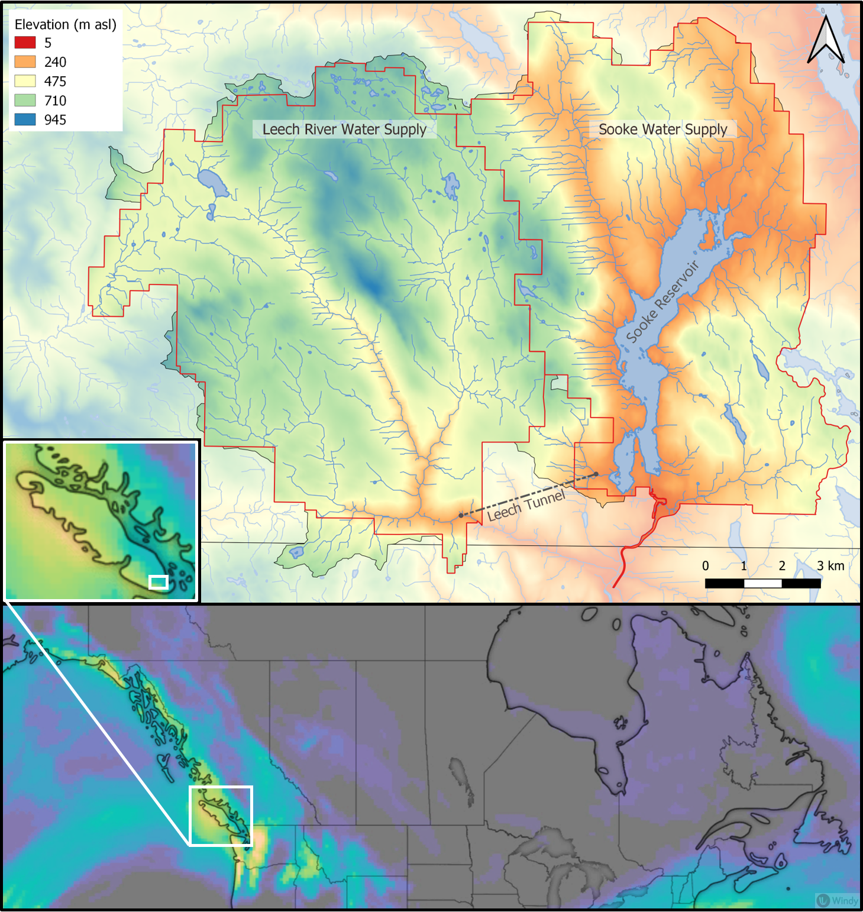
```

\  

Prior to purchase by the CRD, the Leech WSA was privately managed forest land (commercial sustained harvest) which was extensively harvested (nearly 96% clearcut over the past 70 years); as a result, a large portion of the Leech WSA is densely forested with softwood stands around 50 years of age (as of 2020). The second growth forests of the Leech WSA are no longer managed for timber supply, but rather to improve and maintain drinking source water quality and to reduce the risk of landscape level wildfire. Due to prior harvest, reforestation and active fire suppression, forest fire fuels have accumulated in the Leech and pose a threat if a fire occurs. In the Sooke WSA, the CRD implements forest treatments designed to foster healthy forest stands capable of reducing fire intensity, such as reducing fuel hazards and creating conditions that are safe for crews to action a fire (e.g. closed-canopy fuel breaks). Similar preventative fire treatments may be applied in the LWSA prior to inter-basin transfers. 

\  

Before work is done on inter-basin transfers, the Leech River system needs to be better understood. Hydrology and water quality monitoring programs for the Leech WSA began in 2017, thus there is currently little historical data to describe hydrochemical dynamics across the watershed. Further understanding the Leech WSA will help to inform forest management strategies and allow for the effects of fire fuel management on water supply to be better evaluated. Furthermore, describing relationships of event-based water quality dynamics across the Leech WSA will help to anticipate possible treatment challenges that could occur with future inter-basin transfers an mixing between the Leech and Sooke WSAs. Understanding source water quality in relation to hydrology is an essential component to multiple barrier approach to ensuring clean drinking water. 

\  

###   Research questions and objectives

This research was conducted in partnership with the CRD and forWater Network to better understand variations in source water quality across second-growth forested watersheds, primarily with respect to DOC and NOM dynamics. This thesis tackled three research questions (RQ) and associated objectives.

\  

__Research Question 1.__   How does NOM concentration and character vary among adjacent drainage basins and across nested sub-catchments in the Greater Victoria Water Supply Area, and what influence does seasonality have?

__Objective 1:__   Design a sampling strategy to describe spatial and temporal patterns and variation of NOM concentrations and character.

\  

__Research Question 2.__   What are the primary drivers (e.g. watershed characteristics or conditions) for changes in NOM concentrations and character in the Leech watershed?

__Objective 2:__   Relate water sample results to watershed characteristics and conditions to report on relationships between NOM and possible explanatory variables.

\  

__Research Question 3.__   What are the implications for watershed management and future drinking water supply?

__Objective 3:__   Provide context of how results can be used to inform watershed management planning for wildfire reduction strategies and design of continued water quality monitoring for future inter-basin transfers.

\  

Results of this research will contribute to baseline understanding and could be applied in further exploration of forest management strategies, such as fire fuel management, and their impacts on source water quality and supply. 

\  

#### Thesis structure outline

Chapter 2 outlines common methods that were used to generate results discussed in later chapters; it introduces details of the study site, and explains methods used for surface water sampling, laboratory analyses and data handling. Chapter 2 also includes foundational results upon which all subsequent data analysis relied. Chapters 3 and 4 present research findings from two different perspectives. Chapter 3 interprets synoptic sampling results to elucidate broad spatial and temporal patterns in NOM concentrations and character across twelve sites in the GVWSA, and assesses the sampling program design. Chapter 4 focuses on six monitoring sites in the Leech WSA to evaluate research findings in context of watershed drivers for DOC and NOM dynamics. A comprehensive summary and discussion follows.

\  


<!--chapter:end:01_Introduction.Rmd-->

---
output: bookdown::word_document2
---

##	Common Methods 

```{r, include = FALSE, package.startup.message = FALSE}

# load required packages
library(tidyverse)  # keep it tidy
library(readr)      # read in delimited files
library(knitr)      # for nice tables

knitr::opts_chunk$set(warning=FALSE, message=FALSE, echo=FALSE, fig.cap=TRUE)

```

### Introduction

Streamflow events were primarily generated by rain in the Leech WSA, with the watershed responding rapidly to inputs. Synoptic sampling was conducted every two to four weeks, but relying only scheduled synoptic sampling could miss interesting NOM changes during the rising limb of the hydrograph. Furthermore, the logistics of Grab sampling through events at multiple sites would have been challenging for one person to accomplish, could have been dangerous due to high flows, and would have required site access beyond safe working hours (i.e. not logistically feasible). However, it was important to sample across the hydrograph to capture sample-sets that represented variation in DOC and NOM that occurred during changing flow conditions (i.e. within storm variability). Based on cost, logistical considerations and curiosity, siphon sampling strategies were employed at the monitoring sites across the LWSA. 

\  


Surface water samples were collected between October 2018 and February 2020 to measure dissolved organic carbon (DOC) concentration and natural organic matter (NOM) character through space and time in the Greater Victoria Water Supply Area (GVWSA). Samples were analyzed at UBC for DOC concentration and NOM character via high temperature combustion and UV-Vis spectroscopy, respectively (details follow in *'Analytical Techniques'*). The sampling program designed for this project included synoptic sampling of 12 sites across the Sooke and Leech water supply areas (WSA), as well as installation of monitoring and sampling stations at 6 sites in the Leech WSA. This chapter details methods that were common to all subsequent chapters.

\  

###   Sampling sites 

Twelve sites were selected across the GVWSA, most of which were in the Leech WSA. A few key streams in the Sooke WSA were included to facilitate preliminary comparison between the two WSAs for reference to future diversion scenarios. The three Sooke WSA sites were: Rithet, Judge, and Deception creeks. The nine Leech WSA sites were: Weeks, Chris, Jarvis, and Lazar creeks (headwaters), Leech River at the head (below of the confluence of headwaters), Cragg Creek, West Leech River, Leech River at the beach below confluence of West Leech, and the Leech River at the Tunnel (Figure \@ref(fig:sampleSitesMap)).

\  

Rithet Creek is the largest tributary (11.12 km^2^ basin) to Sooke Reservoir and Judge Creek is the second largest (8.33 km^2^ basin). The Leech River Tunnel (currently deactivated) terminates at Deception Gulch ('Deception'), a small tributary (4.02 km^2^ basin) to Deception Reservoir; as such, Deception Reservoir could be used as a balancing reservoir for future inter-basin transfers, and it is separated entirely from the current water supply (Sooke Reservoir) by a dam. The Leech WSA includes two major tributary sub-basins: West Leech River (20.85 km^2^) and Cragg Creek (28.06 km^2^). The Cragg crk sub-basin included two headwater sub-basins: Lazar (4.74 km^2^) and Jarvis (1.51 km^2^). The Leech-Beach site was located just downstream from the confluence of West Leech River with the Leech River mainstem (94.09 km^2^ sub-basin). And near the effective mouth of the Leech WSA, the Leech Tunnel basin included the entire Leech WSA (95.3 km^2^). Headwaters of the Leech River included Weeks and Chris Creek sub-basins; Weeks sub-basin (11.52 km^2^) encompassed Weeks Lake and surrounding wetlands (Jordan Meadows fen), and Chris crk sub-basin (5.8 km^2^) included smaller Worley Lake. Below the confluence of Weeks and Chris crk is the Leech-head site (20.59 km^2^ sub-basin), the head of Leech River.  

\  

```{r sampleSitesMap, fig.cap = fig_cap}
fig_cap = "\\label{fig:sampleSitesMap} Twelve synoptic sampling sites across the Leech and Sooke portions of the Greater Victoria Water Supply Area (BC, Canada). Sites with number were set up as monitoring sites and equipped with Vertical Rack samplers. Black lines delineate sub-basin boundaries (with the sampling point as the outlet)."

knitr::include_graphics("R-inputs_UBC-forWater-MSc_HMc/images/thesis_map_all_sites-catchments.png")
```

\  

Across the GVWSA, elevation ranges from approximately 200 m above sea level (asl) to 941 m asl at the top of Survey Mountain near the center of the Leech WSA (Table \@ref(tab:siteCharacteristics)). The predominant geological formation across the GVWSA was metamorphic parent material (wark gneiss). The wark formation was common to all twelve sampling sub-basins except for West Leech sub-basin, which was underlain by a meta-sedimentary mudstone (argillite-metagreywacke) and the Metchosin Volcanics group (igneous). Median sub-basin slopes ranged from 5$^\circ$ to 13$^\circ$ with maximum WSA slope of 61$^\circ$.

\  

```{r siteCharacteristics}

read_csv("R-inputs_UBC-forWater-MSc_HMc/tables/Ch2_all-site_basin_characteristics_wide-simple.csv", col_names = TRUE) %>%
  knitr::kable(#digits = 1,
               caption = "Watershed Characteristics of Twelve Synoptic Sampling Sites Across the Leech and Sooke Water Supply Areas (WSA), Greater Victoria, BC")
```  

\  

### Sampling methods

####    Synoptic sampling 

Synoptic sampling of the twelve sites was completed over a one- to two-day period. Surface water was collected manually in triple-rinsed acid-washed 250 mL high-density polyethylene (HDPE) wide-mouth amber bottles. Samples were capped with minimal head-space and transported in coolers with ice to the lab for analysis of dissolved organic carbon (DOC) concentrations and spectroscopic absorbance. Synoptic samples were collected every two to four weeks from October 2018 to February 2020. 

\  

Samples were manually collected (via wading) from within 2 meters of the same location at each sampling site, at the safest proximity to channel center, from approximately 10 cm below water surface. All samples were refrigerated while they were held between collection and analysis. Grab samples collected for DOC quantification were filtered and acidified within 48 hours of collection, except for a set of a dozen samples that were collected by CRD staff in January 2020 which were refrigerated for almost two weeks prior to filtration and acidification. Samples for NOM spectroscopy were not acidified, they were confirmed to have zero turbidity (measured as FTU with spectrophotometer) and measured unfiltered with a spectro::lyser (details follow). 

\  

####    Monitoring & sampling stations 

Six of the sampling sites in the Leech WSA were selected for more intensive monitoring (numbered sites in Figure \@ref(fig:sampleSitesMap)). These sites represent the drainage area upstream of the Leech River Tunnel and five sub-basins nested within the Leech Tunnel catchment. Site 6 included the drainage area for the entire Leech WSA and was located at the Leech River Tunnel. The five sub-basin sites represented important portions of the Leech River system: two headwater streams, Weeks and Chris Creek (sites 1 & 2) and the head of Leech River below their confluence (site 3); and two major tributaries that feed the Leech River, Cragg Creek and West Leech (sites 4 & 5). Monitoring at these sites included Vertical Racks to measure river stage, air and water temperatures, and collect surface water samples with passive siphon samplers. Monitoring sites were selected based on year-round access, suitability for installing Vertical Rack structures and safety considerations for sample and data collection.  

\  

Siphon sampling bottles were used on vertical sampling racks as a cost-effective, logistically practical, reliable and consistent method of passively sampling the rising limb of the hydrograph. In addition to passively collecting samples across the Leech watershed during increasing flow conditions, the vertical racks also recorded river stage and air/water temperatures (using HOBO TidbiT v2 Temperature Data Loggers, Onset, USA). 

\  

Each Vertical Rack included a central stilling well (3.81 cm (1.5") PCV pipe with 1.27 cm (1/2") holes along the length) with a measuring tape affixed to the front. Inside the stilling well was an Odyssey Capacitance Water Level Logger (Dataflow Systems Ltd., New Zealand) used to measure stage continuously and determine the date-time at which each siphon sample was collected. Slotted offset angle bars were installed on either side of the stilling well, which held siphon sampler bottles with hose clamps (Figure \@ref(fig:verticalRack)). 

\  

```{r verticalRack, fig.cap = fig_cap}
fig_cap = "\\label{fig:verticalRack} Vertical sampling Rack and siphon sampler bottle, illustrative of installations at six sites across the LWSA (shown here is Chris Creek (site 2))."

knitr::include_graphics("R-inputs_UBC-forWater-MSc_HMc/images/Rack_diagram_full.png")
```  

\  

Siphon sample bottle design was based on a USGS single stage sediment sampler design (US U-59, 1961, [see @Graczyk2000]). The siphon system was created by modifying lids of 250 mL amber HDPE wide-mouth bottles to include an inlet and exhaust tube. Two 1/4" (O.D.) stainless steel tubes (14 cm and 22 cm length), each with a 180$^\circ$ bend at the top end, were inserted into a pre-drilled cap. The taller tube formed the air vent, the shorter acted as the water inlet (Figure \@ref(fig:verticalRack)). The sample bottle filled when water reached the top of the inlet tube bend. When a siphon bottle was submerged below the filling height, a sample was collected in less than 60 seconds. To ensure a water-tight seal around the inlet and exhaust tubes, marine epoxy was applied to the outside of siphon caps and inert silicone sealant was added to the inside of lids. The siphon samplers collected stream water from approximately 5 cm below the surface (the distance between bend at top of intake tube to inlet orifice). Sampled water filled each siphon bottle with approximately 1 cm of head space between the water level and sealed lid, such that a sample was not in direct contact with the siphon lid.   

\  

Each site was visited during synoptic sampling campaigns and acid-washed sample bottles with siphon lids were set out on vertical racks. Sampling bottles were generally staggered at 10-20 cm intervals, though the Rack design allowed for attachment at any height. Bottle filling-stage was recorded from the stilling-well measuring tape at the height that corresponded to the top of each siphon intake tube bend; these positions were used to relate Rack sample collection to continuously recorded stage. Samples were passively collected as rivers responded to precipitation, and were retrieved on subsequent field trips (at which point the filling-stage was double checked). 

\  

During data analysis, each siphon bottle's filling-stage was references to level-logger data to determine the date and time of collection for each rising-stage sample. The timestamps were used to asses temporal variability in DOC & NOM (later Chapters) and to inform quality management of samples (below).   

\  

#####    Siphon sampler assumptions

The representativeness of Vertical Rack samples rely on two key assumptions: (1) the water column was well mixed (no stratification), therefore the sample collected was representative of water quality at each sampling stage; and (2) the sample was discrete, such that there was no infiltration or mixing between surrounding water and the sample in the bottle once it was filled. Observations were used to assess turbulence associated with streamflow at the Vertical Racks and the assumption of fully mixed water seemed justified (see _'Foundational Results'_).

\  

#####    Sampling rack hold-time experiments

Every effort was made to retrieve samples as quickly as possible from the Vertical Racks following hydrologic events. None the less, some Rack samples remained in the field from 3 to 40 days due to logistical, access and safety considerations (e.g. during the winter of 2018/2019, snow limited site access). Hold-time experiments were conducted at the Tunnel site to assess stability of surface water samples held in siphon bottles between Rack sample collection and retrieval. 

\  

The hold-time experiments included replicate surface water sample collection (_n_ = 10) where half the samples were capped with siphon lids and placed out of water on the Vertical Rack ("held" samples), and the other half of samples were immediately returned to the lab for analysis ("fresh" samples). Three sets of hold-time experiments were completed such that the simulated-rack samples were left in the field for 11, 20 and 34 days before being retrieved for analysis and comparison to their counterpart replicates (details in _'Foundation Results'_). The hold-time intervals were selected organically based on sampling campaign trips where the longest interval included a field visit without sample retrieval; these represented a common period between setting bottles on Racks and retrieving full samples (11 days), a longer period between setting and collecting (20 days) and an extended delay (34 days). 

\  

Air temperature data collected at each Vertical Rack were used as part of the hold-time assessment for sample stability. Daily mean air temperatures at each monitoring site were measured and recorded with Hobo TidbiT loggers from 2019-08-24 to 2020-02-18 (field study end), and temperatures prior to TidbiT deployment were estimated by linear regression with CRD weather station data ___(Appendix ######)___.

\  

###   Laboratory analyses of water samples

Surface water samples were transported from the field to the lab in a cooler with ice for quantification of dissolved organic carbon (DOC) and qualitative assessment of natural organic matter (NOM) molecular character. 

\  

#### Quantifying DOC (dissolved organic carbon)

Dissolved organic carbon (DOC), the major constituent of natural organic matter, was quantified as non-purgeable organic carbon (NPOC) via High-Temperature Combustion (Method 5310-B) on a Shimadzu TOC-V [@StdMet5310]. 

\  

##### Sample preparation

Water samples were brought to room temperature, inverted to mix, then filtered and acidified by hand. A clean 60 mL luer-lock syringe was pre-rinsed with sample water three times, then used to triple-rinse a vial (acid-washed 40 mL borosilicate amber glass) with filtered sample water. Samples were filtered using pre-rinsed (filter to waste) 0.45 μm polyethersulfone syringe filters [@Karanfil2003; @StdMet5310]. Each sample was syringe-filtered into its pre-rinsed vial and acidified to bring pH below 2 (by adding 200 μL of 4 M hydrochloric acid, reagent grade, into 35 mL filtered sample). Filtered and acidified samples were sealed with Parafilm and place on the autosampler tray (Shimadzu ASI) for instrumental analysis. If samples were to be stored longer than 48 hours, they were filtered and acidified (as above) at end of the field day, capped with Teflon-lined caps and refrigerated until analysis. 

\  

##### Instrumental analysis methods

The first five vials of each analytic run contained only lab grade water; these blanks were analyzed to (1) flush the system and (2) assess instrumental stability (i.e. precision). In series, the Shimadzu autosampler sparged each sample vial with high purity hydrocarbon-free air (1 minute) to drive off dissolved inorganic carbon. Aliquots of sparged sample (80 μL) were drawn into the TOC-V and catalytically combusted (Shimadzu standard catalyst with quartz wool) to convert organic carbon to carbon dioxide which was measured by non-dispersive infrared gas detection to quantify sample NPOC (i.e. DOC). The instrument measured three to five aliquots from each vial to ensure the replicate measurements coefficient of variation (CV) was below 2% and standard deviation (SD) was below 0.1 mg/L. This method represents a direct quantitative measure of DOC; although small volatile organic compounds could be removed in the sparging process, most NOM compounds are of higher molecular weight (e.g. humic substances) and it is unlikely that DOC analytes would be lost [@StdMet5310; @Matilainen2011; @Aiken1995].

\  

Calibration was completed each time the zero-air gas cylinder was replaced, and in one instance when the gas flow rate was adjusted. A five- or six-point calibration curve (0-30 mg/L organic carbon) was created with series made from stock solution of anhydrous primary-standard grade potassium hydrogen phthalate. Calibration was verified regularly by including a 'cal-ver' in most sample trays (standard organic carbon solution (catalog No.LC129107, labchem.com) gravimetrically diluted to approximately 3-8 mg/L).

\  

#### Characterizing NOM (natural organic matter)

To assess the molecular character of NOM, samples were analyzed by UV-Vis spectroscopy (ultraviolet-visible light) using a spectro::lyser (s::can, Vienna, Austria). The spectro::lyser is a self-contained spectrophotometer and data-logger (with external power source) that measures turbidity and UV-Vis absorbance (i.e. light attenuation) across the wavelength range of 200 nm to 750 nm (recorded at 2.5 nm intervals). While the spectro::lyser is a field-deployable instrument, it was used in a laboratory setting for these analyses. 

\  

##### Sample analysis

Water samples were brought to room temperature, inverted to mix and used to triple-rinse the spectro::lyser sample space prior to analysis. Water samples were analyzed unfiltered and any sample with detectable turbidity (greater than 0.0000 FTU) was excluded from analysis because suspended matter can interfere with UV-Vis absorbance due to light scattering [@StdMet5910]. The spectro::lyser used in these analyses had a fixed pathlength of 35.0 mm. 

\  

##### Instrument and data handling

The spectro::lyser is pre-calibrated with an internal Global calibration file (Global Calib.: "RIVER000V120") to calculate estimates of total organic carbon (TOC), dissolved organic carbon (DOC), and nitrate-nitrogen (NO~3~^-^-N) concentrations. The Global Calibration algorithm was reported as "multi-wavelength algorithms of a turbidity-compensated absorbance fingerprint" [@Avagyan2014]. Spectro::lyser specific absorbance coefficients (SAC, m^-1^) were used to assess NOM molecular character.

\  

NOM molecular character was judged through a combination of specific UV-absorbance at 254 nm (SAC~254~, an indicator of chromophoric NOM), SUVA~254~ (L mg^-1^ m^-1^) which indicates aromaticity relative to DOC concentrations, and the quotient E~2~:E~3~ (unitless) which is inversely proportional to aromaticity and/or molecular weight of aqueous NOM.

\  

###### Spectral indices of NOM character

More aromatic NOM molecules (i.e. humic substances) will absorb more energy at 254 nm wavelength than less-aromatic molecules, so the spectral absorbance coefficient (SAC~254~) is a common indicator of aromaticity. Specific ultraviolet absorbance at 254 nm (SUVA~254~) is an indicator of NOM aromaticity relative to concentration, and is calculated by dividing SAC~254~ by DOC concentration (units of liter per milligram carbon per meter (Lmg-C^-1^m^-1^, i.e. L/mg-m)). Both SAC~254~ and SUVA~254~ are possible indicators of NOM reactivity and as such, each was calculated and evaluated with respect to disinfection by-product formation potential (DBP-FP, more details in _Appendix ####_) and the one most correlated to DBP-FP was selected for continued analysis.

\  

The spectral quotient E~2~:E~3~ is inversely related to aromaticity and molecular size of aquatic humic solutes [@Peuravuori1997; @Helms2008]. E~2~:E~3~ was calculated as the ratio of absorbance coefficients at wavelengths 250 nm and 365 nm (i.e. SAC~250~ / SAC~365~). 

\  

### Defining seasons 

Coastal BC climate is characterized by a predominantly wet season and dry season, but seasonal delineation can be nebulous. Here, seasons were operationally defined by sampling method restrictions such that the "wet" season was defined as the period when conditions generated stream response significant enough for Vertical Racks to collect rising limb samples, and the "dry" season was defined by the absence of stream response substantial enough for Rack sampler collection. 

\ 

Leech WSA rain data (average of Chris Creek and Martin's Gulch FWx stations) were used to define events that corresponded to Rack sample collection. Rain events were defined using the 'RMevents' function in the R package _Rainmaker_ (github.com/USGS-R/Rainmaker), in which threshold rain and inter-event period parameters were tuned to find conditions that defined events which aligned with stream response across the Leech WSA. Defined events were used to help distinguish the start and end of wet and dry seasons, where wet season began when Vertical Rack sampling was initiated by stream stage changes, and ended when streamflow dropped off and Vertical Rack samples were no longer collected. Snow was qualitatively considered when defining seasons, as it did not contribute to event definitions but did contribute to stream levels at the monitoring sites. 

\  

### Foundational results

This section presents results used to informed all subsequent data analysis, interpretation and evaluations discussed in following chapters. Elemental results presented here include weather data and its application in seasonal delineation and quality control for Vertical Rack sampling method development. 

\  

#### CRD weather data

The Capital Regional District (CRD) provided data from two fire-weather ("FWx") stations located in the Leech water supply area (LWSA). Chris Creek weather station was near the headwaters of the Leech watershed and Martin's Gulch was located near the future point of diversion, the Leech River Tunnel (Table \@ref(tab:StnSummary)). Rain data were used in defining sampling seasons and air temperature data were used in quality control assessments of Vertical Rack sample hold-times. 

\  
 
```{r StnSummary}
read_csv("R-inputs_UBC-forWater-MSc_HMc/tables/methods_FWx_Stn_summary.csv",
         col_names = TRUE) %>% 
  knitr::kable(caption = "CRD Fire Weather Station (FWx) Summary of Features")

```

\  

Average LWSA weather data was calculated as arithmetic means from Chris Creek and Martin's Gulch FWx stations data (Table \@ref(tab:meanWxLWSAdata), Figure \@ref(fig:meanWxLWSA), see Appendix for summary of each FWx station). It was assumed that the arithmetic means of rainfall from Chris Creek and Martin's Gulch stations were representative of rain conditions across the Leech WSA and were used to define rain events that corresponded to Vertical Rack sample collection at the six monitoring sites. 

\  

```{r meanWxLWSAdata}
read_csv("R-outputs_UBC-forWater-MSc_HMc/tables/Wx_LWSA-mean-summary.csv", col_names = TRUE) %>% 
  knitr::kable(digits = c(1, 1, 1, 2, 1, 1, 1, 1),
               caption = "Average Weather Data from Chris Creek and Martin's Gulch Fire-weather Stations in Leech Water Supply Area in 2018, 2019, and the Period of 2020 Included in This Project")
```

\  

```{r meanWxLWSA, fig.cap = fig_cap}
fig_cap = "\\label{fig:meanWxLWSA} Average weather from Chris Creek (560 m a.s.l) and Martin's Gulch (512 m a.s.l) fire-weather stations in the Leech Water Supply Area, where the highlighted section indicates the study period."

knitr::include_graphics("R-outputs_UBC-forWater-MSc_HMc/figures/Wx_LWSA-means.png")
```

\  

#### Seasonal delineation  

Wet seasons were defined by conditions that generated stream responses significant enough to collect Vertical Rack samples, and the dry season was defined by baseflow conditions where stream response was not detected at the Vertical Racks. There were 18 rain events of sufficient magnitude for Vertical Rack sample collection; the conditions that corresponded to these major rain events were precipitation accumulating to 50 mm or more with a period of at least 14 hours between 50 mm rain accumulation (Table \@ref(tab:EventsTable)). 

\  

```{r EventsTable}
read_csv("R-outputs_UBC-forWater-MSc_HMc/tables/Wx_Events.csv",
         col_names = TRUE) %>% 
  select(-c("Storm number")) %>% 
  knitr::kable(digits = c(0, 0, 1, 1, 0), 
               caption = "Rain Events Defined by Vertical Rack Sample Collection (corresponding to a threshold of 50 mm accumulation with 14-hour inter-event period)" )

```

\  

The sixteen-month study period was separated into "wet" and "dry" seasons based on detectable stream response at each monitoring site and across the GVWSA, stream response was primarily driven by the presence of major rain events (Table \@ref(tab:EventsTable)). However, there was a period of snowfall (winter of 2018/2019) when rainfall runoff subsided and melt generated streamflow response across the monitoring sites. That period of snow accumulation and melt was included when delineating the 2018/2019 wet season, despite the lack of defined rain events (Figure \@ref(fig:seasonalMegaPlot)). The 2018/2019 wet season extended from the start of the project (October 2018) to mid-May 2019, with streamflow governed by snowmelt rather than rainfall during the period from late January (event 8, Table \@ref(tab:EventsTable)) to mid-May 2019. The dry sampling season spanned from mid-May to late-September 2019, and the 2019/2020 wet season began mid-September (event 9, Table \@ref(tab:EventsTable)) and extended to the end of the field study period (Feb 20, 2020).

\  

```{r seasonalMegaPlot, fig.cap = fig_cap}
fig_cap = "\\label{fig:seasonalMegaPlot} Leech Water Supply Area air temperature and precipitation plotted with stream responses and sample collection at six monitoring sites. Vertical yellow lines indicate seasons, distinguished by stormflow Vertical Rack sampling (wet season). The dashed yellow line shows the 2018/2019 wet season separation of rain and snowmelt dominated streamflow. The 'first flush' period indicates the first event and beginning of the 2019/2020 wet season. " 

knitr::include_graphics("R-outputs_UBC-forWater-MSc_HMc/figures/Wx-stage_subbasins_season-megaplot2.png")
```

\  

#### NOM reactive character: SAC~254~ rather than SUVA~254~

Comparison between disinfection byproduct formation potential (BDP-FP) with DOC, SUVA~254~ and SAC~254~ (Appendix #########) showed that SAC~254~ was a better correlated to DBP-FPs (r=0.68) than was SUVA~254~ (r=0.36) or DOC (r=0.50). Thus, SUVA~254~ was largely omitted from results while SAC~254~ was included as an indicator of NOM aromaticity and reactivity. 

\  

#### Vertical Rack sampling quality control

##### Assumptions of mixing

Trail cameras were installed at four sites (data not included here) and observation of streamflow during Rack sample collection showed highly turbulent flows, thus the assumption of well-mixed water was accepted. 

\  

Discrete sample collection was validated in lab using food colouring and a flow-through bucket system. A siphon sampler bottle was submerged in a container filled with circulating tap water; following siphon sample collection, food colouring was added to the system and circulated for 15 minutes, then the sample bottle was removed from this dye chamber and the colour of the sample inside the siphon bottle was visually compared to the dyed water that had circulated around it. This test was repeated five times with different siphon-lid bottles. There was no dye present in any of the siphon sample bottles following the tests. This test satisfied the assumption of discrete siphon sample collection.  

\  

##### Hold-time experiments

Hold-time experiments included three sets of 10 samples, each set compared 5 samples held on the Vertical Rack to 5 replicate samples analyzed immediately after collection ("fresh"). For each set, the number of days that samples remained held on the Rack were used with air temperatures during the hold-period to assess Rack sample stability (Figure \@ref(fig:HoldTimeAirPlot)). Results were used to flag data as suspect or acceptable for inclusion in further data analysis.

\  

```{r HoldTimeAirPlot, out.width = "100%", fig.pos="h", fig.cap = fig_cap}
fig_cap = "\\label{fig:HoldTimeAirPlot} Air temperature during vertical rack hold-time experiments. Red horizontal lines indicate the 0-7°C range of a typical laboratory refrigerator and dashed vertical lines separate the three sets of hold-time experiment samples including the period between collection of 'fresh' samples to the retrieval of 'held' (Rack) samples."

knitr::include_graphics("R-outputs_UBC-forWater-MSc_HMc/figures/HoldTime_airTemp_megaplot.png")
```

\  

All samples were analyzed to quantify DOC and characterized NOM properties and the fresh and held samples of hold-time set were compared using two-sided paired Wilcoxon signed rank tests (a.k.a 'Mann-Whitney' test, non-parametric paired difference test that does not assume normally distributed data). For a wider margin of error, a 90% confidence level (rather than 95% or 99%) was used to evaluate comparisons between fresh and held sample results (Table \@ref(tab:HoldTimeTtests)).

\ 

```{r HoldTimeTtests}
read_csv("R-outputs_UBC-forWater-MSc_HMc/tables/HoldTime_results-summary.csv", col_names = TRUE) %>%
  knitr::kable(caption = "Results comparing three Vertical Rack hold-time experiment sets for sample stability in the field",
               col.names = c("Set", "Days held", "Air temp.", 
                             "DOC change (%)", "p-value (DOC)", 
                             "SAC~254~ change (%)", "p-value (SAC~254~)", 
                             "E~2~:E~3~ change (%)", "p-value (E~2~:E~3~)")) 
```
_Note:_ one star (*) indicates significant difference at 90% confidence (p < 0.1), 
two stars (**) indicates significant difference at 95% confidence (p < 0.05)


\  

There was a significant change in DOC concentration (at 90% confidence, p-value = 0.063) for hold-time set A, where mean DOC concentration was 45% lower in the held samples compared to the fresh grab samples. Despite a change in concentrations, there was no change in NOM character as measured by SAC~254~ or E~2~:E~3~. Samples collected for hold-time set A were DOC-rich "first flush" samples (i.e. the first sampling event of a wet season), and the Rack samples were held for 11 days at average temperature of 7° C (slightly above laboratory refrigerator temperatures). 

\  

Set B had a hold-time of 20 days with average air temperature of 6° C. There were no significant changes to DOC concentrations or E~2~:E~3~ values between fresh and rack-held samples for this set. Wilcoxon tests for set B showed that the 8% change in SAC~254~ was statistically significant (at 90% confidence). However, the SAC~254~ difference in set-B was determined to be caused by an outlier which could be rejected with 99% confidence by Dixon's Q-test (Q~exp~ = 0.941 > Q~crit~ = 0.821). Therefore, it was concluded that, despite the measured difference (Figure \@ref(fig:HoldTimeBoxPlot), Table \@ref(tab:HoldTimeTtests)) there was no real change in SAC~254~ for hold-time set B. 

\  

Hold-time set C included samples held for 34 days at an average of 4.4° C, including a period of sub-zero temperatures. While set C did not yield statistically significant changes in DOC concentration (23% DOC reduction from fresh to held), there were significant changes to SAC~254~ (34% decrease in absorbance), and E~2~:E~3~ (14% decrease). In addition to the change in absorbance, rack-held set C samples had greater variability for both all variables compared to the fresh sample counterparts (Figure \@ref(fig:HoldTimeBoxPlot)). 

\  

```{r HoldTimeBoxPlot, fig.cap = fig_cap}
fig_cap = "\\label{fig:HoldTimeBoxPlot} Comparison of three hold-time experiment sets, contrasting 'fresh' and 'held' sample results for DOC concentrations, spectral absorbance coefficient at 254 nm (SAC~254~) and the spectral quotient E~2~:E~3~ (SAC~250~/SAC~365~)."

knitr::include_graphics("R-outputs_UBC-forWater-MSc_HMc/figures/HoldTime_boxplots.png")
```

\  

#### Summary 

Results of hold-time experiments suggest that early-wet-season ("first flush") samples may contain more labile and aliphatic DOC which is unstable and should be analyzed immediately after collection, whereas later season samples contain DOC which is relatively more stable for up to and including 20 days when held at temperatures that approximate a refrigerator. A hold-time of 34 days with periods of freezing resulted in significant changes to sample NOM molecular character (i.e. aromaticity, molecular size, reactivity); and while DOC concentrations were not statistically altered, there was a notable increase in held sample DOC standard deviation. Additional tests would be required to determine if the change in NOM character was caused by the length of time the sample was held, or perhaps due only to freezing and thawing, or a combination of both time and temperature. Based on these results, sample analyses data were updated to include quality-assurance/quality-control (QA/QC) flags which were used to filter sample data, reducing the effective number of samples included in results by less than 10%. 

\  

Hold-times were calculated for each sample as the time between sample collection and analysis. Any sample that remained held for fewer than 20 days at temperatures between 0-7° C were flagged as acceptable for further data analysis; Rack samples that were held for 20 days or longer were flagged for exceeding a reliable hold-time; and samples identified as early-wet-season ("first-flush") that had a hold-time of 7 days or longer were flagged as unreliable and not included in further data analysis. Because of possible freeze-thaw changes to DOC and NOM, any sample that underwent suspected or confirmed freezing was also flagged for temperature effects. Hold-time test experiments indicate that extended time in the field on a Vertical Rack could result in a decrease in DOC but not an increase, therefore no positive bias in DOC result should be suspected from event-based samples.    

\  

In future studies, more in-depth ‘discrete sample collection’ validation tests could be performed with similar food colouring and flow-through bucket system. Possible avenues to explore could include pressure effects of mixing for siphon sample bottles submerged at increasing depths, and spectroscopic analysis of water for more precise verification of any sample mixing post-collection. Additional Hold-time tests could also be performed for more refined method development; the primary suggestion for this includes repeated trials with the same hold-time interval (e.g. 10 days) over different weather and stream conditions (e.g. replicate sets in early-, mid-, and late- wet-season).

\  


<!--chapter:end:02_Common_Methods-Results.Rmd-->

---
output: bookdown::word_document2
---

##	Spatial and Temporal Patterns in NOM Concentration and Character Across the Greater Victoria Water Supply Areas

```{r, include = FALSE, package.startup.message = FALSE}

# load required packages
library(tidyverse)  # keep it tidy
library(readr)      # read in delimited files
library(knitr)      # for nice tables

knitr::opts_chunk$set(warning=FALSE, message=FALSE, echo=FALSE, fig.cap=TRUE)

```

\  

### Synopsis 

The methods defined in Chapter 2 were used to collect and analyze surface water samples across the twelve Greater Victoria water supply area sites (GVWSA, refer to Figure \@ref(fig:sampleSitesMap) for map). The objective was to describe spatial and temporal patterns and variation of natural organic matter (NOM) concentrations (as dissolved organic carbon, DOC) and spectral character (SAC~254~ and E~2~:E~3~). Additionally, sampling results were interpreted with the goal of clarifying the influence of seasonality on concentration and character of NOM.     

\  

### Methods

All samples were collected by methods described in Chapter 2, and all data was flagged and filtered based on quality assurance described therein. Here, NOM is assessed based on concentrations of dissolved organic carbon (DOC) and character is indicated by SAC~254~ (reactivity & aromaticity) and E~2~:E~3~ (molecular size & aromaticity). 

\  

Synoptic sample results were evaluated for spatial patterns by comparing low- to high-order streams, between the Leech and Sooke portions of the GVWSA, and by sampling methods at upstream and downstream sites. To assess temporal patterns, results were examined over the full study period (Oct 2018 to Feb 2020), and grouped by sampling season (wet & dry seasons). For shorter scale temporal pattern assessment, rising limb event-based Rack samples from the six monitoring sites in the Leech WSA were compared to inter-event sampling results (i.e. standard Grab samples). 

\  

### Results

From October 2018 to February 2020, across the GVWSA 426 river samples were collected and analyzed for DOC, and 318 of those samples were analyzed by UV-Vis for NOM character assessment (Table \@ref(tab:samplecount)). Fewer samples were analyzed for UV-Vis properties than for DOC concentration due to method evolution at the start of the project and instrument-sharing limitations. Of the samples collected and analyzed, DOC data were reduced by 9.2% (to 387 samples) during Hold-time quality control checks (described in Chapter 2) and UV-Vis data were reduced by 19.5% (to 256 samples). Quality control resulted in a 9% reduction in UV-Vis data and an additional 10.5% was unfortunately lost during instrument maintenance. Analysis of calibration verification standards resulted in an average analytical accuracy of 10% (_n_ = 20).  

\  

```{r samplecount}
read_csv("R-outputs_UBC-forWater-MSc_HMc/tables/summary_samples-count.csv", col_names = TRUE) %>% 
  knitr::kable(caption = "Summary of Samples Collected and Number Included in Data Analysis") 
```

\  

Samples were also measured for phosphate concentration using a colourimetric (ascorbic acid) orthophosphate test kit (HACH PO-19); all water samples had ortho-phosphate concentrations below the detectable limit (0.1 mg/L).

\  

#### Spatial patterns in NOM quantity and quality  

From 366 quality-controlled river water samples collected over 16 months, DOC ranged from 1.6 to 19.1 mg/L (5.7 mg/L median) with mean DOC of 6.1 ± 2.9 mg/L overall. The relative standard deviation (RSD = std.dev/mean) for DOC in each of the synoptically sampled sites was at least 24% and at most 71%, indicating a wide range of variance among the sites. 

\  

The headwaters sites of Weeks creek (11.52 km^2^ sub-basin) and Jarvis creek (1.51 km^2^ sub-basin) had the highest DOC concentrations of the twelve sampling sites (means of 9.9 mg/L and 9.7 mg/L, respectively). The lowest DOC concentrations were recorded at the sampling sites of the Rithet crk sub-basin (11.12 km^2^) and the Leech Tunnel sub-basin (95.3 km^2^) and their means (5.4 mg/L and 4.8 mg/L, respectively) were not unlike other streams of 3rd order or above (overall average 5.18 mg/L). The greatest range in DOC concentrations was measured at the Rithet crk site, which had a mean of 5.4 ± 3.9 mg/L (relative standard deviation, RSD, of 71%). The site with the second highest DOC range was the West Leech sub-basin (20.85 km^2^) with mean DOC of 5.8 ± 2.4 mg/L (41% RSD). Between these two sites with the highest DOC variance, the West Leech -- a monitoring site -- was more heavily sampled than Rithet -- a synoptic sampling site alone (Table \@ref(tab:synopticDOCdata)).  

\  

Mean DOC concentrations were similar between Judge crk (8.33 km^2^ sub-basin) and Rithet crk, the Sooke WSA main tributaries (mean DOC of 5.7 ± 1.1 mg/L and 5.4 ± 3.9 mg/L, respectively). Comparing these Sooke WSA main tributary sites to the future supplemental supply (Leech Tunnel site), mean DOC was similar among the three, but slightly higher in the Sooke WSA than at the Leech Tunnel (4.8 ± 1.8 mg/L), though the number of samples collected at the Tunnel was much greater (Table \@ref(tab:synopticDOCdata)).  

\  

```{r synopticDOCdata}
read_csv("R-outputs_UBC-forWater-MSc_HMc/tables/Ch3_DOC-Synoptic-summary.csv", col_names = TRUE) %>% 
  knitr::kable(digits = c(0, 0, 0, 1, 1, 0, 2, 1, 1),
               caption = "Dissolved Organic Carbon Concentrations (DOC) Across Twelve Synoptically Sampled Sites in the Greater Victoria Water Supply Area",
               col.names = c("Site", "Description", "Count", 
                             "Mean DOC (mg/L)", "sd (±)", "Relative sd (± %)", 
                             "Min. DOC (mg/L)", "Median DOC (mg/L)", "Max. DOC (mg/L)"))

``` 

\  

Overall, DOC decreased from low-order headwater streams to higher-order downstream sites (Table \@ref(tab:synopticDOCdata), Figure \@ref(fig:synopticBox)). Like concentration, there was an overall reduction in NOM character (i.e. aromaticity, reactivity, and/or molecular size) from upstream to downstream sites (Table \@ref(tab:synopticNOMdata), Figure \@ref(fig:synopticBox)). The lowest absolute measurement for NOM aromaticity occurred at the Cragg crk site (minimum SAC~254~ 4.69 m^-1^, maximum E~2~:E~3~ of 5.03). Cragg crk also had among the lowest mean aromaticity, though it tied with Judge crk (mean E~2~:E~3~ of 4.59), abd both were very close to Lazar crk (mean E~2~:E~3~ of 4.55, and mean SAC~254~ 10.6 m^-1^). Surprisingly, while the Cragg crk site recorded the lowest absolute (and had among the lowest average) aromaticity, it's headwater sites (Jarvis and Lazar creeks) had samples with the most aromatic character. Lazar crk had one of the most aromatic samples of all measured samples (lowest recorded E~2~:E~3~, 3.77), and the other headwater creek in Cragg basin, Jarvis creek, had the other most aromatic sample measured by SAC~254~ (41.7 m^-1^). So, Lazar crk had the lowest aromatic NOM on average, but it also had one of the most aromatic samples of all (Table \@ref(tab:synopticNOMdata), Figure \@ref(fig:synopticBox)). Indeed, Lazar had the greatest range in E~2~:E~3~ values with 9% RSD. Overall, the most diversity in aromaticity measured by SAC~254~ were recorded in samples from the headwater sites of Chris crk (50% RSD), Jarvis (47% RSD) and Lazar (45% RSD). And the site with the greatest average aromaticity was Weeks crk (mean SAC~254~ 30.3 m^-1^, mean E~2~:E~3~ 4.27).

\  

```{r synopticNOMdata}
read_csv("R-outputs_UBC-forWater-MSc_HMc/tables/Ch3_NOM-Synoptic-summary.csv", col_names = TRUE) %>% 
  knitr::kable(digits = c(0, 0, 0, 1, 1, 0, 2, 2, 2, 2, 0, 2, 2), 
               caption = "Spectral Properties of Natural Organic Matter (NOM) Character Across Twelve Synoptically Sampled Sites in the Greater Victoria Water Supply Area",
               col.names = c("Site", "Description", "Count", 
                             "SAC~254~ Mean (m^-1^)", "stdev (±)", "RSD (± %)",
                             "SAC~254~ Min. (m^-1^)", "SAC~254~ Max. (m^-1^)",
                             "E~2~E~3~ Mean (unitless)", "stdev (±)", "RSD (± %)",
                             "E~2~E~3~ Min.", "E~2~E~3~ Max."))
``` 

\  

```{r synopticBox, fig.cap = fig_cap}

fig_cap = "\\label{fig:synopticBox} Synoptic sampling results of dissolved organic carbon concentrations from 12 sites (arranged left to right from upstream to downstream). Samples were collected from Oct 2018 to Feb 2020. Symbol type indicates samples were collected by siphon samplers on Vertical Racks (triangle) or synoptic Grab sample (circle), outliers are indicated with an 'x'."

knitr::include_graphics("R-outputs_UBC-forWater-MSc_HMc/figures/Ch3_boxplot_allParams-allSites-allSamples.png")
```

\ 

The Leech River Tunnel is the effective outlet of the Leech WSA, where runoff from each nested catchment is integrated. Similarly, from a headwater's perspective, runoff from the sub-basins of Weeks and Chris crk are integrated at the Leech-head site, and Jarvis and Lazar creek sub-basins are ultimately integrated at the Cragg crk site. There was a greater distance between the Cragg crk site and its headwaters' sampling sites compared to Leech-head and its headwaters' locations (see Figure \@ref(fig:sampleSitesMap)). Within these nested catchments, sampling methods were evaluated to assess whether a Rack sampler combined with Grab sampling downstream of a confluence captured the same range in DOC as synoptic Grab sampling at upstream sites. Synoptic Grab samples from the headwater sites of Weeks and Chris crk were compared to Rack and Grab samples from below their confluence at Leech-head (Figure \@ref(fig:abcDOCbox), plot A). Similarly, Grab samples collected at the headwaters of Cragg crk, Jarvis and Lazar, were compared to all samples at the Cragg crk monitoring site (Figure \@ref(fig:abcDOCbox), plot B). Higher order rivers were also examined in a similar way, comparing Rack and Grab samples at the Leech Tunnel to Grab samples collected upstream at Leech-Head, Cragg crk and West Leech sites (Figure \@ref(fig:abcDOCbox), plot C).

\    

Below the confluence of headwaters sites, the combination of Rack and Grab sampling did not capture the ranges of DOC observed in upstream Grab samples alone. Leech-Head, below the confluence of Weeks and Chris crk, collected DOC concentrations that were close to the average of the two headwaters (Figure \@ref(fig:abcDOCbox), plot A); the variance obtained by combining Rack and Grab samples downstream was not the same as upstream Grab sampling variance (Levene's test for homoscedasticity p-value = 3.8 x 10^-5^). Similarly, Rack and Grab samples collected at Cragg crk did not cover the same DOC variance as Grab sampling at the headwaters Jarvis and Lazar (Levene's p-value 0.0011). Unlike Leech-Head, which had near-average DOC concentrations relative to its two headwaters, samples collected at Cragg crk had DOC that was lower than concentrations in either of its headwater sites (Figure \@ref(fig:abcDOCbox), plot B). The differences in DOC attenuation between these two headwater sets can be attributed to different reach lengths between headwaters' confluence and the downstream monitoring sites; where Leech-Head was very close to the headwaters' confluence and Cragg crk was considerably further from its headwaters' sampling locations.

\  

When higher order rivers were examined in a similar upstream Grab to downstream Rack & Grab comparison, the combination of Rack and Grab samples at the Leech Tunnel site did capture the DOC ranges observed in Grab samples at three upstream sites (Figure \@ref(fig:abcDOCbox), plot C). Levene's test for homogeneity of variance (homoscedasticity) confirmed that there was no difference in DOC variance in the downstream Rack/Grab combination results compared to Grab-only from upstream (p-value 0.165). Similar trends were seen for SAC~254~ but not E~2~:E~3~ (Appendix ####).  

\  

At the future point of diversion, Leech Tunnel (5th order stream), it was found that the combination of Vertical Rack and Grab samples collected the same variance in DOC that was observed in Grab samples alone upstream across three upstream sites (Leech-head, Cragg crk, West Leech). This indicates that well-represented water quality monitoring for the Leech WSA could be achieved by combining event-based (i.e. Vertical Rack) sampling with standard Grab sampling at the future point of diversion; this would be comparable to standard grab sampling at major tributaries upstream. In the headwaters, however, Rack sampling combined with Grab sampling at 4th order streams did not capture the variance in DOC observed upstream in Grab samples from 3rd order headwater stream samples; this is likely due to the greater variability at lower-order streams. 

\ 

```{r abcDOCbox, fig.cap = fig_cap}
fig_cap = "\\label{fig:abcDOCbox}  Comparison of dissolved organic carbon concentrations collected by Grab sampling at upstream sites compared to results obtained from both Vertical Rack and Grab sampling below their confluence(s). Plots A and B show Grab samples from headwater (HW) sites compared to Rack & Grab at downstream (DS) monitoring sites. Plot C shows DOC from Grab samples collected at upstream sites (US) compared to Rack & Grab at the mainstem monitoring site."

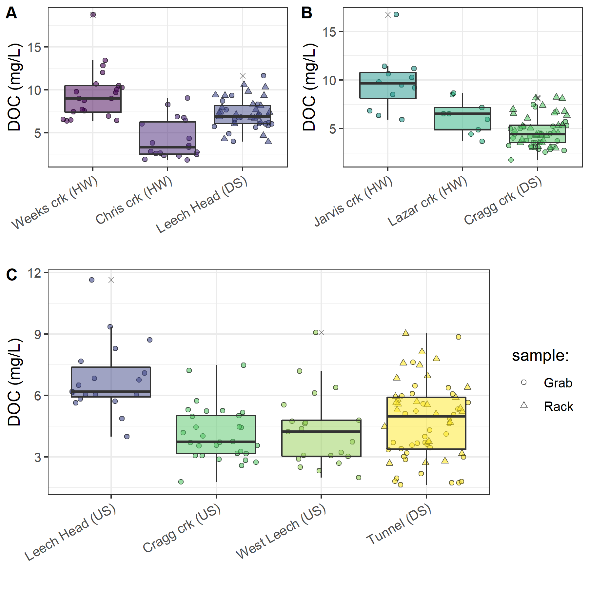
```

\  

#### Temporal patterns & seasonal changes

From Oct 2018 to Feb 2020, DOC concentrations followed similar patterns across the synoptic sampling sites (Figure \@ref(fig:DOCloessAll)). DOC was highest early in the wet season and progressively decreased through the fall and winter, reaching minimum concentrations at the end of the wet season (in the spring), and progressively increasing over the dry season (summer). These patterns appear as a nearly sinusoidal trend in DOC over the sampling seasons (Figure \@ref(fig:DOCloessAll)).

\  

```{r DOCloessAll, fig.cap = fig_cap}
fig_cap = "\\label{fig:DOCloessAll} Dissolved organic carbon concentrations over sixteen months (Oct 2018 - Feb 2020) at twelve sites across the Greater Victoria Water Supply Area. Trend line shows locally weighted smoothing (loess method, local polynomial regression)."

knitr::include_graphics("R-outputs_UBC-forWater-MSc_HMc/figures/Ch3_DOC-loess-trend.png")
```

\  

There were few data points from mid-February through March 2019 (when snow limited field access); however, DOC concentrations were decreasing up to that gap, and were low following it. Thus, the loess trend line in Figure \@ref(fig:DOCloessAll), though it includes this data-sparse period, appears to match with the overall pattern observed in available data.

\  

Despite DOC fluctuation over time, there was almost no difference between mean DOC concentrations during the wet and dry seasons (6.13 mg/L compared to 6.14 mg/L, Table \@ref(tab:seasonalSummary)). However, there were far fewer DOC samples collected in the dry season (55) than during the wet season (311). In a similar ratio, there were fewer spectral NOM characteristic samples collected in the dry season (25) than wet (139). While NOM concentration remained the same on average between seasons, higher SAC~254~ values in wet season samples indicated greater NOM aromaticity and reactivity compared to dry season stream samples (Table \@ref(tab:seasonalSummary)). Concentration (as NPOC) was well correlated with SAC~254~ during the wet season (R^2^ = 0.896, _n_ = 149) and during the transition from dry to wet seasons (first-flush event, R^2^ = 0.916, _n_ = 14), but the relationship between DOC concentration and SAC~254~ was weak during the dry season (R^2^ = 0.396, _n_ = 25). The seasonal discrepancy between NOM concentration and spectral character is indicative of a shift in NOM source pools between seasons, with allochthonous (humic-like, aromatic) sources contributing in the wet season and autochthonous (biolabile algal-derived, aliphatic) sources dominating in the dry season (Figure \@ref(fig:seasonalDOCest)). 

\  

```{r seasonalSummary}
read_csv("R-outputs_UBC-forWater-MSc_HMc/tables/Ch3_seasonal-summary_conc-char.csv", col_names = TRUE) %>%
  knitr::kable(digits = c(0,0,0, 2,2,2, 0,0, 2,2,2),
                   caption = "Sample Summary by Season for NOM Concentration (DOC) and Character (SAC~254~) from Twelve Synoptic Sampling Sites Across the Greater Victoria Water Supply Area",
               col.names = c("Season", 
                             "DOC sample count", 
                             "Mean DOC (mg/L) ± RSD (%)", "Min. DOC (mg/L)", "Median DOC (mg/L)", "Max. DOC (mg/L)",
                             "SAC~254~ sample count", 
                             "Mean SAC~254~ (m^-1^) ± RSD (%)", "Min. SAC~254~ (m^-1^)", "Median SAC~254~ (m^-1^)", "Max. SAC~254~ (m^-1^)" ))
```

\  

```{r seasonalDOCest, fig.cap = fig_cap}
fig_cap = "\\label{fig:seasonalDOCest} Stream samples collected Oct. 2018 to Feb. 2020 from twelve sites in the Greater Victoria Water Supply Area (B.C) showing seasonal relationships between dissolved organic carbon concentration (DOC) plotted against spectral absorbance coefficient at 254 nm (SAC~254~, m^-1^). The inset plot shows DOC (as NPOC) plotted against DOC estimated by the spectro::lyser spectrophotometer through an internal calibration file referenced to SAC~254~, where the dashed lined indicates best fit (1:1)."

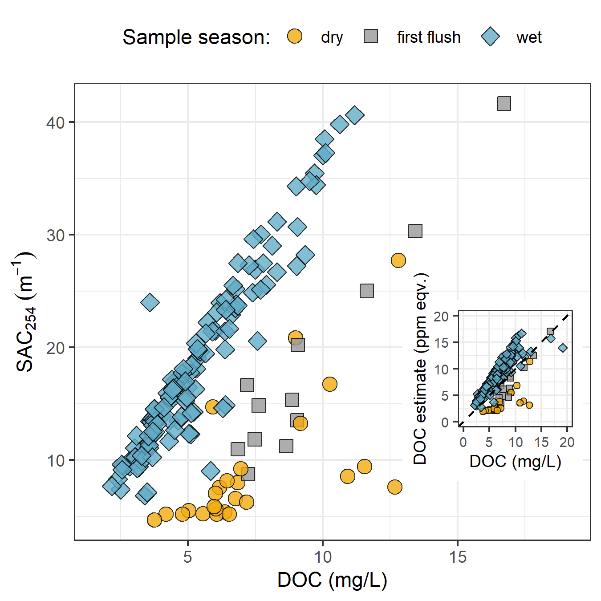
```

\  

The seasonal shift in NOM source pools indicates that if spectral estimates of concentration are used in studies, season-specific and site-based calibrations should be conducted. Results show that wet-season NOM character causes positive bias in absorbance-based DOC estimates and dry-season sample characteristics lead to negative bias in UV-based DOC estimates (inset, Figure \@ref(fig:seasonalDOCest)).  

\  

##### Spatiotemporal patterns & event-based sampling at six monitoring sites in the Leech watershed

\  

The most heavily sampled sites were those equipped with Vertical Racks, which collected many samples in the wet season. Isolating sample results from the six monitoring sites during only the wet season allowed for comparison of results from event-based Vertical Rack samples to standard synoptic Grab samples (Table \@ref(tab:wetDOCcountInstallsites)). Across the six sites, event-based Rack samples contained higher NOM concentrations on average than Grab samples (6.8 mg/L compared to 5.2 mg/L DOC). Event-based samples also carried NOM with greater aromaticity and reactivity (21.37 m^-1^) compared to inter-event samples (17.03 m^-1^). A slightly greater variance (relative standard deviation, RSD) in both concentration and character was captured through Grab sampling (±53% DOC and ±44% for SAC~254~) compared to Rack sampling (±41% DOC and ±32% for SAC~254~). This suggests that stormflow sustained greater concentrations of more aromatic NOM compared to relatively more variable lower concentrations of more aliphatic NOM during inter-event flows. Between Grab and Rack samples, average wet season NOM concentrations were 6.14 mg/L and average SAC~254~ was 18.92 m^-1^ (Table \@ref(tab:wetDOCcountInstallsites)).    

\  

```{r wetDOCcountInstallsites}
read_csv("R-outputs_UBC-forWater-MSc_HMc/tables/Ch3_wet-season-summary_conc-char_overall.csv", col_names = TRUE) %>%
  knitr::kable(digits = c(0,0,0,2,2,2,0,0,2,2,2),
               caption = "Wet Season Dissolved Organic Carbon (DOC) by Sample Collection Method at Six Monitoring Sites in the Leech Watershed",
               col.names = c("Sample type", "DOC sample count", 
                             "Mean DOC (mg/L) ± RSD (%)", 
                             "Min. DOC (mg/L)", "Median DOC (mg/L)", "Max. DOC (mg/L)",
                             "SAC~254~ sample count", 
                             "Mean SAC~254~ (m^-1^) ± RSD (%)", 
                             "Min. SAC~254~ (m^-1^)", "Median SAC~254~ (m^-1^)", "Max. SAC~254~ (m^-1^)"))
```

\  

Leech-head was the only site where the maximum DOC concentration was obtained by Grab sampling (11.6 mg/L), rather than Rack (max 10.6 mg/L). At all other monitoring sites, event-based samples collected by Vertical Racks had higher mean DOC compared to Grab samples (Table \@ref(tab:wetDOCinstallSites)). For NOM character, Leech-head and Weeks crk both had slightly higher average aromaticity collected in Grab samples compared to Rack samples; at each of these two sites, the highest minimum concentration was collected by Grab sample (Table \@ref(tab:wetDOCinstallSites)). The other four monitoring sites all showed greater aromaticity in Vertical Rack samples than in Grab samples. 

Weeks crk had the highest DOC and greatest aromaticity overall. Weeks had slightly higher concentrations occurring during stream rise (10.3 mg/L mean) compared to between events (9.3 mg/L mean). Meanwhile, SAC~254~ in Rack samples was lower with greater variability (28.7 m^-1^ ± 47%) compared to Grab samples (33.0 m^-1^ ± 9%). A similar pattern was seen downstream at Leech-head, where Rack samples had slightly lower and less consistent aromaticity (24.04 m^-1^ ± 26%) than Grab samples (24.92 m^-1^ ± 8%). The other sites showed greater aromaticity and higher variance in Rack samples than Grabs (Table \@ref(tab:wetDOCinstallSites)). The difference observed at the Weeks crk site was likely due to inter-event flows being sustained by more aromatic water from this sub-basin's wetlands and lake, and event flows being more dilute in character due to precipitation inputs.   

Interestingly, Rack sampling at Weeks crk captured that site's highest and lowest DOC concentrations (minimum of 3.8 mg/L, maximum of 19.1 mg/L). West Leech showed the greatest difference in DOC collected as Grab samples (4.2	± 1.9) versus event-based Rack samples (6.7 ± 2.2 mg/L). This suggests that hydrologic pulses in the West Leech sub-basin created considerably different DOC transport than non-stormflow in that sub-basin (Table \@ref(tab:wetDOCinstallSites), Figure \@ref(fig:wetSeasonPlot)). 

\  

```{r wetDOCinstallSites}
read_csv("R-outputs_UBC-forWater-MSc_HMc/tables/Ch3_wet-season-summary_conc-char_by-site.csv", col_names = TRUE) %>%
  knitr::kable(digits = c(0,0,0,0,2,2,2,0,0,2,2,2),
               caption = "Wet Season Stream NOM Concentration and Character (as DOC & SAC~254~, respectively) by Sample Collection Method at Each of the Six Monitoring Sites in the Leech Watershed",
               col.names = c("Site", "Sample type", "DOC sample count", 
                             "Mean DOC (mg/L) ± RSD (%)", 
                             "Min. DOC (mg/L)", "Median DOC (mg/L)", "Max. DOC (mg/L)",
                             "SAC~254~ sample count", 
                             "Mean SAC~254~ (m^-1^) ± RSD (%)", 
                             "Min. SAC~254~ (m^-1^)", "Median SAC~254~ (m^-1^)", "Max. SAC~254~ (m^-1^)"))
```

\  

```{r wetSeasonPlot, fig.cap = fig_cap}
fig_cap = "\\label{fig:wetSeasonDOC} NOM concentration and character during the wet saeason at six monitoring sites, comparing samples collected by Vertical Racks (event-based) and standard synoptic Grab sampling. Plot A shows dissolved organic carbon (DOC) concentration and plot B shows spectral absorbance coefficient values at 254 nm (SAC~254~), which indicates NOM aromaticity and reactivity."

knitr::include_graphics("R-outputs_UBC-forWater-MSc_HMc/figures/Ch3_subbasin_GvsR_WETseason-ridgeplot.png")
```

\  

\  

### Discussion 

Vertical Racks proved important for measuring event-based DOC concentrations which were 26% higher, on average, than those observed through Grab sampling alone. These results are in agreement with other studies that found higher DOC concentration on the rising limb of the hydrograph compared to non-event samples (e.g. @Yang2015, @Raymond2016, @Raymond2010). While higher mean DOC was observed in event-based samples, they did not have greater variance compared to Grab samples, which was surprising. So, it seems that hydrologic pulses transported higher concentrations which remain relatively stable throughout the rising limb of the hydrograph. In a west coast small-basins (< 1 km^2^) study in the H. J. Andrews Experimental Forest (Oregon, CA) pre-storm DOC was measured as 1-2 mg/L with increases to 5-7 mg/L (~200% increase) during events [@Hood2006]. Evaluating the Leech WSA monitoring site data more closely with respect to event-based changes would allow for a more detailed understanding of relationships between streamflow and NOM dynamics. 

\  

Rack sampling also more than doubled the number of samples collected when compared to Grab sampling alone. Therefore, the Vertical Rack method was a useful tool for collection of event-based samples with increased sampling frequency. In a few occasions, questionable sample hold-times resulted when logistics or high water limited safe immediate retrieval of Vertical Rack samples. However, the method employed in this project allowed for calculation of sample hold-times and quality-control evaluation for data processing of acceptable samples only.  

\  

DOC concentrations in the GVWSA were similar to concentrations measured in Malcolm Knapp Research Forest near Maple Ridge on the lower mainland (near Vancouver, BC), where Emily Mistick found a forested basin (0.97 km^2^) to have mean baseflow DOC of 4.3 ± 0.8 mg/L with approximately 2 mg/L increase during events [@Mistick2019].

\  

#### Spatial patterns

Spatially, lower DOC was observed in the streams draining from the east of the Leech WSA catchment (Cragg and Chris crks) and higher DOC was observed in the streams draining from the west (West Leech and Weeks crk). Weeks crk, which drains from Weeks Lake and surrounding wetlands, had the greatest average aromaticity and highest DOC concentrations of all GVWSA synoptic sampling sites. This was to be expected as wetlands have been linked to high concentrations of aromatic-rich NOM [e.g. @Helms2008; @Agren2008; @Aiken1995]. DOC concentrations and NOM aromaticity decreased from upstream to downstream sampling sites and there was greater variation in NOM character (i.e. aromaticity) at the headwater sites than the higher-order streams. This spatial reduction in NOM molecular diversity from lower-order to higher-order streams agrees with predictions of the river continuum concept [@Vannote1980; @Mosher2015; @Abbott2018; @Creed2015].

\  

It seems that hydrologic pulses in the West Leech sub-basin created notably different NOM transport than non-stormflow, suggesting that theories of the pulse shunt concept could be particularly relevant in the West Leech sub-basin. Samples from the West Leech site had high aromaticity compared to other higher-order streams and showed considerable event-based changes in NOM concentration (45% difference between Grab and Rack samples) relative to the other monitoring sites; but it was not clear why. The West Leech sub-basin (20.85 km^2^) was of similar size to Leech-head (20.59 km^2^) and Cragg creek sub-basin (28.06 km^2^), with lower percent wetland cover (0.4% compared to 2.6% and 1.6% at Leech-head and Cragg creek sub-basins). The West Leech sub-basin was the only synoptically sampled sub-basin that did not have metamorphic parent-material (wark gneiss). Chapter 4 evaluates watershed features and conditions to identify possible drivers that could explain differences between site's NOM dynamics.         

\  

Longitudinal attenuation of NOM concentration and character suggests that there is a downstream dilution effect. These results imply that if a disturbance in headwater systems were to affect NOM (as well as related water quality parameters), the effect would be greatly reduced at downstream sites (e.g. Leech Tunnel). This is encouraging for possible experimental forest treatments (e.g. prescribed burning) in the Leech WSA headwaters. The scaling of DOC from upstream to downstream also bodes well for future inter-basin transfers and drinking water treatability, as lower DOC and SAC~254~ typically result in fewer DBPS being generated, lower risk of biofouling and more effective disinfection with oxidants. Similar DOC concentrations observed at Rithet crk (primary tributary to Sooke Reservoir) and Leech River at the Tunnel is promising from a source water perspective for future supplemental supply from the Leech.

\ 

#### Temporal patterns

\  

While the absolute magnitude of DOC varied between sites, DOC concentrations across the GVWSA followed a near-sinusoidal pattern over time. DOC was highest in the early wet season, then progressively decreased with lows during the coldest periods. DOC concentrations increased over the summer, reaching highs for the start of the wet season.  Overall, there was negligible difference in NOM concentrations between seasons; both wet and dry seasons had mean DOC of 6 ± 3 mg/L. Overall, stream DOC was higher than the recommended 4 mg/L TOC for source water quality [@BC2019]. However, reservoir dynamics would likely alter the concentration and character of stream DOC prior to intake for drinking water treatment. 

\  

While concentrations remained similar on average over seasons, NOM character was considerably more aromatic in the wet season (18.33 m^-1^ ± 44%) than in the dry season (8.99 m^-1^ ± 63%). Seasonal changes in the relationship between DOC and SAC~254~ were observed across the GVWSA and indicated that wet-season NOM was predominantly humic content and dry-season NOM was more aliphatic. These observations support a shift in NOM source pools from autochthonous in the dry (summer) period to allochthonous in the wet season, when the landscape was more connected to the river systems. The seasonal shifts observed in this project agree with the shift from autochthonous to allochthonous NOM that is predicted by the river continuum concept [@Vannote1980; @Meyer1983].

\  

### Summary and future directions 

The objective of this work was to design a sampling strategy to measure the ranges of NOM between adjacent drainage basins and among nested sub-catchments and to evaluate the influence of seasonality on concentration and character of NOM. The sampling strategy was a combination of synoptic Grab sampling across twelve sites in the Greater Victoria water supply area in tandem with Vertical Rack sampling at six of those sites in the Leech WSA. Sampling campaigns showed longitudinal attenuation of NOM concentrations and character (aromaticity and reactivity), and seasonal shifts from aliphatic NOM in the dry season to more aromatic NOM in the wet season. Across the GVWSA, DOC concentrations ranged from 1.64 mg/L to 19.1 mg/L with mean DOC of 6.1 ± 2.9 mg/L. NOM character was most aromatic and most variable in low-order headwater streams.

\  

The combination of Vertical Rack sampling with Grab sampling at the Leech Tunnel captured the same variance in DOC concentrations as Grab sampling alone at three upstream sites, which indicates that this combined method can achieve good resolution for water quality monitoring. For further comparisons between the Leech and Sooke WSA, it would be interesting to install Vertical Racks at the main tributaries to Sooke Reservoir, Rithet and Judge creeks, to compare event-based changes in more detail to Leech River. Such an expanded comparisons between the Leech Tunnel site, with Rithet and Judge creeks would be particularly interesting if conducted in conjunction with Sooke Reservoir water balance and residence time studies to evaluate changes to riverine source water in a reservoir (e.g. photodegredation of NOM).  

\  


<!--chapter:end:03_Spatiotemporal-DOC-DOM.Rmd-->

---
output: bookdown::word_document2
---

##	Watershed Characteristics and Sampling Conditions as Driving Forces for Dynamics of Aqueous Natural Organic Matter Across the Leech River Watershed 

```{r, include = FALSE, package.startup.message = FALSE}

# load required packages
library(tidyverse)  # keep it tidy
library(readr)      # read in delimited files
library(knitr)      # for nice tables

knitr::opts_chunk$set(warning=FALSE, message=FALSE, echo=FALSE, fig.cap=TRUE)

```

\ 

### Synopsis and introduction

The previous chapter showed that across the Greater Victoria Water Supply Area (GVWSA), the character of natural organic matter (NOM) shifted from aliphatic in the dry season to aromatic during the wet seasons. Additionally, Chapter 3 results confirmed that event-based Rack samples had higher DOC concentrations than standard Grab samples. The seasonal character shift agreed with predictions of the river continuum concept (RCC), as did an observed spatial reduction in NOM molecular diversity from lower-order to higher-order streams [@Vannote1980; @Abbott2018; @Mosher2015; @Creed2015]. Elevated NOM in stormflow was expected (e.g. @Vidon2008; @Raymond2010) and is a key aspect of the pulse-shunt concept [@Raymond2016]. 

\  

Of the main tributaries to the Leech River mainstem, Cragg crk (draining from the east) had the lowest average concentration and least aromatic NOM character, while West Leech NOM was higher in concentration and more aromatic. It was expected that that there would be differences in NOM concentration and character among monitoring sites, but it wasn’t immediately obvious why event-based NOM variances were greater at the West Leech site (20.85 km^2^ sub-basin) compared to other streams draining catchments of similar size (i.e. Leech-head, 20.59 km^2^ sub-basin; and Cragg crk 28.06 km^2^ sub-basin). As water quality is intrinsically linked to watershed characteristics, there may be a key feature (or combination of features) that operate in tandem with weather conditions to drive NOM concentration and character dynamics. This chapter evaluates watershed characteristics (e.g. land cover, parent material, slope) with conditions (e.g. antecedent rain, sampling stage) to identify possible explanatory variables for differences and drivers of change in NOM concentration and character across the six monitoring sites in the Leech WSA.

\  

#### Random Forests

\  

A Random Forest is a collection of decision trees, which composes a statistical tool for non-parametric regression, prediction, classification and assessment of variable importance [@Strobl2009]. Breiman's Random Forests (RF) is a machine learning algorithm for practical applications, which is popular for its accuracy in real-world systems [@Tyralis2019; @Biau2016] and does not require independence among samples (good news for analysis of nested catchments). RF has been widely published in hydrologic and water resource research in recent years, particularly in streamflow and water quality studies [see @Tyralis2019 and references therein]. In RF, a set of predictor variables (features) are used to predict the outcome of another variable (the predictant) through supervised learning algorithms which are grouped as either regression or classification, depending on whether the variables are quantitative (i.e. numeric) or qualitative [@Breiman2001; @Tyralis2019]. 

\  

The RF algorithm learns from many independent Classification And Regression Trees which undergo bootstrap-aggregating ("bagging") with randomization; meaning that no single tree includes all the data, which reduces over-fitting and improves prediction performance [@Breiman2001; @Tyralis2019; @Biau2016]. In RF, many decision trees are created, each one generated by randomly sampling from the full data set (with replacement) and each tree is trained until only one possible solution remains (i.e. leaf nodes contain one deciding variable). For problems of regression (i.e. quantitative numeric variables, such as the data in this thesis), the final forest prediction is equal to the average of individual tree predictions [@Tyralis2019; @Biau2016]. 

\  

The capacity to evaluate variable importance metrics sets RF apart from other data-driven models that focus on prediction [@Tyralis2019]. The relative importance of each feature can be determined by assessing the accuracy of how well the response variable (predictant) is anticipated in the absence or presence of each predictor feature. Through the RF algorithm, VIM is assessed by removing predictor variables one at a time and measuring the decrease in prediction accuracy in their absence [@Breiman2001]. This is achieved based on either the increase in mean square error (MSE, type 1) or the increase in sum of square errors (SSE, type 2). Type 1 of the variable importance measure (VIM) is calculated by permutation, where "the prediction error on the out-of-bag portion of the data is recorded (error rate for classification, MSE for regression). Then the same is done after permuting each predictor variable. The difference between the two are then averaged over all trees, and normalized by the standard deviation of the differences" [@Liaw2018]. VIM type 2 "is the total decrease in node impurities from splitting on the variable, averaged over all trees. For classification, the node impurity is measured by the Gini index. For regression, it is measured by residual sum of squares" [@Liaw2018]. The SSE method may be more appropriate for categorical variables than quantitative variables, for which MSE method appears to be more appropriate. Despite the ability of RF to handle non-independent real world data, bias can result from cross-correlations among predictor variables, and mixing categorical and quantitative data may result in bias towards variables with many categories or many missing values [@Strobl2008]. Therefore, some predictor refinement is important. 

\  

#### Hysteresis

Storm events are understood to be a key driver for solute and particle mobilization in streams (e.g. @Aguilera2018; ...*__add more refs__). Material transport (be it in solution or suspension) tends to show a non-linear relationship to discharge, in that concentrations do not necessarily peak in congruence with flow. This hysteretic behaviour, where the relationship between concentration and discharge is different on the rising limb versus the falling limb of the hydrograph, creates a hysteresis loop that can reveal information about origins and transport of aquatic material, relative to the point of measurement [@Vaughan2019; @Evans1998; @Aguilera2018]. Concentration-discharge hysteresis may be due to episodic flushing of material or from component mixing processes [@Evans1998]. Information about flow-paths and source pools can be obtained from four elements of the C-Q relationship plot: the shape (linear, circular, figure-eight), the direction of a hysteresis loop, the magnitude, and the direction of slope [@Aguilera2018].    

\  

Concentration-discharge relationships (C-Q) can elucidate flow-paths and aid in estimating proportional streamflow contributions (i.e. subsurface vs. overland, or near-stream vs. upland) [@Evans1999]. C-Q can be used to determine whether a catchment's solute export regime is chemostatic or chemodynamic [@Musolff2015]. In an assessment of ~400 stream events in coastal California, Aguilera and Melack [-@Aguilera2018] found that sediment-associated concentrations peaked during high flows but dissolved nitrogen species had hysteretic behaviour with flow, the direction of which differed depending on land-use. 

\  

Dominant sources and flow paths during events can be inferred from the slope (positive or negative) and the direction of the hysteresis loop rotation [@Evans1998; @Aguilera2018]. A clockwise C-Q hysteresis loop indicates rapid flushing and dilution (higher concentration on the rising limb than falling limb) while a counter-clockwise loop indicates enrichment via delayed material delivery from distant (upstream) or deeper subsurface source pools [@Aguilera2018]. Evans et al. [-@Evans1999] determined that C-Q analysis requires a minimum of five samples to determine the rotational direction of hysteresis: pre and post episode low-flow, rising and falling limbs and near to peak Q. 

\  

Using end-member mixing, with hydrometric monitoring and carbon isotope (δ^13^C~DOC~) data, Lambert et al. [-@Lambert2014] determined that approximately 80% of stream DOC flowed through the riparian domain's most superficial soil horizons, and that riparian soil DOC was sourced from both riparian and upland areas. Upland NOM source pools were determined to contribute significant amounts of carbon to streams but were supply-limited; whereas riparian NOM was found to be a near-finite carbon source. Lambert et al. [-@Lambert2014] also found that upland sources contributed relatively more early in the wet season (~30% of stream DOC) and less as high-flows continued (decreased to ~10% of stream DOC later in the wet period). In that vein, antecedent weather conditions are important for nutrient and sediment export and C-Q relationships, as the first precipitation events after a prolonged dry period can result in rapid flushing of accumulated material [@Aguilera2018].  

\  

### Methods 

\  

#### Site details

This chapter focuses on the six Leech WSA monitoring sites (Figure \@ref(fig:subbasinMap)), which were equipped with Vertical Rack samplers. Nested catchments of the Leech WSA included two headwater streams, Weeks and Chris crk sub-basins (site 1, 11.5 km^2^  & site 2 , 5.9 km^2^); the head of Leech River ('Leech-head'), below the confluence of those two headwater streams (site 3, 20.6 km^2^ sub-basin); two major tributaries that feed the Leech, Cragg crk and West Leech sub-basins (site 4, 28.1 km^2^ & site 5, 20.9 km^2^), and Leech Tunnel (site 6) which encompassed drainage of the entire Leech WSA above the point of diversion (95.3 km^2^). Sample collection and analysis follow the methods detailed in Chapter 2. 

\  

```{r subbasinMap, fig.cap = fig_cap}

fig_cap = "\\label{fig:subbasinMap} Monitoring sites in the Leech Water Supply Area (WSA). Sites are named and numbered, where the number indicates both the sequence of vertical rack installations as well as the relative progression from headwaters to mouth. Each sub-basin boundary (defined using each sampling site as the drainage outlet) is outlined in black, and the Leech WSA boundary is delineated in red."

knitr::include_graphics("R-inputs_UBC-forWater-MSc_HMc/images/thesis_map_subbasin-sampling_with-numbers.png")
```

\ 

Surficial materials and soils in the Leech WSA were predominantly podzolic with approximately 50% of the parent material in each sub-basin composed of colluvial deposits with O-HFP development (orthic humo-ferric podzol). The second most dominant parent material for soil was till (morainal) with duric humo-ferric podzol (DU-HFP) soil development in all sub-basins except for West Leech, which had till-based O-HFP soils [@SoilsCanada2018]. DU-HFP differs from O-HFP by the presence of a strongly cemented layer (duric horizon) that is unlike the B horizon in O-HFP [@SoilScience2020]. Both DU-HFP and O-HFP are well drained, or moderately so, and O-HFP tends to be acidic (pH < 5.6) while DU-HFP is generally moderately acidic to neutral (pH 5.6 - 7.4) [@SoilsCanada2018]. There was a small amount of poorly drained terric mesisol (T.M., undifferentiated organic soil) present only in the Weeks crk sub-basin (Table \@ref(tab:WTScharacterSubbasinTable)). 

\ 

There were a few notable differences in subsurface geology between sub-basins (Table \@ref(tab:WTScharacterSubbasinTable)). West Leech was characterized by the absence of wark gneiss and chert argillite volcanic parent materials (0%), which were present in all other sub-basins. Both Weeks crk and West Leech sub-basins were dominated by argillite metagreywacke parent material (64% and 77%, respectively). West Leech was also underlain by metagreywacke (7%) and Metchosin volcanics (16%), which were absent in each of the other monitoring sub-basins. Cragg crk sub-basin (site 4) was underlain predominantly by metamorphic wark gneiss (78%) with no argillite metagreywacke parent material (0%). Metagreywacke parent materials are part of the metasedimentary Leech River Formation, where metagreywacke is meta-sandstone and argillite metagreywacke is more of a meta-mudstone [@Groome2003]. The Leech River Formation tends to be more erodible than wark-gneiss [@Ussery2015]. Chris crk and Cragg crk sub-basins had no metasedimentary parent material of the Leech River Formation.

\  

At the surface, Weeks crk sub-basin had the greatest proportion of wetland and open water compared to the other sub-basin sites (Table \@ref(tab:WTScharacterSubbasinTable)). Cragg crk sub-basin had the oldest average tree age (59 years). By area, the most heavily harvested basin since 1980 was the Chris crk sub-basin (63% harvested), then Leech-head and Cragg crk sub-basins (43% and 41% harvested, respectively). West Leech was the least harvested between 1980 and 2011 (26%), followed by Weeks crk sub-basin (28% harvested, but is also 7% open water and wetland), followed by the entire Leech Tunnel catchment area (34%).

\  

```{r WTScharacterSubbasinTable}
options(knitr.kable.NA = '')
read_csv("R-inputs_UBC-forWater-MSc_HMc/tables/Ch4_monitoring-site_basin_characteristics.csv", col_names = TRUE) %>% 
  knitr::kable(caption = "Summary of Leech Watershed Characteristics for Monitoring Site Sub-basins. Variables Preceded by Square Brackets Indicate Sub-surface Features of Parent Material ([PM]) and Soil Groups ([S]).")
```

\ 

The watershed characteristics included in Table \@ref(tab:WTScharacterSubbasinTable) were combined with Leech WSA weather data (Chapter 2) and sample results (Chapter 3) to identify possible explanatory variables that were driving changes in NOM concentration and character across the Leech WSA. Watershed characteristics and conditions were evaluated as possible predictors for NOM change using Random Forest algorithms. 

\  

#### Random Forests predictor variable refinement & quality control

RF variable importance measures (VIMs) were used to assess the relative importance of sub-basin characteristics and conditions as predictors of NOM concentration and character using the MSE method (type 1). Possible predictor variables for NOM concentration (i.e. DOC) and character (i.e. SAC~254~ and E~2~:E~3~) included sub-basin characteristics of each of the six monitoring sites (Table \@ref(tab:WTScharacterSubbasinTable)) as well as sampling stage and antecedent weather conditions. To avoid undue bias [@Strobl2008] all predictor variables were numeric values (quantitative) and missing values were removed. As cross-correlated predictors can cause biased VIM in RF, variables with correlation coefficients greater than 0.65 were omitted (though there is no standard definition for levels of correlation coefficient strengths, 0.65 seemed a reasonable threshold to separate moderate and more strongly correlated variables). 

\  

Values for median basin slopes were the same across three sites, so mean slopes were selected instead, as means were unique to each sampling basin. Sub-basin percent wetland cover was correlated with slope (-0.73), as well as forest cover (-0.97). Thus, wetland and forest percent cover were not included in VIM assessments, and slope was. Interestingly, the percent of sub-basins underlain by the meta-sedimentary Leech River formation (including argillite-metagreywacke (mudstone) and metagreywacke (meta-sandstone)) was correlated (-0.83) with 30-year logging history (percent of basin harvested 1980-2011). The Leech River geologic formation underlies the Weeks crk and West Leech sub-basins, which were also the two sub-basins least harvested since 1980 (Table \@ref(tab:WTScharacterSubbasinTable)). These are the types of correlations that could cause spurious VIM bias in RF, because it's unlikely that the presence of meta-sedimentary parent material was the cause for these basins to be less harvested. Parent material variables were refined to metamorphic (wark gneiss) and igneous (Metchosin volcanics & gabbro stocks), which did not show cross-correlation to other predictor variables. As one might expect, soil materials were correlated with geologic parent materials (as well as with each other and logging history), thus soils were not included with RF VIM predictor variables.  

\  

The nine selected predictor variables for RF VIM assessment included:

* metamorphic parent-material (wark gneiss, percent of basin)
* igneous parent material (Metchosin volcanics & gabbro stocks, percent of basin)
* drainage area (km^2^) 
* mean basin slope (degrees)
* tree age (average, years)
* logging history (percent of basin harvested 1980-2011)
* antecedent 7-day air temperatures (°C, mean) 
* antecedent 30-day rain (mm, total)
* sampling stage (normalized)  

\  

Sampling stages for each site were scaled (min-max-normalized) to account for differences between Vertical Rack installations and to allow for comparison between sites (example calculation in Appendix _XXXX_). For antecedent rain and air temperatures, different periods of time were considered in exploratory data analysis. Intervals of 3, 5, 7, 14, 21 and 30 days prior to sample collection were evaluated for cross-correlations and relative VIM results. The intervals of 30 days for antecedent rain and 7 days for antecedent air temperature were chosen because (1) they were not cross correlated with other predictor variables or each other and (2) each was more easily distinguished in VIM results than other interval options. 

\  

Furthermore, 30 days of rain could be considered as an indicator of overall antecedent landscape wetness, whereas shorter periods of rain may not have been adequate indicators of wetness due to interception, evaporation, or evapotranspiration losses. A longer period of antecedent rain may be indicative of greater connectivity of streams to distant/deeper terrestrial environments. Using the same VIM parameters tuned for DOC prediction, 30-day antecedent rain was relatively more important than 7-day rain (15.3% vs. 12.8%) for predicting E~2~:E~3~, and 7-day antecedent air temperatures were more important than 30-day air temperatures (8.5% vs. 6.5%). This confirmed that relatively short-term temperatures (rolling 7-day mean) and relatively long-term rain (rolling 30-day sum) were appropriate selections for the RF VIM assessments.

\  

Surface and subsurface watershed characteristics were static values (e.g. basin slope, parent material), whereas sampling stage and antecedent weather were dynamic values (different for each sample). Although all variables were numeric, it was possible that RF might treat static values categorically, and RF bias can result from VIM assessment of combined categorical and quantitative predictor variables. So, sub-basin characteristics and conditions were evaluated independently as well as together to see if there was a shift in overall relative VIM ranking results.  

\  

RF is a black box; for that reason, a variable of random numbers was included in the VIM assessment as a mode of quality assurance (QA). VIM assessment, with the QA variable, was completed for watershed characteristics and conditions to ensure that random numbers were not assigned any predictor importance. The QA variable was removed from final assessment and is not displayed in results (below). 

\  

Following RF VIM analyses, the variables with relatively greatest predictor importance were further explored by evaluating their one-on-one relationships with NOM concentration and character. Results of RF VIM assessment were also used to retrospectively infer importance of variables that were excluded from VIM due to their cross correlation(s). Where possible, important predictor variables were assessed for hysteretic behaviour. 

\  

#### Hysteresis

Hydrochemical hysteresis is most often evaluated through C-Q relationships, but the concept of hysteresis applies to any time-based predictor and effected values. The principle of hysteresis is based on a lag between a driving force (e.g. discharge, Q) and the analyte that is driven to change (e.g. solute concentration, C). Ideally, streamflow data would accompany all sample data collected for this research, however that was not the case. Stage data was collected, and given the strong relationship between stage and discharge, stage can be evaluated as an indicator for Q. Similarly, because streamflow in the Leech WSA is governed by precipitation, antecedent wetness (rain) could be proxy data in a hysteresis analysis. Conditions that were calculated to be most important for predicting NOM concentration and character were plotted with their predictant to assess possible hysteresis; this was only possible for dynamic conditions with variable measurements (i.e. not static watershed characteristics predictors).

\  

For a C-Q hysteresis loop, clockwise rotation indicates rapid flushing and dilution, while counter-clockwise rotation indicates enrichment via delayed material delivery from distant (upstream) or deeper subsurface source pools [@Aguilera2018]. Because of the assumed relationship between antecedent rain and streamflow, a similar interpretation was used here despite the absence of discharge data.  

\  

#### Evaluating local extrema

Results in the previous chapter showed elevated NOM in event-based samples, to explore that relationship more deeply a peak-to-peak comparison was done to see if DOC peaked with stream stage. As DOC was quantified from discrete stream samples the temporal synchrony of peaks could not be evaluated in the same manner as stage, which was continuously recorded. However, each river sample was matched to stage and had a corresponding timestamp, thus inferences could be made based on relationships between peak DOC and stage. To determine if local DOC extrema (maxima and minima concentrations) were captured in conjunction with the local extrema of sampled flows (minima and maxima of sample stage), manual synchrony tests were run on sample results. For each site, results of samples were grouped by collection period and rain event to identify samples with extreme DOC concentrations as well as samples collected at extreme stage (max/min). Samples corresponding to maxima and minima DOC and stage were compared to determine how often they overlapped (i.e. was the sample with max DOC also the sample collected at the highest stage?).

\  


### Results 

\  

#### Random Forest variable importance

A variable of random numbers was included with watershed characteristic and sampling conditions as a method of quality assurance (QA) in using the RF variable importance measure (VIM). Because random numbers are not a real predictor of NOM concentration or character, the VIM assessment should rank the QA variable as the least important predictor and assign it negligible importance. Recall that there are two methods for evaluating variable importance in randomForest (RF): type 1 measures the mean decrease in accuracy and type 2 measures the decrease in node impurity [@Liaw2018]. For the Leech WSA data, both VIM methods were checked and type 2 (total decrease in node impurities from splitting on the variable) assigned the random number variable relatively high importance (ranked more important than a real variable) while type 1 (permutation on out-of-bag data) ranked the random number variable as least important with insignificant weight [@Liaw2018]. These results clarified that type 1 VIM was the best choice and suggests that quantitative data is best assessed for VIM by mean decrease in accuracy (MSE, type 1) rather than mean decrease in node impurity (SSE, type 2).

\  

Sub-basin characteristics and conditions were evaluated independently as well as together to see if there was a shift in VIM relative rankings due to the combination of static and dynamic values. While it was expected that the relative importance (as a percent) would shift when all predictant variables were combined, it was not expected that the relative ranking would change -- but it did. When dynamic conditions and static characteristics were combined for RF VIM, the relative ranking of several predictants were changed compared to when conditions and characteristics were analyzed separately (see Appendix _XXXX_, Figure \@ref(fig:RFallvars), for plots of combined predictors). These results suggest that static and dynamic predictor variables should be separated for RF VIM. Here, variables were separated based on whether they were static or dynamic with predictant variables. The combination of dynamic and static predictor variables appeared to create bias relative VIM ranking. The key was not whether the input was numeric, but rather if the predictant changed (or not) with the predictor. It seems that dynamic variables (ones that changed with the predictant) were treated for regression while static variables were treated categorically. VIM results are presented for the three predictants (DOC, SAC~254~, E~2~:E~3~) with conditions and characteristics grouped separately. 

\  

##### DOC: concentration

Across the Leech WSA monitoring sites, the condition with greatest influence on NOM concentration (DOC) was found to be sampling stage, followed by antecedent 7-day air temperature and then antecedent wetness (30-day rain). The top three watershed characteristic predictors for NOM concentrations were slope, percent of the basin underlain by metamorphic parent material and average tree age (Figure \@ref(fig:RFplotDOC)). 

\  

```{r RFplotDOC, fig.cap = fig_cap}

fig_cap = "\\label{fig:RFplotDOC} Variable importance for predicting NOM concentration (DOC) across six stream monitoring sites in the Leech River watershed. Variable importance measures were extracted from *randomForest* (in R) and determined by mean decrease in prediction accuracy (increase in the mean square error) in the absence of the predictor variable (i.e. type 1 importance measure)."

knitr::include_graphics("R-outputs_UBC-forWater-MSc_HMc/figures/Ch4_RFplot_sep-DOC.png")
```

\  

##### SAC~254~: reactivity & aromaticity

Like concentration, SAC~254~ was best predicted by sampling stage. Unlike DOC, SAC~254~ was relatively more sensitive to antecedent rain than air temperatures. The top three watershed characteristic predictors for NOM aromaticity and reactivity (SAC~254~) were slope, percent of the basin underlain by metamorphic parent material (wark gneiss), and logging history (Figure \@ref(fig:RFplotSAC254)).


\  

```{r RFplotSAC254, fig.cap = fig_cap}

fig_cap = "\\label{fig:RFplotSAC254} Variable importance for predicting NOM molecular aromaticity (SAC~254~) across six stream monitoring sites in the Leech River watershed. Variable importance measures were extracted from *randomForest* (in R) and determined by mean decrease in prediction accuracy (increase in the mean square error) in the absence of the predictor variable (i.e. type 1 importance measure)."

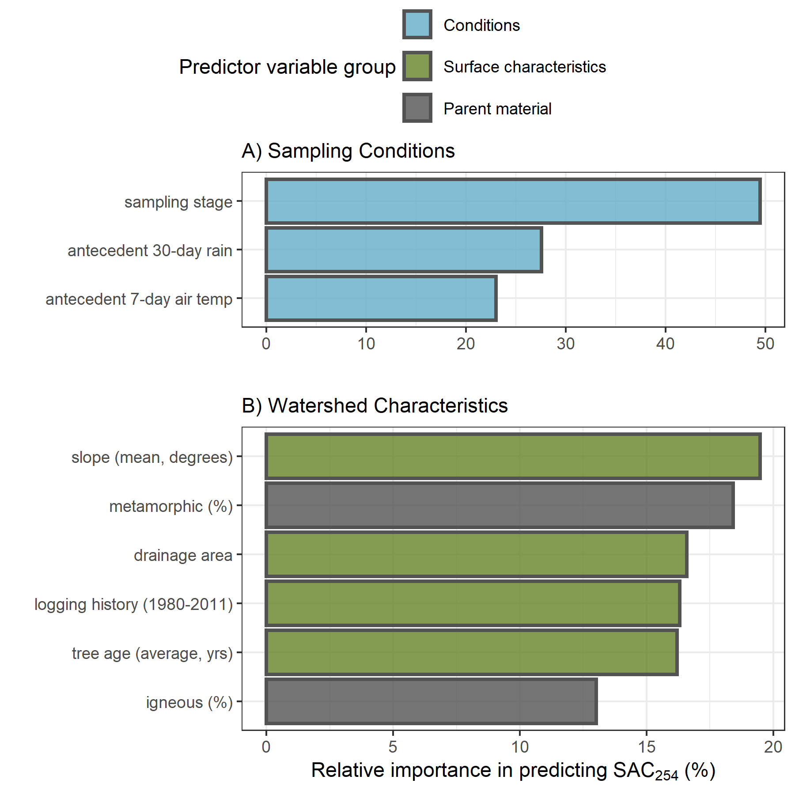
```

\  

##### E~2~:E~3~: molecular size & aromaticity

Sampling conditions VIM ranking for E~2~:E~3~ were the reverse of those for DOC. NOM molecular size and aromaticity (E~2~:E~3~) was best predicted by antecedent 30-day rain, followed by 7-day air temperatures and then sampling stage. The top three watershed characteristic predictors for E~2~:E~3~ were percent of the basin logged from 1980-2011, followed by percent underlain by metamorphic parent material (wark gneiss) which was nearly tied with average tree age (Figure \@ref(fig:RFplotE2E3)).

\  

```{r RFplotE2E3, fig.cap = fig_cap}

fig_cap = "\\label{fig:RFplotE2E3} Variable importance for predicting NOM aromaticity & molecular size (E~2~:E~3~) across six stream monitoring sites in the Leech River watershed. Variable importance measures were extracted from *randomForest* (in R) and determined by mean decrease in prediction accuracy (increase in the mean square error) in the absence of the predictor variable (i.e. type 1 importance measure)."

knitr::include_graphics("R-outputs_UBC-forWater-MSc_HMc/figures/Ch4_RFplot_sep-E2E3.png")
```

\  

#### Predictors in relation to NOM concentration and character 

When all variables were assessed together, sampling conditions were relatively more important than watershed characteristics for predicting NOM concentration and character across the Leech WSA monitoring sites (Appendix, Figure \@ref(fig:RFallvars)). 

\  

##### Sampling conditions

The ranking of relative importance for sampling conditions were in reverse order for DOC (stage, temp, rain) and E~2~:E~3~ (rain, temp, stage). Like DOC, SAC~254~ was influence most by sampling stage; and like E~2~:E~3~, SAC~254~ was more sensitive to antecedent wetness than antecedent air temperatures. The relative sensitivity of NOM concentration to stream stage points to hydrologic mass transport, whereas the sensitivity to antecedent wetness points to the importance of hydrologic connectivity between the terrestrial landscape and stream system for NOM molecular character. 

\  

###### Sampling stage

Stream stage at the time of sample collection was the most important condition predictor variable for DOC and SAC~254~. Concentration of DOC increased with increasing stage up to approximately 60% of maximum sampling stage at each site. The same relationship was seen (albeit more dramatically) for SAC~254~ (Figure \@ref(fig:VIMstage)). This indicates that as stream levels increased, so too did NOM concentration and aromaticity. This was expected based on results in Chapter 3 that showed higher concentrations of more aromatic NOM in Vertical Rack samples compared to (inter-event) Grab samples. The threshold level (~0.6 of peak stage) points to a change where increasing stage led to dilution rather than mobilization.

\  

Stream stage was the least important sampling condition for predicting E~2~:E~3~ (below antecedent rain and air temperature), and the two variables were inversely related. This pattern supports results of stage in relation to SAC~254~ and shows that as stream stage increased across the Leech WSA, so too did NOM molecular size & aromaticity. Like SAC~254~, E~2~:E~3~ and stage had a weaker relationship around 60-75% of maximum stage (indicated by the greater uncertainty in the loess trend line, Figure \@ref(fig:VIMstage)) which indicates a point at which aromaticity no longer increased with stage. While there were fewer high-flow samples collected compared to mid-range and low-flow samples, this apparent sampling stage threshold may indicate depletion of a terrestrial NOM aromatic pool, or could suggest that the most aromatic sources had reached peak connectivity to the streams and NOM could get no more humic in nature. 

\  

```{r VIMstage, fig.cap = fig_cap}

fig_cap = "\\label{fig:VIMstage} Sampling stage as a predictor for NOM concentration (DOC) and character (SAC~254~ & E~2~:E~3~). Each plot includes a loess trend line."

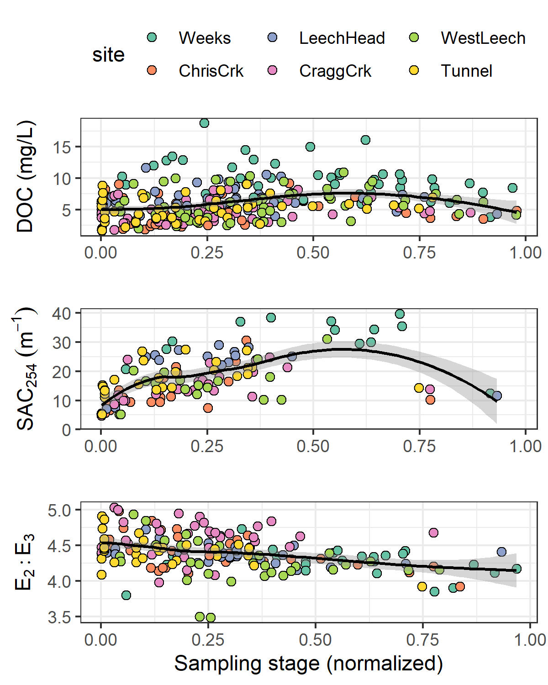
```

\  

###### Antecedent 7-day air temperature

Antecedent 7-day air temperature (mean air temperature for the 7-day period prior to sample collection) ranked second most important for predicting DOC and E~2~:E~3~ and was the least important (third) sampling condition for predicting SAC~254~. The concentration, reactivity, aromaticity and molecular weight of NOM increased with antecedent air temperature up to approximately 10°C (Figure \@ref(fig:VIMtemp)). DOC and 7-day temperature were positively related in the wet season with no obvious relationship in the dry season (Appendix _XXX_, Figure \@ref(fig:RFtempDOC)) and too few spectral samples were collected in the dry season to shed light on seasonal trends in NOM character with antecedent temperatures.

\  

```{r VIMtemp, fig.cap = fig_cap}

fig_cap = "\\label{fig:VIMtemp} Antecedent 7-day air temperature as a predictor for NOM concentration (DOC) and character (SAC~254~ & E~2~:E~3~) across six monitoring sites in the Leech watershed. Each plot includes a loess trend line."

knitr::include_graphics("R-outputs_UBC-forWater-MSc_HMc/figures/Ch4_RF_temp.png")
```


\  

###### Antecedent 30-day rain

Antecedent 30-day cumulative rain (i.e. antecedent wetness) was the sampling condition calculated to have the greatest relative importance in predicting E~2~:E~3~, second-most importance for SAC~254~ and was the least important sampling condition for predicting DOC concentration. As antecedent 30-day rain increased to approximately 150 mm, there was an apparent decrease in NOM aromaticity and molecular size (E~2~:E~3~ increased); above ~150 mm (~25% of maximum antecedent 30-day rain), NOM aromaticity and molecular size increased. At approximately 300 mm of 30-day antecedent rain, NOM aromaticity and molecular size appeared to become less variable (Figure \@ref(fig:VIMrain)). 

\  

Fewer sample results existed for SAC~254~, with a data gap for samples collected between 200 mm and 400 mm of 30-day antecedent rain; therefore, the pattern of SAC~254~ with antecedent wetness was less precise (large uncertainty, Figure \@ref(fig:VIMrain)). For the available data, rain accumulation in the 30 days prior to sample collection was positively related to SAC~254~ up to approximately 150 mm and SAC~254~ was relatively low with antecedent 30-day rain above 400 mm. Though the relationship was non-linear, there was a slight initial increase in DOC with increasing antecedent wetness, followed by a gradual decline in DOC with increasing accumulated rain (Figure 18). Lower order streams (Weeks, Chris crk, Leech-head) showed a steeper decline in DOC with increasing 30-day antecedent rain (site-specific plot in Appendix _XXXXX_, Figure \@ref(fig:VIMrainSites)). 

\  

```{r VIMrain, fig.cap = fig_cap}

fig_cap = "\\label{fig:VIMrain} Antecedent 30-day rain as a predictor for NOM concentration (DOC) and character (SAC~254~ & E~2~:E~3~) across six monitoring sites in the Leech watershed. Each plot includes a loess trend line."

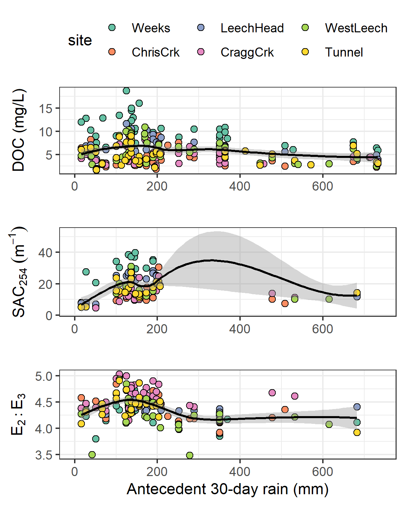
```

\  

These patterns of antecedent wetness with DOC and E~2~:E~3~ suggest that smaller, more aliphatic NOM was flushed through the Leech system when antecedent wetness was low (i.e. near the onset of the wet season). As rains continued, streams had greater connection to more aromatic NOM source pools (humic material, possibly from upland sources). The slight decline in aromatic DOC with antecedent wetness (above approximately 350 mm in 30 days) suggests exhaustion of humic NOM source pools and a shift to dilution. These results largely support seasonal characteristic shifts described in Chapter 3, which follow prediction of the River Continuum Concept.   

\  

##### Watershed characteristics

Of watershed characteristics, the top predictors for NOM concentration and character were a combination of mean sub-basin slope, metamorphic parent material (percent of basin), logging history (percent of basin harvested 1980-2011), tree age (average) and/or drainage area. 

\  

###### Sub-basin slope

Sub-basin slope ranked most important as a predictor for DOC and SAC~254~. Across the six monitoring sites, the relationship between slope and these two variables was not linear but in general, lower sub-basin slope was related to higher DOC. A pattern appeared, where the six monitoring basins were grouped in pairs with two sites each between mean slopes of 9°- 10°, 10°- 11° and 11°- 12°. Within these pairs, the basin with lower slope had slightly greater NOM aromaticity, reactivity and concentration (Figure \@ref(fig:VIMslope)). Slope was negatively correlated to percent wetland (-0.73), and wetlands are known to be linked with high DOC concentrations and greater NOM aromaticity. Indeed, SAC~254~ indicated higher aromaticity in sub-basins with lower mean slope (Figure \@ref(fig:VIMslope)). While slope was not ranked as a strong predictor for E~2~:E~3~, the relationship between the two largely agreed with results for SAC~254~.

\  

```{r VIMslope, fig.cap = fig_cap}

fig_cap = "\\label{fig:VIMslope} Sub-basin mean slope as a predictor for NOM concentration (DOC) and character (SAC~254~ & E~2~:E~3~) across six monitoring sites in the Leech watershed."

knitr::include_graphics("R-outputs_UBC-forWater-MSc_HMc/figures/Ch4_RF_slope.png")
```

\ 

###### Parent material (metamorphic wark gneiss)

The percent of wark gneiss underlying each sub-basin was ranked as the second most important watershed characteristic for predicting each of DOC, SAC~254~ and E~2~:E~3~. Wark gneiss was inversely correlated (-0.92) to the metasedimentary Leech River Formation. 
 
\  

For the five sites that were underlain by some proportion of wark gneiss, stream DOC concentrations decreased with increasing percentage of this metamorphic surficial deposit. While more metamorphic material corresponded to lower DOC, the absence of wark gneiss in West Leech sub-basin did not correspond to the highest DOC concentration (Figure \@ref(fig:VIMwark)). NOM character had a similar pattern to concentration, where greater metamorphic parent material corresponded to lower NOM aromaticity and reactivity (SAC~254~), but its absence did not correspond to the sub-basin with the lowest SAC~254~ (Figure \@ref(fig:VIMwark)). E~2~:E~3~ showed that greater metamorphic parent material corresponded to lower NOM aromaticity and molecular weight (higher E~2~:E~3~ values) and, in contrast to DOC and SAC~254~, the sub-basin with the greatest molecular weight NOM (lowest mean E~2~:E~3~) did correspond with the absence of wark gneiss (Figure \@ref(fig:VIMwark)).

\  

```{r VIMwark, fig.cap = fig_cap}

fig_cap = "\\label{fig:VIMwark} Percent of each sub-basin underlain by wark gneiss (metamorphic parent material) as a predictor for NOM concentration (DOC) and character (SAC~254~ & E~2~:E~3~) across six monitoring sites in the Leech watershed."

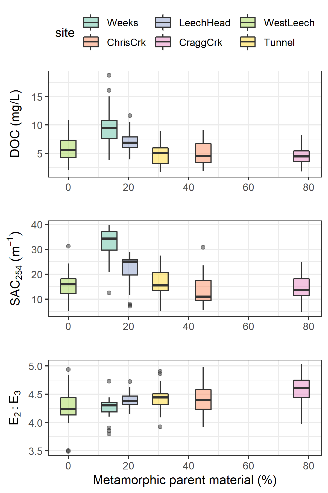
```

\  

###### Logging history and mean tree age 

Logging history (percent of basin harvested from 1980-2011) was ranked first among watershed characteristics for predicting E~2~:E~3~ and third for predicting SAC~254~. Average tree age was third in variable importance for predicting E~2~:E~3~ and DOC. Tree age and logging history were examined together because average tree age was partially due to the history of forest harvest.

\  

Sub-basin area harvested between 1980 and 2011 was positively related to E~2~:E~3~ at four of the six sub-basin sites. West Leech, Weeks, Leech Tunnel, and Cragg crk sub-basins showed decreasing NOM molecular weight and aromaticity (increasing E~2~:E~3~) with increasing area harvested. However, the sub-basins of Chris crk and Leech-head (just downstream) had higher harvested area (ergo younger trees) and did not match this pattern of less aromatic, lower molecular weight NOM with greater harvest history (Figure \@ref(fig:VIMloggingtree)). The sites with more aromatic and higher molecular weight NOM were not clearly linked to average tree age (Figure \@ref(fig:VIMloggingtree)).

\  

Chris crk and Cragg crk sub-basins had the youngest and oldest trees, respectively; yet, these two sites had very similar averages for NOM concentration and character, though Chris crk had slightly higher molecular weight NOM. While Cragg crk sub-basin had, on average, the oldest trees (likely due to old growth maintained on Horton Ridge), it was West Leech that was the least-harvested sub-basin of the six monitoring sites. Cragg crk and West Leech had similar mean DOC and SAC~254~ values but mean E~2~:E~3~ was different (___statistically??___); Cragg crk had greater molecular weight NOM than West Leech (but their error bars overlapped entirely). It is possible that the GIS data for forest harvest and tree age were missing some details.

\  

```{r VIMloggingtree, fig.cap = fig_cap}

fig_cap = "\\label{fig:VIMloggingtree} Sub-basin mean tree age as a predictor for NOM concentration (DOC) and character (SAC~254~ & E~2~:E~3~) across six monitoring sites in the Leech watershed."

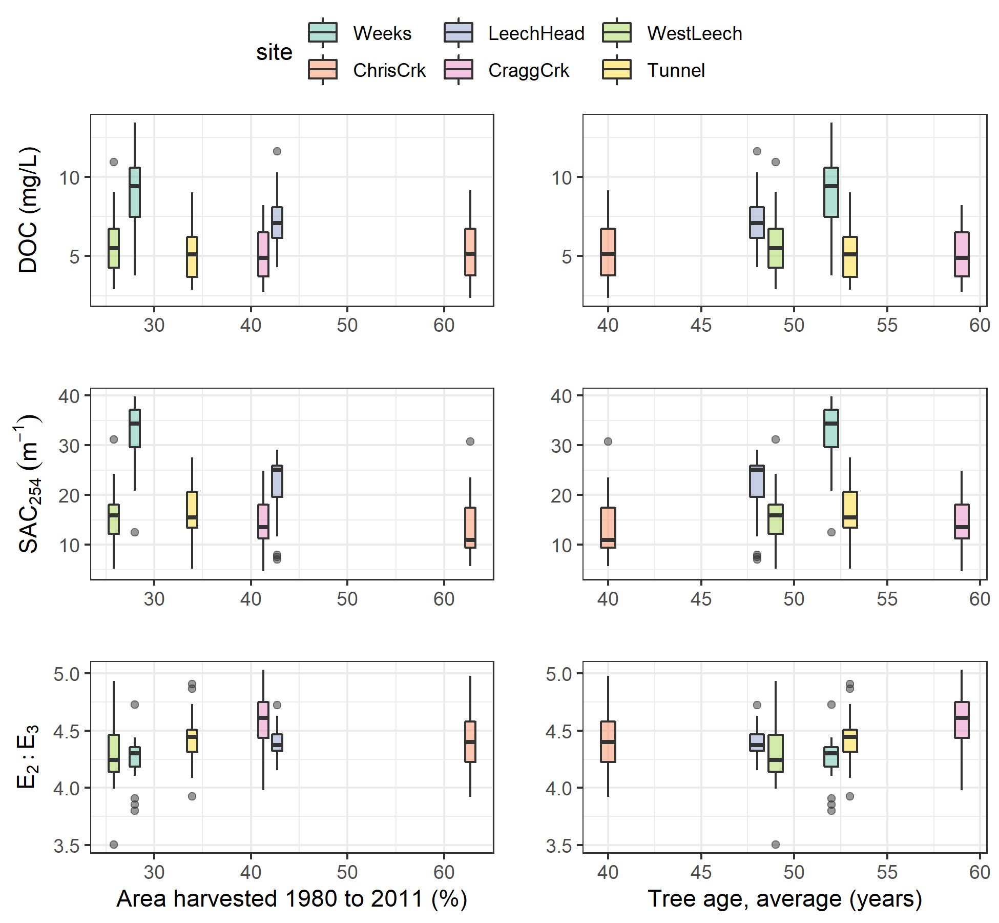
```

\  

##### Variable importance Summary

Of the watershed characteristics examined, the percent of each basin with metamorphic wark gneiss parent material appeared to be the most relevant and was a common predictor variable to each of DOC, SAC~254~ and E~2~:E~3~. The absence of wark gneiss was not related to the site with highest DOC, despite DOC decreasing with increasing metamorphic representation. Because subsurface materials were largely cross-correlated, the observed patterns with wark gneiss may point to more nuanced relationships that couldn't be teased out in this RF analysis because of cross-correlations with other predictor variables. It could be that what is observed as a negative relationship with wark gneiss is a positive relationship between NOM and another parent material, probably the schist-like Leech River Formation. 

\ 

Across the Leech WSA, warm and wet conditions were an important driver for NOM concentration and character. Antecedent rain was positively related to DOC concentrations and sample aromaticity up to a threshold of approximately 150 mm of 30-day antecedent rain, at which point NOM concentration and aromaticity/reactivity/molecular weight declined with increasing wetness. This suggested a threshold at which dilution overtook NOM transport. In a similar way, NOM aromaticity increased with sampling stage up to approximately 60-75% of maximum stage at each site.

\  

#### Warm and wet: seasonal patterns and rain events

Moisture and temperature, important to each of the three predictant variables, corresponded to different seasons. Given the evidence of strong seasonality for NOM character (Chapter 3), a comparison between wet and dry season sample results was used to assess spatial difference between seasons for DOC, SAC~254~ and E~2~:E~3~. 

\  

During the dry-season, SAC~254~ and E~2~:E~3~ indicated that Weeks crk had greater aromaticity compared to the other sites. Aside from the highly aromatic character of NOM observed at Weeks, E~2~:E~3~ suggested that aqueous NOM in the dry-season had increasing aromaticity from upstream to downstream sites; while this quotient can also be indicative of molecular size (by an inverse relationship), the simultaneous decrease in DOC concentration indicates that molecular weight was not increasing downstream (Figure \@ref(fig:seasonalNOM)). SAC~254~ showed a similar increase in aromatic character from headwaters to mouth during the dry season, albeit the pattern was less pronounced and there was a larger difference between Chris crk and Leech-head in SAC~254~ than in E~2~:E~3~. These results show that dry season aqueous NOM increased in aromaticity from upstream to downstream sites. 

\  

The dry season pattern of decreasing DOC from low- to high-order streams was apparent in the wet season also. But the wet season spatial pattern of E~2~:E~3~ was almost the reverse of what was seen in the dry season. While dry season samples' E~2~:E~3~ showed increasing aromaticity from upstream to downstream, the wet season E~2~:E~3~ showed decreasing aromaticity from head to mouth. These seasonal differences support a shift in NOM source material, and/or a shift from NOM processing in the dry season and transport/dilution effects in the wet season.      

\    

```{r seasonalNOM, fig.cap = fig_cap}
fig_cap = "\\label{fig:seasonalNOM} Sample results over the dry and wet seasons for [A] dissolved organic carbon concentrations (DOC), [B] specific absorbance coefficient at 254 nm (SAC~254~, m^-1^), and [C] the quotient of SAC~250~/SAC~365~ (E~2~:E~3~). Note that each season has a different y-scale to clarify patterns. The inset in panel B is an enlargement  of SAC~254~ for all sites except Weeks crk."

knitr::include_graphics("R-outputs_UBC-forWater-MSc_HMc/figures/Ch4_NOM-DOC_boxplots-by-season.png")
```

\  


##### Rising stage and aqueous NOM dynamics 

Antecedent moisture and/or sampling stage was important for each of the three predictant variables evaluated though RF VIM. Across the Leech WSA, the highest DOC occurred in the earliest events of each wet season (events 1 & 9, Table \@ref(tab:EventsTab)), while SAC~254~ peaked later than DOC during the third major event in the 2019/2020 wet season (event 11, Table \@ref(tab:EventsTab)). E~2~:E~3~ indicated maximum aromaticity and molecular size occurred during the last major events, at the end of each wet season (events 3 & 17, Table \@ref(tab:EventsTab)).

\  

```{r EventsTab}
read_csv("R-outputs_UBC-forWater-MSc_HMc/tables/CH4_events-n-samples.csv") %>% 
  select(-c("mean SUVA")) %>% 
  knitr::kable(digits = c(0,0,1,1,1,0,2,2,2), 
               caption = "Rain Events (Threshold of 50 mm and 14-hour Inter-event Period) Defined by Vertical Rack Sample Collection Across the Six monitoring Sites of the Leech WSA",
               col.names = c("Major event no.", "Start Date", "Duration (days)", "Rainfall (mm)", "Intensity (mm/24-hr)", "Samples collected", "mean DOC (mg/L)", "mean SAC~254~", "mean E~2~:E~3~"))

```

\  

Streams across the Leech WSA responded harmoniously to precipitation with synchronous changes in stage. Over the full sixteen-month study period, stage changes at the six monitoring sites were synchronized and confirmed to be congruent with high confidence (p-value < 0.001, based on 1050 randomizations) via Kendall's coefficient of concordance (Kendall's W = 0.9721) and Spearman's ranked correlation (ρ = 0.9666). Rates of change in stream response were calculated for each site to determine the fastest and slowest times to peak stage and relative magnitudes of stage change (Table \@ref(tab:stageResponse)). As expected, rate of change in stage was greatest at the highest order stream, the Tunnel site, and smallest at Weeks crk.

\  

```{r stageResponse}
read_csv("R-outputs_UBC-forWater-MSc_HMc/tables/Ch3_response_stage-summary.csv", col_names = TRUE) %>% 
  knitr::kable(digits = c(0,1,1,1,1,2,1), 
               col.names = c("site", 
                             "shortest time to peak stage (hr)", 
                             "longest time to peak stage (hr)", 
                             "smallest change in stage (cm)", 
                             "largest change in stage (cm)", 
                             "minimum rate of stage change (cm/hr)", 
                             "maximum rate of stage change (cm/hr)"),
               caption = "Summary of Stream Response to Rain Events Across Six Monitoring sites in the Leech Water Supply Area.")
```

\  

To determine if a similar harmony was present for fluctuations in DOC or spectral properties, the proportion of common DOC and stage extrema samples were calculated (Table \@ref(tab:synchDOCstage)). A proportion of 1 indicates perfect agreement between samples of extreme DOC and sample stage, and zero indicates complete asynchrony between DOC and stage highs and lows. Most samples showed congruence between highs and lows of DOC with stage. West Leech was the only site which had a greater proportion of common maxima compared to minima, all other sites had more frequent occurrence of low DOC occurring at low stage that they did of high DOC occurring at high stage. 

\  

```{r synchDOCstage}
read_csv("R-outputs_UBC-forWater-MSc_HMc/tables/synchrony_DOC-stage_extrema-simultaneous.csv", col_names = TRUE) %>% 
  knitr::kable(digits = c(0,4,4),
               caption = "Proportion of Samples for Which Peak Dissolved Organic Carbon (DOC) was Collected at the Highest Sample Stage.")
```

\  

Four of the six site's samples showed majority, but not absolute, agreement in extremes of DOC-stage relationships; Chris crk and Leech-head each had the same proportion of common maxima and minima. In general DOC concentrations were lowest at the beginning of events and increased with a rise in stage (Figure \@ref(fig:extremaplot)). Early in the wet season, peak stage was more associated with minimum DOC, and later in the wet season peak stage was more associated with peak DOC. These results suggest dilution of NOM early in the wet season, and enrichment later in the wet season. 

\  

```{r extremaplot, out.width = "100%", fig.pos="h", fig.cap = fig_cap}
fig_cap = "\\label{fig:extremaplot} Stage and samples collected, highlighting samples with maximum and minimum DOC concentrations for each rain event and collection period. Black vertical lines indicate a subset of samples that were assessed more closely."

knitr::include_graphics("R-outputs_UBC-forWater-MSc_HMc/figures/extrema_peakDOC-stage_plot.png")
```

\  

For events where several samples were collected, the change in DOC concentration varied from a little more than 1% to nearly 100% (Table \@ref(tab:DOCResponse)). The smallest event-based concentration change occurred at Leech head (1.2%) and the Tunnel (1.4%). The largest event-based change in concentration was observed at West Leech (94.6%), and the second largest change occurred at Chris crk (82% change in DOC).  

\  

```{r DOCResponse}
read_csv("R-outputs_UBC-forWater-MSc_HMc/tables/response_DOC-summary.csv", col_names = TRUE) %>% 
  knitr::kable(digits = 1, 
               col.names = c("site", "lowest DOC in stormflow (mg/L)", "highest DOC in stormflow (mg/L)", "smallest change in DOC (mg/L)", "largest change in DOC (mg/L)", "smallest difference in DOC during stormflow (%)", "largest difference in DOC during stormflow (%)"),
               caption = "Summary of DOC Changes Within Stormflow Response to Precipitation Events Across the Leech WSA (Samples from Wet Season Only). ")
```

\  

At the Tunnel, Cragg crk and Chris crk, NOM concentration and aromaticity generally increased with stage; while at West Leech, aromaticity was inversely related to stage. Weeks crk maintained the most consistent NOM aromaticity and molecular weight (E~2~:E~3~) with changing stage (Figure \@ref(fig:stageRelations)). 

\  

```{r stageRelations, fig.cap = fig_cap}
fig_cap = "\\label{fig:stageRelations} Relationships between river stage and sample NOM concentrations and character, where connected lines show data density. Data for each variable were normalized (min-max normalization) for comparison of relative scales in each relationship between sites."

knitr::include_graphics("R-outputs_UBC-forWater-MSc_HMc/figures/Ch4_StageNorm_DOC-NOM.png")
```


\

#### Hysteresis of NOM with antecedent wetness 

Events 10 and 11 were relatively well represented by sampling at each of the six sites and were found to be representative of other rain events as well. Wilcoxon tests showed events 10 and 11 were not statistically different from the other sampling events, with the same mean rain durations (p = 0.837), rain amounts (p = 0.732), rain intensity (p = 0.549), 
DOC (p = 0.512), SAC~254~ (p= 0.218) and E~2~:E~3~ (p = 0.148). Samples were collected across the rising limb, near peak-flows, and at least one sample on the falling limb and at low flow (Figure \@ref(fig:events1011)).

\  

```{r events1011, fig.cap = fig_cap}
fig_cap = "\\label{fig:events1011} Stage and sample collection points at six Leech watershed monitoring sites during rain events 10 and 11 (early fall 2019). Vertical yellow lines indicate the start of each rain event (event 10 and 11, respectively). Results of samples in each event were compared to antecedent 30-day rain to assess hysteretic behaviour of NOM with catchment wetness."

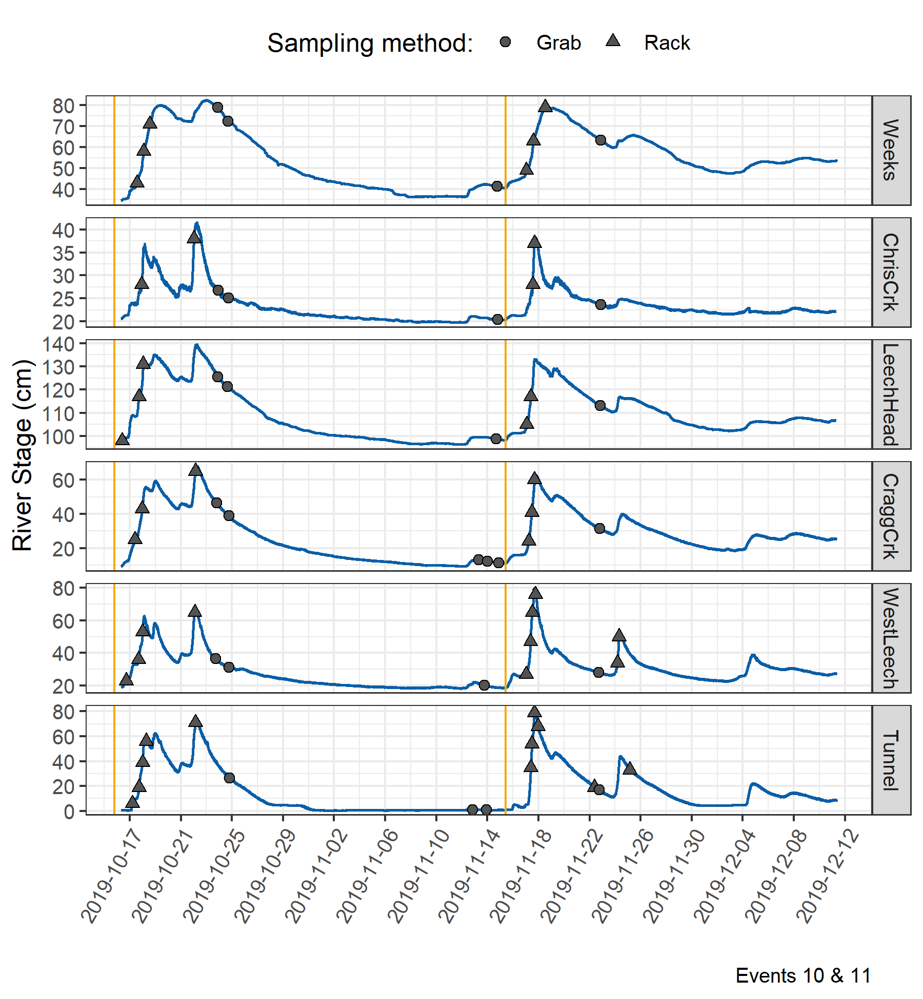
```

\  

Sample DOC concentrations from rain events 10 and 11 were plotted with their corresponding antecedent wetness (30-day rain) to explore possible hysteresis (Figure \@ref(fig:hysteresisplots)). The relationship of DOC to antecedent wetness within a hydrologic event was interpreted in the same manner as a concentration-discharge (C-Q) relationship, where rapid flushing and dilution are indicated by a hysteresis loop with clockwise rotation, and counterclockwise rotation points to delayed material delivery and stream enrichment. Event 10 was the second measured rain event in the 2019/2020 wet season and had twice as much rain fall as event 11 (136 mm in event 10 compared to 68 mm in event 11, Table \@ref(tab:EventsTab)). Event 10 was longer in duration (6.4 days) compared to event 11 (2.3 days) with slightly lower intensity (21 vs 29 mm/24-hr.). Between these two events, mean DOC concentrations were comparable (6.7 mg/L and 6.4 mg/L). There was a clockwise rotation pattern for DOC with antecedent wetness in event 10 and a counterclockwise rotation in event 11 (Figure \@ref(fig:hysteresisplots)). At the Tunnel, there was a change in loop direction at the end of each event. 

\  

```{r hysteresisplots, fig.cap = fig_cap}
fig_cap = "\\label{fig:hysteresisplots} Dissolved organic carbon (DOC) concentrations plotted with antecedent 30-day rain during events 10 and 11 at six monitoring sites in the Leech watershed."

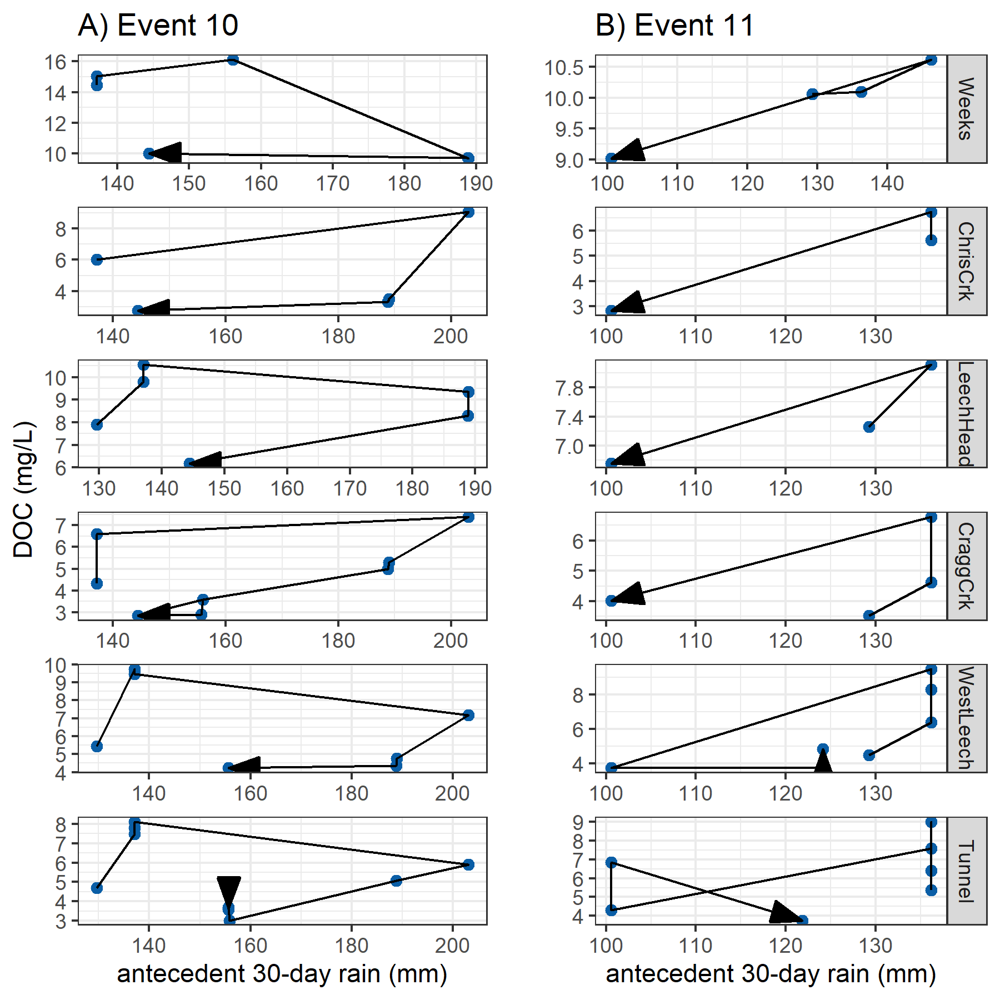
```

\  

### Discussion 

The sampling conditions and watershed characteristics included in Random Forest variable importance measures (RF VIM) showed that across the six monitoring sites in the Leech WSA, stream NOM concentration and character were influenced by warm and wet conditions and the parent material in each basin. No model is perfect, and the relative importance derived from RF VIM in this chapter was limited to the data provided and the assumptions associated with those data. Based on the variables assessed, sampling stage and antecedent wetness ranked among the most important variables for predicting NOM quantity and quality, as did the percent of wark gneiss underlying each basin.  
 
\  

Sub-basin NOM concentration and aromaticity decreased with increasing representation of metamorphic wark gneiss parent material, but its absence did not correspond to the site with highest concentration or aromaticity. The patterns observed between NOM and metamorphic parent material suggests a more complex relationship between watershed characteristics and NOM dynamics. The metasedimentary Leech River formation (argillite metagreywacke and metagreywacke) was inversely correlated (-0.92) to wark gneiss in the monitoring basins and wasn't included in RF VIM analyses. There may be an effect on aqueous NOM associated with a combination of parent materials and soil development that wasn’t full elucidated in this analysis.      

\  

Antecedent wetness is an important watershed driver for NOM export as it influences flow paths and hydrologic connectivity to source material [@McMillan2018]. Solute supply and hydrologic connectivity can be interpreted through the magnitude and direction of water quality changes in response to precipitation [@Vidon2008; @Abbott2018; @Creed2015; @Zarnetske2018]. In the Leech WSA, stage changed in response to precipitation and there was an apparent threshold (near 0.75 of peak sampling stage) that suggested a point at which terrestrial aromatic NOM pools had reached peak connectivity to the monitored streams. 

\  

A pattern in DOC concentration during rising stage can provide information about NOM source and flux dynamics. Increasing DOC with rising stage suggests NOM transport dynamics were driven by hydrologic connectivity to an unlimited supply of source material. Alternatively, if DOC concentrations decreased with rising stage it's likely that the NOM source pool was limited [@Zarnetske2018]. Event-based rising limb changes in DOC concentration varied from a little more than 1% (at Leech-head and the Tunnel) to 95% (at West Leech). 

\  

*new*

Hood et. al [-@Hood2006] measured ~200% increase in DOC during events in a small-basins (< 1 km^2^) study in the H. J. Andrews Experimental Forest on the west coast of Oregon, CA. While the same magnitude of change in DOC was not measured in the Leech WSA, the methods used by Hood et al [-@Hood2006] included continuous monitoring as opposed to this study which quantified discrete samples. It's possible that the changes in DOC that were not captured (i.e. in the stage between vertically staggered Rack bottles) could have shown greater deviation, or possibly, the magnitude of change in the Leech WSA was simply lower than in H.J. Andrews.  

\  

Across the Leech WSA, stream samples with the highest DOC were collected at the highest sampled stage 83% of the time; and there was an 80% co-occurrence of low DOC with low sampling stage. These results indicate an overall pattern of increasing DOC with stage, suggesting that approximately 80% of the time streams were hydrologically connected to a rich supply of NOM. Furthermore, there was a positive relationship between sample aromaticity and stage at the Tunnel, where streamflow from all sub-basins' is integrated; when coupled with the observed stage-DOC dynamics, this indicates that the supply of NOM was humic in origin approximately 80% of the time.

\  

In three of the six monitoring sites, low DOC was more often collected at low stages than high DOC was at high stages; the opposite was found at West Leech, where concentration and stage had a greater proportion of common maxima compared to common minima. The headwater sub-basin sites of Chris crk and Leech-head had the same proportions of samples with common maxima and minima of DOC and stage. The observed patterns of NOM concentration with stage changed across the wet season. Peak stage was more often associated with minimal DOC early in the wet season, whereas DOC tended to peak with stage (or close to peak stage) later in the wet season. The observed temporal change in NOM concentration is evidence of early wet-season NOM being limited in supply and subject to rapid flushing, while late wet-season NOM in streams was drawn from a more sustainable pool of source material. The apparent stage and wetness threshold for NOM concentration and character (approximately 75% of maximum stage and about 150 mm of antecedent 30-day rain), suggested a point at which humic NOM sources either reached maximum connectivity with the streams, or that the aromatic source pools were depleted.

```
another possible explanation for the concentration-stage threshold could be indicative of a transition point in the event hydrograph from soil water contributions to throughfall and overland flow [@Penna2019].
```

\  

The quantity of stream NOM was greatest early in the wet season, with peak concentrations found in the first event-based samples; while NOM aromaticity, reactivity and molecular weight peaked later in the wet season. Coupled with the other results, this indicates that early wet-season rain events exported high concentrations of aliphatic NOM from sources that were likely autochthonous and quickly depleted. The antecedent wetness hysteresis loop of event 10 supports the hypothesis for dilution of near-stream (or in-stream) NOM early in the wet season. Later wet-season rain events transported larger, more aromatic NOM from source pools that were likely allochthonous humic material and whose export relied on greater landscape saturation and hydrologic connectivity. The hysteresis loop for event 11 supported the idea of stream NOM enrichment occurring as antecedent wetness increased (i.e. hydrologic connectivity increased). 

\  

Between the wet and dry season, there were opposite spatial patterns for NOM molecular size and aromatic character. NOM aromaticity increased from upstream to downstream in the dry season, while the wet season showed decreasing aromaticity from head to mouth. The different seasonal patterns in NOM quality support a change in source material and a shift from NOM processing in the dry season to dilution effects in the wet season.

\  

### Summary and future directions

The parent material in each sub-basin was important for NOM dynamics. Although the precise relationship was not completely resolved, it was evident that a greater proportion of metamorphic parent material corresponded to lower concentrations of less aromatic and less reactive NOM in streams. 

\  

Approximately 80% of the time during hydrologic pulses in the wet season, monitoring sites were connected to rich supplies of humic NOM. For a shorter time, early in the wet-season, streams exported high concentrations of aliphatic NOM from autochthonous sources that were subject to rapid flushing and were quickly depleted. Streams were hydrologically connected to sustainable pools of allochthonous source material later in the wet season. It appeared that when streams were near 75% of their maximum stage (therefore, approximately 0.75 of peak flow) humic source pools reached maximum connectivity with the streams.

\  

In the future, Vertical Rack sampling (and matched sample filling-stage with continuous logger stage) could be combined with a rating curve to determine mass transport or loading. Combining methods of vertical sampling racks with standard synoptic grab sampling provided useful time-stamped discrete river samples data that could be adapted and correlated to local rating curves to calculate loads of river material (e.g. nutrients, metals, organics, etc.) exported from monitored catchments. Material transport loads are important for management decisions and comprehensive system understanding. 

\  

It was assumed that the arithmetic means of precipitation measured at Chris Creek and Martin's Gulch Fire Weather Stations were representative of conditions across the Leech WSA and mean rain data were applied to all monitoring sites (Chapter 2). However, it is entirely likely that the West Leech sub-basin experienced different weather than the rest of the watershed; observations during field work (Appendix _XXXX_) support this possibility. When a weather station is constructed in the West Leech basin, more precise explorations could be conducted with respect to antecedent wetness and water quality dynamics. 

\  

With additional weather data (e.g. humidity), it would be interesting to explore whether the variables associated with increased fire risk or mass wasting might also be predictors for NOM dynamics (or any other water quality parameter of interest). The security of drinking water supply quality depends on weather, which is also a major player in other risks to the forested watershed. With greater understanding of the conditions and characteristics that drive water quality dynamics, an index system could be created that incorporates predictors for drinking water supply quality with those for forested watershed threats (e.g. wildfire or windthrow).  

<!--chapter:end:04_LWSA-monitoring-sites_drivers.Rmd-->

---
output: bookdown::word_document2
---

## Summary and Conclusions

```{r discussion-setup, warning = FALSE, message = FALSE, include = FALSE, package.startup.message = FALSE}

# load required packages
library(tidyverse)  # keep it tidy
library(readr)      # read in delimited files
library(knitr)      # for nice tables

knitr::opts_chunk$set(warning=FALSE, message=FALSE, echo=FALSE, fig.cap=TRUE)

```

\  

This project characterized aqueous NOM concentration and character ranges across the GVWSA over sixteen months and explored relationships between watershed variables and sample results across the Leech WSA. Chapters two and three tackled the first research question, which focused on method refinement for measuring variability of aqueous NOM. Spatiotemporal NOM data were collected through (1) six sub-basin sites equipped with vertical racks which logged river stage, air and water temperature at 10-minute intervals, and passively collected whole water samples during stormflow on rising limbs of the hydrograph; and (2) twelve sites, including the six sub-basin sites, were sampled synoptically every two to four weeks. 

\  

Results from twelve sites across the GVWSA were used to assess broad spatial and temporal patterns in stream NOM dynamics (Chapter 3). More in-depth analyses were completed for six of those sites which were equipped with vertical sampling racks (Chapter 4). Relationships between sample results and watershed characteristics and sampling conditions were evaluated to identify drivers for changes in NOM concentration and character across the Leech WSA (~96 km^2^) and it's nested catchments (ranging in size from 9.6 to 37 km^2^). 

\  

This chapter summarizes research results from Chapters two to four, and provides context for how those results can be used to inform continued water quality monitoring and watershed management planning for future supplemental drinking water supply via inter-basin transfers. Results of this research will contribute to baseline understanding and could be applied in further exploration of forest management strategies, such as fire fuel management, and their impacts on source water quality and supply. 

\  

### Recap and synopsis of results

Vertical Racks for passive event rising limb event hydrograph sampling were coupled with synoptic Grab sampling campaigns to measuring water quality changes over 16 months, through events, and across the GVWSA. A challenge of Vertical Rack sampling is that high water can prohibit safe retrieval of collected samples from the Racks. Coupling continuously recorded stage with manually recorded siphon bottle heights allowed for calculation of sample hold-times and quality control measures for samples that had exceeded an acceptable holding time (Chapter 2). Siphon sampling by Vertical Racks is currently limited to the rising hydrograph limb, but the combination of synoptic Grab sampling with and Rack sampling achieved good representation of reliable samples across the hydrograph.

\  

Stream water samples were collected from across the Greater Victoria Water Supply Area (GVWSA) and aqueous natural organic matter (NOM) was evaluated for quantity and quality. Quantifying the organic carbon that forms NOM's backbone is a proxy for the quantity of complex organic assemblies that comprises NOM. The molecular structure of NOM (i.e., it's quality) can vary from large, highly aromatic compounds to smaller aliphatic molecules and differences can be attributed to the source material. Terrestrial humic substances (i.e. allochthonous NOM) tends to be higher molecular weight, larger and more aromatic in structure; while in-stream sources of NOM (i.e. autochthonous NOM), such as algae, are typically more aliphatic in structure. In this research, the quantity of aqueous NOM was measured as the concentration of dissolved organic carbon (DOC) in each sample. The molecular quality of NOM was assessed by UV-Vis spectrophotometry. The specific absorbance coefficient at 254 nm wavelength (SAC~254~) was used as an indicator of NOM molecular aromaticity and reactivity (Appendix VVVVVV; @Weishaar2003; @Vidon2008; @Abbott2018), and the quotient of SAC at 250 nm and 365 nm (E~2~:E~3~) was used to indicate (inversely) aromaticity and molecular size of aquatic humic solutes [@Peuravuori1997; @Helms2008].

\    

Quantities and qualities of NOM vary over space and through time; understanding the spatiotemporal patterns of concentrations and character can help to inform source drinking water management decisions by providing insights to the origins, transport and fate of aqueous NOM and other parameters associated with it. For example, NOM can bind and transport metals in solution [@LaZerte1991; @Aiken2011] and DOC was positively correlated (Appendix XXXX) to the concentrations of total mercury (r=1.00), iron (r=0.83), manganese (r=0.77), and aluminum (r=0.63) as well as (to a lesser degree) barium (r=0.47), copper (0.42), and arsenic (r=0.33). Additionally, NOM in drinking source water supply is partially responsible for the formation of disinfection by-products (DBPs) in treated drinking water (Appendix NNNNN; @Yang2015; @Chow2008; @Beauchamp2018). SAC~254~ was used as an indicator of DBP formation potential (r=0.68; Appendix VVVVVV). 

\  

Because NOM is tied to transport of contaminants and drinking water treatment challenges, understanding spatiotemporal dynamics of this master variable is important for maintaining drinking water security and mitigating treatment challenges. 

\  

#### Spatiotemporal dynamics in the quantity and quality of NOM

The sampling period spanned sixteen months, from October 2018 to February 2020. Seasons were defined as 'wet' and 'dry' and were distinguished by the activity of passive Vertical Rack sample collection. The wet season was characterized by conditions that generated event responses which triggered rising-stage sample collection in the six Leech WSA monitoring site streams (Chapter 2). Based on this definition of seasons, Vertical Racks collected rising limb samples only in the wet season (fall/winter/spring) while Grab samples were collected throughout the entire sampling period. During events, Grab samples were collected prior to stream rise, on the falling limb or between events, but not on the rising limb (not by design, but by happenstance). Sampling began after the start of the 2018/2019 wet season, which extended until mid-May 2019. The dry season spanned from mid-May to late September 2019, the start of the 2019/2020 wet season. 

\  

Results showed spatial patterns that were predicted by the river continuum concept (RCC), including higher levels of NOM in headwaters with attenuation in quantity along stream reaches. Longitudinal reduction in DOC (decreasing concentrations from upstream to downstream) were observed across the GVWSA sampling sites.

In the Leech WSA, sub-basins draining the west had the highest aqueous NOM quantity with the greatest aromaticity, reactivity and molecular size. Lower levels of NOM with smaller, less aromatic and less reactive quality were found in basins draining from the east of the Leech WSA. As anticipated by the river continuum concept and the pulse-shunt concept [@Vannote1980; @Raymond2016], spatial variation in Leech WSA fluvial NOM was attributed to hydrological processes and watershed characteristics. The most important watershed characteristics for NOM dynamics in the Leech WSA were geomorphic parent material. Stream stage was the key hydrologic condition for predicting NOM quantity, and antecedent wetness was key for predicting NOM quality. 

, physical impoundments, organic matter inputs and sources, mass transport, solar inputs, and processing by aquatic invertebrates and microbes [@Stanley2012; @Aiken2011; @Zarnetske2018]. 

* The NOM quality changes that occurred seasonally are a strong indicator that site-specific calibrations should be performed at least a few times a year if DOC/NOM is monitoried by UV-Vis *in-situ*. DOC concentrations were typically higher than BC source water Guidelines suggest, however it should be noted that if Leech River water is transferred to a reservoir prior to treatment that NOM is likely to be photodegraded or diminished through microbial processing.


While the average quantity of NOM was the same between seasons (6 ± 3 mg/L DOC), the quality of NOM differed. Aqueous NOM was larger, more aromatic and more reactive during the wet seasons than during the dry season; this seasonal character shift from autochthonous to allochthonous source quality was also predicted by the RCC.

\  

Spatially, in both wet and dry seasons, DOC concentrations decreased from low to higher order streams, but NOM quality had opposite longitudinal patterns in each season. From low to high order streams, there was an increase in aromaticity and molecular size (indicated by E~2~:E~3~) during the dry season and a decrease in the wet season. The wet season decrease in NOM aromaticity was expected to occur in tandem with the longitudinal decrease in DOC concentration, due to dilution effects along stream reaches. In contrast, it was not expected that higher order streams would have larger and more aromatic NOM than lower order streams during the dry season, especially when DOC concentrations showed the opposite pattern. During downstream transport at low flows, is was expected that NOM would decrease in aromaticity due to abiotic or biotic oxidation (e.g. photodegradation and/or heterotrophic processing). 

It is possible that the simultaneous increase in absorbance and decrease in organic carbon 

\ 

The relative elevation in downstream NOM aromaticity and molecular size (higher SAC~254~ and lower E~2~:E~3~) during the dry season could be due to UV-Vis interference: like chromophoric NOM (the target analyte), other dissolved inorganic species (e.g. iron, nitrate, nitrite, bromide) also absorb light at wavelengths around 254 nm [@StdMet5910]. Concentrations of iron and nitrogen species were not measured, therefore their interference cannot be confirmed; however, the full scan absorption spectra (not shown here) displayed gradual decrease in absorbance with increasing wavelength with no major spikes, suggesting few interferences. Therefore, it seems more likely that the spectral indicies were indeed indicative of greater NOM aromaticity at lower reaches in the dry months, and were not due to aqueous species interference.  

\  

More aromatic NOM at lower reaches could have been due to humic inputs from NOM-rich tributaries feeding higher order streams, or perhaps in-stream microbial processing of terrestrial organic matter (e.g. leaf litter) generated aqueous humic solutes.    

\  

More aromatic NOM in the wet season was likely sources from autochthonous terrestrial sources (e.g., humic and fluvic acids), while the less aromatic dry season NOM . it's quite possibly that the increase in summer DOC was due to autochthonous sources such as algae and cyanobacteria, while fall DOC was 


## spatial stuff

* The site with the second highest DOC range was the West Leech sub-basin (20.85 km2) with mean DOC of 5.8 ± 2.4 mg/L (41% RSD).


## temporal stuff
* Based on spectroscopic indications that dry season NOM was less aromatic in character, it's quite possibly that the increase in summer DOC was due to autochthonous sources such as algae and cyanobacteria, while fall DOC was likely sources from autochthonous terrestrial sources (e.g., humic and fluvic acids).
* Mean DOC was the same, on average, in the wet and dry seasons (6 ± 3 mg/L). 
* seasonal shift from autochthonous NOM sources in the dry season to allochthonous NOM sources in the wet season
* In the wet season, when hydrologic connectivity was greatest, the West Leech sub-basin had aromaticity and molecular size comparable to that of the wetland and lake-dominated Weeks crk sub-basin; though in the dry season, Weeks crk maintained highly aromatic character of stream NOM while the other sub-basins had lower molecular wight, less aromatic NOM than was found at the Tunnel site. The dry season spatial pattern of NOM quality was not expected. Based on the RCC, it was expected that there would be a spatial reduction in NOM character from headwaters to mouth. However, in the dry season, samples collected at the highest order stream (at the future point of diversion) were more aromatic in NOM character than all of the nested catchments except for Weeks crk, which maintained highly aromatic NOM throughout the year due to proximity to the wetlands of Weeks Lake.  
* storm responses: early in the wet season there was a decrease in NOM concentration with increasing flows (higher stage), and as the wet season progresses, stream NOM concentration and aromaticity increased with increasing flows.
* The river continuum concept (RCC) explains temporal changes in NOM character through variable mobilization of source material and biogeochemical processing...
predicts a temporal shift in NOM character from autochthonous (e.g. algal) to allochthonous (e.g. humic material) sources, and a spatial reduction in NOM molecular diversity from headwaters to river mouth. 
* Mean DOC among the six sites was essentially the same in both the wet and dry seasons (Chapter 3), but spatial patterns differed between the seasons. In the dry season, aqueous NOM aromaticity increased from upstream to downstream monitoring sites; while the wet season showed effects of dilution on both the quantity and quality of NOM. These seasonal differences support both a shift in NOM source material and a shift from NOM processing in the dry season and transport/dilution effects in the wet season.


##### Drivers for variation

Data from six sub-basin stream monitoring sites in the Leech WSA were used to assess sampling conditions and watershed characteristic variable importance for predicting NOM concentration and character.   

* Aqueous NOM dynamics were largely driven by warm and wet conditions across the Leech WSA. 
* wetness connecting 
* Watershed characteristics, such as sub-basin parent materials and forest structure (age and logging history) are likely responsible for some spatial variation in stream water quality. In conjunction with physical characteristics of the watershed, hydrologic conditions are primarily responsible for temporal variations observeds in stream water quality. 
* Although sampling stage was directly related to rain conditions, in that more rain generated greater stream rise, rain was relatively more important as a predictor for DOC concentration than sampling stage was... this indicates that it may not have been the stage at which samples were collected, but rather at the antecedent wetness conditions (if you consider rain a proxy for wetness, which seems reasonable). 
* this indicates that greater saturation, which may be indicative of the connectivity between streams and the terrestrial environment, was more important than precipitation inputs in general.

... It appeared that when streams were near 75% of their maximum stage (therefore, approximately 0.75 of peak flow) humic source pools reached maximum connectivity with the streams... this could be explained by...
* the apparent stage threshold for peak DOC (~0.75 of max sampling stage) suggests a point at which allochthonous (humic) NOM supply reached maximum connectivity with the streams. This threshold could also indicate a point at with the event hydrograph was separated from soil water contributions and throughflow to overland flow and throughfall [@Penna2019]. 


### Drinking water supply lens


Research Question 3. What are the implications for watershed management and future drinking water supply?


--> Provide context of how results can be used to inform watershed management planning for wildfire reduction strategies and design of continued water quality monitoring for future inter-basin transfers.

* Although DOC exceeded source water guidelines for TOC (4 mg/L), ... RESERVOIR EFFECTS
* establishing connectivity among nested catchments as a baseline for experimental treatments (future)
* conflicting objectives and competing values (Peter Duinker's work)
  * managing temperate forests for timber removes carbon pools, managing for protection may increase the carbon, thus protection does not necessarily improve water quality. 
  * timber / carbon sequestration / water / biodiversity
* source water quality in rivers is unlikely to reflect the water at the intake tower
  * reservoir residence times
  * photodegradation
  * physiochemcial reactions and changes
  * biodegradation // transformation // bioproduction of NOM
  * the rivers introduce new material and new conditions (e.g. different temperatures, dissolved oxygen, carbonate for buffering or organic acids altering pH, new microbiota) the 
  * mixing is likely to change river source water -- a blanacing reservoir to stabilize between river and reservoir may be extremely useful (like how you add a bit of new water at a time for a goldfish in a bowl, to allow equilibration)
  * UV degradation is likely in lakes
  * while river water quality will not identify source water quality (pre-treatment) it is important to know IN TANDEM with Sooke Res limnology to anticipate potnetial problems based on conditions in each & knowledge of likely or possible interactions
  
  
******

#### Caveats and limitations

It was assumed that the UV-Vis spectral absorbances for each stream water sample were due to the natural organic matter content, however it is possible that other water quality variables could cause interference. For example, dissolved or colloidal nitrate, nitrite and iron species can absorb light at 250 nm, 254 nm or 365 nm, the wavelengths common to NOM absorption [@StdMet5910].

\  
  
###	Concluding remarks


Across the Leech Water Supply Area (LWSA), the timing of changes in temperature, river response and DOC concentrations and character were synchronized in the five nested catchments and Leech River Tunnel site (future point of diversion, or mouth of the WSA), however the mean values and magnitude of these changes differed between sites. 


Q) Across the LWSA, was the variance in DOC greater within each site or among all sites?

Q) Was the variance in DOC greater at the watershed outlet than the variance in each subbasin?  


<!--chapter:end:05_Summary_SourceWaterImplications_Conclusions.Rmd-->

---
output: bookdown::word_document2
---

# References

<!--chapter:end:06_References.Rmd-->

---
output: bookdown::word_document2
---

#   Appendices

```{r appendix-setup, warning = FALSE, message = FALSE, include = FALSE, package.startup.message = FALSE}

# load required packages
library(tidyverse)
library(readr)    # read in delimited files
library(knitr)    # for tidy tables

knitr::opts_chunk$set(echo = FALSE, warning = FALSE)

```

##Technology summary
####### Technology summary

Digital equipment used in this thesis are summarized here.  

\  

```{r}

read_csv("R-inputs_UBC-forWater-MSc_HMc/tables/MSc_technology-summary.csv", skip = 3, col_names = TRUE) %>% 
  knitr::kable()
```

\  

####### Example calculations

Some data were normalized to allow for relative comparison between sites where absolute values were not appropriate. For example, stage at each site was relative to the Vertical Rack stilling well and direct comparison between stage at each site would not be useful, but comparing min-max normalized stage allowed for relative comparison regardless of each "staff gauge" (measuring tape on the stilling well) datum.

Equation 1: $$normalized ~ X_{i} = \frac { (X_{i} - X_{min}) }{ (X_{max} - X_{min}) }$$


## forWater CRD
####### NSERC forWater Network & the Capital Regional District 

The forWater NSERC Network for source water protection strategies is a transdisciplinary, cross-Canada, applied research collaboration focused on the connections between treated drinking water quality and land-use impacts of forest management. The majority of source drinking water originates in forested headwaters, so forWater researchers are studying water quality in watersheds across Canada, under a variety of different forest management strategies. Through collaborative analyses, forWater is working to evaluate source water treatability metrics, downstream propagation effects, and resource economic with the ultimate goal of providing a framework for treatment demands as they relate to forested source water. 

\  
## GVWSA
######## Greater Victoria Regional Water Supply System, CRD

The Capital Regional District (CRD) owns and operates the water supply system for the Greater Victoria region. As a water purveyor, CRD supplies an average of 130 million liters of treated water to customers each day (130,000 m^3^day^-1^) [@CapitalRegionDistrict2017]. The provision of safe and sustainable drinking water has three tiers of regulation above the CRD: federal, provincial, and regional. Federally, Health Canada publishes Canadian Drinking Water Quality Guidelines which outline quantitative bounds for microbial, chemical, radiological parameters and physical aesthetic characteristics for safe drinking water. The province of British Columbia sets requirements for planning, reporting and regualting of drinking water providers through the Drinking Water Protection Act and the Water Sustainability Act, and the Public Health Act and Regulations. Regionally, the CRD reports to the Vancouver Island Health Authority (Island Health) regarding water quality information and provincial legislation.    

The Greater Victoria Water Supply Area (GVWSA) includes 20,549 hectares (205.49 km^2^) of protected drinking water catchment lands. The primary water supply is sourced from Sooke reservoir, the secondary supply source is Goldstream reservoir and the designated (supplemental) future water supply is the Leech River watershed {FIGURE YYY, figure of watersheds with insert of VanIsle (small) and western north america (even smaller)}. Unfiltered source water is first treated with ultraviolet light and free chlorine (to deactive parasites, bacteria and viruses); secondarily, ammonia is added to produce chloramine, a long-lasting disinfectant that persists through distribution systems [@CapitalRegionDistrict2017].  
 
The Leech River watershed is a sub-catchment of the Sooke River watershed (~25% by area), located west of Sooke Reservoir (primary water supply for the Greater Victoria Area). In anticipation of future water demands and uncertainty related to rainfall and climate change, the Capital Regional District (CRD) purchased 9,628 hectares (about 92%) of the Leech River watershed in 2007 (84%) and 2010 (additional 8%), and designated the Leech Water Supply Area (LWSA) for future supplemental water supply. 

In 1977, the CRD obtained a provincial water licence authorizing the diversion of up to 30.6 million cubic meters per year from the Leech River to the Sooke Reservoir [@Ussery2015]. Based on the 2017 strategic plan statement of a daily average water supply of 130,000 m^3^ [-@CapitalRegionDistrict2017], the Leech water license could contribute about 65% of 2017 average water supply. The license allows diversion only as long as minimum flows (>5.7 m^3^s^-1^) are maintained to protect fish and downstream ecology [@Ussery2015]. Based on current hydroclimatic dynamics, the water license flow requirements will exclude the summer months from inter-basin transfer and limit streamflow diversion to the winter (November to approximately April). The Leech Tunnel was constructed in the 1980's to transfer Leech River water into the Sooke Reservoir. The Tunnel is not currently operational, and it's anticipated that inter-basin transfer won't be required until 2050 or later. 

\  
## LeechWSA details
######## Leech water supply area monitoring sites: details and observations 

The Leech River watershed ("the Leech") is located on south-east Vancouver Island, British Columbia, Canada. Like most of coastal BC, it is in the Coastal Western Hemlock Biogeoclimatic Zone. The hydroclimatic regime of the Leech is pluvial (i.e. rain-dominated). Annual rainfall is typically between xxxx - yyyy mm (~2500 mm/yr). This areas has a strong seasonal distribution of rainfall: approximately 90% of rain falls from September to April, with only about 10% of annual rainfall occurring from May to August [*REFS*]. Across the Leech, elevation ranges from approximately 200 m above sea level (asl), near the Leech Tunnel, to 941 m asl in the centre of the watershed, at the top of Survey Mountain. While the majority of precipitaiton falls as rain, snow does accumulate for short periods at higher elevations. 

\  

Around 99% of the Leech WSA is forested. The Leech forests are dominated by western red cedar, western hemlock, and Douglas fir; subspecies include Amabalis fir (Pacific silver fir), white pine, yellow cedar (at higher elevations), Alder, broadleaf maple, and arbutus. Prior to purchase by the CRD, the LWSA was privately managed forest land that was harvested from the mid-1940's to 2007 [@Ussery2015]. Approximately 95% of the Leech watershed was harvested by clear cut prior to 2007 [@Ussery2015, @CRD2019]; as a result, ~94% of LWSA forests are younger than 60 years old and a large portion of stands are under 30 years of age. Now designated as a Water Supply Area, the CRD manages the Leech for source water protection, ecosystem services, and forest resilience. As forest fires pose a serious threat to monocultured and even-aged stands (*REFS*), particularly during the drought of summer, forest fuel management is an important preemptive risk reduction for the CRD [@CRD2019]. 

\  

The Leech River system is composed of three mainstem rivers, numerous tributaries, and four small headwater lakes. Hydrologic responses vary with terrain steepness, soil infiltrability, vegetation, percent cover of lakes and wetlands, air temperature and the intensity and duration of precipitation. In the Leech, runoff peaks in the winter under saturated conditions. In the wet season, rivers in the Leech watershed are flashy: they respond rapidly to precipitation events, rising and falling dramatically. In 1993 CRD Water Services set up a hydrometric monitoring station on the Leech River (about 3.5 km downstream of the Tunnel) to measure discharge with hourly stage measurments [@Ussery2015]. Peak flow on the lower Leech River was recorded as 168 m^3^s^-1^ (in October, 2003) [@Ussery2015]. However, the rating curve at this historic gauging station was not verified over time and hydraulic action rendered it fairly unreliable.

\  

Overall, the hydrology of the LWSA is poorly understood, as are water quality dynamics. In the mid-1980's, some water was transfered from the Leech River into Deception Gulch and Reservoir (adjacent to but physically separated from Sooke Reservoir). The mixing resulted in biological water quality problems that included odour and raised concerns about the operational usage of the existing tunnel. The Leech River Tunnel and anticipated inter-basin transfer will provide interesting research opportunities which are beyond the scope of this thesis research. Before work is done on inter-basin transfers, the hydrology and water quality of the Leech River system need to be better understood. Understanding source water quality, as well as the timing and magnitude of flows, is an essential component to multiple barrier approach to ensuring clean drinking water. 

\  

Six sites were selected across the Leech Water Supply Area. The six research sites represent five nested catchments and the entire water supply area basin defined from the point of (future) diversion, the Leech Tunnel. 

\  

######### Weeks Creek (site 1)

The Weeks Creek (on Weeks Main) research site monitored water draining approximately 16 km^2^ of the northwest Leech River watershed, including a wetland (Jordan Meadows fen) and Weeks Lake (approximately 27 ha) [@Ussery2015]. Jordan Meadows wetland drains to the east and joins the outflow of Weeks Lake (south end of the lake). The wetland and lake outflow streams join and flow east to Research Site #1, "Weeks", which is a third order stream (Strahler) of the western headwaters of Leech River. The channel is fairly straight, with bed and bank material appearing to be primarily silt/clay (fine grain, easily suspended). The water at this site was notably tannin-coloured. This research site was located about 0.4 km west (upstream) of the confluence with Chris Creek. 
    
\  

A large culvert upstream of the monitoring site was replace with a bridge in August of 2019. The culvert had been perched above the streambed level and was obstructing the movement of fish and water flow. Prior to the culvert removal, several groundwater seeps were observed downstream; these seeps maintained base flow of summer waters in this low-relief stream reach.  There were high levels of iron (above Guideline aesthetic objectives) in the water downstream of the culvert, possibly due to culvert rust. 

\ 

######### Chris Creek (site 2)

Chris Creek is the western headwaters of Leech River. This research site was approximately 0.2 km east (upstream) of the confluence with Site 1, Weeks Creek. The study site on Chris Creek monitored waters draining from approximately 9.6 km^2^ of forested land, including Worley Lake (approximately 3.5 ha) [@Ussery2015]. The monitoring site of Chris Creek was downstream of a bridge, on a slightly sinuous reach with boulders and bedrock and turbulent cascading step-pool morphology. Coarse woody debris was observed upstream of the Chris Creek monitoring site, with obvious new deposits on the banks following a high intensity rain event and assoicated flooding in January 2020.   

\  

######### Leech Head (site 3)

Research site 3 was approximately 1.4 km downstream of the confluence of Weeks and Chris Creeks. The "Leech Head" study site, a 4th order stream, was in a pool between riffles with predominantly Schist bedrock and fairly low relief (~2%) and relatively straight morphology. The water at this site was often coloured by tannins (likely from Weeks, upstream). There once was a logging bridge across the river at this site; rip-rap remains on either bank. 

\  

######### Cragg Creek (site 4)

Cragg Creek is a mainstem river that originates in the northeast of the Leech River watershed. Cragg Creek site, a 4th order stream, had a drainage area of approximately 37 km^2^ that included Jarvis Lake (15 ha). The Cragg Creek research station was installed upstream of a bridge, at a CRD hydrological monitoring site (installed over the span of this thesis project). The bed morphology at this site is Schist bedrock and the stream is straight channel with fairly high width-to-depth ratio. Upstream of the bridge Cragg Creek flows turbulently along a low slope, and downstream of the bridge it cascades into several deep pools. From the Cragg Creek research site, the river flows approximately 4.5 km through a steep ravine to confluence with the Leech River (this confluence is around 6 km downstream of the Leech Head site, site #3).   

\  

A fall algae bloom was observed in Cragg Creek November 2019, and was also observed in most of the streams and creeks draining the east side of Survey Mountain. The Algae was identified by CRD microbiologist Huy Nguyen as Draparnaldia, a green-algal species, that occurs mostly in clean, cool (often spring-fed) streams (personal communication ***REF***).  

```{r Draparnaldia, fig.cap = fig_cap}
fig_cap = "\\label{fig:Draparnaldia} *Draparnaldia species of green algae (nic-named 'Christmas Tree') identified in a fall bloom at Cragg Creek (site 4) November 2019*"

knitr::include_graphics("R-inputs_UBC-forWater-MSc_HMc/images/Draparnaldia_CraggCrk_2019-11-13.png")
```

\  

######### West Leech (site 5)

Originating in the west of the Leech River watershed, West Leech River is a 4th order mainstem river. The West Leech research site monitored a drainage area of approximately 35 km^2^ which included a small lake (Boulder lake) at the southwest of Leech watershed. This research site had boulder and bedrock substrate, fairly straight channel with relatively high width-to-depth ratio and pool-riffle morphology. The West Leech site is approximately 120 m upstream of the confluence with Leech mainstem (~1.5 km downstream of the confluence of Cragg Creek with Leech River).

\  

######### Leech Tunnel (site 6)

This research site was at the point of future diversion, the Leech River Tunnel. The Leech is a 5th order river, and this research site had a drainage area of approximately 96 km^2^ (the entire watershed above the point of diversion). The stream bed here is dominated by Schist bedrock and boulders. The bedrock in the center of the channel is deeply incised, but overall the river is wider than is is deep. The Tunnel site was approximately 1 km downstream of the West Leech confluence. 

\  
## Treatability
########   Treatability: forWater coordinated treatability analyses for disinfection by-product formation potentials (DBP-FP)

Four of the synoptic sampling sites were selected as treatability sampling sites, where source water was collected and shipped to collaborative researchers in the forWater Network for analyses of drinking water treatability metrics. The four treatability sites were: 

\  

1. Leech River at the future point of diversion (near Leech Tunnel inlet)
2. Deception Reservoir, downstream from Deception Gulch (outlet of Leech Tunnel)
3. Rithet Creek (main tributary to Sooke Reservoir)
4. Judge Creek (2nd largest tributary to Sooke Reservoir)

\  

These sites were selected to represent future supplemental source water , the future balancing reservoir between the Leech and Sooke water supply areas, and the current tributary source waters to the Sooke Reservoir.

\  

Sets of samples were collected during winter of the 2020 water year (November 12, 2019 and February 18, 2020) and were shipped to the Universities of Alberta and Waterloo for treatability analyses. At the University of Waterloo, samples were analyzed for treatability parameters including: maximum potential disinfection byproduct formation potential (for trihalomethanes (THMs) and haloacetic acids (HAAs) in μg/L), pH, UV~254~(cm^-1^), DOC (mg/L), Turbidity (NTU), and Zeta Potential (mV). Relationships between disinfection by-product formation potentials (DBP-FPs), UV-absorbance at 254nm, and DOC concentrations were examined. 

\ 

At the University of Alberta, field-filtered samples were analyzed using a spectrofluorometer (for excitation emission matrices spectra), as well as an Fourier transform ion cyclotron resonance mass spectrometer to determine molecular characteristics of the DOM.

\  
### results
######### Results: Treatability & DOC

Dissolved organic matter -- particularly high molecular weight aromatic compounds -- are precursors to disinfection by-products (DBPs), which are formed during chlorination of source drinking water. Drinking water supply for the CRD is treated simply by chlorinating raw source water, and therefore source water NOM could have important implications for treatability. To assess the potential of source water to form potentially harmful DBPs, samples were collected from four locations and sent to partners at the University of Waterloo for treatability analyses (specifically, DBP formation potentials (DBP-FPs)). 

\  

Results from two sets of samples at four selected sites showed DBP-FPs were weakly correlated to DOC concentrations and SUVA~254~ and more strongly correlated to SAC~254~ (Figure \@ref(fig:treatability)). The relatively stronger correlation between DBP-FPs and SAC~254~ indicates that while DOC concentration is an important indicator of source water treatability challenges, the aromaticity of source water NOM may be an even more important driver. 

\  

```{r treatability, fig.cap = fig_cap}
fig_cap = "\\label{fig:treatability} *Plots of disinfection by-product formation potentials (DBP-FPs) with dissolved organic carbon (left column) and UV absorbance at 254 nm (right column). Samples collected at four sites on two occasions.*"

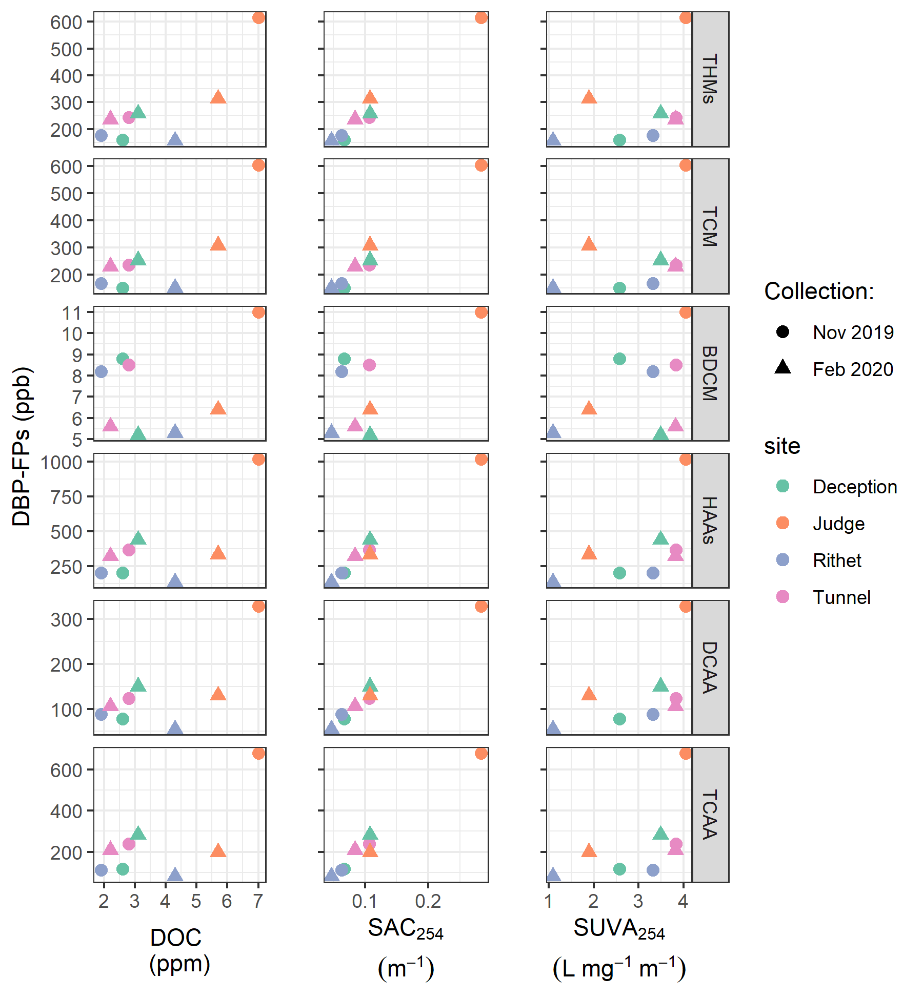
```

\  

While UV-254 is a good indicator of NOM aromaticity and also appears to be correlated to DBP-FPs, naturally occurring aqueous chemicals (such as nitrate and iron) can interfere with spectroscopic analyses and lead to positive bias in DOM estimates. While aqueous nitrate may lead to an over estimate absorbance-based DOM concentrations, aqueous nitrogen can also play an important roll as a precursor to nitrogenous-DBPs when in combination with NOM, which could make UV{254} an even better indicator of DBP-FP.     

\  

## Metals
######## Metals & DOC: collaborative sampling for Metals on behalf of the CRD

Aqueous natural organic matter (NOM) can play an important role in transportation of metals in solution because it has the physiochemical ability to act as a ligand and create coordinated complexes with metals. From November 2018 to July 2019, eight sets of samples were collected from the six Leech WSA monitoring sites. Metals samples were collected on behalf of the CRD and were analyzed at Bureau Veritas Laboratories (BL Labs, formerly Maxxam Analytics Inc., Sidney, BC). For each metals sample collected, a parallel Grab sample was analyzed for DOC (at UBC). A suite of total metals was included in the analyses and reports from BL Labs were provided by the CRD (for the samples collected in association with this research). Data were used to evaluate relationships between DOC and metals in solution. Samples which had detectable metals concentrations were plotted against parallel sample DOC concentrations. Figure \@ref(fig:metalsug) shows DOC with total metals in μg/L, and Figure \@ref(fig:metalsmg) shows metals in mg/L. 

\  

```{r metalsug, out.width = "100%", fig.pos="h", fig.cap = fig_cap}
fig_cap = "\\label{fig:metalsug} *Concentrations of total metals (in μg/L) and dissolved organic carbon.*"

knitr::include_graphics("R-outputs_UBC-forWater-MSc_HMc/figures/metals-doc_ugL_scatterplots.png")
```

\  

```{r metalsmg, out.width = "100%", fig.pos="h", fig.cap = fig_cap}
fig_cap = "\\label{fig:metalsmg} *Concentrations of total metals (in mg/L) and dissolved organic carbon.*"

knitr::include_graphics("R-outputs_UBC-forWater-MSc_HMc/figures/metals-doc_mgL_scatterplots.png")
```

\  

DOC concentrations had strong positive relationships with total mercury, iron, manganese, aluminum. While the relationships were not as strong, DOC was also positively related to concentrations of barium, copper, and arsenic. There was a weak inverse relationship between DOC with silicon and potassium (Table \@ref(tab:metalsdata)). All metals concentrations were below maximum allowable concentrations and aesthetic objectives for drinking source water quality guidelines [@BC2019].

\  

```{r metalsdata}
read_csv("R-outputs_UBC-forWater-MSc_HMc/tables/metals-doc_correlations.csv", 
         col_names = TRUE) %>% 
  knitr::kable(digits = c(1, 1, 0, 2, 2, 4), 
               col.names = c("Metal", "unit", "count", "slope", "Y intercept", "R squared"),
               caption = "*Relationships between total metals with dissolved organic carbon*")
```

\  

## Weather and Climate

####### Weather and Climate

Based on the Pacific Climate Impacts Consortium (PCIC) weather anomaly data, the study period was 0.6° C warmer and 9.8% drier than normal. The PCIC (pacificclimate.org) provides BC climate data of monthly weather anomalies from 1970 onward; data assembled from BC Ministry of Environment and Climate Change’s Monitoring Program. Departures from normal were collated for monthly average daily maximum and minimum air temperature as well as total precipitation measured at two stations located southwest (Bear Crk. Res.) and northeast (Shawnigan Lake) of the GVWSA (Table \@ref(tab:PCICstns)).  

\  

```{r PCICstns}
read_csv("R-inputs_UBC-forWater-MSc_HMc/tables/Appendix_PCIC-stations.csv", 
         col_names = TRUE) %>% 
  knitr::kable(caption = "Pacific Climate Impacts Consortium British Columbia Weather Stations Used to Establish Climate Anomalies and Departures from Normal for the Study Period from Oct. 2018 to Feb. 2020", 
               digits = c(0, 0, 5, 5))
``` 

\  

Not all months had weather anomalies that were warmer and drier than normal (Table \@ref(tab:PCICanomalies)), but overall, the study period was 0.56 degrees warmer and 13.4% drier than normal. ...


\  

```{r PCICanomalies}
read_csv("R-inputs_UBC-forWater-MSc_HMc/tables/Appendix_PCIC-anomalies.csv", 
         skip = 1, col_names = TRUE) %>% 
  knitr::kable(caption = "Average Monthly Weather Anomalies from 1970 Onward from Bear Creek Reservoir and Shawnigan Lake Weather Stations", 
               digits = c(0, 0, 2, 2, 1))
``` 

\ 


the 4.5 months prior to the start of the project, it was 1.6 degrees warmer and 38 % drier than normal
2018 wet season (October 2018 - April 2019) was 0.5 degrees warmer and 26 % drier than normal
2019 dry season (May - Oct) was 0.9 degrees warmer and 1 % wetter than normal
2019 wet season was 0.38 degrees warmer and 5 % drier than normal, with one extreme wet anomaly


... (Table \@ref(tab:PCICdepartures)) ...

\  

```{r PCICdepartures}
read_csv("R-inputs_UBC-forWater-MSc_HMc/tables/Appendix_PCIC-departures.csv", 
         skip = 1, col_names = TRUE) %>% 
  knitr::kable(caption = "Average Weather Departures from CLimate Normals from Bear Creek Reservoir and Shawnigan Lake Weather Stations ", 
               digits = c(0, 0, 2, 1))
``` 

\  

######## FWx stations in the LWSA: ancilary data

There were two weather stations that operated during the study period: Chris Creek station is located in the headwaters of the LWSA and Martin's Gulch station is located near the future diversion point (Leech River Tunnel). 

\  

The CRD provided weather station data from Chris Creek and Martin's Gulch weather stations from January 2018 to March 2020. Slightly more precipitation was recorded at Martin's Gulch than Chris Creek station (Figure \@ref(fig:WxLWSA), Table \@ref(tab:WxLWSAdata)). Data from these two FWx stations were used to calculate arithmetic means of LWSA weather (see Chapter 2).

\  
 
```{r WxLWSA, out.width = "100%", fig.pos="h", fig.cap = fig_cap}
fig_cap = "\\label{fig:WxLWSA} *Weather from FWx stations in the Leech water supply area. Coloured sections of plots highlight the field study period of this project.*"

knitr::include_graphics("R-outputs_UBC-forWater-MSc_HMc/figures/Wx_LWSA.png")
```

\  

```{r WxLWSAdata}
read_csv("R-outputs_UBC-forWater-MSc_HMc/tables/Wx_LWSA-summary.csv", col_names = TRUE) %>% 
  knitr::kable(caption = "Annual weather from CRD FWx stations in the Leech water supply area*", 
               digits = c(0, 0, 1, 2, 1, 1, 1, 1))
``` 

\  
## Linear Wx regress
####### Linear regression for air temperatures at vertical racks

TidbiT temperature loggers (HOBO TidbiT v2 Temperature Data Logger, Onset, USA) were attached to the top and bottom of each vertical rack installation to record air and water temperature at 30 minute intervals. Loggers at the top of racks recorded air temperature and those at the bottom recorded water temperature (Figure \@ref(fig:TidbiTairwaterLine)). 

\ 

```{r TidbiTairwaterLine, out.width = "100%", fig.pos="h", fig.cap = fig_cap}
fig_cap = "\\label{fig:TidbiTairwaterLine}*Temperatures recorded in air and water on vertical racks at each research site.*"
knitr::include_graphics("R-outputs_UBC-forWater-MSc_HMc/figures/TidbiTs_line-by-time_daily.png")
```

\  

While loggers were installed in both positions (air and water) on each rack at the same time, it wasn't until mid-October that all sites' water temperature loggers were submerged. Figure \@ref(fig:TidbiTairwaterBox) shows the distributions of air and water temperatures at each site, where water temperature was limited to the period when all sites water temperature loggers were submerged. Median water temperatures increased from the headwaters of Leech River to the point of diversion (Leech-Head < Cragg-Crk < West-Leech < Tunnel).  

\  

```{r TidbiTairwaterBox, out.width = "100%", fig.pos="h", fig.cap = fig_cap}
fig_cap = "\\label{fig:TidbiTairwaterBox}*Temperatures recorded in air and water on vertical racks at each research site.*"

knitr::include_graphics("R-outputs_UBC-forWater-MSc_HMc/figures/TidbiTs_box-by-location_daily.png")
```

\  
## linear regress
######## Linear regression: air temperature estimation 

Air temperatures recorded at each of the six sites were compared to LWSA FWx for the overlapping period (August 24, 2019 to February 20, 2020). Overall, FWx temperatures were slightly higher than those recorded at each site installation. Figure \@ref(fig:TidbiTFWxridges) shows the density distribution of air temperature measured at each site compared to the LWSA FWx mean. 

\  

```{r TidbiTFWxridges, out.width = "100%", fig.pos="h", fig.cap = fig_cap}
fig_cap = "\\label{fig:TidbiTFWxridges}*Density distribution of air temperatures recorded at each sub-basin compared to mean LWSA air temperatures from CRD fire weather stations.*"

knitr::include_graphics("R-outputs_UBC-forWater-MSc_HMc/figures/TidbiTs-FWx_ridgeplot-subbasins.png")
```

\  

Results of two-sided Wilcoxon rank sum tests revealed that 15-minute air temperatures at West Leech (site-5) were similar to LWSA FWx (p-value 0.02), and the differences between the other five sites and FWx were found to be significantly different (p-values << 0.001). However, when daily mean temperatures were compared (rather than 15 minute data) the differences between sites and FWx temperatures were less dramatic (Table \@ref(tab:wilcoxonpvalues)) with no statistical difference (at 90% confidence) for Cragg Crk, West Leech and the Tunnel (sites 4, 5, 6). 

\  

```{r wilcoxonpvalues}
read_csv("R-outputs_UBC-forWater-MSc_HMc/tables/TidbiT-FWx-Tdaily_Wilcoxon-pvalues.csv",
         col_names = TRUE) %>% 
  knitr::kable(digits = c(0,4),
               caption = "*Relationships between mean daily air temperature recorded at each monitoring site compared to mean LWSA air temperature recorded by Chris Creek and Martin's Gulch fire weather stations.*")
               
```

\  

Despite some differences between FWx and Hobo site data, the overlapping FWx and TidbiT daily mean air temperature data were used to generate linear regression relationships to estimate air temperatures at each site for the time preceding Hobo TidbiT deployment (Figure \@ref(fig:HoboFWxLinearReg)). Table \@ref(tab:TidbiTestimateErrors) summarizes the average percent error of estimated air temperatures based on a test period of overlapping data. Estimated mean daily air temperatures at each site were used in flagging Rack sample data for quality control with respect to days samples remained on vertical racks (hold-times). 

\  

```{r TidbiTestimateErrors}
read_csv("R-outputs_UBC-forWater-MSc_HMc/tables/TidbiT-FWx_lm_prediction-errors.csv", col_names = TRUE) %>% 
  #mutate(p.value = format(p.value, digits = 2)) %>% 
  knitr::kable(digits = c(0,1,1,1,1,1,1,1),
               caption = "*Summary of predicted air temperature at each site compared to mean LWSA temperature from CRD FWx stations for the same time period*",
               col.names = c("Site", "Error (%)", 
                             "Median Temp. (°C)", 
                             "Estimated Median (°C)",
                             "Min. Temp (°C)",
                             "Estimated Min. (°C)",
                             "Max. Temp (°C)",
                             "Estimated Max. (°C)"))
```

\  

```{r HoboFWxLinearReg, out.width = "100%", fig.pos="h", fig.cap = fig_cap}
fig_cap = "\\label{fig:HoboFWxLinearReg}*Linear regression relationships between mean daily air temperature recorded at each monitoring site compared to mean LWSA air temperature recorded by Chris Creek and Martin's Gulch fire weather stations*"

knitr::include_graphics("R-outputs_UBC-forWater-MSc_HMc/figures/Temp_TidbiTs-FWx_lm-scatter.png")
```

\  

####### Antecedent 30-day rain and stream stage

In Chapter 4, I used antecedent rain like a surrogate for stream discharge in a proxy Q-C hysteresis evaluation. This seemed reasonable because in the Leech WSA rain is a main contributor to streamflow. For each sample collected at each of the six monitoring sites, the relationship between antecedent rain (from LWSA Fwx mean of Chris Creek and Martin's Gulch rain data) and measured stage loosely resembles the shape of an expected rating curve (Figure \@ref(fig:Ant30RainStage)).

\  

```{r Ant30RainStage}
fig_cap = "\\label{fig:Ant30RainStage} Relationship between sample stage and antecedent 30-day rain at the six Leech WSA monitoring sites."

knitr::include_graphics("R-outputs_UBC-forWater-MSc_HMc/figures/Ch4-A_RF_ant.rain-norm.stage.png")
```

\  

## extended ch3 results
####### Results extended

######## Ch.2 extended: NOM sampling in nested catchments

Below the confluences of headwaters sites (Figure \@ref(fig:NOMnesty), plots A & B), the combination of Rack and Grab sampling did not capture the ranges of SAC~254~ observed in upstream Grab samples alone. At both sets of headwater sites, the variance obtained by combining Rack and Grab samples downstream was not the same as upstream Grab sampling variance (Levene's test for homoscedasticity p-value =  0.0174). At higher order rivers, the combination of Rack and Grab samples at the Leech Tunnel site did capture the SAC~254~ ranges observed in Grab samples at three upstream river sites (Figure \@ref(fig:NOMnesty), plot C). Levene's test for homogeneity of variance (homoscedasticity) confirmed that there was no difference in SAC~254~ variance in the downstream Rack/Grab combination results compared to Grab-only from upstream (p-value 0.105). 

\  


```{r NOMnesty, out.width = "100%", fig.pos="h", fig.cap = fig_cap}
fig_cap = "\\label{fig:NOMnesty}*Grab sample SAC~254~ at upstream locations compared to Rack and Grab sample SAC~254~ below their confluence(s). A and B show grab samples from headwaters (HW) compared to downstream (DS) monitoring sites; C shows upstream river sites (US) compared to mainstem monitoring.*"

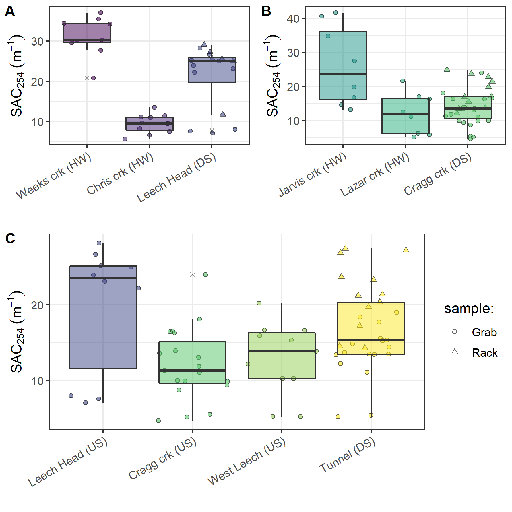

```

\  

No apparent trend was seen in the E~2~:E~3~ characteristic for aromaticity/molecular size (Figure \@ref(fig:aroma)). There were similar variances in E~2~:E~3~ values across all groupings (Levene's p-values 0.1225, 0.09551, 0.09298 for sets A, B, C). 

```{r aroma, out.width = "100%", fig.pos="h", fig.cap = fig_cap}
fig_cap = "\\label{fig:aroma}*Grab sample E~2~:E~3~ at upstream locations compared to Rack and Grab sample E~2~:E~3~ below their confluence(s). A and B show grab samples from headwaters (HW) compared to downstream (DS) monitoring sites; C shows upstream river sites (US) compared to mainstem monitoring.*"

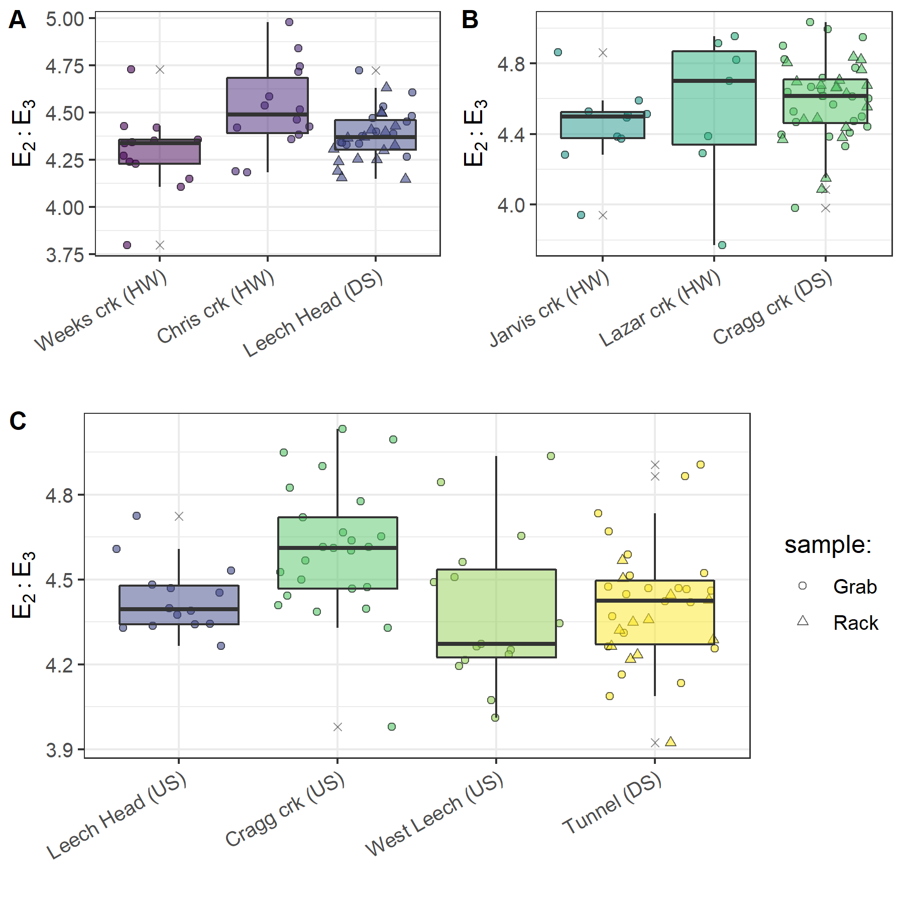
```

\

## extended chapter 4 results

######## Ch.4 extended: RF VIM 

Random Forest variable importance measure (VIM) treated static watershed characteristics categorically and treated dynamic sampling conditions as numeric variables to be used in regression. When conditions and characteristics were combined for RF VIM, the relative ranking of each predictant was changed compared to when conditions and characteristics were analyzed separately. While it was expected that the relative importance (as a percent) would shift when all predictants were combined, it was not expected that the relative ranking would change, and that suggests that these two groups (static and dynamic) of predictants should be separated for RF VIM. Compare plots for the two groups (Ch 4) to Figure \@ref(fig:RFallvars) and see how the relative rankings changed.


```{r RFallvars}
fig_cap = "\\label{fig:RFallvars} Random Forest variable importance measure for NOM concentration and character using combined predictant types (dynamic conditions and static watershed chaaracteristics), which altered the relative importance ranking compared to when the groups were assessed separately"

knitr::include_graphics("R-outputs_UBC-forWater-MSc_HMc/figures/Appendix-Ch4_RFplot-summary_DOC-E2E3-SAC254.png")
```

\  

Enough samples were collected in both the dry and wet seasons for DOC assessment to tease apart a wet season increase in DOC with increasing antecedent air temperatures, while there was no apaprent trend in the dry season (Figure \@ref(fig:RFtempDOC)). 

```{r RFtempDOC}
fig_cap = "\\label{fig:RFtempDOC} Antecedent 7-day air temperature as a predictor variable for concentrations of dissolved organic carbon in the wet and dry seasons of the Leech Water Supply Area (including loess trend lines)"

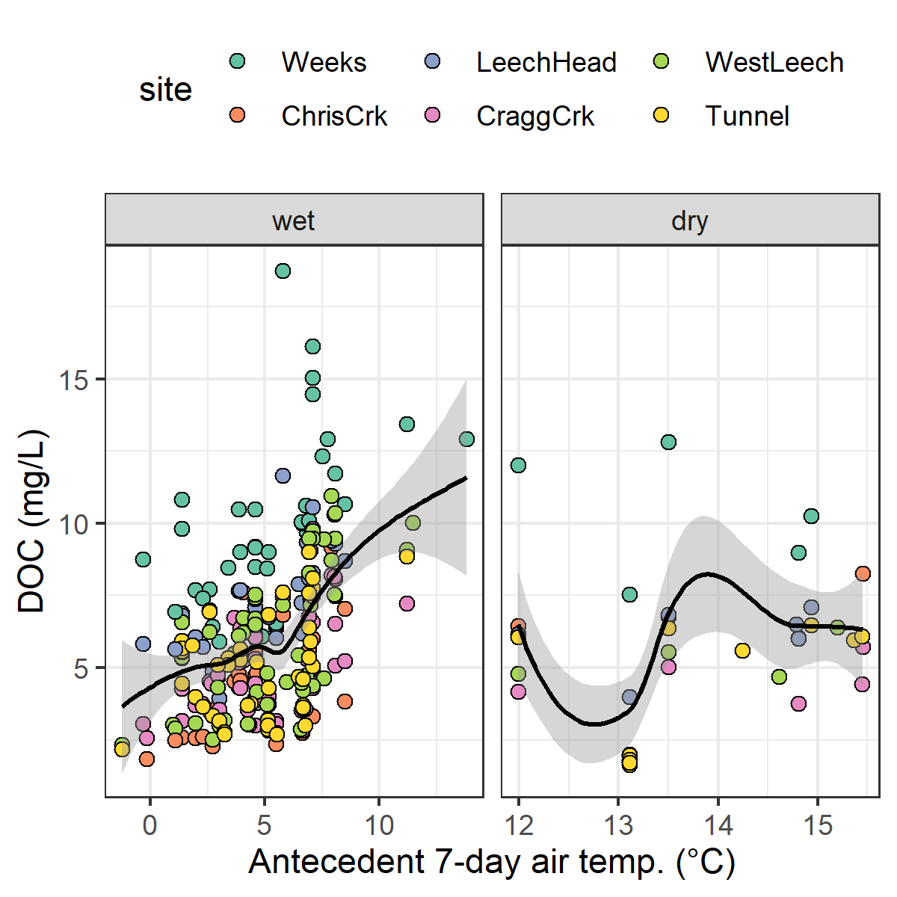
```

\  

30-day antecedent rain by site...(Figure \@ref(fig:VIMrainSites))

\  

```{r VIMrainSites, fig.cap = fig_cap}

fig_cap = "\\label{fig:VIMrainSites} Antecedent 30-day rain as a predictor for NOM concentration (DOC) and character (SAC~254~ & E~2~:E~3~) across six monitoring sites in the Leech watershed. Each plot includes a loess trend line."

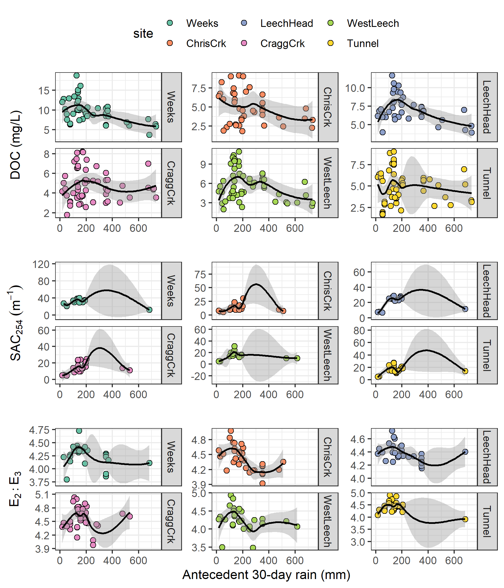
```

\  

## possible trash
####### possible trash

### sampling methods
#######   Sampling methods extended

In river systems, peak flows are critical times for mass transport of dissolved and suspended materials. Therefore water quality sampling should include proportional representation of stormflow pulses relative to between-storm flows and baseflow. Sampling programs can range from low-cost synoptic grab sampling campaigns to high-cost programmable pump samplers (e.g. ISCO). Synoptic grab sampling was completed across the six primary Leech research sites, as well as four supplemental sites. In addition to synoptic sampling, passive sampling techniques were employed to collect stormflow samples.  

\  
### vertical racks
######## Vertical racks

The benefits of using these vertical racks as a method of sampling include: low cost (about $500 CND per installation), low power (two 1/2-AA batteries in each logger), self-contained (no external power source or data logger required), customizable design, passive sampling (no pumps). The downsides of using this technique are similar to any autosampler, in that someone must visit the field sites regularly for set-up and collection of samples, but because there are minimal powered components, mis-firing is not an issue. The only reason a sample wouldn't be collected was if the stream stage did not reach a bottles intake. The primary drawback of this technique is that sampling is limitied to the rising limb of the hydrograph, which limits the elucidation of stormflow water quality dynamics. There is some uncertainty about timing between sample collection and sample retrieval, every effort was made to return to each research site following precipitation events to retrieve collected samples, and it was assummed that any sample held on the rack was stable due to low air and river temperatures during the wet season. The assumption of river-as-a-refrigerator was addressed by deploying temperature sensors on each vertical rack (August 2019), and also with hold-time experiments.  

\  
## prototype
######## Prototype for falling limb passive sampling

_Development of a modified siphon sampler designed for passive water collection on the falling limb of hydrograph_

In keeping with goals of low-cost, low-powered passive sampling, a falling-limb sampler was designed based on principles of the rising limb siphon sampler. The rising limb sampler collects a discrete water sample when river stage exceeds the crown of the inlet tube, so long as the vent is unobstructed; obstruction of the siphon sampler vent was the key component of the falling limb sampler prototype design. There were a half-dozen iterations in design prior to the model which was field-deployed in the Leech WSA (winter 2019). Each design iteration included a valve on the siphon vent which remained closed as the river rose, and opened when stream stage dropped below a certain point (allowing air to exit the sample bottle and a water sample to be collected). A number of valve options were explored, including: an external tube plug, in internal tube plug, and a self-sealing silicone bite-valve (i.e. Camelback Big Bite^TM^ for hydration packs). The final design iteration used a tube pinch valve (SP Science) to close and open the air vent. The mechanism that triggers the vent valve to open is a simple fixed pulley, where the valve is connected to a weighted-cup by a wire that passes through two loops which alter the direction of force.  The river rises and fills the cup with stream water, the cup remains full when the river recedes, and when the stream drops low enough that the full cup is no longer buoyant, the weight of water in the cup exerts a force on the lever of the pinch-valve, causing it to release the vent tube and triggering sample collection. The vent valve and trigger mechanism are contained in a 4" sewer pipe (a "filling well"), which was attached to supplemental support bars on the vertical rack. One prototype was field deployed at Cragg Creek (subbasin site 4) as a proof of concept and work will continue to improve the design and operation.

\  
### field protocol
######## Field protocol

Following the installation of a vertical sampling rack, the field protocol was to visit the site approximately biweekly (or more frequently, based on storms) to check, collect and set the rack. Every time a site was visited, a grab sample was also collected. When a bottle was placed on its rack (attached by 3" hose clamp), the filling stage (height of intake tube crown) was recorded relative to the central still well tape. Bottles were staggered, generally from water level to approximately 120 cm above water level (as experience showed that a bottle should always be placed above the stage of anticipated peak streamflow). Following a rain event, each site was revisited to collect rack samples; for full bottles, the siphon lid was replaced with a labelled HDPE lid and samples were transported in a cooler with ice packs back to the lab and refrigerated until analysis.     

\ 
### Malahat Wx
######## Malahat 5 year weather

* NOTE: replace this seciton with data from the PCIC on climate normals and departure from norms during my study period.

The LWSA weather stations were recently installed and therefore data during the study period could not be compared to a record from previous years. A nearby weather station operated by the BC Ministry of Transportation and Infrastructure (Malahat, station ID 62091) had data available from late 2013 which was used to check if weather during the study period departed from previous year trends. Figure \@ref(fig:WxMalahat) shows Malahat weather data, which are summarized in Table \@ref(tab:WxMalahat-data).

```{r WxMalahat, out.width = "100%", fig.pos="h", fig.cap = fig_cap}
fig_cap = "\\label{fig:WxMalahat} *Five year weather from nearby Malahat station (MoTI ID 62091).*"

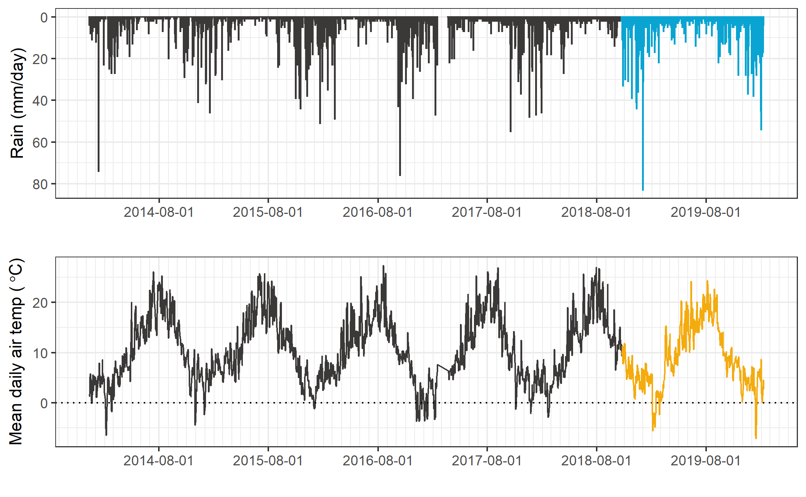
```

\  

```{r WxMalahat-data}
read_csv("R-outputs_UBC-forWater-MSc_HMc/tables/Wx_malahat-summary.csv", col_names = TRUE) %>% 
  knitr::kable(digits = c(1, 2, 1, 1),
               caption = "*Annual weather data from Malahat station (MoTI ID 62091)*")
```

\  

Malahat weather station data were grouped by years 2016-2017 and 2018-2019 to check if there was a statistical difference in precipitation and air temperature for the two years prior to this study compared to the two years associated with this study (Figure \@ref(fig:MalahatTestBox)). Table \ref(tab:MalahatTest) summarizes the results Wilcoxon rank sum test comparing these two sets. Based on this two-set, two-year comparison, it was determined that precipitation during the 2018-2019 period was different than the 2016-2017 period.    


```{r MalahatTestBox, out.width = "100%", fig.pos="h", fig.cap = fig_cap}
fig_cap = "\\label{fig:MalahatTestBox} *Weather from the Malahat station for two year periods prior to and during this study (MoTI ID 62091).*"

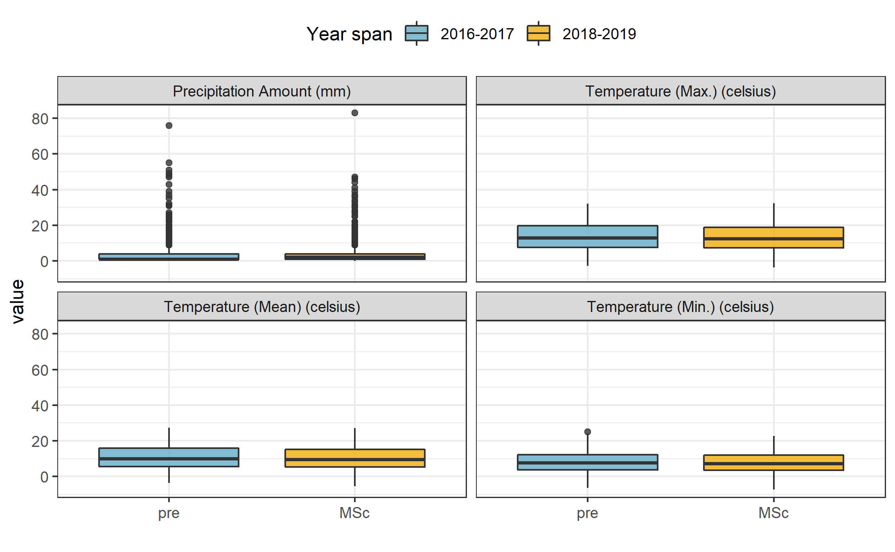
```

\  

```{r MalahatTest}
read_csv("R-outputs_UBC-forWater-MSc_HMc/tables/Wx_Malahat_Wilcoxtest_pre-MSc-2years.csv", col_names = TRUE) %>% 
  knitr::kable(digits = c(1, 12),
               caption = "*Results of Wilcoxon test for Malahat weather data before and during the study period*")
```

\  
## spatial variance
######## Spatial variance in DOC concentrations

As the Leech River Tunnel will be the point of diversion for future inter-basin transfers from Leech water supply area (LWSA) to the Sooke Reservoir basin, the Tunnel (site 6) is the effective outlet of the LWSA where runoff from each nested catchment is integrated. Similarly, Weeks and ChrisCrk (sites 1 & 2) are integrated at LeechHead (site 3), which is just below the headwaters' confluence. Sites were categorized based on their relative position in the Leech river system and evaluated for DOC range and variability (Table \@ref(tab:subbasinDOCtunnelint)). 

\  

```{r subbasinDOCtunnelint}
read_csv("R-outputs_UBC-forWater-MSc_HMc/tables/DOC-Subbasin_summary_CategoryIntegration.csv", col_names = TRUE) %>% 
  knitr::kable(col.names = c("Site", "Basin type", "Sample count", "Mean DOC (mg/L)", "Stdev (± mg/L DOC)", "RSD (± %)", "Min. (mg/L)", "Median (mg/L)", "Max. (mg/L)"),
               digits = c(0, 0, 0, 1, 1, 0, 2, 2, 2),
               caption = "*Summary of DOC across the six LWSA research sites with each nested catchment classified by basin type.*")
```

\  

The relative standard deviation (RSD) in DOC observed at LeechHead was lower than that of the two headwater sites upstream, and median DOC observed at LeechHead was very near to the median for the headwaters sites. Overall, there was greater variance among headwater sites than there was within each headwater site. For the higher order rivers, the variance observed at each mainstem was comparable to the variance among the three mainstems. Results of Levene's test confirmed that variance in DOC concentrations was not homogeneous across the six sites of the LWSA (p-value = 8.2^-10^).[^4] 

\  

To identify which pairs of sites had equal DOC variance Levene's test was applied to sample DOC results. Table \@ref(tab:LevenesDOC) classifies each site comparison by basin-type and summarizes resulting Levene's test p-values for each pair. Of the nine comparisons made among the six sites, all pairs with WestLeech (site 5) and/or Weeks (site 1) did not have homogeneous variance with any other sites, while all other combinations of sites showed homoscedasticity in DOC. Both heteroscedastic sub-basins drain the west side of LWSA. 

[^4]:Levene's test is used to check for homogeneity of variance (homoscedasticity), it's an alternative to the Bartlett’s test that's less sensitive to departures from normality in the data.

\  

```{r LevenesDOC}
read_csv("R-outputs_UBC-forWater-MSc_HMc/tables/DOC-stats_variance-LeveneTests.csv", col_names = TRUE) %>%
  knitr::kable(digits = c(5),
               caption = "*Results of Levene's test comparing DOC variance between pairs of sites. Significance stars indicate confidence levels: *** 99% (alpha = 0.01); ** 95% (alpha = 0.05); * 90% (alpha = 0.1), 90% confidence was the threshold for supporting the null hypothesis of homoscedasticity.*")
```
## E2E3 over time (loess)
######### E2E3 over time

```{r E2E3loessAll, fig.cap = fig_cap}
fig_cap = "\\label{fig:E2E3loessAll} *Trends in E2:E3 (spectral NOM indicator), where E2:E3 values are inversely related to NOM aromaticity and molecular weightaromaticity and molecular weight indicator) over sixteen months at twelve sites across the Greater Victoria Water Supply Area. Trend line shows locally weighted smoothing (loess, local polynomial regression).*"

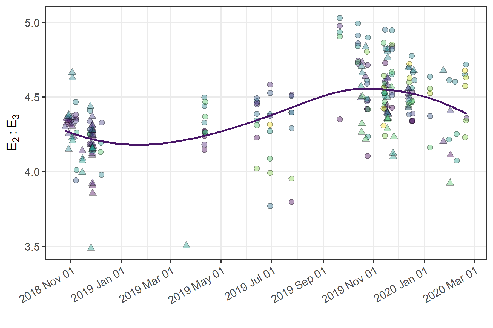
```

\ 

<!--chapter:end:07_Appendix.Rmd-->

