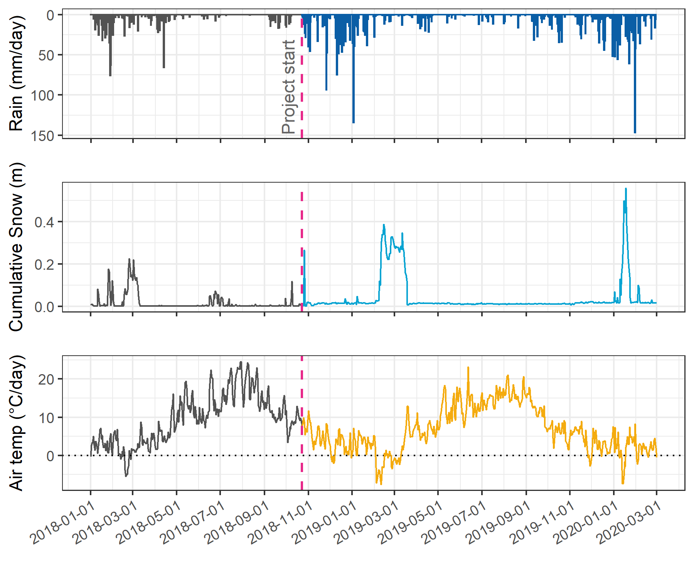
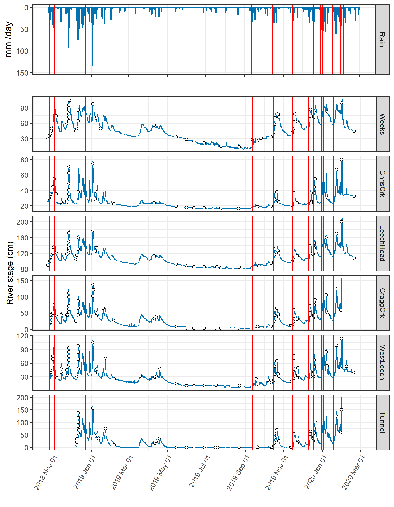
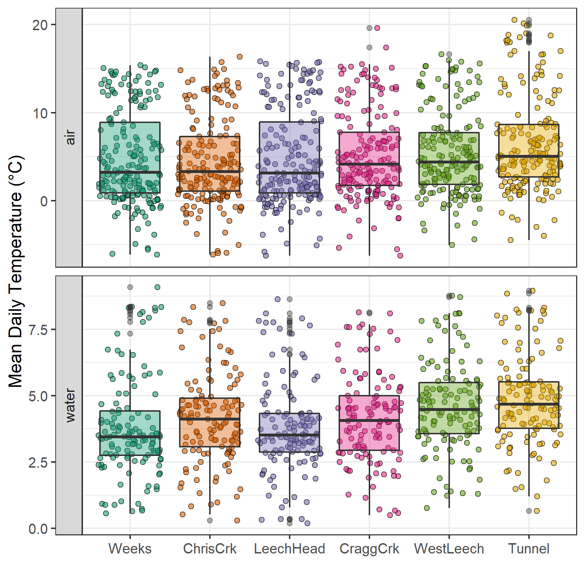
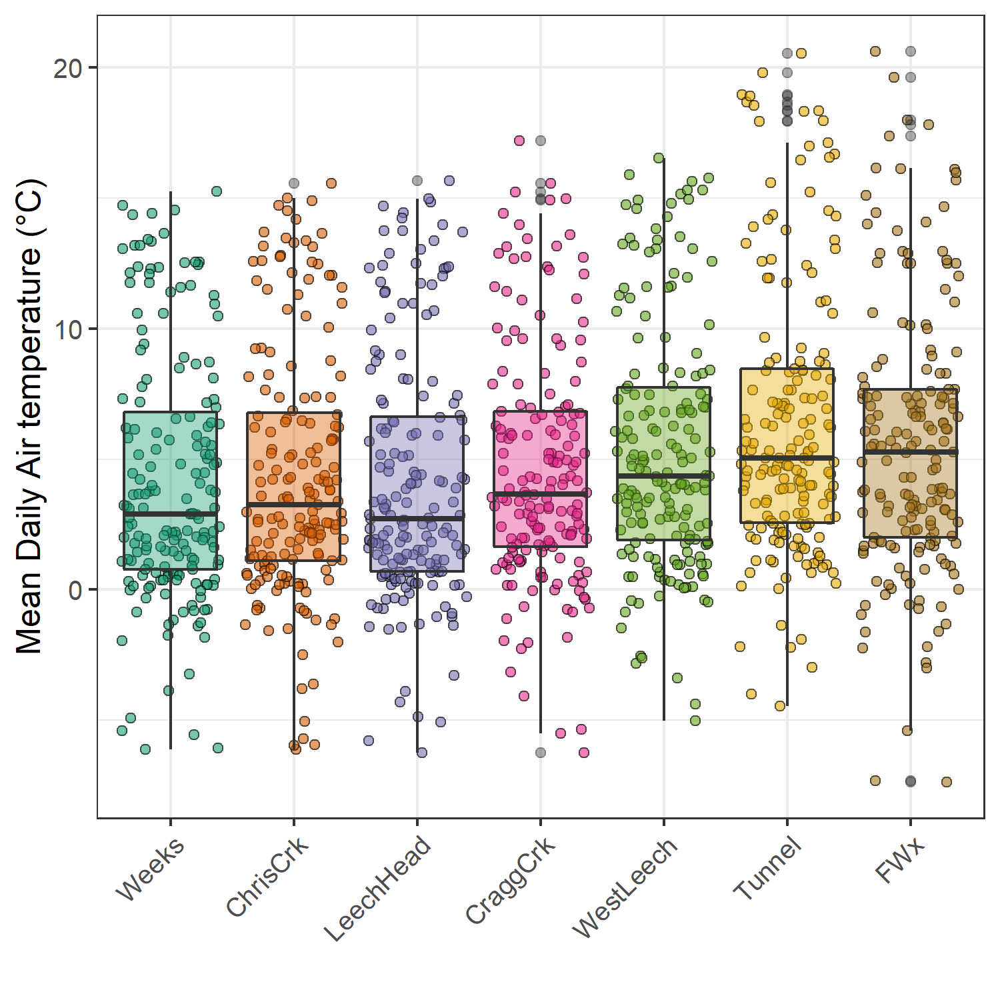
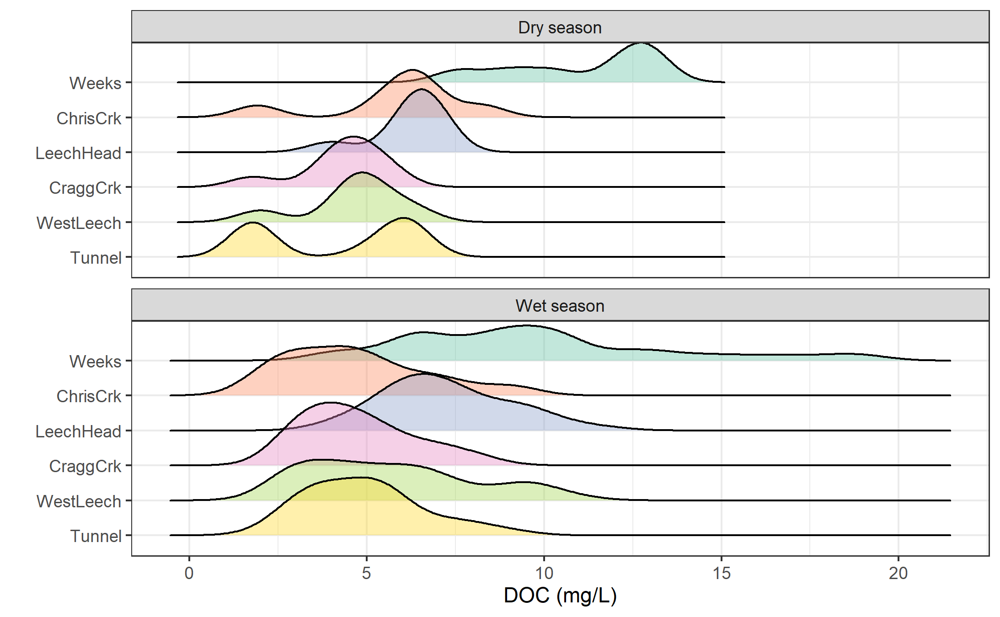
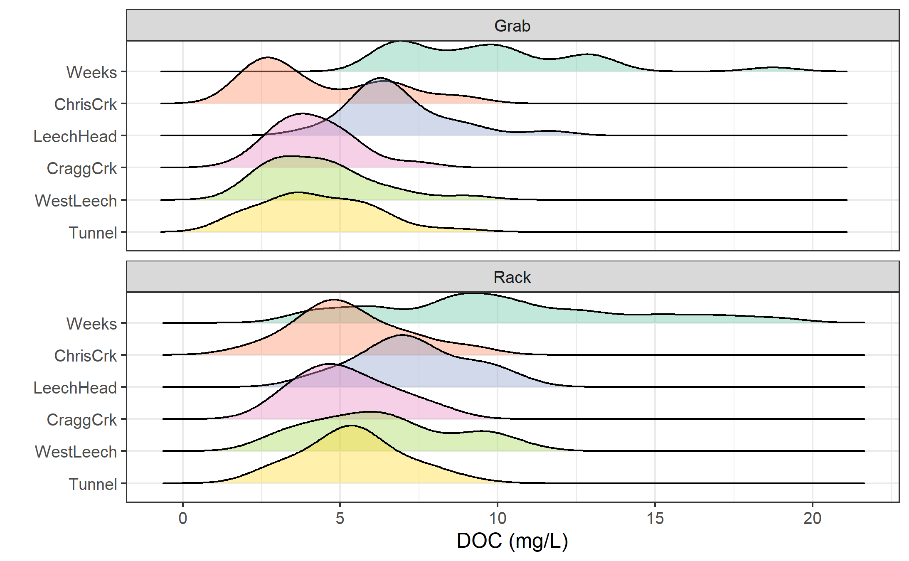
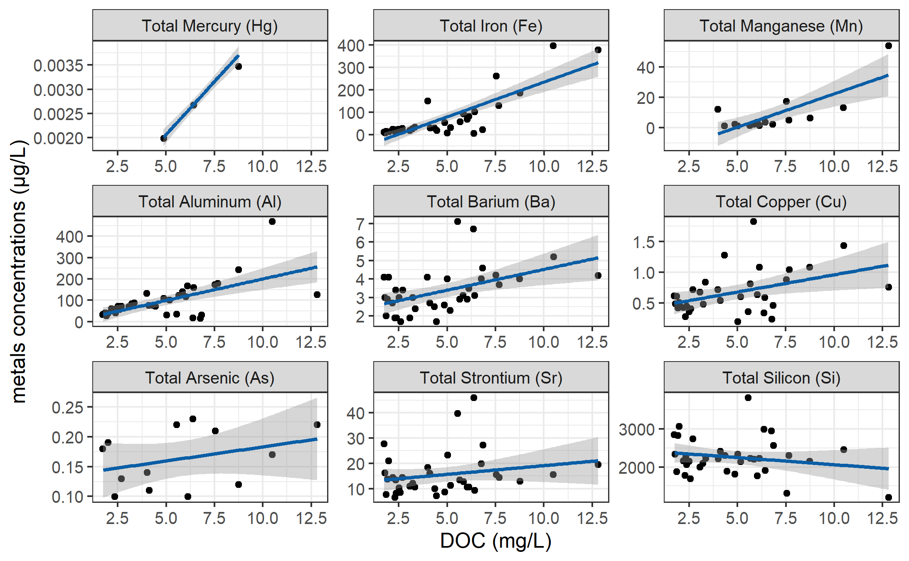
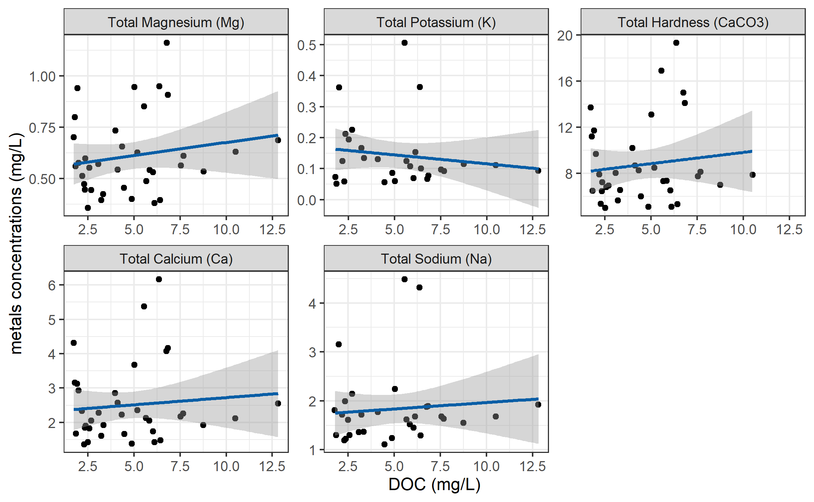

--- 
title: "Quantifying synchrony and variability in source water quality across nested catchments of a protected second growth forested water supply area "
author: "Hannah J. McSorley"
date: "2020"
site: bookdown::bookdown_site
output:
  bookdown::word_document2:
    lof: true
    lot: true
    toc: true
    fig_caption: yes
    reference_docx: word-styles-document_thesis.docx
bibliography: library.bib 
link-citations: yes
---

```{r index-setup, warning = FALSE, message=FALSE, include = FALSE, package.startup.message = FALSE}

knitr::opts_chunk$set(warning=FALSE, message=FALSE, echo=FALSE)

# load required packages
library(bookdown)
library(tidyverse)
library(readr)    # read in delimited files
library(knitr)    # for tidy tables

```

# Abstract  

_(max 350 words) - roman numeral TOC_

This research contributes to understanding the "natural" variability in DOM and DOC across a forested riverine watershed: the Leech River watershed on Vancouver Island, British Columbia, Canada. Land-use impacts are minimal in this research area as 96% of the watershed is protected as drinking water supply area (Leech Water Supply Area). Like most forested areas on Vancouver Island, the Leech watershed is second-growth softwood forest with a history of extensive harvest (nearly 96% cleared).

\  

The purpose of this master's research project was to establish a baseline understanding of hydrologic responses and water quality variability in rivers across the LWSA. The approach includes advanced synoptic sampling within stormflow, supplemented with standard grab samples between storm events and during summer baseflow. Discrete samples of river water were collected passively during the rising limb of stormflow (falling limb prototype in progress) using low-powered, low-cost, custom-built vertical rack samplers including water level loggers (Odyssey) and observational reference staff gauges. By collecting samples during stormflow, a more robust understanding of water quality dynamics was achieved than basic grab sampling alone. Using low-powered passive sampling techniques allowed for multiple (six) sites to be equipped with monitoring/sampling racks, providing fairly good spatial resolution of hydrochemical variability across the watershed. 

\  

__CGU poster abstract:__

Most drinking water in Canada originates in forested headwaters, therefore forest management is intimately tied to the quality and quantity of water supply for many communities. However, without a baseline understanding of a watershed’s hydrochemical dynamics, it is difficult to determine if observations indicate a departure from natural variance due to forest treatments, or if observations fall within baseline variation. This research was conducted in the Leech River Watershed (~96 km^2^, elevation 215 to 870 m a.s.l) which experienced extensive forest harvesting prior to 2007 and is designated as a future supplemental drinking water supply area for Greater Victoria, British Columbia, Canada. The primary objective of this study was to characterize the range of hydrochemical dynamics and the synchrony of rainfall responses among sub-basins ranging in size from 9.6 to 37 km^2^. Six sites were equipped with vertical racks to passively collect water samples on the rising limb of the hydrograph while measuring stream stage every 10 minutes with capacitance level loggers. Synoptic water sampling was completed every two to four weeks from November 2018 to February 2020. A total of 458 samples (204 Rack and 254 Synoptic Grab samples) were collected and analyzed for dissolved organic carbon (DOC) and dissolved organic matter (DOM) through high temperature combustion and UV-Vis spectroscopy (respectively). Additionally, a subset of 42 samples were analyzed for a suite of total metals to assess aqueous DOM transport relationships. Mean sub-basin DOC concentrations ranged from 7.4 ± 1.5 mg L^-1^ to 10.4 ± 3.6 mg L^-1^ (DOC range spanned 2.5 - 29.75 mg L^-1^). Across the Leech watershed, there was an overall reduction in DOC concentration from low to high order streams, and DOC concentrations decreased throughout the wet season (Oct-Mar). Concentrations of DOC exhibited a positive relationship with concentrations of several metals (R2 values for Hg: 0.99; Al: 0.81; Fe: 0.72; Cu: 0.47; Ba: 0.25; Mn: 0.21). We observed a seasonal difference in DOM character assessed by SUVA254 and other spectral indices derived from UV-Vis absorbance full-scan data. DOC concentration patterns during stormflow will be used to indicate whether DOC flux was driven by DOM supply limitation or hydrologic controls. Rainfall response will be discussed on a per-storm basis regarding response synchrony among sub-basins. This research establishes a baseline of hydrochemical dynamics across a water supply area where commercial forest management ceased more than a decade ago. These data may also be useful for future assessment of forest management strategies to reduce wildfire risk. Furthermore, results from this work will aid source water protection strategies when the Leech Water Supply Area becomes an active source for the Greater Victoria water supply via inter-basin transfer. objective

# Lay Summary 

* (max 150 words) - roman numeral TOC
* include plain-language summary

# Preface

* roman numeral TOC

see: https://www.grad.ubc.ca/sites/default/files/doc/page/thesis_sample_prefaces.pdf

* TOC follows, then LOT, LOF, List of Illustrations, list of abbreviations

\  

__List of Abbreviations__

```{r Abbreviations, echo = FALSE}

read_csv("R-inputs_UBC-forWater-MSc_HMc/index-acronyms.csv", col_names = TRUE) %>% 
  knitr::kable()

```

\  

# Acknowledgments

This research work would not have been possible without the support and accommodation of the Capital Regional District (CRD) Watershed Protection and Management Division, Integrated Water Services (IWS) (Victoria, BC). I would like to acknowledge the help, support and assistance provided by the following CRD folks: Tobi Gardner, Annette Constabel, Kathy Haesevoats, Joel Ussery, Patrick McCoubrey, Ryan Biggs, Burn Hemus, Christoph Moch, Jessica Dupuis, Devon Barnes, and Athina Connor. I'm grateful to have been supported by the entire CRD Field Operations Staff, thanks for making me feel welcome on site and including me daily field operations. 

\  

This research also would not have been possible without the support and encouragement from academic supervisors and partners from the NSERC forWater Network for Forested Drinking Water Source Protection Technologies: Bill Floyd, Mark Johnson, Suzanne Tank, Mike Stone, Dana Harriman, Monica Emelko, Uldis Silins, Axel Anderson. I would like to acknowledge the support from Vancouver Island University and University of British Columbia - thank you for taking me on as a master's student.  

\  

For help with field installations and streamflow gauging, a big thanks to my friend and former field partner, Stewart Butler, of Bill Floyd's Coastal Hydrology Research Lab; thanks Stew. Thanks also to Alison Bishop for field assistance during the winter of 2019/2020.

\  

Last but certainly not least, thanks to my incredibly wonderful friends and family for supporting me in my scientific and academic pursuits. I really appreciate all the love and support, dinners and coffees, bike rides and beers, proof-reading and encouragement. 

\  

# Dedication

To each person who reads this thesis in its entirety.

\  

To the love of data science: I'm grateful for Jenny Byran's online resources, [StackOverflow](http://stackoverflow.com) for the solution to so many coding challenges. To RStudio for making a functional and friendly IDE for the R programming language and to GitHub for making version control streamlined and reproducible. Cheers to Hadley Wickham for the tidyverse and Yihui Xie for the bookdown package (in which I generated this thesis).

<!--chapter:end:index.Rmd-->

---
output: bookdown::word_document2
---

#	1	Introduction
##	1.1 		Forested source water supplies and drinking water treatment 
	
Surface water is the primary source of drinking water for over 85% of the Canadian population and in the province of British Columbia, approximately 80% of drinking water originates from forested headwaters [@Pike2010]. Forests offer a variety of ecosystem services (e.g. biodiversity) and also slow and filter runoff, resulting in high quality source water supply [@Dudley2003]. Surface water quality varies over time and space due to climate, weather, and physical characteristics of the watershed (such as topography, land cover and geology), and runoff processes introduce terrestrial material, sediments, nutrients, and organic matter into surface waters [@Pike2010; @Johnson1997; @Delpla2016; @HealthCanada2019; @Yang2015; @Matilainen2010]. 

\  

In Canada, all drinking source water is treated to meet Health Canada drinking water quality guidelines, which specify allowable levels of biological, physical and chemical parameters that are safe for human use and consumption [@BC2019; @HealthLinkBC2018]. Drinking water treatment processes vary from simple chlorination to combinations of physical filtration, chemically assisted filtration, reverse osmosis, and or advanced oxidative processes [@MWH2014; @Emelko2011]. Drinking water treatment technologies differ between communities by infrastructure design and operation, which may be guided by source water quality, infrastructure capabilities, budget, regional size and  water quality regulations [@Emelko2011]. All drinking water treatment processes share the same goal: ensure public health by providing a continuous supply of pathogen-free water. Therefore, disinfection - the inactivation of potentially harmful microorganisms - is the most important step in the treatment process [@MWH2014]. In BC, chlorination remains the most widely used method of disinfection, whether it is used alone or in combination with other treatment processes [@HealthCanada2006; @HealthLinkBC2018]. 

\  

In addition to treated drinking water quality guidelines, there are source water quality guidelines in place because drinking water treatment requirements vary with source water quality [@HealthLinkBC2018; @BC2019]. Stable source water conditions lead to predictable treatment procedures, while fluctuating source water quality creates treatment challenges [@Emelko2011]. Treatment effectiveness is influenced, for example, by high turbidity levels (i.e., suspended solids), varying temperature, dissolved oxygen, pH and natural organic matter, which can create aesthetic issues (i.e. taste, odour, colour) and effect coagulation efficiency and oxidative processes [@BC2019; @Matilainen2010; @HealthCanada2019]. Colour is primarily an aesthetic concern for drinking water, but the natural organic matter that creates colour can interfere with effective disinfection and treatment, and thus there are water quality guidelines in place for source water colour [@BC2019; @HealthCanada2019].

\  

While objectionable aesthetics (i.e., taste, odour, colour) caused by aqueous natural organic matter (NOM) do not directly impact human health, source water NOM can be problematic for effective drinking water treatment NOM reduces treatment effectiveness by interfering with ultraviolet (UV) disinfection and/or increasing chlorination demand, and because NOM promotes biological growth, it can lead to fouling of treatment and distribution infrastructure [@Matilainen2010; @HealthCanada2019; @Jacangelo1995].  Depending on the infrastructure design and operation of a drinking water treatment plant, elevated levels of NOM in source water can increase coagulant and disinfectant demand which increases the production of sludge (to be disposed of) and formation of disinfection byproducts [@Matilainen2010; @HealthCanada2019].

\  

In addition to operational impediments, NOM is partly responsible for unintended chemical contaminants in treated drinking water. When source water is chlorinated, chemical reactions with NOM can form a variety of chlorinated organic compounds which are broadly classified as disinfection byproducts (DBPs) [@Richardson2007; @Delpla2016; @HealthCanada2019; @Yang2015; @Hua2015; @StdMet2000]. A number of chlorinated carbonaceous DBPs are included in Health Canada's drinking water quality guidelines, and have maximum allowable concentrations in treated water due to their possible or known health affects (i.e., possible genotoxicity or carcinogenicity) [@Richardson2007; @BC2019; @HealthCanada2019].
 
##	1.2 		Aqueous natural organic matter

Natural organic matter (NOM) concentration and character vary widely in source water depending on source material, hydrology, and biogeochemical factors [@Aiken2011; @Abbott2018; @Zarnetske2018; @Matilainen2010]. Molecular composition and physical structure influence NOM reactivity, therefore different types of aqueous NOM have different disinfection byproduct formation potentials (DBP-FPs) [@Delpla2016; @Yang2015; @HealthCanada2019; @Chow2008]. Furthermore, different species of NOM vary in molecular size, structure and charge distribution, which determine requirements for effective treatment and removal [@Jacangelo1995; @Matilainen2010].  

\  

NOM comprises a dynamic collection of molecules that originate from a variety of sources, and aqueous NOM exists in complex and diverse combinations of particulate, colloidal and dissolved fractions. NOM can be introduced to a water body from terrestrial sources or generated through in-stream processes which are often associated with autotrophic organisms like algae and cyanobacteria (i.e., autochthonous NOM). Terrestrial organic matter (allochthonous NOM) includes humic and fluvic acids, tannins, and a wide variety of other compounds (e.g. phenols and lignin, hydrocarbons, proteins, carbohydrates, etc.), which enter fresh water through runoff processes [@Zarnetske2018; @HealthCanada2019].   

\  

Molecular structures of NOM can contain nitrogen, silica, oxygen and hydrogen and are composed primarily of carbon; thus, organic carbon (OC) is often quantified as a proxy for NOM concentration [@HealthCanada2019; @Matilainen2010; @MWH2014]. Total organic carbon (TOC) is operationally divided into particulate and dissolved fractions (POC and DOC, respectively) which are typically distinguished based on separation by a 0.45-micron filter [@StdMet2000; @Aiken2011]. Generally, DOC is the predominant fraction of TOC in surface water, and the amount of DBPs in treated water is proportional to raw water DOC concentration [@Weishaar2003; @Chow2008]. 

\  

In addition to acting as a precursor for DBPs, DOC has been called a master variable due to it's terrestrial-aquatic linkages, influence on water chemistry and role in contaminant transport [@Zarnetske2018]. NOM is an energy source for aquatic heterotrophic microbes, it has the ability to bind and transport contaminants in solution (e.g. metals, hydrophobic organic pollutants, nutrients), can influence stream pH and aquatic light and temperature regimes (which, in turn, effect aquatic microbial communities) [@Matilainen2010; @Oni2013; @Aiken2011; @Weishaar2003; @LaZerte1991; @Palleiro2013; @Stanley2012]. DOC is an important source water quality parameter to monitor. In fact, guidelines in British Columbia specify that source water TOC should remain below 4 mg/L, primarily to reduce the production of trihalomethanes (e.g., chloroform, a common DBP) in treated drinking water [@BC2019]. Aside from DBPs, monitoring source water DOC is important for addressing the other operational issues associated with NOM. Stable source water conditions lead to predictable treatment procedures, while fluctuating source water quality creates treatment challenges. Within a watershed, the characteristics and concentrations of NOM (and therefore DOC) naturally fluctuate over space and through time, creating dynamic treatability conditions [@Li2014; @Yang2015].


##	1.3 		Watershed processes and water quality
	
Streams are intrinsically linked to their watersheds through dynamic biotic-abiotic interactions and hydroclimatic relationships; as a result, aqueous biogeochemicals represent an important link between ecosystem processes, hydrology, and water resources. Biogeochemical signatures are useful tracers to better understand catchment processes and regional hydrology, as they are indicative of flow paths, sources, chemical origins and transport pathways [@Abbott2018; @Meyer1983; @Vidon2008; @Rautu2019]. The origins, transport and fate of biogeochemicals in source waters is important for drinking water treatment, because the quality of source water (physiochemical composition and concentrations) governs treatment requirements and, with respect to DBPs, dictates the quality of treated water [@Weishaar2003; @Chow2008]. 

\  

Water quality parameters exhibit natural variability across a river network due to dynamic biotic and abiotic interactions. For example, the river continuum concept (RCC) predicts a temporal shift in DOM character, including seasonal shifts between autotrophic generation of NOM and heterotrophic processing of detritus (i.e. autochthonous to allochthonous DOM) [@Vannote1980; @Meyer1983]. The RCC also predicts a spatial reduction in DOM molecular diversity from headwaters (entry point for majority of solutes) to river mouth (i.e., reduced DOM diversity from low to high order streams) [@Vannote1980; @Mosher2015; @Abbott2018; @Creed2015]. The longitudinal attenuation of DOM diversity can be explained by a combination of hydrological processes; geomorphic variables and physical impoundments; organic matter inputs and sources; sediment transport; solar inputs; and processing by aquatic invertebrates and microbes [@Vannote1980; @Stanley2012; @Aiken2011; @Zarnetske2018]. 

\  

On a finer temporal scale, hydrologic pulses can cause temporal variability in DOM characteristics; for example, the character of DOM has been shown to vary during hydrologic response to precipitation, which indicates a change in DOM source over the course of an event [@Vidon2008; @Abbott2018]. The Pulse Shunt Concept (PSC) supplements the temporal aspects of RCC by considering how major hydrologic events drive regional DOM metabolism and the magnitude, timing and spatial extent of DOM flux [@Raymond2016]. While the link between mobilization of source material and biogeochemical processes govern the character of aqueous NOM, the PSC shows that it is hydrologic processes that govern NOM concentrations in streams [@Abbott2018; @Creed2015; @Zarnetske2018]. Where the RCC relies on in-stream biogeochemical processing to explain longitudinal alteration of NOM character, intense hydrologic pulses (related to precipitation or melt events) override the rate of biogeochemical processing and force mass transport events. Discharge determines the magnitude of DOC flux (i.e., concentration transport) and under pluvial regime, precipitation and discharge are the primary controls on stream DOC concentrations [@Zarnetske2018; @Vidon2008]. Indeed, brief flood events are often responsible for most of the fluvial DOC transport in a watershed [@Raymond2010]. With respect to drinking water supply, the timing and magnitude of fluvial DOC transport is important for water treatment considerations; treatment infrastructure can be designed and adjusted to handle a range of source water conditions, but rapid changes and dramatic variations in source water quality pose major challenges for drinking water treatment.   

\  
```
!!!! not sure: 
For example, high intensity and/or long duration precipitation events can deplete both terrestrial and aquatic NOM storage sources (e.g. high flows can disturb benthic NOM storage) [@Meyer1983].
```

Through a large and geographically diverse data study in the United States, Zarnetske _et al_ [-@Zarnetske2018] found that increasing flows systematically increased DOC fluxes in 80% of watersheds (n=1006) across ecoregions. Proportional increases in DOC flux and discharge indicates that the flux is not limited by organic matter supply, but rather by hydrologic connectivity and mobilization [@Creed2015; @Zarnetske2018]. Watershed size and stream order were determined to be weak indicators of DOC flux-discharge relationship while watershed slope and mean precipitation were strong predictors of DOC flux [@Zarnetske2018]. Zarnetske _et al_ [-@Zarnetske2018] also found that wetland area exerted non-linear control over whether DOC flux was limited by supply or hydrologic transport. 

\  

Aspects of both the RCC and PSC were illustrated in a recent nested catchment study by Abbott _et al_ [-@Abbott2018] which found greater DOM chemical diversity in headwaters relative to downstream, but not greater temporal variance in headwaters biogeochemistry. Despite longitudinal differences in molecular character, solute concentrations varied synchronously among upstream and downstream sites, leading to temporal stability in relative biogeochemical signatures [@Abbott2018]. The temporal extent to which water quality changes echo across nested subcatchments depends on the synchrony (i.e. mean covariance) of the hydrologic pulse generation among subcatchments [@Abbott2018]. 

\  

As changing climatic conditions are likely to lead to increases in hydrologic pulse generation - whether through increased precipitation, earlier or more intense freshet conditions, or changes in subsurface flow and connectivity - it follows that drinking water treatment challenges could arise in response to more variable source water conditions. For forested source water supply areas, developing a better understanding of hydrochemical dynamics and their responses to landscape changes (e.g. wildfire, forest management strategies, mass wasting events) could bolster drinking water security by developing source water protection plans to facilitate more predictable treatment requirements. Understanding water supply area source water quality, variability and response patterns is an important part of the multi-barrier approach to safe drinking water [@CCME2004]. 

\  

Forest management and landscape disturbances can also affect water quality by altering material inputs, biogeochemical processes and stream ecology, as well as changing preferential flow-paths and the mobilization, transport and dilution of biogeochemcial components [@Meyer1983]. For example, wildfire combined with post-fire salvage logging in the slopes of Alberta's southern rockies resulted in higher turbidity and DOC compared to basins that experienced fire without salvage logging, and both disturbed basins had elevated suspended solids and DOC compared to unburned catchments [@Emelko2011]. In other studies, it was shown that two to three years post-harvest, baseflow DOC concentrations were higher in forested catchments than in clear-cut catchments; however, these studies also showed variable stormflow DOC responses in harvested and forested catchments [@Meyer1983; @Mistick2019]. In the absence of long-term baseline data (i.e., pre- and post-disturbance data sets), the natural variability in fluvial processes complicates land-use studies and anthropogenic climate change can further confound our interpretations. Overall, DOC trends related to land-use are highly dependent on catchment attributes and hydrologic forces. Understanding the hydrochemistry of a water supply area is key to conducting informed preventative forest management applications.

\  

### 1.3.1		Source water quality considerations in the water supply areas of Greater Victoria, BC

The Capital Regional District (CRD), encompassing the southern tip of Vancouver Island (including Victoria) and the southern Gulf Islands,  is committed to the multiple barrier approach to clean drinking water and has taken control of source water protection by purchasing and privatizing the water supply areas for Greater Victoria. Located on southeastern Vancouver Island, British Columbia, Canada, the Greater Victoria Water Supply Area (GVWSA) includes 20,549 hectares (205.49 km^2^) of protected drinking water catchment lands. Currently, Greater Victoria's water supply is sourced from five surface water reservoirs in the Sooke and Goldstream watersheds.  In 2007 and 2010, the CRD purchased and additional 96.28 km^2^ (9,628 hectares) of land which included the majority of the Leech River watershed (a major sub-catchment of the Sooke River watershed). In anticipation of future water demands, this area was designated as a supplemental water supply for Greater Victoria, and is known as the the Leech Water Supply Area (LWSA). In the future (possibly by 2050), water from the LWSA will be transferred through a diversion tunnel to supplement Sooke Reservoir, the primary drinking water supply (i.e., inter-basin transfer). Approximately 92% of the Leech River watershed above the point of diversion (Leech Tunnel) is protected as WSA. 

\  

Overall, the hydrology of the LWSA is poorly understood, as are its water quality dynamics. In the mid-1980’s, some water was transferred from the Leech River into Deception Gulch and Reservoir (adjacent to but physically separated from Sooke Reservoir), and the mixing resulted in biological water quality problems that included odour and raised concerns about the operational usage of the existing tunnel. Before work is done on inter-basin transfers, the hydrology and water quality of the Leech River system need to be better understood. 

\  
	
The LWSA was privately managed forest land which was extensively harvested over the past 70 years (nearly 96% clearcut); as a result, a large portion of the WSA is densely forested with softwood stands less than 35 years of age as of 2020. The second growth forests of the LWSA are no longer managed for timber supply, they are now managed to improve drinking source water quality and to reduce the risk of landscape level wildfire. Due to prior harvest, reforestation and active fire suppression, forest fire fuels have accumulated and pose a threat in the event that a fire occurs. In the Sooke WSA, the CRD implements forest treatments designed to foster healthy forest stands capable of reducing fire intensity, such as reducing fuel hazards and creating conditions that are safe for crews to action a fire. Similarly, preventative fire treatments will be applied in the LWSA prior to inter-basin transfers. Developing an understanding of baseline water quality dynamics and hydrologic forces in the LWSA will help to inform forest management strategies by evaluating the effects of fire fuel management on water supply.     

\  

The provincial Drinking Water Protection Act and Drinking Water Protection Regulation frameworks were developed to implement Health Canada's drinking water quality guidelines and set out requirements for drinking water operators & suppliers to ensure the provision of safe drinking water. Treatment of source water from the Greater Victoria Water Supply Area consists only of disinfection: raw water (unfiltered) is treated with ultraviolet light as primary disinfection, chlorination is secondary, and finally ammonia is added to produce chloramine (NH~2~Cl, a long-lasting disinfectant that persists throughout the distribution system). Understanding dynamics and variability of hydrochemistry in the LWSA is needed to anticipate possible treatment challenges that may accompany future inter-basin transfer from the LWSA.   

##	1.4 	Research Objectives

This research was conducted in partnership with the CRD to contribute to their pursuit of characterizing the Leech Water Supply Area, while contributing to our understanding of "natural" variations in source water quality (primarily with respect to DOM and DOC) across nested catchments in a second growth forested watershed. The objectives of this research were to quantify spatial and temporal patterns in DOC concentrations, and to explore the hydrochemical synchrony of nested catchments across the LWSA. Ideally, results of this research will contribute to baseline understanding for further exploration of forest management strategies, such as fire fuel management, and their impacts on source water quality and supply. Understanding source water quality, as well as the timing and magnitude of flows, is an essential component to multiple barrier approach to ensuring clean drinking water. 

<!--chapter:end:01-Introduction.Rmd-->

---
output: bookdown::word_document2
---

```{r methods-setup, include=FALSE}
knitr::opts_chunk$set(echo=FALSE, warning = FALSE)
```

```{r methods-packages, package.startup.message=FALSE, warning=False, message=FALSE}
# load packages
library(tidyverse)  # dplyr + readr
library(knitr)      # tidy tables
```

#	2	Methods

##	2.1 	Study Site: Leech River Watershed

The Leech River watershed is a sub-catchment of the Sooke River watershed, located west of Sooke Reservoir (primary water supply for the Greater Victoria Area). In anticipation of future water demands and uncertainty related to rainfall and climate change, the Capital Regional District (CRD) purchased about 92% of the Leech River watershed in 2007 (84%) and 2010 (additional 8%) and designated the Leech Water Supply Area (LWSA) for future supplemental source water. Figure \@ref(fig:GVWSAoverview) shows the Leech and Sooke Water Supply areas. 

Geospatial data were collected from GeoGratis (Government of Canada Geospatial Data Extraction) or provided by the CRD [^2]. Maps were created using QGIS (OSGeo), and catchment boundaries were delineated using the GRASS package (QGIS, version 3.12.1 - Bucuresti).

[^2]:Any CRD-provided geospatial data was used with permission from the Capital Regional District.]  

\  

```{r GVWSAoverview, out.width = "50%", fig.pos="h", fig.cap = fig_cap}
fig_cap = "*Overview of the Leech and Sooke Water Supply Areas (Greater Victoria, CRD), located on southeastern Vancouver Island, British Columbia, Canada. Bottom image of Canada and inset of Vancouver Island were screenshots from the app 'Windy' (Prague, Czechia, EU); top map of the water supply areas was generated in QGIS (version 3.12.1 - Bucuresti)*"

knitr::include_graphics("R-inputs_UBC-forWater-MSc_HMc/images/thesis-map_inset-overview_colour.png")
```

\  

While monitoring programs began in 2017, the hydrology and water quality in the LWSA are poorly understood. The Leech River watershed includes three mainstem rivers (Cragg Creek, Leech River, and West Leech River) as well as several small headwater lakes (Weeks, Jarvis, and Worley) and wetlands (Jordan Meadows surrounding Weeks Lake and Lazar meadows north of Jarvis Lake). Runoff peaks in the winter under saturated conditions when rivers respond rapidly to precipitation events, rising and falling dramatically. Across the watershed, elevation ranges from approximately 200 m above sea level (asl), near the Leech Tunnel, to 941 m asl in the centre of the watershed, at the top of Survey Mountain. 

###	2.1.1 	Climate, Weather, Forests

The Leech River watershed is in the Coastal Western Hemlock biogeoclimatic zone (CWH), with forests dominated by Douglas-fir (Pseudotsuga menziesii), western hemlock (Tsuga heterophylla) and western red cedar (Thuja plicata); subspecies include white pine (Pinus monticola), amabalis fir (Abies amabilis), alder (Alnus rubra), broad-leaf maple (Acer macrophyllum) and arbutus (Arbutus menziesii). The watershed also includes the moist and dry maritime sub-zones of the CWH (Montane moist 43%, submontane moist 38%, xeric 19%) [@Ussery2015]. While some precipitation occurs as snow at higher elevations, the majority of the ~2500 mm per year is rain (i.e., pluvial hydroclimatic regime). The water year can be broadly divided into wet and dry seasons where approximately 90% of precipitation falls from October to April, and May through September are relatively dry. 

\  

There are two weather stations which operated during the study period: Chris Creek station is located in the headwaters of the LWSA and Martin's Gulch station is located near the future diversion point (Tunnel). The CRD provided weather station data from Chris Creek and Martin's Gulch weather stations from January 2018 to March 2020. Rainfall and air temperature from each of the two LWSA weather stations is shown in Figure \@ref(fig:WxLWSA). Slightly more precipitation was recorded at Martin's Gulch than Chris Creek station. Annual weather data from each of the LWSA weather stations are summarized in Table \@ref(tab:WxLWSAdata). 

\  
 
```{r WxLWSA, out.width = "100%", fig.pos="h", fig.cap = fig_cap}
fig_cap = "\\label{fig:WxLWSA} *Weather from two stations in the Leech water supply area. Coloured sections of plots highlight the field study period of this project.*"

knitr::include_graphics("R-outputs_UBC-forWater-MSc_HMc/figures/Wx_LWSA.png")
```

\  


```{r WxLWSAdata}
read_csv("R-outputs_UBC-forWater-MSc_HMc/tables/Wx_LWSA-summary.csv", col_names = TRUE) %>% 
  knitr::kable(caption = "*Two years of weather from CRD stations in Leech water supply area*", 
               digits = c(2, 2, 2, 2, 1, 1))
``` 

\  

## 2.2    River sampling

Sixteen months of bi-weekly field work was completed with the goals of contributing to the characterization of the Leech Water Supply Area (LWSA) while furthering our understanding of the variability of dissolved organic matter (DOM) dynamics in hydrologic response across a second growth forested watershed. From November 2018 to February 2020, 444 samples (Table \@ref(tab:samplecount)) were collected and analyzed at UBC for DOC concentration and DOM character via high temperature combustion and UV-Vis spectroscopy (respectively). In addition, two sets of replicate samples from four sites were sent to forWater partners at the University of Waterloo for source water analyses of drinking water treatability metrics; and an additional 42 samples were collected on behalf of the CRD for analysis of a suite of total metals at an external laboratory. 

\  

```{r samplecount}
read_csv("R-outputs_UBC-forWater-MSc_HMc/tables/summary_AllSamples_Count.csv", col_names = TRUE) %>% 
  knitr::kable(caption = "*Summary of samples collected*")
```

\  

###	2.2.1		Synoptic sampling 

Thirteen sites were selected for synoptic water sampling and water quality analysis. Sampling was conducted from October 2018 to February 2020. Figure \@ref(fig:sampleSitesMap) shows the locations of the synoptically sampled sites.

\  

```{r sampleSitesMap, out.width = "75%", fig.pos="h", fig.cap = fig_cap}
fig_cap = "\\label{fig:sampleSitesMap} *Synoptic sampling sites across the Greater Victoria Water Supply Areas (made with QGIS, version 3.12.1 - Bucuresti).*"

knitr::include_graphics("R-inputs_UBC-forWater-MSc_HMc/images/thesis_map_synoptic-sampling.png")
```

\  

Synoptic sampling involved collecting grab samples in triple-rinsed acid-washed 250 mL amber HDPE bottles. Samples were capped with minimal headspace and transported on ice. Synoptic samples were collected bi-weekly to monthly. Results from synoptic sampling help to inform spatiotemporal patterns in water quality.   

#### 2.2.1.1?    Collaborative sampling -- MARK SUGGESTS MOVING ALL THIS TO APPENDIX

__forWater-coordinated treatability analyses sites__

Four of the synoptic sampling sites were selected as treatability sampling sites, where source water was collected and shipped to collaborative researchers in the forWater Network for analyses of drinking water treatability metrics. The four treatability sites were: 

  1. Leech River at the future point of diversion (near Leech Tunnel inlet) 	
  2. Deception Reservoir, downstream from Deception Gulch (outlet of Leech Tunnel)
  3. Rithet Creek (main tributary to Sooke Reservoir) 
  4. Judge Creek (2nd largest tributary to Sooke Reservoir)

\  

These sites were selected to represent future supplemental source water , the future balancing reservoir between the Leech and Sooke water supply areas, and the current tributary source waters to the Sooke Reservoir.

\  

Sets of samples were collected during winter of the 2020 water year (November 12, 2019 and February 18, 2020) and were shipped to the Universities of Alberta and Waterloo for treatability analyses. At the University of Waterloo, samples were analyzed for treatability parameters including: maximum potential disinfection byproduct formation potential (for trihalomethanes (THMs) and haloacetic acids (HAAs) in μg/L), pH, UV~254~(cm^-1^), DOC (mg/L), Turbidity (NTU), and Zeta Potential (mV). Relationships between disinfection by-product formation potentials (DBP-FPs), UV-absorbance at 254nm, and DOC concentrations were examined. 

At the University of Alberta, field-filtered samples were analyzed using a spectrofluorometer (for excitation emission matrices spectra), as well as an Fourier transform ion cyclotron resonance mass spectrometer to determine molecular characteristics of the DOM.


__Sampling for Metals__

Aquatic NOM can play an important role in the transport of metals because it has the physiochemical ability to act as a ligand to create coordinated complexes with metals. From November 2018 to July 2019, I collected eight sets of samples for metals analysis from the six sub-basin monitoring sites. Metals samples were collected on behalf of the CRD and were analyzed at Bureau Veritas Laboratories (BL Labs, formerly Maxxam Analytics Inc., Sidney, BC). For each metals sample collected, a parallel Grab sample was analyzed for DOC (at UBC). Reports from BL Labs were provided by the CRD (for the samples collected in association with this research) and data were used to evaluate relationships between DOC and metals in solution. 

\  

###	2.2.2 		Sampling across nested catchments of the Leech watershed

Across the Leech Water Supply Area, six of the synoptic sampling sites were selected for more intensive monitoring. The sites represented the LWSA drainage basin defined from the the point of (future) diversion, the Leech Tunnel, and five sub-basins nested within the Leech Tunnel catchment.Figure \@ref(fig:subbasinMap) shows a map of the six monitoring sites which represent important portions of the Leech River system: two headwater streams (Weeks and Chris Creek), the head of Leech River (below the confluence of the two headwater streams), two mainstem rivers that feed the Leech (Cragg Creek and West Leech) and the Leech River at the Tunnel.	

\  

```{r subbasinMap, out.width = "75%", fig.pos="h", fig.cap = fig_cap}
fig_cap = "\\label{fig:subbasinMap} *Research sites in the Leech Water Supply Area. Sites are named and numbered, where the number indicates the sequence of vertical rack installations as well as the relative progression from headwaters to the mouth (Tunnel site). Each research basin (outlined by a thin black line) was delineated using the sampling site as the outlet (made with QGIS, version 3.12.1 - Bucuresti).*"

knitr::include_graphics("R-inputs_UBC-forWater-MSc_HMc/images/thesis_map_subbasin-sampling_with-numbers.png")
```

\  

Table \@ref(tab:subbasinTable) includes watershed characteristic data for each sub-basin. Weeks creek (site-1), had the greatest proportion of wetland and open water compared to the other sub-basins. ChrisCrk (site-2) and CraggCrk (site-4) had no metasedimentary parent material (Argillite-Metagraywacke or Metagraywacke), and CraggCrk was the only sub-basin with predominantly metamorphic parent material (Wark-Gneiss, 78%). The sub-basin of WestLeech (site-5) was the site that did not have Wark-Gneiss nor Chert-Argillite-Volcanic groups as parent materials, and was the only sub-basin of the Metchosin igneous complex (16% Methchosin-volcanics). Like Weeks basin (site-1), which also drains from the West, WestLeech is predominantly underlain by Argillite-Metagreywacke (metasedimentary).       

\  

```{r subbasinTable}
read_csv("R-inputs_UBC-forWater-MSc_HMc/study-sites_basin-characteristics.csv", col_names = TRUE) %>% 
  knitr::kable(caption = "*Watershed characteristics summary for study sites*")
```

\  

#### 	2.2.2.1 	Installations 

At each of the six monitoring sites, a vertical sampling rack was installed. These racks collect discrete water samples during the rising limb of stormflow, without employing costly pump-samplers. Each vertical rack also included a water level logger that recorded continuous stage (at ten-minute intervals).  Vertical sampling racks supplemented the synoptic sampling program by providing synchronized spatial resolution that would otherwise be difficult to achieve (i.e., multiple sites across the watershed), while collecting samples during flows that would otherwise be difficult or unsafe to access. Simultaneous stormflow sample collection can provide insights about relative hydrologic pulse responses across nested catchments [@Abbott2018].     

\  

The passive sampling bottles employ principles of a siphon design to collect river water as it reaches pre-determined levels on a vertical sampling rack. Siphon sampler bottles were based on a USGS single stage sediment sampler design (US U-59, 1961) which passively collect discrete water samples at a fixed stage on the rising limb of the hydrograph [@Graczyk2000]. The siphon samplers built for this research were 250 mL amber HDPE widemouth bottles with augmented screw caps. The caps were fit with two 1/4" (OD) stainless steel tubes, one longer than the other, both with a 180$^\circ$ bend at the top end.

\  

Each rack included a central stilling well (3.81cm (1.5") PCV pipe with 1.27 cm (1/2") holes along the length) with a measuring tape affixed to the front. Inside the stilling well was an Odyssey Capacitance Water Level Logger (Dataflow Systems Ltd., New Zealand); and on either side of the central stilling well was a slotted offset angle bar onto which hose clamps held sample bottles fit with custom siphon lids (Figure \@ref(fig:verticalRack)). By combining the height at which each siphon bottle filled with observed stage from the stilling-well tape and level-logger data, the date and time for each rising-stage sample collection was determined. 

\  

```{r verticalRack, out.width = "30%", fig.pos="h", fig.cap = fig_cap}
fig_cap = "\\label{fig:verticalRack} *Vertical sampling rack and siphon sampler bottle, illustrative of installations at six sites across the LWSA (shown here is Chris Creek (site 2).*"

knitr::include_graphics("R-inputs_UBC-forWater-MSc_HMc/images/Rack_diagram_full.png")
```

\  

These vertical racks collected whole water samples on the rising limb of the hydrograph. The rising limb has been shown to have higher DOC concentration than low flows between storm pulses [@Yang2015; @Raymond2016; @Raymond2010; @Zarnetske2018]. Increasing DOC on the rising limb indicates that source material is not limited and flux is driven by hydrologic connectivity; whereas source limited conditions likely drive DOM dynamics if DOC concentration decreases on the rising limb [@Zarnetske2018]. Analysis of rack samples clarifies the magnitude and direction of water quality changes in response to precipitation relative, which provides information about solute supply and hydrologic connectivity [@Vidon2008; @Abbott2018; @Creed2015; @Zarnetske2018].

##### 	2.2.2.1.1     Siphon sampler assumptions: vertical rack sampling QA/QC 1 

Rising level siphon samplers collect water from approximately 5cm below the surface (top of intake tube to inlet orifice). Data related to rack samples relies on two key assumptions: the water column is well mixed (no stratification) therefore the sample is representative of water quality at each sampling stage; and the sample is discrete such that there is no infiltration or mixing after the sample is collected. Based on the velocity and turbulence associated with flows in the step-pool formation of the sub-basins, the assumption of unstratified waters seems very reasonable. The assumption of sample discretion was validated in lab using food colouring and a flow-through bucket system (tap water sample collected by siphon sample bottle, food colouring added to flow system after sample collection and circulated for ~15 minutes, sample bottle removed from dye chamber and sample colour compared to surrounding dyed water: no dye present in sample). 

##### 	2.2.2.1.2	    Sample hold-times and temperatures: vertical rack sampling QA/QC 2

Every effort was made to retrieve rack samples as quickly as possible from the racks; none the less, some samples remained on a rack for more than a few days due to logistical, access and safety considerations. Hobo TidbiT temperature sensors were deployed at each vertical rack to monitor air and water temperature, which was used to assess sample stability between sample collection and retrieval. 

\  

Hold-time experiments were performed to assess sample stability. The hold-time experiments included replicate sample (n = 10) collection at a site, where half the samples were placed out of water on the vertical rack with siphon lids and the other half were returned to the lab for immediate analysis. Three hold-time experiments were completed such that the rack samples were left in the field for 11, 20 and 34 days before being retrieved and analyzed in comparison to their counterpart replicates.       
	
##	2.3 	Analytical techniques & data

Water samples were collected and transported via coolers (on ice) to UBC's EcoHydrology Lab for analysis of dissolved organic carbon (DOC) concentrations and indicators of NOM character. Samples were also measured for phosphate concentration using a colourmetric (ascorbic acid) orthophosphate test kit (HACH PO-19); each sample had phosphate concentrations below detectable limits (0.1 mg/L). 

	
###	2.3.1     Dissolved organic carbon (DOC) concentration and characterization

For quantification of DOC, samples were analyzed for non-purgeable organic carbon (NPOC) via High-Temperature Combustion (Method 5310-B) on a Shimadzu TOC-V [@StdMet2000]. For this method, samples were filtered with 0.45-micron PES filters, acidified to bring pH below 2, then sparged with hydrocarbon-free air to drive off inorganic carbon. Following sparging, samples were combusted to convert all organic carbon to carbon dioxide which was measured by non-dispersive infrared gas detector to quantify the DOC content of the sample. This method represents a direct measure of DOC; although small volatile organic compounds would be removed in the sparging process, most NOM compounds are of higher molecular weight and it is unlikely that NOM analytes would be lost [@StdMet2000; @Matilainen2011].

\  
 
Spectral properties of sample NOM were analyzed using a 'spectro::lyser' spectrophotometer (S::can, Vienna, Austria) which measures turbidity and the chromophoric portion of organic matter to estimate concentrations of total organic carbon (TOC), dissolved organic carbon (DOC), as well as nitrate-nitrogen (NO~3~^-^-N). For NOM to be detected by UV-Vis absorption, the molecules must absorb ultraviolet (UV) or visible (Vis) light, which relies on the electronic structure of the molecules. UV-Vis absorption requires the presence of conjugated pi-bond systems (i.e., chromophore) in the molecule, which are common in aromatic systems. Therefore, DOC quantified by the spectro::lyser is a proxy measure that represents the chromophoric component of DOM (CDOM), which is proportional to the samples' average aromaticity. The suite of molecules that comprise NOM generally have an aromatic character [@Weishaar2003]. Increasing aromaticity will lead to greater absorbance at longer wavelengths, therefore an absorbance spectrum can provide information about a samples molecular character. For example, absorption of near-UV wavelengths (i.e., 200-380 nm) is indicative of conjugated systems that are common to aromatic compounds; as such, specific UV absorbance at 254nm (SUVA~254~) has been adopted as a surrogate for DOM aromaticity and, to some extent, its reactivity [@Weishaar2003; @Chow2008]. The spectro::lyser measures absorbance from 200 nm to 750 nm wavelengths, across which several spectral indicies can be calculated. 

####	2.3.1.1 		SUVA~254~

Specific ultraviolet absorbance at 254nm (SUVA~254~) is the ratio of UV absorption (spectral absorbance coefficient, SAC, m^-1^) at 254nm wavelength, normalized to DOC concentration (mgL^-1^) (i.e., SAC~254~ divided by mgL^-1^-DOC) [@Weishaar2003]. SUVA~254~ correlates strongly with DOM aromaticity, and loosely with reactivity [@Weishaar2003; @Helms2008; @Chow2008]. A higher SUVA value indicates greater aromaticity, and a lower SUVA value indicates more alliphatic DOM. Because humic substances are more aromatic, SUVA~254~ is a good indicator of DOM from humic sources (i.e., allochthonous NOM) [@Weishaar2003; @Vidon2008; @Abbott2018]. 

\  

With respect to SUVA~254~ and drinking water treatability, it's important to consider the diversity of DOM and DBP species and the heterogeneous character contained in a water sample. While SUVA~254~ may indicate reactivity, it is not necessarily a strong indicator of DBP-FPs [@Weishaar2003; @Chow2008]. This is because some DBP precursor NOM components (e.g., alliphatics), which have negligible absorptivities in the UV-Vis range, may contribute to DBPs but not SUVA~254~; additionally, not all NOM with measurable SUVA~254~ will create DBPs [@Weishaar2003]. 

\  

SUVA~254~ is reported in units of liter per milligram carbon per meter (Lmg-C^-1^m^-1^) and was determined by dividing the UV absorbance measured at wavelength 254 nm by the DOC concentration (from NPOC on the Shimadzu TOC-V). 

####	2.2.1.2		Spectral indices of NOM character
	
Based on full scan data from the Spectrolyser (250-700nm), several indices of NOM character were determined. In the absence of fluorescence excitation-emission matrices, or high resolution spectrometric methods, spectral slopes are a simple tool for getting at molecule character. Spectral slopes (i.e., the change in absorbance intensity over a range of wavelengths) are semi-quantitative indicators for assessing DOM molecular weights [@Helms2008]. Spectral slopes over the wavelength range of 275-295 nm (S~275-295~, likely range for absorption by poly-aromatic hydrocarbons with 2 or more rings) and 350-400 nm (S~350-400~) were calculated from linear regression of log~e~-transformed spectra (spectral absorbance coefficients, m^-1^) as indicated by Helms [-@Helms2008, p 958]. Slope ratio (S~R~) is a unitless value equal to the slope of spectral intensity over the wavelength range of 275-295 nm relative to the slope of spectral intensity over 350-400 nm. S~R~ is inversely proportional to CDOM molecular weight [@Helms2008].	
The ratio of absorbances at wavelengths 250 nm and 365 nm provides a quotient called E~2~:E~3~ which is inversely related to aromaticity and molecular size of aquatic humic solutes [@Peuravuori1997; @Helms2008]. E~2~:E~3~ values were calculated, along with S~R~ , to try to elucidate molecular character of DOM in samples. 		

<!--chapter:end:02-Methods.Rmd-->

---
output: bookdown::word_document2
tables: true
---

```{r, include = FALSE, package.startup.message = FALSE}
knitr::opts_chunk$set(warning=FALSE, message=FALSE, echo=FALSE)

library(tidyverse)  # keep it tidy
library(readr)      # read in delimited files
library(knitr)      # for nice tables

```

# 3.0     Results

The primary objectives of this project were to characterize the range of hydrochemical dynamics and synchrony during rainfall response among sub-basins ranging in size from 9.6 to 37 km^2^.  To understand spatial and temporal patterns in hydrochemical dynamics, this research was tackled in two key ways: (1) six sub-basin sites were equipped with vertical racks which logged river stage, air and water temperature at 10-minute intervals and passively collected whole water samples during stormflow on rising limbs of the hydrograph;  and  (2) thirteen sites, including the six sub-basin sites, were sampled synoptically every two to four weeks. Results of both the synoptic sampling and sub-basin monitoring were used to characterize the temporal and spatial range of DOC concentrations and DOM character. In addition to spatiotemporal dynamics, the sub-basin monitoring sites were used to evaluate hydrologic responses based on  river rise (stream stage) and local precipitation. The vertical racks installed at the sub-basin sites enhanced the synoptic sampling program by collecting samples during rainfall-induced hydrologic surges -- samples which would have been challenging and dangerous to collect manually at locations across the watershed. DOC concentration trends in stormflow were indicative of whether aqueous DOM was supply-limited or governed by hydrologic forcing. The data collected were used to elucidate spatiotemporal synchrony among sub-catchments. 

## 3.1    Weather: temperature and precipitation

### 3.1.1     CRD weather stations

The Capital Regional District (CRD) provided data from two fire-weather ("FWx") stations in the Leech water supply area (LWSA). Chris Creek weather station (561m a.s.l) is located in the headwaters of the Leech watershed and Martin's Gulch (512m a.s.l) is located near the future point of diversion (Leech River Tunnel). With two weather stations, there were insufficient data points to estimate sub-basin precipitation via Theissen polygons or isohyetal lines; therefore, arithmetic means were calculated based on data from Chris Creek and Martin's Gulch stations. It was assumed that the arithmetic means of precipitation, temperature and snow depth were representative of conditions across the Leech watershed. Average precipitation and air temperature are shown in Figure \@ref(fig:meanWxLWSA), with the study period highlighted. Table \@ref(tab:meanWxLWSAdata) summarizes weather data by calender year, as well as the very wet period of January and February, 2020. 

\    

```{r meanWxLWSA, out.width = "100%", fig.pos="h", fig.cap = fig_cap}
fig_cap = "\\label{fig:meanWxLWSA} *Average weather from two stations in the Leech water supply area, where the highlighted section indicates the study period.*"


```
 
\  

```{r meanWxLWSAdata}
read_csv("R-outputs_UBC-forWater-MSc_HMc/tables/Wx_LWSA-mean-summary.csv", col_names = TRUE) %>% 
  knitr::kable(digits = c(1, 1, 1, 2, 2, 2, 1, 1),
               caption = "*Average of weather data from CRD stations in Leech water supply area in 2018 and 2019*")
```

\  

#### 3.1.1.1    Rain events 

LWSA mean FWx precipitation data were used to define rain events using the USGS *Rainmaker* package in R ('RMevents' function). During the study period there were 151 rain events, and 18 that were classified as major events. Major rain events were defined by precipitation accumulating to 50mm or more, where the events were separated from each other by a period of at least 14 hours. Table \@ref(tab:Events) summarizes the eighteen major rain events that occurred during the study period (2018-10-23 to 2020-02-20).

\  

```{r Events}
read_csv("R-outputs_UBC-forWater-MSc_HMc/tables/Wx_Events.csv") %>% 
  knitr::kable(digits = c(0,0,0,1,1,1),
               caption = "*Rain events defined by a threshold of 50mm with 14-hour inter-event period*")
```

\  

Major rain events' minimum and maximum values of depth, duration and intensity were identified for each calender year included in the study period (Table \@ref(tab:MinMaxEvents)). The maximum intensity event of 2020, on January 30, generated incredible flows across the Leech watershed (not unlike the rest of Vancouver Island and most of the south coast of BC). Streamflow at Cragg crk (site-4) and the Leech Tunnel (site-6) over-topped the (2m+) vertical racks and ripped the level-loggers out of their stilling wells [^1]. Luckily, the level-loggers were found downstream in February and (after drying the circuit boards) the data were successfully retrieved from both Odyssey loggers.  

[^1]:Following this major event, changes to the stream-bed morphology were evident at Leech-head (site-3) in the form of gravel and cobble deposition, and there was evidence of substantial coarse woody debris transport at Chris crk (site-2).    


```{r MinMaxEvents}
read_csv("R-outputs_UBC-forWater-MSc_HMc/tables/Wx_Events-annual_min-max.csv") %>% 
  knitr::kable(digits = c(0,1,1,1,1,2,1),
               caption = "*Minimum and maximum rain event values *")
```

\  

Figure \@ref(fig:EventsPlot) shows stream level at each monitored sub-basin along with events and samples collected. Eight of these events were captured in the 2019 water year (2018-2019 wet season), the other ten in the 2020 water year.

\  

```{r EventsPlot, out.width = "100%", fig.pos="h", fig.cap = fig_cap}
fig_cap = "\\label{fig:EventsPlot} *Plot of Precipitation and stream rise at six sites showing rain events and sample collection at six sites across the LWSA, including sample points and rain events as vertical lines.*" 


```
\  

### 3.1.2   Temperature at vertical racks

At each research site, temperatures were recorded at 30 minute intervals using TidbiT temperature loggers (HOBO TidbiT v2 Temperature Data Logger, Onset, USA) attached to the top and bottom of each vertical rack installation. Loggers at the top of racks recorded air temperature and those at the bottom recorded water temperature (Figure \@ref(fig:TidbiTairwaterLine). 


```{r TidbiTairwaterLine, out.width = "100%", fig.pos="h", fig.cap = fig_cap}
fig_cap = "\\label{fig:TidbiTairwaterLine} *Temperatures recorded in air and water on vertical racks at each research site.*"
knitr::include_graphics("R-outputs_UBC-forWater-MSc_HMc/figures/TidbiTs_line-by-time_daily.png")
```

\  

While loggers were installed in both positions (air and water) on each rack at the same time, it wasn't until mid-October that all sites' water temperature loggers were submerged. Figure \@ref(fig:TidbiTairwaterBox) shows the distributions of air and water temperatures at each site, where water temperature was limited to the period when all sites water temperature loggers were submerged. Median water temperatures increased from the headwaters of Leech River to the point of diversion (Leech-Head Cragg-Crk < West-Leech < Tunnel).  

\  

```{r TidbiTairwaterBox, out.width = "100%", fig.pos="h", fig.cap = fig_cap}
fig_cap = "\\label{fig:TidbiTairwaterBox} *Temperatures recorded in air and water on vertical racks at each research site.*"

```

\  

### 3.1.3   Air temperature comparison

Air temperatures recorded at each of the six sites were compared to LWSA FWx for the overlapping period (August 24, 2019 to February 20, 2020). Figure \@ref(fig:TidbiTFWxline) OR Figure \@ref(fig:TidbiTFWxbox) shows temperatures at each site compared to mean LWSA weather station air temperature. 

```{r TidbiTFWxline, out.width = "100%", fig.pos="h", fig.cap = fig_cap}
fig_cap = "\\label{fig:TidbiTFWxline} *Air temperatures recorded at each sub-basin compared to mean LWSA air temperatures from CRD fire weather stations.*"
knitr::include_graphics("R-outputs_UBC-forWater-MSc_HMc/figures/TidbiTs-FWx_subbasin_daily-temps.png")
```

\  

***OR***

\  

```{r TidbiTFWxbox, out.width = "100%", fig.pos="h", fig.cap = fig_cap}
fig_cap = "\\label{fig:TidbiTFWxbox} *Air temperatures recorded at each sub-basin compared to mean LWSA air temperatures from CRD fire weather stations.*"

```

\  

Two-sided Wilcoxon rank sum test were employed to compare air temperatures at each site to LWSA FWx temperature. Air temperatures at each of the six vertical racks were different than temperatures recorded by the CRD weather stations (Figure \@ref(fig:TidbiTFWxridges), Table \@ref(tab:TidbiTFWxPVALUES)). Headwater sites (Weeks, Chris Creek and Leech Head) and Cragg Creek generally recorded lower air temperatures compared to CRD weather stations, while temperatures recorded at West Leech and Tunnel sites were similar but slightly higher than LWSA mean temperatures.

\  

```{r TidbiTFWxridges, out.width = "100%", fig.pos="h", fig.cap = fig_cap}
fig_cap = "\\label{fig:TidbiTFWxridges} *Density distribution of air temperatures recorded at each sub-basin compared to mean LWSA air temperatures from CRD fire weather stations.*"

knitr::include_graphics("R-outputs_UBC-forWater-MSc_HMc/figures/TidbiTs-FWx_ridgeplot-subbasins.png")
```

\  

```{r TidbiTFWxPVALUES}
read_csv("R-outputs_UBC-forWater-MSc_HMc/tables/TidbiT-FWx_Wilcoxon-pvalues.csv", col_names = TRUE) %>% 
  mutate(p.value = format(p.value, digits = 2)) %>% 
  knitr::kable(caption = "*Summary of Wilcoxon test results comparing air temperature at each subbasin to mean LWSA temperature from CRD FWx stations*",
               col.names = c("Site", "p-Value"))
```

Rack temperatures deviated most from the FWx stations during the summer months and had better agreement during the fall and winter (wet season).

\  

##### 3.1.3.1     Linear Regression 

```{r HoboFWxLinearReg, out.width = "100%", fig.pos="h", fig.cap = fig_cap}
fig_cap = "\\label{fig:HoboFWxLinearReg} *Relationships between air temperature recorded at each research site compared to mean air temperature recorded by LWSA weather stations.*"

knitr::include_graphics("R-outputs_UBC-forWater-MSc_HMc/figures/Temp_TidbiTs-FWx_lm-scatter.png")
```

\  

Based on the period of overlapping FWx and TidbiT air temperature data, linear regression was performed to estimate research site temperatures prior to Hobo TidbiT deployment (Figure \@ref(fig:HoboFWxLinearReg). Table \@ref(tab:TidbiTestimateErrors) summarizes the average percent error of estimated air

\  

```{r TidbiTestimateErrors}
read_csv("R-outputs_UBC-forWater-MSc_HMc/tables/TidbiT-FWx_lm_prediction-errors.csv", col_names = TRUE) %>% 
  #mutate(p.value = format(p.value, digits = 2)) %>% 
  knitr::kable(digits = c(0,1,1,1,1,1,1,1),
               caption = "*Summary of predicted air temperature at each site compared to mean LWSA temperature from CRD FWx stations for the same time period*",
               col.names = c("Site", "Error (%)", 
                             "Median Temp. (°C)", 
                             "Estimated Median (°C)",
                             "Min. Temp (°C)",
                             "Estimated Min. (°C)",
                             "Max. Temp (°C)",
                             "Estimated Max. (°C)"))
```

\  

estimated air temperatures at each research site were used for quality control data processing of vertical rack samples (Figure \@ref(fig:HoboFWxLinearReg).

\  
 
## 3.2     Data Handling & Quality Control 

UBC-based laboratory analysis of samples resulted in an overall accuracy of 3.7% based on analysis of 20 calibration verification standards. 

### 3.2.1   Vertical Rack Hold-Time Experiments

Hold-time experiments were conducted at the Tunnel site to assess stability of river water samples held in siphon bottles on the vertical rack. Figure \@ref(fig:HoldTimeAirPlot) summarizes air temperature and timing of the three hold-time sets.

\  

```{r HoldTimeAirPlot, out.width = "100%", fig.pos="h", fig.cap = fig_cap}
fig_cap = "\\label{fig:HoldTimeAirPlot} *Plot of air temperature during vertical rack hold-time experiments. Red horizontal lines indicate the 0-7°C range of a typical laboratory refrigerator and dashed vertical lines separate the three sets of hold-time samples from collection of grab samples to retrieval of held samples.*"

knitr::include_graphics("R-outputs_UBC-forWater-MSc_HMc/figures/HoldTime_airTemp.png")
```

\  

Each hold-time set included ten replicate samples (collected at the same time in the same way from the same location); in each hold-time set, five samples were returned to the lab for analysis of DOC concentration and UV absorbance and five were placed on the vertical rack, capped with siphon lids (to simulate rack samples), and collected at a later date for analysis. Results of sample analyses for DOC and UV-254 absorbance of the fresh and held samples of each set (Figure \@ref(fig:HoldTimeBoxPlot)) were compared using two-sided paired Wilcoxon signed rank tests (a.k.a 'Mann-Whitney' test) [^1]. Table \@ref(tab:HoldTimeTtests) summarizes the number of days the rack samples were held relative to their grab sample counterparts, the mean air temperature over that period, and the percent change in DOC concentration and UV absorbance at 254nm, as well as Wilcoxon test results. 

[^1]:The Wilcoxon signed-rank test is a non-parametric paired difference test used in comparing two related samples to assess whether their means differ, or are the same (null hypothesis); it is an alternative to paired Student's t-tests, suitable for when the differences between two sample's means are not assumed to be normally distributed.

\  

```{r HoldTimeBoxPlot, out.width = "100%", fig.pos="h", fig.cap = fig_cap}
fig_cap = "\\label{fig:HoldTimeBoxPlot} *Sample DOC concentrations and UV absorbance at 254nm contrasting  hold-time samples from collection of grab samples to retrieval of held samples.*"

knitr::include_graphics("R-outputs_UBC-forWater-MSc_HMc/figures/HoldTime_boxplots.png")
```

\ 

```{r HoldTimeTtests}
read_csv("R-outputs_UBC-forWater-MSc_HMc/tables/HoldTime_results-summary.csv", col_names = TRUE) %>%
  knitr::kable(caption = "*Results comparing hold-time sample sets*")
```

\  

While there was no change in UV absorbance for samples from hold-time set-A, there was a significant (at 90% confidence level) change in DOC concentration (p-value = 0.063). Samples collected for hold-time set-A were DOC-rich "first flush" samples, the Rack samples were held for 11 days at average temperature of 7°C (slightly above laboratory refrigerator temperatures). For set-A, mean DOC concentration was 45% lower in the held samples compared to the fresh grab samples.  

Set-B had a hold-time of 20 days with average air temperature at 6°C and there was no significant changes in either DOC concentration or UV~254~ (<10% change). 

Set-C included samples held for 34 days at an average of 4.4°C, including a period of sub-zero temperatures. While set-C did not show significant changes in DOC concentration (23% reduction), there were significant changes to UV absorbance at 254-nm (34% decrease in absorbance). Set-C held samples had a greater variability in UV-254 compared to fresh sample counterparts. 

These results suggest that early-season ("first flush") samples may contain more labile DOC which is unstable and should be analyzed immediately after collection, whereas later season samples contain DOC which is relatively more stable for up to and including 20 days when kept at approximately refrigerator temperature. A hold-time of 34 days with periods of freezing (set-C) did not alter DOC concentrations but did effect DOM character via a reduction in aromaticity. 

### 3.2.2   QA-QC Flags for Data

Based on results of the hold-time experiments, results of sample analyses were updated to include QA-QC data flags. Vertical rack samples that remained on the racks for fewer than 20 days were flagged as acceptable ("OK") whereas samples that were either held for 20 days or longer or were identified as early-wet-season ("first-flush") that were held for 7 days or longer were flagged as exceeding an acceptable hold-time. These QA-QC flags were used to filter data for subsequent analyses.  

## 3.3     Nested sub-catchments of the LWSA

Six locations across the LWSA were set up as monitoring sites where vertical racks were installed to measure continuous stage and collect water samples as the rivers rose in response to precipitation events. Figure \@ref(fig:megaplot) shows precipitation, air temperature, and stream response over the study period, as well as the timing and stage of sample collection. 

\  
 
```{r megaplot, out.width = "100%", fig.pos="h", fig.cap = fig_cap}
fig_cap = "\\label{fig:megaplot} *Weather and stream rise response at six locations across the Leech water supply area.*"

knitr::include_graphics("R-outputs_UBC-forWater-MSc_HMc/figures/Wx-stage_subbasins_megaplot2.png")
```

\ 

Vertical racks collected river samples on the rising hydrograph limb, which has been shown to have higher DOC concentration that non-storm flow [@Yang2015; @Raymond2016; @Raymond2010] and can be difficult to capture by standard grab sampling, particularly across multiple sites. Sampling of the six research sites was achieved through a combination of vertical rack sampling and synoptic grab sampling. Indeed, samples with maximum DOC concentrations were captured by vertical racks at five of the six sites with the exception of Leech River head (*'LeechHead'*), where peak DOC happened to be collected as a Grab sample.

### 3.3.1     DOC concentrations & variance
  
Figure \@ref(fig:subbasinDOCbox) shows the distribution of DOC concentrations at each of the six sites. Highest DOC concentrations occurred at the Weeks Main creek headwater site (*'Weeks'*, site 1), a sub-basin in the northwest of the watershed which includes Weeks Lake and surrounding wetlands. Lowest DOC was recorded at Leech River Tunnel site (*'Tunnel'*, site 6). 

\  

```{r subbasinDOCbox, out.width = "100%", fig.pos="h", fig.cap = fig_cap}
fig_cap = "\\label{fig:subbasinDOCbox} *Dissolved organic carbon concentrations across the Leech watershed over sixteen months (366 samples).*"

knitr::include_graphics("R-outputs_UBC-forWater-MSc_HMc/figures/DOC_subbasin_boxplots.png")
```

\  

The Tunnel site is the outlet of the Leech water supply area (LWSA), as the Leech River Tunnel will be the point of diversion for future inter-basin transfer. Runoff from each of the five nested catchments are effectively integrated at the Tunnel site. Similarly, Weeks Main and Chris Creek sites (*'Weeks'* & *'ChrisCrk'*) are integrated at the Leech-Head site. Table \@ref(tab:subbasinDOCtunnelint) summarizes the range and variability in DOC within each site and among all sites, with categorical groupings of sub-basins. 

\  

```{r subbasinDOCtunnelint}
read_csv("R-outputs_UBC-forWater-MSc_HMc/tables/DOC-Subbasin_summary_CategoryIntegration.csv", col_names = TRUE) %>% 
  knitr::kable(col.names = c("Site", "Basin type", "Sample count", "Mean DOC (mg/L)", "sd (± mg/L DOC)", "RSD (± %)", "Min.(mg/L)", "Median (mg/L)", "Max.(mg/L)"),
               digits = c(0, 0, 0, 0, 0, 0, 2, 2, 2),
               caption = "*Summary of DOC across the six LWSA research sites with each nested catchment classified by basin type. Relative standard deviation (RSD) reflects the absolute standard deviation (sd) relative to mean DOC at each site.*")
```

\  

** needs a better frame: 
  Which was greater, the variability of DOC concentrations within each site or between sites?

Relative standard deviation (RSD) indicates how values range around the mean within a group. Across the LWSA DOC at each site ranged from 24% to 41% RSD. Among the headwater sites (sites 1 & 2) DOC had a 52% RSD, compared to 36% among mainstem rivers. This means that the variance observed between headwater sites was greater than the variance thant occured at each site, whereas RSD among mainstem rivers was close to the average observed at each of those sites.    

Results of Levene's test[^1] confirmed that the variance of DOC concentrations was not homogeneous across the LWSA (p-value = 8.2^-10^). To identify which pairs of sites had equal DOC variance (or were heteroscedastic), Levene's test was applied to sample DOC results for pairs of sites. Table \@ref(tab:Levenes) classifies each site comparison by basin-type and summarizes p-values for each pair. Of the nine comparisons made between the six sites, West Leech River (*'WestLeech'*, site-5) and Weeks Main Creek (*'Weeks'*, site-1) did not have homogeneous variance when compared with any other sites; all other combinations of sites showed homoscedasticity. Both of these sub-basins drain the west side of LWSA. 

[^1]:Levene's test is used to check for homogeneity of variance (homoscedasticity).

\  

```{r Levenes}
read_csv("R-outputs_UBC-forWater-MSc_HMc/tables/DOC-stats_variance-LeveneTests.csv", col_names = TRUE) %>% 
  knitr::kable(digits = c(5),
               caption = "*Results of Levene's test comparing DOC variance between sites. Significance stars indicate confidence levels: *** 99% (alpha = 0.01); ** 95% (alpha = 0.05); * 90% (alpha = 0.1), 90% confidence was the threshold for supporting the null hypothesis of homoscedasticity.*")
```

\  

### 3.3.2     Temporal patterns 

Fluctuations in stage were synchronized across the LWSA, and it was confirmed that river response was concordant among the six sites (Kendall's W = 0.9721, Spearman's ranked correlation = 0.9666, p-value <0.001 (based on 999 randomizations)). While rainfall generated synchrony in stream rise, how did aqueous DOC concentration vary over time? 


Over time, DOC concentrations followed similar trends across each of the six LWSA sites (Figure \@ref(fig:DOCloess)). DOC was highest early in the wet season and progressively decreased through the fall and winter, reaching minimum concentrations in the spring before progressively increasing again through the summer. Based on spectroscopic indications that dry season NOM was less aromatic in character, it's quite possibly that the increase in summer DOC was due to autochthonous sources such as algae and cyanobacteria, while fall DOC was likely sources from autochthonous terrestrial sources (e.g., humic and fluvic acids).

\  

```{r DOCloess, out.width = "100%", fig.pos="h", fig.cap = fig_cap}
fig_cap = "\\label{fig:DOCloess} *Trends in dissolved organic carbon concentrations over sixteen months (Oct 2018 to Feb 2020) at six sites across the Leech water supply area (n = 367: 166 grab samples, 201 vertical rack samples.*"

knitr::include_graphics("R-outputs_UBC-forWater-MSc_HMc/figures/DOC_trend_bassin-type_loess.png")
```

\  

To determine whether DOC minimum and maximum concentrations occurred at the same time across the LWSA synchrony tests were run on sample results. The R package Synchrony was used to find the proportion of common time-stamped DOC extrema (minima and maxima) between pairs of sites. Table \@ref(tab:synchDOCpeaks) summarizes the findings of these synchrony tests where a proportion of 1 indicates perfect temporal synchrony of DOC peaks between sites (and zero indicates none).

\  

```{r synchDOCpeaks}
read_csv("R-outputs_UBC-forWater-MSc_HMc/tables/DOC-stats_synchrony-peaks_all.csv", col_names = TRUE) %>% 
  knitr::kable(digits = c(0,0,3,3),
               caption = "*Results of Synchrony tests comparing maxima and minima DOC concentrations between sites.*")
```

\  

Among the three mainstem rivers during the dry season there was relatively high temporal synchrony for peaks of DOC, albeit there were fewer samples collected during the dry season so there were fewer values to compare relative to the wet season. Over the entire study period and across wet seasons, there was a low proportion of temporal synchrony for DOC peaks across the LWSA.


\  

Because vertical racks collect samples at set stages rather than specific times, it's possible that examining temporal synchrony doesn't tell the story I think it does. 

--- manual doc and peak stage analysis


To better understand how the timing of peak DOC varied among sites during the wet season, a subset of samples was selected for closer analysis. The subset included samples from rain events 10-12; a subset deemed to be representative of DOC concentrations and rain events across the wet seasons, as there was no significant difference between DOC concentrations or rain events for this subset of samples compared to the rest of the study period (Table \@ref(tab:subbsetWilcox)).

\  

```{r subbsetWilcox}
read_csv("R-outputs_UBC-forWater-MSc_HMc/tables/narrow-subbset_wilcoxon.csv", col_names = TRUE) %>% 
  knitr::kable(digits = c(0,0,4),
               caption = "*Results of Wilcoxon tests comparing results from the subset of samples from rain events 10-12 to other sampled rain events.*")
```


### Seasonal trends

Overall, DOC concentrations were higher through the wet season compared to the dry season (Figure \@ref(fig:DOCseasonal) & Figure \@ref(fig:seasonalSubbasinRidge)). Sample results across the LWSA catchments are summarized by season in Table \@ref(tab:SeasonalSubbasinData).

\  

```{r DOCseasonal, out.width = "100%", fig.pos="h", fig.cap = fig_cap}
fig_cap = "\\label{fig:DOCseasonal} *Boxplots of DOC concentrations at six LWSA sites during dry season (n = 53) and wet season (n = 314).*"

knitr::include_graphics("R-outputs_UBC-forWater-MSc_HMc/figures/DOC_seasonal-subbasin_boxplots.png")
```

\  

```{r seasonalSubbasinRidge, out.width = "100%", fig.pos="h", fig.cap = fig_cap}
fig_cap = "\\label{fig:seasonalSubbasinRidge} *Density distribution of dissolved organic carbon concentrations at six sites over sixteen months across the Leech water supply area, where sample results are grouped by dry season (n = 53) and wet season (n = 314).*"


```

\  

```{r SeasonalSubbasinData}
a <- read_csv("R-outputs_UBC-forWater-MSc_HMc/tables/subbasin-seasonal-DOC.csv", col_names = TRUE) 
a$rain_season <- fct_recode(a$rain_season,
                       "Dry" = "Dry season", "Wet" = "Wet season") 
a %>% 
  knitr::kable(col.names = c("Site", "Season", "Sample count", "mean DOC (mg/L)", "std.dev. (± mg/L)", "RSD (±%)"),
               digits = c(1, 1, 0, 1, 1, 0),
               caption = "Seasonal summary of samples collected across LWSA subbasin sites")
```

\  

#### Stormflow representation

During the wet season, rain events are the dominant hydrologic forcing. Table \@ref(tab:wetSeasonSubbainsSamples) summarizes the number of samples collected across the LWSA sub-basin sites by sample type. 

\  

```{r wetSeasonSubbainsSamples}
read_csv("R-outputs_UBC-forWater-MSc_HMc/tables/summary_wet-season_subbasins-SampleCount.csv", 
         col_names = TRUE) %>%
  knitr::kable(col.names = c("Site", "Sample type", "Count"),
               caption = "*Summary of wet-season samples collected across LWSA subbasin sites from Oct 2018 to Feb 2020*")
```

\  

Stormflow samples collected during stream rise via vertical Racks showed higher DOC than Grab samples manually collected across wet seasons (Figure \@ref(fig:subbasinSampletypeBox) & \@ref(fig:subbasinSampletypeRidge)). Results of wet-season sample analysis are summarized in Table \@ref(tab:wetSeasonSubbainDOC).

\  

```{r subbasinSampletypeBox, out.width = "100%", fig.pos="h", fig.cap = fig_cap}
fig_cap = "\\label{fig:subbasinSampletypeBox} *Wet-season dissolved organic carbon concentrations grouped by site and sample collection method, where Grab samples were manually obtained (n = 114) and Rack samples were collected passively on vertical racks fit with siphon sampler bottles (n = 200).*"

knitr::include_graphics("R-outputs_UBC-forWater-MSc_HMc/figures/DOC_subbasin_GvsR_boxplot.png")
```

\  

```{r subbasinSampletypeRidge, out.width = "100%", fig.pos="h", fig.cap = fig_cap}
fig_cap = "\\label{fig:subbasinSampletypeRidge} *Density distribution of dissolved organic carbon concentrations grouped by site and sample collection method, where Grab samples were manually obtained (n = 114) and Rack samples were collected passively on vertical racks fit with siphon sampler bottles (n = 200).*"


```

\  

```{r wetSeasonSubbainDOC}
read_csv("R-outputs_UBC-forWater-MSc_HMc/tables/DOC_wet-season_subbasin_MeanMinMax-SampleType.csv", 
         col_names = TRUE) %>%
  knitr::kable(col.names = c("Site", "Sample type", "DOC mean (mg/L)", 
                             "std.dev. (± mg/L)", "RSD (±%)", "min DOC", "max DOC"),
               digits = c(1, 1, 1, 1, 0, 2, 2),
               caption = "*Results of wet-season samples collected across LWSA subbasin sites from Oct 2018 to Feb 2020*")
```

\  

### Rising limb -- hydrologic versus supply controls on export

Figure \@ref(fig:RisingLimbPlot) shows rising limb sample DOC concentrations across rain events at the LWSA sub-basins. While there was a typically some increase in DOC with increasing river stage, seasonality appeared to have a greater influence on DOC concentrations than river rise (highest DOC early in the wet season). 

```{r RisingLimbPlot, out.width = "100%", fig.pos="h", fig.cap = fig_cap}
fig_cap = "\\label{fig:RisingLimbPlot} *DOC concentration trends in rising limb samples categorized by rain events*"

knitr::include_graphics("R-outputs_UBC-forWater-MSc_HMc/figures/DOC_rack-trends.png")
```


### DOC association with other water quality parameters
 
#### Metals & DOC 

Aqueous natural organic matter (NOM) can play an important role in transportation of metals in solution because it has the physiochemical ability to act as a ligand and create coordinated complexes with metals. From November 2018 to July 2019, seven sets of samples were collected from six sites in the LWSA for metals analysis. Metals samples were collected on behalf of the CRD and were analyzed at Bureau Veritas Laboratories in Sidney, BC (formerly Maxxam Analytics Inc.). For each metals sample collected, a parallel Grab sample was collected and analyzed for DOC at UBC. A suite of total metals were included in the analyses, many of which were below detection limits. Samples which had detectable metals concentrations were plotted against parallel sample DOC concentrations (Figure \@ref(fig:metalsug) shows DOC with total metals in μg/L, and Figure \@ref(fig:metalsmg) shows metals in mg/L). 

\  

```{r metalsug, out.width = "100%", fig.pos="h", fig.cap = fig_cap}
fig_cap = "\\label{fig:metalsug} *Concentrations of total metals (in μg/L) and dissolved organic carbon.*"


```

\  

```{r metalsmg, out.width = "100%", fig.pos="h", fig.cap = fig_cap}
fig_cap = "\\label{fig:metalsmg} *Concentrations of total metals (in mg/L) and dissolved organic carbon.*"


```

\  

DOC concentrations had strong positive relationships with total mercury, iron, manganese, aluminum. While the relationships were not as strong, DOC was also positively related to concentrations of barium, copper, and arsenic. There was a weak inverse relationship between DOC with silicon and potassium (Table \@ref(tab:metalsdata)). All metals concentrations were below maximum allowable concentrations and aesthetic objectives for drinking source water quality guidelines [@BC2019].

\  

```{r metalsdata}
read_csv("R-outputs_UBC-forWater-MSc_HMc/tables/metals-doc_correlations.csv", 
         col_names = TRUE) %>% 
  knitr::kable(digits = c(1, 1, 0, 2, 2, 4), 
               col.names = c("Metal", "unit", "count", "slope", "Y intercept", "R squared"),
               caption = "*Relationships between total metals with dissolved organic carbon*")
```

\  

#### Nitrate & DOC 

Each sample that was analyzed on the Spectrolyser resulted in an estimate of DOC and nitrate concentrations based on sample UV-Vis light absorption. Estimated concentrations of nitrate were positively related to DOC concentration (Figure \@ref(fig:nitrate1)).

\  

```{r nitrate1, out.width = "100%", fig.pos="h", fig.cap = fig_cap}
fig_cap = "\\label{fig:nitrate1} *Concentration of nitrate (estimated via UV-Vis absorption) and dissolved organic carbon.*"

knitr::include_graphics("R-outputs_UBC-forWater-MSc_HMc/figures/nitrate-DOC_scatter.png")
```

\  

UV absorbance based estimations of DOC concentration were more strongly correlated to nitrate estimates (Figure \@ref(fig:nitrate2)).

\  

```{r nitrate2, out.width = "100%", fig.pos="h", fig.cap = fig_cap}
fig_cap = "\\label{fig:nitrate2} *Concentration of nitrate and dissolved organic carbon, both estimated via UV-Vis absorption.*"

knitr::include_graphics("R-outputs_UBC-forWater-MSc_HMc/figures/nitrate-DOCeq_scatter.png")
```

\  

#### Treatability & DOC

Dissolved organic matter -- particularly high molecular weight aromatic compounds -- are precursors to disinfection by-products (DBPs), which are formed during chlorination of source drinking water. Drinking water supply for the CRD is treated simply by chlorinating raw source water, and therefore source water NOM could have important implications for treatability. To assess the potential of source water to form potentially harmful DBPs, samples were collected from four locations and sent to partners at the University of Waterloo for treatability analyses (specifically, DBP formation potentials (DBP-FPs)). Results from two sets of samples at four selected sites showed positive correlations between DOC concentrations and DBP-FPs, and even stronger relationships between DBP-FPs and UV absorbance at 254-nm -- an indicator of NOM aromaticity (Figure \@ref(fig:treatability)). The relatively stronger correlation between DBP-FPs and UV-254 indicates that while DOM concentration is an important indicator of source water treatability challenges, the aromaticity of source water NOM may be an even more important driver. 

\  

```{r treatability, out.width = "100%", fig.pos="h", fig.cap = fig_cap}
fig_cap = "\\label{fig:treatability} *Plots of disinfection by-product formation potentials (DBP-FPs) with dissolved organic carbon (left column) and UV absorbance at 254 nm (right column). Samples collected at four sites on two occasions.*"

knitr::include_graphics("R-outputs_UBC-forWater-MSc_HMc/figures/treatability_DOC-UV254.png")
```

\  

While UV-254 is a good indicator of NOM aromaticity and also appears to be correlated to DBP-FPs, naturally occurring aqueous chemicals (such as nitrate and iron) can interfere with spectroscopic analyses and lead to positive bias in DOM estimates. While aqueous nitrate may lead to an over estimate absorbance-based DOM concentrations, aqueous nitrogen can also play an important roll as a precursor to nitrogenous-DBPs when in combination with NOM, which could make UV{254} an even better indicator of DBP-FP.     

\  

* TO DO: add comparison of treatability metrics at Tunnel versus Sooke Tribs

\  

### Synoptic Sampling

Over the sixteen month study period, 227 samples were collected at thirteen river sites across the Leech and Sooke water supply areas. Figure \@ref(fig:synopticDOCbox) shows DOC concentrations across each synoptically samples site, and Table \@ref(tab:synopticDOCdata) summarized the range of DOC concentrations. 

\ 

```{r synopticDOCbox, out.width = "100%", fig.pos="h", fig.cap = fig_cap}
fig_cap = "\\label{fig:synopticDOCbox} *Synoptic sampling results of dissolved organic carbon concentrations from 13 sites over 16 months (227 grab samples).*"

knitr::include_graphics("R-outputs_UBC-forWater-MSc_HMc/figures/DOC_syn_13sites_boxplots.png")
```

\  

```
#{r synopticDOCdata}
read_csv("R-outputs_UBC-forWater-MSc_HMc/tables/DOC-Synoptic_grab-summary.csv", col_names = TRUE) %>% 
  knitr::kable(digits = c(1, 0, 1, 1, 2, 2, 2), 
               caption = "*Summary of dissolved organic carbon across thirteen synoptically sampled river sites*")
``` 

\  

Figure (\@ref(fig:synopticDOCridge)) shows the density distribution of DOC concentrations at each of the synoptically sampled sites. DOC concentrations were typically higher in headwater streams, particularly those associated with wetlands.

\  

```{r synopticDOCridge, out.width = "100%", fig.pos="h", fig.cap = fig_cap}
fig_cap = "\\label{fig:synopticDOCridge} *Density distribution of dissolved organic carbon concentrations resulting from synoptic sampling at 13 sites over 16 months (227 grab samples).*"

knitr::include_graphics("R-outputs_UBC-forWater-MSc_HMc/figures/DOC_syn_13sites_ridgeplots.png")
```

\  
 
#### Seasonal patterns: UV-absorption as indicator of molecular character

With samples collected over sixteen months, a seasonal assessment of source water character was possible. NOM molecules with greater aromaticity will absorb more UV energy at wavelength 254-nm than non-aromatic molecules; therefore, spectroscopic methods of estimating DOM are proxy measures of sample aromaticity (e.g., humic substances). Figure \@ref(fig:seasonalDOCest) shows DOC concentrations plotted against DOC estimates based on UV-Vis absorbance. The seasonal separation of wet an dry season samples suggests that river water during the wet-season (fall and winter) has more aromatic character than during the dry-season (summer). 

___Quality control note___

The spectro::lyser has been shown to effectively determine DOC content and character on unfiltered samples [@Avagyan2014]. However, suspended matter may bias absorbance values due to non-DOC light absorption or scattering. Therefore, spectral indices were not calculated for several unfiltered water samples that had detectable turbidity (greater than 0.000 FTU); this reduced the spectral dataset by 9.5%. ****** DOUBLE CHECK THAT NUMBER (FROM METHODS)

\  

```{r seasonalDOCest, out.width = "100%", fig.pos="h", fig.cap = fig_cap}
fig_cap = "\\label{fig:seasonalDOCest} *Dissolved organic carbon measured directly (as NPOC) plotted against concentrations estimated via UV-Vis spectroscopy, with a dashed lined indicating best fit (1:1). The 282 samples are grouped by season (n{wet} = 237, n{first-flush} = 18, n{dry} = 27).*"

knitr::include_graphics("R-outputs_UBC-forWater-MSc_HMc/figures/DOC_seasonal_surrogate-NPOC.png")
```

\  

Figure \@ref(fig:seasonalDOCest) showed that characteristics of wet-season samples caused positive bias in absorbance-based DOC estimates, while dry-season samples showed negative bias in DOC estimated by UV-Vis absorption.

\  

While an aromatic NOM sample will have stronger absorbance at 254-nm relative to a non-aromatic sample, the concentration of NOM also effects the intensity of absorbance (based on the Beer-Lambert law). Because UV-Vis absorbance is proportional to both the aromaticity and the concentration of NOM in a sample, SUVA~254~ is a widely adopted indicator of a sample's aromaticity. Specific UV absorbance at 254-nm (SUVA~254~) is calculated by dividing a sample's absorbance at 254-nm by its DOC concentration; a greater SUVA~254~ value indicates a sample with more aromatic character than a sample with low SUVA~254~. Figure \@ref(fig:seasonalSUVADOC) shows seasonally grouped samples' DOC plotted against SUVA~254~, which indicates a greater aromatic character of river water during the wet season compared to dry season.

\  

```{r seasonalSUVADOC, out.width = "100%", fig.pos="h", fig.cap = fig_cap}
fig_cap = "\\label{fig:seasonalSUVADOC} *Dissolved organic carbon plotted against specific UV absorbance at 254 nm (SUVA{254}) with samples (n = 282) grouped by season (n{wet} = 237, n{first-flush} = 18, n{dry} = 27) showing greater aromaticity (more humic-like organic matter) in wet season samples.*"

knitr::include_graphics("R-outputs_UBC-forWater-MSc_HMc/figures/DOC_seasonal_SUVA-NPOC.png")
```

\  


## Random Forests

* in progress


<!--chapter:end:03-Results.Rmd-->

---
output: bookdown::word_document2
---

```{r discussion-setup, include=FALSE}

library(knitr)
library(dplyr)
library(lattice)

knitr::opts_chunk$set(echo = FALSE)
```
# Discussion

Across the Leech Water Supply Area (LWSA), the timing of changes in temperature, river response and DOC concentrations and character were synchornized in the five nested catchments and Leech River Tunnel site (future point of diversion, or mouth of the WSA), however the mean values and magnitude of these changes differed between sites. 


<!--chapter:end:04-Discussion.Rmd-->

---
output:
  word_document: default
---
# Conclusions


<!--chapter:end:05-Conclusions.Rmd-->

---
output:
  word_document: default
---

# References

<!--chapter:end:06-References.Rmd-->

