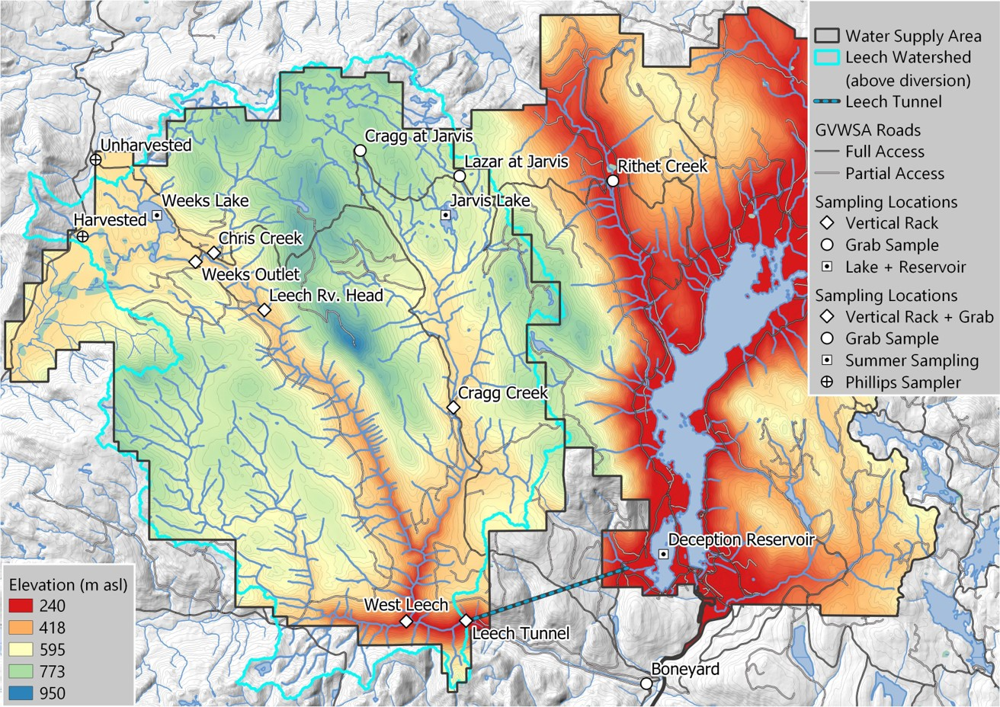
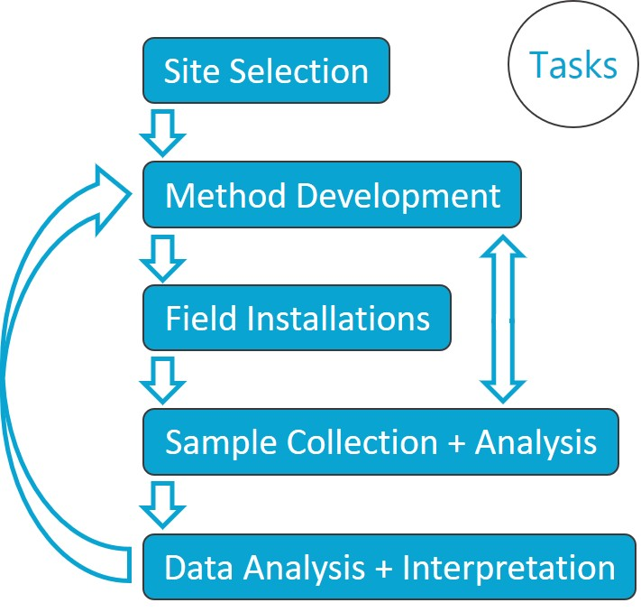
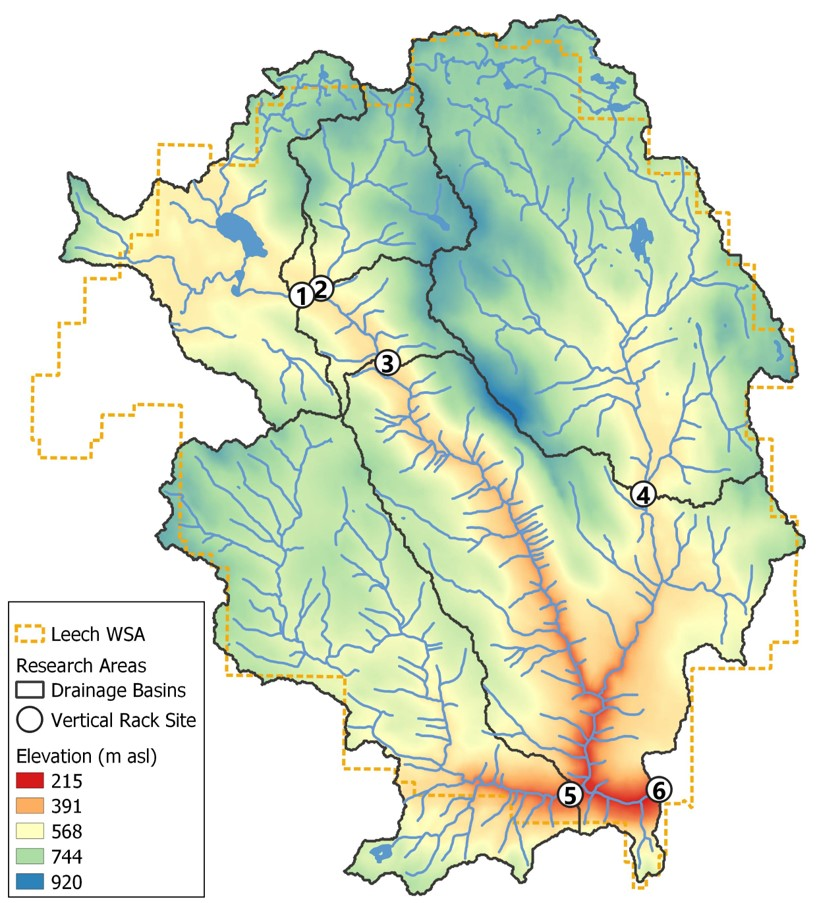
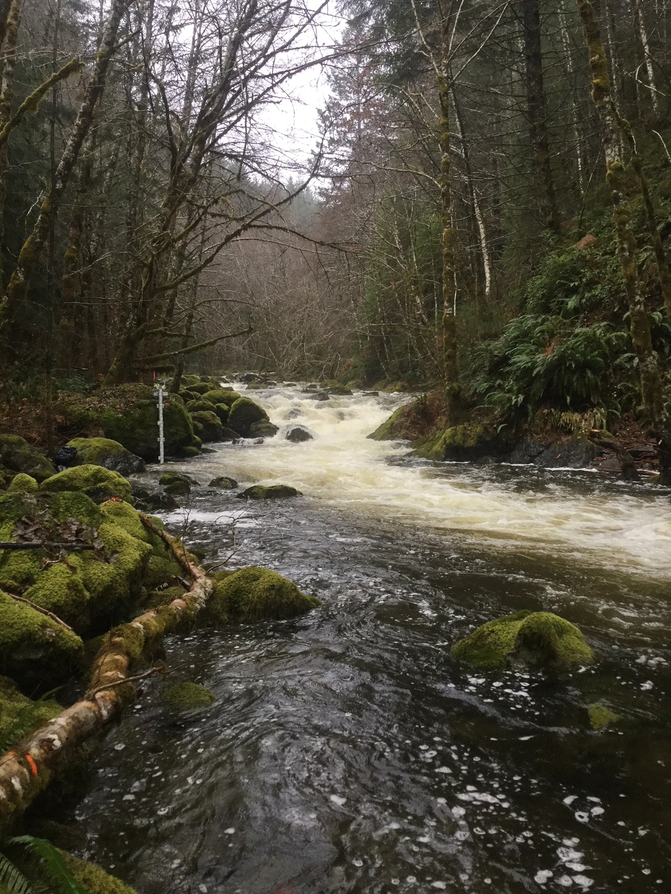
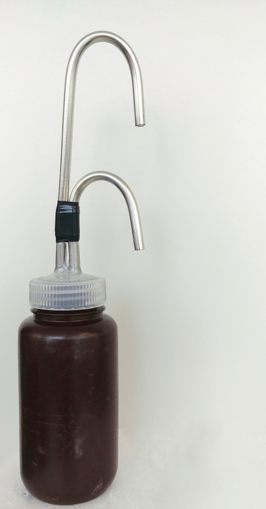
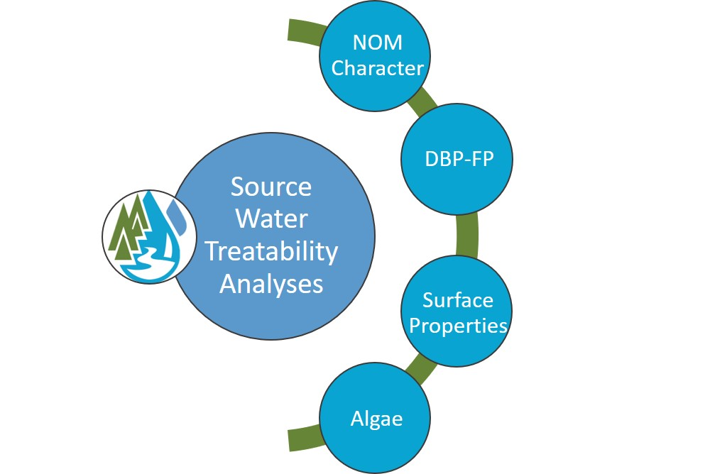
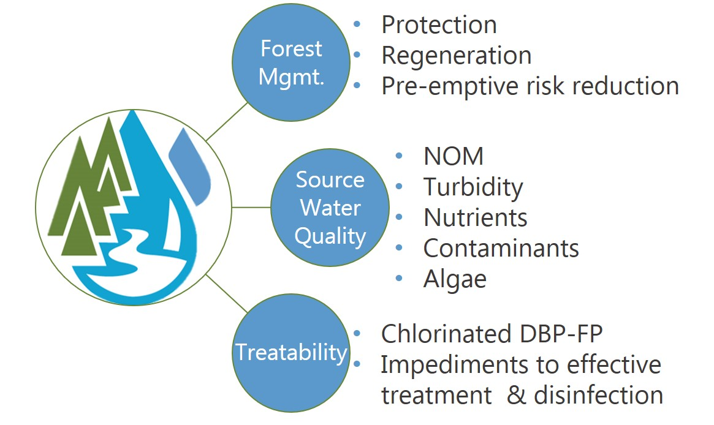

```{r setup, warning = FALSE, message = FALSE, include = FALSE}
knitr::opts_chunk$set(echo = TRUE, warning = FALSE, fig.align = "center")

# load required packages
library(tidyverse)
library(forcats)  # factors
library(here)     # practical directory navigation & file management 
library(readr)    # read in delimited files
library(knitr)    # for tidy tables
```

## Acronyms

|Acronym | Term | Definition |
|:-------|:-----|:-----------|
|NOM| natural organic matter| diverse carbon-based compounds found in natural, engineered, terrestrial and aquatic environments |
|DOM | dissolved organic matter | organic compounds operationally defined as finer than 0.45 um in diameter|
|DOC| dissolved organic carbon | organic carbon compounds operationally defined as finer than 0.45 um in diameter. The majority of DOM is DOC.|
|NPOC| non-purgeable organic carbon | instrumental parameter measured to quantify organic carbon (e.g. on a Shimadzu TOC-V analyzer). An aqueous sample is acidified to below pH 2 to convert inorganic carbon (e.g. carbonates) to carbon dioxide (CO2), the sample is then sparged with hydrocarbon-free air to drive off CO2, then the sample is combusted at high temperatures to convert the remaining organic carbon to CO2 which is detected with a non-dispersive infrared gas analyzer.|
|DBP-FP | Disinfection By-Product Formation Potential | The likelihood of creating DBPs(e.g. trihalomethanes, halogenic acetic acids, Haloacetonitrils, haloketons) when natural source water is chlorinated |
| LWSA | Leech Water Supply Area | Future water supply area anticipated to supplement the primary water supply (Sooke Reservoir) for the Greater Victoria Area via inter-basin transfer. LWSA is the research site for this thesis' field work. |   
| CRD | Capital Regional District | The governing/municipal body for the Greater Victoria Area, and the managing group for water supply and watershed management. The CRD are partners in the forWater Network and hosted this thesis research in the Leech Water Supply Area.|
|GVWSA | Greater Victoria Water Supply Area | 20,549 hectares of protected drinking water catchment lands owned and operated by the Capital Regional District. Includes the Sooke Lake watershed and reservoir (primary supply source), Goldstream watershed and reservoir system (secondary supply) and the Leech River watershed (future water supply area, and the study site of this thesis research) |


## Acknowledgements

This research work would not have been possible without the support and accommodation of the Capital Regional District (CRD) Watershed Protection and Management Division, Integrated Water Services (IWS) (Victoria, BC). In particular, we would like to acknowledge the help, support and assistance provided by the following people, as well as the entire Field Operations Staff  

* Tobi Gardner  | Senior Hydrologist
* Joel Ussery | Manager, Resource Planning
* Annette Constabel | Senior Manager
* Christoph Moch  | Manager, Water Quality Operations
* Kathy Haesevoats  | Watershed Technologist
* Ryan Biggs  | Watershed Technician 2, Resource Planning(?)
* Burn Hemus  | ?
* Jessica Dupuis  | ?? Water Quality Operations 
* Nigel Burrows | Manager Watershed Fire, Security and Emergency Response
* Patrick McCoubrey | Security Chargehand
* Devon Barnes | Watershed Protection Senior Supervisor  


  
This research also would not have been possible without the support and encouragement from academic supervisors and partners from the NSERC forWater Network for Forested Drinking Water Source Protection Technologies:  

* Bill Floyd  | Academic co-supervisor | Adjunct Professor, Geography, Vancouver Island University & Research Hydrologist, BC-FLNRO
* Mark Johnson  | Academic co-supervisor | Professor and Canada Research Chair, University of British Columbia
* Mike Stone  | Professor, Faculty of Environment, Dept. of Geography and Environmental Management, University of Waterloo
* Dana Harriman | Network Manager, University of Waterloo
* Monica Emelko | Principle Investigator, Scientific Director, University of Waterloo
* Uldis Silins  | Co-Principle Investigator, Co-Scientific Director, University of Alberta
* Danielle Lindamood |(former) Knowledge Mobilization Manager
* Allie Dusome | Communications Officer, the Water Institute, University of Waterloo
* Axel Anderson	| Professor, Faculty of Agricultural, Life and Environmental Science, Renewable Resources Dept., University of Alberta  

  
For help with field installations, a big thanks to my former field partner, Stewart Butler, of Bill Floyd's Coastal Hydrology Research Lab; thanks Stew. Thanks also to Alison Bishop for field assistance during the winter of 2019/2020.    

Last but certainly not least, thanks to my friends and family for encouraging and supporting me in my scientific and academic pursuits. I really appreciate all the love. 
	
	
# 1. Introduction (extended)

## Literature Review (including:)
### Source water quality and rain events
### Stormflow and sampling (including passive sampling techniques and advantages)
### Dissolved organic carbon and water treatment
### Dissolved organic carbon correlated to other parameters
### protected watersheds

## Background: Greater Victoria Regional Water Supply System (possible appendix)
The Capital Regional District (CRD) owns and operates the water supply system for the Greater Victoria region. As a water purveyor, CRD supplies an average of 130 million liters of treated water to customers each day (130,000 m^3^day^-1^) [@CapitalRegionDistrict2017]. The provision of safe and sustainable drinking water has three tiers of regulation above the CRD: federal, provincial, and regional. Federally, Health Canada publishes Canadian Drinking Water Quality Guidelines which outline quantitative bounds for microbial, chemical, radiological parameters and physical aesthetic characteristics for safe drinking water. The province of British Columbia sets requirements for planning, reporting and regualting of drinking water providers through the Drinking Water Protection Act and the Water Sustainability Act, and the Public Health Act and Regulations. Regionally, the CRD reports to the Vancouver Island Health Authority (Island Health) regarding water quality information and provincial legislation.    

The Greater Victoria Water Supply Area (GVWSA) includes 20,549 hectares (205.49 km^2^) of protected drinking water catchment lands. The primary water supply is sourced from Sooke reservoir, the secondary supply source is Goldstream reservoir and the designated (supplemental) future water supply is the Leech River watershed {FIGURE YYY, figure of watersheds with insert of VanIsle (small) and western north america (even smaller)}. Unfiltered source water is first treated with ultraviolet light and free chlorine (to deactive parasites, bacteria and viruses); secondarily, ammonia is added to produce chloramine, a long-lasting disinfectant that persists through distribution systems [@CapitalRegionDistrict2017].  
 
The Leech River watershed is a sub-catchment of the Sooke River watershed (~25% by area), located west of Sooke Reservoir (primary water supply for the Greater Victoria Area). In anticipation of future water demands and uncertainty related to rainfall and climate change, the Capital Regional District (CRD) purchased 9,628 hectares (about 92%) of the Leech River watershed in 2007 (84%) and 2010 (additional 8%), and designated the Leech Water Supply Area (LWSA) for future supplemental water supply. 

In 1977, the CRD obtained a provincial water licence authorizing the diversion of up to 30.6 million cubic meters per year from the Leech River to the Sooke Reservoir [@Ussery2015]. Based on the 2017 strategic plan statement of a daily average water supply of 130,000 m^3^ [-@CapitalRegionDistrict2017], the Leech water license could contribute about 65% of 2017 average water supply. The license allows diversion only as long as minimum flows (>5.7 m^3^s^-1^) are maintained to protect fish and downstream ecology [@Ussery2015]. Based on current hydroclimatic dynamics, the water license flow requirements will exclude the summer months from inter-basin transfer and limit streamflow diversion to the winter (November to approximately April). The Leech Tunnel was constructed in the 1980's to transfer Leech River water into the Sooke Reservoir. The Tunnel is not currently operational, and it's anticipated that inter-basin transfer won't be required until 2050 or later. 

>To prepare for the eventual use of the LWSA, further work is required to plan for the water quality impacts of the different raw water sources, rehabilitation of the water supply area forests and drainage structures, and infrastructure necessary to convey the LWSA flows into Sooke Lake Reservoir 
> ~[@CapitalRegionDistrict2017] 
  

## Research Area: Leech River Watershed

The Leech River watershed ("the Leech") is located on south-east Vancouver Island, British Columbia, Canada. Like most of coastal BC, it is in the Coastal Western Hemlock Biogeoclimatic Zone. The hydroclimatic regime of the Leech is pluvial (i.e. rain-dominated). Annual rainfall is typically between xxxx - yyyy mm (~2500 mm/yr). This areas has a strong seasonal distribution of rainfall: approximately 90% of rain falls from September to April, with only about 10% of annual rainfall occurring from May to August [*REFS*]. Across the Leech, elevation ranges from approximately 200 m above sea level (asl), near the Leech Tunnel, to 941 m asl in the centre of the watershed, at the top of Survey Mountain. While the majority of precipitaiton falls as rain, snow does accumulate for short periods at higher elevations. 

Around 99% of the Leech WSA is forested. The Leech forests are dominated by western red cedar, western hemlock, and Douglas fir; subspecies include Amabalis fir (Pacific silver fir), white pine, yellow cedar (at higher elevations), Alder, broadleaf maple, and arbutus. Prior to purchase by the CRD, the LWSA was privately managed forest land that was harvested from the mid-1940's to 2007 [@Ussery2015]. Approximately 95% of the Leech watershed was harvested by clear cut prior to 2007 [@Ussery2015, @CRD2019]; as a result, ~94% of LWSA forests are younger than 60 years old and a large portion of stands are under 30 years of age. Now designated as a Water Supply Area, the CRD manages the Leech for source water protection, ecosystem services, and forest resilience. As forest fires pose a serious threat to monocultured and even-aged stands (*REFS*), particularly during the drought of summer, forest fuel management is an important preemptive risk reduction for the CRD [@CRD2019]. 

The Leech River system is composed of three mainstem rivers, numerous tributaries, and four small headwater lakes. Hydrologic responses vary with terrain steepness, soil infiltrability, vegetation, percent cover of lakes and wetlands, air temperature and the intensity and duration of precipitation. In the Leech, runoff peaks in the winter under saturated conditions. In the wet season, rivers in the Leech watershed are flashy: they respond rapidly to precipitation events, rising and falling dramatically. In 1993 CRD Water Services set up a hydrometric monitoring station on the Leech River (about 3.5 km downstream of the Tunnel) to measure discharge with hourly stage measurments [@Ussery2015]. Peak flow on the lower Leech River was recorded as 168 m^3^s^-1^ (in October, 2003) [@Ussery2015]. However, the rating curve at this historic gauging station was not verified over time and hydraulic action rendered it fairly unreliable.

Overall, the hydrology of the LWSA is poorly understood, as are water quality dynamics. In the mid-1980's, some water was transfered from the Leech River into Deception Gulch and Reservoir (adjacent to but physically separated from Sooke Reservoir). The mixing resulted in biological water quality problems that included odour and raised concerns about the operational usage of the existing tunnel. The Leech River Tunnel and anticipated inter-basin transfer will provide interesting research opportunities which are beyond the scope of this thesis research. Before work is done on inter-basin transfers, the hydrology and water quality of the Leech River system need to be better understood. Understanding source water quality, as well as the timing and magnitude of flows, is an essential component to multiple barrier approach to ensuring clean drinking water.       

**this image to be replaced with a better version**



### Research Objectives 

As part of the Pacific Maritime Research Platform in forWater's _'Watershed Science and Forest Management'_ Theme, this thesis research was carried out in partnership with the CRD in the future water supply area of the Leech River watershed. This research project was designed to contribute to the characterization of the LWSA and better our understanding of spatial and temporal variability in DOC dynamics across a second growth forested catchment. This work set out to establish a baseline understanding of hydrologic responses and water quality variabilty in rivers across the LWSA, contributing to the CRDs ongoing pursuit of characterizing the Leech. The hope is that some of the research presented here can be used by the CRD as baseline data for future experimental forest treatments (e.g. prescribed burns for forest fuel management).

This research included advanced synoptic sampling within stormflow, supplemented with standard grab samples between storm events and during summer baseflow. Discrete samples of river water were collected passively during the rising limb of stormflow *(falling limb prototype in progress)* using low-powered, low-cost, custom-built vertical rack samplers that included water level loggers. By collecting samples during stormflow, rather than sampling opportuniticly via grab sample, a more robust understanding of water quality dynamics was achieved. Using low-powered passive sampling techniques allowed for six (6) research sites to be equipped with monitoring/sampling racks, providing fairly good spatial resolution of hydrochemical variability across the watershed, while removing concerns of power supply/consumption or electronic failures.  

The research presented in this thesis focused on describing the spacial and temporal patterns and trends in water quality across the Leech River watershed. Spatial variability was addressed by setting up parallel monitoring stations at six locations respresenting two headwater streams, three mainstem rivers, and the future point of diversion for the Leech River system. Temporal variability was addressed at the seasonal scale via continuous 16 month study (October 2018 to February 2020), and on a shorter timeframe, at the scale of stormflow. The research questions and hypotheses addressed here were:

__1.__ How do water quality and hydrologic response vary across the Leech Water Supply Area?
    * ___Hypothesis 1.1:___ The headwater site with wetland characteristics will have the overall highest DOC concentration.
    * ___Hypothesis 1.2:___ DOC concentrations will be inversely related to drainage area and will decrease from headwaters to mouth.
    
__2.__ What are the temporal patterns in water quality changes, both seasonally and within stormflow?
    * ___Hypothsis 2.1:___ Compared to late wet-season rain events, early wet-season storms will yield the highest concentrations of stream DOC (terrestrial organic matter).
    * ___Hypothesis 2.2:___ Baseflow DOC concentrations will increase over the summer (in-stream organic matter).
    
__3.__  What are the patterns in hydrochemical dynamics at the future point of diversion (Leech Tunnel), and what are the treatment implications?
    * ___Hypothesis 3.1:___ The Tunnel site will integrate characteristics of each of the nested catchments (sites 1-5) with a slightly stronger signature of the West Leech River due to close proximity of its confluence.
    * ___Hypotheiss 3.2:___ The DOC concentration at the Tunnel site will be the lowest of all six sites and will not exceed drinking water quality guidelines.
  

Research objectives, based on the above research questions were to:

* Monitor water quality and water level across the LWSA,	
* Identify differences and similarities between sites (spatial) and variations over time (temporal, short and relatively long scales),
* Collaborate with forWater Network partners to assess the implications for drinking water treatment and relate findings to sub-basin characteristics. 
  

{width=40%, style="float:right; padding:10px"} 

  
### Research Sites

Six sites were selected across the Leech Water Supply Area. The six research sites represent five nested catchments and the entire water supply area basin defined from the point of (future) diversion, the Leech Tunnel. 

| Site Number | Site Name | Characteristic | Drainage Area (km^2^) | Elevation (m a.s.l) |    
|:------------|:----------|:---------------|----------------------:|--------------------:|
| 1 | Weeks Outlet  | Wetland-draining headwaters | 16.1 | XX |
| 2 | Chris Creek | Headwaters | 9.6 | XX |
| 3 | Leech Head  | Mainstem river head | 26.2 | XX|
| 4 | Cragg Creek | Mainstem river | 37.1 |  XX |
| 5 | West Leech | Mainstem river | 35.2 | XX |
| 6 | Leech Tunnel| Future diversion point | 98.7 | XX |
_*Sites 1 and 2 monitor subcatchments of the site 3 drainage area._



Note that Strahler order was used to define stream orders, such that a headwater creek is assigned first order, and the confluence of two headwater streams creates a second order stream, two second order streams join to become a third order, and so on (i.e headwaters are lowest number, mouth is highest).

#### 1. Weeks Outlet

The Weeks Outlet research site monitors water draining approximately 16 km^2^ of the northwest Leech River watershed, including a wetland (Jordan Meadows fen) and Weeks Lake (approximately 27 ha) [@Ussery2015]. Jordan Meadows wetland drains to the east and joins the outflow of Weeks Lake (south end of the lake). The wetland and lake outflow streams join and flow east to Research Site #1, "Weeks Outlet", which is a third order stream (Strahler) of the western headwaters of Leech River. The channel is fairly straight and bed material is primarily silt/clay. The water at this site was noteabley tannin-coloured.  This research site was located about 0.4 km west (upstream) of the confluence with Chris Creek. 
    
A large culvert upstream of the monitoring site was replace with a bridge in August of 2019. The culvert had been perched above the streambed level and was obstructing the movement of fish and water flow. Prior to the culvert removal, several groundwater seeps were observed downstream; these seeps maintained base flow of summer waters in this low-relief stream reach.  There were high levels of iron (above guidlines for aesthetic objectives) in the water downstream of the culvert, possibly due to culvert rust. 
```
{width=50%} {width=50%}
```

#### 2. Chris Creek

Chris Creek is the western headwaters of Leech River. This research site is approximately 0.2 km east (upstream) of the confluence with the Weeks Outlet stream. The study site on Chris Creek monitors waters draining from approximately 9.6 km^2^ of forested land, including Worley Lake (approximately 3.5 ha) [@Ussery2015]. The monitoring site of Chris Creek was downstream of a bridge, on a slightly sinuous reach with boulders and bedrock dominated morphology and turbulent cascading step-pools. There is a brige that passes over Chris Creek and a large collection of coarse woody debris downstream of the bridge, upstream of the monitoring site.     
```
{width=50%} {width=50%}
```

#### 3. Leech Head

Research site 3 was approxiamtely 1.4 km downstream of the confluence of Weeks Outlet stream and Chris Creek. The "Leech Head" study site was in a deep pool between riffles, it's a 4th order stream with predominantly Schist bedrock and fairly low relief (~2%) and relatively straight morphology. The water at this site was often coloured by tannins (likely from the Weeks outlet stream contributions).  There once was a logging bridge across the river at this site, and some rip-rap remains on either bank. 

{width=25%} 


#### 4. Cragg Creek

Cragg Creek is a mainstem river that originates in the northeast of the Leech River watershed. Cragg Creek is a 4th order stream and this research site location has a drainage area of approximately 37 km^2^, which includes Jarvis Lake (15 ha). The Cragg Creek research station was installed upstream of a road bridge, at a CRD hydrological monitoring site (installed over the span of this thesis project). The bed morphology at this site is Schist bedrock and the stream is straight channel with fairly high width-to-depth ratio. Upstream of the bridge Cragg Creek flows turbulently along a low slope, and downstream of the bridge it cascades into several deep pools. From the Cragg Creek research site, the river flows approximately 4.5 km through a steep revine to confluence with the Leech River (this confluence is around 6 km downstream of the Leech Head site, site #3).   

{width=25%}

{width=25%}

#### 5. West Leech

Originating in the west of the Leech River watershed, West Leech River is a 4th order mainstem river. The West Leech research site monitors a drainage area of approximately 35 km^2^ which includes a small lake (Boulder lake) at the southwest of Leech watershed. This reasearch site has boulder and bedrock substrate, fairly straight channel with relatively high width-to-depth ratio and pool-riffle morphology. The West Leech site is approxiamtely 120m upstream of the confluence with Leech mainstem (~1.5km downstream of the confluence of Cragg Creek with Leech River). 
    
{width=25%}

{width=25%}

#### 6. Leech Tunnel

This research site is at the point of future diversion, the Leech Tunnel. The Leech River is 5th order, and this research site has a drainage area of approximately 99 km^2^. The streambed here is dominated by Schist bedrock and boulders. The bedrock in the center of the channel is deeply incised, but overall the river is wider than is is deep. The Tunnel site is approximately 1km downstream of the West Leech confluence. 
```
 {width=25%, style="float:left; padding:10px"}
```


# 2. Methods (extended)

In riverine systems, peak flows are critical times for mass transport of dissolved and suspended materials. Therefore water quality sampling should include proportional representation of stormflow pulses relative to between-storm flows and baseflow. Sampling programs can range from low-cost synoptic grab sampling campaigns to high-cost programmable pump samplers (e.g. ISCO). Synoptic grab sampling was completed across the six primary Leech research sites, as well as four supplemental sites. In addition to synoptic sampling, passive sampling techniques were employed to collect stormflow samples.  

Siphon sampler background -- separate from vertical rack? Mark's suggestion

## 2.1 Vertical racks: passive water sampling on the rising limb of hydrograph 

At each of the six reserach sites (Figure 3), a vertical sampling rack was installed to monitor river stage and passively collect discrete water samples during stormflow. 

### Theory


### Design

Each vertical rack included a central stilling well (1.5" PCV pipe (conduit) with 1/2" holes drilled along the length) that had a measuring tape affixed to the front. Inside the stilling well was an [Odyssey Capacitance water level logger](http://odysseydatarecording.com/index.php?route=product/product&product_id=50). To either side of the central stilling well, slotted offset angle bars were fixed and siphon sampler bottles were attached to the slotted angle bars with hose clamps.

The siphon sampler bottles were based on a USGS single stage sediment sampler design (US U-59, 1961) which passively collect discrete water samples at a fixed stage on the rising limb of the hydrograph. The siphon samplers built for this research were 250 mL amber HDPE widemouth bottles with augmented screw caps. The caps were fit with two 1/4" (OD) stainless steel tubes, one longer than the other, both with a 180$^\circ$ bend at the top end. 



The lower tube acts as an inlet that intakes water once the stream level is at or above the crown of the bend, while the taller tube acts as a vent to allow air to exit the sample bottle as it is displaced with water. Once the sample bottle is full, there is no exchange with the surrounding stream water due to an air lock created in the vent tube bend. The validity of assuming sample collection is discrete is addressed in the _Methods QA/QC_ section (following). 

Sampling bottles could be placed at any height, and were generally staggered at 10-20 cm intervals. For each sampler bottle, the height of the intake tube (filling stage) was measured relative to the measuring tape on the central stilling well, which was referenced to the stage recored by water level logger inside to extract the date and time of sample collection (REF TO R SCRIPT).  

### Benefits, challenges and assumptions

The benefits of using these vertical racks as a method of sampling include: low cost (about $500 CND per installation), low power (two 1/2-AA batteries in each logger), self-contained (no external power source or data logger required), customizable design, passive sampling (no pumps). The downsides of using this technique are similar to any autosampler, in that someone must visit the field sites regularly for set-up and collection of samples, but because there are minimal powered components, mis-firing is not an issue. The only reason a sample wouldn't be collected was if the stream stage did not reach a bottles intake. The primary drawback of this technique is that sampling is limitied to the rising limb of the hydrograph, which limits the elucidation of stormflow water quality dynamics. There is some uncertainty about timing between sample collection and sample retrieval, every effort was made to return to each research site following precipitation events to retrieve collected samples, and it was assummed that any sample held on the rack was stable due to low air and river temperatures during the wet season. The assumption of river-as-a-refrigerator was addressed by deploying temperature sensors on each vertical rack (August 2019), and also with hold-time experiments (discussed in _Methods QA?QC_ section below).  


#### Field protocol

Following the installation of a vertical sampling rack, the field protocol was to visit the site approximately biweekly (or more frequently, based on storms) to check, collect and set the rack. Every time a site was visited, a grab sample was also collected. When a bottle was placed on its rack (attached by 3" hose clamp), the filling stage (height of intake tube crown) was recorded relative to the central still well tape. Bottles were staggered, generally from water level to approximately 120 cm above water level (as experience showed that a bottle should always be placed above the stage of anticipated peak streamflow). Following a rain event, each site was revisited to collect rack samples; for full bottles, the siphon lid was replaced with a labelled HDPE lid and samples were transported in a cooler with ice packs back to the lab and refrigerated until analysis.     

### Method QA/QC: rising limb sampler quality assurance and quality control 
The methods of passive sampling by vertical racks involve a couple of potential quality control challenges and assumptions. The two key challenges with these methods are the assumption of discrete sample collection, and sample stability during the elapsed time between collection and analysis. These issues were addressed experimentally and are discussed here. 

#### Assumption validation: samples collected are discrete (no subsequent mixing) 
##### Rising limb sampler discretion analysis
#### Assumption validation: rack samples are stable from collection to retrieval and analysis
##### Temperatures (above and below water on racks)
##### Hold-time experiments


## 2.2 Development of a modified siphon sampler designed for passive water collection on the falling limb of hydrograph 
### Theory
### Design 
### Benefits, challenges and assumptions
### Field protocol
### Method QA/QC: falling limb sampler quality assurance and quality control  
#### Assumption validation: samples collected are discrete (no premature infiltration)
##### Falling limb sampler discretion analysis 

## Gauging Streamflow (? not yet completed)
### Cross-sectional area and velocity
#### Weeks Outlet
### Manning's equation
#### Leech Head
### Salt dilution
#### Chris Creek
#### Cragg Creek
#### West Leech

## Laboratory Analysis
### Quantitative analytical methods for dissolved organic carbon
####  Direct via catalytic combution: non-purgeable organic carbon (Shimadzu TOC-V)
#### Proxy via spectrophotometry: optical absorbance (Scan Spectrolyser)
### Qualitative analytical methods
#### Molecular character of organic matter via fluorescence excitation emission (Horiba Aqualog) 
### Ancillary data: contributions from partners
* CRD FWx 
	* Chris Creek weather station 
	* Martin's Gulch weather station
* CRD turbidity
* CRD flow (Cragg, Judge, Rithet, Tunnel?)
* CRD metals
* forWater tretability
### Laboratory QA/QC: quality assurance and quality control 
#### Instrument calibration
#### Calibration verification (cal vers)

# 3. Results & Discussion 
## Spatial variability: DOC variability across the watershed 
### Synoptic grab sampling at ten locations
### Stormflow samples: compare and contrast six sites
## Temporal variability: DOC variability over time and within stormflow
### Seasonal patterns over sixteen months of data
### Stormflow samples: variability within six sites 

# 5. Conclusions
## Characterizing the Leech Water Supply Area
## Understanding spatial and temporal variability in hydrochemical dynamics
## Future Directions

* How will source water with higher tannins (i.e Leech River water) affect the primary treatment process of UV disinfection (currently used for Sooke rerservoir water)? 
	* What are the operational limits of TOC (or tannins) in source water with respect to UVT system performance?
* Can UVT photodegrade TOC molecules such that DBP-FP is reduced? 
* Can UVT be used as a primary treatment to reduce the requirements for chemical filtration and reduce the solid waste generated by coagaulants?

# APPENDIX

## forWater: NSERC Strategic Network for forested drinking water source protection technologies

The forWater Network is a transdisciplinary cross-Canada applied research collaboration focused on the connections between treated drinking water quality and land-use impacts of forest management. The majority of source drinking water originates in forested headwaters, but the connection between upstream forest management and downstream treatment remains poorly understood. Across Canada, forWater researchers are studying water quality in watersheds under a variety of different forest management strategies. Through collaborative analyses, forWater is working to evaluate source water treatability metrics, downstream propagation effects, and resource economic with the ultimate goal of providing a framework for treatement demands as they relate to forest management strategies.

{width=25%}

{width=50%}

{width=50%}


# References
